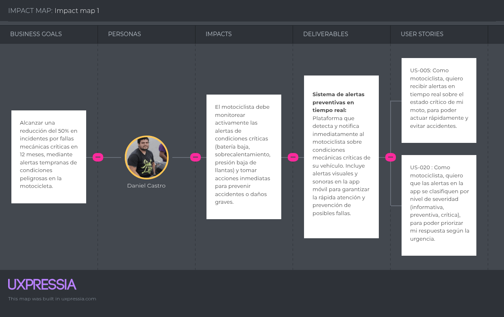
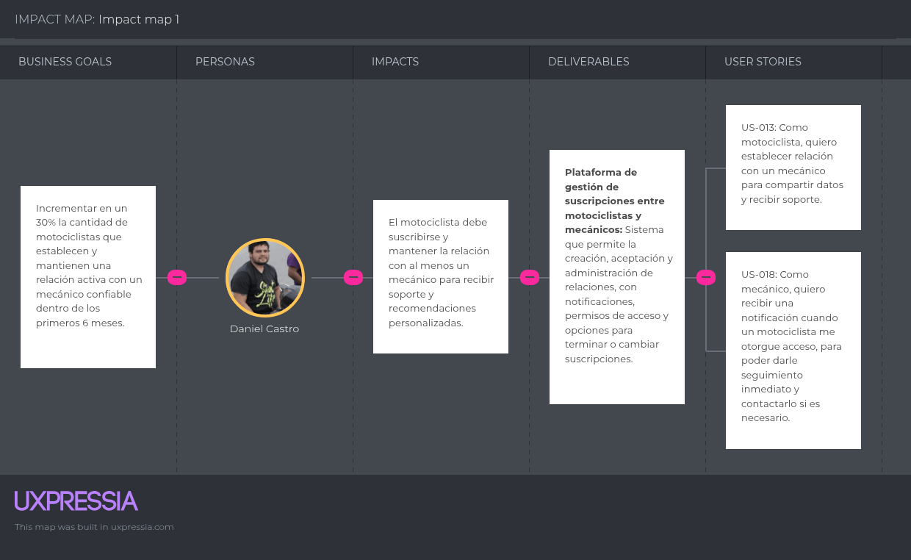
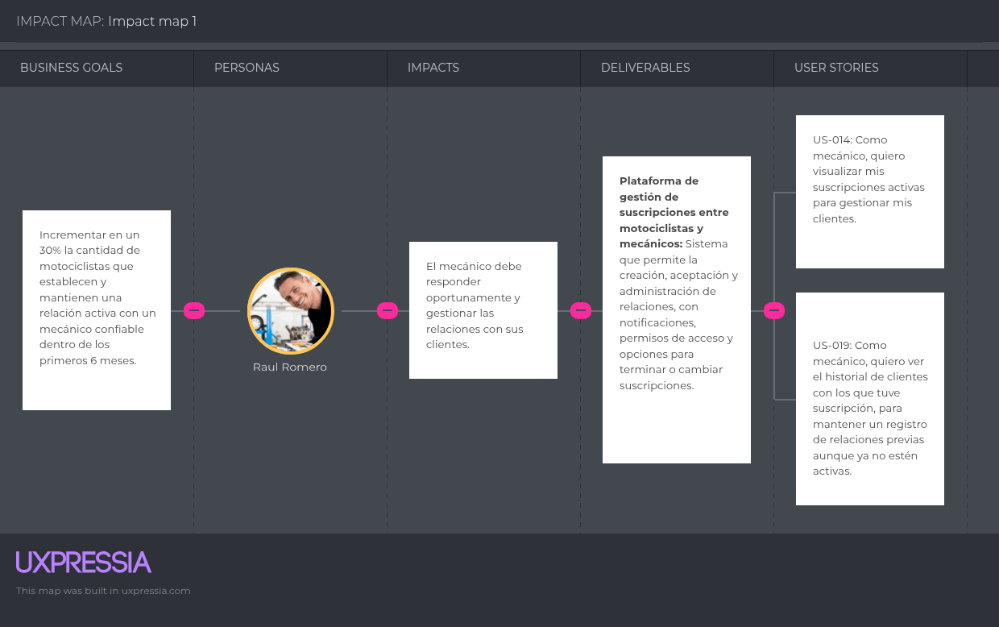
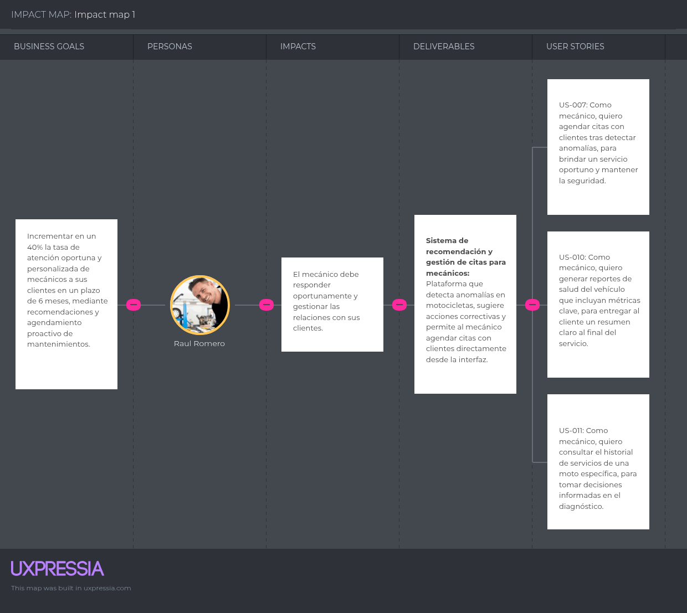

# Universidad Peruana de Ciencias Aplicadas

### **CURSO:** Desarrollo de Soluciones IoT

### **NRC**: 3443

### **Profesor:** Ángel Augusto Velásquez Núñez

### **Ingeniería de software**

## Informe de -

### **Nombre del startup:** NRG8

### **Nombre del producto:** -

## **Integrantes**

| **Nombre**                                | **Codigo** |
|-------------------------------------------|------------|
| **Alejo Cardenas Jose Antonio**           | U202122484 |
| **Astonitas Díaz Juan Diego**             | U202110237 |
| **Casas Sanchez Gabriel Alexander**       | U202220033 |
| **Pacheco Astiguetta Sebastian**          | U202110291 |
| **Paitan Pumachuca Max Anthony**          | U201314454 |
| **Pasquale Barrenechea Gianluca Santino** | U202112078 |
| **Real Calderon Sebatian Omar**           | U20221D964 |

**Agosto 2025**

## Registro de Versiones del Informe

<table>
  <thead>
    <tr>
      <th>Versión</th>
      <th>Fecha</th>
      <th>Autor</th>
      <th>Descripción de modificación</th>
    </tr>
  </thead>
  <tbody>
    <tr>
      <td></td>
      <td></td>
      <td></td>
      <td></td>
    </tr>
  </tbody>
</table>

## Project Report Collaboration Insights

El enlace a github del reporte del proyecto es el siguiente: [https://github.com/NRG-8-IOT/report](https://github.com/NRG-8-IOT/report).

## Contenido

- [Universidad Peruana de Ciencias Aplicadas](#universidad-peruana-de-ciencias-aplicadas)
    - [**CURSO:** Desarrollo de Soluciones IoT](#curso-desarrollo-de-soluciones-iot)
    - [**NRC**: 3443](#nrc-3443)
    - [**Profesor:** Ángel Augusto Velásquez Núñez](#profesor-ángel-augusto-velásquez-núñez)
    - [**Ingeniería de software**](#ingeniería-de-software)
  - [Informe de -](#informe-de--)
    - [**Nombre del startup:** NRG8](#nombre-del-startup-nrg8)
    - [**Nombre del producto:** -](#nombre-del-producto--)
  - [**Integrantes**](#integrantes)
  - [Registro de Versiones del Informe](#registro-de-versiones-del-informe)
  - [Project Report Collaboration Insights](#project-report-collaboration-insights)
  - [Contenido](#contenido)
  - [Student Outcome](#student-outcome)
  - [Capítulo I: Introducción](#capítulo-i-introducción)
    - [1.1 Startup Profile](#11-startup-profile)
      - [1.1.1 Descripción de la Startup](#111-descripción-de-la-startup)
      - [1.1.2 Perfiles de integrantes del equipo](#112-perfiles-de-integrantes-del-equipo)
    - [1.2 Solution Profile](#12-solution-profile)
      - [1.2.1 Antecedentes y problemática](#121-antecedentes-y-problemática)
      - [1.2.2 Lean UX Process](#122-lean-ux-process)
        - [1.2.2.1 Lean UX Problem Statements](#1221-lean-ux-problem-statements)
        - [1.2.2.2 Lean UX Assumptions](#1222-lean-ux-assumptions)
        - [1.2.2.3 Lean UX Hypothesis Statements](#1223-lean-ux-hypothesis-statements)
        - [1.2.2.4 Lean UX Canvas](#1224-lean-ux-canvas)
    - [1.3 Segmentos objetivo](#13-segmentos-objetivo)
  - [Capítulo II: Requirements Elicitation \& Analysis](#capítulo-ii-requirements-elicitation--analysis)
    - [2.1 Competidores](#21-competidores)
      - [2.1.1 Análisis competitivo](#211-análisis-competitivo)
      - [2.1.2 Estrategias y tácticas frente a competidores](#212-estrategias-y-tácticas-frente-a-competidores)
    - [2.2 Entrevistas](#22-entrevistas)
      - [2.2.1 Diseño de entrevistas](#221-diseño-de-entrevistas)
      - [2.2.2 Registro de entrevistas](#222-registro-de-entrevistas)
      - [2.2.3 Análisis de entrevistas](#223-análisis-de-entrevistas)
    - [2.3 Needfinding](#23-needfinding)
      - [2.3.1 User Personas](#231-user-personas)
      - [2.3.2 User Task Matrix](#232-user-task-matrix)
      - [2.3.3 User Journey Mapping](#233-user-journey-mapping)
      - [2.3.4 Empathy Mapping](#234-empathy-mapping)
    - [2.4 Big Picture EventStorming](#24-big-picture-eventstorming)
    - [2.5 Ubiquitous Language](#25-ubiquitous-language)
  - [Capítulo III: Requirements Specification](#capítulo-iii-requirements-specification)
    - [3.1 User Stories](#31-user-stories)
    - [3.2 Impact Mapping](#32-impact-mapping)
    - [3.3 Product Backlog](#33-product-backlog)
  - [Capítulo IV: Solution Software Design](#capítulo-iv-solution-software-design)
    - [4.1 Strategic-Level Attribute-Driven Design](#41-strategic-level-attribute-driven-design)
      - [4.1.1 Design-Level EventStorming](#411-design-level-eventstorming)
        - [4.1.1.1 Candidate Context Discovery](#4111-candidate-context-discovery)
        - [4.1.1.2 Domain Message Flows Modeling](#4112-domain-message-flows-modeling)
        - [4.1.1.3 Bounded Context Canvases](#4113-bounded-context-canvases)
      - [4.1.2 Context Mapping](#412-context-mapping)
      - [4.1.3 Software Architecture](#413-software-architecture)
        - [4.1.3.1 Software Architecture System Landscape Diagram](#4131-software-architecture-system-landscape-diagram)
        - [4.1.3.2 Software Architecture Context Level Diagrams](#4132-software-architecture-context-level-diagrams)
        - [4.1.3.3 Software Architecture Container Level Diagrams](#4133-software-architecture-container-level-diagrams)
        - [4.1.3.4 Software Architecture Deployment Diagrams](#4134-software-architecture-deployment-diagrams)
    - [4.2 Tactical-Level Domain-Driven Design](#42-tactical-level-domain-driven-design)
      - [4.2.1 Bounded Context: unnamed](#421-bounded-context-unnamed)
        - [4.2.1.1 Domain Layer](#4211-domain-layer)
        - [4.2.1.2 Interface Layer](#4212-interface-layer)
        - [4.2.1.3 Application Layer](#4213-application-layer)
        - [4.2.1.4 Infrastructure Layer](#4214-infrastructure-layer)
        - [4.2.1.5 Bounded Context Software Architecture Component Level Diagrams](#4215-bounded-context-software-architecture-component-level-diagrams)
        - [4.2.1.6 Bounded Context Software Architecture Code Level Diagrams](#4216-bounded-context-software-architecture-code-level-diagrams)
          - [4.2.1.6.1 Bounded Context Domain Layer Class Diagrams](#42161-bounded-context-domain-layer-class-diagrams)
          - [4.2.1.6.2 Bounded Context Database Design Diagram](#42162-bounded-context-database-design-diagram)
  - [Conclusiones](#conclusiones)
  - [Bibliografía](#bibliografía)
  - [Anexos](#anexos)

## Student Outcome

El curso contribuye al cumplimiento del Student Outcome ABET:

**ABET – EAC - Student Outcome 5**

Criterio: *La capacidad de funcionar efectivamente en un equipo cuyos miembros juntos proporcionan liderazgo, crean un entorno de colaboración e inclusivo, establecen objetivos, planifican tareas y cumplen objetivos.*
En el siguiente cuadro se describe las acciones realizadas y enunciados de
conclusiones por parte del grupo, que permiten sustentar el haber alcanzado el logro
del ABET – EAC - Student Outcome 5.

<table>
  <thead>
    <tr>
      <th style="text-align: left;">Criterio específico</th>
      <th style="text-align: left;">Acciones realizadas</th>
      <th style="text-align: left;">Conclusiones</th>
    </tr>
  </thead>
  <tbody>
    <tr>
      <td><strong>Trabaja en equipo para proporcionar liderazgo en forma conjunta</strong></td>
      <td>
        -
      </td>
      <td>
        -
      </td>
    </tr>
    <tr>
      <td><strong>Crea un entorno colaborativo e inclusivo, establece metas, planifica tareas y cumple objetivos.</strong></td>
      <td>
        -
      </td>
      <td>
        -
      </td>
    </tr>
  </tbody>
</table>

## Capítulo I: Introducción

### 1.1 Startup Profile

#### 1.1.1 Descripción de la Startup

#### 1.1.2 Perfiles de integrantes del equipo

### 1.2 Solution Profile

#### 1.2.1 Antecedentes y problemática

#### 1.2.2 Lean UX Process

##### 1.2.2.1 Lean UX Problem Statements

##### 1.2.2.2 Lean UX Assumptions

##### 1.2.2.3 Lean UX Hypothesis Statements

##### 1.2.2.4 Lean UX Canvas

### 1.3 Segmentos objetivo

## Capítulo II: Requirements Elicitation & Analysis

### 2.1 Competidores

#### 2.1.1 Análisis competitivo

#### 2.1.2 Estrategias y tácticas frente a competidores

### 2.2 Entrevistas

#### 2.2.1 Diseño de entrevistas

#### 2.2.2 Registro de entrevistas

#### 2.2.3 Análisis de entrevistas

### 2.3 Needfinding

#### 2.3.1 User Personas

#### 2.3.2 User Task Matrix

#### 2.3.3 User Journey Mapping

#### 2.3.4 Empathy Mapping

### 2.4 Big Picture EventStorming

### 2.5 Ubiquitous Language

## Capítulo III: Requirements Specification

### 3.1 User Stories

Epicas:

# Épicas

| Código  | Título                                              | Descripción                                                                                                                                                                                                 |
|---------|------------------------------------------------------|-------------------------------------------------------------------------------------------------------------------------------------------------------------------------------------------------------------|
| EP-001  | Monitoreo inteligente del estado de la moto          | Desarrollar una aplicación móvil que permita a los motociclistas visualizar en tiempo real métricas clave de su motocicleta (batería, kilometraje, consumo de combustible, temperatura, presión de neumáticos y vibraciones), facilitando decisiones informadas y la prevención de fallas. |
| EP-002  | Sistema de alertas preventivas y recordatorios       | Implementar un sistema que notifique a motociclistas y talleres sobre mantenimientos, condiciones críticas o fallas recurrentes mediante alertas en la app, para anticipar problemas, reducir riesgos y mantener una agenda organizada. |
| EP-003  | Gestión del historial de mantenimiento y gastos      | Desarrollar funcionalidades que permitan a motociclistas y talleres registrar el historial de mantenimientos y los costos de reparaciones, repuestos y servicios. La información debe visualizarse en reportes claros (mensuales o por evento) y estar disponible para ambos, fomentando transparencia, planificación y fidelización, reemplazando métodos manuales por una solución digital confiable. |
| EP-004  | Desarrollo e integración del dispositivo embebido de telemetría | Diseñar e integrar un dispositivo IoT que recolecte en tiempo real datos críticos de la moto y los transmita de forma segura a la plataforma. Incluye desarrollo de firmware, pruebas de sensores, compatibilidad con distintos modelos y validación de la conexión con la app mediante protocolos eficientes. |
| EP-005  | Gestión de relación entre motociclista y mecánico    | Funcionalidades para crear y administrar la relación entre un motociclista y su mecánico de confianza, permitiendo compartir métricas de la moto en tiempo real y recibir notificaciones. Estas relaciones podrán modificarse o terminarse según las necesidades de ambas partes. |
| EP-006  | Diseño de la landing page                           | Como equipo de desarrollo, queremos diseñar y construir una landing page atractiva, informativa y fácil de navegar, que comunique claramente el valor de la plataforma tanto para motociclistas como para mecánicos, con el objetivo de captar nuevos usuarios, generar confianza y facilitar el registro en el sistema. |
| EP-007  | Gestión de Motos                                    | Administra toda la información relacionada con el ciclo de vida de las motocicletas dentro del sistema. Define los procesos de registro, consulta, actualización y baja de las motos, garantizando la integridad y consistencia de los datos. |

User Stories:

| User Story ID | Título | Descripción | Criterios de Aceptación | Relacionado con (Epic ID) |
| :--- | :--- | :--- | :--- | :--- |
| US-001 | Visualización del consumo de combustible en tiempo real | Como motociclista, quiero visualizar en tiempo real el consumo de combustible de mi moto, para poder optimizar mi forma de conducir y ahorrar gastos. | Escenario 1:  Dado que el motociclista está conduciendo la motocicleta con la aplicación conectada, cuando accede al panel de métricas en tiempo real, entonces el sistema debe mostrar el consumo actual de combustible en L/100km y el valor debe actualizarse continuamente durante la conducción    Escenario 2: Dado que el motociclista ha finalizado un recorrido con la aplicación activa, cuando solicita ver el resumen del viaje completado, entonces el sistema debe mostrar el consumo promedio de combustible del trayecto en km/L y debe incluir la distancia total recorrida y el tiempo de viaje. | EP-001 |
| US-002 | Registro de gastos de mantenimiento y repuestos | Como motociclista, quiero registrar los gastos de mantenimiento y repuestos que realizo, para llevar un control acumulado mensual o por kilometraje. | Escenario 1:  Dado que el motociclista ha accedido a la sección de registro de gastos, cuando ingresa el monto, la descripción, la fecha y el tipo de gasto, y confirma el registro, entonces el sistema guarda la información y actualiza automáticamente los acumulados mensuales y por kilometraje correspondientes.    Escenario 2:  Dado que el motociclista está en la sección de métricas de gastos, cuando selecciona filtrar por mes, tipo de gasto o rango de kilometraje, y solicita ver el historial, entonces el sistema muestra el total invertido y el listado de gastos según los filtros aplicados. | EP-001 |
| US-003 | Acceso al historial de servicios realizados | Como motociclista, quiero acceder fácilmente al historial de servicios realizados en mi moto, para saber cuándo fue la última vez que hice mantenimiento y qué se reparó. | Escenario 1:  Dado que existe un historial de servicios de mantenimiento registrados para la motocicleta del usuario, cuando el motociclista accede a la sección de historial y selecciona un servicio específico de la lista, entonces el sistema muestra un detalle completo que incluye fecha exacta del servicio, tipo de mantenimiento realizado, nombre del taller o mecánico, repuestos utilizados con sus respectivas referencias, costo del servicio y kilometraje en el momento del mantenimiento.    Escenario 2:  Dado que el historial de servicios contiene múltiples registros de mantenimiento de diferentes fechas y tipos, cuando el motociclista ingresa criterios de búsqueda específicos (rango de fechas, tipo de servicio, taller o repuesto utilizado) y ejecuta la consulta, entonces el sistema filtra la base de datos y presenta solamente los registros que coinciden exactamente con todos los criterios aplicados, ordenados cronológicamente. | EP-001 |
| US-004 | Comparación de métricas entre motos similares | Como mecánico, quiero comparar las métricas de dos motos similares, para detectar posibles problemas o desviaciones en el rendimiento que requieran revisión. | Escenario 1:  Dado que existen en el sistema two motocicletas del mismo modelo y año con métricas registradas, cuando el mecánico selecciona ambas motos y solicita comparar sus métricas, entonces el sistema muestra una vista lado a lado con el consumo de combustible, temperatura de operación, kilometraje y alertas de mantenimiento.    Escenario 2:  Dado que la comparación entre dos motocicletas similares muestra variaciones significativas en sus métricas de rendimiento, cuando el mecánico revisa el reporte de comparación, entonces el sistema destaca las diferencias críticas y proporciona sugerencias de posibles problemas mecánicos que podrían causar dichas discrepancias. | EP-001 |
| US-005 | Notificación de alerta por consumo excesivo. | Como motociclista, quiero que el aplicativo móvil me notifique en caso de que el sistema detecte un consumo anormalmente alto de combustible por kilómetro. | Escenario 1:  Dado que el consumo de combustible durante un trayecto supera los parámetros establecidos como normales para el modelo de la motocicleta, cuando este consumo anormalmente alto se mantiene durante al menos 15 minutos de conducción continua, entonces el sistema emite una notificación push en el aplicativo móvil alertando al usuario sobre el alto consumo de combustible.    Escenario 2:  Dado que el consumo de combustible había superado los parámetros normales y se había emitido una alerta previa, cuando el consumo se mantiene dentro de los rangos normales establecidos durante los últimos 10 minutos de conducción, entonces el sistema envía una notificación push al usuario informando que el consumo de combustible se ha normalizado y la alerta previa ha sido desactivada. | EP-02 |
| US-006 | Notificación de alerta por presión de llantas. | Como motociclista,  quiero que el aplicativo móvil me notifique cuando la presión de las llantas sea anormal,  para poder tomar acciones preventivas que garanticen mi seguridad y el buen estado de la motocicleta. | Escenario 1:  Dado que la presión de una o más llantas de la motocicleta está por debajo del rango recomendado por el fabricante, cuando esta condición de baja presión se mantiene durante más de 5 minutos de conducción continua, entonces el sistema envía una notificación push al usuario especificando qué llanta(s) requiere(n) revisión inmediata y mostrando los valores de presión actuales.    Escenario 2:  Dado que la presión de las llantas que habían estado por debajo del rango recomendado ahora se encuentra dentro de los parámetros normales, cuando esta condición estable se mantiene durante al menos 5 minutos de conducción continua, entonces el sistema envía una notificación push al usuario informando que la presión de las llantas se ha normalizado e indicando los valores actuales dentro del rango seguro. | EP-002 |
| US-007 | Recomendación de mantenimiento. | Como mecánico, quiero poder agendar citas con mis clientes en caso de detectar alguna medida anómala en sus motocicletas desde mi interfaz, para brindar un servicio oportuno y mantener la seguridad de sus vehículos. | Escenario 1:  Dado que el sistema ha detectado una medida anómala en los datos de rendimiento de la motocicleta de un cliente registrado, cuando el mecánico accede a la interfaz de gestión de clientes y selecciona al cliente afectado, entonces el sistema muestra las métricas anómalas y permite generar una recomendación de mantenimiento con la posibilidad de proponer una cita en el calendario disponible.    Escenario 2:  Dado que existe una cita de mantenimiento propuesta por el mecánico para un cliente específico, cuando el cliente confirma la cita a través de la aplicación móvil, entonces el sistema registra automáticamente la cita en la agenda del mecánico, marca el horario como ocupado y envía notificaciones de confirmación tanto al mecánico como al cliente con los detalles de la cita.    Escenario 3:  Dado que existe una cita de mantenimiento propuesta por el mecánico pendiente de confirmación, cuando el cliente rechaza la cita o solicita reprogramación a través de la aplicación móvil, entonces el sistema notifica inmediatamente al mecánico sobre la respuesta del cliente, libera el horario previamente reservado y habilita la opción para que el mecánico pueda proponer una nueva fecha y hora disponible. | EP-002 |
| US-008 | Notificación de sobrecalentamiento del motor | Como motociclista,  quiero que el aplicativo móvil me notifique cuando el motor de mi motocicleta esté presentando un sobrecalentamiento,  para poder detenerme a tiempo y evitar daños mayores al vehículo o accidentes. | Escenario 1:  Dado que la temperatura del motor de la motocicleta ha superado el límite máximo seguro establecido por el fabricante, cuando esta condición de sobrecalentamiento se mantiene durante más de 60 segundos consecutivos, entonces el sistema emite una notificación de alerta urgente al usuario indicando el riesgo de sobrecalentamiento y recomendando detener la marcha de manera segura.    Escenario 2:  Dado que la temperatura del motor había superado los límites seguros y se había emitido una alerta de sobrecalentamiento, cuando la temperatura regresa y se mantiene dentro del rango normal durante al menos 5 minutos consecutivos, entonces el sistema envía una notificación al usuario informando que la temperatura del motor se ha normalizado y la alerta ha sido desactivada.    Escenario 3:  Dado que se han registrado tres o más episodios de sobrecalentamiento del motor en un período de 7 días, cuando el sistema detecta este patrón recurrente anómalo, entonces el sistema notifica al usuario recomendando agendar una revisión de mantenimiento urgente y ofrece la opción de contactar directamente con un taller especializado. | EP-002 |
| US-009 | Sugerencias personalizadas para próximos mantenimientos | Como motociclista, quiero recibir sugerencias personalizadas sobre el próximo mantenimiento que debo hacer, basadas en el historial y uso de mi moto. | Escenario 1:  Dado que se ha alcanzado el kilometraje o tiempo máximo recomendado para el mantenimiento de un componente específico según los intervalos establecidos por el fabricante, cuando el sistema analice el historial de servicios y el uso actual de la motocicleta, entonces generará una sugerencia personalizada indicando la necesidad de revisión o cambio del componente y mostrará el motivo basado en los criterios técnicos.    Escenario 2:  Dado que existen recomendaciones de mantenimiento pendientes generadas por el sistema para la motocicleta del usuario, cuando el motociclista acceda a la sección de sugerencias de mantenimiento en el aplicativo, entonces el sistema mostrará una lista priorizada de recomendaciones específicas con detalles sobre el componente, la razón de la sugerencia y el nivel de urgencia para cada mantenimiento requerido. | EP-003 |
| US-010 | Generación de reporte de salud del vehículo | Como mecánico, quiero generar un reporte de salud del vehículo que incluya estado de batería, temperatura, consumo y alertas recientes, para entregarlo al cliente al final del servicio. | Escenario 1:  Dado que el mecánico ha completado un servicio de mantenimiento en una motocicleta y todos los datos del vehículo están actualizados en el sistema, cuando el mecánico selecciona la opción "Generar Reporte de Salud" desde la interfaz de finalización de servicio, entonces el sistema produce un documento detallado que incluye el estado de la batería, historial de temperatura, consumo de combustible, alertas recientes y las intervenciones realizadas durante el servicio.    Escenario 2:  Dado que se ha generado exitosamente el reporte de salud del vehículo para el cliente, cuando el mecánico selecciona la opción de compartir reporte, entonces el sistema ofrece las opciones de imprimir el documento directamente o enviarlo por correo electrónico al cliente desde la misma interfaz, con un formato profesional y fácil de entender. | EP-003 |
| US-011 | Consulta del historial de servicios por parte del mecánico | Como mecánico, quiero consultar el historial de servicios realizados en una moto específica, para tomar decisiones informadas al momento del diagnóstico. | Escenario 1:  Dado que existe una motocicleta registrada en el sistema con historial de servicios previos, cuando el mecánico ingresa la placa o el nombre del cliente en el módulo de búsqueda y selecciona la motocicleta, entonces el sistema muestra el historial completo ordenado cronológicamente con detalles de fechas, tipos de servicio realizados, repuestos utilizados y talleres donde se ejecutaron los mantenimientos.    Escenario 2:  Dado que el mecánico se encuentra en el historial de servicios de una motocicleta con múltiples intervenciones registradas, cuando aplica filtros por tipo de servicio, rango de fechas o repuestos específicos, entonces el sistema muestra solamente los registros que coinciden con los criterios de filtrado, permitiendo un análisis más focused del historial de mantenimiento. | EP-003 |
| US-012 | Resumen mensual de servicios, alertas y gastos | Como motociclista, quiero ver un resumen mensual de los servicios, alertas y gastos de mi moto, para tener una visión clara de su estado y del dinero invertido. | Escenario 1:  Dado que existen registros de servicios, alertas y gastos de mantenimiento para la motocicleta durante el mes actual, cuando el motociclista accede a la sección de reportes mensuales y selecciona un mes específico, entonces el sistema genera un resumen consolidado que incluye el total de gastos, cantidad de alertas, servicios realizados, kilometraje recorrido y una calificación del estado general del vehículo.    Escenario 2:  Dado que el motociclista se encuentra en el reporte mensual de su motocicleta, cuando solicita exportar o compartir el reporte, entonces el sistema genera un documento descargable en formato PDF con gráficos de tendencias, tablas comparativas con meses anteriores y un desglose detallado de categorías de gastos para su análisis financiero. | EP-003 |
| US-013 | Subscripción con mecánico. | Como motociclista, quiero poder establecer una relación con mi mecánico de confianza dentro de la aplicación para darle acceso a los datos recopilados, así como permitirle enviarme mensajes o agendar citas. | Escenario 1:  Dado que el motociclista se encuentre en la seccion de mecanicos,  cuando seleccione al mecánico desde la lista de disponibles o ingrese un código de invitación,  entonces el sistema deberá enviar una solicitud de relación al mecánico elegido.    Escenario 2:  Dado que un motociclista ha enviado una solicitud de relación a un mecánico,  cuando el mecánico acepte la solicitud,  entonces el sistema deberá confirmar la relación establecida y otorgar al mecánico acceso autorizado a los datos del motociclista. | EP-005 |
| US-014 | Visualización de subscripciones activas con clientes. | Como mecánico, quiero poder visualizar las subscripciones activas de todos mis clientes, para tener claridad sobre qué motociclistas me han otorgado acceso a sus datos y poder gestionar mejor la relación. | Escenario 1:  Dado que existen clientes que han aceptado compartir sus datos de motocicleta con el mecánico a través de suscripciones activas, cuando el mecánico accede a la sección de gestión de suscripciones en su interfaz, entonces el sistema muestra una lista completa de todos los motociclistas con suscripciones vigentes, incluyendo nombre, modelo de moto, fecha de suscripción y nivel de acceso granted.    Escenario 2:  Dado que un cliente ha revocado recientemente his suscripción de compartir datos con el mecánico, cuando el mecánico consulta la lista de suscripciones activas o actualiza la vista, entonces el sistema excluye automáticamente a dicho cliente de la lista y lo mueve al historial de suscripciones anteriores, manteniendo un registro de la relación previa pero sin mostrar acceso actual. | EP-005 |
| US-015 | Terminación de la subscripcion con el mecanico | Como motociclista , quiero poder terminar o cambiar la relación de vinculación en cualquier momento, para asegurar mi privacidad y poder elegir un nuevo mecánico si lo deseo. | Escenario 1:  Dado que existe una suscripción activa entre el motociclista y un taller mecánico, cuando el motociclista accede a la configuración de privacidad en su aplicación y confirma la acción de "Revocar acceso", entonces el sistema elimina inmediatamente los permisos de acceso a los datos y notifica al taller sobre la terminación de la relación.    Escenario 2:  Dado que la suscripción entre el motociclista y el taller mecánico ha sido cancelada recientemente, cuando el mecánico intenta acceder a los datos históricos del vehículo o el motociclista busca información del taller en la aplicación, entonces el sistema muestra un mensaje indicando que no hay relación activa y bloquea el acceso a toda información compartida previamente hasta que se establezca una nueva vinculación explícita. | EP-005 |
| US-016 | Terminación de la subscripción con el cliente. | Como mecánico,  quiero poder terminar la relación de vinculación con un motociclista en cualquier momento,  para asegurar que no tenga acceso a mis servicios si ya no deseo mantener la relación. | Escenario 1:  Dado que existe una relación de vinculación activa entre el mecánico y un motociclista cliente, cuando el mecánico accede al perfil del cliente en su sistema y selecciona la opción "Terminar relación de vinculación", entonces el sistema revoca inmediatamente todos los permisos de acceso a los datos del cliente, elimina la motocicleta de su lista de vehículos gestionados y envía una notificación automática al motociclista informando sobre la finalización del servicio.    Escenario 2:  Dado que el mecánico ha cancelado la suscripción de vinculación con un motociclista específico, cuando el mecánico intenta acceder al historial de servicios o datos de la motocicleta del cliente, o cuando el motociclista busca información del taller en su aplicación, entonces el sistema muestra un mensaje de "Relación no activa" y restringe completamente el acceso a toda información compartida previamente, requiriendo una nueva solicitud de vinculación mutua para restaurar el acceso. | EP-005 |
| US-017 | Gestión de múltiples suscripciones con diferentes mecánicos | Como motociclista, quiero poder tener y administrar suscripciones con más de un mecánico a la vez, para consultar métricas y recibir soporte especializado en diferentes áreas o ubicaciones. | Escenario 1: Dado que el motociclista mantiene suscripciones activas con múltiples talleres mecánicos, cuando el usuario accede a la sección de gestión de suscripciones en su aplicación, entonces el sistema muestra una lista completa con todos los mecánicos suscritos, permitiendo habilitar/deshabilitar notificaciones, revocar acceso individualmente y ver el nivel de permisos granted para cada taller.    Escenario 2:  Dado que el motociclista tiene relaciones activas con varios talleres mecánicos simultáneamente, cuando recibe notificaciones o alertas relacionadas con el estado de su motocicleta, entonces el sistema identifica claramente el taller de origen en cada mensaje y permite filtrar las comunicaciones por mecánico específico para una mejor organización. | EP-005 |
| US-018 | Notificación de nuevas suscripciones | Como mecánico, quiero recibir una notificación cuando un motociclista me otorgue acceso, para poder darle seguimiento inmediato y contactarlo si es necesario. | Escenario 1:  Dado que un motociclista ha enviado una solicitud de vinculación a un mecánico,  cuando el motociclista confirme la suscripción,  entonces el sistema debe enviar una notificación push al mecánico informando sobre la nueva relación    Escenario 2:  Dado que el mecánico ha recibido una notificación de nueva suscripción,  cuando accede a la sección de suscripciones en la aplicación,  entonces el sistema debe mostrar al nuevo cliente en la lista con sus datos básicos (nombre, modelo de moto, fecha de suscripción). | EP-005 |
| US-019 | Historial de suscripciones pasadas | Como mecánico, quiero ver el historial de clientes con los que tuve suscripción, para mantener un registro de relaciones previas aunque ya no estén activas. | Escenario 1:  Dado que un cliente ha revocado o terminado su suscripción con un mecánico,  cuando el mecánico consulte la sección de historial de suscripciones,  entonces el sistema debe mostrar al cliente en un listado de relaciones pasadas con fecha de inicio y de finalización.    Escenario 2:  Dado que existen múltiples suscripciones pasadas,  cuando el mecánico aplique filtros por fecha o por cliente,  entonces el sistema debe mostrar únicamente las suscripciones que coincidan con los criterios de búsqueda. | EP-003 |
| US-020 | Notificación diferenciada de alertas críticas | Como motociclista, quiero que las alertas en la app se clasifiquen por nivel de severidad (informativa, preventiva, crítica), para poder priorizar mi respuesta según la urgencia. | Escenario 1:  Dado que el sistema detecta una condición anómala en la motocicleta,  cuando la anomalía se clasifica como informativa, preventiva o crítica,  entonces el sistema debe enviar una notificación diferenciada con un color, ícono o etiqueta que refleje el nivel de severidad.    Escenario 2:  Dado que el motociclista recibe varias alertas en la aplicación,  cuando accede a la bandeja de notificaciones,  entonces el sistema debe mostrar las alertas agrupadas y ordenadas por nivel de severidad, priorizando las críticas en la parte superior. | EP-002 |
| US-021 | Redirección al aplicativo web. | Como usuario, quiero que exista un botón en la landing page que me redirija al dashboard del aplicativo web del sistema, para acceder a este sin tener que buscar otro enlace. | Escenario 1:  Dado un usuario en la landing page de la startup, cuando hace clic en el botón "Acceder al Dashboard" ubicado en el header de la página, entonces el sistema redirige automáticamente a la URL del aplicativo web, abriendo la página de Inicio de Sesión.    Escenario 2:  Dado un usuario que ya ha iniciado sesión previamente en el aplicativo web, cuando accede a la landing page y hace clic en el botón "Dashboard", entonces el sistema verifica las credenciales almacenadas y redirige directamente al dashboard principal sin requerir un nuevo inicio de sesión. | EP-006 |
| US-022 | Redirección a la descarga del aplicativo. | Como usuario, quiero que exista un botón en la landing page que me redirija a la descarga del aplicativo móvil, para poder acceder al mismo sin tener que buscar otro enlace. | Escenario 1:  Dado que un usuario se encuentra en la landing page del aplicativo, cuando hace clic en el botón principal de "Descargar App" ubicado prominente en la página, entonces el sistema redirige automáticamente a la store correspondiente (Google Play Store o Apple App Store) según el sistema operativo de su dispositivo.    Escenario 2:  Dado que un usuario está navegando en la landing page desde un dispositivo móvil, cuando selecciona el botón de "Descargar Ahora" en la sección de llamada a la acción, entonces el sistema detecta automáticamente el tipo de dispositivo y lo redirige directamente al enlace de descarga específico para su sistema operativo sin pasos intermedios. | EP-006 |
| US-023 | Visualización de Misión y Visión de la startup. | Como usuario, quiero ver una sección en la landing page con la Misión y Visión de la startup para conocer más a detalle los objetivos del proyecto. | Escenario 1:  Dado un usuario en la landing page de la startup, cuando hace clic en la sección "Nuestra Propuesta" en el menú principal, entonces el sistema muestra la Misión y Visión de la empresa en un diseño claro y conciso, con iconos representativos y texto destacado que comunica el propósito y los objetivos a largo plazo.    Escenario 2:  Dado un visitante interesado en los valores de la startup, cuando se desplaza hasta el pie de página de la landing page, entonces el sistema presenta un resumen de la Misión y Visión junto con los principios fundamentales de la empresa, permitiendo al usuario comprender la esencia del proyecto de forma rápida. | EP-006 |
| US-024 | Testimonios de usuarios previos. | Como usuario interesado en el producto, quiero ver testimonios reales de clientes en la landing page, para poder confiar en la efectividad de la solución antes de probar el sistema. | Escenario 1:  Dado un usuario en la landing page, cuando se desplaza hasta la sección "Experiencias de Usuarios", entonces el sistema muestra al menos tres testimonios verificados con foto, nombre, ubicación y calificación por estrellas, junto con una descripción breve de su experiencia usando el sistema.    Escenario 2:  Dado un usuario interesado en conocer opiniones específicas, cuando hace clic en el botón "Ver más testimonios" en la sección designada, entonces el sistema redirige a una página dedicada con filtros por tipo de motocicleta, tiempo de uso del sistema y tipo de servicio evaluado. | EP-006 |
| US-025 | Sección de ¿Cómo Funciona?. | Como usuario, quiero ver una sección de en la landing page que explique el funcionamiento general del sistema, para entender el valor agregado y la tecnología detrás del producto. | Escenario 1:  Dado un usuario en la landing page, cuando se desplaza hasta la sección "¿Cómo Funciona?", entonces el sistema muestra una línea de tiempo visual con 4 pasos claros (ej: "Conecta los sensores", "Monitorea en tiempo real", "Recibe alertas inteligentes", "Optimiza tu rendimiento"), cada uno con un ícono representativo y una breve descripción.    Escenario 2:  Dado un usuario interesado en detalles técnicos, cuando hace clic en cualquier paso de la sección "¿Cómo Funciona?", entonces el sistema expande ese paso mostrando una explicación más detallada, un gráfico ilustrativo y opcionalmente un video corto demostrativo de esa funcionalidad específica. | EP-006 |
| US-026 | Registro inicial de moto | Como motociclista, quiero registrar mi moto con sus datos básicos (placa, marca, modelo, año, número de serie), para tener mi vehículo identificado dentro del sistema. | Escenario 1: Registro exitoso    Dado que el motociclista accede a la opción “Registrar nueva moto”, cuando ingresa correctamente los datos básicos de la moto (placa, marca, modelo, año, número de serie), entonces el sistema guarda la moto y muestra un mensaje de confirmación: “Moto registrada con éxito”.    Escenario 2:    Dado que el motociclista intenta registrar una moto, cuando ingresa una placa que ya existe en su cuenta, entonces el sistema rechaza el registro y muestra un mensaje de error: “La placa ya está registrada en tu perfil”. | EP-007 |
| US-027 | Consulta de motos | Como motociclista, quiero consultar las motos que tengo registradas, para acceder rápidamente a la información de cada una. | Escenario 1:    Dado que el motociclista tiene varias motos registradas, cuando accede a la sección “Mis Motos”, entonces el sistema muestra una lista con cada moto y sus datos básicos (placa, marca, modelo, año).    Escenario 2:    Dado que el motociclista no tiene motos registradas, cuando accede a la sección “Mis Motos”, entonces el sistema muestra un mensaje: “Aún no tienes motos registradas. Registra tu primera moto aquí”. | EP-007 |
| US-028 | Actualización de información de moto | Como motociclista, quiero actualizar los datos de mi moto registrada (ej. cambio de color, actualización de seguro, accesorios relevantes), para mantener la información de mi vehículo al día. | Escenario 1:    Dado que el motociclista selecciona una moto registrada, cuando actualiza su información (ej. cambio de color o seguro) y guarda los cambios, entonces el sistema actualiza los datos y muestra un mensaje de confirmación: “La información de tu moto ha sido actualizada”.    Escenario 2:    Dado que el motociclista intenta actualizar una moto, cuando deja campos obligatorios vacíos o ingresa datos inválidos (ej. un año inexistente), entonces el sistema rechaza la actualización y muestra mensajes de validación indicando los errores. | EP-007 |
| US-029 | Eliminación de moto | Como motociclista, quiero dar de baja una moto de mi cuenta, para mantener en el sistema solo mis vehículos vigentes. | Escenario 1:    Dado que el motociclista desea dar de baja una moto, cuando selecciona la opción “Eliminar moto” y confirma la acción, entonces el sistema elimina el registro de la moto y la quita de la lista de vehículos.    Escenario 2:    Dado que el motociclista selecciona la opción “Eliminar moto”, cuando aparece el cuadro de confirmación y decide cancelar la acción, entonces el sistema no elimina la moto y la mantiene en la lista de vehículos registrados. | EP-007 |
| TS-001 | Uso de polling para detección. | Como desarrollador, quiero implementar un mecanismo de sondeo periódico (polling) para leer los valores de los sensores de la motocicleta (ej. presión de llantas, temperatura del motor, consumo de combustible),  para garantizar que la aplicación obtenga datos actualizados constantemente, y estos se vean registrados a lo largo del tiempo. | Escenario 1:  Dado que la aplicación está conectada a los sensores de la motocicleta y el sistema de polling está configurado con un intervalo específico, cuando se ejecuta el ciclo periódico de lectura de sensores, entonces el sistema obtiene los valores actualizados de presión de llantas, temperatura del motor y consumo de combustible, y los almacena con timestamp en la base de datos local para su posterior análisis.    Escenario 2:  Dado que el último ciclo de polling detectó un valor de sensor que supera los umbrales predefinidos de seguridad, cuando el sistema procesa y valida esta lectura anómala, entonces genera inmediatamente un evento de alerta prioritario que activa las notificaciones al usuario y registra el incidente en el historial de anomalías del vehículo.    Escenario 3:  Dado que todos los valores de sensores leídos durante el ciclo de polling se encuentran dentro de los rangos normales establecidos, cuando el sistema completa la lectura y verificación de datos, entonces actualiza los registros históricos con los nuevos valores sin generar alertas ni notificaciones al usuario, manteniendo el funcionamiento silencioso del monitoreo. | EP-004 |
| TS-002 | Monitoreo del estado de las métricas. | Como desarrollador, quiero que las métricas recopiladas actuales del vehículo aparezcan en el monitor serial del dispositivo, para comprobar que estas coincidan con los valores reales. | Escenario 1:  Dado que el sistema de sensores de la motocicleta está operativo y enviando datos en tiempo real, cuando se ejecuta la rutina de monitoreo y adquisición de datos, entonces los valores actuales de presión de llantas, temperatura del motor y consumo de combustible se imprimen en el monitor serial cada 2 segundos con el formato: "[TIMESTAMP] Sensor: [VALOR] [UNIDAD]".    Escenario 2:  Dado que un sensor específico reporta un valor que excede los umbrales normales predefinidos, cuando el sistema procesa y muestra este dato en el monitor serial, entonces la métrica aparece destacada con el formato "[ALERTA] Sensor: [VALOR] [UNIDAD] - FUERA DE RANGO" para facilitar su identificación inmediata durante las pruebas.    Escenario 3:  Dado que los sensores están reportando valores dentro de los rangos normales sin fluctuaciones significativas, cuando el sistema muestra las lecturas en el monitor serial, entonces los datos aparecen con valores estables y consistentes, manteniendo una variación máxima del 5% entre lecturas consecutivas y reflejando fielmente el comportamiento real de los sensores sin distorsiones. | EP-004 |
| TS-003 | Lectura de sensor de presión de llantas | Como desarrollador, quiero implementar la lectura periódica de los sensores de presión de llantas, para disponer de datos confiables en el sistema. | Escenario 1:  Dado que los sensores de presión de llantas están correctamente conectados y calibrados, cuando el sistema ejecuta la rutina periódica de lectura de sensores, entonces obtiene y registra el valor actual en PSI de cada llanta (delantera y trasera) con una precisión de ±1 PSI and timestamp of the measurement.    Escenario 2:  Dado que se ha realizado una lectura de presión de llantas con valores fuera del rango seguro establecido (menor a 28 PSI o mayor a 40 PSI para motocicletas estándar), cuando el sistema procesa estos datos, entonces marca automáticamente la lectura como anómala en la base de datos y activa el protocolo de notificación de alerta temprana. | EP-04 |
| TS-004 | Lectura de sensor de temperatura del motor | Como desarrollador, quiero integrar la lectura del sensor de temperatura del motor, para detectar condiciones de sobrecalentamiento. | Escenario 1:  Dado que el sensor de temperatura del motor está instalado y funcionando correctamente, cuando el sistema ejecuta la rutina de monitoreo periódico, entonces el valor actual de temperatura en grados Celsius se registra en la memoria del dispositivo con una precisión de más o menos 2°C y se almacena con su timestamp correspondiente.    Escenario 2:  Dado que la lectura de temperatura del motor supera los 95°C (umbral de sobrecalentamiento para la mayoría de motocicletas), cuando el sistema procesa este dato, entonces marca la lectura como alerta crítica interna, activa el flag de sobrecalentamiento en el sistema y prepara el protocolo de notificación de emergencia.    Escenario 3:  Dado que la temperatura del motor se mantiene entre 70°C y 80°C (rango operativo normal), cuando el sistema registra la lectura en el log de datos, entonces almacena el valor sin activar alertas ni banderas de advertencia, manteniendo el estado operativo normal del sistema de monitoreo. | EP-04 |
| TS-005 | Lectura de sensor de consumo de combustible | Como desarrollador, quiero implementar la medición de flujo de combustible en tiempo real, para calcular consumo instantáneo y promedio. | Escenario 1:  Dado que el motor de la motocicleta está en marcha y el sensor de flujo de combustible detecta circulación de combustible, cuando el sistema realiza la lectura periódica del sensor, entonces calcula el consumo instantáneo en L/100km basado en el flujo actual y la velocidad de la motocicleta, actualizando el valor cada 5 segundos.    Escenario 2:  Dado que el motociclista ha finalizado un trayecto y el motor se apaga, cuando el sistema procesa todos los datos acumulados del viaje, entonces calcula el consumo promedio de combustible dividiendo el total de combustible consumido entre la distancia recorrida, mostrando el resultado en km/L con dos decimales de precisión.    Escenario 3:  Dado que el motor de la motocicleta está apagado y no hay circulación de combustible, cuando el sistema ejecuta la rutina de lectura del sensor de flujo, entonces reporta un valor de 0.0 L/h para el consumo instantáneo y mantiene inactivo el cálculo de consumo hasta que se detecte nuevo flujo. | EP-04 |
| TS-006 | Registro de métricas en memoria local | Como desarrollador, quiero que todas las métricas capturadas se almacenen en memoria local del dispositivo, para permitir la persistencia de datos incluso sin conexión a la app. | Escenario 1:  Dado que se completa exitosamente una lectura de cualquier sensor del sistema (presión, temperatura, combustible), cuando se obtiene el valor medido, entonces los datos se almacenan inmediatamente en la memoria local con un timestamp preciso y se etiquetan con el tipo de sensor correspondiente para su posterior recuperación.    Escenario 2:  Dado que la memoria local alcanza su capacidad máxima de almacenamiento (ej. 10,000 registros), cuando se intenta guardar un nuevo dato y el espacio está lleno, entonces el sistema elimina automáticamente el 10% de los registros más antiguos para liberar espacio y continúa almacenando los nuevos datos sin interrupción.    Escenario 3:  Dado que la aplicación recupera la conexión a internet después de un período sin conexión, cuando se ejecuta el proceso de sincronización con el servidor, entonces la memoria local envía todos los registros almacenados durante el período offline y los marca como sincronizados una vez confirmada su recepción exitosa. | EP-04 |
| TS-007 | Sincronización de datos con la aplicación móvil | Como desarrollador, quiero sincronizar los datos de métricas almacenados en el dispositivo con la app móvil, para asegurar que el usuario siempre tenga la información más reciente. | Escenario 1:  Dado que el dispositivo tiene registros locales de métricas sin sincronizar almacenados en su memoria, cuando la aplicación móvil establece conexión estable con el dispositivo, entonces se inicia la transferencia de todos los datos pendientes en lotes organizados por timestamp y tipo de métrica.    Escenario 2:  Dado que la transmisión de datos desde el dispositivo hacia la aplicación móvil se ha completado exitosamente, cuando la aplicación confirma la recepción íntegra de todos los registros, entonces el dispositivo marca los datos como sincronizados en su base de datos local y los mantiene como respaldo histórico por un período determinado.    Escenario 3:  Dado que ocurre una falla durante el proceso de sincronización de datos, cuando el sistema reintenta la conexión y transferencia, entonces identifica los registros pendientes de sincronización mediante timestamps y envía solamente el diferencial de datos que no había sido transferido previamente. | EP-04 |
| TS-008 | Integración con framework de comunicación IoT | Como desarrollador, quiero integrar el framework IoT del proyecto para enviar los datos recopilados a la nube, para habilitar reportes remotos y análisis avanzados. | Escenario 1:  Dado que el dispositivo tiene conexión a internet activa y estable, cuando se completa un ciclo de lectura de sensores y procesamiento de datos, entonces el sistema envía automáticamente el paquete de métricas a la nube utilizando el framework IoT configurado, aplicando el protocolo de seguridad correspondiente.    Escenario 2:  Dado que la conexión a internet no está disponible o la transmisión a la nube falla, cuando el sistema intenta enviar los datos, entonces almacena la información en una cola local persistente con timestamp y reintenta el envío cada 5 minutos hasta que se restablezca la conectividad.    Escenario 3:  Dado que el envío de datos a la nube se completa exitosamente, cuando el servidor cloud confirma la recepción mediante acknowledge, entonces el sistema registra la confirmación en el log serial con el mensaje "[OK] Datos sincronizados - [TIMESTAMP]" y elimina los datos correspondientes de la cola local. | EP-04 |

### 3.2 Impact Mapping

### 3.3 Product Backlog

| Prioridad | Story ID | Título                                                      | Descripción                                                                                                                                                                                                                                                                                                                                        | SP |
|:----------|:---------|:------------------------------------------------------------|:---------------------------------------------------------------------------------------------------------------------------------------------------------------------------------------------------------------------------------------------------------------------------------------------------------------------------------------------------|:---|
| 1         | US-001   | Visualización del consumo de combustible en tiempo real     | Como motociclista, quiero visualizar en tiempo real el consumo de combustible de mi moto, para poder optimizar mi forma de conducir y ahorrar gastos.                                                                                                                                                                                              | 2  |
| 1         | US-005   | Notificación de alerta por consumo excesivo.                | Como motociclista, quiero que el aplicativo móvil me notifique en caso de que el sistema detecte un consumo anormalmente alto de combustible por kilómetro.                                                                                                                                                                                        | 3  |
| 1         | US-006   | Notificación de alerta por presión de llantas.              | Como motociclista, quiero que el aplicativo móvil me notifique cuando la presión de las llantas sea anormal, para poder tomar acciones preventivas que garanticen mi seguridad y el buen estado de la motocicleta.                                                                                                                                 | 3  |
| 1         | US-008   | Notificación de sobrecalentamiento del motor                | Como motociclista, quiero que el aplicativo móvil me notifique cuando el motor de mi motocicleta esté presentando un sobrecalentamiento, para poder detenerme a tiempo y evitar daños mayores al vehículo o accidentes.                                                                                                                            | 3  |
| 1         | US-013   | Subscripción con mecánico.                                  | Como motociclista, quiero poder establecer una relación con mi mecánico de confianza dentro de la aplicación para darle acceso a los datos recopilados, así como permitirle enviarme mensajes o agendar citas.                                                                                                                                     | 3  |
| 1         | US-020   | Notificación diferenciada de alertas críticas               | Como motociclista, quiero que las alertas en la app se clasifiquen por nivel de severidad (informativa, preventiva, crítica), para poder priorizar mi respuesta según la urgencia.                                                                                                                                                                 | 3  |
| 1         | US-026   | Registro inicial de moto                                    | Como motociclista, quiero registrar mi moto con sus datos básicos (placa, marca, modelo, año, número de serie), para tener mi vehículo identificado dentro del sistema.                                                                                                                                                                            | 2  |
| 1         | TS-003   | Lectura de sensor de presión de llantas                     | Como desarrollador, quiero implementar la lectura periódica de los sensores de presión de llantas, para disponer de datos confiables en el sistema.                                                                                                                                                                                                | 2  |
| 2         | TS-001   | Uso de polling para detección.                              | Como desarrollador, quiero implementar un mecanismo de sondeo periódico (polling) para leer los valores de los sensores de la motocicleta (ej. presión de llantas, temperatura del motor, consumo de combustible), para garantizar que la aplicación obtenga datos actualizados constantemente, y estos se vean registrados a lo largo del tiempo. | 5  |
| 1         | TS-004   | Lectura de sensor de temperatura del motor                  | Como desarrollador, quiero integrar la lectura del sensor de temperatura del motor, para detectar condiciones de sobrecalentamiento.                                                                                                                                                                                                               | 2  |
| 1         | TS-005   | Lectura de sensor de consumo de combustible                 | Como desarrollador, quiero implementar la medición de flujo de combustible en tiempo real, para calcular consumo instantáneo y promedio.                                                                                                                                                                                                           | 3  |
| 1         | US-002   | Registro de gastos de mantenimiento y repuestos             | Como motociclista, quiero registrar los gastos de mantenimiento y repuestos que realizo, para llevar un control acumulado mensual o por kilometraje.                                                                                                                                                                                               | 3  |
| 1         | US-003   | Acceso al historial de servicios realizados                 | Como motociclista, quiero acceder fácilmente al historial de servicios realizados en mi moto, para saber cuándo fue la última vez que hice mantenimiento y qué se reparó.                                                                                                                                                                          | 3  |
| 1         | US-007   | Recomendación de mantenimiento.                             | Como mecánico, quiero poder agendar citas con mis clientes en caso de detectar alguna medida anómala en sus motocicletas desde mi interfaz, para brindar un servicio oportuno y mantener la seguridad de sus vehículos.                                                                                                                            | 5  |
| 1         | US-009   | Sugerencias personalizadas para próximos mantenimientos     | Como motociclista, quiero recibir sugerencias personalizadas sobre el próximo mantenimiento que debo hacer, basadas en el historial y uso de mi moto.                                                                                                                                                                                              | 5  |
| 1         | US-010   | Generación de reporte de salud del vehículo                 | Como mecánico, quiero generar un reporte de salud del vehículo que incluya estado de batería, temperatura, consumo y alertas recientes, para entregarlo al cliente al final del servicio.                                                                                                                                                          | 5  |
| 1         | US-011   | Consulta del historial de servicios por parte del mecánico  | Como mecánico, quiero consultar el historial de servicios realizados en una moto específica, para tomar decisiones informadas al momento del diagnóstico.                                                                                                                                                                                          | 3  |
| 1         | US-012   | Resumen mensual de servicios, alertas y gastos              | Como motociclista, quiero ver un resumen mensual de los servicios, alertas y gastos de mi moto, para tener una visión clara de su estado y del dinero invertido.                                                                                                                                                                                   | 3  |
| 1         | US-014   | Visualización de subscripciones activas con clientes.       | Como mecánico, quiero poder visualizar las subscripciones activas de todos mis clientes, para tener claridad sobre qué motociclistas me han otorgado acceso a sus datos y poder gestionar mejor la relación.                                                                                                                                       | 2  |
| 1         | US-015   | Terminación de la subscripcion con el mecanico              | Como motociclista, quiero poder terminar o cambiar la relación de vinculación en cualquier momento, para asegurar mi privacidad y poder elegir un nuevo mecánico si lo deseo.                                                                                                                                                                      | 1  |
| 1         | US-016   | Terminación de la subscripción con el cliente.              | Como mecánico, quiero poder terminar la relación de vinculación con un motociclista en cualquier momento, para asegurar que no tenga acceso a mis servicios si ya no deseo mantener la relación.                                                                                                                                                   | 1  |
| 2         | US-018   | Notificación de nuevas suscripciones                        | Como mecánico, quiero recibir una notificación cuando un motociclista me otorgue acceso, para poder darle seguimiento inmediato y contactarlo si es necesario.                                                                                                                                                                                     | 1  |
| 2         | US-027   | Consulta de motos                                           | Como motociclista, quiero consultar las motos que tengo registradas, para acceder rápidamente a la información de cada una.                                                                                                                                                                                                                        | 2  |
| 2         | TS-002   | Monitoreo del estado de las métricas.                       | Como desarrollador, quiero que las métricas recopiladas actuales del vehículo aparezcan en el monitor serial del dispositivo, para comprobar que estas coincidan con los valores reales.                                                                                                                                                           | 3  |
| 2         | TS-006   | Registro de métricas en memoria local                       | Como desarrollador, quiero que todas las métricas capturadas se almacenen en memoria local del dispositivo, para permitir la persistencia de datos incluso sin conexión a la app.                                                                                                                                                                  | 3  |
| 2         | TS-007   | Sincronización de datos con la aplicación móvil             | Como desarrollador, quiero sincronizar los datos de métricas almacenados en el dispositivo con la app móvil, para asegurar que el usuario siempre tenga la información más reciente.                                                                                                                                                               | 2  |
| 3         | US-004   | Comparación de métricas entre motos similares               | Como mecánico, quiero comparar las métricas de dos motos similares, para detectar posibles problemas o desviaciones en el rendimiento que requieran revisión.                                                                                                                                                                                      | 3  |
| 3         | US-017   | Gestión de múltiples suscripciones con diferentes mecánicos | Como motociclista, quiero poder tener y administrar suscripciones con más de un mecánico a la vez, para consultar métricas y recibir soporte especializado en diferentes áreas o ubicaciones.                                                                                                                                                      | 3  |
| 3         | US-019   | Historial de suscripciones pasadas                          | Como mecánico, quiero ver el historial de clientes con los que tuve suscripción, para mantener un registro de relaciones previas aunque ya no estén activas.                                                                                                                                                                                       | 2  |
| 3         | US-021   | Redirección al aplicativo web.                              | Como usuario, quiero que exista un botón en la landing page que me redirija al dashboard del aplicativo web del sistema, para acceder a este sin tener que buscar otro enlace.                                                                                                                                                                     | 1  |
| 3         | US-022   | Redirección a la descarga del aplicativo.                   | Como usuario, quiero que exista un botón en la landing page que me redirija a la descarga del aplicativo móvil, para poder acceder al mismo sin tener que buscar otro enlace.                                                                                                                                                                      | 1  |
| 3         | US-023   | Visualización de Misión y Visión de la startup.             | Como usuario, quiero ver una sección en la landing page con la Misión y Visión de la startup para conocer más a detalle los objetivos del proyecto.                                                                                                                                                                                                | 1  |
| 3         | US-024   | Testimonios de usuarios previos.                            | Como usuario interesado en el producto, quiero ver testimonios reales de clientes en la landing page, para poder confiar en la efectividad de la solución antes de probar el sistema.                                                                                                                                                              | 1  |
| 3         | US-025   | Sección de ¿Cómo Funciona?.                                 | Como usuario, quiero ver una sección de en la landing page que explique el funcionamiento general del sistema, para entender el valor agregado y la tecnología detrás del producto.                                                                                                                                                                | 2  |
| 3         | US-028   | Actualización de información de moto                        | Como motociclista, quiero actualizar los datos de mi moto registrada (ej. cambio de color, actualización de seguro, accesorios relevantes), para mantener la información de mi vehículo al día.                                                                                                                                                    | 2  |
| 3         | US-029   | Eliminación de moto                                         | Como motociclista, quiero dar de baja una moto de mi cuenta, para mantener en el sistema solo mis vehículos vigentes.                                                                                                                                                                                                                              | 2  |
| 3         | TS-008   | Integración con framework de comunicación IoT               | Como desarrollador, quiero integrar el framework IoT del proyecto para enviar los datos recopilados a la nube, para habilitar reportes remotos y análisis avanzados.                                                                                                                                                                               | 3  |

## Capítulo IV: Solution Software Design

### 4.1 Strategic-Level Attribute-Driven Design

#### 4.1.1 Design-Level EventStorming

##### 4.1.1.1 Candidate Context Discovery

##### 4.1.1.2 Domain Message Flows Modeling

##### 4.1.1.3 Bounded Context Canvases

#### 4.1.2 Context Mapping

#### 4.1.3 Software Architecture

##### 4.1.3.1 Software Architecture System Landscape Diagram

##### 4.1.3.2 Software Architecture Context Level Diagrams

##### 4.1.3.3 Software Architecture Container Level Diagrams

##### 4.1.3.4 Software Architecture Deployment Diagrams

### 4.2 Tactical-Level Domain-Driven Design

#### 4.2.1 Bounded Context: unnamed

##### 4.2.1.1 Domain Layer

##### 4.2.1.2 Interface Layer

##### 4.2.1.3 Application Layer

##### 4.2.1.4 Infrastructure Layer

##### 4.2.1.5 Bounded Context Software Architecture Component Level Diagrams

##### 4.2.1.6 Bounded Context Software Architecture Code Level Diagrams

###### 4.2.1.6.1 Bounded Context Domain Layer Class Diagrams

###### 4.2.1.6.2 Bounded Context Database Design Diagram

## Conclusiones

## Bibliografía

## Anexos
