# Universidad Peruana de Ciencias Aplicadas

### **CURSO:** Desarrollo de Soluciones IoT

### **NRC**: 3443

### **Profesor:** Ángel Augusto Velásquez Núñez

### **Ingeniería de software**

## Informe de -

### **Nombre del startup:** NRG8

### **Nombre del producto:** -

## **Integrantes**

| **Nombre**                                | **Codigo** |
|-------------------------------------------|------------|
| **Alejo Cardenas Jose Antonio**           | U202122484 |
| **Astonitas Díaz Juan Diego**             | U202110237 |
| **Casas Sanchez Gabriel Alexander**       | U202220033 |
| **Pacheco Astiguetta Sebastian**          | U202110291 |
| **Paitan Pumachuca Max Anthony**          | U201314454 |
| **Pasquale Barrenechea Gianluca Santino** | U202112078 |
| **Real Calderon Sebatian Omar**           | U20221D964 |

**Agosto 2025**

## Registro de Versiones del Informe

<table>
  <thead>
    <tr>
      <th>Versión</th>
      <th>Fecha</th>
      <th>Autor</th>
      <th>Descripción de modificación</th>
    </tr>
  </thead>
  <tbody>
    <tr>
      <td></td>
      <td></td>
      <td></td>
      <td></td>
    </tr>
  </tbody>
</table>

## Project Report Collaboration Insights

El enlace a github del reporte del proyecto es el siguiente: [https://github.com/NRG-8-IOT/report](https://github.com/NRG-8-IOT/report).

## Contenido

- [Universidad Peruana de Ciencias Aplicadas](#universidad-peruana-de-ciencias-aplicadas)
    - [**CURSO:** Desarrollo de Soluciones IoT](#curso-desarrollo-de-soluciones-iot)
    - [**NRC**: 3443](#nrc-3443)
    - [**Profesor:** Ángel Augusto Velásquez Núñez](#profesor-ángel-augusto-velásquez-núñez)
    - [**Ingeniería de software**](#ingeniería-de-software)
  - [Informe de -](#informe-de--)
    - [**Nombre del startup:** NRG8](#nombre-del-startup-nrg8)
    - [**Nombre del producto:** -](#nombre-del-producto--)
  - [**Integrantes**](#integrantes)
  - [Registro de Versiones del Informe](#registro-de-versiones-del-informe)
  - [Project Report Collaboration Insights](#project-report-collaboration-insights)
  - [Contenido](#contenido)
  - [Student Outcome](#student-outcome)
  - [Capítulo I: Introducción](#capítulo-i-introducción)
    - [1.1 Startup Profile](#11-startup-profile)
      - [1.1.1 Descripción de la Startup](#111-descripción-de-la-startup)
      - [1.1.2 Perfiles de integrantes del equipo](#112-perfiles-de-integrantes-del-equipo)
    - [1.2 Solution Profile](#12-solution-profile)
      - [1.2.1 Antecedentes y problemática](#121-antecedentes-y-problemática)
      - [1.2.2 Lean UX Process](#122-lean-ux-process)
        - [1.2.2.1 Lean UX Problem Statements](#1221-lean-ux-problem-statements)
        - [1.2.2.2 Lean UX Assumptions](#1222-lean-ux-assumptions)
        - [1.2.2.3 Lean UX Hypothesis Statements](#1223-lean-ux-hypothesis-statements)
        - [1.2.2.4 Lean UX Canvas](#1224-lean-ux-canvas)
    - [1.3 Segmentos objetivo](#13-segmentos-objetivo)
  - [Capítulo II: Requirements Elicitation \& Analysis](#capítulo-ii-requirements-elicitation--analysis)
    - [2.1 Competidores](#21-competidores)
      - [2.1.1 Análisis competitivo](#211-análisis-competitivo)
      - [2.1.2 Estrategias y tácticas frente a competidores](#212-estrategias-y-tácticas-frente-a-competidores)
    - [2.2 Entrevistas](#22-entrevistas)
      - [2.2.1 Diseño de entrevistas](#221-diseño-de-entrevistas)
      - [2.2.2 Registro de entrevistas](#222-registro-de-entrevistas)
      - [2.2.3 Análisis de entrevistas](#223-análisis-de-entrevistas)
    - [2.3 Needfinding](#23-needfinding)
      - [2.3.1 User Personas](#231-user-personas)
      - [2.3.2 User Task Matrix](#232-user-task-matrix)
      - [2.3.3 User Journey Mapping](#233-user-journey-mapping)
      - [2.3.4 Empathy Mapping](#234-empathy-mapping)
    - [2.4 Big Picture EventStorming](#24-big-picture-eventstorming)
    - [2.5 Ubiquitous Language](#25-ubiquitous-language)
  - [Capítulo III: Requirements Specification](#capítulo-iii-requirements-specification)
    - [3.1 User Stories](#31-user-stories)
    - [3.2 Impact Mapping](#32-impact-mapping)
    - [3.3 Product Backlog](#33-product-backlog)
  - [Capítulo IV: Solution Software Design](#capítulo-iv-solution-software-design)
    - [4.1 Strategic-Level Attribute-Driven Design](#41-strategic-level-attribute-driven-design)
      - [4.1.1 Design-Level EventStorming](#411-design-level-eventstorming)
        - [4.1.1.1 Candidate Context Discovery](#4111-candidate-context-discovery)
        - [4.1.1.2 Domain Message Flows Modeling](#4112-domain-message-flows-modeling)
        - [4.1.1.3 Bounded Context Canvases](#4113-bounded-context-canvases)
      - [4.1.2 Context Mapping](#412-context-mapping)
      - [4.1.3 Software Architecture](#413-software-architecture)
        - [4.1.3.1 Software Architecture System Landscape Diagram](#4131-software-architecture-system-landscape-diagram)
        - [4.1.3.2 Software Architecture Context Level Diagrams](#4132-software-architecture-context-level-diagrams)
        - [4.1.3.3 Software Architecture Container Level Diagrams](#4133-software-architecture-container-level-diagrams)
        - [4.1.3.4 Software Architecture Deployment Diagrams](#4134-software-architecture-deployment-diagrams)
    - [4.2 Tactical-Level Domain-Driven Design](#42-tactical-level-domain-driven-design)
      - [4.2.1 Bounded Context: Gestión de Vehículos](#421-bounded-context-gestión-de-vehículos)
        - [4.2.1.1 Domain Layer](#4211-domain-layer)
    - [Aggregate: `Vehicle`](#aggregate-vehicle)
        - [4.2.1.2 Interface Layer](#4212-interface-layer)
    - [Controlador: `VehicleController`](#controlador-vehiclecontroller)
        - [4.2.1.3 Application Layer](#4213-application-layer)
    - [Clase: `VehicleCommandServiceImpl`](#clase-vehiclecommandserviceimpl)
    - [Clase: `VehicleQueryServiceImpl`](#clase-vehiclequeryserviceimpl)
        - [4.2.1.4 Infrastructure Layer](#4214-infrastructure-layer)
    - [Clase: `VehicleRepository`](#clase-vehiclerepository)
        - [4.2.1.5 Bounded Context Software Architecture Component Level Diagrams](#4215-bounded-context-software-architecture-component-level-diagrams)
        - [4.2.1.6 Bounded Context Software Architecture Code Level Diagrams](#4216-bounded-context-software-architecture-code-level-diagrams)
          - [4.2.1.6.1 Bounded Context Domain Layer Class Diagrams](#42161-bounded-context-domain-layer-class-diagrams)
          - [4.2.1.6.2 Bounded Context Database Design Diagram](#42162-bounded-context-database-design-diagram)
      - [4.2.2 Bounded Context: Historiales](#422-bounded-context-historiales)
        - [4.2.2.1 Domain Layer](#4221-domain-layer)
        - [4.2.2.2 Interface Layer](#4222-interface-layer)
        - [4.2.2.3 Application Layer](#4223-application-layer)
        - [4.2.2.4 Infrastructure Layer](#4224-infrastructure-layer)
        - [4.2.2.5 Bounded Context Software Architecture Component Level Diagrams](#4225-bounded-context-software-architecture-component-level-diagrams)
        - [4.2.2.6 Bounded Context Software Architecture Code Level Diagrams](#4226-bounded-context-software-architecture-code-level-diagrams)
          - [4.2.2.6.1 Bounded Context Domain Layer Class Diagrams](#42261-bounded-context-domain-layer-class-diagrams)
          - [4.2.2.6.2 Bounded Context Database Design Diagram](#42262-bounded-context-database-design-diagram)
      - [4.2.3 Bounded Context: Suscripción](#423-bounded-context-suscripción)
        - [4.2.3.1 Domain Layer](#4231-domain-layer)
        - [4.2.3.2 Interface Layer](#4232-interface-layer)
        - [4.2.3.3 Application Layer](#4233-application-layer)
        - [4.2.3.4 Infrastructure Layer](#4234-infrastructure-layer)
        - [4.2.3.5 Bounded Context Software Architecture Component Level Diagrams](#4235-bounded-context-software-architecture-component-level-diagrams)
        - [4.2.3.6 Bounded Context Software Architecture Code Level Diagrams](#4236-bounded-context-software-architecture-code-level-diagrams)
          - [4.2.3.6.1 Bounded Context Domain Layer Class Diagrams](#42361-bounded-context-domain-layer-class-diagrams)
          - [4.2.3.6.2 Bounded Context Database Design Diagram](#42362-bounded-context-database-design-diagram)
      - [4.2.4 Bounded Context: Bienestar de Vehículos](#424-bounded-context-bienestar-de-vehículos)
        - [4.2.4.1 Domain Layer](#4241-domain-layer)
        - [4.2.4.2 Interface Layer](#4242-interface-layer)
        - [4.2.4.3 Application Layer](#4243-application-layer)
        - [4.2.4.4 Infrastructure Layer](#4244-infrastructure-layer)
        - [4.2.4.5 Bounded Context Software Architecture Component Level Diagrams](#4245-bounded-context-software-architecture-component-level-diagrams)
        - [4.2.4.6 Bounded Context Software Architecture Code Level Diagrams](#4246-bounded-context-software-architecture-code-level-diagrams)
          - [4.2.4.6.1 Bounded Context Domain Layer Class Diagrams](#42461-bounded-context-domain-layer-class-diagrams)
          - [4.2.4.6.2 Bounded Context Database Design Diagram](#42462-bounded-context-database-design-diagram)
      - [4.2.5 Bounded Context: Reportes](#425-bounded-context-reportes)
        - [4.2.5.1 Domain Layer](#4251-domain-layer)
        - [4.2.5.2 Interface Layer](#4252-interface-layer)
        - [4.2.5.3 Application Layer](#4253-application-layer)
        - [4.2.5.4 Infrastructure Layer](#4254-infrastructure-layer)
        - [4.2.5.5 Bounded Context Software Architecture Component Level Diagrams](#4255-bounded-context-software-architecture-component-level-diagrams)
        - [4.2.5.6 Bounded Context Software Architecture Code Level Diagrams](#4256-bounded-context-software-architecture-code-level-diagrams)
          - [4.2.5.6.1 Bounded Context Domain Layer Class Diagrams](#42561-bounded-context-domain-layer-class-diagrams)
          - [4.2.5.6.2 Bounded Context Database Design Diagram](#42562-bounded-context-database-design-diagram)
      - [4.2.6. Bounded Context: IAM](#426-bounded-context-iam)
        - [4.2.6.1 Domain Layer](#4261-domain-layer)
        - [4.2.6.2 Interface Layer](#4262-interface-layer)
        - [4.2.6.3 Application Layer](#4263-application-layer)
          - [4.2.6.4 Infrastructure Layer](#4264-infrastructure-layer)
        - [4.2.6.5 Bounded Context Software Architecture Component Level Diagrams](#4265-bounded-context-software-architecture-component-level-diagrams)
        - [4.2.6.6 Bounded Context Software Architecture Code Level Diagrams](#4266-bounded-context-software-architecture-code-level-diagrams)
          - [4.2.6.6.1 Bounded Context Domain Layer Class Diagrams](#42661-bounded-context-domain-layer-class-diagrams)
          - [4.2.6.6.2 Bounded Context Database Design Diagram](#42662-bounded-context-database-design-diagram)
  - [Conclusiones](#conclusiones)
  - [Bibliografía](#bibliografía)
  - [Anexos](#anexos)

## Student Outcome

El curso contribuye al cumplimiento del Student Outcome ABET:

**ABET – EAC - Student Outcome 5**

Criterio: *La capacidad de funcionar efectivamente en un equipo cuyos miembros juntos proporcionan liderazgo, crean un entorno de colaboración e inclusivo, establecen objetivos, planifican tareas y cumplen objetivos.*
En el siguiente cuadro se describe las acciones realizadas y enunciados de
conclusiones por parte del grupo, que permiten sustentar el haber alcanzado el logro
del ABET – EAC - Student Outcome 5.

<table>
  <thead>
    <tr>
      <th style="text-align: left;">Criterio específico</th>
      <th style="text-align: left;">Acciones realizadas</th>
      <th style="text-align: left;">Conclusiones</th>
    </tr>
  </thead>
  <tbody>
    <tr>
      <td><strong>Trabaja en equipo para proporcionar liderazgo en forma conjunta</strong></td>
      <td>
        -
      </td>
      <td>
        -
      </td>
    </tr>
    <tr>
      <td><strong>Crea un entorno colaborativo e inclusivo, establece metas, planifica tareas y cumple objetivos.</strong></td>
      <td>
        -
      </td>
      <td>
        -
      </td>
    </tr>
  </tbody>
</table>

## Capítulo I: Introducción

### 1.1 Startup Profile

#### 1.1.1 Descripción de la Startup

#### 1.1.2 Perfiles de integrantes del equipo

### 1.2 Solution Profile

#### 1.2.1 Antecedentes y problemática

#### 1.2.2 Lean UX Process

##### 1.2.2.1 Lean UX Problem Statements

##### 1.2.2.2 Lean UX Assumptions

##### 1.2.2.3 Lean UX Hypothesis Statements

##### 1.2.2.4 Lean UX Canvas

### 1.3 Segmentos objetivo

## Capítulo II: Requirements Elicitation & Analysis

### 2.1 Competidores

#### 2.1.1 Análisis competitivo

#### 2.1.2 Estrategias y tácticas frente a competidores

### 2.2 Entrevistas

#### 2.2.1 Diseño de entrevistas

#### 2.2.2 Registro de entrevistas

#### 2.2.3 Análisis de entrevistas

### 2.3 Needfinding

#### 2.3.1 User Personas

#### 2.3.2 User Task Matrix

#### 2.3.3 User Journey Mapping

#### 2.3.4 Empathy Mapping

### 2.4 Big Picture EventStorming

### 2.5 Ubiquitous Language

## Capítulo III: Requirements Specification

### 3.1 User Stories

### 3.2 Impact Mapping

### 3.3 Product Backlog

## Capítulo IV: Solution Software Design

### 4.1 Strategic-Level Attribute-Driven Design

En esta sección se aborda el diseño de la arquitectura desde una perspectiva estratégica, aplicando el enfoque Attribute-Driven Design (ADD). Este método permite vincular los objetivos de negocio con las decisiones arquitectónicas, asegurando que la solución no solo responda a los requerimientos funcionales, sino también a atributos de calidad como escalabilidad, mantenibilidad y desempeño. El propósito es establecer una base conceptual sólida que guíe la definición de contextos, interacciones y responsabilidades dentro del dominio del sistema.

#### 4.1.1 Design-Level EventStorming

Para trasladar la estrategia al plano operativo, se utiliza EventStorming como técnica colaborativa de modelado. Esta metodología, centrada en la identificación de eventos de dominio, facilita la exploración profunda del negocio y la detección de flujos críticos de información. A través de dinámicas visuales y participativas, se descubren los límites naturales del dominio y se modelan las interacciones entre actores, comandos y proyecciones. El objetivo es traducir la visión estratégica en un diseño claro, alineado con el lenguaje ubicuo y la realidad operativa del sistema.

##### 4.1.1.1 Candidate Context Discovery

Tras la sesión de EventStorming, aplicando las técnicas de start-with-value y look-for-pivotal-events, el equipo identificó y agrupó los principales eventos del dominio en bounded contexts candidatos. A continuación, se describen los bounded contexts definidos:

**1. Reportes**

* **Propósito:** Elaboración de reportes de métricas de las motos y análisis comparativo de su desempeño.
* **Responsabilidades:**
  * Generar reportes periódicos de métricas.
  * Comparar métricas históricas y actuales.
  * Producir reportes de métricas actualizadas en tiempo real.
* **Eventos clave:** MetricasGeneradas, ReporteSolicitado, ReporteComparado.
* **Valor para el negocio:** Provee visibilidad y soporte a la toma de decisiones del dueño de la moto y de los talleres.

**2. Historiales**

* **Propósito:** Mantener un registro consolidado de todas las actividades y gastos relacionados con la moto.
* **Responsabilidades:**
  * Historial de servicios de los mecánicos.
  * Historial de gastos asociados.
  * Historial de reparaciones realizadas.
  * Historial de clientes atendidos (para mecánicos).
* **Eventos clave:** ServicioRegistrado, GastoRegistrado, ReparacionFinalizada.
* **Valor para el negocio:** Ofrece trazabilidad y respaldo de la información para usuarios y mecánicos.

**3. Suscripción**

* **Propósito:** Gestionar la relación contractual y de conexión entre dueños de motos y mecánicos.
* **Responsabilidades:**
  * Manejar las suscripciones activas.
  * Administrar vínculos de servicio (mecánico ↔ dueño de moto).
  * Controlar renovaciones o cancelaciones de suscripciones.
* **Eventos clave:** SuscripcionCreada, SuscripcionCancelada, MecanicoAsignado.
* **Valor para el negocio:** Garantiza un flujo de ingresos estable y facilita la conexión entre oferta (mecánicos) y demanda (dueños).

**4. Bienestar de Vehículos**

* **Propósito:** Monitorear y gestionar el estado general de la moto a partir de métricas técnicas.
* **Responsabilidades:**
  * Registrar y controlar métricas en tiempo real.
  * Generar alertas preventivas de mantenimiento.
  * Calcular el estado de salud general del vehículo.
* **Eventos clave:** MetricaRegistrada, AlertaGenerada, EstadoActualizado.
* **Valor para el negocio:** Permite anticipar fallas y garantizar mayor seguridad y durabilidad del vehículo.

**5. Gestión de Vehículos**

* **Propósito:** Administrar la información básica y de registro de cada moto en el sistema.
* **Responsabilidades:**
  * Registro de nuevas motos.
  * Acceso a datos técnicos y de propiedad.
  * Actualización de datos generales del vehículo.
* **Eventos clave:** VehiculoRegistrado, DatosVehiculoActualizados.
* **Valor para el negocio:** Provee la base de datos central sobre la cual interactúan los demás contextos.

##### 4.1.1.2 Domain Message Flows Modeling

**Caso 1: Registro de gastos**
1. El dueño de la moto registra un gasto en la aplicación.
2. El contexto de Gestión de Vehículos recibe el evento GastoRegistrado.
3. El contexto de Historiales actualiza el historial del vehículo con el nuevo gasto.
4. El contexto de Reportes genera un reporte actualizado con el nuevo gasto.

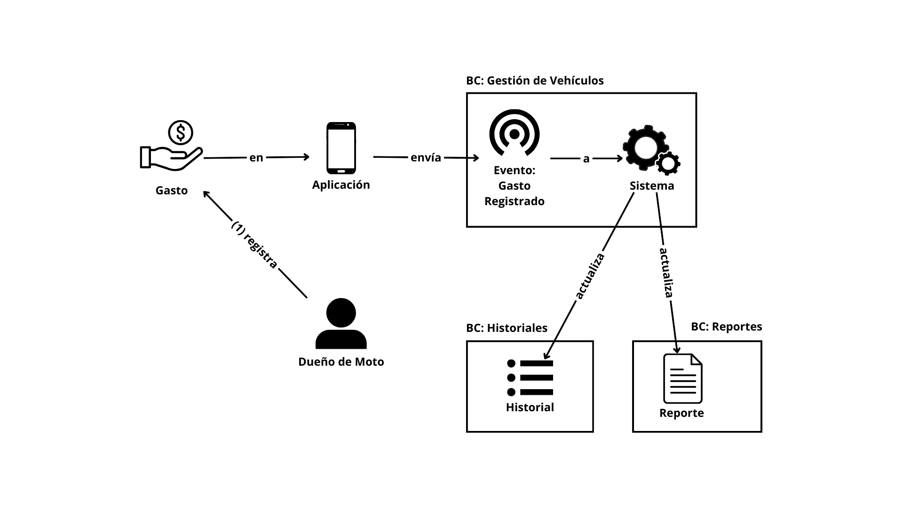

**Caso 2: Conexión entre dueño y mecánico**
1. El dueño de la moto solicita una suscripción a un mecánico.
2. El contexto de Suscripción crea una nueva suscripción y emite el evento SuscripcionCreada.
3. El contexto de Gestión de Vehículos actualiza el estado del vehículo con el nuevo mecánico asignado.
4. El contexto de Bienestar de Vehículos comienza a monitorear el vehículo bajo la nueva suscripción.
5. El Historial registra al nuevo mecánico en la cuenta del dueño.

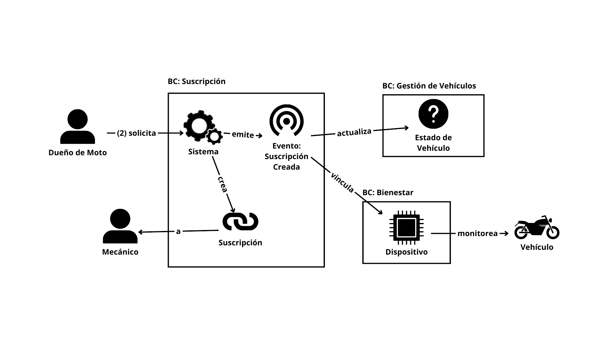

**Caso 3: Alerta preventiva de mantenimiento**
1. El contexto de Bienestar de Vehículos detecta una métrica crítica y genera el evento AlertaGenerada.
2. El contexto de Gestión de Vehículos recibe la alerta y notifica al dueño de la moto.
3. El contexto de Historiales registra la alerta en el historial del vehículo.
4. El contexto de Reportes actualiza los reportes con la nueva alerta.

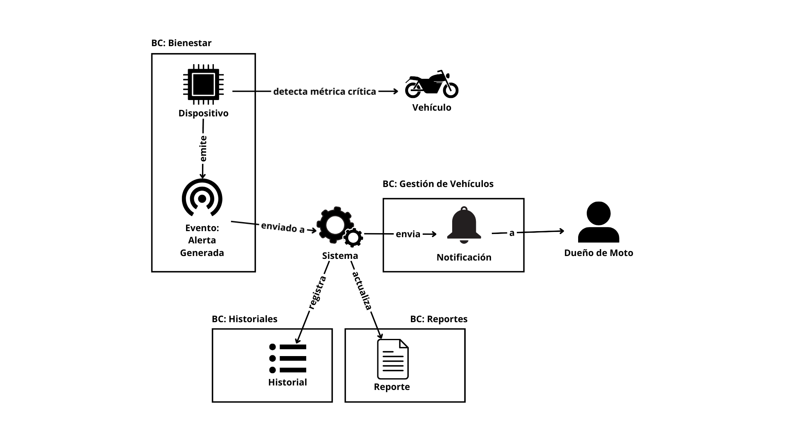

**Caso 4: Generar reporte de métricas**
1. El dueño de la moto solicita un reporte de métricas.
2. El contexto de Reportes recibe la solicitud y genera el reporte basado en las métricas actuales.
3. El contexto de Bienestar de Vehículos proporciona las métricas necesarias para el reporte.
4. El reporte es entregado al dueño de la moto.

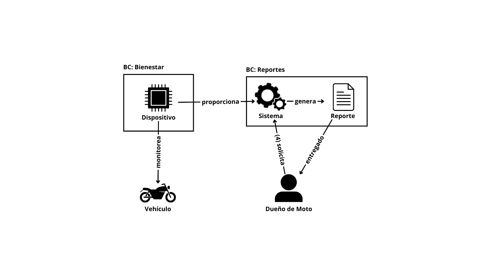

**Caso 5: Agendar servicio con mecánico**
1. El dueño de la moto agenda un servicio con su mecánico a través de la aplicación.
2. El contexto de Suscripción verifica la suscripción activa y emite el evento ServicioAgendado.
3. El contexto de Historiales registra el servicio agendado en el historial del vehículo.
4. El contexto de Gestión de Vehículos actualiza el estado del vehículo con la información del servicio.
5. El mecánico recibe la notificación del servicio agendado.

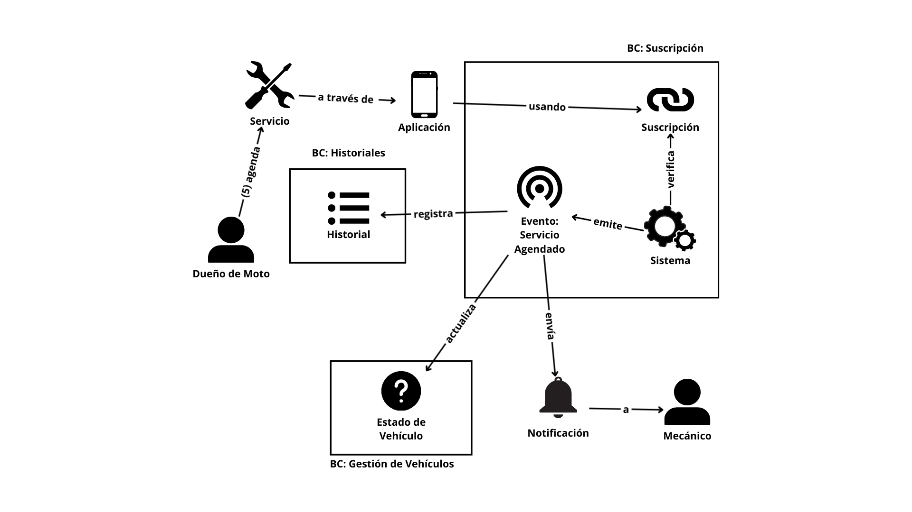

**Caso 6: Recomendación de cita**
1. El contexto de Bienestar de Vehículos detecta que una métrica ha alcanzado un umbral crítico y genera el evento RecomendacionCitaGenerada.
2. El contexto de Gestión de Vehículos recibe la recomendación y notifica al dueño de la moto.
3. El contexto de Suscripción sugiere al dueño agendar una cita con su mecánico.
4. El Historial registra la recomendación en el historial del vehículo.
5. El dueño de la moto agenda la cita a través de la aplicación.

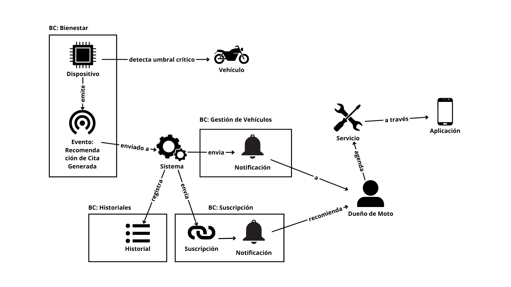

**Caso 7: Actualización de datos del vehículo**
1. El dueño de la moto actualiza los datos técnicos o de propiedad del vehículo en la aplicación.
2. El contexto de Gestión de Vehículos recibe la actualización y emite el evento DatosVehiculoActualizados.
3. El contexto de Historiales actualiza el historial del vehículo con los nuevos datos.
4. El contexto de Reportes genera un reporte actualizado con la nueva información del vehículo.
5. El contexto de Bienestar de Vehículos ajusta sus parámetros de monitoreo según los nuevos datos.

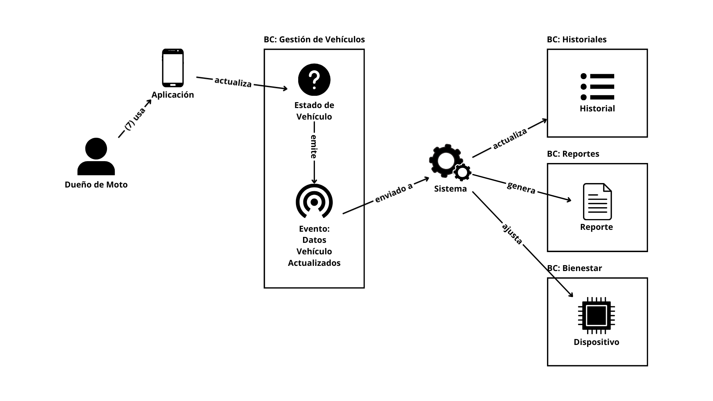

##### 4.1.1.3 Bounded Context Canvases

En esta sección se desarrollan los Bounded Context Canvases correspondientes a los contextos delimitados previamente durante el proceso de Candidate Context Discovery. El objetivo principal de este apartado es detallar, para cada contexto, los criterios de diseño que permitan comprender su propósito, límites de responsabilidad, capacidades clave, dependencias y reglas de negocio asociadas.

**Reportes**

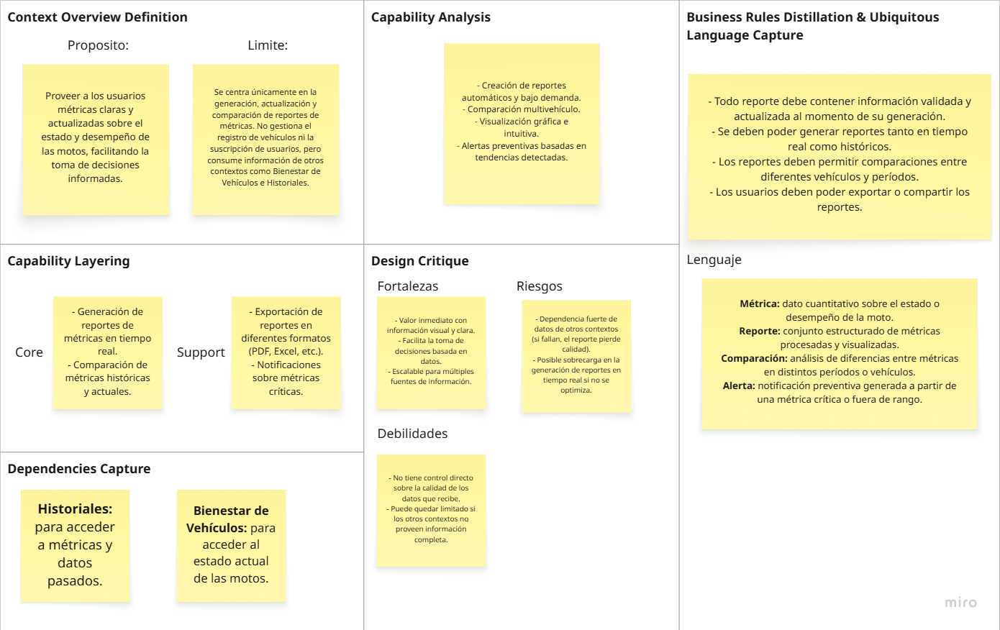

**Historiales**

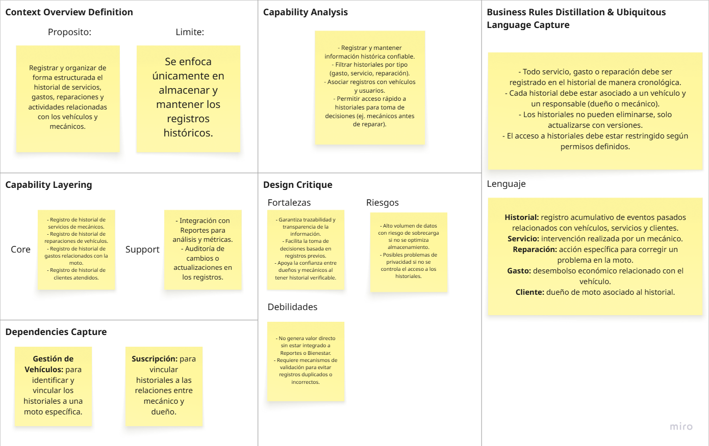

**Suscripción**

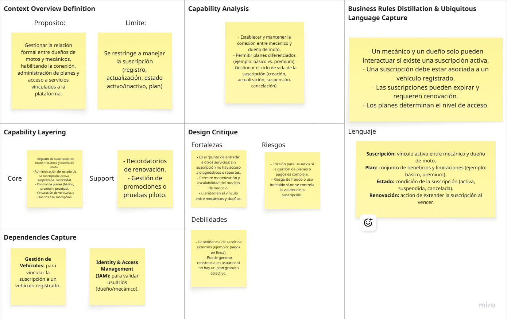

**Bienestar de Vehículos**

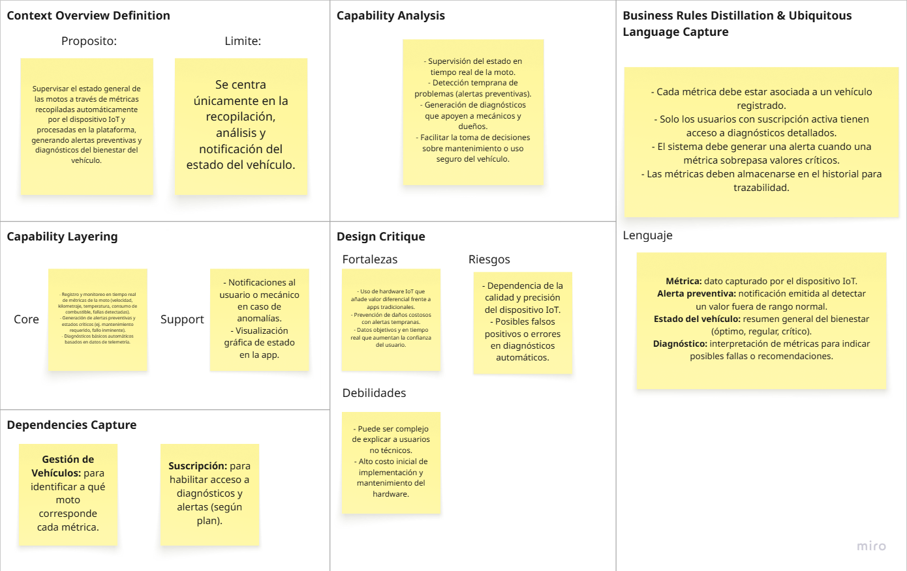

**Gestión de Vehículos**

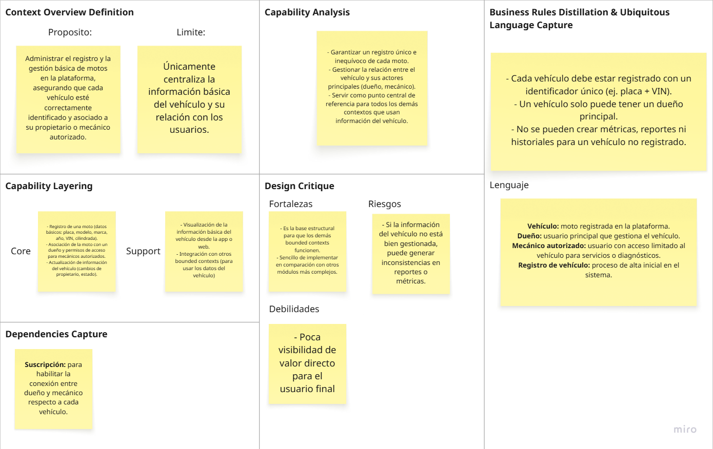

#### 4.1.2 Context Mapping

En esta sección se presenta el proceso de Context Mapping, cuyo propósito es identificar, analizar y documentar las relaciones estructurales entre los bounded contexts previamente definidos. El objetivo es comprender cómo interactúan, cuáles son sus dependencias y qué patrones de integración de Domain-Driven Design son más adecuados.

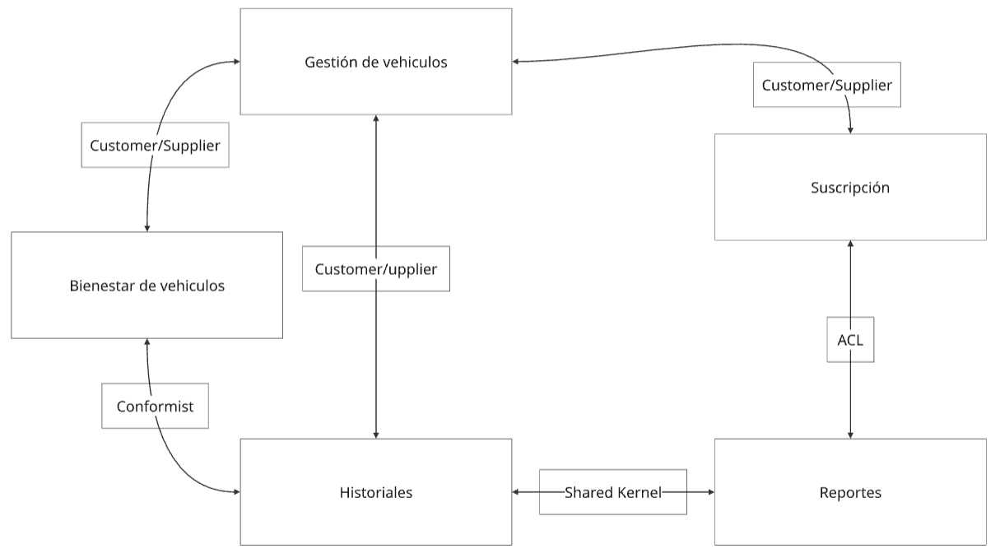

| **Contexto A**       | **Contexto B**         | **Relación (DDD)**          | **Justificación**                                                                                                  |
|----------------------|------------------------|-----------------------------|--------------------------------------------------------------------------------------------------------------------|
| Gestión de Vehículos | Bienestar de Vehículos | Customer/Supplier           | El estado de bienestar depende de la información estructural de los vehículos, como mantenimientos o revisiones.   |
| Gestión de Vehículos | Suscripción            | Customer/Supplier           | Las suscripciones requieren la información base de los vehículos para activar planes y beneficios asociados.       |
| Historiales          | Bienestar de Vehículos | Conformist                  | Historiales se adapta al modelo de Bienestar de Vehículos, siguiendo su esquema para registrar datos consistentes. |
| Historiales          | Gestión de Vehículos   | Customer/Supplier           | Los historiales se construyen a partir de la información de los vehículos, consumiendo sus datos.                  |
| Reportes             | Historiales            | Shared Kernel               | Ambos comparten datos e interpretación de eventos históricos para garantizar consistencia en los reportes.         |
| Reportes             | Suscripción            | Anti-Corruption Layer (ACL) | Se aísla el modelo de Reportes de la complejidad de Suscripción mediante una capa de traducción.                   |

#### 4.1.3 Software Architecture

La arquitectura de software de la solución se ha representado utilizando el modelo C4, el cual permite visualizar la estructura en diferentes niveles de abstracción. Se incluyen los diagramas de System Landscape, System Context y Container Level, con el fin de mostrar desde la visión global del ecosistema hasta la organización interna de la aplicación. Para su elaboración se empleó la herramienta Structurizr, que sigue los lineamientos de C4 Model.

##### 4.1.3.1 Software Architecture System Landscape Diagram

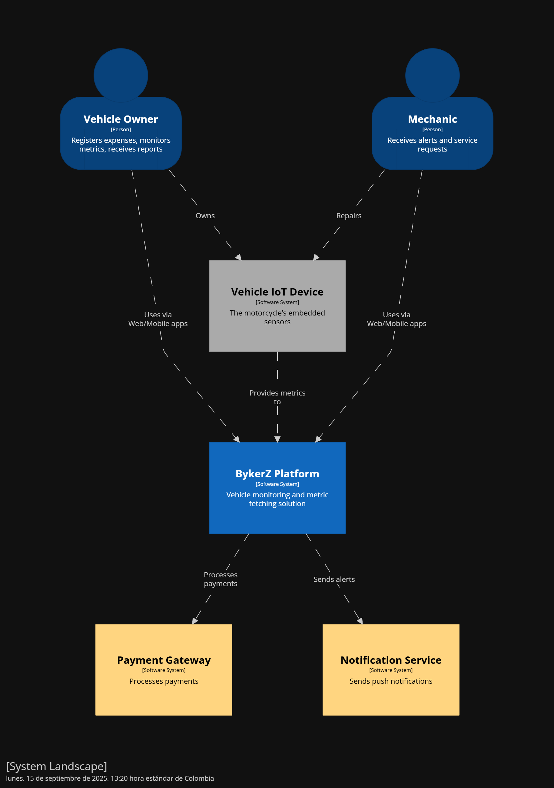

##### 4.1.3.2 Software Architecture Context Level Diagrams

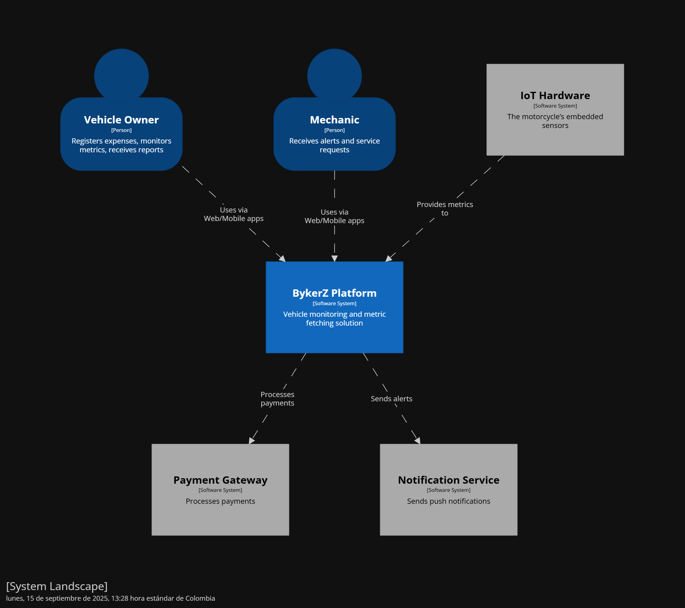

##### 4.1.3.3 Software Architecture Container Level Diagrams

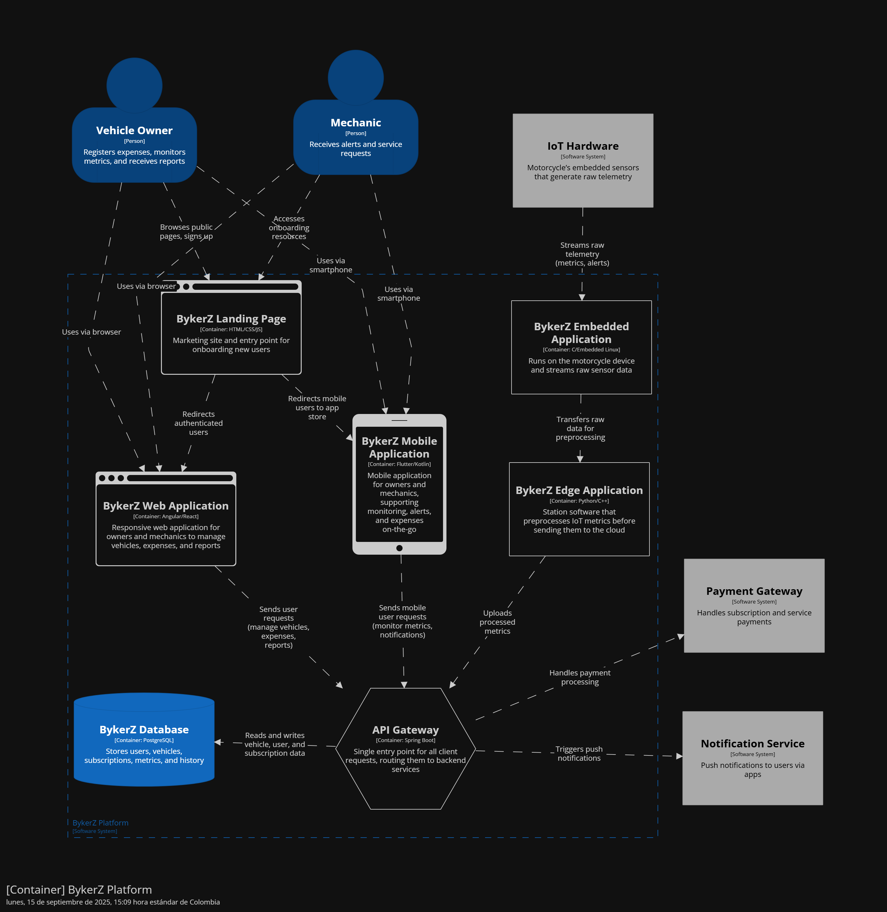

##### 4.1.3.4 Software Architecture Deployment Diagrams

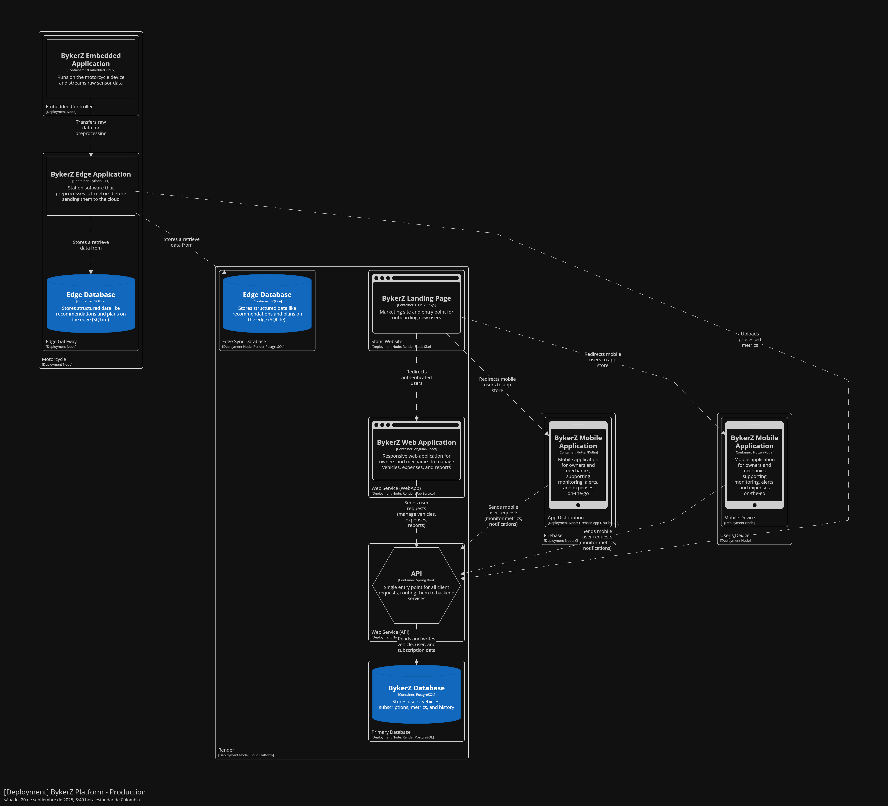

### 4.2 Tactical-Level Domain-Driven Design

#### 4.2.1 Bounded Context: Gestión de Vehículos

##### 4.2.1.1 Domain Layer
### Aggregate: `Vehicle`
**Descripción**: Representa la moto registrada por el dueño en el sistema. Contiene los detalles para identificar el vehículo así como su estado actual.

| Atributos           | Tipo de dato  | Visibilidad | Descripción                                  |
|---------------------|---------------|-------------|----------------------------------------------|
| id                  | Long          | Private     | Identificador único del vehículo.            |
| ownerId             | Long          | Private     | ID del dueño de la moto.                     |
| vin                 | String        | Private     | Número de identificación del vehículo (VIN). |
| plateNumber         | String        | Private     | Número de placa del vehículo.                |
| model               | String        | Private     | Modelo del vehículo.                         |
| brand               | String        | Private     | Marca del vehículo.                          |
| status              | VehicleStatus | Private     | Estado actual del vehículo.                  |
| year                | Integer       | Private     | Año de fabricación del vehículo.             |
| color               | String        | Private     | Color del vehículo.                          |
| authorizedMecanicId | Long          | Private     | ID del mecánico autorizado para el vehículo. |

| Métodos                    | Tipo de retorno | Visibilidad | Descripción                                 |
|----------------------------|-----------------|-------------|---------------------------------------------|
| registerVehicle()          | void            | Public      | Registra un nuevo vehículo en el sistema.   |
| updateVehicleDetails()     | void            | Public      | Actualiza los detalles del vehículo.        |
| getVehicleStatus()         | VehicleStatus   | Public      | Obtiene el estado actual del vehículo.      |
| assignAuthorizedMechanic() | void            | Public      | Asigna un mecánico autorizado al vehículo.  |
| assignNewOwner()           | void            | Public      | Cambia el dueño del vehículo.               |
| revokeAuthorizedMechanic() | void            | Public      | Revoca el mecánico autorizado del vehículo. |

##### 4.2.1.2 Interface Layer

### Controlador: `VehicleController`
**Descripción:** Controlador REST que maneja las operaciones relacionadas con la gestión de vehículos.

| Método               | Ruta                                                      | Descripción                                 |
|----------------------|-----------------------------------------------------------|---------------------------------------------|
| addVehicle()         | POST /api/v1/vehicles/                                    | Registra un nuevo vehículo.                 |
| updateVehicle()      | PUT /api/v1/vehicles/{vehicleId}                          | Actualiza los detalles de un vehículo.      |
| updateVehicleOwner() | PATCH /api/v1/vehicles/{vehicleId}/owner                  | Cambia el dueño del vehículo.               |
| authorizeMechanic()  | POST /api/v1/vehicles/{vehicleId}/mechanic                | Asigna un mecánico autorizado al vehículo.  |
| revokeMechanic()     | DELETE /api/v1/vehicles/{vehicleId}/mechanic/{mechanicId} | Revoca el mecánico autorizado del vehículo. |
| getVehicle()         | GET /api/v1/vehicles/{vehicleId}                          | Consulta los detalles de un vehículo.       |
| getMechanic()        | GET /api/v1/mechanics/{mechanicId}                        | Consulta los detalles de un mecánico.       |

**Dependencias:**

| Dependencia                                    | Descripción                                                                          |
|------------------------------------------------|--------------------------------------------------------------------------------------|
| VehicleCommandService                          | Servicio para manejar comandos relacionados con vehículos.                           |
| VehicleQueryService                            | Servicio para manejar consultas relacionadas con vehículos.                          |
| CreateVehicleCommandFromResourceAssembler      | Ensamblador para convertir recursos REST a comandos para creación de vehículos.      |
| UpdateVehicleCommandFromResourceAssembler      | Ensamblador para convertir recursos REST a comandos para actualización de vehículos. |
| UpdateVehicleOwnerCommandFromResourceAssembler | Ensamblador para convertir recursos REST a comandos para actualización de dueños.    |
| VehicleResourceFromEntityAssembler             | Ensamblador para convertir entidades de vehículos a recursos REST.                   |

##### 4.2.1.3 Application Layer

### Clase: `VehicleCommandServiceImpl`
**Descripción:** Implementación del servicio de comandos para la gestión de vehículos.

| Método                                   | Descripción                                 |
|------------------------------------------|---------------------------------------------|
| handle(CreateVehicleCommand)             | Crea un nuevo vehículo.                     |
| handle(UpdateVehicleCommand)             | Actualiza los detalles de un vehículo.      |
| handle(UpdateVehicleOwnerCommand)        | Cambia el dueño del vehículo.               |
| handle(AddMechanicToVehicleCommand)      | Asigna un mecánico autorizado al vehículo.  |
| handle(RemoveMechanicFromVehicleCommand) | Revoca el mecánico autorizado del vehículo. |

**Dependencias:**

| Dependencia                      | Descripción                                      |
|----------------------------------|--------------------------------------------------|
| VehicleRepository                | Repositorio para consultar datos de vehículos.   |
| CreateVehicleCommand             | Comando para crear un vehículo.                  |
| UpdateVehicleCommand             | Comando para actualizar un vehículo.             |
| UpdateVehicleOwnerCommand        | Comando para actualizar el dueño de un vehículo. |
| AddMechanicToVehicleCommand      | Comando para asignar un mecánico a un vehículo.  |
| RemoveMechanicFromVehicleCommand | Comando para revocar un mecánico de un vehículo. |

### Clase: `VehicleQueryServiceImpl`
**Descripción:** Implementación del servicio de consultas para la gestión de vehículos.

| Método                               | Descripción                                           |
|--------------------------------------|-------------------------------------------------------|
| handle(GetVehicleByIdQuery)          | Obtiene un vehículo por su ID.                        |
| handle(GetVehiclesByOwnerIdQuery)    | Obtiene todos los vehículos de un dueño               |
| handle(GetVehiclesByMechanicIdQuery) | Obtiene todos los vehículos vinculados a un mecánico. |
| handle(GetVehicleByVinQuery)         | Obtiene un vehículo por su VIN.                       |

**Dependencias:**

| Dependencia                  | Descripción                                           |
|------------------------------|-------------------------------------------------------|
| VehicleRepository            | Repositorio para acceder a datos de vehículos.        |
| GetVehicleByIdQuery          | Obtiene un vehículo por su ID.                        |
| GetVehiclesByOwnerIdQuery    | Obtiene todos los vehículos de un dueño.              |
| GetVehiclesByMechanicIdQuery | Obtiene todos los vehículos vinculados a un mecánico. |
| GetVehicleByVinQuery         | Obtiene un vehículo por su VIN.                       |

##### 4.2.1.4 Infrastructure Layer

### Clase: `VehicleRepository`
**Descripción:** Interfaz de persistencia para operaciones CRUD y consultas de datos de vehículos.

| Método                            | Descripción                                |
|-----------------------------------|--------------------------------------------|
| save(Vehicle vehicle)             | Guarda o actualiza un vehículo.            |
| findById(Long id)                 | Busca un vehículo por su ID.               |
| findByVin(String vin)             | Busca un vehículo por su VIN.              |
| findByOwnerId(Long ownerId)       | Busca vehículos por ID de dueño.           |
| findByMechanicId(Long mechanicId) | Busca vehículos por ID de mecánico.        |
| existsByVin(String vin)           | Verifica si un vehículo existe por su VIN. |
| deleteById(Long id)               | Elimina un vehículo por su ID.             |

##### 4.2.1.5 Bounded Context Software Architecture Component Level Diagrams

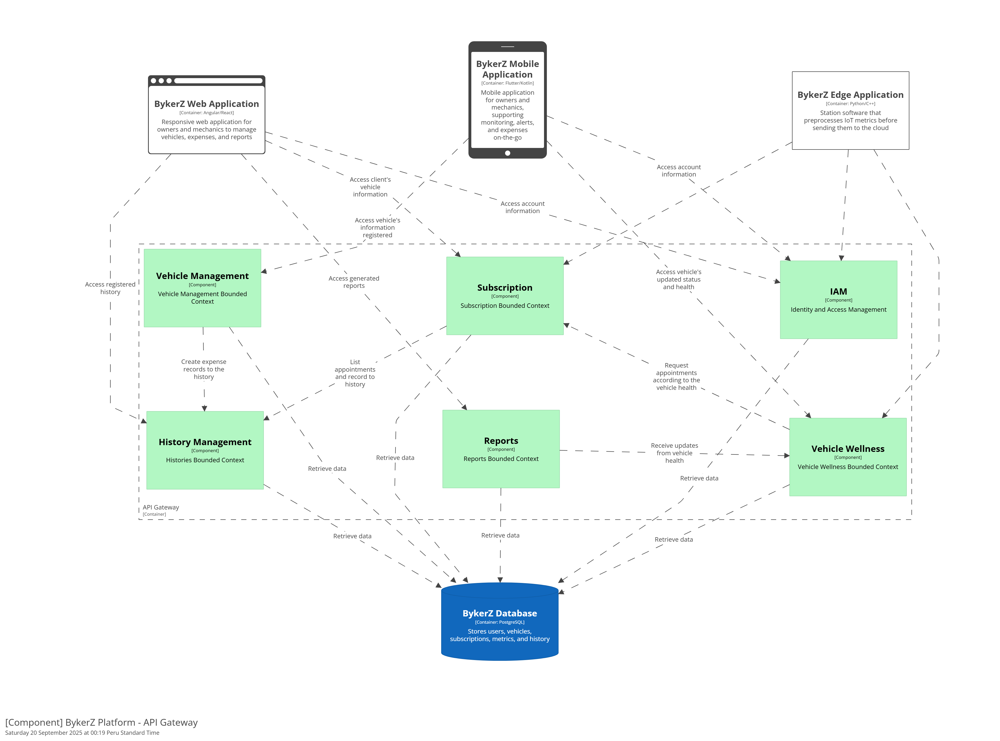

##### 4.2.1.6 Bounded Context Software Architecture Code Level Diagrams

###### 4.2.1.6.1 Bounded Context Domain Layer Class Diagrams

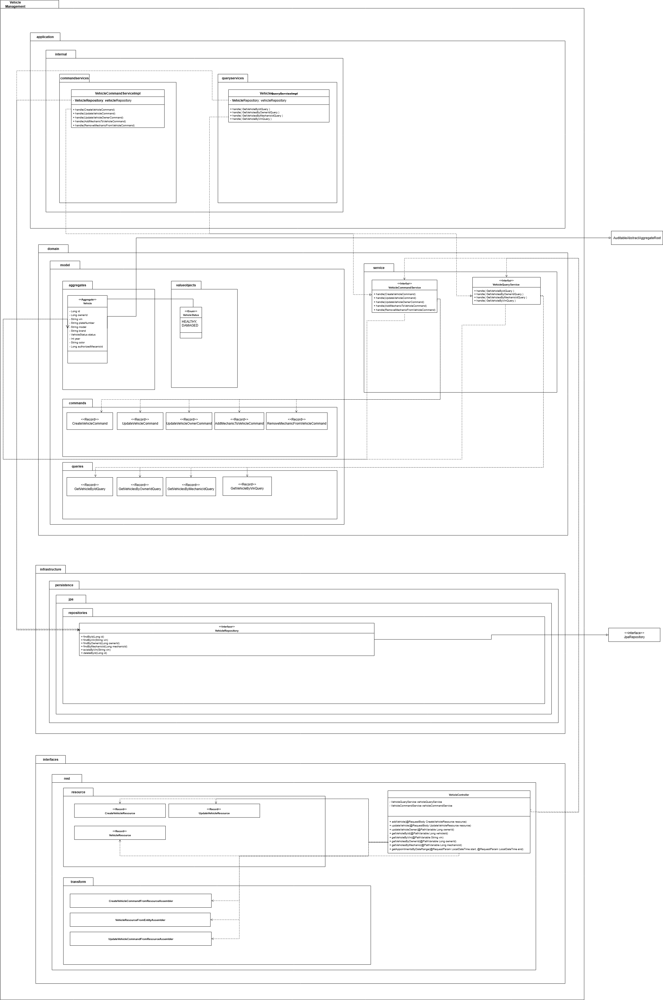

###### 4.2.1.6.2 Bounded Context Database Design Diagram

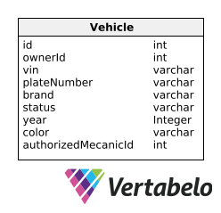

#### 4.2.2 Bounded Context: Historiales

##### 4.2.2.1 Domain Layer

<h3>Aggregate: <code>ServiceHistory</code></h3>

<strong>Descripción:</strong> Representa el registro histórico de servicios de mantenimiento y reparaciones realizadas a un vehículo, incluyendo detalles de gastos, repuestos utilizados y mecánicos involucrados.

<table>
  <thead>
    <tr>
      <th>Atributos</th>
      <th>Tipo de dato</th>
      <th>Visibilidad</th>
      <th>Descripción</th>
    </tr>
  </thead>
  <tbody>
    <tr>
      <td>id</td>
      <td>Long</td>
      <td>Private</td>
      <td>Identificador único del registro de servicio.</td>
    </tr>
    <tr>
      <td>vehicleId</td>
      <td>Long</td>
      <td>Private</td>
      <td>ID del vehículo al que se le realizó el servicio.</td>
    </tr>
    <tr>
      <td>mechanicId</td>
      <td>Long</td>
      <td>Private</td>
      <td>ID del mecánico que realizó el servicio.</td>
    </tr>
    <tr>
      <td>serviceType</td>
      <td>ServiceType</td>
      <td>Private</td>
      <td>Tipo de servicio realizado (mantenimiento, reparación, revisión).</td>
    </tr>
    <tr>
      <td>serviceDate</td>
      <td>Date</td>
      <td>Private</td>
      <td>Fecha en que se realizó el servicio.</td>
    </tr>
    <tr>
      <td>mileage</td>
      <td>double</td>
      <td>Private</td>
      <td>Kilometraje del vehículo al momento del servicio.</td>
    </tr>
    <tr>
      <td>description</td>
      <td>String</td>
      <td>Private</td>
      <td>Descripción detallada del servicio realizado.</td>
    </tr>
    <tr>
      <td>totalCost</td>
      <td>double</td>
      <td>Private</td>
      <td>Costo total del servicio.</td>
    </tr>
  </tbody>
</table>

<h3>Aggregate:<code>ExpenseHistory</code></h3>

<strong>Descripción:</strong>Registra todos los gastos asociados a un vehículo por un usuario

<table>
  <thead>
    <tr>
      <th>Atributos</th>
      <th>Tipo de dato</th>
      <th>Visibilidad</th>
      <th>Descripción</th>
    </tr>
  </thead>
  <tbody>
    <tr>
      <td>id</td>
      <td>Long</td>
      <td>Private</td>
      <td>Identificador único del gasto.</td>
    </tr>
    <tr>
      <td>vehicleId</td>
      <td>Long</td>
      <td>Private</td>
      <td>ID del vehículo asociado.</td>
    </tr>
    <tr>
      <td>expenseType</td>
      <td>ExpenseType</td>
      <td>Private</td>
      <td>Tipo de gasto.</td>
    </tr>
    <tr>
      <td>description</td>
      <td>String</td>
      <td>Private</td>
      <td>Descripción del gasto.</td>
    </tr>
    <tr>
      <td>amount</td>
      <td>double</td>
      <td>Private</td>
      <td>Monto del gasto.</td>
    </tr>
    <tr>
      <td>mileage</td>
      <td>double</td>
      <td>Private</td>
      <td>Kilometraje al momento del gasto.</td>
    </tr>
  </tbody>
</table>

<h3>Interfaz:<code>ServiceHistoryQueryService</code></h3>

<strong>Descripción:</strong>Servicio de consultas para recuperar información de historias de servicio.

<table>
  <thead>
  <tr>
    <th>Método</th>
    <th>Visibilidad</th>
    <th>Descripción</th>
  </tr>
  </thead>
  <tbody>
  <tr>
    <td>handle(GetServiceHistoryByVehicleQuery)</td>
    <td>Público</td>
    <td></td>
  </tr>
  <tr>
    <td>handle(GetServiceHistoryByIdQuery)</td>
    <td>Público</td>
    <td></td>
  </tr>
  <tr>
    <td>handle(GetServicesByIdQuery)</td>
    <td>Público</td>
    <td></td>
  </tr>
  <tr>
    <td>handle(GetServicesByDateRange)</td>
    <td>Público</td>
    <td></td>
  </tr>
  </tbody>
</table>

<h3>Interfaz:<code>ServiceHistoryCommandService</code></h3>

<strong>Descripción:</strong>Servicio de comandos para controlar información de historias de servicio.

<table>
  <thead>
  <tr>
    <th>Método</th>
    <th>Visibilidad</th>
    <th>Descripción</th>
  </tr>
  </thead>
  <tbody>
  <tr>
    <td>handle(CreateServiceHistory)</td>
    <td>Público</td>
    <td></td>
  </tr>
  <tr>
    <td>handle(UpdateServiceHistory)</td>
    <td>Público</td>
    <td></td>
  </tr>
  <tr>
    <td>handle(DeleteServiceHistory)</td>
    <td>Público</td>
    <td></td>
  </tr>
  </tbody>
</table>

<h3>Interfaz:<code>ExpenseHistoryQueryService</code></h3>

<strong>Descripción:</strong>Servicio de consultas para recuperar información de historias de gastos.

<table>
  <thead>
  <tr>
    <th>Método</th>
    <th>Visibilidad</th>
    <th>Descripción</th>
  </tr>
  </thead>
  <tbody>
  <tr>
    <td>handle(GetExpenseHistoryByVehicleQuery)</td>
    <td>Público</td>
    <td></td>
  </tr>
  <tr>
    <td>handle(GetExpensesByTypeQuery)</td>
    <td>Público</td>
    <td></td>
  </tr>
  <tr>
    <td>handle(GetExpensesByDateRangeQuery)</td>
    <td>Público</td>
    <td></td>
  </tr>
  <tr>
    <td>handle(GetTotalInvestmentQuery)</td>
    <td>Público</td>
    <td></td>
  </tr>
  </tbody>
</table>

<h3>Interfaz:<code>ExpenseHistoryCommandService</code></h3>

<strong>Descripción:</strong>Servicio de comandos para controlar información de historias de gastos.

<table>
  <thead>
  <tr>
    <th>Método</th>
    <th>Visibilidad</th>
    <th>Descripción</th>
  </tr>
  </thead>
  <tbody>
  <tr>
    <td>handle(CreateExpenseHistoryCommand)</td>
    <td>Público</td>
    <td></td>
  </tr>
  <tr>
    <td>handle(UpdateExpenseHistoryCommand)</td>
    <td>Público</td>
    <td></td>
  </tr>
  <tr>
    <td>handle(DeleteExpenseHistoryCommand)</td>
    <td>Público</td>
    <td></td>
  </tr>
  </tbody>
</table>

<h3>Value Object:<code>ServiceType</code></h3>
<table>
  <thead>
    <tr>
      <th>ServiceType</th>
    </tr>
  </thead>
  <tbody>
    <tr>
      <td>MAINTENANCE</td>
      <td>REPAIR</td>
      <td>INSPECTION</td>
      <td>INSTALLATION</td>
    </tr>
  </tbody>
</table>

<h3>Value Object:<code>ExpenseType</code></h3>
<table>
  <thead>
  <tr>
    <th>ServiceType</th>
  </tr>
  </thead>
  <tbody>
  <tr>
    <td>MAINTENANCE</td>
    <td>FUEL</td>
    <td>INSURANCE</td>
    <td>PROCEDURE</td>
    <td>AESTHETIC</td>
  </tr>
  </tbody>
</table>

<table>
    <thead>
        <tr>
            <td>Commands</td>
            <td>Description</td>
        </tr>
    </thead>
    <tbody>
        <tr>
          <td>CreateHistoryCommand</td>
          <td>Crea una historia de servicio.</td>
        </tr>
        <tr>
          <td>UpdateServiceHistoryCommand</td>
          <td>Actualiza una historia de servicio.</td>
        </tr>
        <tr>
          <td>DeleteServiceHistoryCommand</td>
          <td>Elimina una historia de servicio.</td>
        </tr>
        <tr>
          <td>CreateExpenseHistoryCommand</td>
          <td>Crea una historia de gasto.</td>
        </tr>
        <tr>
          <td>DeleteExpenseHistoryCommand</td>
          <td>Elimina una historia de gasto.</td>
        </tr>
        <tr>
          <td>UpdateExpenseHistoryCommand</td>
          <td>Actualiza una historia de gasto.</td>
        </tr>
    </tbody>
</table>

<table>
  <thead>
  <tr>
    <td>Queries</td>
    <td>Description</td>
  </tr>
  </thead>
  <tbody>
  <tr>
    <td>GetServiceHistoriesByVehicleQuery</td>
    <td>Obtiene las historias de servicios realizados a un vehículo específico.</td>
  </tr>
  <tr>
    <td>GetServiceHistoryByIdQuery</td>
    <td>Recupera el detalle de un servicio en particular a partir de su identificador único.</td>
  </tr>
  <tr>
    <td>GetServicesByTypeQuery</td>
    <td>Filtra y devuelve los servicios de un vehículo según el tipo de servicio solicitado.</td>
  </tr>
  <tr>
    <td>GetServicesByDateRangeQuery</td>
    <td>Obtiene todos los servicios realizados a un vehículo dentro de un rango de fechas específico.</td>
  </tr>
  <tr>
    <td>GetExpenseHistoryByVehicleQuery</td>
    <td>Recupera el historial de gastos relacionados a un vehículo a lo largo del tiempo.</td>
  </tr>
  <tr>
    <td>GetExpenseByTypeQuery</td>
    <td>Devuelve los gastos de un vehículo clasificados por un tipo de gasto específico.</td>
  </tr>
  <tr>
    <td>GetExpensesByDateRangeQuery</td>
    <td>Obtiene todos los gastos de un vehículo registrados dentro de un rango de fechas definido.</td>
  </tr>
  <tr>
    <td>GetTotalInvestmentQuery</td>
    <td>Calcula el monto total invertido en un vehículo, sumando servicios y gastos registrados.</td>
  </tr>
  </tbody>
</table>

##### 4.2.2.2 Interface Layer

<h3>Controlador:<code>HistoryController</code></h3>
<table>
  <tr>
    <th>Título</th>
    <td>HistoryController</td>
  </tr>
  <tr>
    <th>Descripción</th>
    <td>Controlador REST que maneja las operaciones relacionadas con el historial de servicios y gastos de vehículos.</td>
  </tr>
</table>

<table>
  <thead>
    <tr>
      <th>Método</th>
      <th>Ruta</th>
      <th>Descripción</th>
    </tr>
  </thead>
  <tbody>
    <tr>
      <td>getServiceHistory(Long vehicleId)</td>
      <td>GET /api/v1/history/service/{vehicleId}</td>
      <td>Obtiene el historial completo de servicios de un vehículo.</td>
    </tr>
    <tr>
      <td>getServiceHistoryById(Long id)</td>
      <td>GET /api/v1/history/service/{id}</td>
      <td>Obtiene un servicio específico por su ID.</td>
    </tr>
    <tr>
      <td>addServiceHistory(ServiceHistory history)</td>
      <td>POST /api/v1/history/service</td>
      <td>Agrega un nuevo registro de servicio.</td>
    </tr>
    <tr>
      <td>updateServiceHistory(Long id, ServiceHistory history)</td>
      <td>PUT /api/v1/history/service/{id}</td>
      <td>Actualiza un registro de servicio existente.</td>
    </tr>
    <tr>
      <td>deleteServiceHistory(Long id)</td>
      <td>DELETE /api/v1/history/service/{id}</td>
      <td>Elimina un registro de servicio.</td>
    </tr>
    <tr>
      <td>getExpenseHistory(Long vehicleId)</td>
      <td>GET /api/v1/history/expense/{vehicleId}</td>
      <td>Obtiene el historial completo de gastos de un vehículo.</td>
    </tr>
    <tr>
      <td>addExpenseHistory(ExpenseHistory history)</td>
      <td>POST /api/v1/history/expense</td>
      <td>Agrega un nuevo registro de gasto al historial.</td>
    </tr>
    <tr>
      <td>getMonthlySummary(Long vehicleId, int year, string month)</td>
      <td>GET /api/v1/history/summary/{vehicleId}/{year}/{month}</td>
      <td>Obtiene un resumen mensual de servicios y gastos.</td>
    </tr>
    <tr>
      <td>getMaintenanceTimeline(Long vehicleId)</td>
      <td>GET /api/v1/history/timeline/{vehicleId}</td>
      <td>Obtiene una línea de tiempo de todos los mantenimientos.</td>
    </tr>
    <tr>
      <td>exportHistoryReport(Long vehicleId)</td>
      <td>GET /api/v1/history/export/{vehicleId}</td>
      <td>Exporta el historial completo a formato PDF/Excel.</td>
    </tr>
  </tbody>
</table>

<h4>Dependencias:</h4>
<table>
  <thead>
    <tr>
      <th>Dependencia</th>
      <th>Descripción</th>
    </tr>
  </thead>
  <tbody>
    <tr>
      <td>HistoryResource</td>
      <td>Recurso REST representante de un elemento de historial</td>
    </tr>
    <tr>
      <td>CreateServiceHistoryResource</td>
      <td>Recurso REST representante de la creación de un elemento de historial de servicios</td>
    </tr>
    <tr>
      <td>CreateExpenseHistoryResource</td>
      <td>Recurso REST representante de la creación de un elemento de historial de gastos</td>
    </tr>
    <tr>
      <td>HistoryQueryService</td>
      <td>Servicio para consultas y recuperación de datos de historiales.</td>
    </tr>
    <tr>
      <td>HistoryCommandService</td>
      <td>Servicio para ejecutar comandos de creación, actualización y eliminación de registros históricos.</td>
    </tr>
    <tr>
      <td>CreateServiceHistoryCommandFromResourceAssembler</td>
      <td>Convierte recursos REST en comandos de creación de historiales de servicio.</td>
    </tr>
    <tr>
      <td>CreateExpenseHistoryCommandFromResourceAssembler</td>
      <td>Convierte recursos REST en comandos de creación de historiales de gastos.</td>
    </tr>
    <tr>
      <td>HistoryResourceFromEntityAssembler</td>
      <td>Convierte entidades de historial en recursos REST para la respuesta.</td>
    </tr>
  </tbody>
</table>

##### 4.2.2.3 Application Layer

<h3>Clase: <code>HistoryQueryServiceImpl</code></h3>
<table>
  <tr>
    <th>Título</th>
    <td>HistoryQueryServiceImpl</td>
  </tr>
  <tr>
    <th>Descripción</th>
    <td>Implementación del servicio de consultas para operaciones de lectura relacionadas con historiales de servicios.</td>
  </tr>
</table>

<table>
  <thead>
    <tr>
      <th>Método</th>
      <th>Descripción</th>
    </tr>
  </thead>
  <tbody>
    <tr>
      <td>handle(GetServiceHistoryByVehicleQuery)</td>
      <td>Obtiene el historial completo de servicios de un vehículo.</td>
    </tr>
    <tr>
      <td>handle(GetServiceHistoryByIdQuery)</td>
      <td>Obtiene un servicio específico por su ID.</td>
    </tr>
    <tr>
      <td>handle(GetServicesByTypeQuery)</td>
      <td>Filtra servicios por tipo.</td>
    </tr>
    <tr>
      <td>handle(GetServicesByDateRangeQuery)</td>
      <td>Obtiene servicios dentro de un rango de fechas.</td>
    </tr>
  </tbody>
</table>

<h4>Dependencias:</h4>
<table>
  <thead>
    <tr>
      <th>Dependencia</th>
      <th>Descripción</th>
    </tr>
  </thead>
  <tbody>
    <tr>
      <td>ServiceHistoryRepository</td>
      <td>Repositorio para acceso a datos de historiales de servicio.</td>
    </tr>
  </tbody>
</table>

<h3>Clase: <code>ServiceHistoryCommandServiceImpl</code></h3>
<table>
  <tr>
    <th>Título</th>
    <td>ServiceHistoryCommandServiceImpl</td>
  </tr>
  <tr>
    <th>Descripción</th>
    <td>Implementación del servicio de comandos para operaciones de escritura relacionadas con historiales de servicios</td>
  </tr>
</table>

<table>
  <thead>
    <tr>
      <th>Método</th>
      <th>Descripción</th>
    </tr>
  </thead>
  <tbody>
    <tr><td>handle(CreateServiceHistoryCommand)</td><td>Crea un nuevo registro de servicio en el historial.</td></tr>
    <tr><td>handle(UpdateServiceHistoryCommand)</td><td>Actualiza un registro de servicio existente.</td></tr>
    <tr><td>handle(DeleteServiceHistoryCommand)</td><td>Elimina un registro de servicio.</td></tr>
  </tbody>
</table>

<h4>Dependencias:</h4>
<table>
  <thead>
    <tr>
      <th>Dependencia</th>
      <th>Descripción</th>
    </tr>
  </thead>
  <tbody>
    <tr><td>ServiceHistoryRepository</td><td>Repositorio para persistencia de historiales de servicio.</td></tr>
  </tbody>
</table>

<h3>Clase: <code>ExpenseHistoryQueryServiceImpl</code></h3>
<table>
  <tr>
    <th>Título</th>
    <td>ExpenseHistoryQueryServiceImpl</td>
  </tr>
  <tr>
    <th>Descripción</th>
    <td>Implementación del servicio de consultas para operaciones de lectura relacionadas con historiales de gastos.</td>
  </tr>
</table>

<table>
  <thead>
  <tr>
    <th>Método</th>
    <th>Descripción</th>
  </tr>
  </thead>
  <tbody>
  <tr>
    <td>handle(GetExpenseHistoryByVehicleQuery)</td>
    <td>Obtiene el historial completo de gastos de un vehículo.</td>
  </tr>
  <tr>
    <td>handle(GetExpensesByTypeQuery)</td>
    <td>Filtra gastos por tipo.</td>
  </tr>
  <tr>
    <td>handle(GetExpensesByDateRangeQuery)</td>
    <td>Obtiene gastos dentro de un rango de fechas.</td>
  </tr>
  <tr>
    <td>handle(GetTotalInvestmentQuery)</td>
    <td>Calcula la inversión total en un vehículo.</td>
  </tr>
  </tbody>
</table>

<h4>Dependencias:</h4>
<table>
  <thead>
  <tr>
    <th>Dependencia</th>
    <th>Descripción</th>
  </tr>
  </thead>
  <tbody>
  <tr>
    <td>ExpenseHistoryRepository</td>
    <td>Repositorio para acceso a datos de historiales de gastos.</td>
  </tr>
  </tbody>
</table>

<h3>Clase: <code>ExpenseHistoryCommandServiceImpl</code></h3>
<table>
  <tr>
    <th>Título</th>
    <td>ExpenseHistoryCommandServiceImpl</td>
  </tr>
  <tr>
    <th>Descripción</th>
    <td>Implementación del servicio de comandos para operaciones de escritura relacionadas con historiales de gastos</td>
  </tr>
</table>

<table>
  <thead>
  <tr>
    <th>Método</th>
    <th>Descripción</th>
  </tr>
  </thead>
  <tbody>
  <tr><td>handle(CreateExpenseHistoryCommand)</td><td>Crea un nuevo registro de gasto en el historial.</td></tr>
  <tr><td>handle(UpdateExpenseHistoryCommand)</td><td>Actualiza un registro de gasto existente.</td></tr>
  <tr><td>handle(DeleteExpenseHistoryCommand)</td><td>Elimina un registro de gasto.</td></tr>
  </tbody>
</table>

<h4>Dependencias:</h4>
<table>
  <thead>
  <tr>
    <th>Dependencia</th>
    <th>Descripción</th>
  </tr>
  </thead>
  <tbody>
  <tr>
    <td>ExpenseHistoryRepository</td>
    <td>Repositorio para persistencia de historiales de gastos.</td>
  </tr>
  </tbody>
</table>

##### 4.2.2.4 Infrastructure Layer

<h3>Interfaz:<code>ServiceHistoryRepository</code></h3>
<table>
  <tr>
    <th>Título</th>
    <td>ServiceHistoryRepository</td>
  </tr>
  <tr>
    <th>Descripción</th>
    <td>Interfaz de persistencia para operaciones CRUD y consultas específicas de historiales de servicio.</td>
  </tr>
</table>

<table>
  <thead>
    <tr>
      <th>Método</th>
      <th>Descripción</th>
    </tr>
  </thead>
  <tbody>
    <tr><td>findByVehicleId(Long vehicleId)</td><td>Obtiene todos los historiales de servicio asociados a un vehículo.</td></tr>
    <tr><td>findByMechanicId(Long mechanicId)</td><td>Obtiene todos los historiales de servicio realizados por un mecánico.</td></tr>
    <tr><td>findByServiceTypeAndVehicleId(ServiceType type, Long vehicleId)</td><td>Filtra historiales por tipo de servicio y vehículo.</td></tr>
    <tr><td>findByDateRangeAndVehicleId(Timestamp start, Timestamp end, Long vehicleId)</td><td>Obtiene historiales dentro de un rango de fechas para un vehículo.</td></tr>
    <tr><td>findLatestServiceByVehicleId(Long vehicleId)</td><td>Obtiene el servicio más reciente de un vehículo.</td></tr>
    <tr><td>calculateTotalSpentByVehicleId(Long vehicleId)</td><td>Calcula el total gastado en servicios para un vehículo.</td></tr>
  </tbody>
</table>

<h3>Interfaz:<code>ExpenseHistoryRepository</code></h3>
<table>
  <tr>
    <th>Título</th>
    <td>ExpenseHistoryRepository</td>
  </tr>
  <tr>
    <th>Descripción</th>
    <td>Interfaz de persistencia para operaciones CRUD y consultas relacionadas con historiales de gastos.</td>
  </tr>
</table>

<table>
  <thead>
    <tr>
      <th>Método</th>
      <th>Descripción</th>
    </tr>
  </thead>
  <tbody>
    <tr><td>findByVehicleId(Long vehicleId)</td><td>Obtiene todos los historiales de gasto asociados a un vehículo.</td></tr>
    <tr><td>findByExpenseTypeAndVehicleId(ExpenseType type, Long vehicleId)</td><td>Filtra gastos por tipo y vehículo.</td></tr>
    <tr><td>findByDateRangeAndVehicleId(Date start, Date end, Long vehicleId)</td><td>Obtiene gastos dentro de un rango de fechas para un vehículo.</td></tr>
    <tr><td>calculateTotalExpensesByVehicleId(Long vehicleId)</td><td>Calcula el total gastado para un vehículo.</td></tr>
    <tr><td>calculateExpensesByTypeAndVehicleId(ExpenseType type, Long vehicleId)</td><td>Calcula el gasto por tipo para un vehículo.</td></tr>
  </tbody>
</table>

##### 4.2.2.5 Bounded Context Software Architecture Component Level Diagrams

##### 4.2.2.6 Bounded Context Software Architecture Code Level Diagrams

###### 4.2.2.6.1 Bounded Context Domain Layer Class Diagrams

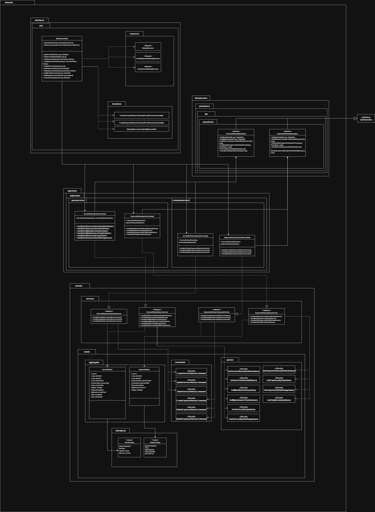

###### 4.2.2.6.2 Bounded Context Database Design Diagram

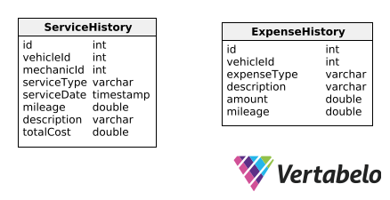

#### 4.2.3 Bounded Context: Suscripción

##### 4.2.3.1 Domain Layer

<h3>Aggregate: <code>Appointment</code></h3>

<strong>Descripción:</strong> Representa una cita programada entre un <code>Mechanic</code> y un vehículo específico, con fecha y hora definidas.

<table>
  <thead>
    <tr>
      <th>Atributos</th>
      <th>Tipo de dato</th>
      <th>Visibilidad</th>
      <th>Descripción</th>
    </tr>
  </thead>
  <tbody>
    <tr><td>mechanicId</td><td>Long</td><td>Private</td><td>Identificador único del mecánico asignado.</td></tr>
    <tr><td>vehicleId</td><td>Long</td><td>Private</td><td>Identificador único del vehículo asociado.</td></tr>
    <tr><td>scheduleAt</td><td>LocalDateTime</td><td>Private</td><td>Fecha y hora de la cita.</td></tr>
  </tbody>
</table>

<h3>Aggregate: <code>Subscription</code></h3>

<strong>Descripción:</strong> Representa la relación entre un <code>User</code> (motociclista) y un <code>Mechanic</code>, establecida mediante una suscripción con código de invitación.

<table>
  <thead>
    <tr>
      <th>Atributos</th>
      <th>Tipo de dato</th>
      <th>Visibilidad</th>
      <th>Descripción</th>
    </tr>
  </thead>
  <tbody>
    <tr><td>mechanicId</td><td>Long</td><td>Private</td><td>ID del mecánico vinculado.</td></tr>
    <tr><td>userId</td><td>Long</td><td>Private</td><td>ID del usuario (motociclista).</td></tr>
    <tr><td>status</td><td>SubscriptionStatus</td><td>Private</td><td>Estado actual de la suscripción.</td></tr>
    <tr><td>invitationCode</td><td>String</td><td>Private</td><td>Código de invitación generado para vincular al usuario.</td></tr>
  </tbody>
</table>

<h3>Value Objects</h3>
<h4><code>AppointmentStatus</code> (Enum)</h4>
<ul>
  <li>SCHEDULED</li>
  <li>COMPLETED</li>
  <li>CANCELED</li>
</ul>
<h4><code>SubscriptionStatus</code> (Enum)</h4>
<ul>
  <li>ACTIVATED</li>
  <li>CANCELED</li>
</ul>

<h3>Commands</h3>
<ul>
  <li>ScheduleAppointmentCommand &lt;&lt;Record&gt;&gt;</li>
  <li>GenerateInvitationCodeCommand &lt;&lt;Record&gt;&gt;</li>
  <li>CancelSubscriptionCommand &lt;&lt;Record&gt;&gt;</li>
  <li>LinkMotorcyclistToMechanicCommand &lt;&lt;Record&gt;&gt;</li>
</ul>

<h3>Queries</h3>
<ul>
  <li>GetAppointmentByIdQuery &lt;&lt;Record&gt;&gt;</li>
  <li>GetAppointmentByMechanicQuery &lt;&lt;Record&gt;&gt;</li>
  <li>GetAppointmentsByDateRangeQuery &lt;&lt;Record&gt;&gt;</li>
  <li>GetUsersByMechanicQuery &lt;&lt;Record&gt;&gt;</li>
  <li>GetSubscriptionByIdQuery &lt;&lt;Record&gt;&gt;</li>
</ul>

<h3>Services</h3>
<h4><code>AppointmentCommandService</code> &lt;&lt;Interface&gt;&gt;</h4>
<ul>
  <li>+handle(ScheduleAppointmentCommand)</li>
</ul>
<h4><code>AppointmentQueryService</code> &lt;&lt;Interface&gt;&gt;</h4>
<ul>
  <li>+handle(GetAppointmentByIdQuery)</li>
  <li>+handle(GetAppointmentsByMechanicQuery)</li>
  <li>+handle(GetAppointmentsByDateRangeQuery)</li>
</ul>
<h4><code>SubscriptionCommandService</code> &lt;&lt;Interface&gt;&gt;</h4>
<ul>
  <li>+handle(GenerateInvitationCodeCommand)</li>
  <li>+handle(CancelSubscriptionCommand)</li>
  <li>+handle(LinkMotorcyclistToMechanicCommand)</li>
</ul>
<h4><code>SubscriptionQueryService</code> &lt;&lt;Interface&gt;&gt;</h4>
<ul>
  <li>+handle(GetSubscriptionByIdQuery)</li>
  <li>+handle(GetUsersByMechanicQuery)</li>
</ul>

##### 4.2.3.2 Interface Layer

<h3>Controlador: <code>AppointmentController</code></h3>
<table>
  <tr>
    <th>Título</th>
    <td>AppointmentController</td>
  </tr>
  <tr>
    <th>Descripción</th>
    <td>Controlador REST encargado de gestionar las operaciones relacionadas con las citas (<code>Appointment</code>), incluyendo su creación y consultas por ID, mecánico o rango de fechas.</td>
  </tr>
</table>
<table>
  <thead>
    <tr><th>Método</th><th>Ruta</th><th>Descripción</th></tr>
  </thead>
  <tbody>
    <tr><td>createAppointment</td><td>POST /api/v1/appointments</td><td>Crea una nueva cita a partir de los datos enviados en el recurso.</td></tr>
    <tr><td>getAppointmentById</td><td>GET /api/v1/appointments/{appointmentId}</td><td>Obtiene los detalles de una cita específica por su ID.</td></tr>
    <tr><td>getAppointmentsByMechanic</td><td>GET /api/v1/appointments/mechanics/{mechanicId}</td><td>Lista todas las citas asociadas a un mecánico en particular.</td></tr>
    <tr><td>getAppointmentsByDateRange</td><td>GET /api/v1/appointments?start={start}&end={end}</td><td>Obtiene todas las citas registradas dentro de un rango de fechas.</td></tr>
  </tbody>
</table>
<h4>Dependencias:</h4>
<table>
  <thead>
    <tr><th>Dependencia</th><th>Descripción</th></tr>
  </thead>
  <tbody>
    <tr><td>AppointmentQueryService</td><td>Servicio para consultas de citas por ID, mecánico o rango de fechas.</td></tr>
    <tr><td>AppointmentCommandService</td><td>Servicio para ejecutar comandos relacionados con la creación de citas.</td></tr>
    <tr><td>GenerateAppointmentCommandFromResourceAssembler</td><td>Convierte recursos REST en comandos de creación de citas.</td></tr>
    <tr><td>AppointmentResourceFromEntityAssembler</td><td>Convierte entidades de cita en recursos REST para la respuesta de la API.</td></tr>
  </tbody>
</table>

<h3>Controlador: <code>SubscriptionController</code></h3>
<table>
  <tr>
    <th>Título</th>
    <td>SubscriptionController</td>
  </tr>
  <tr>
    <th>Descripción</th>
    <td>Controlador REST encargado de gestionar las operaciones relacionadas con las suscripciones (<code>Subscription</code>), incluyendo la generación de códigos de invitación, cancelación, vinculación de motociclistas y consultas por ID o mecánico.</td>
  </tr>
</table>
<table>
  <thead>
    <tr><th>Método</th><th>Ruta</th><th>Descripción</th></tr>
  </thead>
  <tbody>
    <tr><td>generateInvitationCode</td><td>POST /api/v1/subscriptions/invitations</td><td>Genera un nuevo código de invitación para vincular un motociclista con un mecánico.</td></tr>
    <tr><td>cancelSubscription</td><td>POST /api/v1/subscriptions/{subscriptionId}/cancel</td><td>Cancela una suscripción específica por su ID.</td></tr>
    <tr><td>linkMotorcyclist</td><td>POST /api/v1/subscriptions/link</td><td>Vincula un motociclista a un mecánico utilizando un código de invitación.</td></tr>
    <tr><td>getSubscriptionById</td><td>GET /api/v1/subscriptions/{subscriptionId}</td><td>Obtiene los detalles de una suscripción específica por su ID.</td></tr>
    <tr><td>getUsersByMechanic</td><td>GET /api/v1/subscriptions/mechanics/{mechanicId}/users</td><td>Lista los motociclistas vinculados a un mecánico.</td></tr>
  </tbody>
</table>
<h4>Dependencias:</h4>
<table>
  <thead>
    <tr><th>Dependencia</th><th>Descripción</th></tr>
  </thead>
  <tbody>
    <tr><td>SubscriptionQueryService</td><td>Servicio para consultas de suscripciones por ID y usuarios vinculados a mecánicos.</td></tr>
    <tr><td>SubscriptionCommandService</td><td>Servicio para ejecutar comandos de generación de códigos de invitación, cancelación y vinculación.</td></tr>
    <tr><td>GenerateInvitationCodeCommandFromResourceAssembler</td><td>Convierte recursos REST en comandos de generación de códigos de invitación.</td></tr>
    <tr><td>SubscriptionResourceFromEntityAssembler</td><td>Convierte entidades de suscripción en recursos REST para la respuesta de la API.</td></tr>
  </tbody>
</table>

<h3>Resources</h3>
<ul>
  <li><code>CreateAppointmentResource</code> &lt;&lt;Record&gt;&gt;</li>
  <li><code>AppointmentResource</code> &lt;&lt;Record&gt;&gt;</li>
  <li><code>GenerateInvitationCodeResource</code> &lt;&lt;Record&gt;&gt;</li>
  <li><code>SubscriptionResource</code> &lt;&lt;Record&gt;&gt;</li>
</ul>

##### 4.2.3.3 Application Layer

<h3>Clase: <code>AppointmentCommandServiceImpl</code></h3>
<table>
  <tr>
    <th>Título</th>
    <td>AppointmentCommandServiceImpl</td>
  </tr>
  <tr>
    <th>Descripción</th>
    <td>Implementación del servicio de comandos para operaciones relacionadas con citas de suscripción.</td>
  </tr>
</table>
<table>
  <thead>
    <tr><th>Método</th><th>Descripción</th></tr>
  </thead>
  <tbody>
    <tr><td>handle(ScheduleAppointmentCommand)</td><td>Programa una nueva cita entre un Owner y un Mechanic.</td></tr>
  </tbody>
</table>
<h4>Dependencias:</h4>
<table>
  <thead>
    <tr><th>Dependencia</th><th>Descripción</th></tr>
  </thead>
  <tbody>
    <tr><td>AppointmentRepository</td><td>Repositorio encargado de gestionar la persistencia de citas.</td></tr>
  </tbody>
</table>

<h3>Clase: <code>SubscriptionCommandServiceImpl</code></h3>
<table>
  <tr>
    <th>Título</th>
    <td>SubscriptionCommandServiceImpl</td>
  </tr>
  <tr>
    <th>Descripción</th>
    <td>Implementación del servicio de comandos para operaciones de creación, cancelación y vinculación de suscripciones.</td>
  </tr>
</table>
<table>
  <thead>
    <tr><th>Método</th><th>Descripción</th></tr>
  </thead>
  <tbody>
    <tr><td>handle(GenerateInvitationCodeCommand)</td><td>Genera un código de invitación para que un Owner pueda invitar a un Mechanic o Motorcyclist.</td></tr>
    <tr><td>handle(CancelSubscriptionCommand)</td><td>Cancela una suscripción activa.</td></tr>
    <tr><td>handle(LinkMotorcyclistToMechanicCommand)</td><td>Vincula un motociclista con un mecánico dentro de una suscripción.</td></tr>
  </tbody>
</table>
<h4>Dependencias:</h4>
<table>
  <thead>
    <tr><th>Dependencia</th><th>Descripción</th></tr>
  </thead>
  <tbody>
    <tr><td>SubscriptionRepository</td><td>Repositorio encargado de la persistencia de suscripciones.</td></tr>
  </tbody>
</table>

<h3>Clase: <code>AppointmentQueryServiceImpl</code></h3>
<table>
  <tr>
    <th>Título</th>
    <td>AppointmentQueryServiceImpl</td>
  </tr>
  <tr>
    <th>Descripción</th>
    <td>Implementación del servicio de consultas para obtener información de citas.</td>
  </tr>
</table>
<table>
  <thead>
    <tr><th>Método</th><th>Descripción</th></tr>
  </thead>
  <tbody>
    <tr><td>handle(GetAppointmentByIdQuery)</td><td>Obtiene una cita específica por su ID.</td></tr>
    <tr><td>handle(GetAppointmentsByMechanicQuery)</td><td>Lista todas las citas programadas para un mecánico específico.</td></tr>
    <tr><td>handle(GetAppointmentsByDateRangeQuery)</td><td>Obtiene todas las citas dentro de un rango de fechas.</td></tr>
  </tbody>
</table>
<h4>Dependencias:</h4>
<table>
  <thead>
    <tr><th>Dependencia</th><th>Descripción</th></tr>
  </thead>
  <tbody>
    <tr><td>AppointmentRepository</td><td>Repositorio encargado de consultas de citas.</td></tr>
  </tbody>
</table>

<h3>Clase: <code>SubscriptionQueryServiceImpl</code></h3>
<table>
  <tr>
    <th>Título</th>
    <td>SubscriptionQueryServiceImpl</td>
  </tr>
  <tr>
    <th>Descripción</th>
    <td>Implementación del servicio de consultas relacionadas con suscripciones.</td>
  </tr>
</table>
<table>
  <thead>
    <tr><th>Método</th><th>Descripción</th></tr>
  </thead>
  <tbody>
    <tr><td>handle(GetSubscriptionByIdQuery)</td><td>Obtiene los detalles de una suscripción por su ID.</td></tr>
    <tr><td>handle(GetUsersByMechanicQuery)</td><td>Lista todos los Owners y Motorcyclists vinculados a un mecánico a través de suscripciones.</td></tr>
  </tbody>
</table>
<h4>Dependencias:</h4>
<table>
  <thead>
    <tr><th>Dependencia</th><th>Descripción</th></tr>
  </thead>
  <tbody>
    <tr><td>SubscriptionRepository</td><td>Repositorio encargado de consultas de suscripciones.</td></tr>
  </tbody>
</table>

##### 4.2.3.4 Infrastructure Layer

<h3>Clase: <code>AppointmentRepository</code> &lt;&lt;Interface&gt;&gt;</h3>
<table>
  <tr>
    <th>Título</th>
    <td>AppointmentRepository</td>
  </tr>
  <tr>
    <th>Descripción</th>
    <td>Interfaz de persistencia para la entidad <code>Appointment</code>, que gestiona las operaciones de acceso a datos de citas de suscripción.</td>
  </tr>
</table>
<table>
  <thead>
    <tr>
      <th>Método</th>
      <th>Descripción</th>
    </tr>
  </thead>
  <tbody>
    <tr><td>save(Appointment)</td><td>Guarda o actualiza una cita en la base de datos.</td></tr>
    <tr><td>deleteById(Long)</td><td>Elimina una cita por su ID.</td></tr>
    <tr><td>findById(Long)</td><td>Obtiene los detalles de una cita por su ID.</td></tr>
    <tr><td>existsById(Long)</td><td>Verifica si existe una cita por su ID.</td></tr>
    <tr><td>findByMechanicId(Long mechanicId)</td><td>Obtiene todas las citas asociadas a un mecánico específico.</td></tr>
    <tr><td>findByScheduleAtBetween(LocalDateTime start, LocalDateTime end)</td><td>Lista todas las citas programadas dentro de un rango de fechas.</td></tr>
  </tbody>
</table>

<h3>Clase: <code>SubscriptionRepository</code> &lt;&lt;Interface&gt;&gt;</h3>
<table>
  <tr>
    <th>Título</th>
    <td>SubscriptionRepository</td>
  </tr>
  <tr>
    <th>Descripción</th>
    <td>Interfaz de persistencia para operaciones de acceso y gestión de <code>Subscription</code> en la base de datos. Extiende de un repositorio genérico para CRUD y define consultas específicas.</td>
  </tr>
</table>
<table>
  <thead>
    <tr>
      <th>Método</th>
      <th>Descripción</th>
    </tr>
  </thead>
  <tbody>
    <tr><td>save(Subscription)</td><td>Guarda o actualiza una suscripción en la base de datos.</td></tr>
    <tr><td>deleteById(Long)</td><td>Elimina (soft delete o hard delete) una suscripción por su ID.</td></tr>
    <tr><td>findById(Long)</td><td>Recupera una suscripción por su ID.</td></tr>
    <tr><td>existsById(Long)</td><td>Verifica si existe una suscripción por su ID.</td></tr>
    <tr><td>findByOwnerId(Long, Pageable)</td><td>Obtiene todas las suscripciones de un dueño de vehículo, paginadas.</td></tr>
    <tr><td>findByMechanicId(Long mechanicId)</td><td>Lista todas las suscripciones asociadas a un mecánico específico.</td></tr>
    <tr><td>findByInvitationCode(String code)</td><td>Recupera una suscripción a partir de un código de invitación.</td></tr>
    <tr><td>findByVehicleId(Long)</td><td>Obtiene la suscripción vinculada a un vehículo.</td></tr>
    <tr><td>findExpiringBetween(LocalDateTime start, LocalDateTime end)</td><td>Lista suscripciones que expiran en un rango de fechas.</td></tr>
  </tbody>
</table>

<h3>Clase: <code>PlanRepository</code> &lt;&lt;Interface&gt;&gt;</h3>
<table>
  <tr>
    <th>Título</th>
    <td>PlanRepository</td>
  </tr>
  <tr>
    <th>Descripción</th>
    <td>Interfaz de persistencia para la entidad <code>Plan</code>, que representa los planes de suscripción disponibles.</td>
  </tr>
</table>
<table>
  <thead>
    <tr>
      <th>Método</th>
      <th>Descripción</th>
    </tr>
  </thead>
  <tbody>
    <tr><td>save(Plan)</td><td>Persiste un nuevo plan o actualiza uno existente.</td></tr>
    <tr><td>deleteById(Long)</td><td>Elimina un plan por su ID.</td></tr>
    <tr><td>findById(Long)</td><td>Obtiene los detalles de un plan por su ID.</td></tr>
    <tr><td>existsById(Long)</td><td>Verifica si existe un plan por su ID.</td></tr>
    <tr><td>findByName(String)</td><td>Busca un plan por su nombre.</td></tr>
    <tr><td>findAll(Pageable)</td><td>Lista todos los planes con paginación.</td></tr>
  </tbody>
</table>

<h3>Clase: <code>PromotionRepository</code> &lt;&lt;Interface&gt;&gt;</h3>
<table>
  <tr>
    <th>Título</th>
    <td>PromotionRepository</td>
  </tr>
  <tr>
    <th>Descripción</th>
    <td>Interfaz de persistencia para la entidad <code>Promotion</code>, usada en la aplicación de descuentos y campañas de suscripciones.</td>
  </tr>
</table>
<table>
  <thead>
    <tr>
      <th>Método</th>
      <th>Descripción</th>
    </tr>
  </thead>
  <tbody>
    <tr><td>save(Promotion)</td><td>Guarda o actualiza una promoción.</td></tr>
    <tr><td>deleteById(Long)</td><td>Elimina una promoción por su ID.</td></tr>
    <tr><td>findById(Long)</td><td>Obtiene los detalles de una promoción por su ID.</td></tr>
    <tr><td>existsByCode(String)</td><td>Verifica si existe una promoción con un código específico.</td></tr>
    <tr><td>findByCode(String)</td><td>Recupera una promoción por su código.</td></tr>
    <tr><td>findValidPromotions(LocalDateTime now)</td><td>Lista las promociones vigentes en un momento dado.</td></tr>
  </tbody>
</table>

##### 4.2.3.5 Bounded Context Software Architecture Component Level Diagrams

##### 4.2.3.6 Bounded Context Software Architecture Code Level Diagrams

###### 4.2.3.6.1 Bounded Context Domain Layer Class Diagrams

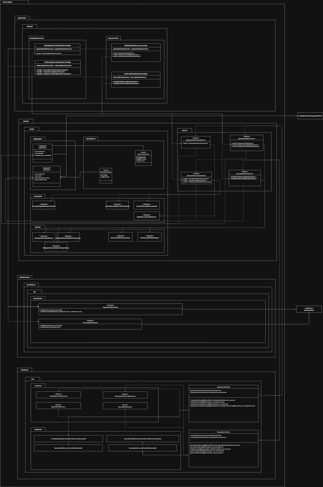

###### 4.2.3.6.2 Bounded Context Database Design Diagram

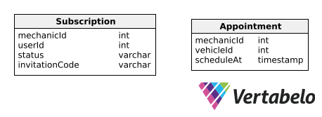

#### 4.2.4 Bounded Context: Bienestar de Vehículos

##### 4.2.4.1 Domain Layer

<h3>Aggregates</h3>
<h4><code>Notification</code></h4>

<strong>Descripción:</strong> Agregado que representa una notificación generada a partir del monitoreo del vehículo. Puede ser de tipo alerta o recomendación, y requiere confirmación del usuario o mecánico.

<table>
  <thead>
    <tr><th>Atributo</th><th>Tipo</th><th>Descripción</th></tr>
  </thead>
  <tbody>
    <tr><td>message</td><td>String</td><td>Mensaje de la notificación.</td></tr>
    <tr><td>type</td><td>NotificationType (Enum)</td><td>Clasificación: ALERT o RECOMMENDATION.</td></tr>
    <tr><td>vehicleId</td><td>Long</td><td>Identificador del vehículo asociado.</td></tr>
    <tr><td>status</td><td>NotificationStatus (Enum)</td><td>Estado de la notificación (PENDING, ACKNOWLEDGED).</td></tr>
  </tbody>
</table>

<h4><code>Metric</code></h4>

<strong>Descripción:</strong> Agregado que representa las métricas clave recopiladas por el dispositivo IoT del vehículo, organizadas como objetos de valor.

<table>
  <thead>
    <tr><th>Atributo</th><th>Tipo</th><th>Descripción</th></tr>
  </thead>
  <tbody>
    <tr><td>odometer</td><td>Odometer (Value Object)</td><td>Distancia total recorrida.</td></tr>
    <tr><td>temperature</td><td>Temperature (Value Object)</td><td>Temperatura actual del motor u otra parte crítica.</td></tr>
    <tr><td>fuelConsumption</td><td>FuelConsumption (Value Object)</td><td>Consumo de combustible registrado.</td></tr>
    <tr><td>vehicleId</td><td>Long</td><td>Identificador del vehículo asociado.</td></tr>
  </tbody>
</table>

<h3>Value Objects</h3>
<h4><code>FuelConsumption</code></h4>
<table>
  <thead>
    <tr><th>Atributo</th><th>Tipo</th><th>Descripción</th></tr>
  </thead>
  <tbody>
    <tr><td>value</td><td>Double</td><td>Consumo registrado.</td></tr>
    <tr><td>unit</td><td>String</td><td>Unidad de medida (ej. L/100km).</td></tr>
  </tbody>
</table>

<h4><code>Odometer</code></h4>
<table>
  <thead>
    <tr><th>Atributo</th><th>Tipo</th><th>Descripción</th></tr>
  </thead>
  <tbody>
    <tr><td>value</td><td>Double</td><td>Valor total recorrido.</td></tr>
    <tr><td>unit</td><td>String</td><td>Unidad de medida (km, millas).</td></tr>
  </tbody>
</table>

<h4><code>Temperature</code></h4>
<table>
  <thead>
    <tr><th>Atributo</th><th>Tipo</th><th>Descripción</th></tr>
  </thead>
  <tbody>
    <tr><td>value</td><td>Double</td><td>Temperatura registrada.</td></tr>
    <tr><td>unit</td><td>String</td><td>Unidad de medida (°C, °F).</td></tr>
  </tbody>
</table>

<h4><code>NotificationType</code> (Enum)</h4>
<ul>
  <li>ALERT</li>
  <li>RECOMMENDATION</li>
</ul>

<h4><code>NotificationStatus</code> (Enum)</h4>
<ul>
  <li>PENDING</li>
  <li>ACKNOWLEDGED</li>
</ul>

<h3>Commands</h3>
<ul>
  <li><code>CreateMetricCommand</code> (Record)</li>
  <li><code>CreateNotificationCommand</code> (Record)</li>
  <li><code>AcknowledgeNotificationCommand</code> (Record)</li>
</ul>

<h3>Queries</h3>
<ul>
  <li><code>GetMetricsByVehicleQuery</code> (Record)</li>
  <li><code>GetMetricsByDateRangeQuery</code> (Record)</li>
  <li><code>GetMetricByIdQuery</code> (Record)</li>
  <li><code>GetNotificationsByVehicleQuery</code> (Record)</li>
  <li><code>GetNotificationByTypeQuery</code> (Record)</li>
  <li><code>GetNotificationByIdQuery</code> (Record)</li>
</ul>

<h3>Services</h3>
<h4><code>MetricCommandService</code> (Interface)</h4>
<ul>
  <li>+ handle(CreateMetricCommand)</li>
</ul>
<h4><code>MetricQueryService</code> (Interface)</h4>
<ul>
  <li>+ handle(GetMetricsByVehicleQuery)</li>
  <li>+ handle(GetMetricsByDateRangeQuery)</li>
  <li>+ handle(GetMetricByIdQuery)</li>
</ul>
<h4><code>NotificationCommandService</code> (Interface)</h4>
<ul>
  <li>+ handle(CreateNotificationCommand)</li>
  <li>+ handle(AcknowledgeNotificationCommand)</li>
</ul>
<h4><code>NotificationQueryService</code> (Interface)</h4>
<ul>
  <li>+ handle(GetNotificationsByVehicleQuery)</li>
  <li>+ handle(GetNotificationByTypeQuery)</li>
  <li>+ handle(GetNotificationByIdQuery)</li>
</ul>

##### 4.2.4.2 Interface Layer

<h3>Controlador: <code>MetricController</code></h3>
<table>
  <tr>
    <th>Título</th>
    <td>MetricController</td>
  </tr>
  <tr>
    <th>Descripción</th>
    <td>Controlador REST que gestiona las operaciones de creación, consulta y recuperación de métricas de bienestar de los vehículos.</td>
  </tr>
</table>
<table>
  <thead>
    <tr>
      <th>Método</th>
      <th>Ruta</th>
      <th>Descripción</th>
    </tr>
  </thead>
  <tbody>
    <tr>
      <td>createMetric</td>
      <td>POST /api/v1/metrics</td>
      <td>Crea una nueva métrica asociada a un vehículo.</td>
    </tr>
    <tr>
      <td>getMetricsByVehicle</td>
      <td>GET /api/v1/metrics/vehicle/{vehicleId}</td>
      <td>Obtiene todas las métricas registradas para un vehículo específico.</td>
    </tr>
    <tr>
      <td>getMetricsByDateRange</td>
      <td>GET /api/v1/metrics/vehicle/{vehicleId}/range?from={from}&to={to}</td>
      <td>Recupera las métricas de un vehículo dentro de un rango de fechas específico.</td>
    </tr>
    <tr>
      <td>getMetricById</td>
      <td>GET /api/v1/metrics/{id}</td>
      <td>Obtiene una métrica específica por su ID.</td>
    </tr>
  </tbody>
</table>
<h4>Dependencias:</h4>
<table>
  <thead>
    <tr>
      <th>Dependencia</th>
      <th>Descripción</th>
    </tr>
  </thead>
  <tbody>
    <tr>
      <td>MetricQueryService</td>
      <td>Servicio para consultas relacionadas con métricas de vehículos.</td>
    </tr>
    <tr>
      <td>MetricCommandService</td>
      <td>Servicio para ejecutar comandos relacionados con la creación y gestión de métricas.</td>
    </tr>
    <tr>
      <td>CreateMetricCommandFromResourceAssembler</td>
      <td>Convierte recursos REST en comandos de creación de métricas.</td>
    </tr>
    <tr>
      <td>MetricResourceFromEntityAssembler</td>
      <td>Convierte entidades de métricas en recursos REST para la respuesta.</td>
    </tr>
    <tr>
      <td>CreateNotificationCommandFromResourceAssembler</td>
      <td>Convierte recursos REST en comandos de creación de notificaciones preventivas relacionadas con métricas.</td>
    </tr>
    <tr>
      <td>NotificationResourceFromEntityAssembler</td>
      <td>Convierte entidades de notificación en recursos REST para la respuesta.</td>
    </tr>
  </tbody>
</table>
<h4>Resources:</h4>
<table>
  <thead>
    <tr>
      <th>Resource</th>
      <th>Descripción</th>
    </tr>
  </thead>
  <tbody>
    <tr>
      <td>CreateMetricResource &lt;&lt;Record&gt;&gt;</td>
      <td>Recurso usado para la creación de métricas.</td>
    </tr>
    <tr>
      <td>MetricResource &lt;&lt;Record&gt;&gt;</td>
      <td>Recurso usado para exponer métricas en las respuestas REST.</td>
    </tr>
    <tr>
      <td>CreateNotificationResource &lt;&lt;Record&gt;&gt;</td>
      <td>Recurso usado para la creación de notificaciones asociadas al bienestar vehicular.</td>
    </tr>
    <tr>
      <td>NotificationResource &lt;&lt;Record&gt;&gt;</td>
      <td>Recurso usado para exponer notificaciones en las respuestas REST.</td>
    </tr>
  </tbody>
</table>

##### 4.2.4.3 Application Layer

<h3>Clase: <code>MetricCommandServiceImpl</code></h3>
<table>
  <tr>
    <th>Título</th>
    <td>MetricCommandServiceImpl</td>
  </tr>
  <tr>
    <th>Descripción</th>
    <td>Implementación del servicio de comandos encargado de gestionar la creación y registro de métricas asociadas al bienestar de los vehículos.</td>
  </tr>
</table>
<table>
  <thead>
    <tr>
      <th>Método</th>
      <th>Descripción</th>
    </tr>
  </thead>
  <tbody>
    <tr>
      <td>handle(RegisterMetricCommand)</td>
      <td>Registra una nueva métrica asociada a un vehículo en el repositorio.</td>
    </tr>
  </tbody>
</table>
<h4>Dependencias:</h4>
<table>
  <thead>
    <tr>
      <th>Dependencia</th>
      <th>Descripción</th>
    </tr>
  </thead>
  <tbody>
    <tr>
      <td>MetricRepository</td>
      <td>Repositorio encargado de la persistencia de métricas de vehículos.</td>
    </tr>
    <tr>
      <td>RegisterMetricCommand</td>
      <td>Comando para registrar nuevas métricas.</td>
    </tr>
  </tbody>
</table>

<h3>Clase: <code>NotificationCommandServiceImpl</code></h3>
<table>
  <tr>
    <th>Título</th>
    <td>NotificationCommandServiceImpl</td>
  </tr>
  <tr>
    <th>Descripción</th>
    <td>Implementación del servicio de comandos encargado de la creación y gestión del ciclo de vida de las notificaciones asociadas a métricas vehiculares.</td>
  </tr>
</table>
<table>
  <thead>
    <tr>
      <th>Método</th>
      <th>Descripción</th>
    </tr>
  </thead>
  <tbody>
    <tr>
      <td>handle(CreateNotificationCommand)</td>
      <td>Crea una notificación asociada a un evento de bienestar vehicular.</td>
    </tr>
    <tr>
      <td>handle(AcknowledgeNotificationCommand)</td>
      <td>Marca una notificación como reconocida por el usuario o sistema.</td>
    </tr>
  </tbody>
</table>
<h4>Dependencias:</h4>
<table>
  <thead>
    <tr>
      <th>Dependencia</th>
      <th>Descripción</th>
    </tr>
  </thead>
  <tbody>
    <tr>
      <td>NotificationRepository</td>
      <td>Repositorio encargado de la persistencia de notificaciones.</td>
    </tr>
    <tr>
      <td>CreateNotificationCommand</td>
      <td>Comando para la creación de notificaciones.</td>
    </tr>
    <tr>
      <td>AcknowledgeNotificationCommand</td>
      <td>Comando para reconocer y actualizar el estado de una notificación.</td>
    </tr>
  </tbody>
</table>

<h3>Clase: <code>MetricQueryServiceImpl</code></h3>
<table>
  <tr>
    <th>Título</th>
    <td>MetricQueryServiceImpl</td>
  </tr>
  <tr>
    <th>Descripción</th>
    <td>Implementación del servicio de consultas encargado de recuperar información relacionada con notificaciones asociadas a métricas de los vehículos.</td>
  </tr>
</table>
<table>
  <thead>
    <tr>
      <th>Método</th>
      <th>Descripción</th>
    </tr>
  </thead>
  <tbody>
    <tr>
      <td>handle(GetNotificationsByVehicleQuery)</td>
      <td>Obtiene todas las notificaciones asociadas a un vehículo específico.</td>
    </tr>
    <tr>
      <td>handle(GetNotificationsByTypeQuery)</td>
      <td>Recupera notificaciones filtradas por tipo (ejemplo: alerta preventiva, advertencia crítica).</td>
    </tr>
    <tr>
      <td>handle(GetNotificationByIdQuery)</td>
      <td>Obtiene una notificación específica a partir de su ID.</td>
    </tr>
  </tbody>
</table>
<h4>Dependencias:</h4>
<table>
  <thead>
    <tr>
      <th>Dependencia</th>
      <th>Descripción</th>
    </tr>
  </thead>
  <tbody>
    <tr>
      <td>MetricRepository</td>
      <td>Repositorio encargado de gestionar métricas y notificaciones asociadas.</td>
    </tr>
    <tr>
      <td>GetNotificationsByVehicleQuery</td>
      <td>Query para recuperar notificaciones de un vehículo.</td>
    </tr>
    <tr>
      <td>GetNotificationsByTypeQuery</td>
      <td>Query para recuperar notificaciones filtradas por tipo.</td>
    </tr>
    <tr>
      <td>GetNotificationByIdQuery</td>
      <td>Query para obtener una notificación específica por su ID.</td>
    </tr>
  </tbody>
</table>

<h3>Clase: <code>NotificationQueryServiceImpl</code></h3>
<table>
  <tr>
    <th>Título</th>
    <td>NotificationQueryServiceImpl</td>
  </tr>
  <tr>
    <th>Descripción</th>
    <td>Implementación del servicio de consultas encargado de recuperar métricas asociadas a un vehículo y exponerlas en diferentes vistas (por rango de fechas, por ID o por vehículo).</td>
  </tr>
</table>
<table>
  <thead>
    <tr>
      <th>Método</th>
      <th>Descripción</th>
    </tr>
  </thead>
  <tbody>
    <tr>
      <td>handle(GetMetricsByVehicleQuery)</td>
      <td>Obtiene todas las métricas asociadas a un vehículo específico.</td>
    </tr>
    <tr>
      <td>handle(GetMetricsByDateRangeQuery)</td>
      <td>Recupera las métricas de un vehículo dentro de un rango de fechas.</td>
    </tr>
    <tr>
      <td>handle(GetMetricByIdQuery)</td>
      <td>Obtiene una métrica específica a partir de su ID.</td>
    </tr>
  </tbody>
</table>
<h4>Dependencias:</h4>
<table>
  <thead>
    <tr>
      <th>Dependencia</th>
      <th>Descripción</th>
    </tr>
  </thead>
  <tbody>
    <tr>
      <td>NotificationRepository</td>
      <td>Repositorio encargado de la persistencia y consulta de métricas asociadas a notificaciones.</td>
    </tr>
    <tr>
      <td>GetMetricsByVehicleQuery</td>
      <td>Query para recuperar todas las métricas de un vehículo.</td>
    </tr>
    <tr>
      <td>GetMetricsByDateRangeQuery</td>
      <td>Query para recuperar métricas dentro de un rango de fechas.</td>
    </tr>
    <tr>
      <td>GetMetricByIdQuery</td>
      <td>Query para obtener una métrica específica por su ID.</td>
    </tr>
  </tbody>
</table>

##### 4.2.4.4 Infrastructure Layer

<h3>Clase: <code>MetricRepository</code> <code>&lt;&lt;Interface&gt;&gt;</code></h3>
<table>
  <tr>
    <th>Título</th>
    <td>MetricRepository</td>
  </tr>
  <tr>
    <th>Descripción</th>
    <td>Interfaz de persistencia para métricas IoT que registran datos en tiempo real del estado del vehículo, con soporte para consultas históricas filtradas por rango de fechas.</td>
  </tr>
</table>
<table>
  <thead>
    <tr>
      <th>Método</th>
      <th>Descripción</th>
    </tr>
  </thead>
  <tbody>
    <tr><td>save(Metric metric)</td><td>Persiste una nueva métrica o actualiza una existente.</td></tr>
    <tr><td>findById(Long id)</td><td>Recupera una métrica específica por identificador.</td></tr>
    <tr><td>findByVehicleId(Long vehicleId)</td><td>Obtiene todas las métricas asociadas a un vehículo.</td></tr>
    <tr><td>findByVehicleIdAndCreateAtBetween(Long vehicleId, LocalDateTime from, LocalDateTime to)</td><td>Obtiene todas las métricas de un vehículo registradas en un rango de fechas.</td></tr>
    <tr><td>findLatestByVehicleId(Long vehicleId)</td><td>Obtiene la última métrica registrada de un vehículo.</td></tr>
    <tr><td>deleteByVehicleId(Long vehicleId)</td><td>Elimina todas las métricas históricas de un vehículo.</td></tr>
  </tbody>
</table>

<h3>Clase: <code>NotificationRepository</code> <code>&lt;&lt;Interface&gt;&gt;</code></h3>
<table>
  <tr>
    <th>Título</th>
    <td>NotificationRepository</td>
  </tr>
  <tr>
    <th>Descripción</th>
    <td>Interfaz de persistencia para notificaciones derivadas del análisis de métricas, soportando búsquedas por vehículo y por rangos temporales.</td>
  </tr>
</table>
<table>
  <thead>
    <tr>
      <th>Método</th>
      <th>Descripción</th>
    </tr>
  </thead>
  <tbody>
    <tr><td>save(Notification notification)</td><td>Persiste una nueva notificación o actualiza una existente.</td></tr>
    <tr><td>findById(Long id)</td><td>Recupera una notificación específica por identificador.</td></tr>
    <tr><td>findByVehicleId(Long vehicleId)</td><td>Obtiene todas las notificaciones asociadas a un vehículo.</td></tr>
    <tr><td>findByDateRangeAndVehicleId(Timestamp from, Timestamp to, long vehicleId)</td><td>Obtiene todas las notificaciones de un vehículo en un rango de fechas específico.</td></tr>
    <tr><td>deleteByVehicleId(Long vehicleId)</td><td>Elimina todas las notificaciones asociadas a un vehículo.</td></tr>
  </tbody>
</table>

##### 4.2.4.5 Bounded Context Software Architecture Component Level Diagrams

##### 4.2.4.6 Bounded Context Software Architecture Code Level Diagrams

###### 4.2.4.6.1 Bounded Context Domain Layer Class Diagrams

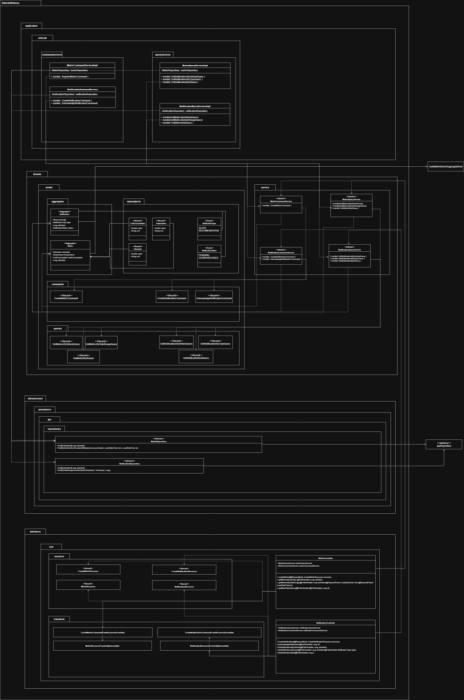

###### 4.2.4.6.2 Bounded Context Database Design Diagram

#### 4.2.5 Bounded Context: Reportes

##### 4.2.5.1 Domain Layer

<h3>Aggregate: <code>Report</code></h3>

<strong>Descripción:</strong>Representa un reporte mensual, con métricas relacionadas a un vehículo a lo largo del periodo de tiempo.

<table>
  <thead>
    <tr>
      <th>Atributos</th>
      <th>Tipo de dato</th>
      <th>Visibilidad</th>
      <th>Descripción</th>
    </tr>
  </thead>
  <tbody>
    <tr>
      <td>reportId</td>
      <td>Long</td>
      <td>Private</td>
      <td>Identificador único del reporte.</td>
    </tr>
    <tr>
      <td>vehicleId</td>
      <td>Long</td>
      <td>Private</td>
      <td>Identificador del vehículo asociado al reporte.</td>
    </tr>
    <tr>
      <td>metrics</td>
      <td>List&lt;Metric&gt;</td>
    </tr>
    <tr>
      <td>reportDate</td>
      <td>Date</td>
      <td>Private</td>
      <td>Fecha de inicio del periodo mensual cubierto por el reporte.</td>
    </tr>
  </tbody>
</table>

<h3>Entidad: <code>Metric</code></h3>

<strong>Descripción:</strong>Representa una métrica perteneciente a un reporte.

<table>
  <thead>
    <tr>
      <th>Atributos</th>
      <th>Tipo de dato</th>
      <th>Visibilidad</th>
      <th>Descripción</th>
    </tr>
  </thead>
  <tbody>
    <tr>
      <td>metricId</td>
      <td>Long</td>
      <td>Private</td>
      <td>Identificador único de la métrica.</td>
    </tr>
    <tr>
      <td>type</td>
      <td>Metric</td>
      <td>Private</td>
      <td>Identificador de la definición de la métrica.</td>
    </tr>
    <tr>
      <td>metricValue</td>
      <td>String</td>
      <td>Private</td>
      <td>Valor de la métrica.</td>
    </tr>
  </tbody>
</table>

<h3>Entity: <code>MetricType</code></h3>

<strong>Descripción:</strong>Representa una métrica perteneciente a un reporte.

<table>
  <thead>
  <tr>
    <th>Atributos</th>
    <th>Tipo de dato</th>
    <th>Visibilidad</th>
    <th>Descripción</th>
  </tr>
  </thead>
  <tbody>
  <tr><td>metricTypeId</td><td>Long</td><td>Private</td><td>Identificador único de la métrica.</td></tr>
  <tr><td>metricName</td><td>String</td><td>Private</td><td>Nombre de la métrica.</td></tr>
  <tr><td>metricDescription</td><td>String</td><td>Private</td><td>Descripción de la métrica.</td></tr>
  </tbody>
</table>

<h3>Interfaz: <code>ReportQueryService</code></h3>

<strong>Descripción:</strong>Servicio de consultas para recuperar información de reportes.

<table>
  <thead>
  <tr>
    <th>Método</th>
    <th>Visibilidad</th>
    <th>Descripción</th>
  </tr>
  </thead>
  <tbody>
    <tr>
      <td>handle(GetReportByIdQuery)</td>
      <td>Público</td>
      <td>Recupera un reporte.</td>
    </tr>
    <tr>
      <td>handle(GetReportByVehicleIdQuery)</td>
      <td>Público</td>
      <td>Recupera todos los reportes pertenecientes a un vehículo.</td>
    </tr>
    <tr>
      <td>handle(GetMetricsByReportIdQuery)</td>
      <td>Público</td>
      <td>Recupera todas las métricas de un reporte específico.</td>
    </tr>
  </tbody>
</table>

<h4>Queries:</h4>
<table>
  <thead>
  <tr>
    <th>Query</th>
    <th>Descripción</th>
  </tr>
  </thead>
  <tbody>
  <tr>
    <td>GetReportByIdQuery</td>
    <td>Consulta de reportes por identificador.</td>
  </tr>
  <tr>
    <td>GetReportByVehicleIdQuery</td>
    <td>Consulta de reportes por identificador de un vehículo.</td>
  </tr>
  <tr>
    <td>GetMetricsByReportIdQuery</td>
    <td>Consulta de métricas por identificador de reporte.</td>
  </tr>
  </tbody>
</table>

<h3>Interfaz: <code>ReportCommandService</code></h3>

<strong>Descripción:</strong>Servicio de comandos para controlar reportes.

<table>
  <thead>
  <tr>
    <th>Método</th>
    <th>Visibilidad</th>
    <th>Descripción</th>
  </tr>
  </thead>
  <tbody>
  <tr>
    <td>handle(GenerateReportCommand)</td>
    <td>Público</td>
    <td>Genera un reporte.</td>
  </tr>
  <tr>
    <td>handle(DeleteReportCommand)</td>
    <td>Público</td>
    <td>Elimina un reporte</td>
  </tr>
  </tbody>
</table>

<h4>Commands:</h4>
<table>
  <thead>
  <tr>
    <th>Command</th>
    <th>Descripción</th>
  </tr>
  </thead>
  <tbody>
  <tr>
    <td>GenerateReportCommand</td>
    <td>Genera un reporte mensual para un vehículo con una fecha de inicio.</td>
  </tr>
  <tr>
    <td>DeleteReportCommand</td>
    <td>Elimina un reporte según su identificador.</td>
  </tr>
  </tbody>
</table>

<h3>Interfaz: <code>MetricTypeCommandService</code></h3>

<strong>Descripción:</strong>Servicio de comandos para controlar definiciones de métricas.

<table>
  <thead>
  <tr>
    <th>Método</th>
    <th>Visibilidad</th>
    <th>Descripción</th>
  </tr>
  </thead>
  <tbody>
  <tr>
    <td>handle(SeedMetricTypesCommand)</td>
    <td>Público</td>
    <td>Inicializa las definiciones de métrica.</td>
  </tr>
  </tbody>
</table>

<h4>Commands:</h4>
<table>
  <thead>
  <tr>
    <th>Command</th>
    <th>Descripción</th>
  </tr>
  </thead>
  <tbody>
  <tr>
    <td>SeedMetricTypesCommand</td>
    <td>Inicializa las definiciones de métricas a nivel interno.</td>
  </tr>
  </tbody>
</table>

##### 4.2.5.2 Interface Layer

<h3>Controlador:<code>ReportController</code></h3>
<table>
  <tr>
    <th>Título</th>
    <td>ReportController</td>
  </tr>
  <tr>
    <th>Descripción</th>
    <td>Controlador REST que maneja la generación y consulta de reportes.</td>
  </tr>
</table>

<table>
  <thead>
    <tr>
      <th>Método</th>
      <th>Ruta</th>
      <th>Descripción</th>
    </tr>
  </thead>
  <tbody>
    <tr>
      <td>generateReport(Long vehicleId, Date startDate)</td>
      <td>POST /api/v1/reports/generate</td>
      <td>Genera un nuevo reporte mensual para un vehículo específicado empezando por la fecha específica.</td>
    </tr>
    <tr>
      <td>getReportById(Long reportId)</td>
      <td>GET /api/v1/reports/{reportId}</td>
      <td>Recupera un reporte con el identificador especificado.</td>
    </tr>
    <tr>
      <td>getAllReportsForVehicle(Long vehicleId)</td>
      <td>GET /api/v1/reports/vehicle/{vehicleId}</td>
      <td>Obtiene todos los reportes de un vehículo específico.</td>
    </tr>
    <tr>
      <td>getAllMetricsFromReport(Long reportId)</td>
      <td>GET /api/v1/reports/{reportId}/metrics</td>
      <td>Obtiene todas las métricas de un reporte específico.</td>
    </tr>
    <tr>
      <td>deleteReport(Long reportId)</td>
      <td>DELETE /api/v1/reports/{id}</td>
      <td>Elimina un report con el identificador específicado.</td>
    </tr>
  </tbody>
</table>

<h4>Dependencias:</h4>
<table>
  <thead>
    <tr>
      <th>Dependencia</th>
      <th>Descripción</th>
    </tr>
  </thead>
  <tbody>
    <tr>
      <td>ReportResource</td>
      <td>Recurso representante de un reporte para comunicación entre interfaces.</td>
    </tr>
    <tr>
      <td>ReportQueryService</td>
      <td>Servicio para consultas y recuperación de reportes.</td>
    </tr>
    <tr>
      <td>ReportCommandService</td>
      <td>Servicio para ejecutar comandos de generación de reportes.</td>
    </tr>
    <tr>
      <td>GenerateReportCommandFromResourceAssembler</td>
      <td>Convierte recursos REST en comandos de generación de reportes.</td>
    </tr>
    <tr>
      <td>ReportResourceFromEntityAssembler</td>
      <td>Convierte entidades de reporte en recursos REST para la respuesta.</td>
    </tr>
  </tbody>
</table>

##### 4.2.5.3 Application Layer

<h3>Clase:<code>ReportQueryServiceImpl</code></h3>
<table>
  <tr>
    <th>Título</th>
    <td>ReportQueryServiceImpl</td>
  </tr>
  <tr>
    <th>Descripción</th>
    <td>Implementación del servicio de consultas para operaciones de lectura relacionadas con reportes.</td>
  </tr>
</table>

<table>
  <thead>
    <tr>
      <th>Método</th>
      <th>Descripción</th>
    </tr>
  </thead>
  <tbody>
  <tr>
    <td>handle(GetReportByIdQuery)</td>
    <td>Recupera un reporte.</td>
  </tr>
  <tr>
    <td>handle(GetReportByVehicleIdQuery)</td>
    <td>Recupera todos los reportes pertenecientes a un vehículo.</td>
  </tr>
  <tr>
    <td>handle(GetMetricsByReportIdQuery)</td>
    <td>Recupera todas las métricas de un reporte específico.</td>
  </tr>
</table>

<h4>Dependencias:</h4>
<table>
  <thead>
  <tr>
    <th>Dependencia</th>
    <th>Descripción</th>
  </tr>
  </thead>
  <tbody>
  <tr>
    <td>ReportRepository</td>
    <td>Repositorio para persistencia de reportes.</td>
  </tr>
  <tr>
    <td>MetricTypeRepository</td>
    <td>Repositorio para persistencia de tipos de métricas.</td>
  </tr>
  </tbody>
</table>

<h3>Clase:<code>ReportCommandServiceImpl</code></h3>
<table>
  <tr>
    <th>Título</th>
    <td>ReportCommandServiceImpl</td>
  </tr>
  <tr>
    <th>Descripción</th>
    <td>Implementación del servicio de comandos para operaciones de control relacionadas con reportes.</td>
  </tr>
</table>

<table>
  <thead>
  <tr>
    <th>Método</th>
    <th>Descripción</th>
  </tr>
  </thead>
  <tbody>
  <tr>
    <td>handle(GenerateReportCommand)</td>
    <td>Genera un reporte.</td>
  </tr>
  <tr>
    <td>handle(DeleteReportCommand)</td>
    <td>Elimina un reporte</td>
  </tr>
</table>

<h4>Dependencias:</h4>
<table>
  <thead>
    <tr>
      <th>Dependencia</th>
      <th>Descripción</th>
    </tr>
  </thead>
  <tbody>
    <tr>
      <td>ReportRepository</td>
      <td>Repositorio para persistencia de reportes.</td>
    </tr>
    <tr>
      <td>MetricTypeRepository</td>
      <td>Repositorio para persistencia de tipos de métricas.</td>
    </tr>
  </tbody>
</table>

<h3>Clase:<code>MetricTypeCommandServiceImpl</code></h3>
<table>
  <tr>
    <th>Título</th>
    <td>MetricTypeCommandServiceImpl</td>
  </tr>
  <tr>
    <th>Descripción</th>
    <td>Implementación del servicio de comandos para operaciones de control relacionadas con definiciones de métricas.</td>
  </tr>
</table>

<table>
  <thead>
  <tr>
    <th>Método</th>
    <th>Descripción</th>
  </tr>
  </thead>
  <tbody>
  <tr>
    <td>handle(SeedMetricTypesCommand)</td>
    <td>Inicializa las definiciones de métricas a nivel interno.</td>
  </tr>
</table>

<h4>Dependencias:</h4>
<table>
  <thead>
  <tr>
    <th>Dependencia</th>
    <th>Descripción</th>
  </tr>
  </thead>
  <tbody>
  <tr>
    <td>MetricTypeRepository</td>
    <td>Repositorio para persistencia de definiciones de métricas.</td>
  </tr>
  </tbody>
</table>

<h3>Clase:<code>ApplicationReadyEventHandler</code></h3>
<table>
  <tr>
    <th>Título</th>
    <td>ApplicationReadyEventHandler</td>
  </tr>
  <tr>
    <th>Descripción</th>
    <td>Clase de manejo de configuraciones iniciales de la aplicación</td>
  </tr>
</table>

<table>
  <thead>
  <tr>
    <th>Método</th>
    <th>Descripción</th>
  </tr>
  </thead>
  <tbody>
  <tr>
    <td>on(ApplicationReadyEvent event)</td>
    <td>Manejo de las acciones ejecutadas al recibir el evento ApplicationReadyEvent</td>
  </tr>
  <tr>
    <td>currentTimestamp()</td>
    <td>Obtiene el tiempo de ejecución de la aplicación en milisegundos.</td>
  </tr>
</table>

<h4>Dependencias:</h4>
<table>
  <thead>
  <tr>
    <th>Dependencia</th>
    <th>Descripción</th>
  </tr>
  </thead>
  <tbody>
  <tr>
    <td>MetricTypeRepository</td>
    <td>Repositorio para persistencia de definiciones de métricas.</td>
  </tr>
  <tr>
    <td>LOGGER</td>
    <td>Atributo para imprimir eventos.</td>
  </tr>
  </tbody>
</table>

##### 4.2.5.4 Infrastructure Layer

<h3>Clase:<code>ReportRepository</code></h3>
<table>
  <tr>
    <th>Título</th>
    <td>ReportRepository</td>
  </tr>
  <tr>
    <th>Descripción</th>
    <td>Interfaz de persistencia para operaciones CRUD y consultas específicas de reportes.</td>
  </tr>
</table>
<table>
  <thead>
    <tr>
      <th>Método</th>
      <th>Descripción</th>
    </tr>
  </thead>
  <tbody>
    <tr>
      <td>findByVehicleId(Long vehicleId)</td>
      <td>Obtiene todos los reportes asociados a un vehículo.</td>
    </tr>
  </tbody>
</table>

<h3>Clase:<code>MetricTypeRepository</code></h3>
<table>
  <tr>
    <th>Título</th>
    <td>MetricTypeRepository</td>
  </tr>
  <tr>
    <th>Descripción</th>
    <td>Interfaz de persistencia para operaciones CRUD y consultas relacionadas con definiciones de métricas.</td>
  </tr>
</table>

##### 4.2.5.5 Bounded Context Software Architecture Component Level Diagrams

##### 4.2.5.6 Bounded Context Software Architecture Code Level Diagrams

###### 4.2.5.6.1 Bounded Context Domain Layer Class Diagrams

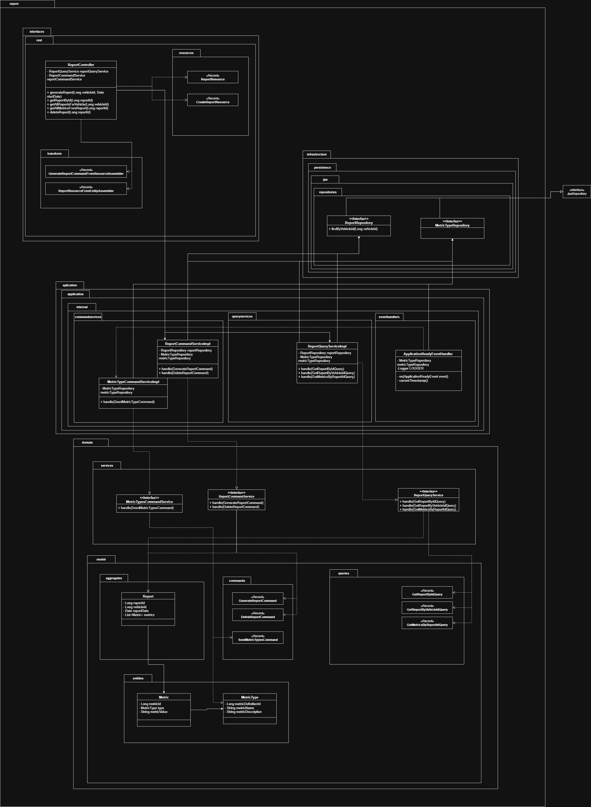

###### 4.2.5.6.2 Bounded Context Database Design Diagram

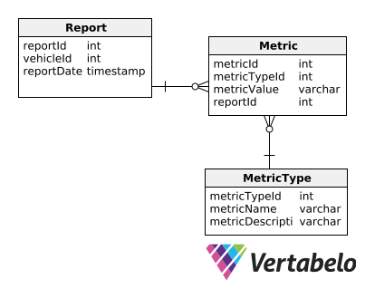

#### 4.2.6. Bounded Context: IAM

##### 4.2.6.1 Domain Layer

<h3>Aggregates</h3>
<h4><code>User</code></h4>

<strong>Descripción:</strong> Agregado raíz que representa a un usuario en la plataforma BykerZ. Centraliza identidad, credenciales y rol.

<table>
  <thead>
    <tr><th>Atributo</th><th>Tipo</th><th>Descripción</th></tr>
  </thead>
  <tbody>
    <tr><td>id</td><td>int</td><td>Identificador único del usuario.</td></tr>
    <tr><td>username</td><td>varchar</td><td>Nombre de usuario único (para login).</td></tr>
    <tr><td>email</td><td>varchar</td><td>Correo electrónico verificado o por verificar.</td></tr>
    <tr><td>password</td><td>varchar</td><td>Contraseña del usuario (almacenada con hash).</td></tr>
    <tr><td>displayName</td><td>varchar</td><td>Nombre visible en la plataforma.</td></tr>
    <tr><td>role</td><td>varchar</td><td>Rol asignado al usuario (ej. ROLE_OWNER, ROLE_MECHANIC, ROLE_ADMIN).</td></tr>
    <tr><td>createdAt</td><td>Timestamp</td><td>Fecha de creación del usuario.</td></tr>
    <tr><td>updatedAt</td><td>Timestamp</td><td>Última fecha de actualización del usuario.</td></tr>
    <tr><td>status</td><td>UserStatus (Enum)</td><td>Estado de la cuenta (ACTIVE, SUSPENDED, DELETED).</td></tr>
  </tbody>
</table>

<h3>Value Objects</h3>
<h4><code>Role</code></h4>

<strong>Descripción:</strong> Representa un rol (conjunto de permisos) que puede asignarse a usuarios.

<table>
  <thead>
    <tr><th>Atributo</th><th>Tipo</th><th>Descripción</th></tr>
  </thead>
  <tbody>
    <tr><td>name</td><td>String</td><td>Nombre del rol (ej. ROLE_OWNER, ROLE_MECHANIC, ROLE_ADMIN).</td></tr>
    <tr><td>permissions</td><td>Set&lt;String&gt;</td><td>Lista de permisos asociados al rol.</td></tr>
  </tbody>
</table>

<h4><code>UserStatus</code> (Enum)</h4>
<ul>
  <li>ACTIVE</li>
  <li>SUSPENDED</li>
  <li>DELETED</li>
</ul>

<h3>Commands</h3>
<ul>
  <li><code>SignUpCommand</code> (Record)</li>
  <li><code>SignInCommand</code> (Record)</li>
  <li><code>UpdateUserInfoCommand</code> (Record)</li>
  <li><code>SeedRolesCommand</code> (Record)</li>
</ul>

<h3>Queries</h3>
<ul>
  <li><code>GetAllRolesQuery</code> (Record)</li>
  <li><code>GetAllUsersQuery</code> (Record)</li>
  <li><code>GetRoleByNameQuery</code> (Record)</li>
  <li><code>GetUserByIdQuery</code> (Record)</li>
  <li><code>GetUserByUsernameQuery</code> (Record)</li>
</ul>

<h3>Services</h3>
<h4><code>UserCommandService</code> (Interface)</h4>
<ul>
  <li>+ handle(SignUpCommand)</li>
  <li>+ handle(SignInCommand)</li>
  <li>+ handle(UpdateUserInfoCommand)</li>
</ul>
<h4><code>UserQueryService</code> (Interface)</h4>
<ul>
  <li>+ handle(GetAllUsersQuery)</li>
  <li>+ handle(GetUserByIdQuery)</li>
  <li>+ handle(GetUserByUsernameQuery)</li>
</ul>
<h4><code>RoleCommandService</code> (Interface)</h4>
<ul>
  <li>+ handle(SeedRolesCommand)</li>
</ul>
<h4><code>RoleQueryService</code> (Interface)</h4>
<ul>
  <li>+ handle(GetAllRolesQuery)</li>
  <li>+ handle(GetRoleByNameQuery)</li>
</ul>

##### 4.2.6.2 Interface Layer

<h3>Controlador: <code>AuthenticationController</code></h3>
<table>
  <tr><th>Título</th><td>AuthenticationController</td></tr>
  <tr><th>Descripción</th><td>Controlador REST encargado de exponer los endpoints para autenticación y registro de usuarios en la plataforma BykerZ.</td></tr>
</table>
<table>
  <thead>
    <tr>
      <th>Método</th>
      <th>Ruta</th>
      <th>Descripción</th>
    </tr>
  </thead>
  <tbody>
    <tr>
      <td>signIn(SignInResource credentials)</td>
      <td>POST /api/iam/auth/signin</td>
      <td>Autentica a un usuario en el sistema y devuelve un token JWT junto con su información básica.</td>
    </tr>
    <tr>
      <td>signUp(SignUpResource data)</td>
      <td>POST /api/iam/auth/signup</td>
      <td>Registra un nuevo usuario en la plataforma con credenciales y rol inicial.</td>
    </tr>
  </tbody>
</table>
<h4>Dependencias:</h4>
<table>
  <thead>
    <tr>
      <th>Dependencia</th>
      <th>Descripción</th>
    </tr>
  </thead>
  <tbody>
    <tr>
      <td>UserCommandService</td>
      <td>Servicio encargado de manejar los comandos relacionados con usuarios.</td>
    </tr>
    <tr>
      <td>AuthenticationResourceAssembler</td>
      <td>Convierte entidades de autenticación en recursos REST para las respuestas.</td>
    </tr>
  </tbody>
</table>

<h3>Controlador: <code>RolesController</code></h3>
<table>
  <tr><th>Título</th><td>RolesController</td></tr>
  <tr><th>Descripción</th><td>Controlador REST encargado de exponer operaciones relacionadas con los roles del sistema.</td></tr>
</table>
<table>
  <thead>
    <tr>
      <th>Método</th>
      <th>Ruta</th>
      <th>Descripción</th>
    </tr>
  </thead>
  <tbody>
    <tr>
      <td>getAllRoles()</td>
      <td>GET /api/iam/roles</td>
      <td>Lista todos los roles disponibles en el sistema.</td>
    </tr>
    <tr>
      <td>getRoleByName(String name)</td>
      <td>GET /api/iam/roles/{name}</td>
      <td>Obtiene un rol específico por su nombre.</td>
    </tr>
    <tr>
      <td>seedRoles()</td>
      <td>POST /api/iam/roles/seed</td>
      <td>Inicializa los roles base del sistema (ej. Owner, Mechanic, Admin).</td>
    </tr>
  </tbody>
</table>
<h4>Dependencias:</h4>
<table>
  <thead>
    <tr>
      <th>Dependencia</th>
      <th>Descripción</th>
    </tr>
  </thead>
  <tbody>
    <tr>
      <td>RoleQueryService</td>
      <td>Servicio para consultas relacionadas con roles.</td>
    </tr>
    <tr>
      <td>RoleCommandService</td>
      <td>Servicio para comandos relacionados con la inicialización de roles.</td>
    </tr>
    <tr>
      <td>RoleResourceAssembler</td>
      <td>Convierte objetos <code>Role</code> en <code>RoleResource</code>.</td>
    </tr>
  </tbody>
</table>

<h3>Controlador: <code>UsersController</code></h3>
<table>
  <tr><th>Título</th><td>UsersController</td></tr>
  <tr><th>Descripción</th><td>Controlador REST encargado de operaciones CRUD y consultas sobre usuarios en BykerZ.</td></tr>
</table>
<table>
  <thead>
    <tr>
      <th>Método</th>
      <th>Ruta</th>
      <th>Descripción</th>
    </tr>
  </thead>
  <tbody>
    <tr>
      <td>getAllUsers()</td>
      <td>GET /api/iam/users</td>
      <td>GET /api/iam/users</td>
      <td>Lista todos los usuarios registrados en la plataforma.</td>
    </tr>
    <tr>
      <td>getUserById(Long id)</td>
      <td>GET /api/iam/users/{id}</td>
      <td>Obtiene los detalles de un usuario por su identificador único.</td>
    </tr>
    <tr>
      <td>updateUserInfo(Long id, UserResource user)</td>
      <td>PUT /api/iam/users/{id}</td>
      <td>Actualiza información de un usuario (displayName, email, role, status).</td>
    </tr>
  </tbody>
</table>
<h4>Dependencias:</h4>
<table>
  <thead>
    <tr>
      <th>Dependencia</th>
      <th>Descripción</th>
    </tr>
  </thead>
  <tbody>
    <tr>
      <td>UserQueryService</td>
      <td>Servicio encargado de consultas de usuarios.</td>
    </tr>
    <tr>
      <td>UserCommandService</td>
      <td>Servicio encargado de manejar los comandos relacionados con la gestión de usuarios.</td>
    </tr>
    <tr>
      <td>UserResourceAssembler</td>
      <td>Convierte entidades <code>User</code> en <code>UserResource</code>.</td>
    </tr>
  </tbody>
</table>

##### 4.2.6.3 Application Layer

<h3>Clase: <code>UserCommandServiceImpl</code></h3>
<table>
  <tr><th>Título</th><td>UserCommandServiceImpl</td></tr>
  <tr><th>Descripción</th><td>Implementación del servicio de comandos para operaciones relacionadas con usuarios.</td></tr>
</table>
<table>
  <thead><tr><th>Método</th><th>Descripción</th></tr></thead>
  <tbody>
    <tr><td>handle(SignUpCommand)</td><td>Registra un nuevo usuario en la plataforma.</td></tr>
    <tr><td>handle(UpdateUserInfoCommand)</td><td>Actualiza la información de un usuario existente.</td></tr>
  </tbody>
</table>
<h4>Dependencias:</h4>
<table>
  <thead><tr><th>Dependencia</th><th>Descripción</th></tr></thead>
  <tbody>
    <tr><td>UserRepository</td><td>Repositorio encargado de la persistencia de usuarios.</td></tr>
    <tr><td>PasswordHashingService</td><td>Servicio de encriptación de contraseñas.</td></tr>
  </tbody>
</table>

<h3>Clase: <code>RoleCommandServiceImpl</code></h3>
<table>
  <tr><th>Título</th><td>RoleCommandServiceImpl</td></tr>
  <tr><th>Descripción</th><td>Implementación del servicio de comandos para la gestión de roles.</td></tr>
</table>
<table>
  <thead><tr><th>Método</th><th>Descripción</th></tr></thead>
  <tbody>
    <tr><td>handle(SeedRolesCommand)</td><td>Inicializa los roles básicos de la aplicación (ej. Admin, Mecánico, Motociclista).</td></tr>
  </tbody>
</table>
<h4>Dependencias:</h4>
<table>
  <thead><tr><th>Dependencia</th><th>Descripción</th></tr></thead>
  <tbody>
    <tr><td>RoleRepository</td><td>Repositorio encargado de la persistencia y gestión de roles.</td></tr>
  </tbody>
</table>

<h3>Clase: <code>AuthenticationCommandServiceImpl</code></h3>
<table>
  <tr><th>Título</th><td>AuthenticationCommandServiceImpl</td></tr>
  <tr><th>Descripción</th><td>Implementación del servicio de comandos para operaciones de autenticación.</td></tr>
</table>
<table>
  <thead><tr><th>Método</th><th>Descripción</th></tr></thead>
  <tbody>
    <tr><td>handle(SignInCommand)</td><td>Autentica a un usuario y devuelve un token JWT válido.</td></tr>
  </tbody>
</table>
<h4>Dependencias:</h4>
<table>
  <thead><tr><th>Dependencia</th><th>Descripción</th></tr></thead>
  <tbody>
    <tr><td>UserRepository</td><td>Repositorio de usuarios para verificar credenciales.</td></tr>
    <tr><td>PasswordHashingService</td><td>Servicio de verificación de contraseñas encriptadas.</td></tr>
    <tr><td>TokenProviderService</td><td>Servicio encargado de la generación de tokens JWT.</td></tr>
  </tbody>
</table>

<h3>Clase: <code>UserQueryServiceImpl</code></h3>
<table>
  <tr><th>Título</th><td>UserQueryServiceImpl</td></tr>
  <tr><th>Descripción</th><td>Implementación del servicio de consultas para obtener información de usuarios.</td></tr>
</table>
<table>
  <thead><tr><th>Método</th><th>Descripción</th></tr></thead>
  <tbody>
    <tr><td>handle(GetAllUsersQuery)</td><td>Obtiene la lista completa de usuarios registrados.</td></tr>
    <tr><td>handle(GetUserByIdQuery)</td><td>Recupera los detalles de un usuario por su ID.</td></tr>
    <tr><td>handle(GetUserByUsernameQuery)</td><td>Busca un usuario por su nombre de usuario.</td></tr>
  </tbody>
</table>
<h4>Dependencias:</h4>
<table>
  <thead><tr><th>Dependencia</th><th>Descripción</th></tr></thead>
  <tbody>
    <tr><td>UserRepository</td><td>Repositorio encargado de consultas de usuarios.</td></tr>
  </tbody>
</table>

<h3>Clase: <code>RoleQueryServiceImpl</code></h3>
<table>
  <tr><th>Título</th><td>RoleQueryServiceImpl</td></tr>
  <tr><th>Descripción</th><td>Implementación del servicio de consultas para roles.</td></tr>
</table>
<table>
  <thead><tr><th>Método</th><th>Descripción</th></tr></thead>
  <tbody>
    <tr><td>handle(GetAllRolesQuery)</td><td>Obtiene todos los roles disponibles en el sistema.</td></tr>
    <tr><td>handle(GetRoleByNameQuery)</td><td>Recupera un rol específico por su nombre.</td></tr>
  </tbody>
</table>
<h4>Dependencias:</h4>
<table>
  <thead><tr><th>Dependencia</th><th>Descripción</th></tr></thead>
  <tbody>
    <tr><td>RoleRepository</td><td>Repositorio encargado de consultas de roles.</td></tr>
  </tbody>
</table>

<h3>Clase: <code>ApplicationReadyEventHandler</code></h3>
<table>
  <tr><th>Título</th><td>ApplicationReadyEventHandler</td></tr>
  <tr><th>Descripción</th><td>Manejador de eventos que inicializa los roles base al iniciar la aplicación.</td></tr>
</table>
<table>
  <thead><tr><th>Evento</th><th>Acción</th></tr></thead>
  <tbody>
    <tr><td>ApplicationReadyEvent</td><td>Ejecuta el <code>SeedRolesCommand</code> para poblar roles iniciales.</td></tr>
  </tbody>
</table>
<h4>Dependencias:</h4>
<table>
  <thead><tr><th>Dependencia</th><th>Descripción</th></tr></thead>
  <tbody>
    <tr><td>RoleCommandServiceImpl</td><td>Servicio de comandos encargado de sembrar los roles iniciales.</td></tr>
  </tbody>
</table>

<h3>Clase: <code>PasswordHashingService</code></h3>
<table>
  <tr><th>Título</th><td>PasswordHashingService</td></tr>
  <tr><th>Descripción</th><td>Servicio encargado de encriptar y verificar contraseñas.</td></tr>
</table>
<table>
  <thead><tr><th>Método</th><th>Descripción</th></tr></thead>
  <tbody>
    <tr><td>hashPassword(String plainPassword)</td><td>Genera un hash seguro de una contraseña en texto plano.</td></tr>
    <tr><td>verifyPassword(String plainPassword, String hashedPassword)</td><td>Valida si una contraseña en texto plano coincide con su hash almacenado.</td></tr>
  </tbody>
</table>

<h3>Clase: <code>TokenProviderService</code></h3>
<table>
  <tr><th>Título</th><td>TokenProviderService</td></tr>
  <tr><th>Descripción</th><td>Servicio encargado de generar y validar tokens JWT para la autenticación.</td></tr>
</table>
<table>
  <thead><tr><th>Método</th><th>Descripción</th></tr></thead>
  <tbody>
    <tr><td>generateToken(User user)</td><td>Genera un token JWT a partir de la información de un usuario.</td></tr>
    <tr><td>validateToken(String token)</td><td>Valida la autenticidad y vigencia de un token JWT.</td></tr>
  </tbody>
</table>

###### 4.2.6.4 Infrastructure Layer

<h3>Clase: <code>UserRepositoryImpl</code></h3>

<strong>Descripción:</strong> Implementación de <code>UserRepository</code> usando JPA/Hibernate para persistir y consultar usuarios.

<table>
  <thead>
    <tr><th>Método</th><th>Descripción</th></tr>
  </thead>
  <tbody>
    <tr><td>save(User user)</td><td>Persiste o actualiza un usuario.</td></tr>
    <tr><td>findById(Long id)</td><td>Recupera un usuario por ID.</td></tr>
    <tr><td>findByUsername(String username)</td><td>Recupera un usuario por su nombre de usuario.</td></tr>
    <tr><td>findByEmail(String email)</td><td>Recupera un usuario por email.</td></tr>
    <tr><td>findAll()</td><td>Lista todos los usuarios registrados.</td></tr>
  </tbody>
</table>

<h3>Clase: <code>RoleRepositoryImpl</code></h3>

<strong>Descripción:</strong> Implementación de <code>RoleRepository</code> usando JPA/Hibernate para manejar roles y permisos.

<table>
  <thead>
    <tr><th>Método</th><th>Descripción</th></tr>
  </thead>
  <tbody>
    <tr><td>save(Role role)</td><td>Persiste un rol.</td></tr>
    <tr><td>findByName(String name)</td><td>Busca un rol por nombre.</td></tr>
    <tr><td>findAll()</td><td>Lista todos los roles disponibles.</td></tr>
  </tbody>
</table>

<h3>Clase: <code>PasswordHashingServiceImpl</code></h3>

<strong>Descripción:</strong> Implementación de <code>PasswordHashingService</code> que maneja el hash seguro de contraseñas usando BCrypt.

<table>
  <thead>
    <tr><th>Método</th><th>Descripción</th></tr>
  </thead>
  <tbody>
    <tr><td>hashPassword(String rawPassword)</td><td>Devuelve el hash de la contraseña.</td></tr>
    <tr><td>verifyPassword(String rawPassword, String hashedPassword)</td><td>Verifica una contraseña contra su hash.</td></tr>
  </tbody>
</table>

<h3>Clase: <code>TokenProviderServiceImpl</code></h3>

<strong>Descripción:</strong> Implementación de <code>TokenProviderService</code> para generar y validar tokens JWT (usando jjwt o Spring Security JWT).

<table>
  <thead>
    <tr><th>Método</th><th>Descripción</th></tr>
  </thead>
  <tbody>
    <tr><td>generateToken(User user)</td><td>Genera un token JWT con datos del usuario.</td></tr>
    <tr><td>validateToken(String token)</td><td>Valida un token y devuelve si es válido.</td></tr>
    <tr><td>extractUsername(String token)</td><td>Obtiene el username desde el token.</td></tr>
  </tbody>
</table>

##### 4.2.6.5 Bounded Context Software Architecture Component Level Diagrams

##### 4.2.6.6 Bounded Context Software Architecture Code Level Diagrams

###### 4.2.6.6.1 Bounded Context Domain Layer Class Diagrams

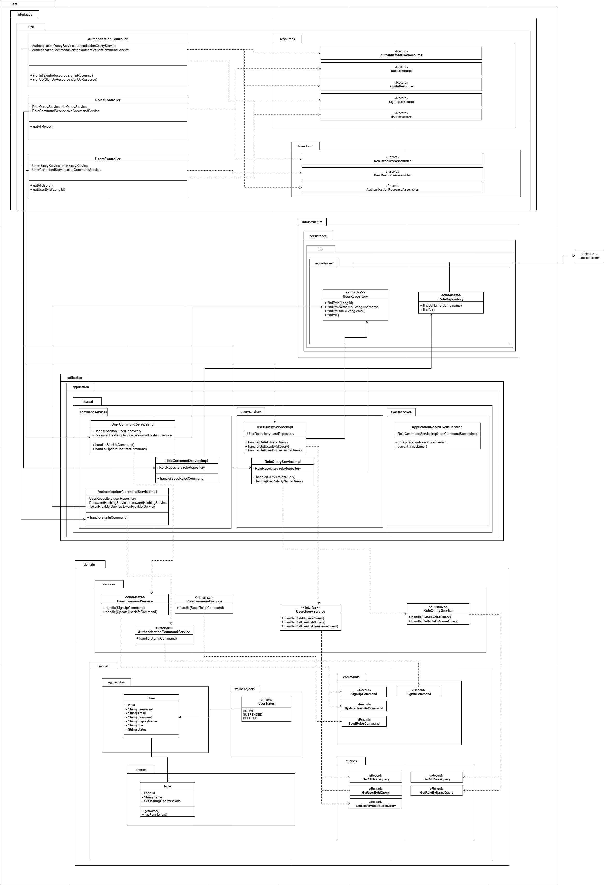

###### 4.2.6.6.2 Bounded Context Database Design Diagram

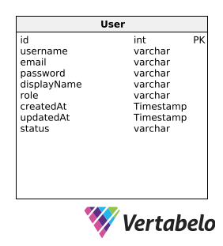

## Conclusiones

## Bibliografía

## Anexos
