# Universidad Peruana de Ciencias Aplicadas

### **CURSO:** Desarrollo de Soluciones IoT

### **NRC**: 3443

### **Profesor:** Ángel Augusto Velásquez Núñez

### **Ingeniería de software**

## Informe de -

### **Nombre del startup:** NRG8

### **Nombre del producto:** -

## **Integrantes**

| **Nombre**                                | **Codigo** |
|-------------------------------------------|------------|
| **Alejo Cardenas Jose Antonio**           | U202122484 |
| **Astonitas Díaz Juan Diego**             | U202110237 |
| **Casas Sanchez Gabriel Alexander**       | U202220033 |
| **Pacheco Astiguetta Sebastian**          | U202110291 |
| **Paitan Pumachuca Max Anthony**          | U201314454 |
| **Pasquale Barrenechea Gianluca Santino** | U202112078 |
| **Real Calderon Sebatian Omar**           | U20221D964 |

**Agosto 2025**

## Registro de Versiones del Informe

<table>
  <thead>
    <tr>
      <th>Versión</th>
      <th>Fecha</th>
      <th>Autor</th>
      <th>Descripción de modificación</th>
    </tr>
  </thead>
  <tbody>
    <tr>
      <td></td>
      <td></td>
      <td></td>
      <td></td>
    </tr>
  </tbody>
</table>

## Project Report Collaboration Insights

El enlace a github del reporte del proyecto es el siguiente: [https://github.com/NRG-8-IOT/report](https://github.com/NRG-8-IOT/report).

## Contenido

- [Universidad Peruana de Ciencias Aplicadas](#universidad-peruana-de-ciencias-aplicadas)
    - [**CURSO:** Desarrollo de Soluciones IoT](#curso-desarrollo-de-soluciones-iot)
    - [**NRC**: 3443](#nrc-3443)
    - [**Profesor:** Ángel Augusto Velásquez Núñez](#profesor-ángel-augusto-velásquez-núñez)
    - [**Ingeniería de software**](#ingeniería-de-software)
  - [Informe de -](#informe-de--)
    - [**Nombre del startup:** NRG8](#nombre-del-startup-nrg8)
    - [**Nombre del producto:** -](#nombre-del-producto--)
  - [**Integrantes**](#integrantes)
  - [Registro de Versiones del Informe](#registro-de-versiones-del-informe)
  - [Project Report Collaboration Insights](#project-report-collaboration-insights)
  - [Contenido](#contenido)
  - [Student Outcome](#student-outcome)
  - [Capítulo I: Introducción](#capítulo-i-introducción)
    - [1.1 Startup Profile](#11-startup-profile)
      - [1.1.1 Descripción de la Startup](#111-descripción-de-la-startup)
      - [1.1.2 Perfiles de integrantes del equipo](#112-perfiles-de-integrantes-del-equipo)
    - [1.2 Solution Profile](#12-solution-profile)
      - [1.2.1 Antecedentes y problemática](#121-antecedentes-y-problemática)
      - [1.2.2 Lean UX Process](#122-lean-ux-process)
        - [1.2.2.1 Lean UX Problem Statements](#1221-lean-ux-problem-statements)
        - [1.2.2.2 Lean UX Assumptions](#1222-lean-ux-assumptions)
        - [1.2.2.3 Lean UX Hypothesis Statements](#1223-lean-ux-hypothesis-statements)
        - [1.2.2.4 Lean UX Canvas](#1224-lean-ux-canvas)
    - [1.3 Segmentos objetivo](#13-segmentos-objetivo)
  - [Capítulo II: Requirements Elicitation \& Analysis](#capítulo-ii-requirements-elicitation--analysis)
    - [2.1 Competidores](#21-competidores)
      - [2.1.1 Análisis competitivo](#211-análisis-competitivo)
      - [2.1.2 Estrategias y tácticas frente a competidores](#212-estrategias-y-tácticas-frente-a-competidores)
    - [2.2 Entrevistas](#22-entrevistas)
      - [2.2.1 Diseño de entrevistas](#221-diseño-de-entrevistas)
      - [2.2.2 Registro de entrevistas](#222-registro-de-entrevistas)
      - [2.2.3 Análisis de entrevistas](#223-análisis-de-entrevistas)
    - [2.3 Needfinding](#23-needfinding)
      - [2.3.1 User Personas](#231-user-personas)
      - [2.3.2 User Task Matrix](#232-user-task-matrix)
      - [2.3.3 User Journey Mapping](#233-user-journey-mapping)
      - [2.3.4 Empathy Mapping](#234-empathy-mapping)
    - [2.4 Big Picture EventStorming](#24-big-picture-eventstorming)
    - [2.5 Ubiquitous Language](#25-ubiquitous-language)
  - [Capítulo III: Requirements Specification](#capítulo-iii-requirements-specification)
    - [3.1 User Stories](#31-user-stories)
    - [3.2 Impact Mapping](#32-impact-mapping)
    - [3.3 Product Backlog](#33-product-backlog)
  - [Capítulo IV: Solution Software Design](#capítulo-iv-solution-software-design)
    - [4.1 Strategic-Level Attribute-Driven Design](#41-strategic-level-attribute-driven-design)
      - [4.1.1 Design-Level EventStorming](#411-design-level-eventstorming)
        - [4.1.1.1 Candidate Context Discovery](#4111-candidate-context-discovery)
        - [4.1.1.2 Domain Message Flows Modeling](#4112-domain-message-flows-modeling)
        - [4.1.1.3 Bounded Context Canvases](#4113-bounded-context-canvases)
      - [4.1.2 Context Mapping](#412-context-mapping)
      - [4.1.3 Software Architecture](#413-software-architecture)
        - [4.1.3.1 Software Architecture System Landscape Diagram](#4131-software-architecture-system-landscape-diagram)
        - [4.1.3.2 Software Architecture Context Level Diagrams](#4132-software-architecture-context-level-diagrams)
        - [4.1.3.3 Software Architecture Container Level Diagrams](#4133-software-architecture-container-level-diagrams)
        - [4.1.3.4 Software Architecture Deployment Diagrams](#4134-software-architecture-deployment-diagrams)
    - [4.2 Tactical-Level Domain-Driven Design](#42-tactical-level-domain-driven-design)
      - [4.2.1 Bounded Context: unnamed](#421-bounded-context-unnamed)
        - [4.2.1.1 Domain Layer](#4211-domain-layer)
        - [4.2.1.2 Interface Layer](#4212-interface-layer)
        - [4.2.1.3 Application Layer](#4213-application-layer)
        - [4.2.1.4 Infrastructure Layer](#4214-infrastructure-layer)
        - [4.2.1.5 Bounded Context Software Architecture Component Level Diagrams](#4215-bounded-context-software-architecture-component-level-diagrams)
        - [4.2.1.6 Bounded Context Software Architecture Code Level Diagrams](#4216-bounded-context-software-architecture-code-level-diagrams)
          - [4.2.1.6.1 Bounded Context Domain Layer Class Diagrams](#42161-bounded-context-domain-layer-class-diagrams)
          - [4.2.1.6.2 Bounded Context Database Design Diagram](#42162-bounded-context-database-design-diagram)
  - [Conclusiones](#conclusiones)
  - [Bibliografía](#bibliografía)
  - [Anexos](#anexos)

## Student Outcome

El curso contribuye al cumplimiento del Student Outcome ABET:

**ABET – EAC - Student Outcome 5**

Criterio: *La capacidad de funcionar efectivamente en un equipo cuyos miembros juntos proporcionan liderazgo, crean un entorno de colaboración e inclusivo, establecen objetivos, planifican tareas y cumplen objetivos.*
En el siguiente cuadro se describe las acciones realizadas y enunciados de
conclusiones por parte del grupo, que permiten sustentar el haber alcanzado el logro
del ABET – EAC - Student Outcome 5.

<table>
  <thead>
    <tr>
      <th style="text-align: left;">Criterio específico</th>
      <th style="text-align: left;">Acciones realizadas</th>
      <th style="text-align: left;">Conclusiones</th>
    </tr>
  </thead>
  <tbody>
    <tr>
      <td><strong>Trabaja en equipo para proporcionar liderazgo en forma conjunta</strong></td>
      <td>
        -
      </td>
      <td>
        -
      </td>
    </tr>
    <tr>
      <td><strong>Crea un entorno colaborativo e inclusivo, establece metas, planifica tareas y cumple objetivos.</strong></td>
      <td>
        -
      </td>
      <td>
        -
      </td>
    </tr>
  </tbody>
</table>

## Capítulo I: Introducción

### 1.1 Startup Profile

#### 1.1.1 Descripción de la Startup

#### 1.1.2 Perfiles de integrantes del equipo

### 1.2 Solution Profile

#### 1.2.1 Antecedentes y problemática

#### 1.2.2 Lean UX Process

##### 1.2.2.1 Lean UX Problem Statements

##### 1.2.2.2 Lean UX Assumptions

##### 1.2.2.3 Lean UX Hypothesis Statements

##### 1.2.2.4 Lean UX Canvas

### 1.3 Segmentos objetivo

## Capítulo II: Requirements Elicitation & Analysis

### 2.1 Competidores

- Wialon (Gurtam)
  
  
  
  Wialon es la plataforma de software insignia de Gurtam, una empresa bielorrusa con más de 20 años en el mercado de telemática e IoT. Está considerada una de las soluciones más versátiles para la gestión de flotas y activos móviles, con más de 4 millones de unidades conectadas en más de 160 países. Wialon funciona bajo un modelo SaaS altamente escalable y soporta más de 3.000 modelos de dispositivos GPS e IoT, lo que permite adaptarse a diferentes necesidades: desde camiones y buses hasta maquinaria pesada o transporte ligero. Entre sus funcionalidades principales destacan el rastreo en tiempo real, generación de informes personalizados, alertas de eventos, gestión de combustible, mantenimiento predictivo y herramientas de integración por API. Su principal fortaleza radica en la gran flexibilidad y ecosistema de partners, lo que lo convierte en una solución preferida para empresas de logística, transporte y operadores de flotas internacionales.

- Fuelio
  
  
  
  Fuelio es una aplicación móvil enfocada en la gestión del consumo de combustible y el mantenimiento vehicular. Permite a los usuarios registrar de manera sencilla el kilometraje, repostajes, costos asociados y servicios realizados al vehículo, generando estadísticas detalladas sobre rendimiento y gastos. La app ofrece funcionalidades adicionales como localización de estaciones de servicio cercanas, cálculo de consumo por trayecto, y respaldo automático en la nube para mantener los datos seguros y accesibles en múltiples dispositivos. Su propuesta de valor radica en brindar control y transparencia sobre los gastos de movilidad, ayudando tanto a conductores individuales como a pequeños administradores de vehículos a optimizar su presupuesto y hábitos de conducción.
  
- GeoTab

  
  
  Geotab, fundada en 2000 en Canadá, es uno de los líderes globales en telemática comercial y gestión de flotas, con más de 3,7 millones de vehículos conectados en más de 150 países. Su propuesta combina el dispositivo IoT Geotab GO9 con la plataforma en la nube MyGeotab, lo que permite a empresas de cualquier tamaño acceder a datos avanzados de sus vehículos. Entre sus principales funcionalidades se incluyen análisis de comportamiento de conducción, diagnóstico de motor, consumo de combustible, planificación de rutas, alertas de mantenimiento, cumplimiento normativo (como ELD en EE.UU.) y reportes personalizados. Además, Geotab cuenta con el Geotab Marketplace, un ecosistema de más de 200 aplicaciones complementarias que amplían las capacidades de la plataforma. Su diferenciador está en la precisión de sus análisis, confiabilidad y enfoque en big data e inteligencia artificial, que permiten a empresas grandes y gobiernos tomar decisiones estratégicas basadas en datos de movilidad.

#### 2.1.1 Análisis competitivo

| **Categoría** | **Byker Z** | **Wialon (Gurtam)** | **Fuelio** | **Geotab** |
|---------------|----------------|----------------------|------------|------------|
| **Perfil - Overview** | Plataforma IoT para motocicletas que conecta mecánicos con clientes, con métricas en tiempo real y alertas preventivas. | SaaS de telemática IoT para gestión de vehículos y activos móviles, con GPS y reportes avanzados. | App para rastrear consumo de combustible, costos, kilometraje y servicios, con búsqueda de estaciones y respaldo en la nube. | Líder global en telemática, con dispositivos IoT y software para análisis de datos vehiculares. |
| **Ventaja competitiva** | Enfoque de nicho: motos + talleres mecánicos. Conexión directa cliente-mecánico mediante suscripción. | Amplia cobertura global y flexibilidad de personalización para distintos tipos de flotas. | Interfaz sencilla, soporte crowdsourced de precios, recordatorios, sincronización y reportes visuales potentes. | Precisión en datos y analítica avanzada, gran reputación en confiabilidad. |
| **Perfil de Marketing - Mercado Objetivo** | Motociclistas individuales y talleres mecánicos pequeños/medianos. | Empresas de logística, transporte y flotas heterogéneas. | Usuarios que buscan ahorro en combustible y seguimiento básico de gastos vehiculares, incluidos conductores particulares y usuarios multi-vehículo. | Flotas comerciales, gobiernos, corporativos globales. |
| **Estrategias de Marketing** | Enfoque B2B2C: atraer talleres como socios y motociclistas vía suscripción. | Estrategia B2B, alianzas con distribuidores y partners locales. | Se promociona como simple y potente; cuenta con integración de precios crowdsourced, historias de usuarios satisfechos y respaldo de Sygic. | Estrategia B2B global, certificaciones y partnerships institucionales. |
| **Perfil de Producto - Productos & Servicios** | Sensores IoT para motos, app móvil/web para clientes, dashboard para mecánicos, alertas proactivas. | Plataforma SaaS con GPS, sensores IoT, informes personalizados. | Fill-ups, gastos, recordatorios, estación de gasolina cercana, gráficos, estadísticas, sincronización.   Pro: planificación de ruta, estimación de costo, filtro estaciones, reporte de ruta. | Dispositivos IoT + plataforma de análisis con diagnósticos y mantenimiento predictivo. |
| **Precios & Costos** | Modelo de suscripción mensual accesible (B2C) + paquetes premium para talleres. | Licencias SaaS escalables, costos variables por flota. | Gratuito, Fuelio Pro en Android es suscripción (€7 - €9) sin afectar funciones gratuitas. | Suscripción SaaS + costo de dispositivos IoT (moderado/alto). |
| **Canales de Distribución** | App móvil (Android), web, talleres como canales de adquisición. | Red de partners y distribuidores en más de 150 países. | Android & iOS. | Red global de resellers y partners certificados. |
| **SWOT - Fortalezas** | Nicho diferenciado, cercanía con usuarios finales, foco en motos. | Escalabilidad, robustez y experiencia global. | Interfaz amigable, precios crowdsourced, reportes detallados, muchos features gratuitos. | Precisión en analítica, confiabilidad, amplia red global. |
| **SWOT - Debilidades** | Proyecto nuevo, sin marca consolidada, recursos limitados. | No especializado en motos, alto costo para pequeños talleres. | Entrada manual laboriosa, problemas ocasionales de sincronización. | Altos costos, pensado para grandes flotas, no para usuarios individuales. |
| **SWOT - Oportunidades** | Mercado creciente de motocicletas en LATAM/Asia, tendencia a IoT y mantenimiento predictivo. | Expansión en verticales nuevos como motos y microflotas. | Expandir trip logging, entradas automáticas, soporte ampliado en iOS. | Penetración en mercados emergentes y nuevas integraciones IoT. |
| **SWOT - Amenazas** | Ingreso de grandes players al nicho, barreras de hardware. | Competencia creciente y commoditización de la telemática. | Cambios en licenciamiento por Sygic; apps emergentes con mejor UX o IA predictiva. | Alta competencia y presión por diferenciación. |

#### 2.1.2 Estrategias y tácticas frente a competidores

1. Estrategia de Diferenciación Tecnológica (IoT + Diagnósticos Predictivos)
   
Objetivo: Posicionar a BykerZ como la primera solución que integra hardware IoT y software para ofrecer métricas automáticas en tiempo real y diagnósticos predictivos, superando la limitación de registros manuales en Drivvo, aCar y Fuelio.

Tácticas:

Desarrollar un dispositivo IoT plug & play que se instale fácilmente en motos urbanas.

Integrar algoritmos de mantenimiento predictivo basados en telemetría.

Generar reportes personalizados descargables para usuarios y mecánicos.

Comunicar en marketing el diferencial clave: “No registres datos, deja que tu moto hable por ti”.

2. Estrategia de Enfoque en Nichos Desatendidos (Motos Urbanas + Mecánicos)
   
Objetivo: Atacar un mercado poco atendido: motociclistas urbanos y talleres mecánicos, en contraste con las apps competidoras que se enfocan en autos y flotas.

Tácticas:

Ofrecer funcionalidades específicas para motos (ej. control de gasolina por cilindrada, alertas de aceite, historial de mantenimientos por kilometraje).

Crear una app web exclusiva para mecánicos, con comparativos por modelo y gestión de clientes.

Establecer alianzas con talleres locales y concesionarios de motos para distribución del IoT.

Campañas de marketing dirigidas a delivery riders, mototaxistas y jóvenes motociclistas urbanos.

3. Estrategia de Marca Cercana y Comunitaria
   
Objetivo: Construir confianza mostrando a BykerZ como una solución hecha por y para motociclistas y mecánicos, en lugar de una app genérica de gastos.

Tácticas:

Crear una comunidad digital de motociclistas, con foros y tips de mecánica preventiva.

Usar un lenguaje simple y cercano, evitando tecnicismos innecesarios.

Brindar soporte personalizado (ej. chat directo, FAQs en video, tutoriales cortos en redes).

Generar contenido educativo sobre seguridad, ahorro de combustible y mantenimiento inteligente.

4. Estrategia de Precio Accesible y Transparente
   
Objetivo: Superar la percepción negativa de Drivvo (suscripción costosa) y Fuelio Pro (costo adicional), ofreciendo planes claros y económicos.

Tácticas:

Modelo freemium real: funcionalidades básicas siempre gratuitas (seguimiento de consumo y alertas).

Plan Premium accesible (<$2/mes) con reportes predictivos, diagnósticos avanzados y sincronización completa.

Precio del dispositivo IoT asequible (ej. $30–40) con facilidades de pago en talleres.

Descuentos especiales para mecánicos que adquieran múltiples dispositivos para sus clientes.

5. Estrategia de Diferenciación por Especialización en Motocicletas

Objetivo: Posicionar la solución como un producto diseñado específicamente para motocicletas y talleres mecánicos, en contraste con los competidores que se orientan a flotas grandes y heterogéneas (Wialon, Geotab).

Tácticas:

Desarrollar una interfaz amigable y personalizada para mecánicos y motociclistas.

Ofrecer funcionalidades exclusivas para motos (ej. alertas de mantenimiento de cadena, aceite, frenos).

Construir una narrativa de marca clara: “la telemática de las motos”.

6. Estrategia de Accesibilidad y Flexibilidad en el Modelo de Negocio

Objetivo: Competir contra grandes competidores (Wialon, Samsara, Geotab) ofreciendo un producto más accesible, económico y fácil de implementar, enfocado en usuarios individuales y talleres pequeños.

Tácticas:

Diseñar planes de suscripción escalonados (desde básicos hasta avanzados) que permitan crecer al ritmo del usuario.

Incluir un modelo freemium o demo para captar usuarios rápidamente sin barreras de entrada.

Resaltar la facilidad de instalación de sensores IoT en motos, evitando hardware costoso o complejo.

7. Estrategia de Cercanía y Comunidad con el Usuario Final

Objetivo: Diferenciarse por la relación directa y de confianza entre motociclistas y mecánicos, creando una comunidad alrededor del producto que los competidores globales no priorizan.

Tácticas:

Lanzar campañas de marketing en comunidades locales (Facebook, Instagram, clubes de motociclistas, foros especializados).

Promover talleres mecánicos como socios estratégicos para captar clientes y distribuir el IoT.

Desarrollar integraciones futuras con aseguradoras o talleres certificados, ofreciendo beneficios adicionales (ej. descuentos en seguros, paquetes de mantenimiento).

### 2.2 Entrevistas

#### 2.2.1 Diseño de entrevistas

- Diseño de entrevistas para Motociclistas

Preguntas principales:

1. ¿Podrías contarme un poco sobre ti? (edad, ocupación, lugar de residencia, estado civil)

2. ¿Cómo sueles llevar el control del gasto de combustible y mantenimiento de tu moto?

3. ¿Con qué frecuencia realizas mantenimientos preventivos a tu moto?

4. ¿Has tenido problemas con fallas inesperadas o gastos imprevistos relacionados con tu moto?

5. ¿Cómo te comunicas actualmente con tu mecánico cuando necesitas una revisión o reparación?

Preguntas complementarias:

1. ¿Utilizas actualmente alguna aplicación o herramienta digital para registrar tus gastos o consumo de gasolina?

2. ¿Qué tan cómodo te sentirías si tu moto enviara automáticamente datos de su estado a una aplicación?

3. ¿Qué indicadores del estado de tu moto te gustaría conocer en tiempo real? (ejemplo: presión de neumáticos, combustible, temperatura del motor)

4. ¿Qué tan útil te parecería recibir alertas en tu celular sobre posibles fallas antes de que ocurran?

5. ¿Qué tipo de alertas te serían más útiles? (ejemplo: cambio de aceite, nivel de gasolina, revisión de frenos)

6. ¿Qué dispositivos usas más frecuentemente para organizarte o monitorear cosas? (móvil, laptop, tablet)

7. ¿Qué valoras más en una app para motos? (ejemplo: simplicidad, visualización clara de métricas, recordatorios)

8. ¿Cuánto estarías dispuesto a pagar por un servicio que prevenga fallos y prolongue la vida útil de tu moto?

- Diseño de entrevistas para Mecanicos

Preguntas principales:

1. ¿Podrías contarme un poco sobre ti? (edad, ocupación, experiencia laboral, ubicación del taller)

2. ¿Qué tipo de servicios brindas con mayor frecuencia en tu taller?

3. ¿Cómo registras actualmente el historial de mantenimiento de tus clientes?

4. ¿Cómo realizas actualmente el diagnóstico del estado de una moto cuando llega a tu taller?

5. ¿Te resultaría útil poder monitorear de forma remota el estado de las motos de tus clientes? ¿Por qué?

Preguntas complementarias:

1. ¿Qué tan común es que tus clientes lleguen con problemas que pudieron haberse evitado con un mantenimiento preventivo?

2. ¿Sueles recomendar a tus clientes llevar un control de gastos y mantenimientos? ¿Cómo lo haces?

3. ¿Usas alguna herramienta digital para organizar los diagnósticos o el historial de las motos?

4. ¿Qué tan útil te parecería contar con datos de telemetría en tiempo real (ejemplo: kilometraje, consumo, estado de batería) antes de recibir una moto en tu taller?

5.  ¿Qué métricas (ej. presión de neumáticos, consumo, temperatura) serían más valiosas para tu trabajo?

6.  ¿Qué tipo de reportes serían más valiosos para ti y para tus clientes?

7.  ¿Estarías dispuesto a ofrecer este servicio como un valor agregado a tus clientes? ¿Cómo lo integrarías a tu negocio?

8.  ¿Qué tan dispuesto estarías a recomendar a tus clientes una app vinculada con tu servicio?

9.  ¿Qué modelo de ingresos preferirías: una comisión por cada suscripción de tus clientes, o un plan que te permita supervisar toda tu cartera de clientes a un costo fijo?

10. ¿Qué valoras más en una herramienta digital para tu trabajo? (ejemplo: precisión, facilidad de uso, integración con otros sistemas)

#### 2.2.2 Registro de entrevistas
En esta sección se registran los puntos más relevantes de las entrevistas realizadas a los mecánicos y dueños de motos. Las entrevistas, en formato de video, se encuentran en el siguiente enlace: [Needfinding Interviews - NRG6](https://upcedupe-my.sharepoint.com/:v:/g/personal/u202110291_upc_edu_pe/EUX6HJSrkWFLsupKCjibccgBqipXedXcpryQbgwV-mpKdQ?e=fp4EZr&nav=eyJyZWZlcnJhbEluZm8iOnsicmVmZXJyYWxBcHAiOiJTdHJlYW1XZWJBcHAiLCJyZWZlcnJhbFZpZXciOiJTaGFyZURpYWxvZy1MaW5rIiwicmVmZXJyYWxBcHBQbGF0Zm9ybSI6IldlYiIsInJlZmVycmFsTW9kZSI6InZpZXcifX0%3D)

A continuación, se presentan detalles de las entrevistas realizadas a los mecánicos:

| Entrevista 1              |  |
|---------------------------|------------------------------------------------------------|
| Nombre del entrevistado   | Flavio Gallardo                                            |
| Edad                      | 21                                                         |
| Distrito                  | San Miguel                                                 |
| Ocupación                 | Ayudante de mecánico                                       |
| Duración de la Entrevista | 4:20                                                       |
| Minuto de Inicio          | 0:00                                                       |

| Entrevista 2              | 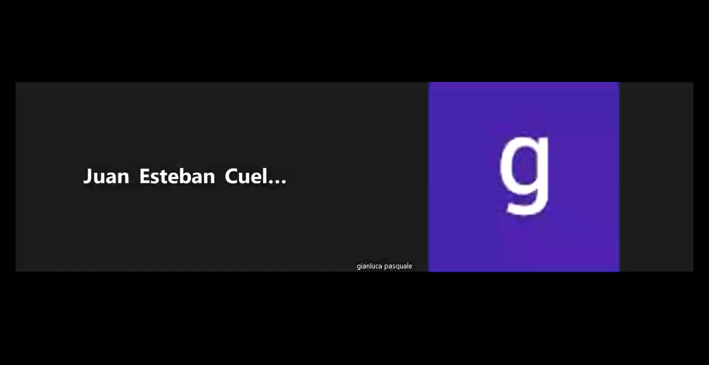 |
|---------------------------|--------------------------------------------------------|
| Nombre del entrevistado   | Juan Cuellar                                           |
| Edad                      | 25                                                     |
| Distrito                  | Pueblo Libre                                           |
| Ocupación                 | Mecánico                                               |
| Duración de la Entrevista | 4:15                                                   |
| Minuto de Inicio          | 4:20                                                   |

| Entrevista 3              |  |
|---------------------------|--------------------------------------------------------|
| Nombre del entrevistado   | Aldo Vasquez                                           |
| Edad                      | 23                                                     |
| Distrito                  | Breña                                                  |
| Ocupación                 | Ayudante de mecánico                                   |
| Duración de la Entrevista | 3:58                                                   |
| Minuto de Inicio          | 8:18                                                   |

A continuación, se presentan detalles de las entrevistas realizadas a los dueños de motos:

| Entrevista 4              |  |
|---------------------------|--------------------------------------------------------------|
| Nombre del entrevistado   | Josue Paiva                                                  |
| Edad                      | 22                                                           |
| Distrito                  | San Miguel                                                   |
| Ocupación                 | Estudiante                                                   |
| Duración de la Entrevista | 5:40                                                         |
| Minuto de Inicio          | 12:10                                                        |

| Entrevista 5              | 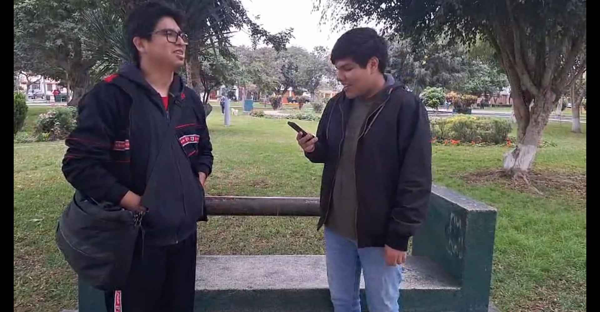 |
|---------------------------|------------------------------------------------------------------|
| Nombre del entrevistado   | Mathias Diaz                                                     |
| Edad                      | 23                                                               |
| Distrito                  | Pueblo Libre                                                     |
| Ocupación                 | Profesor                                                         |
| Duración de la Entrevista | 7:34                                                             |
| Minuto de Inicio          | 17:49                                                            |

| Entrevista 6              |  |
|---------------------------|--------------------------------------------------------------------|
| Nombre del entrevistado   | Jair Huamani                                                       |
| Edad                      | 32                                                                 |
| Distrito                  | Huancavelica                                                       |
| Ocupación                 | Abogado                                                            |
| Duración de la Entrevista | 8:28                                                               |
| Minuto de Inicio          | 25:18                                                              |

#### 2.2.3 Análisis de entrevistas

**Segmento Objetivo: Mecánicos y talleres de servicio**

**Demografía:**  
La edad de los mecánicos entrevistados varía entre 21 y 25 años, con una experiencia laboral de 1 a 3 años. Todos trabajan en talleres urbanos de Lima y atienden principalmente motos de uso diario y delivery, lo que refleja un perfil joven, técnico y cercano a un público que depende de sus vehículos para generar ingresos. El 100 % tiene menos de 3 años de experiencia y el 67 % atiende mayoritariamente a repartidores y transporte urbano.*

**Servicios frecuentes:**  
Los servicios más comunes son cambios de aceite, ajustes de frenos, mantenimiento eléctrico básico, reparación de cadenas y revisión de neumáticos. Esto evidencia un enfoque en mantenimientos preventivos y correctivos rápidos, adaptados a clientes que necesitan volver a la pista en poco tiempo. El 100 % realiza cambios de aceite y revisión de frenos; el 67 % ofrece trabajos eléctricos y de neumáticos.*

**Gestión y diagnóstico:**  
El historial de clientes se maneja con libretas, memoria personal o Excel poco usado. El diagnóstico es manual y basado en experiencia, usando herramientas básicas como multímetro y revisión visual. Esto revela una falta de digitalización en procesos clave del taller. El 67 % gestiona historial en cuadernos/memoria y solo el 33 % usa Excel de manera básica.*

**Necesidades y oportunidades:**  
Los mecánicos ven valor en contar con telemetría remota (kilometraje, batería, combustible, temperatura, neumáticos) y reportes simples como historial, alertas de servicio y resúmenes mensuales. Prefieren un plan fijo para el taller en lugar de comisiones individuales, y valoran herramientas precisas, fáciles de usar y compatibles con WhatsApp, lo que abre una oportunidad para soluciones digitales simples, accesibles y prácticas. El 100 % considera útil la telemetría, el 100 % prefiere un plan fijo y el 100 % valora la facilidad de uso por encima de funciones complejas.*

### 2.3 Needfinding

#### 2.3.1 User Personas

**Segmento Objetivo: Mecánicos y talleres de servicio**

A continuación, se presenta el User Persona de Carlos Quispe. Él representa al mecánico joven y pragmático de Lima, enfocado en el mantenimiento rápido de motos de uso diario y delivery. Este perfil sintetiza las necesidades, frustraciones y motivaciones identificadas en el análisis, sirviendo como arquetipo del usuario objetivo para una solución digital que busca optimizar la gestión y el diagnóstico en talleres de servicio.

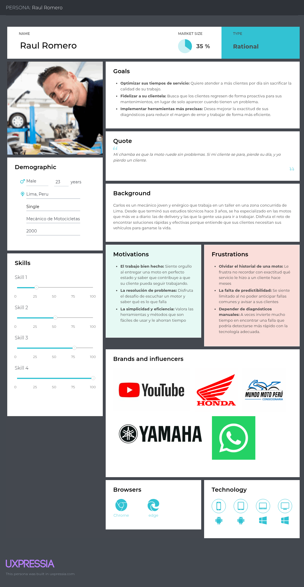

**Segmento Objetivo: Motociclistas**

A continuación, se presenta el perfil de Daniel Castro, un User Persona desarrollado para representar al segmento clave de motociclistas jóvenes y urbanos en Lima que han adoptado las motocicletas eléctricas como su principal medio de transporte. Este arquetipo sintetiza los hallazgos de la investigación de usuarios, encapsulando sus comportamientos, necesidades y metas.

#### 2.3.2 User Task Matrix

**1. Segmento 1: Mecánico de Motocicletas**

| Tarea                                               | Frecuencia | Severidad |
|-----------------------------------------------------|------------|-----------|
| Realizar diagnósticos precisos de fallas            | Alta       | Alta      |
| Optimizar tiempos de servicio                       | Alta       | Alta      |
| Recordar historial de mantenimientos de clientes    | Media      | Alta      |
| Fidelizar clientela mediante recordatorios de citas | Media      | Media     |
| Usar herramientas de diagnóstico manual             | Alta       | Media     |
| Implementar nuevas herramientas tecnológicas        | Baja       | Alta      |
| Anticipar fallas comunes de motos                   | Media      | Alta      |

**2. Segmento 2: Usuario Final de Motocicleta**

| Tarea                                               | Frecuencia | Severidad |
|-----------------------------------------------------|------------|-----------|
| Realizar mantenimientos preventivos                 | Baja       | Alta      |
| Confiar en su mecánico de confianza                 | Alta       | Media     |
| Recordar fechas de último mantenimiento             | Media      | Alta      |
| Detectar fallas solo cuando se presentan            | Alta       | Alta      |
| Buscar información en internet sobre problemas      | Media      | Media     |
| Administrar presupuesto de reparaciones             | Alta       | Alta      |
| Verificar el estado básico de la moto antes de usarla | Alta     | Media     |

#### 2.3.3 User Journey Mapping

En esta sección se presentan los User Journey Maps para los dos segmentos objetivo: mecánicos de motocicletas y usuarios finales de motocicletas. Estos mapas ilustran las etapas clave del viaje del usuario, sus acciones, pensamientos y emociones en cada fase, así como los puntos de contacto con la solución propuesta.

**1. User Journey Map - Mecánico de Motocicletas**

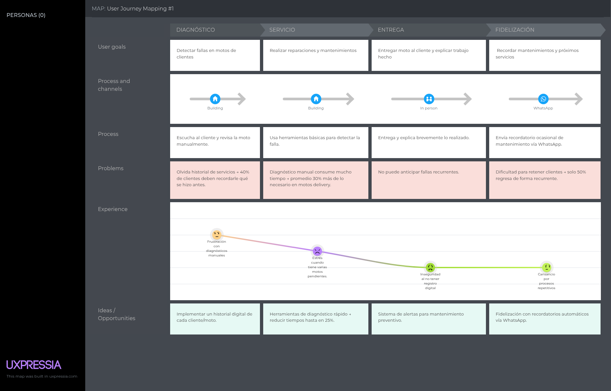

**2. User Journey Map - Usuario Final de Motocicleta**

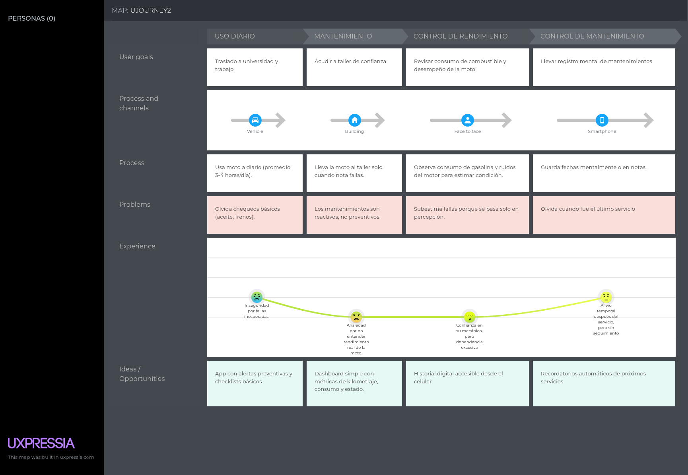

#### 2.3.4 Empathy Mapping

En esta sección se presentan los Empathy Mapping por cada segmento objetivo definido.

**1. Empathy Map - Mecánico de Motocicletas**

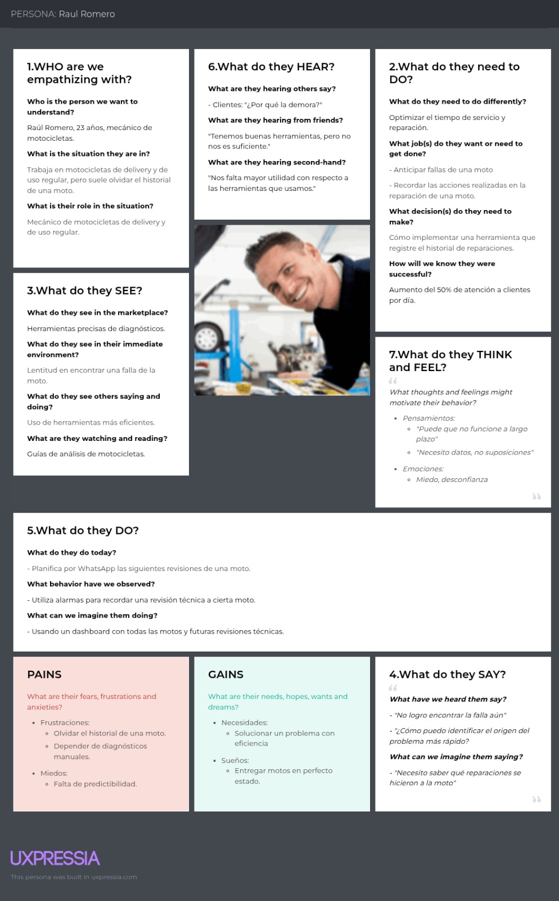

**2. Empathy Map - Usuario de Motocicleta**
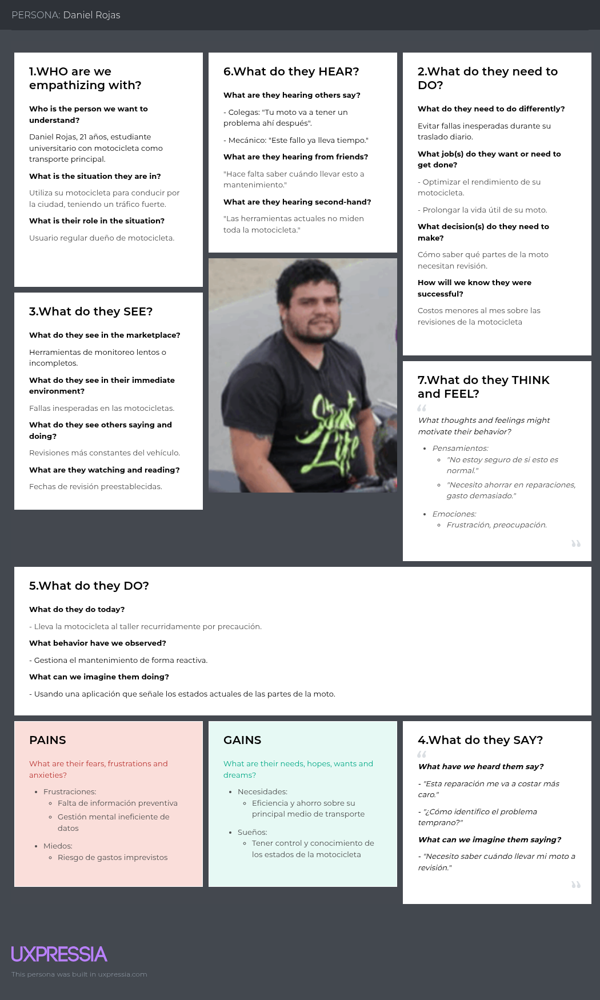

### 2.4 Big Picture EventStorming

**1. Definir eventos:**

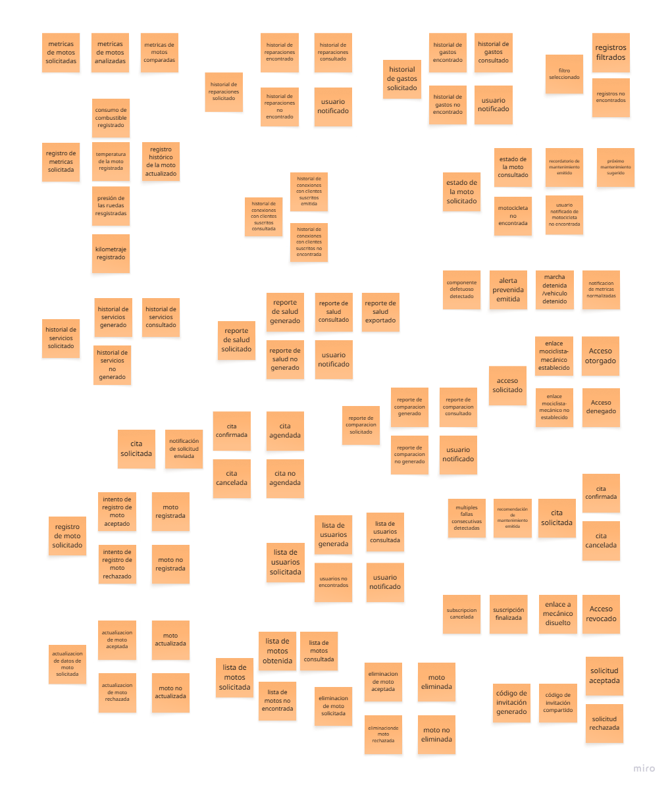

**2. Definir comandos y agentes**

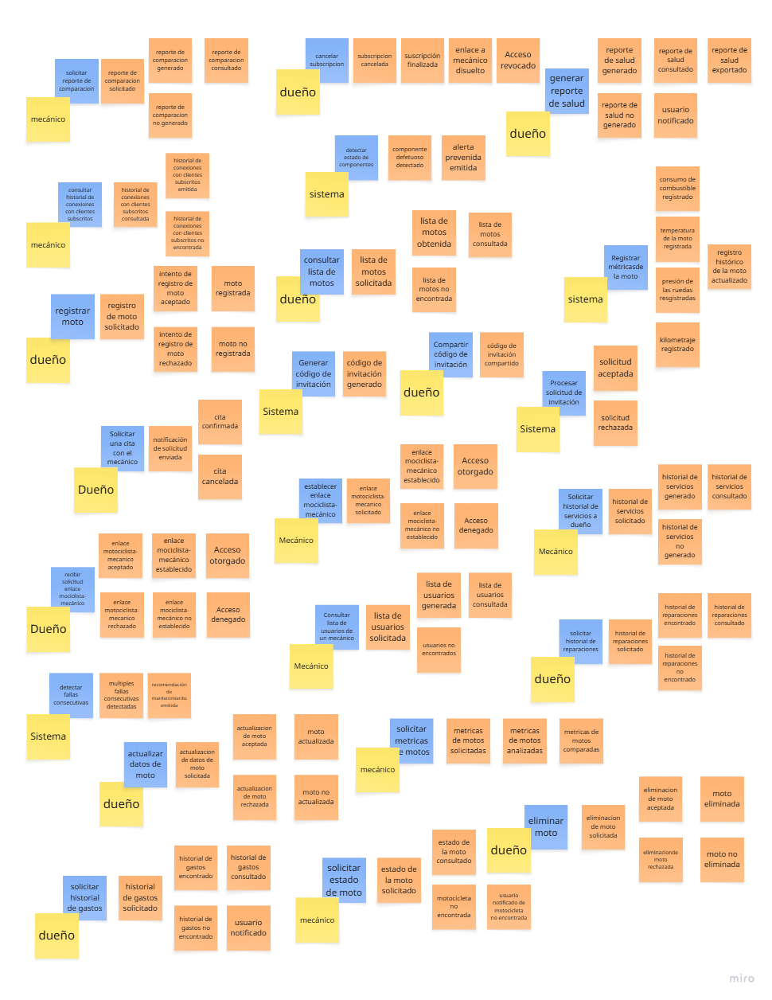

**3. Definir políticas**

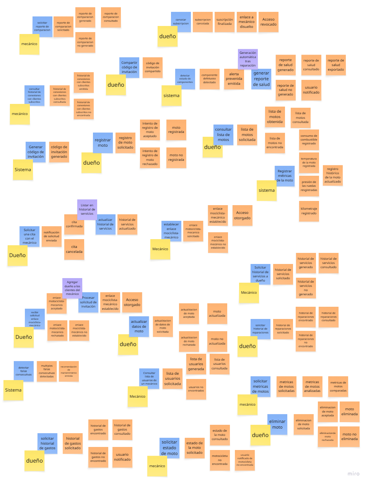

**4. Definir vistas**

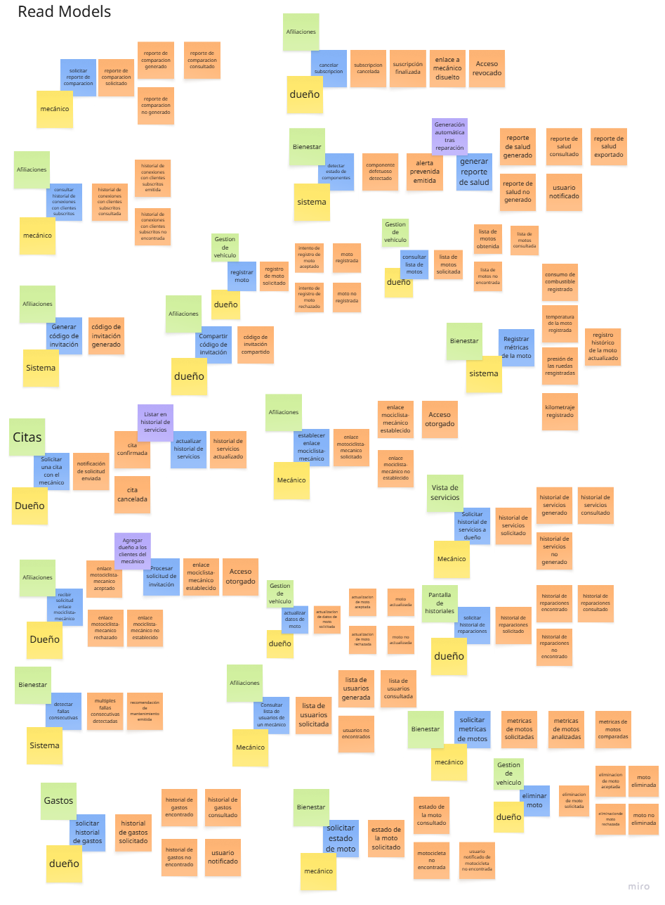

**6. Agregados**

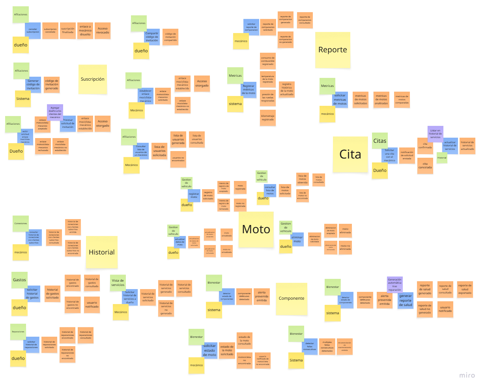

**7. Bounded context**

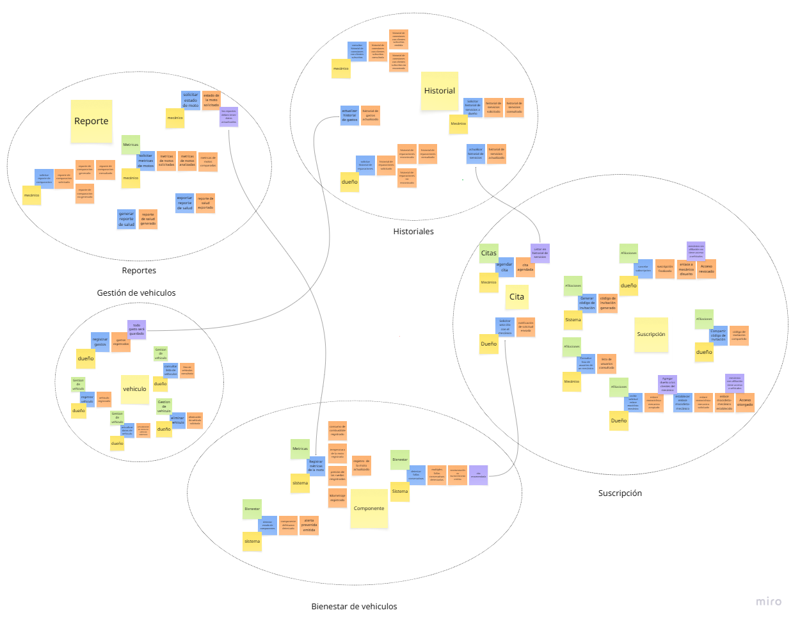

### 2.5 Ubiquitous Language

| Término(inglés)      | Término(español)     | Definición(español)                                                                       |
|----------------------|----------------------|-------------------------------------------------------------------------------------------|
| Metric               | Métrica              | Dato cuantitativo sobre el estado o desempeño de la moto.                                 |
| Report               | Report               | Conjunto estructurado de métricas procesadas y visualizadas.                              |
| Comparison           | Comparación          | Análisis de diferencias entre métricas en distintos períodos o vehículos.                 |
| Alert                | Alerta               | Notificación preventiva generada a partir de una métrica crítica o fuera de rango.        |
| Historial            | Historial            | Registro acumulativo de eventos pasados relacionados con vehículos, servicios y clientes. |
| Service              | Servicio             | Intervención realizada por un mecánico.                                                   |
| Repair               | Reparación           | Acción específica para corregir un problema en la moto.                                   |
| Spent                | Gasto                | Desembolso económico relacionado con el vehículo.                                         |
| Client               | Cliente              | Dueño de moto asociado al historial.                                                      |
| Subscription         | Suscripción          | Vínculo activo entre mecánico y dueño de moto.                                            |
| Plan                 | Plan                 | Conjunto de beneficios y limitaciones (ejemplo: básico, premium).                         |
| State                | Estado               | Condición de la suscripción (activa, suspendida, cancelada).                              |
| Renewal              | Renovación           | Acción de extender la suscripción al vencer.                                              |
| Preventive alert     | Alerta preventiva    | Notificación emitida al detectar un valor fuera de rango normal.                          |
| Vehicle status       | Estado del vehículo  | Resumen general del bienestar (óptimo, regular, crítico).                                 |
| Diagnosis            | Diagnóstico          | Interpretación de métricas para indicar posibles fallas o recomendaciones.                |
| Vehicle              | Vehículo             | Moto registrada en la plataforma.                                                         |
| Owner                | Dueño                | Usuario principal que gestiona el vehículo.                                               |
| Authorized Mechanic  | Mecánico autorizado  | Usuario con acceso limitado al vehículo para servicios o diagnósticos.                    |
| Vehicle registration | Registro de vehículo | Proceso de alta inicial en el sistema.                                                    |

## Capítulo III: Requirements Specification

### 3.1 User Stories

### 3.2 Impact Mapping

### 3.3 Product Backlog

## Capítulo IV: Solution Software Design

### 4.1 Strategic-Level Attribute-Driven Design

#### 4.1.1 Design-Level EventStorming

##### 4.1.1.1 Candidate Context Discovery

##### 4.1.1.2 Domain Message Flows Modeling

##### 4.1.1.3 Bounded Context Canvases

#### 4.1.2 Context Mapping

#### 4.1.3 Software Architecture

##### 4.1.3.1 Software Architecture System Landscape Diagram

##### 4.1.3.2 Software Architecture Context Level Diagrams

##### 4.1.3.3 Software Architecture Container Level Diagrams

##### 4.1.3.4 Software Architecture Deployment Diagrams

### 4.2 Tactical-Level Domain-Driven Design

#### 4.2.1 Bounded Context: unnamed

##### 4.2.1.1 Domain Layer

##### 4.2.1.2 Interface Layer

##### 4.2.1.3 Application Layer

##### 4.2.1.4 Infrastructure Layer

##### 4.2.1.5 Bounded Context Software Architecture Component Level Diagrams

##### 4.2.1.6 Bounded Context Software Architecture Code Level Diagrams

###### 4.2.1.6.1 Bounded Context Domain Layer Class Diagrams

###### 4.2.1.6.2 Bounded Context Database Design Diagram

## Conclusiones

## Bibliografía

## Anexos
