<div style="text-align: center;">


**Universidad Peruana de Ciencias Aplicadas**

**Facultad:** Ingeniería

**Carrera:** Ingeniería de software

**Periodo:** 202520

**CURSO:** Desarrollo de Soluciones IoT

**Código del Curso**: 1ASI0572

**NRC**: 3443

**Profesor:** Ángel Augusto Velásquez Núñez


**Informe del Trabajo Final**

**Nombre del startup:** NRG6

**Nombre del producto:** BykerZ

**Integrantes**

| **Nombre**                                | **Código** |
|-------------------------------------------|------------|
| **Alejo Cardenas Jose Antonio**           | U202122484 |
| **Astonitas Díaz Juan Diego**             | U202110237 |
| **Casas Sanchez Gabriel Alexander**       | U202220033 |
| **Pacheco Astiguetta Sebastian**          | U202110291 |
| **Pasquale Barrenechea Gianluca Santino** | U202112078 |
| **Real Calderon Sebatian Omar**           | U20221D964 |

**Diciembre 2025**

</div>

<div style="page-break-after: always;"></div>

**Registro de Versiones del Informe**

<table>
  <thead>
    <tr>
      <th>Versión</th>
      <th>Fecha</th>
      <th>Autor</th>
      <th>Descripción de modificación</th>
    </tr>
  </thead>
  <tbody>
    <tr>
      <td>0.1</td>
      <td>01/09/2025</td>
      <td>Casas Sanchez Gabriel Alexander</td>
      <td>Desarrollo del solution profile</td>
    </tr>
    <tr>
      <td>0.2</td>
      <td>01/09/2025</td>
      <td>Alejo Cardenas Jose Antonio</td>
      <td>Desarrollo del Lean ux process</td>
    </tr>
    <tr>
      <td>0.3</td>
      <td>01/09/2025</td>
      <td>Real Calderon Sebastian Omar</td>
      <td>Desarrollo del Segmentos objetivos</td>
    </tr>
    <tr>
      <td>0.4</td>
      <td>01/09/2025</td>
      <td>Alejo Cardenas Jose Antonio</td>
      <td>Desarrollo del Análisis de competidores</td>
    </tr>
    <tr>
      <td>0.5</td>
      <td>08/09/2025</td>
      <td>Pasquale Barrenechea Gianluca Santino</td>
      <td>Desarrollo del diseño, registro y análisis de entrevistas</td>
    </tr>
    <tr>
      <td>0.6</td>
      <td>08/09/2025</td>
      <td>Astonitas Díaz Juan Diego</td>
      <td>Desarrollo del Needfinding</td>
    </tr>
    <tr>
      <td>0.7</td>
      <td>13/09/2025</td>
      <td>Real Calderon Sebastian Omar</td>
      <td>Desarrollo de los User stories y product backlog</td>
    </tr>
    <tr>
      <td>0.8</td>
      <td>13/09/2025</td>
      <td>Pacheco Astiguetta Sebastian</td>
      <td>Desarrollo del impact mapping</td>
    </tr>
    <tr>
      <td>0.9</td>
      <td>14/09/2025</td>
      <td>Casas Sanchez Gabriel Alexander</td>
      <td>Desarrollo del Big Pictures Eventstorming</td>
    </tr>
    <tr>
      <td>1.0</td>
      <td>15/09/2025</td>
      <td>Casas Sanchez Gabriel Alexander</td>
      <td>Desarrollo del los Domain message flows modeling y bounded context canvases</td>
    </tr>
    <tr>
      <td>1.1</td>
      <td>15/09/2025</td>
      <td>Real Calderon Sebastian Omar</td>
      <td>Desarrollo del context mapping</td>
    </tr>
    <tr>
      <td>1.2</td>
      <td>15/09/2025</td>
      <td>Alejo Cardenas Jose Antonio</td>
      <td>Desarrollo del software architecture</td>
    </tr>
    <tr>
      <td>1.3</td>
      <td>15/09/2025</td>
      <td>Casas Sanchez Gabriel Alexander</td>
      <td>Desarrollo del tactical-level domain-Driven design</td>
    </tr>
    <tr>
        <td>1.4</td>
        <td>03/10/2025</td>
        <td>Casas Sanchez Gabriel Alexander</td>
        <td>Se añadieron los general style guidelines</td>
    </tr>
    <tr>
        <td>1.5</td>
        <td>13/11/2025</td>
        <td>Casas Sanchez Gabriel Alexander</td>
        <td>Se agregaron las evidencias de entrevistas</td>
    </tr>
    <tr>
        <td>1.6</td>
        <td>14/11/2025</td>
        <td>Pasquale Barrenechea Gianluca Santino</td>
        <td>Se agregaron las evaluaciones y heurísticas de las entrevistas</td>
    </tr>
    <tr>
        <td>1.7</td>
        <td>14/11/2025</td>
        <td>Pacheco Astiguetta Sebastian</td>
        <td>Se actualizó la documentación del IAM según lo re-estructurado</td>
    </tr>
    <tr>
        <td>1.8</td>
        <td>15/11/2025</td>
        <td>Casas Sanchez Gabriel Alexander</td>
        <td>Se agregaron las evidencias de ejecución y de desarrollo de los productos</td>
    </tr>
    <tr>
        <td>1.9</td>
        <td>15/11/2025</td>
        <td>Pasquale Barrenechea Gianluca Santino</td>
        <td>Se actualizaron las documentaciones de endpoints de servicios relacionados con web y mobile</td>
    </tr>
    <tr>
        <td>1.10</td>
        <td>15/11/2025</td>
        <td>Pacheco Astiguetta Sebastian</td>
        <td>Se agregó evidencia de ejecución para el prototipo IoT y embedded</td>
    </tr>
    <tr>
        <td>2.0</td>
        <td>15/11/2025</td>
        <td>Casas Sanchez Gabriel Alexander</td>
        <td>Se agregaron los insights pertenecientes al sprint 2</td>
    </tr>
    <tr>
        <td>2.1</td>
        <td>30/11/2025</td>
        <td>Alejo Cardenas Jose Antonio</td>
        <td>Se agregaron las traducciones de BC Wellness Metrics y Notifications, corrección de Hypothesis, análisis de entrevistas y bibliografía.</td>
    </tr>
    <tr>
        <td>2.2</td>
        <td>01/12/2025</td>
        <td>Astonitas Díaz Juan Diego</td>
        <td>Se agregó el BC Maintenance and Operations, correcciones del documento e implementación del prototipo GPS simulado.</td>
    </tr>
    <tr>
        <td>2.3</td>
        <td>02/12/2025</td>
        <td>Casas Sanchez Gabriel Alexander</td>
        <td>Se agregó la documentación del Sprint 3, asignaciones de bounded contexts y elaboración del dispositivo simulado.</td>
    </tr>
    <tr>
        <td>2.4</td>
        <td>02/12/2025</td>
        <td>Pasquale Barrenechea Gianluca Santino</td>
        <td>Se agregaron entrevistas de validación, BC Comparatives, rediseño visual completo e implementación de i18n.</td>
    </tr>
    <tr>
        <td>2.5</td>
        <td>03/12/2025</td>
        <td>Pacheco Astiguetta Sebastian</td>
        <td>Se agregó habilitación de API Keys, actualización de IAM/Profiles, implementación parcial del Edge Service y cableado del prototipo físico.</td>
    </tr>
    <tr>
        <td>3.0</td>
        <td>04/12/2025</td>
        <td>Real Calderon Sebastian Omar</td>
        <td>Se corrigio el BC Vehicle Management, corrección del Event Storming y desarrollo del dashboard en aplicación web y móvil.</td>
    </tr>
  </tbody>
</table>

<div style="page-break-after: always;"></div>

**Project Report Collaboration Insights**

El enlace a github del reporte del proyecto es el siguiente: [https://github.com/NRG-8-IOT/report](https://github.com/NRG-8-IOT/report).

**TB1**

Para la elaboración del informe del proyecto, el equipo organizó las actividades de manera colaborativa mediante el repositorio de GitHub, distribuyendo las tareas entre los integrantes según las secciones del documento. Cada miembro asumió la responsabilidad de desarrollar contenidos específicos, manteniendo una comunicación constante para asegurar la coherencia en el estilo, la estructura y la calidad del informe.

En las primeras etapas, los miembros se centraron en la definición del producto y la investigación inicial. Gabriel Casas Sánchez desarrolló el Solution Profile, en el que se establecieron la propuesta de valor y los objetivos generales del proyecto. José Alejo Cárdenas elaboró el Lean UX Process y el Análisis de competidores, identificando oportunidades de mejora y diferenciación en el mercado. Por su parte, Sebastián Real Calderón se encargó de la sección de Segmentos Objetivos, definiendo los perfiles de usuarios principales y sus características.

Posteriormente, se abordaron las actividades relacionadas con la investigación con usuarios. Gianluca Pasquale Barrenechea fue responsable del Diseño, registro y análisis de entrevistas, recopilando información cualitativa relevante. Juan Diego Astonitas Díaz desarrolló la sección de Needfinding, en la que se analizaron las necesidades detectadas y se agruparon los principales hallazgos del proceso de investigación.

Una vez recopilada la información base, el equipo continuó con el desarrollo de los artefactos de diseño y modelado. Sebastián Real Calderón elaboró los User Stories y el Product Backlog, reflejando las funcionalidades que debía cubrir el sistema. Sebastián Pacheco Astiguetta desarrolló el Impact Mapping, estableciendo la relación entre los objetivos estratégicos del negocio y las acciones del producto. Gabriel Casas Sánchez complementó esta parte con el Big Picture Event Storming, que permitió identificar los eventos clave del dominio y los actores involucrados.

En la parte final del desarrollo del informe, se trabajó en los aspectos técnicos y de arquitectura del sistema. Gabriel Casas Sánchez documentó los Domain Message Flows Modeling y los Bounded Context Canvases, describiendo la interacción entre los componentes del dominio. Sebastián Real Calderón elaboró el Context Mapping, mostrando las relaciones entre los distintos contextos del sistema. José Alejo Cárdenas desarrolló la sección de Software Architecture, detallando la estructura y los componentes del sistema, y finalmente, Gabriel Casas Sánchez completó la parte de Tactical-level Domain-Driven Design, donde se definieron los agregados, entidades y servicios principales.


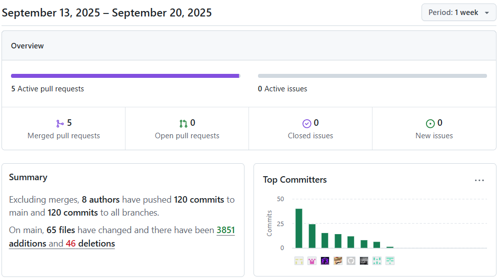

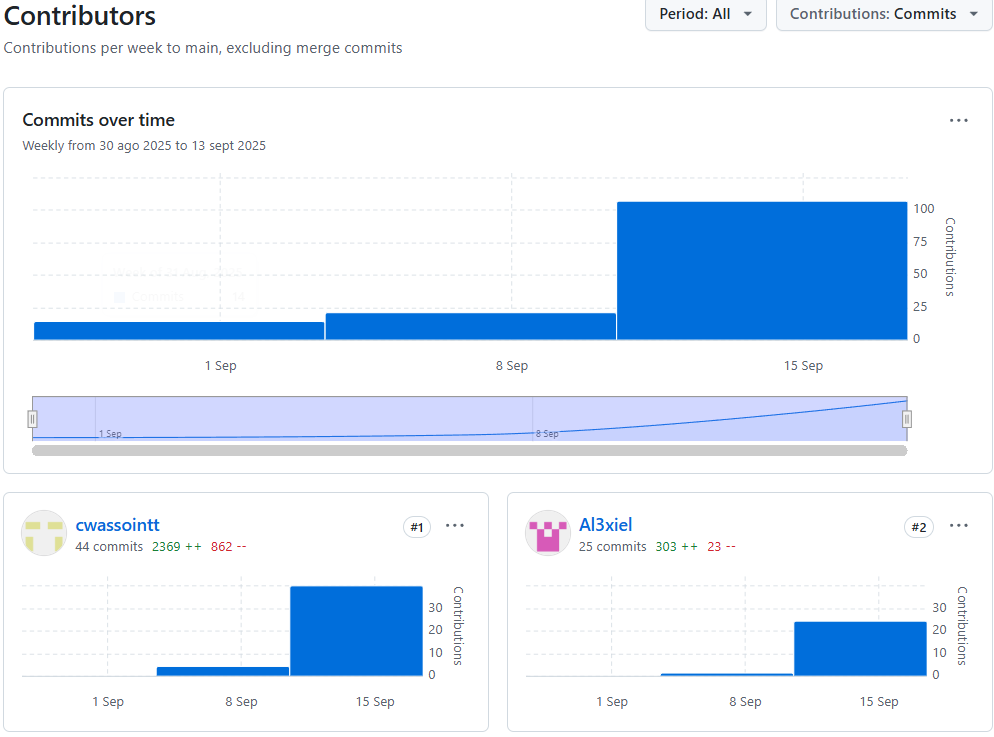

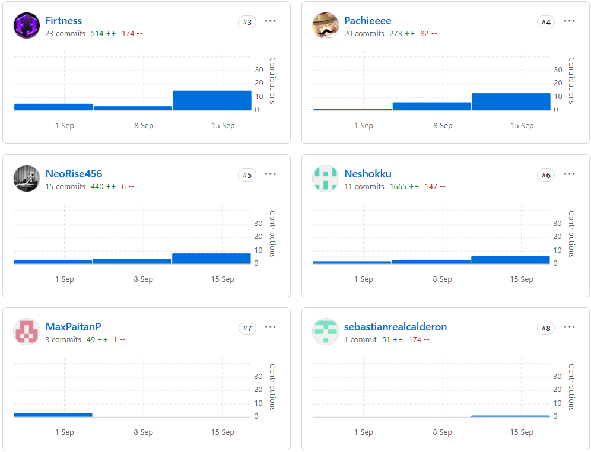

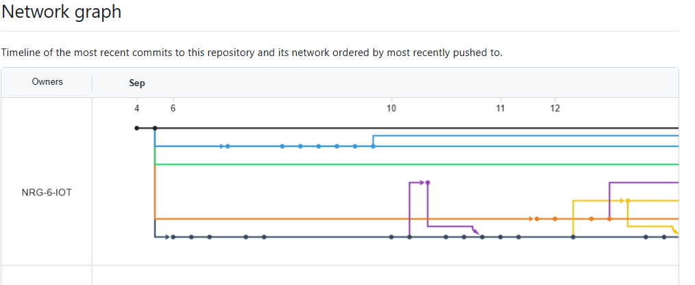

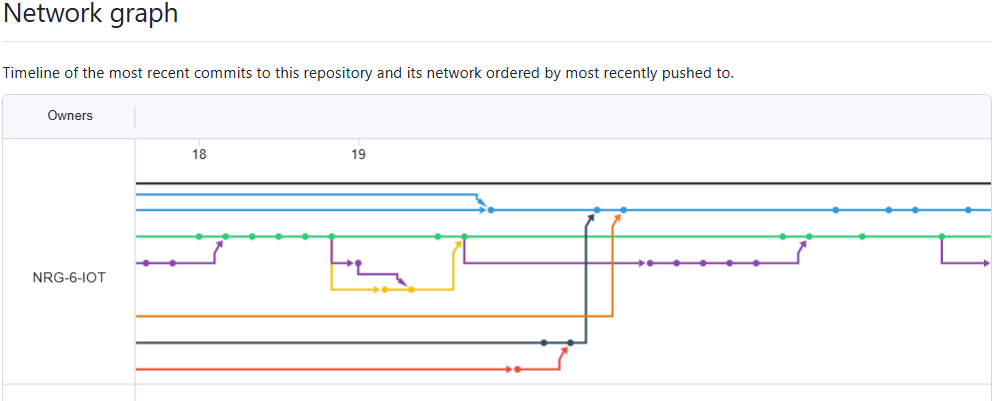

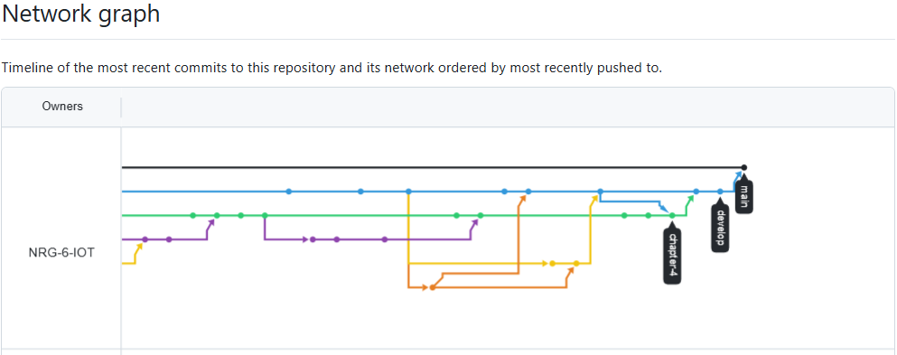

Distribución de commits:
* Alejo Cardenas Jose Antonio (Firtness): 15 commits.
* Astonitas Díaz Juan Diego (NeorRise456): 8 commits.
* Casas Sanchez Gabriel Alexander (Al3xiel): 24 commits.
* Pasquale Barrenechea Gianluca Santino (cwassointt): 40 commits.
* Pacheco Astiguetta Sebastian (Pachieeee): 14 commits.
* Real Calderon Sebastian Omar (sebastianrealcalderon, Neshokku): 19 commits.

**TP**

Durante el desarrollo del Sprint, el equipo trabajó de forma coordinada para cumplir con todas las fases establecidas en el Capítulo VI: Product Implementation, Validation & Deployment. En la etapa de Sprint Planning 1, se definieron los objetivos, entregables y prioridades de desarrollo, asignando responsabilidades específicas en Aspect Leaders and Collaborators para garantizar una distribución equitativa del trabajo. Con el Sprint Backlog 1, se organizó y dio seguimiento a las tareas de implementación de la Landing Page, los Web Services y las Aplicaciones. Dentro de Software Configuration Management, se configuró el entorno de desarrollo (Software Development Environment Configuration) y se gestionó el control de versiones en GitHub (Source Code Management) siguiendo las Style Guides & Conventions del proyecto para mantener un código uniforme y legible. En la etapa de Software Deployment Configuration, se establecieron los entornos de despliegue y pruebas, asegurando la correcta integración de los componentes.

Posteriormente, el equipo generó las Development Evidence, Testing Suite Evidence, Execution Evidence y Services Documentation Evidence correspondientes a la revisión del Sprint, donde se documentaron los avances técnicos, las pruebas realizadas y la evidencia de funcionamiento del sistema. Finalmente, se completó la Software Deployment Evidence, mostrando la correcta implementación y despliegue de los productos. Todo este proceso fue respaldado por un análisis de colaboración y commits en GitHub dentro de Team Collaboration Insights during Sprint, que evidenció la participación activa, comunicación continua y liderazgo compartido de todos los integrantes para alcanzar los objetivos propuestos en tiempo y forma.

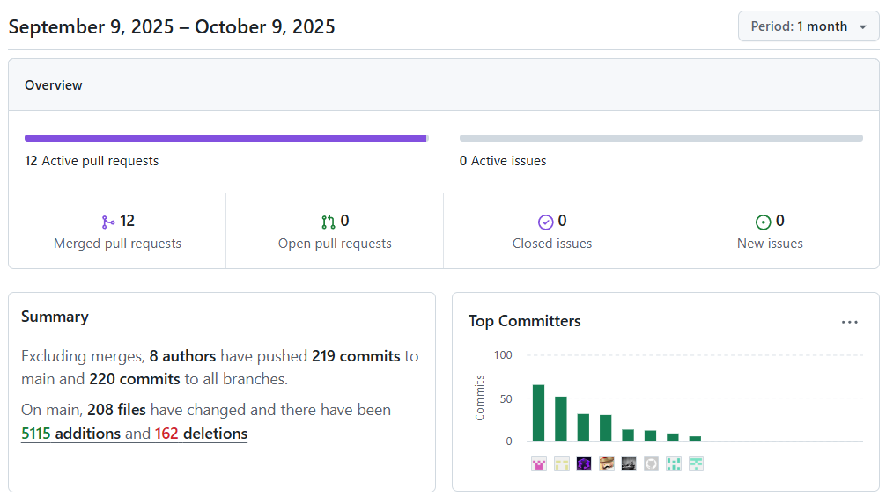

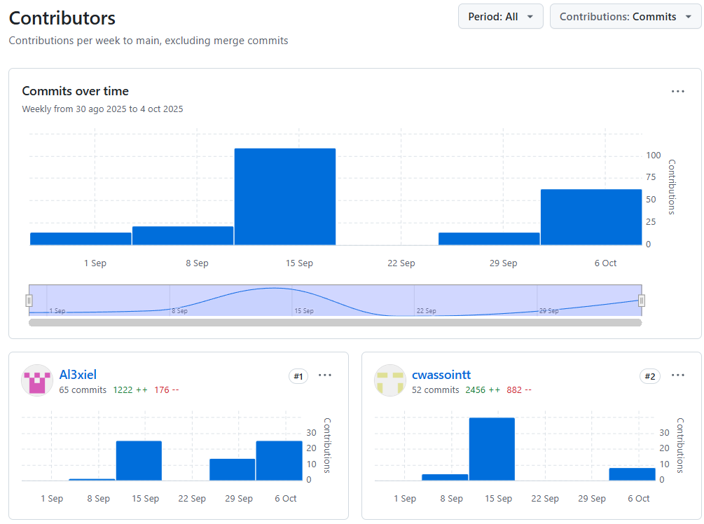

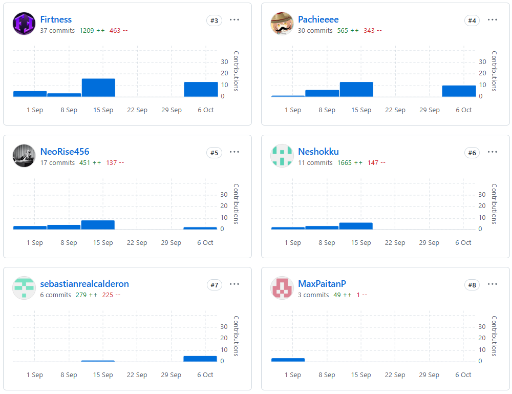

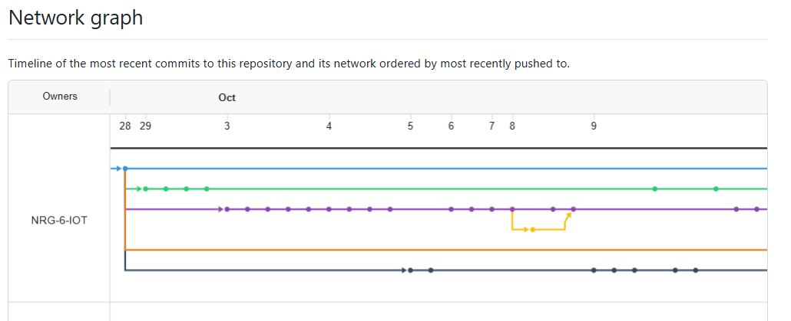

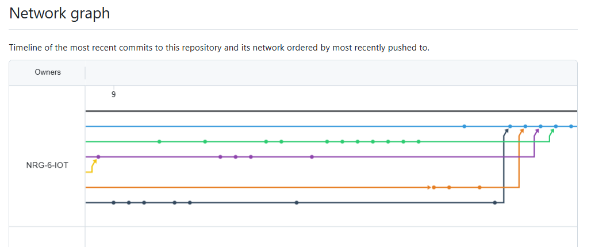

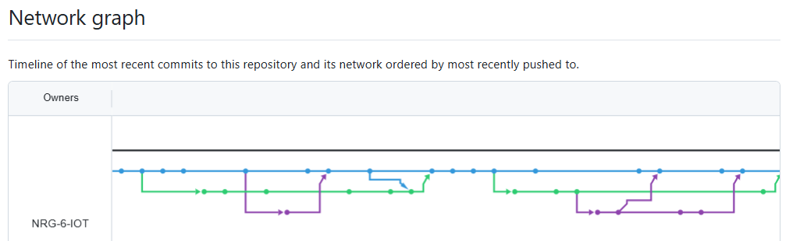

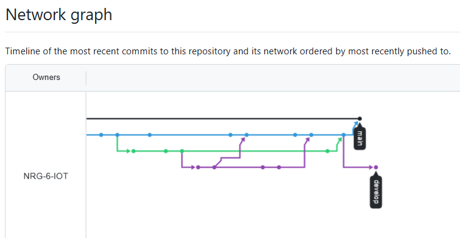

**TB2**:

El desarrollo de este sprint se concentró en consolidar los avances del web application y backend, de la misma manera se presento la primera versión del mobile application. Por otro lado se creo el primer protipo del dispositivo iot y el edge service.

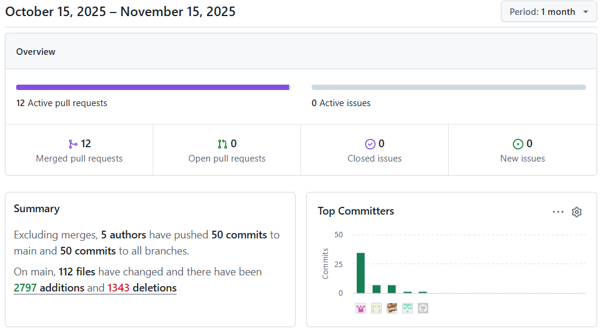

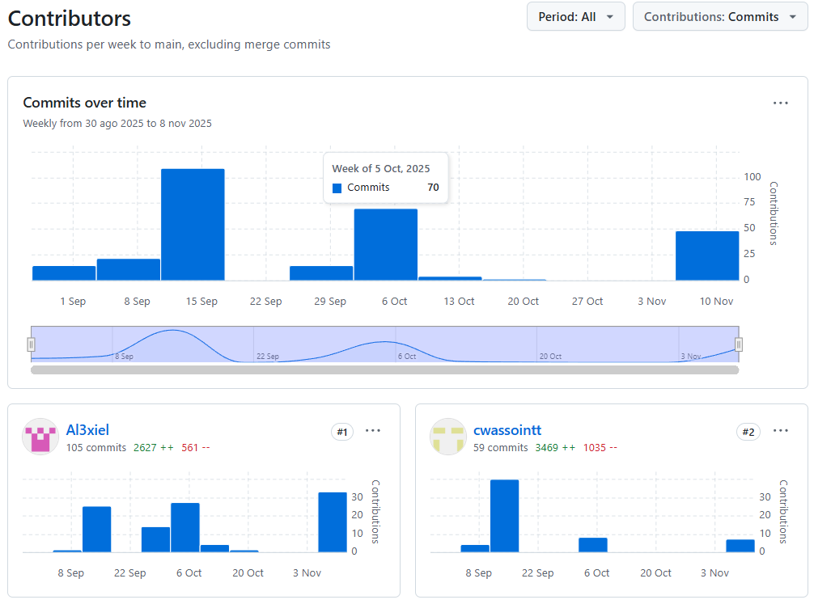

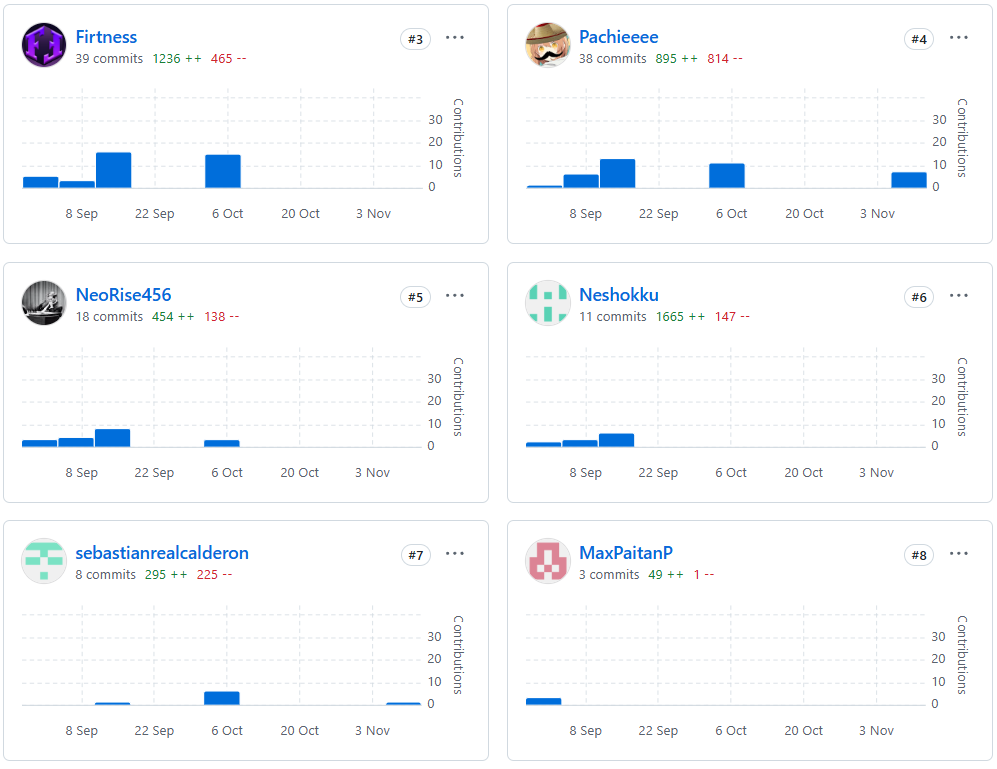

Distribución de commits:
* Alejo Cardenas Jose Antonio (Firtness): 15 commits.
* Astonitas Díaz Juan Diego (NeorRise456): 1 commits.
* Casas Sanchez Gabriel Alexander (Al3xiel): 33 commits.
* Pasquale Barrenechea Gianluca Santino (cwassointt): 7 commits.
* Pacheco Astiguetta Sebastian (Pachieeee): 8 commits.
* Real Calderon Sebastian Omar (sebastianrealcalderon, Neshokku): 1 commits.

<div style="page-break-after: always;"></div>

## Contenido
- [Épicas](#épicas)
    - [3.2 Impact Mapping](#32-impact-mapping)
    - [3.3 Product Backlog](#33-product-backlog)
  - [Capítulo IV: Solution Software Design](#capítulo-iv-solution-software-design)
    - [4.1 Strategic-Level Attribute-Driven Design](#41-strategic-level-attribute-driven-design)
      - [4.1.1 Design-Level EventStorming](#411-design-level-eventstorming)
        - [4.1.1.1 Candidate Context Discovery](#4111-candidate-context-discovery)
        - [4.1.1.2 Domain Message Flows Modeling](#4112-domain-message-flows-modeling)
        - [4.1.1.3 Bounded Context Canvases](#4113-bounded-context-canvases)
      - [4.1.2 Context Mapping](#412-context-mapping)
      - [4.1.3 Software Architecture](#413-software-architecture)
        - [4.1.3.1 Software Architecture System Landscape Diagram](#4131-software-architecture-system-landscape-diagram)
        - [4.1.3.2 Software Architecture Context Level Diagrams](#4132-software-architecture-context-level-diagrams)
        - [4.1.3.3 Software Architecture Container Level Diagrams](#4133-software-architecture-container-level-diagrams)
        - [4.1.3.4 Software Architecture Deployment Diagrams](#4134-software-architecture-deployment-diagrams)
    - [4.2 Tactical-Level Domain-Driven Design](#42-tactical-level-domain-driven-design)
      - [4.2.1 Bounded Context: Vehicle Management](#421-bounded-context-vehicle-management)
        - [4.2.1.1 Domain Layer](#4211-domain-layer)
        - [4.2.1.2 Interface Layer](#4212-interface-layer)
        - [4.2.1.3 Application Layer](#4213-application-layer)
        - [4.2.1.4 Infrastructure Layer](#4214-infrastructure-layer)
        - [4.2.1.5 Bounded Context Software Architecture Component Level Diagrams](#4215-bounded-context-software-architecture-component-level-diagrams)
        - [4.2.1.6 Bounded Context Software Architecture Code Level Diagrams](#4216-bounded-context-software-architecture-code-level-diagrams)
          - [4.2.1.6.1 Bounded Context Domain Layer Class Diagrams](#42161-bounded-context-domain-layer-class-diagrams)
          - [4.2.1.6.2 Bounded Context Database Design Diagram](#42162-bounded-context-database-design-diagram)
      - [4.2.2 Bounded Context: Maintenance](#422-bounded-context-maintenance)
        - [4.2.2.1 Domain Layer](#4221-domain-layer)
        - [4.2.2.2 Interface Layer](#4222-interface-layer)
        - [4.2.2.3 Application Layer](#4223-application-layer)
        - [4.2.2.4 Infrastructure Layer](#4224-infrastructure-layer)
        - [4.2.2.5 Bounded Context Software Architecture Component Level Diagrams](#4225-bounded-context-software-architecture-component-level-diagrams)
        - [4.2.2.6 Bounded Context Software Architecture Code Level Diagrams](#4226-bounded-context-software-architecture-code-level-diagrams)
          - [4.2.2.6.1 Bounded Context Domain Layer Class Diagrams](#42261-bounded-context-domain-layer-class-diagrams)
          - [4.2.2.6.2 Bounded Context Database Design Diagram](#42262-bounded-context-database-design-diagram)
      - [4.2.3 Bounded Context: Assignments](#423-bounded-context-assignments)
        - [4.2.3.1 Domain Layer](#4231-domain-layer)
        - [4.2.3.2 Interface Layer](#4232-interface-layer)
        - [4.2.3.3 Application Layer](#4233-application-layer)
        - [4.2.3.4 Infrastructure Layer](#4234-infrastructure-layer)
        - [4.2.3.5 Bounded Context Software Architecture Component Level Diagrams](#4235-bounded-context-software-architecture-component-level-diagrams)
        - [4.2.3.6 Bounded Context Software Architecture Code Level Diagrams](#4236-bounded-context-software-architecture-code-level-diagrams)
          - [4.2.3.6.1 Bounded Context Domain Layer Class Diagrams](#42361-bounded-context-domain-layer-class-diagrams)
          - [4.2.3.6.2 Bounded Context Database Design Diagram](#42362-bounded-context-database-design-diagram)
      - [4.2.4 Bounded Context: Vehicle Wellness](#424-bounded-context-vehicle-wellness)
        - [4.2.4.1 Domain Layer](#4241-domain-layer)
        - [4.2.4.2 Interface Layer](#4242-interface-layer)
        - [4.2.4.3 Application Layer](#4243-application-layer)
        - [4.2.4.4 Infrastructure Layer](#4244-infrastructure-layer)
        - [4.2.4.5 Bounded Context Software Architecture Component Level Diagrams](#4245-bounded-context-software-architecture-component-level-diagrams)
        - [4.2.4.6 Bounded Context Software Architecture Code Level Diagrams](#4246-bounded-context-software-architecture-code-level-diagrams)
          - [4.2.4.6.1 Bounded Context Domain Layer Class Diagrams](#42461-bounded-context-domain-layer-class-diagrams)
          - [4.2.4.6.2 Bounded Context Database Design Diagram](#42462-bounded-context-database-design-diagram)
      - [4.2.5 Bounded Context: Reportes](#425-bounded-context-reportes)
        - [4.2.5.1 Domain Layer](#4251-domain-layer)
        - [4.2.5.2 Interface Layer](#4252-interface-layer)
        - [4.2.5.3 Application Layer](#4253-application-layer)
        - [4.2.5.4 Infrastructure Layer](#4254-infrastructure-layer)
        - [4.2.5.5 Bounded Context Software Architecture Component Level Diagrams](#4255-bounded-context-software-architecture-component-level-diagrams)
        - [4.2.5.6 Bounded Context Software Architecture Code Level Diagrams](#4256-bounded-context-software-architecture-code-level-diagrams)
          - [4.2.5.6.1 Bounded Context Domain Layer Class Diagrams](#42561-bounded-context-domain-layer-class-diagrams)
          - [4.2.5.6.2 Bounded Context Database Design Diagram](#42562-bounded-context-database-design-diagram)
      - [4.2.6. Bounded Context: IAM](#426-bounded-context-iam)
        - [4.2.6.1 Domain Layer](#4261-domain-layer)
        - [4.2.6.2 Interface Layer](#4262-interface-layer)
        - [4.2.6.3 Application Layer](#4263-application-layer)
          - [4.2.6.4 Infrastructure Layer](#4264-infrastructure-layer)
        - [4.2.6.5 Bounded Context Software Architecture Component Level Diagrams](#4265-bounded-context-software-architecture-component-level-diagrams)
        - [4.2.6.6 Bounded Context Software Architecture Code Level Diagrams](#4266-bounded-context-software-architecture-code-level-diagrams)
          - [4.2.6.6.1 Bounded Context Domain Layer Class Diagrams](#42661-bounded-context-domain-layer-class-diagrams)
          - [4.2.6.6.2 Bounded Context Database Design Diagram](#42662-bounded-context-database-design-diagram)
  - [Capítulo V: Solution UI/UX Design](#capítulo-v-solution-uiux-design)
    - [5.1. Style Guidelines](#51-style-guidelines)
      - [5.1.1. General Style Guidelines](#511-general-style-guidelines)
      - [5.1.2. Web, Mobile and IoT Style Guidelines](#512-web-mobile-and-iot-style-guidelines)
    - [5.2. Information Architecture](#52-information-architecture)
      - [5.2.1. Organization Systems](#521-organization-systems)
      - [5.2.2. Labeling Systems](#522-labeling-systems)
      - [5.2.3. SEO Tags and Meta Tags](#523-seo-tags-and-meta-tags)
      - [5.2.4. Searching Systems](#524-searching-systems)
      - [5.2.5. Navigation Systems](#525-navigation-systems)
    - [5.3. Landing Page UI Design](#53-landing-page-ui-design)
      - [5.3.1. Landing Page Wireframe](#531-landing-page-wireframe)
      - [5.3.2. Landing Page Mock-up](#532-landing-page-mock-up)
    - [5.4. Applications UX/UI Design](#54-applications-uxui-design)
      - [5.4.1. Applications Wireframes](#541-applications-wireframes)
      - [5.4.2. Applications Wireflow Diagram](#542-applications-wireflow-diagram)
      - [5.4.3. Applications Mock-ups](#543-applications-mock-ups)
      - [5.4.4. Applications User Flow Diagrams](#544-applications-user-flow-diagrams)
    - [5.5. Applications Prototyping](#55-applications-prototyping)
  - [Capítulo VI: Product Implementation, Validation \& Deployment](#capítulo-vi-product-implementation-validation--deployment)
    - [6.1. Software Configuration Management.](#61-software-configuration-management)
      - [6.1.1. Software Development Environment Configuration.](#611-software-development-environment-configuration)
      - [6.1.2. Source Code Management.](#612-source-code-management)
      - [6.1.3. Source Code Style Guide \& Conventions.](#613-source-code-style-guide--conventions)
      - [6.1.4. Software Deployment Configuration.](#614-software-deployment-configuration)
    - [6.2. Landing Page, Services \& Applications Implementation.](#62-landing-page-services--applications-implementation)
      - [6.2.1. Sprint 1](#621-sprint-1)
        - [6.2.1.1. Sprint Planning 1.](#6211-sprint-planning-1)
        - [6.2.1.2. Aspect Leaders and Collaborators.](#6212-aspect-leaders-and-collaborators)
        - [6.2.1.3. Sprint Backlog 1.](#6213-sprint-backlog-1)
        - [6.2.1.4. Development Evidence for Sprint Review.](#6214-development-evidence-for-sprint-review)
        - [6.2.1.5. Testing Suite Evidence for Sprint Review.](#6215-testing-suite-evidence-for-sprint-review)
        - [6.2.1.6. Execution Evidence for Sprint Review.](#6216-execution-evidence-for-sprint-review)
        - [6.2.1.7. Services Documentation Evidence for Sprint Review.](#6217-services-documentation-evidence-for-sprint-review)
        - [6.2.1.8. Software Deployment Evidence for Sprint Review.](#6218-software-deployment-evidence-for-sprint-review)
        - [6.2.1.9. Team Collaboration Insights during Sprint.](#6219-team-collaboration-insights-during-sprint)
      - [6.2.2. Sprint 2](#622-sprint-2)
        - [6.2.2.1. Sprint Planning 2.](#6221-sprint-planning-2)
        - [6.2.2.2. Aspect Leaders and Collaborators.](#6222-aspect-leaders-and-collaborators)
        - [6.2.2.3. Sprint Backlog 2.](#6223-sprint-backlog-2)
        - [6.2.2.4. Development Evidence for Sprint Review.](#6224-development-evidence-for-sprint-review)
        - [6.2.2.5. Testing Suite Evidence for Sprint Review.](#6225-testing-suite-evidence-for-sprint-review)
        - [6.2.2.6. Execution Evidence for Sprint Review.](#6226-execution-evidence-for-sprint-review)
        - [6.2.2.7. Services Documentation Evidence for Sprint Review.](#6227-services-documentation-evidence-for-sprint-review)
        - [6.2.2.8. Software Deployment Evidence for Sprint Review.](#6228-software-deployment-evidence-for-sprint-review)
        - [6.2.2.9. Team Collaboration Insights during Sprint.](#6229-team-collaboration-insights-during-sprint)
      - [6.2.3. Sprint 3](#623-sprint-3)
        - [6.2.3.1. Sprint Planning 3](#6231-sprint-planning-3)
        - [6.2.3.2. Aspect Leaders and Collaborators](#6232-aspect-leaders-and-collaborators)
        - [6.2.3.3. Sprint Backlog 3](#6233-sprint-backlog-3)
        - [6.2.3.4. Development Evidence for Sprint Review](#6234-development-evidence-for-sprint-review)
        - [6.2.3.5. Testing Suite Evidence for Sprint Review](#6235-testing-suite-evidence-for-sprint-review)
        - [6.2.3.6. Execution Evidence for Sprint Review](#6236-execution-evidence-for-sprint-review)
        - [6.2.3.7. Services Documentation Evidence for Sprint Review](#6237-services-documentation-evidence-for-sprint-review)
        - [6.2.3.8. Software Deployment Evidence for Sprint Review](#6238-software-deployment-evidence-for-sprint-review)
        - [6.2.3.9. Team Collaboration Insights during Sprint](#6239-team-collaboration-insights-during-sprint)
    - [6.3. Validation Interviews.](#63-validation-interviews)
      - [6.3.1. Diseño de Entrevistas.](#631-diseño-de-entrevistas)
      - [6.3.2. Registro de Entrevistas.](#632-registro-de-entrevistas)
      - [6.3.3. Evaluaciones según heurísticas.](#633-evaluaciones-según-heurísticas)
    - [6.4. Video About-the-Product.](#64-video-about-the-product)
  - [Conclusiones](#conclusiones)
  - [Bibliografía](#bibliografía)
  - [Anexos](#anexos)

<div style="page-break-after: always;"></div>

## Student Outcome

El curso contribuye al cumplimiento del Student Outcome ABET:

**ABET – EAC - Student Outcome 5**

Criterio: *La capacidad de funcionar efectivamente en un equipo cuyos miembros juntos proporcionan liderazgo, crean un entorno de colaboración e inclusivo, establecen objetivos, planifican tareas y cumplen objetivos.*
En el siguiente cuadro se describe las acciones realizadas y enunciados de
conclusiones por parte del grupo, que permiten sustentar el haber alcanzado el logro
del ABET – EAC - Student Outcome 5.

<table>
  <thead>
    <tr>
      <th style="text-align: left;">Criterio específico</th>
      <th style="text-align: left;">Acciones realizadas</th>
      <th style="text-align: left;">Conclusiones</th>
    </tr>
  </thead>
  <tbody>
    <tr>
      <td><strong>Trabaja en equipo para proporcionar liderazgo en forma conjunta</strong></td>
      <td>
        <br><strong>Casas Sanchez Gabriel Alexander</strong><br>
        <strong>TB1:</strong> Asumí un rol de liderazgo compartido en la definición de los modelos del dominio y en la elaboración del <em>Solution Profile</em>, <em>Big Picture Eventstorming</em>, <em>Domain Message Flows Modeling</em> y los <em>Bounded Context Canvases</em>. Promoví la colaboración entre los miembros del equipo para mantener coherencia entre los diferentes modelos y asegurar una visión unificada del sistema.<br><br>
        <strong>TP:</strong> Asumí un rol activo como lider coordinando a mis compañeros para poder realizar cada entregable, fomente comunicación activa entre todos, y estuve al pendiente de cada integrante.<br><br>
        <strong>TB2:</strong> Asumí un rol activo como lider coordinando a mis compañeros para poder realizar los 8 entreagables que se tenian planeados para el desarollode este sprint, fomente comunicación activa entre todos, y busque cubrir las debilidades de mis compañeros.<br><br>
        <strong>TF:</strong> Proporcioné liderazgo conjunto durante la documentación del Sprint 3 y la definición de los bounded contexts, coordinando activamente con los responsables de frontend, backend y hardware para integrar sus avances en una visión unificada del sistema. Mi rol facilitó la toma de decisiones técnicas y de diseño, asegurando que cada componente del proyecto evolucionara de manera alineada y coherente.<br><br>
        <strong>Real Calderon Sebastian Omar</strong><br>
        <strong>TB1:</strong> Participé activamente en la elaboración de los <em>Segmentos Objetivos</em>, los <em>User Stories</em>, el <em>Product Backlog</em> y el <em>Context Mapping</em>. Coordiné la integración de estos artefactos con el resto del equipo, fomentando la comunicación constante y asegurando que las definiciones del dominio se mantuvieran alineadas con los objetivos del proyecto.<br><br>
        <strong>TP:</strong> Asumí un rol colaborativo en la integración de los desarrollos implementados, participando activamente en la coordinación técnica y en la validación conjunta de las funcionalidades construidas. Contribuí al liderazgo compartido al apoyar la toma de decisiones técnicas y asegurar la coherencia entre los diferentes módulos del sistema.<br><br>
        <strong>TB2:</strong>Desarrollé el bounded context de Vehicle Management en el backend y coordiné su integración con los frontends web y móvil mediante las llamadas al API. Asimismo, apoyé la corrección de errores y la coherencia visual del sistema tras el refresco de datos, trabajando en conjunto con el equipo para mantener alineadas las decisiones técnicas. Con estas acciones aporté al liderazgo compartido, facilitando la integración entre módulos y asegurando un desarrollo unificado dentro del proyecto.<br><br>
        <strong>TF:</strong> Asumí un rol de liderazgo conjunto en el desarrollo y unificación de los dashboards para la aplicación web y móvil, trabajando en coordinación directa con los equipos de frontend y UX. Mi contribución fue clave para alinear las decisiones sobre visualización de datos y experiencia de usuario, asegurando que ambos paneles mantuvieran coherencia funcional y estética bajo una visión compartida.<br><br>
        <strong>Alejo Cardenas Jose Antonio</strong><br>
        <strong>TB1:</strong> Lideré la elaboración del <em>Lean UX Process</em>, el <em>Análisis de Competidores</em> y la <em>Arquitectura de Software</em>. Trabajé de manera conjunta con mis compañeros para definir estrategias de diseño y establecer lineamientos técnicos que respondieran a las necesidades del proyecto, priorizando siempre la coherencia y el consenso en las decisiones tomadas.<br><br>
        <strong>TP:</strong> Asumí un rol activo en la coordinación del equipo durante el desarrollo de los artefactos del proyecto, fomentando la comunicación y el liderazgo compartido. Colaboré en la toma de decisiones sobre los userflows, wireframes y mockups de la aplicación móvil, guiando al grupo hacia soluciones coherentes con los objetivos del proyecto y promoviendo la participación equitativa de todos los integrantes. <br><br>
        <strong>TB2:</strong> Durante esta entrega asumí un rol activo en el desarrollo de los bounded contexts de notifications y vehicle-wellness, coordinando con mis compañeros para alinear aggregates, servicios y controladores tanto en backend como en las aplicaciones web y móvil. También lideré la integración del sistema de WebSockets, apoyando al equipo para consolidar una solución coherente entre los distintos módulos. En conjunto, contribuí al liderazgo compartido del equipo al facilitar la integración técnica, promover decisiones coordinadas y asegurar que las nuevas funcionalidades se mantuvieran alineadas con la visión general del proyecto.<br><br>
        <strong>TF:</strong> Proporcioné liderazgo conjunto en la capa de definición y comunicación del proyecto, coordinando la traducción y estandarización de bounded contexts (Wellness Metrics, Notifications) con los responsables técnicos. Mi trabajo facilitó un lenguaje común, liderando también la corrección y consolidación de artefactos clave como las Hypotheses y el análisis de entrevistas, lo que aseguró que toda la documentación reflejara una visión integral y alineada del equipo.<br><br>
        <strong>Pacheco Astiguetta Sebastian</strong><br>
        <strong>TB1:</strong> Desarrollé el <em>Impact Mapping</em>, estableciendo la relación entre los objetivos del negocio, los actores y las acciones del sistema. Colaboré con mis compañeros en la revisión de los artefactos de diseño para asegurar que cada sección mantuviera una visión integral del proyecto.<br>
        <strong>TP:</strong> Participé en el desarrollo del Event Storming, colaboranto para identificar los eventos clave del dominio y los actores involucrados. Elaboré, junto a mis compañeros, las distintas secciones que los prototipos tendrán, considerando los wireframes, mock-ups y sus respectivos flujos, dando una base de partida para el desarrollo de las aplicaciones web y móvil.<br><br>
        <strong>TB2:</strong> Me encargué del desarrollo de la autenticación de los usuarios, comunicando al resto de los servicios la información del usuario necesaria para poder realizar las operaciones con información precisa. La eficiencia en la comunicación permitió que el equipo mantuviera un flujo de trabajo coordinado y que las funcionalidades se integraran de manera efectiva.<br><br>
        <strong>TF:</strong> Proporcioné liderazgo técnico conjunto en la implementación del núcleo de conectividad del sistema, coordinando la habilitación de API Keys, el desarrollo del Edge Service y el cableado del prototipo físico. Mi trabajo implicó una colaboración constante con los desarrolladores del backend y la aplicación embebida para garantizar que la arquitectura de integración se construyera de forma colaborativa y eficiente.<br><br>
        <strong>Astonitas Díaz Juan Diego</strong><br>
        <strong>TB1:</strong> Desarrollé el apartado de <em>Needfinding</em>, analizando la información obtenida durante las entrevistas y los procesos de investigación. Contribuí al trabajo en equipo brindando apoyo a mis compañeros en la estructuración de hallazgos y asegurando que los resultados reflejaran las necesidades reales de los usuarios.<br><br>
        <strong>TP:</strong> Dirigi y trabaje en el diseño de los mockups, wireflows y userflows. trabajando y dando direccion al equipo
        <strong>TB2:</strong> Lideré la fase inicial de integración de la API del prototipo IoT, coordinando las pruebas de conexión y transmisión de datos con el equipo de backend. Además, participé activamente en el desarrollo de los primeros componentes de la interfaz de monitoreo en la aplicación web, asegurando que cumplieran con los requerimientos de usabilidad definidos en etapas anteriores.<br><br>
        <strong>TF:</strong> Proporcioné liderazgo conjunto en la evolución del bounded context de mantenimiento y en la implementación técnica de la simulación GPS, coordinando estrechamente con los equipos de backend y frontend para asegurar que la lógica de negocio y la interfaz de usuario estuvieran perfectamente sincronizadas. Mi rol facilitó la integración de esta funcionalidad crítica dentro del flujo de trabajo del taller, guiando decisiones técnicas que permitieron validar de manera efectiva las hipótesis de telemetría en tiempo real.<br><br>
        <strong>Pasquale Barrenechea Gianluca Santino</strong><br>
        <strong>TB1:</strong> Elaboré el <em>Diseño, registro y análisis de entrevistas</em>, organizando la información obtenida de los usuarios para orientar las decisiones del diseño del sistema. Participé en la coordinación del grupo para integrar los resultados de las entrevistas con los artefactos posteriores, fortaleciendo la coherencia entre las etapas del informe.
        <strong>TP:</strong> Participé activamente en el desarrollo de los Application Prototyping, colaborando en la elaboración de los User Flow Diagrams, wireframes y mock-ups para las aplicaciones web y móvil. Junto a mis compañeros, definí los principales flujos de interacción y navegación, asegurando que los prototipos reflejaran las decisiones de arquitectura de información y los criterios de usabilidad establecidos. Esta contribución permitió sentar una base sólida para el diseño y desarrollo iterativo de las interfaces, facilitando la validación de las soluciones propuestas con los usuarios finales.<br><br>
        <strong>TB2:</strong> Asumí un rol activo en el desarrollo del módulo de comparativas, coordinando con el equipo para asegurar la coherencia entre las interfaces y la lógica de negocio. Lideré la implementación de las tarjetas de comparación de vehículos, especificaciones técnicas y escenarios de uso, promoviendo la comunicación constante con mis compañeros para garantizar la integración exitosa de todos los componentes del sistema y mantener la visión unificada del proyecto.<br><br>
        <strong>TF:</strong> Ejercí liderazgo compartido al frente del rediseño visual completo de las aplicaciones web y móvil, coordinando estrechamente con los equipos de desarrollo y validación para que la nueva interfaz reflejara tanto los requisitos técnicos como el feedback de los usuarios. Mi dirección conjunta en la implementación de i18n y del BC de comparativas aseguró que las decisiones de diseño y localización fueran consensuadas y adoptadas por todo el equipo.<br><br>
    </td>
      <td>
        Como grupo ejercimos un liderazgo compartido en el desarrollo de las distintas actividades del informe (User Stories, Impact Mapping, Eventstorming, Context Mapping y definición de Bounded Contexts). Cada integrante asumió responsabilidades específicas y participó en la toma de decisiones conjuntas, lo que permitió mantener la coherencia del proyecto y avanzar de manera organizada en cada etapa del trabajo.
      </td>
    </tr>
    <tr>
      <td><strong>Crea un entorno colaborativo e inclusivo, establece metas, planifica tareas y cumple objetivos</strong></td>
      <td>
        <br><strong>Casas Sanchez Gabriel Alexander</strong><br>
        <strong>TB1:</strong> Promoví un entorno colaborativo e inclusivo al coordinar la definición de los artefactos de modelado del dominio. Establecí metas claras junto al equipo y organicé las tareas relacionadas con la arquitectura y el diseño del sistema, asegurando la integración entre todas las secciones del informe.<br><br>
        <strong>TP:</strong> A traves del uso de la herramienta trello pude lograr crear un entorno colaborativo exitoso, definimos reuniones semanales para poder revisar cada entrega y así poder entregar un proyecto en condiciones.<br><br>
        <strong>TB2:</strong> A traves del uso de la herramienta trello pude lograr crear un trabajo colaborativo eficiente, se definieron sesiones de largo desarrollo conjunto para cumplir con las entregas.<br><br>
        <strong>TF:</strong> Fomenté un entorno inclusivo durante la elaboración del dispositivo simulado y la documentación, estableciendo metas semanales claras y planificando revisiones conjuntas. Asigné tareas según las fortalezas de cada integrante y facilité espacios de discusión abierta, lo que permitió cumplir sistemáticamente los objetivos de cada hito y mantener al equipo enfocado y cohesionado.<br><br>
        <strong>Real Calderon Sebastian Omar</strong><br>
        <strong>TB1:</strong> Contribuí a la planificación de tareas y organización del equipo, promoviendo la colaboración en el desarrollo de los artefactos funcionales y de dominio. Aporté en la definición de objetivos comunes y verifiqué la coherencia entre los entregables del grupo.<br><br>
        <strong>TP:</strong> Participé en la planificación y distribución de tareas de desarrollo, fomentando un entorno colaborativo e inclusivo. Aseguré la integración de las funcionalidades desarrolladas con el resto del sistema y apoyé el cumplimiento de los objetivos establecidos para las entregas del proyecto.<br><br>
        <strong>TB2:</strong>Planifiqué mis tareas considerando las necesidades de integración con ambos frontends y colaboré con mis compañeros para resolver inconsistencias de visualización. Mantuvimos metas claras para la entrega y comunicación constante para garantizar que las funcionalidades se integraran correctamente. Esto contribuyó a un ambiente inclusivo y organizado, en el cual se cumplieron los objetivos propuestos para la iteración y se mantuvo la coherencia del sistema en todas sus plataformas.<br><br>
        <strong>TF:</strong> Creé un entorno de trabajo colaborativo e inclusivo para el desarrollo del dashboard unificado en la aplicación web y móvil, estableciendo metas claras de integración de datos y experiencia de usuario. Planifiqué las tareas de diseño e implementación de los gráficos y métricas clave, asignando responsabilidades entre los equipos de frontend y backend, y facilitando revisiones continuas para incorporar feedback. Esta organización permitió cumplir el objetivo de tener paneles funcionales, coherentes y alineados con las necesidades de visualización tanto de mecánicos como de usuarios finales.<br><br>
        <strong>Alejo Cardenas Jose Antonio</strong><br>
        <strong>TB1:</strong> Fomenté un entorno de trabajo inclusivo durante la elaboración del Lean UX Process, Análisis de Competidores y Arquitectura de Software. Planifiqué las tareas de manera organizada junto al grupo, asegurando que cada entregable se alineara con los objetivos generales del proyecto.<br><br>
        <strong>TP:</strong> Contribuí a la planificación y organización del trabajo del equipo, definiendo metas y distribuyendo tareas relacionadas con los flujos y prototipos móviles. Fomenté un entorno colaborativo e inclusivo, impulsando la cooperación y el cumplimiento de los objetivos establecidos en el proyecto. Aseguré que las correcciones y mejoras realizadas en los artefactos mantuvieran la coherencia funcional y visual del sistema. <br><br>
        <strong>TB2:</strong>Planifiqué junto al equipo las tareas necesarias para construir los nuevos bounded contexts e integrar las métricas y notificaciones en tiempo real. Organicé mis actividades considerando las dependencias con los frontends y mantuve comunicación constante para asegurar que las funcionalidades se reflejaran correctamente en todas las plataformas. Estas acciones permitieron cumplir las metas de la iteración y fortalecieron un entorno colaborativo donde cada miembro pudo aportar y validar avances de manera ordenada y coordinada.<br><br>
        <strong>TF:</strong> Para la corrección integral del reporte final, creé un entorno colaborativo mediante un sistema de revisiones por pares. Establecí la meta de garantizar coherencia y calidad profesional, planifiqué las tareas de corrección de anexos, bibliografía y análisis, e involucré a varios miembros en el proceso, logrando así cumplir el objetivo de entregar un documento pulido y unificado que representara el trabajo colectivo.<br><br>
        <strong>Pacheco Astiguetta Sebastian</strong><br>
        <strong>TB1:</strong> Colaboré en la organización de actividades y la planificación de entregas, promoviendo la participación de todos los miembros del equipo. A través del Impact Mapping, contribuí a establecer metas claras que guiaron el cumplimiento de los objetivos del informe.<br>
        <strong>TP:</strong> Fomenté un ambiente de trabajo colaborativo e inclusivo durante el desarrollo del Event Storming y la definición de los prototipos. Establecí metas claras para cada sección y organicé las tareas de diseño, asegurando que todos los integrantes del equipo pudieran contribuir con sus ideas y habilidades para cumplir con los objetivos del proyecto.<br><br>
        <strong>TB2:</strong> Trabajé en la implementación del servicio de autenticación, de usuarios y de perfiles, además de interactuar con los otros servicios para la creación dedicada de roles y permisos. Fomenté un entorno colaborativo al mantener una comunicación constante con el equipo, asegurando que las tareas se planificaran y ejecutaran de manera eficiente para que el proyecto mantenga un flujo de avance constante.<br><br>
        <strong>TF:</strong> Establecí un entorno colaborativo para la integración del hardware y el software, definiendo la meta clara de conectar el prototipo físico con el backend. Planifiqué las tareas del cableado, la programación embebida en ModestIoT y la configuración del Edge Service, asignando roles y facilitando la comunicación entre los miembros, lo que resultó en el cumplimiento exitoso del objetivo de tener un sistema end-to-end operativo.<br><br>
        <strong>Astonitas Díaz Juan Diego</strong><br>
        <strong>TB1:</strong> Coordiné al grupo en la organización del proceso de documentación del Needfinding, promoviendo la participación activa de todos los integrantes. Aseguré que las tareas estuvieran claramente definidas para cumplir con los objetivos planteados.<br><br>
        <strong>TP:</strong> Estableci metas y planifique el desarollo de los userflows para su correcta redaccion y desarrollo.<br><br>
        <strong>TB2:</strong> Establecí el plan de pruebas para la primera versión de la aplicación móvil, definiendo escenarios de uso clave para la validación con usuarios. Gestioné las tareas de corrección de errores en los wireflows tras las primeras sesiones de testing, lo que permitió un avance ordenado hacia un prototipo más robusto y funcional.<br><br>
        <strong>TF:</strong> Creé un entorno colaborativo para el desarrollo del BC Maintenance and Operations, estableciendo metas claras de integración entre la lógica de negocio y la interfaz. Planifiqué las tareas de implementación simulada del GPS, asignando responsabilidades y fomentando la participación inclusiva del equipo de desarrollo, lo que nos permitió cumplir el objetivo de tener un prototipo funcional para validar las hipótesis de telemetría.<br><br>
        <strong>Pasquale Barrenechea Gianluca Santino</strong><br>
        <strong>TB1:</strong> Organicé las actividades de investigación y recolección de datos, fomentando un entorno colaborativo y de comunicación constante. Planifiqué la documentación de entrevistas y la integración de resultados con el resto de artefactos, garantizando la calidad y coherencia del trabajo.<br>
        <strong>TP:</strong> Organicé y desarrollé los Application Prototyping, colaborando en la elaboración de los User Flow Diagrams, wireframes y mock-ups para las aplicaciones web y móvil. Junto al equipo, definí los principales flujos de interacción y navegación, asegurando que los prototipos reflejaran las decisiones de arquitectura de información y criterios de usabilidad. Esta labor permitió establecer una base sólida para el diseño y desarrollo iterativo de las interfaces, facilitando la validación de las soluciones propuestas con los usuarios finales. <br>
        <strong>TB2:</strong> Organicé las tareas de desarrollo del módulo de comparativas, estableciendo metas claras para la construcción de las interfaces y la integración con los servicios. Planifiqué la implementación de las vistas de selección de vehículos, visualización de especificaciones y análisis de escenarios, promoviendo un ambiente colaborativo donde cada miembro del equipo pudo aportar sus conocimientos. Aseguré el cumplimiento de los objetivos mediante la validación continua de las funcionalidades y la coordinación efectiva con mis compañeros para mantener la coherencia del sistema.<br><br>
        <strong>TF:</strong> Para el rediseño visual y la implementación de i18n, establecí un entorno de trabajo inclusivo mediante sesiones de feedback con todo el equipo. Definí metas claras de usabilidad y localización, planifiqué un cronograma de tareas detallado para frontend y QA, y monitoricé su cumplimiento, logrando así una entrega unificada que superó los objetivos de coherencia visual y preparación para mercados internacionales.<br><br>
      </td>
      <td>
        Se generó un entorno inclusivo que facilitó la participación activa de todos los integrantes. Cada miembro contribuyó desde su especialidad, estableciendo metas comunes y planificando tareas como el diseño de la arquitectura, elaboración de artefactos, análisis competitivo y construcción del lenguaje ubicuo. Gracias a la coordinación del grupo, se cumplieron los objetivos establecidos en cada etapa del proyecto.
      </td>
    </tr>
  </tbody>
</table>

<div style="page-break-after: always;"></div>

## Capítulo I: Introducción

### 1.1 Startup Profile

#### 1.1.1 Descripción de la Startup

NRG6 es una startup tecnológica enfocada en la innovación para el sector de movilidad inteligente. Su misión es transformar la manera en que propietarios, mecánicos y empresas gestionan el estado, uso y bienestar de motocicletas y vehículos, combinando IoT, análisis de datos y experiencia digital en una sola plataforma integral.

BykerZ Platform, conecta sensores IoT instalados en los vehículos con aplicaciones web y móviles para brindar a los usuarios una visión completa de su moto: métricas en tiempo real, historial de mantenimientos, alertas preventivas, reportes personalizados y beneficios a través de planes de suscripción.

**Misión**: Transformar la gestión de motocicletas combinando tecnología IoT y análisis de datos para ofrecer seguridad, eficiencia y confianza a propietarios y mecánicos.

**Visión**: Ser la plataforma líder en movilidad inteligente que revolucione el mantenimiento preventivo y la conexión en el ecosistema de vehículos de dos ruedas.

#### 1.1.2 Perfiles de integrantes del equipo

<table>
  <tr>
    <th colspan="2"> Juan Diego Astonitas </th>
  </tr>
  <tr>
    <td>  </td>
    <td> Mi nombre es Juan Diego Astonitas Diaz, mi código de estudiante es u202110237 ,tengo 21 años, actualmente curso el 6to ciclo de la carrera de Ingeniería de Software, en la UPC en la sede San Miguel. Mis principales cualidades son el liderazgo y el dominio de NextJS. Haré todo lo que esté a mi alcance para respaldar al equipo en la finalización oportuna y efectiva de las tareas asignadas. </td>
  </tr>
  <tr>
    <th colspan="2"> Casas Sanchez Gabriel Alexander </th>
  </tr>
  <tr>
    <td>  </td>
    <td> Soy estudiante de Ingeniería de Software en séptimo ciclo, con habilidades para dirigir y trabajar bien bajo presión, código u202220033. Aunque no disfruto mucho de los trabajos grupales, siempre asumo un rol destacado y sobresaliente en ellos, aprovechando mi capacidad académica y versatilidad. </td>
  </tr>
  <tr>
    <th colspan="2"> Gianluca Santino Pasquale Barrenechea </th>
  </tr>
  <tr>
    <td>  </td>
    <td> Me llamo Gianluca Santino Pasquale Barrenechea, estudiante de Ingeniería de Software (código u202112078). En nuestra Startup, me enfoco en el desarrollo frontend y backend, utilizando C++, C#, Python, Java, HTML y JavaScript. Mi objetivo es crear soluciones escalables y eficientes, mejorando la experiencia del usuario y optimizando la operación de la plataforma, siempre aplicando metodologías ágiles como Scrum. </td>
  </tr>
  <tr>
    <th colspan="2">Jose Antonio Alejo Cardenas</th>
  </tr>
  <tr>
    <td>  </td>
    <td> Soy José Alejo Cárdenas, estudiante de la carrera de Ingeniería de Software del séptimo ciclo, código u202122484. Desde pequeño he sentido fascinación por la tecnología en general sobretodo por el funcionamiento, desarrollo y proteccion del software en el ambito de ciberseguridad. He estudiado lenguajes de programacion (javascript, python y C++), bases de datos (Microsoft SQL Server y Mongo DB) y Sistemas Operativos (Kali Linux y Windows). Asi mismo, tengo experiencia con hardware a nivel de esamblamiento de equipos y funcionamiento del mismo con sus especificaciones tecnicas. Además, mi constante comunicacion y organizacion durante cualquier trabajo grupal aportara mucho dinamismo al proyecto. Mis principales hobbies son entrenar en el gimnasio, jugar videojuegos con mis amigos y salir a conversar con estos ultimos durante algun almuerzo o cena. Para el proyecto aportare organizacion, comunicacion e inspiracion durante todo el transcurso del mismo. </td>
  </tr>
  <tr>
    <th colspan="2">Sebastian Pacheco Astiguetta</th>
  </tr>
  <tr>
    <td>  </td>
    <td> Soy Sebastian Pacheco, tengo 22 años y soy alumno de Ingeniería de Software en la UPC, código u202110291. Me considero una persona trabajadora y activa, priorizando las responsabilidades ante todo, pero también destaco en trabajo en equipo, permitiendo a todos que participen. Tengo conocimiento de C++ y Python, los cuales pongo en práctica mediante proyectos personales. </td>
  </tr>
  <tr>
    <th colspan="2">Sebatian Omar Real Calderon</th>
  </tr>
  <tr>
    <td>  </td>
    <td> Soy Sebastián Real Calderón, estudiante de Ingeniería de Software, código u20221D964. Tengo conocimiento de diferentes lenguajes de programación, como C#, C++ y Java. Mi mayor objetivo al desarrollar software es crear una experiencia de usuario con la que los consumidores puedan sentirse satisfechos al trabajar con nuestras aplicaciones. Asimismo, aspiro a ser un buen participante al mantener una comunicación constante con mis compañeros, resolviendo problemas y apoyando a quién lo necesite para crear un ambiente cómodo para todos.  </td>
  </tr>
</table>

### 1.2 Solution Profile
**Problema identificado** 
En el contexto urbano, los dueños de motos suelen carecer de herramientas digitales que les permitan monitorear el estado de sus vehículos y llevar un control de sus costos de uso y mantenimiento. Esto ocasiona un uso ineficiente del combustible (monetario y rendimiento), fallas mecánicas inesperadas, gastos imprevistos y dificultades para planificar el cuidado preventivo de la moto.  
Por otro lado, los mecánicos y talleres enfrentan la falta de información confiable y actualizada sobre el historial junto a la condición de las motos de sus clientes, lo que en ocasiones limita la precisión de los diagnósticos y la capacidad de generar relaciones de confianza y fidelización.
**Solución propuesta**
La plataforma IoT para motos urbanas BykerZ ofrece un ecosistema digital compuesto por aplicaciones móviles, web y un dispositivo embebido que recolecta datos de telemetría en tiempo real (kilometraje, consumo de gasolina, estado de batería, vibración y temperatura del motor).  
- Desde el rol de usuario de moto urbana:
    - Consultar métricas de eficiencia de combustible
    - Recibir alertas preventivas
    - Visualizar y registrar costos acumulados de mantenimiento y uso
    - Acceder al historial de servicios realizados.
    - Sugerencias para próximos mantenimientos.
- Desde el rol de mecánico o taller: 
    - Comparación de métricas entre motos similares  
    - Agendar citas para el usuario de la moto.  
    - La consulta del historial de servicios  
    - La emisión de recordatorios para próximos mantenimientos.  

Gracias a sus funcionalidades, la plataforma impulsa un uso más seguro, económico y sostenible de las motos, al mismo tiempo que fortalece la relación entre usuarios y mecánicos mediante datos objetivos y accesibles en tiempo real.

#### 1.2.1 Antecedentes y problemática

**What**

- ¿Cuál es el problema?

El problema principal recae en la dificultad de realizar revisiones proactivas, ya que los propietarios carecen por completo de visibilidad en tiempo real sobre la salud de sus vehículos. Esta ceguera operativa conduce inevitablemente a fallas inesperadas y costosas. Por su parte, los talleres mecánicos se ven forzados a operar de manera reactiva; aunque realizan una revisión general al recibir la moto, el proceso de diagnóstico es lento e ineficiente, ya que deben revisar manualmente múltiples partes del vehículo hasta atinar con la fuente del problema, en lugar de poder ofrecer un mantenimiento predictivo y proactivo basado en datos precisos.

- ¿Cuál es la relación con la persona en cuestión?

La relación con el mecánico se transforma gracias a nuestra plataforma. Ya no se limita a interacciones esporádicas y reactivas cuando algo se rompe, sino que se convierte en una relación constante y proactiva. El mecánico utiliza la herramienta para ofrecer un servicio de monitoreo continuo, lo que le permite actuar como un aliado tecnológico y generar un vínculo de confianza mediante un valor añadido constante. Para el usuario, esta relación se traduce en acceso a datos transparentes sobre su vehículo y la recepción de alertas y recomendaciones directas de su mecánico de confianza.

En esencia, la plataforma está enfocada en proporcionar a ambos actores una herramienta integral que satisface sus necesidades específicas: facilita un monitoreo y registro sencillo de las métricas del vehículo para el usuario y, al mismo tiempo, empodera al mecánico con datos precisos para realizar revisiones más efectivas, optimizando significativamente su trabajo y elevando la calidad del servicio.

**When**

- ¿Cuándo sucede el problema?

El problema ocurre durante el uso diario de la motocicleta, cuando el propietario carece de visibilidad sobre el estado interno de su vehículo. Las fallas y el desgaste suceden de manera imprevista, sin alertas tempranas, llevando a averías inesperadas que interrumpen la movilidad y generan costosas reparaciones de emergencia.

- ¿Cuándo utiliza el cliente el producto?

El cliente utiliza la aplicación de BykerZ de forma continua durante sus trayectos para monitorizar en tiempo real el estado de su moto y conocer en qué momento necesita llevar a cabo mantenimiento. Además, accede a ella de manera proactiva al recibir notificaciones del taller, lo que le permite gestionar alertas específicas y agendar citas de mantenimiento con facilidad. Este uso constante no solo le ofrece tranquilidad y control sobre su vehículo, sino que también favorece directamente al mecánico, quien recibe métricas precisas y premeditadas que agilizan y optimizan el proceso de diagnóstico y reparación.

**Where**

- ¿Dónde está el cliente cuando usa el producto?

El cliente utiliza la aplicación de BykerZ principalmente desde su smartphone, accediendo a ella en cualquier lugar y momento. Este acceso ubicuo le permite monitorizar el estado de su moto en tiempo real durante sus desplazamientos, así como revisar de forma remota el historial técnico y las notificaciones proactivas que recibe. Si bien la plataforma se utiliza en talleres durante las interacciones con el mecánico para facilitar el diagnóstico colaborativo, su verdadero poder radica en que todas las métricas y el historial detallado del vehículo pueden visualizarse y compartirse desde cualquier lugar con acceso a internet, garantizando una supervisión continua y una comunicación fluida entre el usuario y su taller de confianza.

- ¿Dónde surge el problema?

El problema surge en la propia motocicleta durante su operación diaria, donde ocurren los eventos críticos. Además, se manifiesta en el taller mecánico, donde la falta de datos en tiempo real impide al mecánico anticiparse a las fallas y ofrece un servicio reactivo.

**Who**

- ¿Quienes se ven involucrados en el problema?

El problema involucra directamente a dos actores clave: los propietarios de motocicletas y los mecánicos. Por un lado, los usuarios enfrentan la dificultad constante de no tener conocimiento preciso del estado interno de sus vehículos, lo que los expone a sufrir fallas imprevistas y reparaciones costosas. Por otro lado, los mecánicos se ven igualmente afectados, ya que esta falta de información les impide evolucionar hacia un modelo de servicio preventivo y proactivo, lo que no solo genera ineficiencias en sus procesos de diagnóstico, sino que también representa una pérdida de oportunidades de negocio para fidelizar y agregar valor a su cartera de clientes existente.

**Why**

- ¿Por qué sucede el problema?

Las causas del problema se deben en mayor parte a la falta de datos actualizados sobre el estado del vehículo y/o poco conocimiento de algunos usuarios con respecto a identificar señales de una falla en el vehículo. Por otro lado, el diagnóstico se complica ya que carece de un historial del vehículo, dependiendo de lo que el cliente recuerde en base a reparaciones previas y/o incidentes recientes.

**How** 

- ¿En qué condiciones los clientes usan nuestro producto?

Los clientes utilizan nuestro producto en condiciones de movilidad, accediendo a los datos de su moto en tiempo real durante sus trayectos o de manera remota para planificar mantenimientos. La plataforma es utilizada principalmente a través de dispositivos móviles con conectividad a internet, permitiendo interacciones tanto preventivas como reactivas ante alertas generadas por el sistema.

**How Much**

El impacto de la problemática es considerable y puede observarse en las estadísticas de seguridad vial actuales. Según un informe publicado por Freitas (2025) en Infobae, Lima registra 1.668 muertes por accidentes de tránsito en lo que va del año 2025, siendo los motociclistas quienes lideran la lista de víctimas, de acuerdo con datos del Ministerio de Transportes y Comunicaciones (MTC). Esta cifra evidencia la alta vulnerabilidad de los conductores de motocicletas y la falta de mecanismos preventivos eficaces que permitan detectar a tiempo posibles fallas mecánicas o comportamientos de riesgo durante la conducción.

Estos datos reflejan la magnitud del problema y justifican la necesidad de soluciones tecnológicas que promuevan un mantenimiento preventivo y un monitoreo constante del estado del vehículo, permitiendo anticipar fallos críticos que podrían desencadenar accidentes. De este modo, la propuesta de la plataforma BykerZ contribuye directamente a reducir la incidencia de accidentes asociados a fallas mecánicas y a fortalecer la cultura de prevención entre los motociclistas urbanos.

#### 1.2.2 Lean UX Process

##### 1.2.2.1 Lean UX Problem Statements

El estado actual del sector de mantenimiento de motocicletas se ha centrado principalmente en modelos de servicio reactivos, donde los propietarios carecen de visibilidad sobre el estado de sus vehículos y los talleres mecánicos dependen de diagnósticos manuales basados en información limitada.

Lo que los servicios existentes no logran abordar es el monitoreo continuo que permitan anticipar fallos mecánicos y optimizar la relación entre usuarios y talleres.

Nuestro producto abordará esta brecha mediante una plataforma que facilite el monitoreo proactivo y la comunicación basada en datos.

Nuestro enfoque inicial serán los propietarios de motocicletas urbanas y los talleres mecánicos independientes.

Sabremos que tenemos éxito cuando observemos un aumento del 30% en mantenimientos preventivos programados a través de la plataforma y una reducción del 25% en reparaciones de emergencia reportadas por los talleres asociados durante los primeros seis meses de implementación.

##### 1.2.2.2 Lean UX Assumptions

En el Lean UX Assumptions, se identificaron y documentaron las principales suposiciones del proyecto BykerZ en torno al negocio, los usuarios, los resultados esperados y las características del producto.

- Business Assumptions

1. Suponemos que nuestros clientes tienen la necesidad de mantener sus motocicletas en óptimo estado, evitando fallas inesperadas y reduciendo gastos de mantenimiento.

2. Suponemos que estas necesidades pueden resolverse con una plataforma digital conectada a un dispositivo IoT que monitoree el estado mecánico de la moto y alerte sobre posibles averías.

3. Suponemos que mis clientes iniciales serán motociclistas urbanos que utilizan su vehículo a diario y mecánicos que buscan digitalizar sus servicios.

4. Suponemos que el principal valor que el cliente desea obtener de mi servicio es seguridad y confianza al conducir, al saber que su motocicleta se encuentra en buenas condiciones.

5. Suponemos que el cliente se beneficiara al ahorrar por mantenimientos preventivos, conexión directa con talleres y acceso a un historial de servicios.

6. Suponemos que adquiriremos la mayoría de mis clientes a través de alianzas estratégicas con talleres mecánicos, marketing digital en redes sociales y recomendaciones entre motociclistas.

7. Suponemos que generaremos ingresos mediante una suscripción mensual de talleres que utilicen la plataforma para gestionar sus servicios y clientes.

8. Suponemos que nuestra competencia principal en el mercado será las aplicaciones de mantenimiento genéricas y los scanners automotrices tradicionales sin integración digital.

9. Suponemos que los superaremos gracias a la integración completa entre el motociclista y el taller, la facilidad de uso y la analítica predictiva en tiempo real.

10. Suponemos que nuestro mayor riesgo de producto es que los usuarios no perciban suficiente valor práctico en los primeros usos de la aplicación o que la instalación del IoT sea compleja.

11. Suponemos que resolveremos esto mediante una experiencia de usuario simple, tutoriales de instalación guiados y soporte técnico personalizado durante la adopción inicial.

12. Suponemos que si los datos recolectados por el IoT no son precisos o confiables, la propuesta de valor del producto se vería seriamente comprometida.

- Business Outcomes Assumptions

1. Suponemos que la empresa incrementará su base de usuarios activos mediante recomendaciones y alianzas con talleres locales.

2. Suponemos que la empresa aumentará sus ingresos por suscripciones al ofrecer herramientas avanzadas de análisis y mantenimiento predictivo.

3. Suponemos que la empresa reducirá costos de soporte al automatizar alertas y reportes para usuarios y mecánicos.

4. Suponemos que la empresa obtendrá datos valiosos sobre patrones de uso y fallas que permitirán mejorar el producto continuamente.

5. Suponemos que la marca se posicionará como referente en movilidad inteligente y mantenimiento preventivo para motociclistas urbanos.


- User Assumptions

A. Motociclista urbano

1. Suponemos que el usuario es un conductor de motocicleta que depende de su vehículo para movilizarse o trabajar diariamente y busca evitar fallas imprevistas.

2. Suponemos que nuestro producto encaja en su vida como una herramienta de monitoreo constante y seguridad que lo acompaña en cada trayecto y le ayuda a cuidar su moto de forma inteligente.

3. Suponemos que el producto resuelve los problemas de desconocimiento del estado del vehículo, mantenimiento reactivo, y altos gastos por reparaciones sorpresivas.

4. Suponemos que el producto se utiliza de manera pasiva durante los trayectos (recolección automática de datos IoT) y de forma activa al revisar métricas, recibir alertas o agendar servicios con su mecánico.

5. Suponemos que las funciones más importantes para este usuario son alertas preventivas, métricas de consumo, historial de mantenimiento, y conexión directa con el taller de confianza.

6. Suponemos que el producto debe tener una interfaz móvil intuitiva, visualmente clara y confiable, con notificaciones comprensibles y una navegación ágil adaptada al uso diario.

7. Suponemos que el usuario tambien puede ser un mecánico o propietario de taller que ofrece servicios de mantenimiento y busca mejorar la precisión de sus diagnósticos y la fidelización de sus clientes.

8. Suponemos que nuestro producto encaja en su trabajo como una herramienta de gestión técnica que le permite acceder a métricas en tiempo real del vehículo del cliente, planificar mantenimientos y ofrecer servicios proactivos.

9. Suponemos que el producto resuelve los problemas de falta de historial confiable, diagnósticos lentos y dificultad para mantener contacto constante con los clientes.

10. Suponemos que el producto se utiliza durante el diagnóstico en el taller, para analizar datos de telemetría, y entre visitas, para monitorear remotamente el estado de las motos de los clientes.

11. Suponemos que las funciones más importantes para este usuario son acceso a historial completo del vehículo, comparación de métricas entre motos, recordatorios automáticos y agendamiento de citas.

12. Suponemos que el producto debe presentar una interfaz web profesional, con paneles de análisis claros, filtros por cliente y reportes automáticos de rendimiento y mantenimiento.

- User Outcomes Assumptions

1. Suponemos que los motociclistas se sentirán más seguros y tranquilos al recibir alertas tempranas sobre fallas o mantenimientos necesarios.

2. Suponemos que los motociclistas reducirán sus gastos de mantenimiento gracias a un uso más eficiente y preventivo de su moto.

3. Suponemos que los mecánicos mejorarán la precisión de sus diagnósticos y aumentarán la satisfacción del cliente al ofrecer un servicio proactivo.

4. Suponemos que ambos usuarios experimentarán una relación más cercana y basada en datos, lo que aumentará la confianza y fidelización.

5. Suponemos que los usuarios recomendarán el sistema a otros motociclistas o talleres si perciben beneficios reales en los primeros meses de uso.

- Features Assumptions

1. Suponemos que los usuarios usarán con frecuencia las alertas preventivas y el monitoreo de telemetría en tiempo real.

2. Suponemos que los usuarios consultarán regularmente el historial de mantenimiento para planificar sus servicios.

3. Suponemos que los mecánicos usarán los paneles comparativos para detectar anomalías y optimizar diagnósticos.

4. Suponemos que la integración entre app móvil (motociclista) y panel web (taller) será clave para el éxito del ecosistema.

5. Suponemos que una interfaz simple, moderna y confiable impulsará la adopción del sistema.

6. Suponemos que las notificaciones automáticas y recordatorios personalizados serán una de las funciones más valoradas.

##### 1.2.2.3 Lean UX Hypothesis Statements

1. Alertas preventivas y monitoreo de telemetría en tiempo real

Creemos que el resultado de una mejor planificación del mantenimiento y una reducción de fallas inesperadas se conseguirá si el motociclista y el mecánico obtienen información predictiva con un sistema de alertas preventivas y monitoreo de telemetría en tiempo real.

2. Historial de mantenimiento

Creemos que el resultado de una mejor organización de los servicios y un seguimiento preciso del rendimiento del vehículo se conseguirá si el motociclista obtiene visibilidad centralizada con un historial detallado de mantenimiento y herramientas de visualización.

3. Paneles comparativos para mecánicos

Creemos que el resultado de diagnósticos más rápidos y recomendaciones de mantenimiento más precisas se conseguirá si el mecánico obtiene paneles comparativos basados en datos de IoT.

4. Integración entre la app móvil y el panel web

Creemos que el resultado de una comunicación fluida y una gestión sincronizada de servicios se conseguirá si el motociclista y el taller obtienen conectividad bidireccional con la integración entre la app móvil y el panel web.

5. Interfaz simple, moderna y confiable

Creemos que el resultado de una mayor adopción y un uso continuo de la plataforma se conseguirá si el motociclista y el mecánico obtienen una experiencia intuitiva y sin fricciones con una interfaz limpia, moderna y confiable.

6. Notificaciones automáticas y recordatorios personalizados

Creemos que el resultado de un mayor compromiso con las tareas de mantenimiento y una experiencia de usuario más satisfactoria se conseguirá si el motociclista obtiene recordatorios contextuales con notificaciones automáticas y personalizadas.

##### 1.2.2.4 Lean UX Canvas


### 1.3 Segmentos objetivo

**Segmento Objetivo #1: Motociclistas**

Para este grupo su principal medio de transporte son las motos, ya sea para movilizarse hacia sus trabajos, estudios, actividades sociales o incluso para labores de reparto. Son usuarios interesados en mantener la eficiencia de su moto, reducir costos imprevistos y contar con mayor seguridad mediante el monitoreo del estado de su vehículo.

- Características clave:
  - Edad: 18 a 45 años
  - Género: Ambos
  - Contexto: Desplazamiento urbano frecuente (trabajo, estudio, servicios de entrega, actividades sociales).
  - Ocupación: Estudiantes universitarios, trabajadores formales/informales, repartidores, jóvenes profesionales.
  - Uso de tecnología: Usuarios activos de smartphones, acostumbrados a apps móviles (redes sociales, movilidad, delivery, fintech).
- Necesidades:
  - Monitorear el consumo de gasolina y la eficiencia del vehículo.
  - Prevenir fallas con alertas de mantenimiento.
  - Conocer costos acumulados de uso y reparaciones.
  - Tener a mano el historial de mantenimiento.

**Segmento Objetivo #2: Mecánicos**

Este grupo está conformado por profesionales independientes con pequeños talleres que ofrecen servicios de reparación y mantenimiento de motocicletas. Requieren herramientas que les permitan ofrecer diagnósticos más precisos y gestionar mejor la relación con sus clientes, a fin de mejorar la confianza y fidelización.

- Características clave:
  - Edad: 25 a 55 años
  - Género: Ambos
  - Contexto: Trabajo en talleres de servicio mecánico, tanto formales como independientes.
  - Ocupación: Mecánicos, técnicos de motos, dueños de talleres pequeños o medianos.
  - Uso de tecnología: Nivel intermedio; utilizan smartphones y en algunos casos software de gestión básica. Suelen apoyarse en WhatsApp y redes sociales para coordinar con clientes.
- Necesidades:
  - Acceder a métricas objetivas del estado de la moto.
  - Emitir reportes de salud y diagnósticos comparativos.
  - Consultar el historial de servicios de cada cliente.
  - Recordar y planificar mantenimientos preventivos.

## Capítulo II: Requirements Elicitation & Analysis

### 2.1 Competidores

- Wialon (Gurtam)
  
  
  
  Wialon es la plataforma de software insignia de Gurtam, una empresa bielorrusa con más de 20 años en el mercado de telemática e IoT. Está considerada una de las soluciones más versátiles para la gestión de flotas y activos móviles, con más de 4 millones de unidades conectadas en más de 160 países. Wialon funciona bajo un modelo SaaS altamente escalable y soporta más de 3.000 modelos de dispositivos GPS e IoT, lo que permite adaptarse a diferentes necesidades: desde camiones y buses hasta maquinaria pesada o transporte ligero. Entre sus funcionalidades principales destacan el rastreo en tiempo real, generación de informes personalizados, alertas de eventos, gestión de combustible, mantenimiento predictivo y herramientas de integración por API. Su principal fortaleza radica en la gran flexibilidad y ecosistema de partners, lo que lo convierte en una solución preferida para empresas de logística, transporte y operadores de flotas internacionales.

- Fuelio
  
  
  
  Fuelio es una aplicación móvil enfocada en la gestión del consumo de combustible y el mantenimiento vehicular. Permite a los usuarios registrar de manera sencilla el kilometraje, repostajes, costos asociados y servicios realizados al vehículo, generando estadísticas detalladas sobre rendimiento y gastos. La app ofrece funcionalidades adicionales como localización de estaciones de servicio cercanas, cálculo de consumo por trayecto, y respaldo automático en la nube para mantener los datos seguros y accesibles en múltiples dispositivos. Su propuesta de valor radica en brindar control y transparencia sobre los gastos de movilidad, ayudando tanto a conductores individuales como a pequeños administradores de vehículos a optimizar su presupuesto y hábitos de conducción.
  
- GeoTab

  
  
  Geotab, fundada en 2000 en Canadá, es uno de los líderes globales en telemática comercial y gestión de flotas, con más de 3,7 millones de vehículos conectados en más de 150 países. Su propuesta combina el dispositivo IoT Geotab GO9 con la plataforma en la nube MyGeotab, lo que permite a empresas de cualquier tamaño acceder a datos avanzados de sus vehículos. Entre sus principales funcionalidades se incluyen análisis de comportamiento de conducción, diagnóstico de motor, consumo de combustible, planificación de rutas, alertas de mantenimiento, cumplimiento normativo (como ELD en EE.UU.) y reportes personalizados. Además, Geotab cuenta con el Geotab Marketplace, un ecosistema de más de 200 aplicaciones complementarias que amplían las capacidades de la plataforma. Su diferenciador está en la precisión de sus análisis, confiabilidad y enfoque en big data e inteligencia artificial, que permiten a empresas grandes y gobiernos tomar decisiones estratégicas basadas en datos de movilidad.

#### 2.1.1 Análisis competitivo

| **Categoría** | **Byker Z** | **Wialon (Gurtam)** | **Fuelio** | **Geotab** |
|---------------|----------------|----------------------|------------|------------|
| **Perfil - Overview** | Plataforma IoT para motocicletas que conecta mecánicos con clientes, con métricas en tiempo real y alertas preventivas. | SaaS de telemática IoT para gestión de vehículos y activos móviles, con GPS y reportes avanzados. | App para rastrear consumo de combustible, costos, kilometraje y servicios, con búsqueda de estaciones y respaldo en la nube. | Líder global en telemática, con dispositivos IoT y software para análisis de datos vehiculares. |
| **Ventaja competitiva** | Enfoque de nicho: motos + talleres mecánicos. Conexión directa cliente-mecánico mediante suscripción. | Amplia cobertura global y flexibilidad de personalización para distintos tipos de flotas. | Interfaz sencilla, soporte crowdsourced de precios, recordatorios, sincronización y reportes visuales potentes. | Precisión en datos y analítica avanzada, gran reputación en confiabilidad. |
| **Perfil de Marketing - Mercado Objetivo** | Motociclistas individuales y talleres mecánicos pequeños/medianos. | Empresas de logística, transporte y flotas heterogéneas. | Usuarios que buscan ahorro en combustible y seguimiento básico de gastos vehiculares, incluidos conductores particulares y usuarios multi-vehículo. | Flotas comerciales, gobiernos, corporativos globales. |
| **Estrategias de Marketing** | Enfoque B2B2C: atraer talleres como socios y motociclistas vía suscripción. | Estrategia B2B, alianzas con distribuidores y partners locales. | Se promociona como simple y potente; cuenta con integración de precios crowdsourced, historias de usuarios satisfechos y respaldo de Sygic. | Estrategia B2B global, certificaciones y partnerships institucionales. |
| **Perfil de Producto - Productos & Servicios** | Sensores IoT para motos, app móvil/web para clientes, dashboard para mecánicos, alertas proactivas. | Plataforma SaaS con GPS, sensores IoT, informes personalizados. | Fill-ups, gastos, recordatorios, estación de gasolina cercana, gráficos, estadísticas, sincronización. <br> Pro: planificación de ruta, estimación de costo, filtro estaciones, reporte de ruta. | Dispositivos IoT + plataforma de análisis con diagnósticos y mantenimiento predictivo. |
| **Precios & Costos** | Modelo de suscripción mensual accesible (B2C) + paquetes premium para talleres. | Licencias SaaS escalables, costos variables por flota. | Gratuito, Fuelio Pro en Android es suscripción (€7 - €9) sin afectar funciones gratuitas. | Suscripción SaaS + costo de dispositivos IoT (moderado/alto). |
| **Canales de Distribución** | App móvil (Android), web, talleres como canales de adquisición. | Red de partners y distribuidores en más de 150 países. | Android & iOS. | Red global de resellers y partners certificados. |
| **SWOT - Fortalezas** | Nicho diferenciado, cercanía con usuarios finales, foco en motos. | Escalabilidad, robustez y experiencia global. | Interfaz amigable, precios crowdsourced, reportes detallados, muchos features gratuitos. | Precisión en analítica, confiabilidad, amplia red global. |
| **SWOT - Debilidades** | Proyecto nuevo, sin marca consolidada, recursos limitados. | No especializado en motos, alto costo para pequeños talleres. | Entrada manual laboriosa, problemas ocasionales de sincronización. | Altos costos, pensado para grandes flotas, no para usuarios individuales. |
| **SWOT - Oportunidades** | Mercado creciente de motocicletas en LATAM/Asia, tendencia a IoT y mantenimiento predictivo. | Expansión en verticales nuevos como motos y microflotas. | Expandir trip logging, entradas automáticas, soporte ampliado en iOS. | Penetración en mercados emergentes y nuevas integraciones IoT. |
| **SWOT - Amenazas** | Ingreso de grandes players al nicho, barreras de hardware. | Competencia creciente y commoditización de la telemática. | Cambios en licenciamiento por Sygic; apps emergentes con mejor UX o IA predictiva. | Alta competencia y presión por diferenciación. |

#### 2.1.2 Estrategias y tácticas frente a competidores

1. Estrategia de Diferenciación Tecnológica (IoT + Diagnósticos Predictivos)
   
Objetivo: Posicionar a BykerZ como la primera solución que integra hardware IoT y software para ofrecer métricas automáticas en tiempo real y diagnósticos predictivos, superando la limitación de registros manuales en Drivvo, aCar y Fuelio.

Tácticas:

Desarrollar un dispositivo IoT plug & play que se instale fácilmente en motos urbanas.

Integrar algoritmos de mantenimiento predictivo basados en telemetría.

Generar reportes personalizados descargables para usuarios y mecánicos.

Comunicar en marketing el diferencial clave: “No registres datos, deja que tu moto hable por ti”.

2. Estrategia de Enfoque en Nichos Desatendidos (Motos Urbanas + Mecánicos)
   
Objetivo: Atacar un mercado poco atendido: motociclistas urbanos y talleres mecánicos, en contraste con las apps competidoras que se enfocan en autos y flotas.

Tácticas:

Ofrecer funcionalidades específicas para motos (ej. control de gasolina por cilindrada, alertas de aceite, historial de mantenimientos por kilometraje).

Crear una app web exclusiva para mecánicos, con comparativos por modelo y gestión de clientes.

Establecer alianzas con talleres locales y concesionarios de motos para distribución del IoT.

Campañas de marketing dirigidas a delivery riders, mototaxistas y jóvenes motociclistas urbanos.

3. Estrategia de Marca Cercana y Comunitaria
   
Objetivo: Construir confianza mostrando a BykerZ como una solución hecha por y para motociclistas y mecánicos, en lugar de una app genérica de gastos.

Tácticas:

Crear una comunidad digital de motociclistas, con foros y tips de mecánica preventiva.

Usar un lenguaje simple y cercano, evitando tecnicismos innecesarios.

Brindar soporte personalizado (ej. chat directo, FAQs en video, tutoriales cortos en redes).

Generar contenido educativo sobre seguridad, ahorro de combustible y mantenimiento inteligente.

4. Estrategia de Precio Accesible y Transparente
   
Objetivo: Superar la percepción negativa de Drivvo (suscripción costosa) y Fuelio Pro (costo adicional), ofreciendo planes claros y económicos.

Tácticas:

Modelo freemium real: funcionalidades básicas siempre gratuitas (seguimiento de consumo y alertas).

Plan Premium accesible (<$2/mes) con reportes predictivos, diagnósticos avanzados y sincronización completa.

Precio del dispositivo IoT asequible (ej. $30–40) con facilidades de pago en talleres.

Descuentos especiales para mecánicos que adquieran múltiples dispositivos para sus clientes.

5. Estrategia de Diferenciación por Especialización en Motocicletas

Objetivo: Posicionar la solución como un producto diseñado específicamente para motocicletas y talleres mecánicos, en contraste con los competidores que se orientan a flotas grandes y heterogéneas (Wialon, Geotab).

Tácticas:

Desarrollar una interfaz amigable y personalizada para mecánicos y motociclistas.

Ofrecer funcionalidades exclusivas para motos (ej. alertas de mantenimiento de cadena, aceite, frenos).

Construir una narrativa de marca clara: “la telemática de las motos”.

6. Estrategia de Accesibilidad y Flexibilidad en el Modelo de Negocio

Objetivo: Competir contra grandes competidores (Wialon, Samsara, Geotab) ofreciendo un producto más accesible, económico y fácil de implementar, enfocado en usuarios individuales y talleres pequeños.

Tácticas:

Diseñar planes de suscripción escalonados (desde básicos hasta avanzados) que permitan crecer al ritmo del usuario.

Incluir un modelo freemium o demo para captar usuarios rápidamente sin barreras de entrada.

Resaltar la facilidad de instalación de sensores IoT en motos, evitando hardware costoso o complejo.

7. Estrategia de Cercanía y Comunidad con el Usuario Final

Objetivo: Diferenciarse por la relación directa y de confianza entre motociclistas y mecánicos, creando una comunidad alrededor del producto que los competidores globales no priorizan.

Tácticas:

Lanzar campañas de marketing en comunidades locales (Facebook, Instagram, clubes de motociclistas, foros especializados).

Promover talleres mecánicos como socios estratégicos para captar clientes y distribuir el IoT.

Desarrollar integraciones futuras con aseguradoras o talleres certificados, ofreciendo beneficios adicionales (ej. descuentos en seguros, paquetes de mantenimiento).

### 2.2 Entrevistas

#### 2.2.1 Diseño de entrevistas

- Diseño de entrevistas para Motociclistas

Preguntas principales:

1. ¿Podrías contarme un poco sobre ti? (edad, ocupación, lugar de residencia, estado civil)

2. ¿Cómo sueles llevar el control del gasto de combustible y mantenimiento de tu moto?

3. ¿Con qué frecuencia realizas mantenimientos preventivos a tu moto?

4. ¿Has tenido problemas con fallas inesperadas o gastos imprevistos relacionados con tu moto?

5. ¿Cómo te comunicas actualmente con tu mecánico cuando necesitas una revisión o reparación?

Preguntas complementarias:

1. ¿Utilizas actualmente alguna aplicación o herramienta digital para registrar tus gastos o consumo de gasolina?

2. ¿Qué tan cómodo te sentirías si tu moto enviara automáticamente datos de su estado a una aplicación?

3. ¿Qué indicadores del estado de tu moto te gustaría conocer en tiempo real? (ejemplo: presión de neumáticos, combustible, temperatura del motor)

4. ¿Qué tan útil te parecería recibir alertas en tu celular sobre posibles fallas antes de que ocurran?

5. ¿Qué tipo de alertas te serían más útiles? (ejemplo: cambio de aceite, nivel de gasolina, revisión de frenos)

6. ¿Qué dispositivos usas más frecuentemente para organizarte o monitorear cosas? (móvil, laptop, tablet)

7. ¿Qué valoras más en una app para motos? (ejemplo: simplicidad, visualización clara de métricas, recordatorios)

8. ¿Cuánto estarías dispuesto a pagar por un servicio que prevenga fallos y prolongue la vida útil de tu moto?


- Diseño de entrevistas para Mecanicos

Preguntas principales:

1. ¿Podrías contarme un poco sobre ti? (edad, ocupación, experiencia laboral, ubicación del taller)

2. ¿Qué tipo de servicios brindas con mayor frecuencia en tu taller?

3. ¿Cómo registras actualmente el historial de mantenimiento de tus clientes?

4. ¿Cómo realizas actualmente el diagnóstico del estado de una moto cuando llega a tu taller?

5. ¿Te resultaría útil poder monitorear de forma remota el estado de las motos de tus clientes? ¿Por qué?

Preguntas complementarias:

1. ¿Qué tan común es que tus clientes lleguen con problemas que pudieron haberse evitado con un mantenimiento preventivo?

2. ¿Sueles recomendar a tus clientes llevar un control de gastos y mantenimientos? ¿Cómo lo haces?

3. ¿Usas alguna herramienta digital para organizar los diagnósticos o el historial de las motos?

4. ¿Qué tan útil te parecería contar con datos de telemetría en tiempo real (ejemplo: kilometraje, consumo, estado de batería) antes de recibir una moto en tu taller?

5.  ¿Qué métricas (ej. presión de neumáticos, consumo, temperatura) serían más valiosas para tu trabajo?

6.  ¿Qué tipo de reportes serían más valiosos para ti y para tus clientes?

7.  ¿Estarías dispuesto a ofrecer este servicio como un valor agregado a tus clientes? ¿Cómo lo integrarías a tu negocio?

8.  ¿Qué tan dispuesto estarías a recomendar a tus clientes una app vinculada con tu servicio?

9.  ¿Qué modelo de ingresos preferirías: una comisión por cada suscripción de tus clientes, o un plan que te permita supervisar toda tu cartera de clientes a un costo fijo?

10. ¿Qué valoras más en una herramienta digital para tu trabajo? (ejemplo: precisión, facilidad de uso, integración con otros sistemas)

#### 2.2.2 Registro de entrevistas
En esta sección se registran los puntos más relevantes de las entrevistas realizadas a los mecánicos y dueños de motos. Las entrevistas, en formato de video, se encuentran en el siguiente enlace: https://tinyurl.com/26tdu3s4

A continuación, se presentan detalles de las entrevistas realizadas a los mecánicos:

| Entrevista 1              |  |
|---------------------------|------------------------------------------------------------|
| Nombre del entrevistado   | Flavio Gallardo                                            |
| Edad                      | 21                                                         |
| Distrito                  | San Miguel                                                 |
| Ocupación                 | Ayudante de mecánico                                       |
| Duración de la Entrevista | 4:20                                                       |
| Minuto de Inicio          | 0:00                                                       |

Flavio, un joven mecánico de 21 años que trabaja en un taller de motos en San Miguel, destaca por su enfoque práctico y empírico en el mantenimiento y diagnóstico vehicular. El entrevistado tiene preferencia por el sistema Android en móvil y laptop para web. Realiza principalmente servicios preventivos y correctivos de motos de delivery, registrando la información de sus clientes de forma manual, lo que genera dificultades en el seguimiento de mantenimientos. Su personalidad es proactiva y orientada a la mejora del servicio, mostrando interés en herramientas tecnológicas que optimicen su trabajo. Usa canales digitales básicos como WhatsApp para comunicarse, pero carece de sistemas especializados. Considera que el acceso a datos de telemetría como kilometraje, consumo o estado de batería le permitiría anticiparse a fallas y mejorar su precisión en los diagnósticos. Además, se muestra dispuesto a implementar soluciones digitales, incluso bajo un modelo de suscripción fija, siempre que sean fáciles de usar, precisas y se integren con plataformas cotidianas.
| Entrevista 2              |  |
|---------------------------|--------------------------------------------------------|
| Nombre del entrevistado   | Juan Cuellar                                           |
| Edad                      | 25                                                     |
| Distrito                  | Pueblo Libre                                           |
| Ocupación                 | Mecánico                                               |
| Duración de la Entrevista | 4:15                                                   |
| Minuto de Inicio          | 4:20                                                   |

Juan, un mecánico de 25 años con tres años de experiencia en el mantenimiento de motos de uso diario, delivery y mototaxis, trabaja en un entorno práctico y orientado a la rapidez del servicio. El entrevistado tiene preferencia por el sistema Android en móvil y laptop para web. Ofrece mantenimientos básicos y reparaciones eléctricas sencillas, priorizando la atención ágil a repartidores que dependen de sus vehículos para trabajar. Lleva el registro de mantenimientos en una hoja de Excel y se comunica con sus clientes principalmente mediante WhatsApp, aunque admite que no actualiza sus registros con frecuencia por falta de tiempo. Su diagnóstico se basa en observación, experiencia y prueba directa, sin herramientas avanzadas. Considera que la posibilidad de monitorear remotamente las motos mediante telemetría sería muy beneficiosa, ya que le permitiría anticipar problemas y brindar un servicio más eficiente. Valora métricas como kilometraje, batería, consumo y presión de llantas, y reconoce la utilidad de reportes simples y periódicos para mejorar la confianza del cliente. Con una actitud abierta hacia la tecnología, estaría dispuesto a recomendar y ofrecer una app de monitoreo como servicio agregado bajo un modelo de costo fijo, siempre que sea fácil de usar y práctica, alineada con su ritmo de trabajo y el de sus clientes repartidores.
| Entrevista 3              |  |
|---------------------------|--------------------------------------------------------|
| Nombre del entrevistado   | Aldo Vasquez                                           |
| Edad                      | 23                                                     |
| Distrito                  | Breña                                                  |
| Ocupación                 | Ayudante de mecánico                                   |
| Duración de la Entrevista | 3:58                                                   |
| Minuto de Inicio          | 8:18                                                   |

Aldo, un joven mecánico de 23 años con un año de experiencia en un taller de Breña, se caracteriza por su enfoque empírico y su interés en mejorar la eficiencia de su trabajo. El entrevistado tiene preferencia por el sistema Android en móvil y laptop para web. Brinda principalmente servicios de mantenimiento preventivo y correctivo, incluyendo cambios de aceite, frenos, cadenas y reparaciones eléctricas, adaptándose al aumento de motos modernas. Registra los mantenimientos de forma manual y memorística, utilizando cuadernos o recordatorios verbales, y se comunica con sus clientes principalmente por WhatsApp. Carece de herramientas digitales para diagnósticos, confiando en su experiencia e intuición, aunque reconoce el valor de la tecnología: considera que la telemetría en tiempo real (presión, temperatura, voltaje) le permitiría anticipar fallas y optimizar el servicio. Valora la precisión y simplicidad en las herramientas digitales, estaría dispuesto a recomendar y ofrecer una app de monitoreo como servicio adicional bajo un modelo de costo fijo, y demuestra una actitud abierta hacia la innovación tecnológica aplicada a su labor diaria.

A continuación, se presentan detalles de las entrevistas realizadas a los dueños de motos:

| Entrevista 4              |  |
|---------------------------|--------------------------------------------------------------|
| Nombre del entrevistado   | Josue Paiva                                                  |
| Edad                      | 22                                                           |
| Distrito                  | San Miguel                                                   |
| Ocupación                 | Estudiante                                                   |
| Duración de la Entrevista | 5:40                                                         |
| Minuto de Inicio          | 12:10                                                        |

Josue, un estudiante de 22 años de San Miguel, utiliza su motocicleta principalmente para trasladarse a la universidad y realizar encargos ocasionales. Muestra una actitud práctica y orientada a la optimización de recursos, ya que debe gestionar un presupuesto ajustado. Actualmente, realiza un seguimiento básico de sus gastos de combustible y mantenimiento de forma mental o en notas simples, lo que a veces le hace perder el control de sus fechas de servicio. Valora mucho la confiabilidad de su moto, ya que una falla repentina afectaría directamente sus estudios y movilidad. Se comunica con su mecánico por WhatsApp y llamadas, pero encuentra este proceso desorganizado. El entrevistado tiene preferencia por el sistema Android en móvil y laptop para web. Le interesaría una aplicación que le ayude a recordar fechas de mantenimiento, le permita visualizar un historial claro de gastos y, sobre todo, que sea muy sencilla y rápida de usar. Estaría dispuesto a usar una versión gratuita con funciones básicas, mostrando mayor interés en funciones de alerta y recordatorio que en métricas en tiempo muy avanzadas.

| Entrevista 5              |  |
|---------------------------|------------------------------------------------------------------|
| Nombre del entrevistado   | Mathias Diaz                                                     |
| Edad                      | 23                                                               |
| Distrito                  | Pueblo Libre                                                     |
| Ocupación                 | Profesor                                                         |
| Duración de la Entrevista | 7:34                                                             |
| Minuto de Inicio          | 17:49                                                            |

Mathias, un profesor de 23 años de Pueblo Libre, usa su motocicleta para desplazarse diariamente a su trabajo en un colegio y para sus actividades personales. Tiene un perfil organizado y metódico, valorando la planificación y la prevención. Lleva un registro manual (en una libreta) del kilometraje y los servicios realizados a su moto, pero reconoce que este método es susceptible a olvidos y no le proporciona alertas proactivas. Su principal motivación es la seguridad y la economía a largo plazo, buscando evitar reparaciones costosas. El entrevistado tiene preferencia por el sistema iOS en móvil y laptop para web. Considera que una aplicación podría ser una herramienta ideal para centralizar la información de su vehículo. Le atraen especialmente las funcionalidades que le permitirían recibir notificaciones basadas en el kilometraje para los próximos servicios, acceder a un historial digital ordenado y poder compartir fácilmente este historial con un mecánico de confianza. Está abierto a considerar una suscripción de bajo costo si la aplicación demuestra ser confiable y le ayuda a mantener su moto en óptimas condiciones de manera consistente.


| Entrevista 6              |  |
|---------------------------|--------------------------------------------------------------------|
| Nombre del entrevistado   | Jair Huamani                                                       |
| Edad                      | 32                                                                 |
| Distrito                  | Huancavelica                                                       |
| Ocupación                 | Abogado                                                            |
| Duración de la Entrevista | 8:28                                                               |
| Minuto de Inicio          | 25:18                                                              |

Jair, un abogado de 32 años que utiliza su motocicleta como principal medio de transporte en Lima, se caracteriza por su enfoque organizado y su interés en mantener la eficiencia y seguridad de su vehículo. El entrevistado tiene preferencia por el sistema iOS en móvil y laptop para web. Actualmente, lleva el control del gasto de combustible y mantenimiento de su moto de manera manual, lo que a veces le genera dificultades para recordar fechas importantes. Ha experimentado fallas inesperadas que le han ocasionado gastos imprevistos, lo que le ha llevado a valorar la importancia del mantenimiento preventivo. Se comunica con su mecánico principalmente a través de llamadas y mensajes de texto, pero no utiliza herramientas digitales específicas para gestionar el estado de su moto. Jair se muestra abierto a la idea de una aplicación que le permita monitorear automáticamente el estado de su moto, recibir alertas sobre posibles fallas y conocer métricas en tiempo real como presión de neumáticos, nivel de combustible y temperatura del motor. Valora la simplicidad y claridad en las aplicaciones móviles, y estaría dispuesto a pagar una suscripción mensual si el servicio le ofrece beneficios tangibles en términos de seguridad y ahorro en mantenimiento.

#### 2.2.3 Análisis de entrevistas

**Segmento Objetivo: Mecánicos y talleres de servicio**

**Demografía:**  
La edad de los mecánicos entrevistados varía entre 21 y 25 años, con una experiencia laboral de 1 a 3 años. Todos trabajan en talleres urbanos de Lima y atienden principalmente motos de uso diario y delivery, lo que refleja un perfil joven, técnico y cercano a un público que depende de sus vehículos para generar ingresos. El 100 % tiene menos de 3 años de experiencia y el 67 % atiende mayoritariamente a repartidores y transporte urbano.*

**Servicios frecuentes:**  
Los servicios más comunes son cambios de aceite, ajustes de frenos, mantenimiento eléctrico básico, reparación de cadenas y revisión de neumáticos. Esto evidencia un enfoque en mantenimientos preventivos y correctivos rápidos, adaptados a clientes que necesitan volver a la pista en poco tiempo. El 100 % realiza cambios de aceite y revisión de frenos; el 67 % ofrece trabajos eléctricos y de neumáticos.*

**Gestión y diagnóstico:**  
El historial de clientes se maneja con libretas, memoria personal o Excel poco usado. El diagnóstico es manual y basado en experiencia, usando herramientas básicas como multímetro y revisión visual. Esto revela una falta de digitalización en procesos clave del taller. El 67 % gestiona historial en cuadernos/memoria y solo el 33 % usa Excel de manera básica.*

**Necesidades y oportunidades:**  
Los mecánicos ven valor en contar con telemetría remota (kilometraje, batería, combustible, temperatura, neumáticos) y reportes simples como historial, alertas de servicio y resúmenes mensuales. Prefieren un plan fijo para el taller en lugar de comisiones individuales, y valoran herramientas precisas, fáciles de usar y compatibles con WhatsApp, lo que abre una oportunidad para soluciones digitales simples, accesibles y prácticas. El 100 % considera útil la telemetría, el 100 % prefiere un plan fijo y el 100 % valora la facilidad de uso por encima de funciones complejas.*


### 2.3 Needfinding

#### 2.3.1 User Personas

**Segmento Objetivo: Mecánicos y talleres de servicio**

A continuación, se presenta el User Persona de Carlos Quispe. Él representa al mecánico joven y pragmático de Lima, enfocado en el mantenimiento rápido de motos de uso diario y delivery. Este perfil sintetiza las necesidades, frustraciones y motivaciones identificadas en el análisis, sirviendo como arquetipo del usuario objetivo para una solución digital que busca optimizar la gestión y el diagnóstico en talleres de servicio.

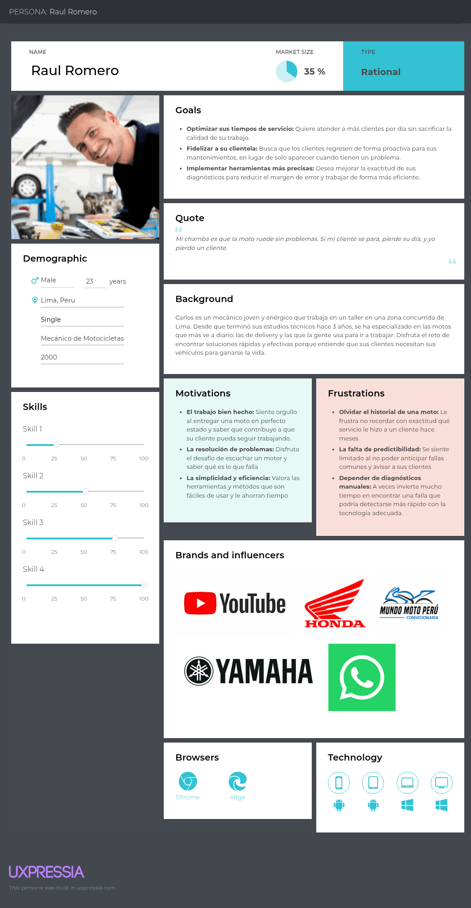

**Segmento Objetivo: Motociclistas**

A continuación, se presenta el perfil de Daniel Castro, un User Persona desarrollado para representar al segmento clave de motociclistas jóvenes y urbanos en Lima que han adoptado las motocicletas eléctricas como su principal medio de transporte. Este arquetipo sintetiza los hallazgos de la investigación de usuarios, encapsulando sus comportamientos, necesidades y metas.

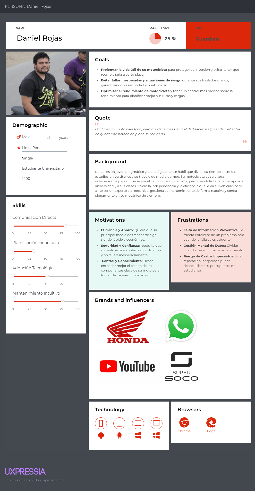

#### 2.3.2 User Task Matrix

En esta sección se presenta la User Task Matrix, herramienta que permite identificar y analizar las tareas que cada User Persona, representando a los distintos segmentos de usuarios, realiza para alcanzar sus objetivos. Se detallan las tareas en función de su frecuencia e importancia, proporcionando una visión clara de las actividades más relevantes para cada segmento.

**1. Segmento 1: Mecánico de Motocicletas**

| Tarea                                           | Frecuencia | Severidad |
|-------------------------------------------------|------------|-----------|
| Realizar diagnósticos precisos de fallas        | Alta       | Alta      |
| Optimizar tiempos de servicio                   | Alta       | Alta      |
| Visualizar mantenimientos de clientes           | Media      | Alta      |
| Programar citas con clientes                    | Media      | Media     |
| Usar herramientas de diagnóstico manual         | Alta       | Media     |
| Implementar nuevas herramientas tecnológicas    | Baja       | Alta      |
| Anticipar fallas comunes de motos               | Media      | Alta      |
| Verificar estado básico de la moto al recibirla | Media      | Media     |


**2. Segmento 2: Usuario Final de Motocicleta**

| Tarea                                                 | Frecuencia | Severidad |
|-------------------------------------------------------|------------|-----------|
| Realizar mantenimientos preventivos                   | Baja       | Alta      |
| Recordar fechas de último mantenimiento               | Media      | Alta      |
| Detectar fallas solo cuando se presentan              | Alta       | Alta      |
| Buscar información en internet sobre problemas        | Media      | Media     |
| Administrar presupuesto de reparaciones               | Alta       | Alta      |
| Verificar el estado básico de la moto antes de usarla | Alta       | Media     |

#### 2.3.3 User Journey Mapping

En esta sección se presentan los User Journey Maps para los dos segmentos objetivo: mecánicos de motocicletas y usuarios finales de motocicletas. Estos mapas ilustran las etapas clave del viaje del usuario, sus acciones, pensamientos y emociones en cada fase, así como los puntos de contacto con la solución propuesta.

**1. User Journey Map - Mecánico de Motocicletas**

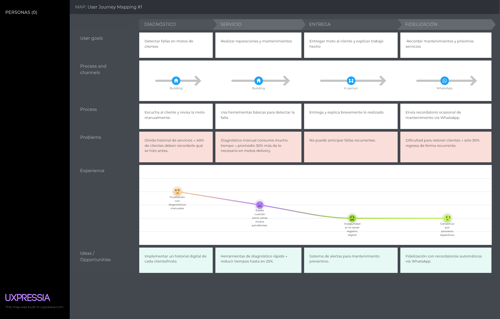

**2. User Journey Map - Usuario Final de Motocicleta**

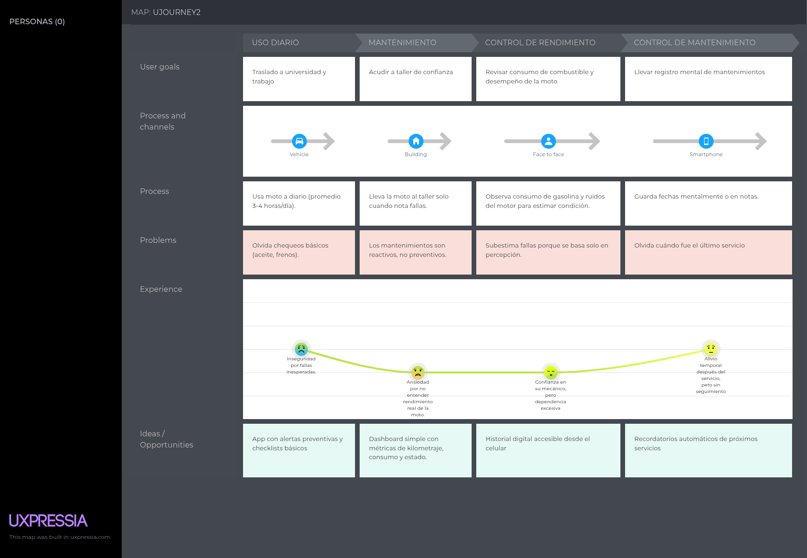


#### 2.3.4 Empathy Mapping

En esta sección se presentan los Empathy Mapping por cada segmento objetivo definido.

**1. Empathy Map - Mecánico de Motocicletas**

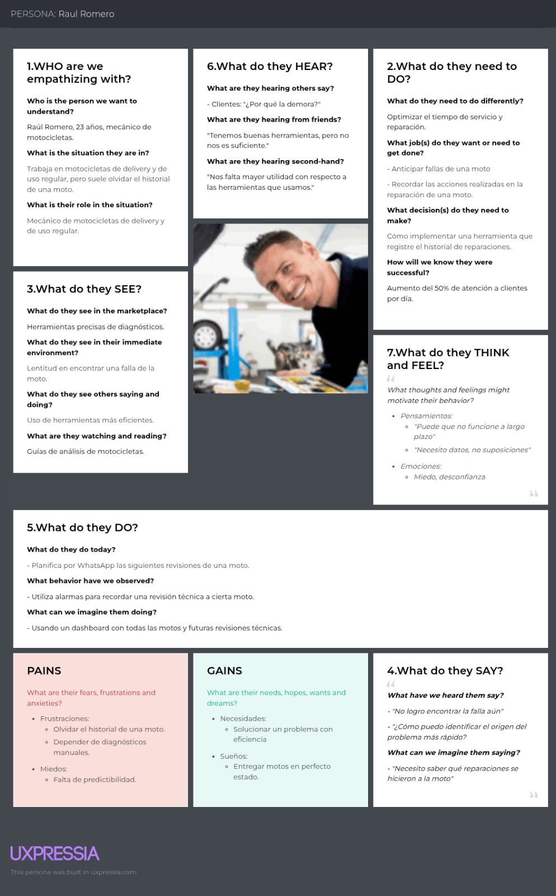

**2. Empathy Map - Usuario de Motocicleta**
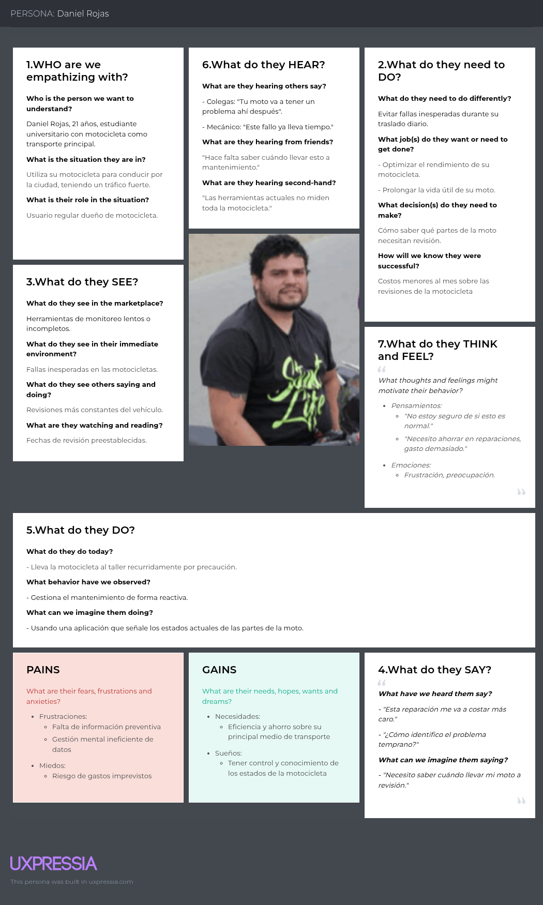

### 2.4 Big Picture EventStorming

El Big Picture Event Storming es la fase inicial y colaborativa del Domain-Driven Design (DDD) Estratégico. Su propósito es que todo el equipo obtenga una comprensión común y de alto nivel del dominio, identificando los procesos clave, los flujos transaccionales y las áreas de riesgo. Al enfocarse en los Eventos de Dominio, logramos construir una línea de tiempo que representa la totalidad del negocio. Este proceso es la base sobre la cual se descubren las fronteras de los Bounded Contexts.

Esta imagen muestra la primera aproximación visual del dominio. Nos enfocamos exclusivamente en los Eventos de Dominio (notas naranjas), los cuales representan hechos del pasado relevantes para el negocio (ej., usuario registrado, vehículo registrado, mantenimiento completado). Este artefacto garantiza que todo el equipo comparte el mismo Lenguaje Ubicuo sobre lo que realmente importa en el sistema.

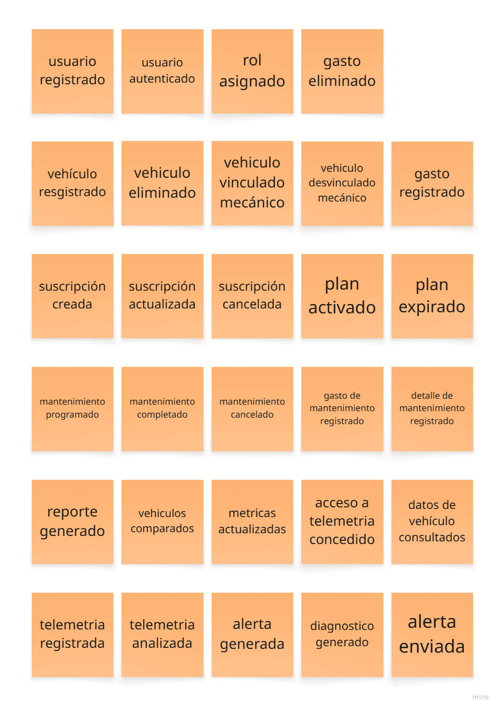

Al añadir los Actores (notas amarillas) y los Comandos (notas azules), convertimos el flujo de hechos en un flujo transaccional completo. Esta etapa es crucial porque: 
1) Identifica Responsabilidades: Aclaramos el rol (Motociclista, Mecánico) que ejecuta la acción (ej., el Motociclista es el Actor que emite el Comando Registrar Vehículo). 2
2) Establece la Intención: Se define el Comando (la intención de la acción) que, de ser exitoso, resulta en un Evento. Este mapeo expuso claramente las interacciones directas del usuario con el sistema, sirviendo como base para el descubrimiento de los Bounded Contexts transaccionales.

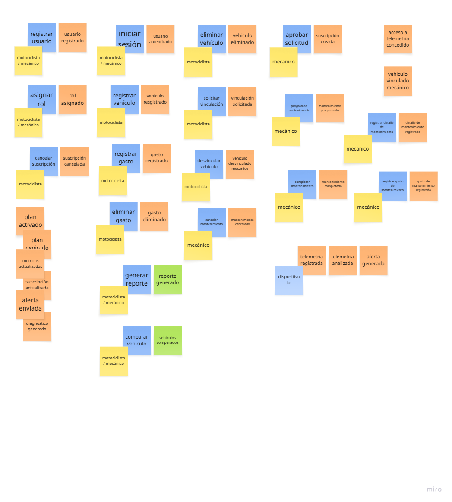

### 2.5 Ubiquitous Language

| Término(inglés)      | Término(español)     | Definición(español)                                                                       |
|----------------------|----------------------|-------------------------------------------------------------------------------------------|
| Metric               | Métrica              | Dato cuantitativo sobre el estado o desempeño de la moto.                                 |
| Report               | Report               | Conjunto estructurado de métricas procesadas y visualizadas.                              |
| Comparison           | Comparación          | Análisis de diferencias entre métricas en distintos períodos o vehículos.                 |
| Alert                | Alerta               | Notificación preventiva generada a partir de una métrica crítica o fuera de rango.        |
| Historial            | Historial            | Registro acumulativo de eventos pasados relacionados con vehículos, servicios y clientes. |
| Service              | Servicio             | Intervención realizada por un mecánico.                                                   |
| Repair               | Reparación           | Acción específica para corregir un problema en la moto.                                   |
| Spent                | Gasto                | Desembolso económico relacionado con el vehículo.                                         |
| Client               | Cliente              | Dueño de moto asociado al historial.                                                      |
| Subscription         | Suscripción          | Vínculo activo entre mecánico y dueño de moto.                                            |
| Plan                 | Plan                 | Conjunto de beneficios y limitaciones (ejemplo: básico, premium).                         |
| State                | Estado               | Condición de la suscripción (activa, suspendida, cancelada).                              |
| Renewal              | Renovación           | Acción de extender la suscripción al vencer.                                              |
| Preventive alert     | Alerta preventiva    | Notificación emitida al detectar un valor fuera de rango normal.                          |
| Vehicle status       | Estado del vehículo  | Resumen general del bienestar (óptimo, regular, crítico).                                 |
| Diagnosis            | Diagnóstico          | Interpretación de métricas para indicar posibles fallas o recomendaciones.                |
| Vehicle              | Vehículo             | Moto registrada en la plataforma.                                                         |
| Owner                | Dueño                | Usuario principal que gestiona el vehículo.                                               |
| Authorized Mechanic  | Mecánico autorizado  | Usuario con acceso limitado al vehículo para servicios o diagnósticos.                    |
| Vehicle registration | Registro de vehículo | Proceso de alta inicial en el sistema.                                                    |

## Capítulo III: Requirements Specification

### 3.1 User Stories

Epicas:

# Épicas

| Código | Título                                                          | Descripción                                                                                                                                                                                                                                                                                                                                                                                             |
|--------|-----------------------------------------------------------------|---------------------------------------------------------------------------------------------------------------------------------------------------------------------------------------------------------------------------------------------------------------------------------------------------------------------------------------------------------------------------------------------------------|
| EP-001 | Monitoreo inteligente del estado de la moto                     | Desarrollar una aplicación móvil que permita a los motociclistas visualizar en tiempo real métricas clave de su motocicleta (batería, kilometraje, consumo de combustible, temperatura, presión de neumáticos y vibraciones), facilitando decisiones informadas y la prevención de fallas.                                                                                                              |
| EP-002 | Sistema de alertas preventivas y recordatorios                  | Implementar un sistema que notifique a motociclistas y talleres sobre mantenimientos, condiciones críticas o fallas recurrentes mediante alertas en la app, para anticipar problemas, reducir riesgos y mantener una agenda organizada.                                                                                                                                                                 |
| EP-003 | Gestión del historial de mantenimiento y gastos                 | Desarrollar funcionalidades que permitan a motociclistas y talleres registrar el historial de mantenimientos y los costos de reparaciones, repuestos y servicios. La información debe visualizarse en reportes claros (mensuales o por evento) y estar disponible para ambos, fomentando transparencia, planificación y fidelización, reemplazando métodos manuales por una solución digital confiable. |
| EP-004 | Desarrollo e integración del dispositivo embebido de telemetría | Diseñar e integrar un dispositivo IoT que recolecte en tiempo real datos críticos de la moto y los transmita de forma segura a la plataforma. Incluye desarrollo de firmware, pruebas de sensores, compatibilidad con distintos modelos y validación de la conexión con la app mediante protocolos eficientes.                                                                                          |
| EP-005 | Gestión de relación entre motociclista y mecánico               | Funcionalidades para crear y administrar la relación entre un motociclista y su mecánico de confianza, permitiendo compartir métricas de la moto en tiempo real y recibir notificaciones. Estas relaciones podrán modificarse o terminarse según las necesidades de ambas partes.                                                                                                                       |
| EP-006 | Diseño de la landing page                                       | Como equipo de desarrollo, queremos diseñar y construir una landing page atractiva, informativa y fácil de navegar, que comunique claramente el valor de la plataforma tanto para motociclistas como para mecánicos, con el objetivo de captar nuevos usuarios, generar confianza y facilitar el registro en el sistema.                                                                                |
| EP-007 | Gestión de Motos                                                | Administra toda la información relacionada con el ciclo de vida de las motocicletas dentro del sistema. Define los procesos de registro, consulta, actualización y baja de las motos, garantizando la integridad y consistencia de los datos.                                                                                                                                                           |

User Stories:

| User Story ID | Título                                                    | Descripción                                                                                                                                                                                                                                                                                                                                        | Criterios de Aceptación                                                                                                                                                                                                                                                                                                                                                                                                                                                                                                                                                                                                                                                                                                                                                                                                                                                                                                                                                                                                                                                                                                                                                                                                             | Epic ID |
|---------------|-----------------------------------------------------------|----------------------------------------------------------------------------------------------------------------------------------------------------------------------------------------------------------------------------------------------------------------------------------------------------------------------------------------------------|:------------------------------------------------------------------------------------------------------------------------------------------------------------------------------------------------------------------------------------------------------------------------------------------------------------------------------------------------------------------------------------------------------------------------------------------------------------------------------------------------------------------------------------------------------------------------------------------------------------------------------------------------------------------------------------------------------------------------------------------------------------------------------------------------------------------------------------------------------------------------------------------------------------------------------------------------------------------------------------------------------------------------------------------------------------------------------------------------------------------------------------------------------------------------------------------------------------------------------------|---------|
| US-001        | Manejo de asignaciones                                    | Como mecanico quiero manejar mis propias asignaciones para poder contraer un vinculo con los dueños de motocicletas                                                                                                                                                                                                                                | Escenario 1: Creación de asignación<br>Dado que el mecánico se encuentra dentro de la aplicación, cuando genera una asignación, entonces el sistema crea una asignación y brinda el código de esta misma.<br><br>Escenario 2: Eliminación de asignación<br>Dado que el mecánico encuentra dentro de la aplicación, cuando visualiza las asignaciones pendientes, entonces puede eliminar cualquiera de las asignaciones pendientes.<br><br>Escenario 3: Detalles de la asignación<br>Dado que el mecánico encuentra dentro de la aplicación, cuando interactúa con una asignación activa, entonces puede visualizar los detalles del dueño y la asignación hecha.                                                                                                                                                                                                                                                                                                                                                                                                                                                                                                                                                                   |
| US-002        | Vinculación de asignación                                 | Como dueño quiero poder vincularme con un mecánico para así permitirle acceder a los datos de mis vehiculos y tener una experiencia más completa                                                                                                                                                                                                   | Escenario 1: Vinculación<br>Dado que el dueño se encuentra en la aplicación cuando desea registrarse, entonces el sistema le solicita un código de asignación para poder vincularlo con un mecánico.<br><br>Escenario 2: Visualización<br>Dado que el dueño se encuentra dentro de la aplicación cuando se encuentra visualizando los datos generales entonces el sistema le muestra la información correspondiente a su asignación.<br>                                                                                                                                                                                                                                                                                                                                                                                                                                                                                                                                                                                                                                                                                                                                                                                            |         |
| US-003        | Creación de perfil para motociclistas                     | Como visitante, quiero crear una cuenta como motociclista para acceder a los servicios relacionados al rol.                                                                                                                                                                                                                                        | Escenario 1:<br>Dado que el motociclista se encuentre en el registro de cuentas, cuando el motociclista ingrese un código de invitación perteneciente a un mecánico, y el código pertenezca a un mecánico, y registre un perfil con los datos del usuario, entonces el sistema deberá crear la cuenta y vincular el motociclista al mecánico.<br><br>Escenario 2:<br>Dado que el motociclista se encuentre en el registro de cuentas, cuando el motociclista ingrese un código de invitación perteneciente a un mecánico, y el código no es válido o no pertenece a ningún mecánico, entonces el sistema deberá notificar que no se encontró a ningún mecánico relacionado a ese código.<br>                                                                                                                                                                                                                                                                                                                                                                                                                                                                                                                                        |         |
| US-004        | Creación de perfil para mecánicos                         | Como visitante, quiero crear una cuenta como mecánico para utilizar los servicios relacionados a mi rol.                                                                                                                                                                                                                                           | Escenario 1:<br>Dado que el usuario se encuentra en la pantalla de registro, cuando el usuario seleccione el botón de ver suscripciones y seleccione una suscripción de la lista de suscripciones disponibles y registre un perfil con los datos del usuario, entonces el sistema debe registrar la cuenta como mecánico.<br><br>Escenario 2:<br>Dado que el usuario se encuentre en la pantalla de registro, cuando el usuario seleccione el botón de ver suscripciones, y los datos del usuario son ya existentes, entonces el sistema debe notificar al usuario que el perfil ya existe.<br>                                                                                                                                                                                                                                                                                                                                                                                                                                                                                                                                                                                                                                     |         |
| US-005        | Autenticación en la aplicación web                        | Como usuario, quiero poder autenticarme en la aplicación web, para poder interactuar con mis datos de usuario.                                                                                                                                                                                                                                     | Escenario 1:<br>Dado que el usuario se encuentra iniciando sesión, cuando ingresa las credenciales correctas, entonces el sistema carga su perfil en la aplicación<br><br>Escenario 2:<br>Dado que el usuario se encuentra iniciando sesión, cuando ingresa credenciales incorrectas, entonces el sistema no le permite ingresar a la aplicación<br>                                                                                                                                                                                                                                                                                                                                                                                                                                                                                                                                                                                                                                                                                                                                                                                                                                                                                |         |
| US-006        | Sección de métricas por cada vehículo                     | Como mecánico, quiero poder acceder a la sección de métricas registradas para cada vehículo para poder analizar las métricas de cada moto de manera individual.                                                                                                                                                                                    | Escenario 1:<br>Dado que veo los vehículos de un cliente, cuando solicito métricas de un vehículo específico, entonces el sistema muestra sus métricas de telemetría<br><br>Escenario 2:<br>Dado que veo los vehículos de un cliente, cuando solicito métricas de un vehículo sin registros, entonces el sistema muestra "No se encontró ninguna métrica relacionada a este vehículo"<br>                                                                                                                                                                                                                                                                                                                                                                                                                                                                                                                                                                                                                                                                                                                                                                                                                                           | EP-001  |
| US-007        | Sistema de notificaciones interno                         | Como dueño, quiero recibir notificaciones de mis vehículos para conocer su estado                                                                                                                                                                                                                                                                  | Escenario 1:<br>Dado que veo mis vehículos registrados, cuando consulto el estado de un vehículo, entonces el sistema muestra las notificaciones de estado<br><br>Escenario 2:<br>Dado que veo mis vehículos registrados, cuando consulto el estado de un vehículo sin alertas, entonces el sistema muestra "No hay notificaciones para este vehículo"<br>                                                                                                                                                                                                                                                                                                                                                                                                                                                                                                                                                                                                                                                                                                                                                                                                                                                                          | EP-002  |
| US-008        | Alerta de Temperatura Alta                                | Como dueño, quiero alertas de temperatura alta para saber si se supera el umbral permitido                                                                                                                                                                                                                                                         | Escenario 1:<br>Dado que veo mis vehículos, cuando verifico temperatura y se supera el umbral, entonces el sistema envía notificación de temperatura alta<br><br>Escenario 2:<br>Dado que veo mis vehículos, cuando verifico temperatura y no se supera el umbral, entonces el sistema no envía notificación<br>                                                                                                                                                                                                                                                                                                                                                                                                                                                                                                                                                                                                                                                                                                                                                                                                                                                                                                                    | EP-002  |
| US-009        | Alerta de Temperatura Baja                                | Como dueño, quiero alertas de temperatura baja para saber si está bajo el umbral mínimo                                                                                                                                                                                                                                                            | Escenario 1:<br>Dado que veo mis vehículos, cuando verifico temperatura y está bajo el mínimo, entonces el sistema envía notificación de temperatura baja<br><br>Escenario 2:<br>Dado que veo mis vehículos, cuando verifico temperatura y no está bajo el mínimo, entonces el sistema no envía notificación<br>                                                                                                                                                                                                                                                                                                                                                                                                                                                                                                                                                                                                                                                                                                                                                                                                                                                                                                                    | EP-002  |
| US-010        | Alerta de Humedad Alta                                    | Como dueño, quiero alertas de humedad alta para saber si supera el umbral permitido                                                                                                                                                                                                                                                                | Escenario 1:<br>Dado que veo mis vehículos, cuando verifico humedad y se supera el umbral, entonces el sistema envía notificación de humedad alta<br><br>Escenario 2:<br>Dado que veo mis vehículos, cuando verifico humedad y no se supera el umbral, entonces el sistema no envía notificación<br>                                                                                                                                                                                                                                                                                                                                                                                                                                                                                                                                                                                                                                                                                                                                                                                                                                                                                                                                | EP-002  |
| US-011        | Alerta de CO2 Alto                                        | Como dueño, quiero alertas de CO2 alto para saber si supera el umbral permitido                                                                                                                                                                                                                                                                    | Escenario 1:<br>Dado que veo mis vehículos, cuando verifico CO2 y se supera el umbral, entonces el sistema envía notificación de CO2 alto<br><br>Escenario 2:<br>Dado que veo mis vehículos, cuando verifico CO2 y no se supera el umbral, entonces el sistema no envía notificación<br>                                                                                                                                                                                                                                                                                                                                                                                                                                                                                                                                                                                                                                                                                                                                                                                                                                                                                                                                            | EP-002  |
| US-012        | Alerta de NH3 Alto                                        | Como dueño, quiero alertas de NH3 alto para saber si supera el umbral permitido                                                                                                                                                                                                                                                                    | Escenario 1:<br>Dado que veo mis vehículos, cuando verifico NH3 y se supera el umbral, entonces el sistema envía notificación de NH3 alto<br><br>Escenario 2:<br>Dado que veo mis vehículos, cuando verifico NH3 y no se supera el umbral, entonces el sistema no envía notificación<br>                                                                                                                                                                                                                                                                                                                                                                                                                                                                                                                                                                                                                                                                                                                                                                                                                                                                                                                                            | EP-002  |
| US-013        | Alerta de Benceno Alto                                    | Como dueño, quiero alertas de benceno alto para saber si supera el umbral permitido                                                                                                                                                                                                                                                                | Escenario 1:<br>Dado que veo mis vehículos, cuando verifico benceno y se supera el umbral, entonces el sistema envía notificación de benceno alto<br><br>Escenario 2:<br>Dado que veo mis vehículos, cuando verifico benceno y no se supera el umbral, entonces el sistema no envía notificación<br>                                                                                                                                                                                                                                                                                                                                                                                                                                                                                                                                                                                                                                                                                                                                                                                                                                                                                                                                | EP-002  |
| US-014        | Alerta de Presión Baja                                    | Como dueño, quiero alertas de presión baja para saber si está bajo el umbral mínimo                                                                                                                                                                                                                                                                | Escenario 1:<br>Dado que veo mis vehículos, cuando verifico presión y está bajo el mínimo, entonces el sistema envía notificación de presión baja<br><br>Escenario 2:<br>Dado que veo mis vehículos, cuando verifico presión y no está bajo el mínimo, entonces el sistema no envía notificación<br>                                                                                                                                                                                                                                                                                                                                                                                                                                                                                                                                                                                                                                                                                                                                                                                                                                                                                                                                | EP-002  |
| US-015        | Alerta de Presión Alta                                    | Como dueño, quiero alertas de presión alta para saber si supera el umbral máximo                                                                                                                                                                                                                                                                   | Escenario 1:<br>Dado que veo mis vehículos, cuando verifico presión y se supera el máximo, entonces el sistema envía notificación de presión alta<br><br>Escenario 2:<br>Dado que veo mis vehículos, cuando verifico presión y no se supera el máximo, entonces el sistema no envía notificación<br>                                                                                                                                                                                                                                                                                                                                                                                                                                                                                                                                                                                                                                                                                                                                                                                                                                                                                                                                | EP-002  |
| US-016        | Alerta de Impacto Detectado                               | Como dueño, quiero alertas de impacto detectado para saber si mi moto sufrió colisión                                                                                                                                                                                                                                                              | Escenario 1:<br>ado que veo mis vehículos, cuando verifico impactos y se detecta uno, entonces el sistema envía notificación de impacto detectado<br><br>Escenario 2:<br>ado que veo mis vehículos, cuando verifico impactos y no se detecta ninguno, entonces el sistema no envía notificación<br>                                                                                                                                                                                                                                                                                                                                                                                                                                                                                                                                                                                                                                                                                                                                                                                                                                                                                                                                 | EP-002  |
| US-017        | Gestion de Gastos                                         | Como dueño, quiero agregar, ver y eliminar gastos relacionados con mi moto para llevar un control financiero de mis costos operativos                                                                                                                                                                                                              | Escenario 1: Visualización de gastos<br>Dado que el dueño de moto se encuentra en la aplicación, cuando accede a la sección de gastos, entonces el sistema le muestra un listado de todos sus gastos recientes organizados por fecha.<br><br>Escenario 2: Registro de nuevo gasto<br>Dado que el dueño de moto desea agregar un gasto, cuando selecciona la opción "Agregar gasto", entonces el sistema muestra un formulario con campos para tipo de gasto, monto, descripción y fecha.<br><br>Escenario 3: Eliminación de gasto<br>Dado que el dueño de moto visualiza un gasto registrado, cuando selecciona la opción "Eliminar" y confirma la acción, entonces el sistema remueve el gasto de su historial.<br>                                                                                                                                                                                                                                                                                                                                                                                                                                                                                                                |         |
| US-018        | Gestión de mantenimientos del dueño                       | Como mecánico, quiero crear y visualizar mantenimientos para el vehículo de un dueño específico para registrar los servicios requeridos                                                                                                                                                                                                            | Escenario 1: Visualización de mantenimientos por vehículo<br>Dado que el dueño de moto accede a la sección de mantenimientos, cuando selecciona un vehículo específico, entonces el sistema muestra todos los mantenimientos asociados a ese vehículo con detalles, fecha y estado.<br><br>Escenario 2: Detalle de mantenimiento completado<br>Dado que el dueño de moto visualiza un mantenimiento marcado como completado, cuando selecciona ver detalles, entonces el sistema muestra información completa incluyendo el gasto de mantenimiento asociado con todos sus items.<br>                                                                                                                                                                                                                                                                                                                                                                                                                                                                                                                                                                                                                                                |         |
| US-019        | Gestión del progreso del mantenimiento                    | Como mecánico, quiero actualizar el estado del mantenimiento (pendiente, en progreso, cancelado o completado) para gestionar el flujo de trabajo del servicio                                                                                                                                                                                      | Escenario 1: Actualización de estado de mantenimiento<br>Dado que el mecánico ha finalizado un mantenimiento, cuando actualiza el MaintenanceState a "Completado" mediante UpdateStateOfMaintenance, entonces el sistema cambia el estado del mantenimiento.<br><br>Escenario 2: Asociación de gasto a mantenimiento<br>Dado que un mantenimiento ha sido completado, cuando el mecánico utiliza AssignExpenseToMaintenance para asociar un gasto existente, entonces el sistema vincula el Expense al Maintenance mediante maintenanceExpense.<br><br>Escenario 3: Creación y asociación automática<br>Dado que el mecánico completa un mantenimiento, cuando crea un nuevo Expense y lo asocia al mantenimiento, entonces el sistema registra el gasto y lo vincula automáticamente al mantenimiento completado.<br>                                                                                                                                                                                                                                                                                                                                                                                                              |         |
| US-020        | Comparación de vehículos por motociclista                 | Como motociclista o mecánico quiero comparar las especificaciones técnicas de mi motocicleta con otros modelos disponibles para evaluar el rendimiento y características de mi vehículo frente a alternativas del mercado                                                                                                                          | Escenario 1: Selección de vehículos para comparar<br>Dado que el motociclista tiene vehículos registrados en el sistema, cuando accede a la funcionalidad de comparación, entonces el sistema muestra sus vehículos registrados y le permite seleccionar uno como base de comparación junto con un modelo de la base de datos para contrastar.<br><br>Escenario 2: Visualización de comparación técnica<br>Dado que el motociclista ha seleccionado dos vehículos para comparar, cuando el sistema procesa la comparación, entonces muestra lado a lado las especificaciones técnicas (cilindrada, potencia, torque, peso, transmisión, frenos, tanque, altura del asiento, consumo y precio) destacando cuál vehículo tiene mejores valores en cada categoría.<br><br>Escenario 3: Persistencia de comparación<br>Dado que el motociclista ha realizado una comparación de vehículos, cuando sale y vuelve a ingresar a la funcionalidad, entonces el sistema restaura la última comparación realizada desde el almacenamiento local.<br>                                                                                                                                                                                          |         |
| US-021        | Comparación de modelos por mecánico                       | Como mecánico quiero comparar especificaciones técnicas entre diferentes modelos de motocicletas para analizar y recomendar las mejores opciones a mis clientes según sus necesidades                                                                                                                                                              | Escenario 1: Acceso a comparación de modelos<br>Dado que el mecánico no tiene vehículos registrados bajo su nombre, cuando intenta acceder a la funcionalidad de comparación desde la vista de motociclista, entonces el sistema lo redirige automáticamente a la vista de comparación de modelos para mecánicos.<br><br>Escenario 2:<br>Dado que el mecánico accede a la comparación de modelos, cuando visualiza la interfaz, entonces puede seleccionar libremente cualquier par de modelos disponibles en la base de datos sin restricciones de propiedad.<br><br>Escenario 3: Análisis de múltiples comparaciones<br>Dado que el mecánico realiza varias comparaciones de modelos, cuando cambia la selección de cualquiera de los dos vehículos, entonces el sistema actualiza inmediatamente la comparación y guarda el estado actual para futuras consultas.<br>                                                                                                                                                                                                                                                                                                                                                            |         |
| US-022        | Evaluación por escenarios de uso                          | Como motociclista o mecánico quiero visualizar el rendimiento de los vehículos en diferentes escenarios de uso para determinar cuál opción se adapta mejor a condiciones específicas de conducción                                                                                                                                                 | Escenario 1: Visualización de escenarios<br>Dado que se está comparando dos vehículos, cuando el usuario visualiza la sección de escenarios de uso, entonces el sistema muestra las puntuaciones (del 1 al 10 representadas en estrellas) para tráfico urbano, viajes largos, costo de mantenimiento y valor de reventa.<br><br>Escenario 2: Identificación de mejor opción por escenario<br>Dado que dos vehículos tienen diferentes puntuaciones en un escenario específico, cuando el sistema muestra la comparación, entonces destaca visualmente cuál vehículo es mejor para ese escenario particular y muestra el nombre del ganador.<br><br>Escenario 3: Comparación equilibrada<br>Dado que dos vehículos tienen la misma puntuación en un escenario, cuando el sistema muestra la comparación, entonces no destaca ningún vehículo como ganador en ese escenario específico.<br>                                                                                                                                                                                                                                                                                                                                           |         |
| US-023        | Visualización de especificaciones detalladas              | Como motociclista o mecánico quiero ver una comparación detallada de todas las especificaciones técnicas para tomar decisiones informadas basadas en datos técnicos precisos                                                                                                                                                                       | Escenario 1: Listado completo de especificaciones<br>Dado que se están comparando dos vehículos, cuando el usuario visualiza la tarjeta de especificaciones, entonces el sistema muestra 10 categorías técnicas principales organizadas en filas con los valores de ambos vehículos lado a lado.<br><br>Escenario 2: Destacado de valores superiores<br>Dado que dos vehículos tienen valores numéricos diferentes en una especificación, cuando el sistema compara los valores, entonces resalta visualmente el valor superior con un indicador de ganador y un fondo distintivo.<br><br>Escenario 3: Manejo de datos faltantes<br>Dado que un vehículo no tiene información para una especificación específica, cuando el sistema muestra la comparación, entonces presenta un guion "-" en lugar de dejar el campo vacío o mostrar valores erróneos.<br>                                                                                                                                                                                                                                                                                                                                                                         |         |
| US-024        | Visualización de vehículos                                | Como dueño de moto, quiero ver todas mis motos registradas en una lista para tener conocimiento de su registro.                                                                                                                                                                                                                                    | Escenario 1:<br>Dado que el dueño tiene vehículos registrados, cuando se dirija a la pantalla de Vehículos, entonces la aplicación mostrará una lista de sus vehículos registrados con datos básicos.<br><br>Escenario 2:<br>Dado que el dueño no tiene ningún vehículo registrado, cuando se diriga a la pantalla de Vehículos, entonces la aplicación mostrará un mensaje de “No tiene vehículos registrados“<br>                                                                                                                                                                                                                                                                                                                                                                                                                                                                                                                                                                                                                                                                                                                                                                                                                 |         |
| US-025        | Visualización de detalles de un vehículo                  | Como dueño, quiero ver los detalles específicos de mi vehículo, para tener conocimiento sobre sus especificaciones a la hora de buscar reparaciones.                                                                                                                                                                                               | Escenario 1:<br>Dado que el dueño se encuentra en la vista de Vehículos, cuando presione el botón de Ver Detalles de uno de los vehículos, se redirigirá a una pantalla con más datos.<br><br>Escenario 2:<br>Dado que el dueño ha ingresado a la vista de Detalles del Vehículo, cuando revise la información presentada, entonces debe poder visualizar todas las especificaciones registradas del modelo dl vehículo, con cualquier dato relevante para futuras reparaciones.<br>                                                                                                                                                                                                                                                                                                                                                                                                                                                                                                                                                                                                                                                                                                                                                |         |
| US-026        | Registro de Vehículo                                      | Como dueño, quiero registrar un vehículo de mi pertenencia en la plataforma, para que mi mecánico asignado pueda monitorearlo.                                                                                                                                                                                                                     | Escenario 1:<br>Dado que el dueño se encuentra en la pantalla de vehículos, puede presionar el botón de Registrar Vehículo, entonces el sistema debe mostrar un formulario para colocar los datos del vehículo.<br><br>Escenario 2:<br>Dado que el dueño se encuentra en el formulario y ha colocado los datos de su vehículo, puede presionar el botón de Registrar, entonces el sistema deberá validar los datos y registrar el vehículo si son correctos.<br>                                                                                                                                                                                                                                                                                                                                                                                                                                                                                                                                                                                                                                                                                                                                                                    |         |
| US-027        | Exportación de reporte técnico del vehículo               | Como mecánico o motociclista quiero exportar un reporte técnico completo del vehículo en formato CSV para tener un registro físico de las características y estado del vehículo que pueda compartir o archivar                                                                                                                                     | Escenario 1: Generación exitosa del reporte<br>Dado que el usuario se encuentra visualizando los detalles de un vehículo específico, cuando el usuario presiona el botón "Exportar", entonces el sistema genera y descarga automáticamente un archivo CSV con todas las especificaciones técnicas del vehículo incluyendo año del modelo, marca, tipo, desplazamiento, tipo de motor, capacidad del tanque, potencia máxima, torque máximo, conectividad, peso, capacidad de aceite y consumo de gasolina.<br><br>Escenario 2: Nomenclatura del archivo exportado<br>Dado que el sistema ha generado exitosamente el archivo CSV, cuando se descarga el archivo, entonces el nombre del archivo sigue el formato vehicle-report-{vehicleId}.csv donde vehicleId es el identificador único del vehículo.<br><br>Escenario 3: Manejo de error en la exportación<br>Dado que el usuario solicita exportar el reporte del vehículo, cuando ocurre un error durante la generación o descarga del archivo, entonces el sistema muestra un mensaje de alerta indicando "Error al exportar el reporte" sin descargar ningún archivo corrupto o incompleto.<br>                                                                              |         |
| US-028        | Monitorear la temperatura de la moto                      | Como usuario del dispositivo, quiero que el sistema mida la temperatura de la moto, para detectar sobrecalentamientos y prevenir fallas mecánicas                                                                                                                                                                                                  | Escenario 1:<br>Dado que la moto se encuentra encendida, cuando el sensor de temperatura realiza una nueva lectura, entonces el valor se muestra en grados Celsius en el sistema.<br><br>Escenario 2:<br>Dado que la temperatura de la moto es monitoreada, cuando se excede los limites de temperatura, entonces el sistema genera un evento de notificación.<br>                                                                                                                                                                                                                                                                                                                                                                                                                                                                                                                                                                                                                                                                                                                                                                                                                                                                  |         |
| US-029        | Monitorear la contaminación emitida por el tubo de escape | Como usuario del dispositivo, quiero que el sistema mida los gases emitidos por el tubo de escape, para conocer el nivel de contaminación generada por la moto.                                                                                                                                                                                    | Escenario 1:<br>Dado que la moto está encendida, cuando el sensor detecta concentraciones de CO₂, NH₃ y Benceno, entonces los valores se muestran en ppm.<br><br>Escenario 2:<br>Dado que se estan monitoreando los gases, cuando cualquiera de los gases excede el limite, entonces el sistema emite un evento de notificación.<br>                                                                                                                                                                                                                                                                                                                                                                                                                                                                                                                                                                                                                                                                                                                                                                                                                                                                                                |         |
| US-030        | Detectar impactos cuando la moto está estacionada         | Como usuario del dispositivo, quiero que el sistema detecte impactos cuando la moto esté apagada, para identificar intentos de robo, caídas o golpes.                                                                                                                                                                                              | Escenario 1:<br>Dado que la moto se encuentra apagada, cuando el sensor de impacto detecta un golpe, entonces el sistema genera un evento de impacto.<br><br>Escenario 2:<br>Dado que ocurre un solo golpe, cuando se supera el umbral de sensibilidad, entonces se emite un único evento.<br><br>Escenario 3:<br>Dado que no existe impacto, cuando el sistema está en monitoreo, entonces no se generan eventos de impacto.<br>                                                                                                                                                                                                                                                                                                                                                                                                                                                                                                                                                                                                                                                                                                                                                                                                   |         |
| US-031        | Monitorear la presión de las llantas                      | Como usuario del dispositivo, quiero que el sistema mida la presión de las llantas, para garantizar una conducción segura.                                                                                                                                                                                                                         | Escenario 1:<br>Dado que el sensor de presión se encuentra activo, cuando detecta la presión de la llanta, entonces el sistema muestra el valor en hPa.<br><br>Escenario 2:<br>Dado que la presión se sale de los limites de nivel seguro, cuando se detecta la variación, entonces el sistema emite un evento de alerta.<br><br>Escenario 3:<br>Dado que la presión se mantiene estable, cuando se realizan múltiples lecturas, entonces no se generan eventos adicionales.<br>                                                                                                                                                                                                                                                                                                                                                                                                                                                                                                                                                                                                                                                                                                                                                    |         |
| US-032        | Visualizar el estado general de la moto                   | Como usuario del dispositivo, quiero visualizar todos los datos del sistema en conjunto, para conocer el estado general del vehículo en tiempo real.                                                                                                                                                                                               | Escenario 1:<br>Dado que todos los sensores están activos, cuando el sistema actualiza las lecturas, entonces se muestran simultáneamente temperatura, gases, presión e impactos.<br><br>Escenario 2:<br>Dado que uno de los sensores falla, cuando ocurre la lectura, entonces el sistema continúa mostrando los demás valores disponibles.<br>                                                                                                                                                                                                                                                                                                                                                                                                                                                                                                                                                                                                                                                                                                                                                                                                                                                                                    |         |
| US-033        | Integrar sensores con ModestIoT                           | Como desarrollador del dispositivo, quiero integrar todos los sensores usando ModestIoT, para evitar programación directa del hardware.                                                                                                                                                                                                            | Escenario 1:<br>Dado que el desarrollador incluye `<ModestIoT.h>`, cuando instancia `BykerZDevice`, entonces todos los sensores quedan registrados automáticamente.<br><br>Escenario 2:<br>Dado que el sistema está en ejecución, cuando ocurre un evento de sensor, entonces este es procesado por `BykerZDevice::on(Event)`.<br>                                                                                                                                                                                                                                                                                                                                                                                                                                                                                                                                                                                                                                                                                                                                                                                                                                                                                                  |         |
| US-034        | Arquitectura basada en eventos                            | Como desarrollador del dispositivo, quiero que el sistema funcione solo con eventos, para desacoplar la lógica del hardware.                                                                                                                                                                                                                       | Escenario 1: Emisión de eventos<br>Dado que un sensor detecta un cambio, cuando se supera el umbral definido, entonces se emite un único evento.<br><br>Escenario 2: Eventos controlados<br>Dado que no ocurre ningún cambio, cuando el sistema actualiza las lecturas, entonces no se emiten eventos.<br>                                                                                                                                                                                                                                                                                                                                                                                                                                                                                                                                                                                                                                                                                                                                                                                                                                                                                                                          |         |
| US-035        | Escalabilidad del sistema                                 | Como desarrollador del dispositivo, quiero poder añadir nuevos sensores sin modificar la arquitectura base, para escalar el sistema en futuras versiones.                                                                                                                                                                                          | Escenario 1: Creación de sensor<br>Dado que se crea una nueva clase de sensor, cuando se integra al dispositivo, entonces no se debe modificar la clase base Device.<br><br>Escenario 2: Agregar nuevo sensor<br>Dado que el sistema está en producción, cuando se agrega un nuevo sensor, entonces los sensores existentes continúan funcionando correctamente.<br>                                                                                                                                                                                                                                                                                                                                                                                                                                                                                                                                                                                                                                                                                                                                                                                                                                                                |         |
| US-036        | Depuración mediante Serial Monitor                        | Como desarrollador del dispositivo, quiero que todos los eventos se muestren por el Serial Monitor, para validar el comportamiento del sistema.                                                                                                                                                                                                    | Escenario 1: Emisión de evento<br>Dado que ocurre un evento de cualquier sensor, cuando es procesado por el dispositivo, entonces el valor se imprime por Serial a 115200 baudios.<br><br>Escenario 2: Sin evento registrado<br>Dado que no ocurren eventos, cuando el sistema está en reposo, entonces el Serial Monitor permanece sin mensajes nuevos.<br>                                                                                                                                                                                                                                                                                                                                                                                                                                                                                                                                                                                                                                                                                                                                                                                                                                                                        |         |
| TS-001        | Uso de polling para detección.                            | Como desarrollador, quiero implementar un mecanismo de sondeo periódico (polling) para leer los valores de los sensores de la motocicleta (ej. presión de llantas, temperatura del motor, consumo de combustible), para garantizar que la aplicación obtenga datos actualizados constantemente, y estos se vean registrados a lo largo del tiempo. | Escenario 1: <br>Dado que la aplicación está conectada a los sensores de la motocicleta y el sistema de polling está configurado con un intervalo específico, cuando se ejecuta el ciclo periódico de lectura de sensores, entonces el sistema obtiene los valores actualizados de presión de llantas, temperatura del motor y consumo de combustible, y los almacena con timestamp en la base de datos local para su posterior análisis. <br><br> Escenario 2: <br>Dado que el último ciclo de polling detectó un valor de sensor que supera los umbrales predefinidos de seguridad, cuando el sistema procesa y valida esta lectura anómala, entonces genera inmediatamente un evento de alerta prioritario que activa las notificaciones al usuario y registra el incidente en el historial de anomalías del vehículo. <br><br> Escenario 3: <br>Dado que todos los valores de sensores leídos durante el ciclo de polling se encuentran dentro de los rangos normales establecidos, cuando el sistema completa la lectura y verificación de datos, entonces actualiza los registros históricos con los nuevos valores sin generar alertas ni notificaciones al usuario, manteniendo el funcionamiento silencioso del monitoreo. | EP-004  |
| TS-002        | Monitoreo del estado de las métricas.                     | Como desarrollador, quiero que las métricas recopiladas actuales del vehículo aparezcan en el monitor serial del dispositivo, para comprobar que estas coincidan con los valores reales.                                                                                                                                                           | Escenario 1: <br>Dado que el sistema de sensores de la motocicleta está operativo y enviando datos en tiempo real, cuando se ejecuta la rutina de monitoreo y adquisición de datos, entonces los valores actuales de presión de llantas, temperatura del motor y consumo de combustible se imprimen en el monitor serial cada 2 segundos con el formato: "[TIMESTAMP] Sensor: [VALOR] [UNIDAD]". <br><br> Escenario 2: <br>Dado que un sensor específico reporta un valor que excede los umbrales normales predefinidos, cuando el sistema procesa y muestra este dato en el monitor serial, entonces la métrica aparece destacada con el formato "[ALERTA] Sensor: [VALOR] [UNIDAD] - FUERA DE RANGO" para facilitar su identificación inmediata durante las pruebas. <br><br> Escenario 3: <br>Dado que los sensores están reportando valores dentro de los rangos normales sin fluctuaciones significativas, cuando el sistema muestra las lecturas en el monitor serial, entonces los datos aparecen con valores estables y consistentes, manteniendo una variación máxima del 5% entre lecturas consecutivas y reflejando fielmente el comportamiento real de los sensores sin distorsiones.                                   | EP-004  |
| TS-003        | Lectura de sensor de presión de llantas                   | Como desarrollador, quiero implementar la lectura periódica de los sensores de presión de llantas, para disponer de datos confiables en el sistema.                                                                                                                                                                                                | Escenario 1: <br>Dado que los sensores de presión de llantas están correctamente conectados y calibrados, cuando el sistema ejecuta la rutina periódica de lectura de sensores, entonces obtiene y registra el valor actual en PSI de cada llanta (delantera y trasera) con una precisión de ±1 PSI and timestamp of the measurement. <br><br> Escenario 2: <br>Dado que se ha realizado una lectura de presión de llantas con valores fuera del rango seguro establecido (menor a 28 PSI o mayor a 40 PSI para motocicletas estándar), cuando el sistema procesa estos datos, entonces marca automáticamente la lectura como anómala en la base de datos y activa el protocolo de notificación de alerta temprana.                                                                                                                                                                                                                                                                                                                                                                                                                                                                                                                 | EP-04   |
| TS-004        | Lectura de sensor de temperatura del motor                | Como desarrollador, quiero integrar la lectura del sensor de temperatura del motor, para detectar condiciones de sobrecalentamiento.                                                                                                                                                                                                               | Escenario 1: <br>Dado que el sensor de temperatura del motor está instalado y funcionando correctamente, cuando el sistema ejecuta la rutina de monitoreo periódico, entonces el valor actual de temperatura en grados Celsius se registra en la memoria del dispositivo con una precisión de más o menos 2°C y se almacena con su timestamp correspondiente. <br><br> Escenario 2: <br>Dado que la lectura de temperatura del motor supera los 95°C (umbral de sobrecalentamiento para la mayoría de motocicletas), cuando el sistema procesa este dato, entonces marca la lectura como alerta crítica interna, activa el flag de sobrecalentamiento en el sistema y prepara el protocolo de notificación de emergencia. <br><br> Escenario 3: <br>Dado que la temperatura del motor se mantiene entre 70°C y 80°C (rango operativo normal), cuando el sistema registra la lectura en el log de datos, entonces almacena el valor sin activar alertas ni banderas de advertencia, manteniendo el estado operativo normal del sistema de monitoreo.                                                                                                                                                                                 | EP-04   |
| TS-005        | Lectura de sensor de consumo de combustible               | Como desarrollador, quiero implementar la medición de flujo de combustible en tiempo real, para calcular consumo instantáneo y promedio.                                                                                                                                                                                                           | Escenario 1: <br>Dado que el motor de la motocicleta está en marcha y el sensor de flujo de combustible detecta circulación de combustible, cuando el sistema realiza la lectura periódica del sensor, entonces calcula el consumo instantáneo en L/100km basado en el flujo actual y la velocidad de la motocicleta, actualizando el valor cada 5 segundos. <br><br> Escenario 2: <br>Dado que el motociclista ha finalizado un trayecto y el motor se apaga, cuando el sistema procesa todos los datos acumulados del viaje, entonces calcula el consumo promedio de combustible dividiendo el total de combustible consumido entre la distancia recorrida, mostrando el resultado en km/L con dos decimales de precisión. <br><br> Escenario 3: <br>Dado que el motor de la motocicleta está apagado y no hay circulación de combustible, cuando el sistema ejecuta la rutina de lectura del sensor de flujo, entonces reporta un valor de 0.0 L/h para el consumo instantáneo y mantiene inactivo el cálculo de consumo hasta que se detecte nuevo flujo.                                                                                                                                                                       | EP-04   |
| TS-006        | Registro de métricas en memoria local                     | Como desarrollador, quiero que todas las métricas capturadas se almacenen en memoria local del dispositivo, para permitir la persistencia de datos incluso sin conexión a la app.                                                                                                                                                                  | Escenario 1: <br>Dado que se completa exitosamente una lectura de cualquier sensor del sistema (presión, temperatura, combustible), cuando se obtiene el valor medido, entonces los datos se almacenan inmediatamente en la memoria local con un timestamp preciso y se etiquetan con el tipo de sensor correspondiente para su posterior recuperación. <br><br> Escenario 2: <br>Dado que la memoria local alcanza su capacidad máxima de almacenamiento (ej. 10,000 registros), cuando se intenta guardar un nuevo dato y el espacio está lleno, entonces el sistema elimina automáticamente el 10% de los registros más antiguos para liberar espacio y continúa almacenando los nuevos datos sin interrupción. <br><br> Escenario 3: <br>Dado que la aplicación recupera la conexión a internet después de un período sin conexión, cuando se ejecuta el proceso de sincronización con el servidor, entonces la memoria local envía todos los registros almacenados durante el período offline y los marca como sincronizados una vez confirmada su recepción exitosa.                                                                                                                                                          | EP-04   |
| TS-007        | Sincronización de datos con la aplicación móvil           | Como desarrollador, quiero sincronizar los datos de métricas almacenados en el dispositivo con la app móvil, para asegurar que el usuario siempre tenga la información más reciente.                                                                                                                                                               | Escenario 1: <br>Dado que el dispositivo tiene registros locales de métricas sin sincronizar almacenados en su memoria, cuando la aplicación móvil establece conexión estable con el dispositivo, entonces se inicia la transferencia de todos los datos pendientes en lotes organizados por timestamp y tipo de métrica. <br><br> Escenario 2: <br>Dado que la transmisión de datos desde el dispositivo hacia la aplicación móvil se ha completado exitosamente, cuando la aplicación confirma la recepción íntegra de todos los registros, entonces el dispositivo marca los datos como sincronizados en su base de datos local y los mantiene como respaldo histórico por un período determinado. <br><br> Escenario 3: <br>Dado que ocurre una falla durante el proceso de sincronización de datos, cuando el sistema reintenta la conexión y transferencia, entonces identifica los registros pendientes de sincronización mediante timestamps y envía solamente el diferencial de datos que no había sido transferido previamente.                                                                                                                                                                                           | EP-04   |
| TS-008        | Integración con framework de comunicación IoT             | Como desarrollador, quiero integrar el framework IoT del proyecto para enviar los datos recopilados a la nube, para habilitar reportes remotos y análisis avanzados.                                                                                                                                                                               | Escenario 1: <br>Dado que el dispositivo tiene conexión a internet activa y estable, cuando se completa un ciclo de lectura de sensores y procesamiento de datos, entonces el sistema envía automáticamente el paquete de métricas a la nube utilizando el framework IoT configurado, aplicando el protocolo de seguridad correspondiente. <br><br> Escenario 2: <br>Dado que la conexión a internet no está disponible o la transmisión a la nube falla, cuando el sistema intenta enviar los datos, entonces almacena la información en una cola local persistente con timestamp y reintenta el envío cada 5 minutos hasta que se restablezca la conectividad. <br><br> Escenario 3: <br>Dado que el envío de datos a la nube se completa exitosamente, cuando el servidor cloud confirma la recepción mediante acknowledge, entonces el sistema registra la confirmación en el log serial con el mensaje "[OK] Datos sincronizados - [TIMESTAMP]" y elimina los datos correspondientes de la cola local.                                                                                                                                                                                                                         | EP-04   |

### 3.2 Impact Mapping

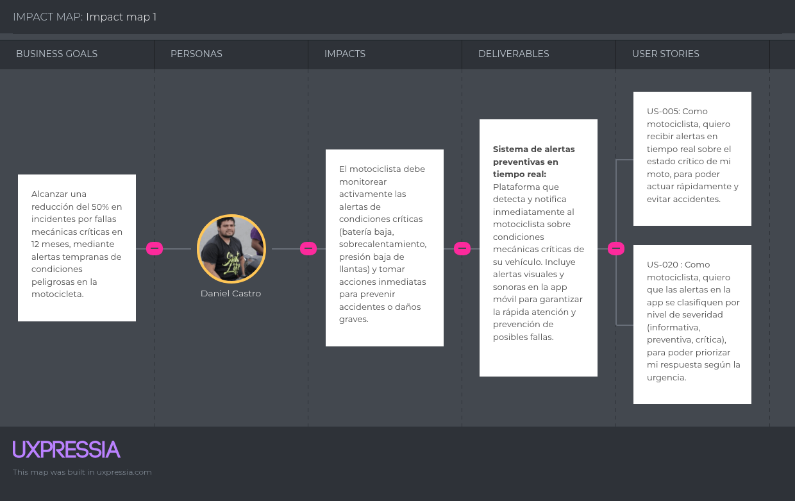

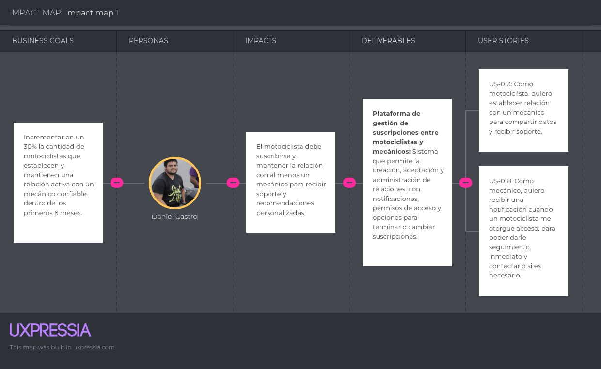

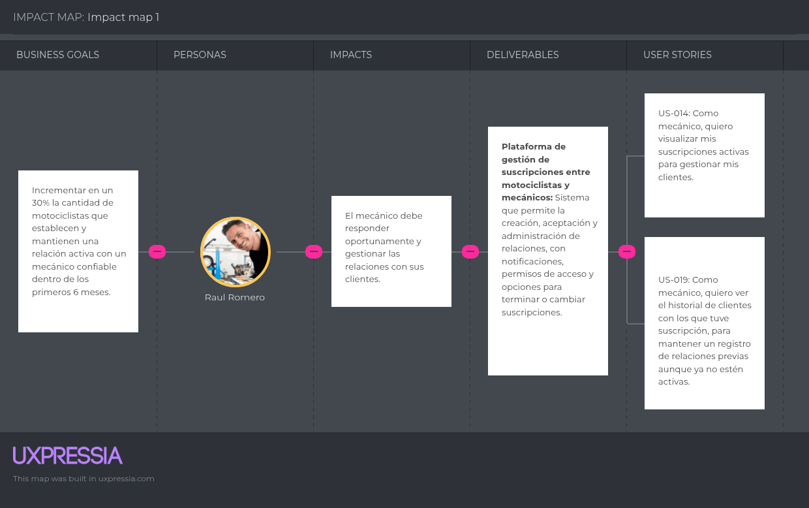

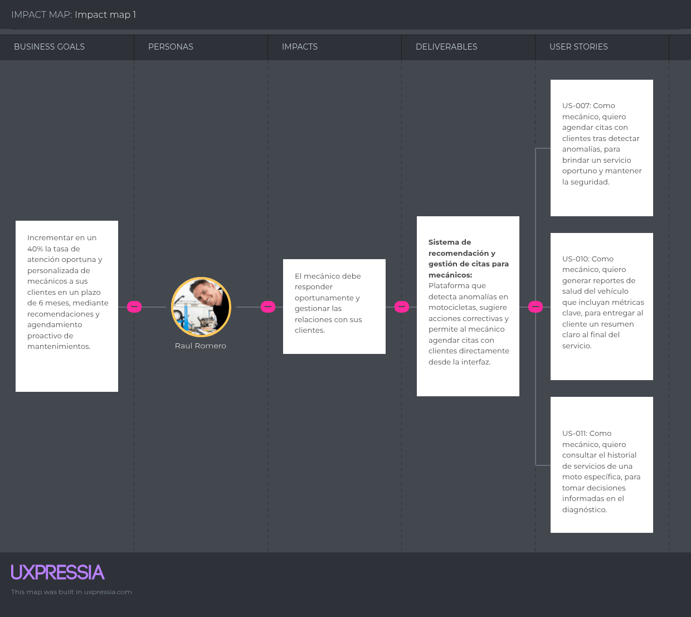

### 3.3 Product Backlog

| Prioridad | Story ID | Título                                        | Descripción                                                                                                                                                   | Story Points |
|-----------|----------|-----------------------------------------------|---------------------------------------------------------------------------------------------------------------------------------------------------------------|--------------|
| 1         | US-001   | Manejo de asignaciones                        | Como mecánico quiero manejar mis propias asignaciones para poder contraer un vínculo con los dueños de motocicletas.                                          |              |
| 2         | US-002   | Vinculación de asignación                     | Como dueño quiero poder vincularme con un mecánico para así permitirle acceder a los datos de mis vehículos y tener una experiencia más completa.             |              |
| 3         | US-026   | Registro de Vehículo                          | Como dueño, quiero registrar un vehículo de mi pertenencia en la plataforma, para que mi mecánico asignado pueda monitorearlo.                                |              |
| 4         | US-024   | Visualización de vehículos                    | Como dueño de moto, quiero ver todas mis motos registradas en una lista para tener conocimiento de su registro.                                               |              |
| 5         | US-025   | Visualización de detalles de un vehículo      | Como dueño, quiero ver los detalles específicos de mi vehículo, para tener conocimiento sobre sus especificaciones a la hora de buscar reparaciones.          |              |
| 6         | US-007   | Sistema de notificaciones interno             | Como dueño, quiero recibir notificaciones de mis vehículos para conocer su estado.                                                                            |              |
| 7         | US-016   | Alerta de Impacto Detectado                   | Como dueño, quiero alertas de impacto detectado para saber si mi moto sufrió colisión.                                                                        |              |
| 8         | US-008   | Alerta de Temperatura Alta                    | Como dueño, quiero alertas de temperatura alta para saber si se supera el umbral permitido.                                                                   |              |
| 9         | US-009   | Alerta de Temperatura Baja                    | Como dueño, quiero alertas de temperatura baja para saber si está bajo el umbral mínimo.                                                                      |              |
| 10        | US-014   | Alerta de Presión Baja                        | Como dueño, quiero alertas de presión baja para saber si está bajo el mínimo permitido.                                                                       |              |
| 11        | US-015   | Alerta de Presión Alta                        | Como dueño, quiero alertas de presión alta para saber si supera el máximo permitido.                                                                          |              |
| 12        | US-010   | Alerta de Humedad Alta                        | Como dueño, quiero alertas de humedad alta para saber si supera el umbral permitido.                                                                          |              |
| 13        | US-011   | Alerta de CO₂ Alto                            | Como dueño, quiero alertas de CO₂ alto para saber si supera el umbral permitido.                                                                              |              |
| 14        | US-012   | Alerta de NH₃ Alto                            | Como dueño, quiero alertas de NH₃ alto para saber si supera el umbral permitido.                                                                              |              |
| 15        | US-013   | Alerta de Benceno Alto                        | Como dueño, quiero alertas de benceno alto para saber si supera el umbral permitido.                                                                          |              |
| 16        | US-018   | Gestión de mantenimientos del dueño           | Como mecánico, quiero crear y visualizar mantenimientos para el vehículo de un dueño específico para registrar los servicios requeridos                       |              |
| 17        | US-019   | Gestión del progreso del mantenimiento        | Como mecánico, quiero actualizar el estado del mantenimiento (pendiente, en progreso, cancelado o completado) para gestionar el flujo de trabajo del servicio |              |
| 18        | US-017   | Gestión de Gastos                             | Como dueño, quiero agregar, ver y eliminar gastos relacionados con mi moto para llevar un control financiero de mis costos operativos                         |              |
| 19        | US-006   | Sección de métricas por cada vehículo         | Como mecánico, quiero acceder a las métricas registradas por vehículo para analizarlas de manera individual.                                                  |              |
| 20        | US-020   | Comparación de vehículos por motociclista     | Como motociclista o mecánico quiero comparar especificaciones técnicas entre mi moto y otros modelos.                                                         |              |
| 21        | US-003   | Creación de perfil para motociclistas         | Como visitante, quiero crear una cuenta como motociclista para acceder a los servicios relacionados al rol.                                                   |              |
| 22        | US-004   | Creación de perfil para mecánicos             | Como visitante, quiero crear una cuenta como mecánico para utilizar los servicios relacionados a mi rol.                                                      |              |
| 23        | US-005   | Autenticación en la aplicación web            | Como usuario, quiero poder autenticarme en la aplicación web, para poder interactuar con mis datos de usuario.                                                |              |
| 24        | US-021   | Comparación de modelos por mecánico           | Como mecánico quiero comparar especificaciones entre diferentes motos para hacer recomendaciones.                                                             |              |
| 25        | US-022   | Evaluación por escenarios de uso              | Como usuario o mecánico quiero visualizar el rendimiento del vehículo en distintos escenarios de conducción.                                                  |              |
| 26        | US-023   | Visualización de especificaciones detalladas  | Como usuario o mecánico quiero ver comparaciones detalladas de todas las especificaciones técnicas.                                                           |              |
| 27        | US-027   | Exportación de reporte técnico del vehículo   | Como usuario o mecánico quiero exportar un reporte técnico en CSV para archivarlo o compartirlo.                                                              |              |
| 28        | US-028   | Monitorear temperatura de la moto             | Como usuario del dispositivo, quiero que el sistema mida la temperatura de la moto para prevenir sobrecalentamientos.                                         |              |
| 29        | US-029   | Monitorear contaminación del escape           | Como usuario del dispositivo, quiero medir gases emitidos por el escape para conocer la contaminación.                                                        |              |
| 30        | US-030   | Detectar impactos con la moto estacionada     | Como usuario del dispositivo, quiero detectar impactos cuando la moto esté apagada para identificar caídas o robos.                                           |              |
| 31        | US-031   | Monitorear presión de llantas                 | Como usuario del dispositivo, quiero medir la presión de las llantas para garantizar seguridad.                                                               |              |
| 32        | US-032   | Visualizar estado general de la moto          | Como usuario del dispositivo, quiero ver todos los datos en conjunto para conocer su estado general.                                                          |              |
| 33        | US-033   | Integrar sensores con ModestIoT               | Como desarrollador, quiero integrar los sensores usando ModestIoT para evitar programación directa del hardware.                                              |              |
| 34        | US-034   | Arquitectura basada en eventos                | Como desarrollador, quiero que el sistema funcione solo con eventos para desacoplar la lógica del hardware.                                                   |              |
| 35        | US-035   | Escalabilidad del sistema                     | Como desarrollador, quiero añadir nuevos sensores sin modificar la arquitectura base.                                                                         |              |
| 36        | US-036   | Depuración mediante Serial Monitor            | Como desarrollador, quiero que todos los eventos se muestren por Serial Monitor para validar el comportamiento.                                               |              |
| 37        | TS-001   | Uso de polling para detección                 | Como desarrollador, quiero usar polling para leer sensores periódicamente y garantizar datos actualizados.                                                    |              |
| 38        | TS-002   | Monitoreo del estado de métricas              | Como desarrollador, quiero ver las métricas actuales en el Serial Monitor para confirmar valores reales.                                                      |              |
| 39        | TS-003   | Lectura de sensor de presión de llantas       | Como desarrollador, quiero leer el sensor de presión de llantas para disponer de datos confiables.                                                            |              |
| 40        | TS-004   | Lectura de sensor de temperatura del motor    | Como desarrollador, quiero leer la temperatura del motor para detectar sobrecalentamiento.                                                                    |              |
| 41        | TS-005   | Lectura de sensor de consumo de combustible   | Como desarrollador, quiero medir el flujo de combustible en tiempo real.                                                                                      |              |
| 42        | TS-006   | Registro de métricas en memoria local         | Como desarrollador, quiero almacenar métricas localmente para persistencia sin conexión.                                                                      |              |
| 43        | TS-007   | Sincronización con la app móvil               | Como desarrollador, quiero sincronizar métricas con la app móvil para mantener la información actualizada.                                                    |              |
| 44        | TS-008   | Integración con framework de comunicación IoT | Como desarrollador, quiero integrar el framework IoT para enviar datos a la nube y habilitar análisis.                                                        |              |

## Capítulo IV: Solution Software Design

### 4.1 Strategic-Level Attribute-Driven Design

En esta sección se aborda el diseño de la arquitectura desde una perspectiva estratégica, aplicando el enfoque Attribute-Driven Design (ADD). Este método permite vincular los objetivos de negocio con las decisiones arquitectónicas, asegurando que la solución no solo responda a los requerimientos funcionales, sino también a atributos de calidad como escalabilidad, mantenibilidad y desempeño. El propósito es establecer una base conceptual sólida que guíe la definición de contextos, interacciones y responsabilidades dentro del dominio del sistema.

#### 4.1.1 Design-Level EventStorming

El EventStorming de Nivel de Diseño es la evolución directa del modelo de Big Picture. El objetivo es pasar del entendimiento general a un modelo táctico y ejecutable que exponga cómo la lógica del negocio debe ser codificada. Al introducir los conceptos de Policies, Vistas de Lectura (Read Models) y, crucialmente, los Agregados, se establece el modelo conceptual que servirá como base para la arquitectura de microservicios.

Esta etapa enriqueció el timeline con dos elementos clave: Policies (notas moradas) y Vistas de Lectura (Read Models o Views, notas verdes). Las Policies modelan la lógica de reacción automática que ocurre sin intervención humana. Las Vistas de Lectura se identificaron como los modelos de datos optimizados para la consulta que los Actores utilizan.

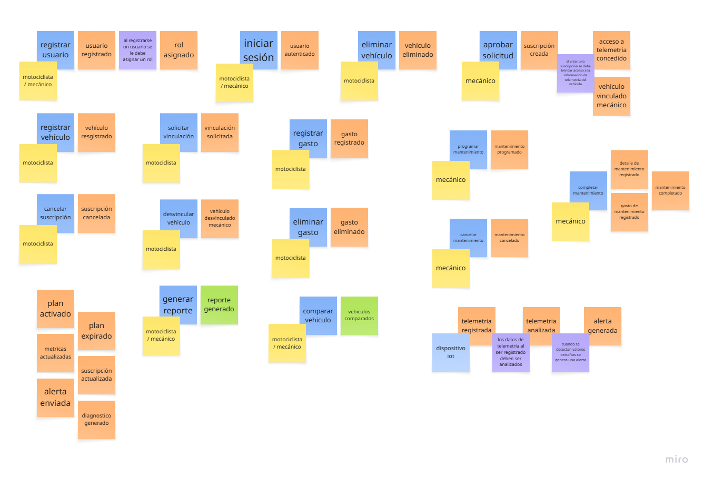

El Agregado es la decisión de diseño más importante en esta fase. Se introdujo una nota amarilla clara sobre los comandos para identificar el Agregado (la entidad transaccional, ej., Vehículo, Suscripción) que es responsable de recibir el Comando y validar las reglas de negocio antes de emitir el Evento.

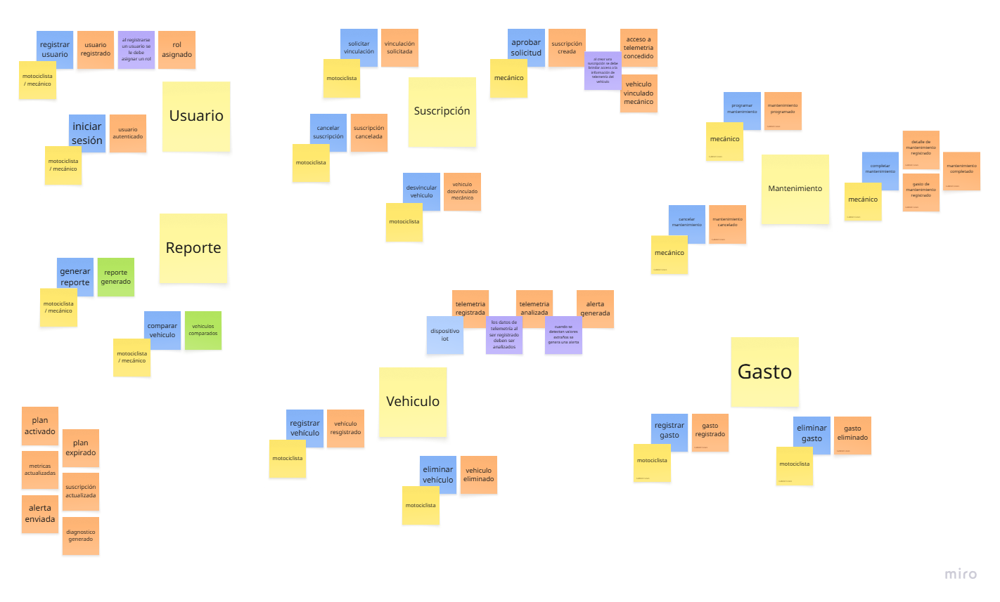

El modelo táctico se consolidó al agrupar todos los elementos alrededor de su Agregado central. Las fronteras se dibujaron para aislar el Lenguaje Ubicuo y garantizar que la consistencia del Agregado se mantenga dentro de su contexto. Este resultado final es el esquema táctico completo, que expone seis Contextos Delimitados candidatos listos para la siguiente fase de descubrimiento y diseño.

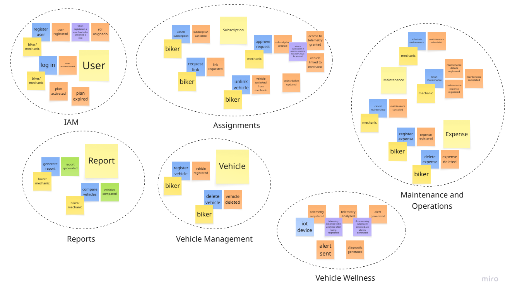

##### 4.1.1.1 Candidate Context Discovery

Una vez que se estableció el modelo táctico detallado mediante EventStorming, el siguiente paso fue aislar las fronteras de los Contextos Delimitados (Bounded Contexts/BCs). Estos BCs actúan como los límites de los futuros microservicios, asegurando que el Lenguaje Ubicuo y los Agregados de cada sección sean consistentes e inconfundibles.

El proceso se llevó a cabo utilizando una combinación de las siguientes técnicas:

Start-with-Value: Esta técnica permitió identificar los BCs Core (Núcleo), que son la fuente de valor diferenciador del negocio. Se priorizó el aislamiento de Suscripción y Bienestar del Vehículo, ya que la conexión contractual y el valor predictivo de la telemetría son la propuesta única de Bykerz.

Start-with-Simple: Se utilizó esta técnica para dividir el timeline en flujos de trabajo secuenciales, creando modelos con un propósito único. Esto llevó a la separación clara de Gestión de Vehículos de Mantenimiento y Operaciones.

Look-for-Pivotal-Events: Se buscaron los Eventos pivote que denotan un cambio en la responsabilidad, como el acceso a telemetria concedido, que actúa como el punto de transferencia de control desde el BC Suscripción hacia el BC Bienestar del Vehículo.

La agrupación se realizó encerrando todos los elementos tácticos (Comandos, Agregados, Politicas, Vistas) en contenedores de color, asegurando que cada Agregado principal reside en un único Bounded Context.

La imagen evidencia el resultado final del proceso de Candidate Context Discovery. Se lograron identificar seis Contextos Delimitados candidatos, basados en la unicidad de su Lenguaje Ubicuo y sus Agregados principales: 
1. 
2. IAM (Usuario)
2. Suscripción (Suscripción)
3. Gestión de Vehículos (Vehículo)
4. Mantenimiento y Operaciones (Mantenimiento)
5. Bienestar del Vehículo (Análisis de Telemetría)
6. Reportes (Vistas de Lectura). 

Esta clara delimitación de fronteras garantiza que los futuros equipos de desarrollo tendrán un enfoque claro en su modelo, sin dependencias internas confusas.


##### 4.1.1.2 Domain Message Flows Modeling

**Caso 1: Registro de gastos**
1. El dueño de la moto registra un gasto en la aplicación.
2. El contexto de Gestión de Vehículos recibe el evento GastoRegistrado.
3. El contexto de Historiales actualiza el historial del vehículo con el nuevo gasto.
4. El contexto de Reportes genera un reporte actualizado con el nuevo gasto.

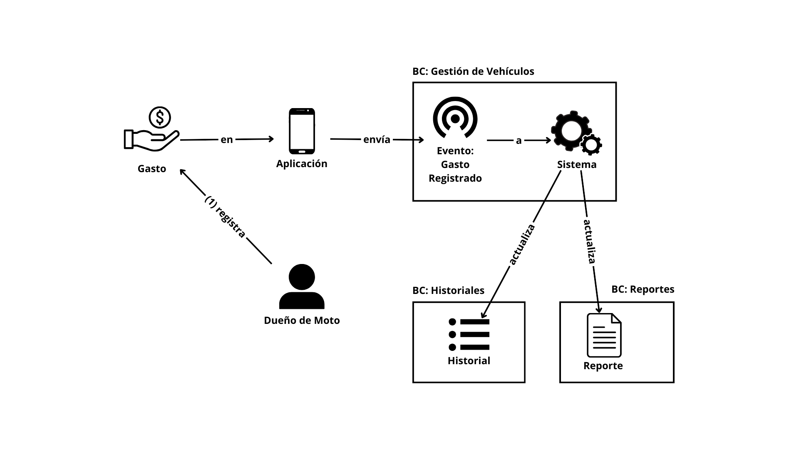

**Caso 2: Conexión entre dueño y mecánico**
1. El dueño de la moto solicita una suscripción a un mecánico.
2. El contexto de Suscripción crea una nueva suscripción y emite el evento SuscripcionCreada.
3. El contexto de Gestión de Vehículos actualiza el estado del vehículo con el nuevo mecánico asignado.
4. El contexto de Bienestar de Vehículos comienza a monitorear el vehículo bajo la nueva suscripción.
5. El Historial registra al nuevo mecánico en la cuenta del dueño.

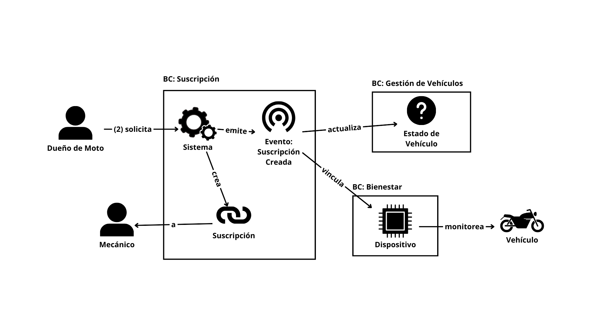

**Caso 3: Alerta preventiva de mantenimiento**
1. El contexto de Bienestar de Vehículos detecta una métrica crítica y genera el evento AlertaGenerada.
2. El contexto de Gestión de Vehículos recibe la alerta y notifica al dueño de la moto.
3. El contexto de Historiales registra la alerta en el historial del vehículo.
4. El contexto de Reportes actualiza los reportes con la nueva alerta.

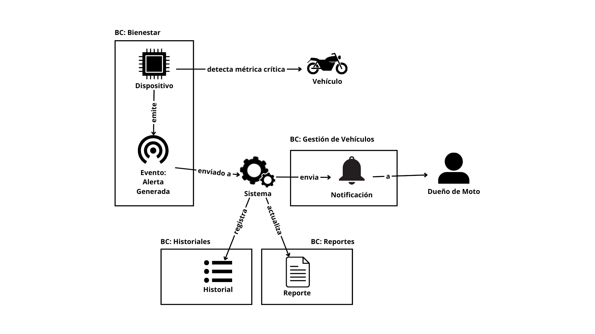

**Caso 4: Generar reporte de métricas**
1. El dueño de la moto solicita un reporte de métricas.
2. El contexto de Reportes recibe la solicitud y genera el reporte basado en las métricas actuales.
3. El contexto de Bienestar de Vehículos proporciona las métricas necesarias para el reporte.
4. El reporte es entregado al dueño de la moto.

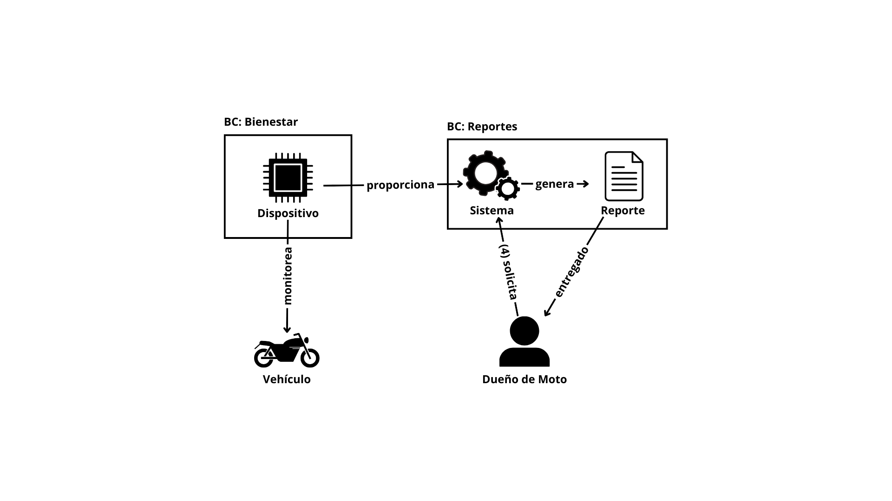

**Caso 5: Agendar servicio con mecánico**
1. El dueño de la moto agenda un servicio con su mecánico a través de la aplicación.
2. El contexto de Suscripción verifica la suscripción activa y emite el evento ServicioAgendado.
3. El contexto de Historiales registra el servicio agendado en el historial del vehículo.
4. El contexto de Gestión de Vehículos actualiza el estado del vehículo con la información del servicio.
5. El mecánico recibe la notificación del servicio agendado.

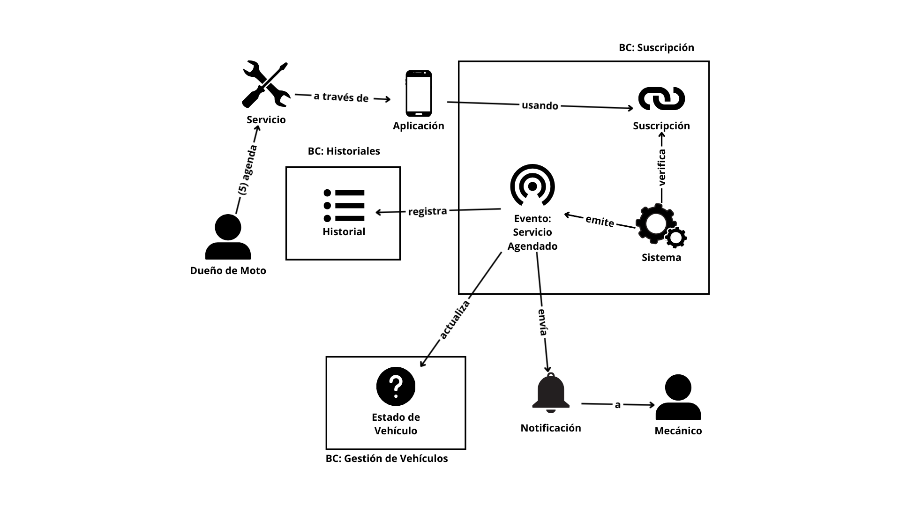

**Caso 6: Recomendación de cita**
1. El contexto de Bienestar de Vehículos detecta que una métrica ha alcanzado un umbral crítico y genera el evento RecomendacionCitaGenerada.
2. El contexto de Gestión de Vehículos recibe la recomendación y notifica al dueño de la moto.
3. El contexto de Suscripción sugiere al dueño agendar una cita con su mecánico.
4. El Historial registra la recomendación en el historial del vehículo.
5. El dueño de la moto agenda la cita a través de la aplicación.

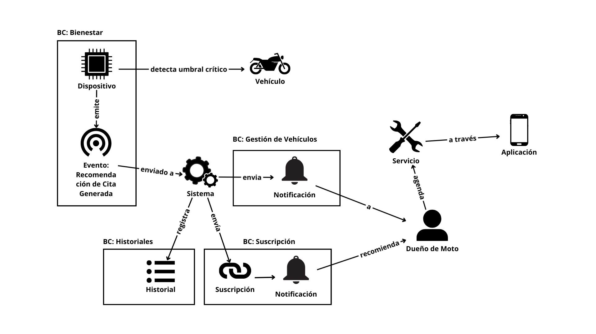

**Caso 7: Actualización de datos del vehículo**
1. El dueño de la moto actualiza los datos técnicos o de propiedad del vehículo en la aplicación.
2. El contexto de Gestión de Vehículos recibe la actualización y emite el evento DatosVehiculoActualizados.
3. El contexto de Historiales actualiza el historial del vehículo con los nuevos datos.
4. El contexto de Reportes genera un reporte actualizado con la nueva información del vehículo.
5. El contexto de Bienestar de Vehículos ajusta sus parámetros de monitoreo según los nuevos datos.

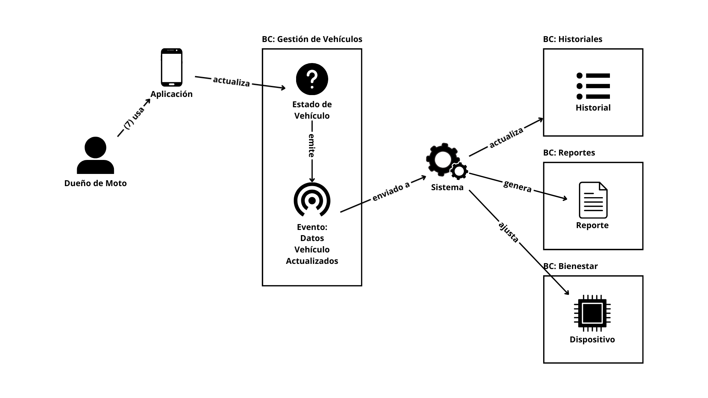

##### 4.1.1.3 Bounded Context Canvases

En esta sección se desarrollan los Bounded Context Canvases correspondientes a los contextos delimitados previamente durante el proceso de Candidate Context Discovery. El objetivo principal de este apartado es detallar, para cada contexto, los criterios de diseño que permitan comprender su propósito, límites de responsabilidad, capacidades clave, dependencias y reglas de negocio asociadas.

**IAM (Identity and Access Management)**

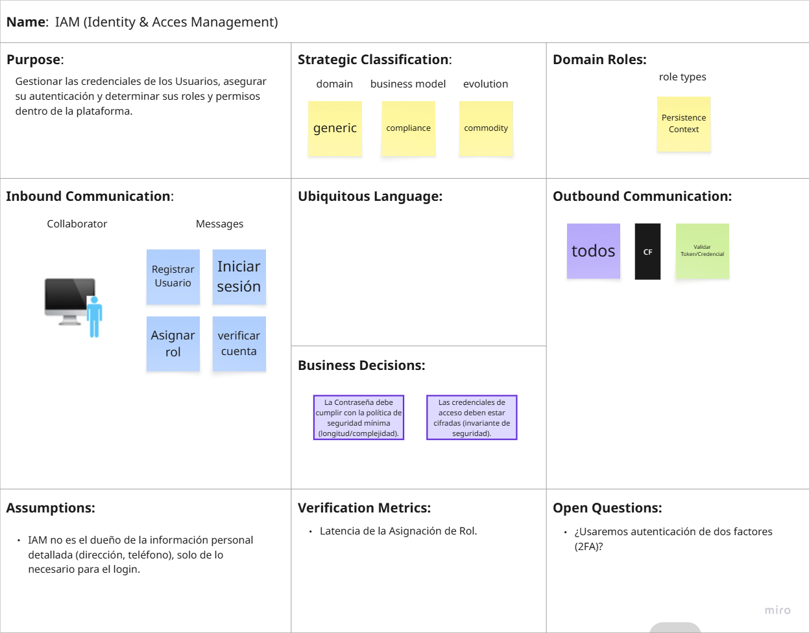

**Maintenance and Operations**

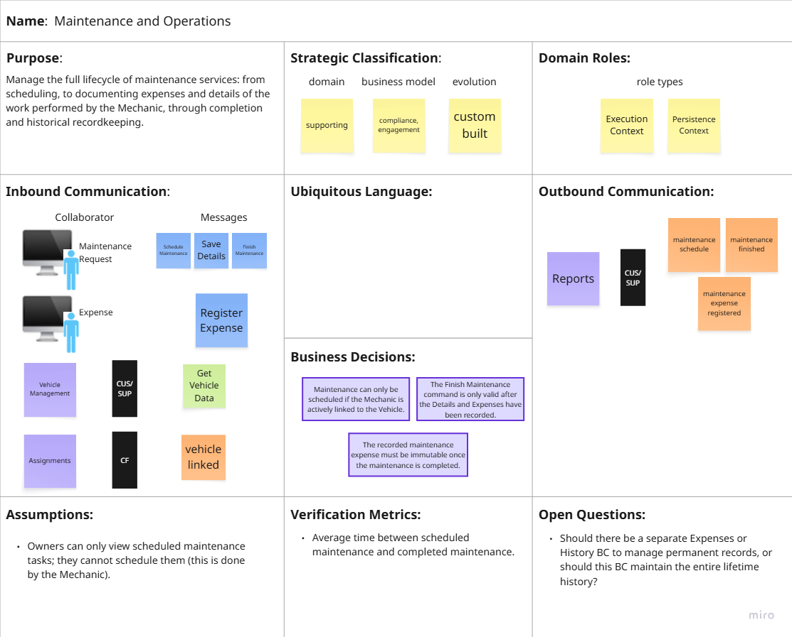

**Reports**

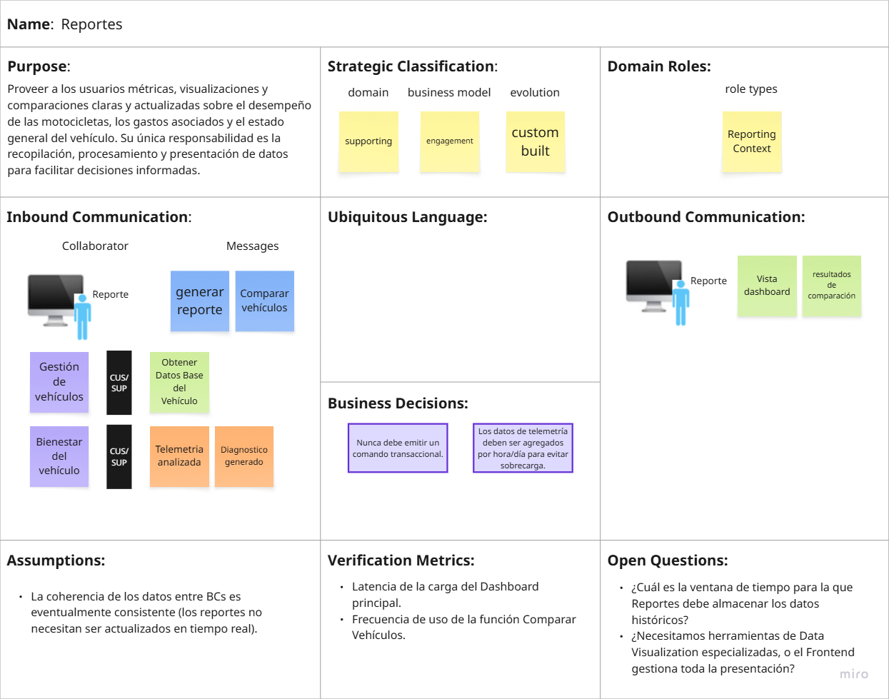

**Subscription**

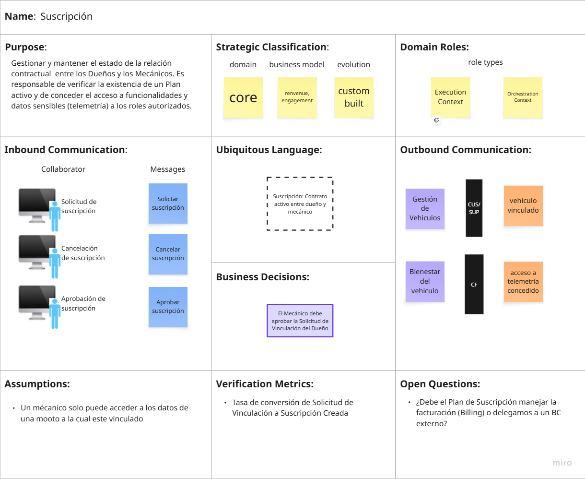

**Vehicle Management**

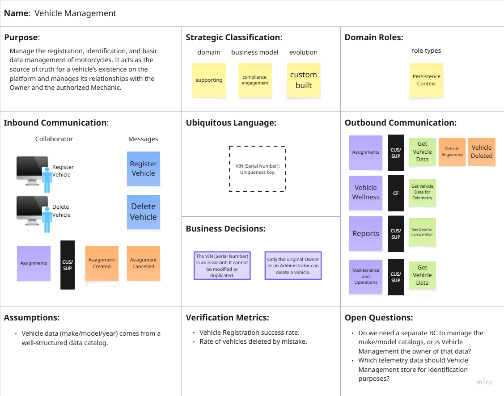

**Vehicle Wellness**

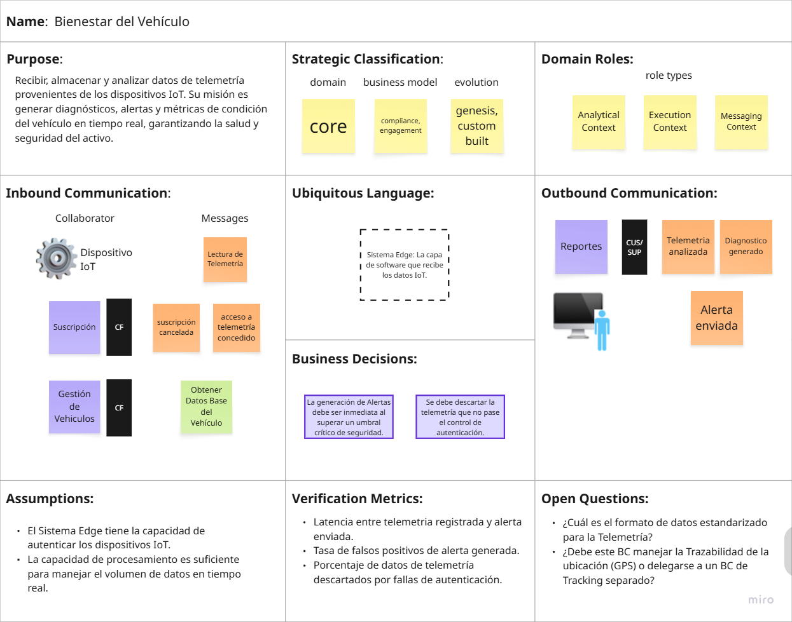

#### 4.1.2 Context Mapping

En esta sección se presenta el proceso de Context Mapping, cuyo propósito es identificar, analizar y documentar las relaciones estructurales entre los bounded contexts previamente definidos. El objetivo es comprender cómo interactúan, cuáles son sus dependencias y qué patrones de integración de Domain-Driven Design son más adecuados.

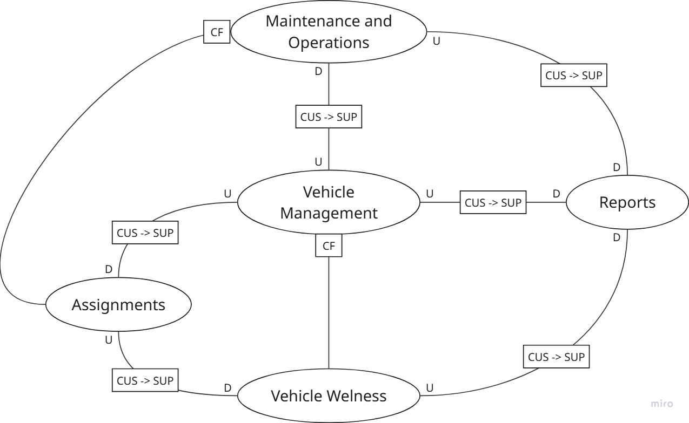

| **Contexto A**       | **Contexto B**         | **Relación (DDD)**          | **Justificación**                                                                                                  |
|----------------------|------------------------|-----------------------------|--------------------------------------------------------------------------------------------------------------------|
| Gestión de Vehículos | Bienestar de Vehículos | Customer/Supplier           | El estado de bienestar depende de la información estructural de los vehículos, como mantenimientos o revisiones.   |
| Gestión de Vehículos | Suscripción            | Customer/Supplier           | Las suscripciones requieren la información base de los vehículos para activar planes y beneficios asociados.       |
| Historiales          | Bienestar de Vehículos | Conformist                  | Historiales se adapta al modelo de Bienestar de Vehículos, siguiendo su esquema para registrar datos consistentes. |
| Historiales          | Gestión de Vehículos   | Customer/Supplier           | Los historiales se construyen a partir de la información de los vehículos, consumiendo sus datos.                  |
| Reportes             | Historiales            | Shared Kernel               | Ambos comparten datos e interpretación de eventos históricos para garantizar consistencia en los reportes.         |
| Reportes             | Suscripción            | Anti-Corruption Layer (ACL) | Se aísla el modelo de Reportes de la complejidad de Suscripción mediante una capa de traducción.                   |

#### 4.1.3 Software Architecture

La arquitectura de software de la solución se ha representado utilizando el modelo C4, el cual permite visualizar la estructura en diferentes niveles de abstracción. Se incluyen los diagramas de System Landscape, System Context y Container Level, con el fin de mostrar desde la visión global del ecosistema hasta la organización interna de la aplicación. Para su elaboración se empleó la herramienta Structurizr, que sigue los lineamientos de C4 Model.

##### 4.1.3.1 Software Architecture System Landscape Diagram

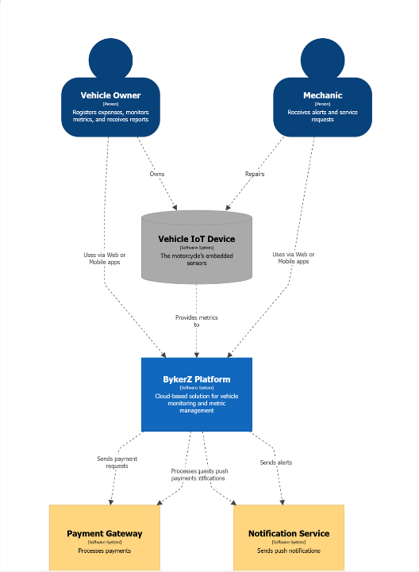

##### 4.1.3.2 Software Architecture Context Level Diagrams

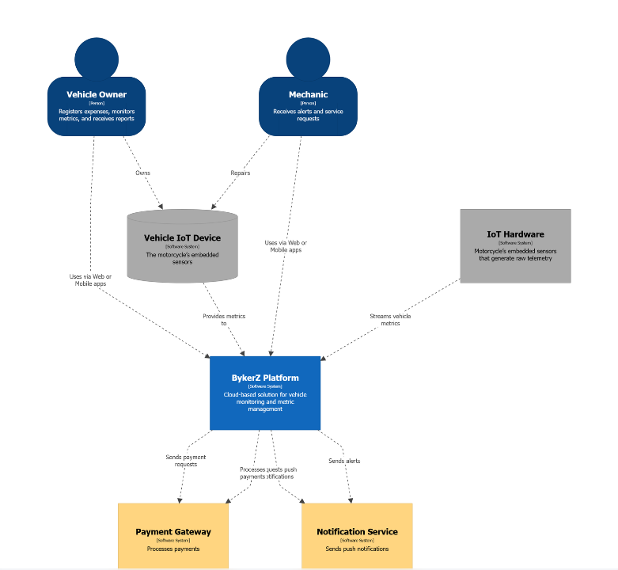

##### 4.1.3.3 Software Architecture Container Level Diagrams

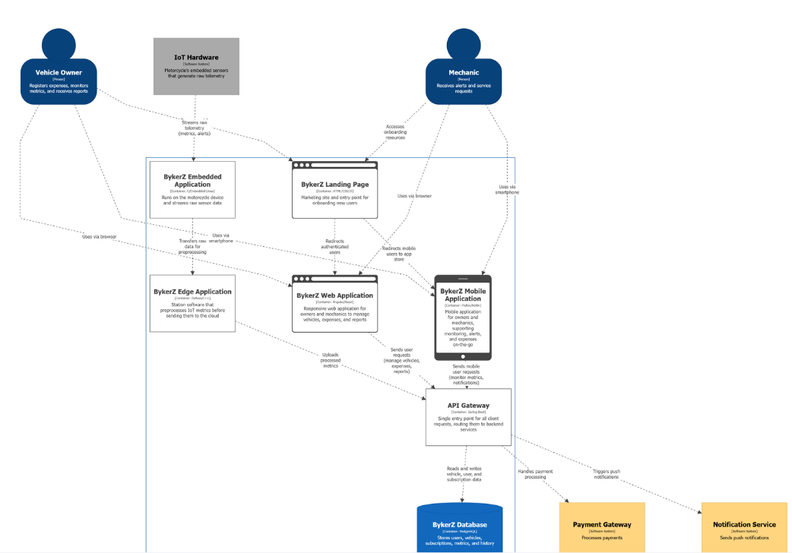

##### 4.1.3.4 Software Architecture Deployment Diagrams

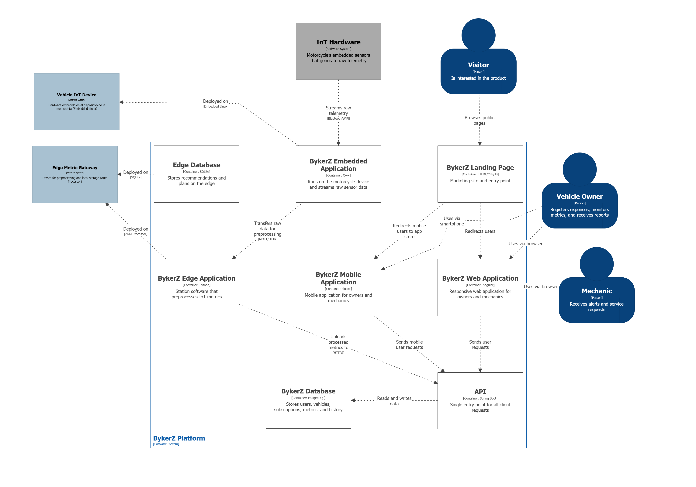

### 4.2 Tactical-Level Domain-Driven Design

#### 4.2.1 Bounded Context: Vehicle Management

##### 4.2.1.1 Domain Layer

**Aggregates**

`Owner`
**Descripción:** Representa a un dueño de moto registrado en el sistema. Contiene tanto una referencia a un profile como a los vehículos registrados a su nombre.

| Atributos           | Tipo de dato   | Visibilidad | Descripción                                |
|---------------------|----------------|-------------|--------------------------------------------|
| id                  | Long           | Private     | Identificador único del dueño de vehículo. |
| profile             | Profile        | Private     | Perfil de usuario asociado al dueño.       |
| vehicles            | List<Vehicles> | Private     | Lista de Vehículos asociados al dueño.     |

`Model`
**Descripción:** Representa un modelo de moto registrado

| Atributos     | Tipo de dato | Visibilidad | Descripción                                                   |
|---------------|--------------|-------------|---------------------------------------------------------------|
| id            | Long         | Private     | Identificador único del modelo.                               |
| name          | String       | Private     | Nombre del modelo.                                            |
| brand         | String       | Private     | Nombre de la marca a la que le pertenece el modelo.           |
| modelYear     | String       | Private     | Año en el que salió el modelo.                                |
| originCountry | String       | Private     | Nombre del país de origen del modelo.                         |
| producedAt    | Date         | Private     | Fecha de producción del modelo.                               |
| type          | String       | Private     | Tipo del modelo.                                              |
| displacement  | String       | Private     | Cilindrada del motor del modelo.                              |
| potency       | String       | Private     | Potencia máxima que puede generar el motor.                   |
| engineType    | String       | Private     | Tipo o configuración del motor del modelo.                    |
| engineTorque  | String       | Private     | Torque o fuerza de giro producida por el motor.               |
| weight        | String       | Private     | Peso total del modelo.                                        |
| transmission  | String       | Private     | Tipo de transmisión incorporada en el modelo.                 |
| brakes        | String       | Private     | Sistema de frenos con el que está equipado el modelo.         |
| tank          | String       | Private     | Capacidad del tanque de combustible del modelo.               |
| seatHeight    | String       | Private     | Altura del asiento medida desde el suelo.                     |
| consumption   | String       | Private     | Consumo promedio de combustible del modelo.                   |
| price         | Float        | Private     | Precio estimado del modelo en el mercado.                     |
| oilCapacity   | String       | Private     | Capacidad de aceite requerida por el motor del modelo.        |
| connectivity  | String       | Private     | Tecnologías o sistemas de conectividad integrados.            |
| durability    | String       | Private     | Nivel de durabilidad o resistencia del modelo.                |
| octane        | String       | Private     | Nivel de octanaje recomendado para el combustible del modelo. |


**Entities**

`Vehicle`
**Descripción:** Representa la moto registrada por el dueño en el sistema. Contiene los detalles para identificar el vehículo así como su estado actual.

| Atributos           | Tipo de dato | Visibilidad | Descripción                       |
|---------------------|--------------|-------------|-----------------------------------|
| id                  | Long         | Private     | Identificador único del vehículo. |
| owner               | Owner        | Private     | Dueño de la moto.                 |
| model               | Model        | Private     | Modelo de la moto.                |
| year                | Year         | Private     | Año de fabricación de la moto.    |
| plate               | Plate        | Private     | Placa de la moto.                 |


**Value Objects**

`Plate` (Record)

`Year` (Record)

**Commands**
* AddVehicleToOwnerCommand <<record>>
* CreateModelCommand <<record>>
* CreateOwnerCommand <<record>>
* DeleteVehicleFromOwnerCommand <<record>>
* SeedModelsCommand <<record>>
* UpdateVehicleFromOwnerCommand <<record>>

**Queries**
* GetAllBrandsQuery <<record>>
* GetAllModelsQuery <<record>>
* GetAllOwnersQuery <<record>>
* GetAllVehiclesQuery <<record>>
* GetModelByIdQuery <<record>>
* GetModelsByBrandQuery <<record>>
* GetOwnerByIdQuery <<record>>
* GetOwnerByVehicleIdQuery <<record>>
* GetVehicleByIdQuery <<record>>
* GetVehicleByPlateQuery <<record>>

**Services**
`ModelCommandService`
* handle(CreateModelCommand)
* handle(SeedModelsCommand)

`ModelQueryService`
* handle(GetAllModelsQuery)
* handle(GetModelByIdQuery)
* handle(GetModelsByBrandQuery)
* handle(GetAllBrandsQuery)

`OwnerCommandService`
* handle(CreateOwnerCommand)
* handle(AddVehicleToOwnerCommand)
* handle(UpdateVehicleFromOwnerCommand)
* handle(DeleteVehicleFromOwnerCommand)

`OwnerQueryService`
* handle(GetOwnerByIdQuery)
* handle(GetOwnerByVehicleIdQuery)
* handle(GetAllOwnersQuery)

`VehicleQueryService`
* handle(GetVehicleByIdQuery)
* handle(GetVehicleByPlateQuery)

##### 4.2.1.2 Interface Layer

**Rest Controllers**

`ModelsController`
**Descripción:** Controlador REST que maneja las operaciones relacionadas con los modelos.

| Método             | Ruta                             | Descripción                                                    |
|--------------------|----------------------------------|----------------------------------------------------------------|
| getAllModels()     | GET /api/v1/models/              | Obtiene todos los modelos registrados.                         |
| getModelById()     | GET /api/v1/models/{modelId}     | Obtiene un modelo por su identificador.                        |
| getModelsByBrand() | GET /api/v1/models/brand/{brand} | Obtiene todos los modelos de una marca específica.             |
| getAllBrands()     | GET /api/v1/models/brands        | Obtiene todas las marcas presentes en los modelos registrados. |

`OwnersController`
**Descripción:** Controlador REST que maneja las operaciones relacionadas con los dueños.

| Método                | Ruta                                   | Descripción                                          |
|-----------------------|----------------------------------------|------------------------------------------------------|
| getAllOwners()        | GET /api/v1/owners/                    | Obtiene todos los dueños de vehículos registrados.   |
| getOwnerByVehicleId() | GET /api/v1/owners/vehicle/{vehicleId} | Obtiene el dueño de un vehículo por su identificador |
| createOwner()         | POST /api/v1/owners                    | Crea un dueño de vehículo.                           |

`VehiclesController`
**Descripción:** Controlador REST que maneja las operaciones relacionadas con los vehículos.

| Método                 | Ruta                                | Descripción                                            |
|------------------------|-------------------------------------|--------------------------------------------------------|
| getVehiclesByOwnerId() | GET /api/v1/vehicles/               | Obtiene todos los vehículos registrados bajo un dueño. |
| getVehicleById()       | GET /api/v1/vehicles/{vehicleId}    | Obtiene un vehículo por su identificador.              |
| addVehicleToOwner()    | POST /api/v1/vehicles/{ownerId}     | Añade un vehículo a un dueño.                          |
| deleteVehicleById()    | DELETE /api/v1/vehicles/{vehicleId} | Elimina un vehículo de un dueño.                       |

**Resources**
* AddVehicleResource <<record>>
* CreateModelResource <<record>>
* CreateOwnerResource <<record>>
* ModelResource <<record>>
* OwnerResource <<record>>
* VehicleResource <<record>>

**Assemblers**
* AddVehicleCommandFromResourceAssembler
* CreateModelCommandFromResourceAssembler
* CreateOwnerCommandFromResourceAssembler
* ModelResourceFromEntityAssembler
* OwnerResourceFromEntityAssembler
* VehicleResourceFromEntityAssembler

##### 4.2.1.3 Application Layer

`ModelCommandService`
**Descripción:** Implementación del servicio de comandos para la gestión de modelos.

| Método                     | Descripción                                |
|----------------------------|--------------------------------------------|
| handle(CreateModelCommand) | Crea un nuevo modelo.                      |
| handle(SeedModelsCommand)  | Crea los modelos al iniciar la aplicación. |

`ModelQueryService`
**Descripción:** Implementación del servicio de consultas para la gestión de modelos.

| Método                        | Descripción                                                        |
|-------------------------------|--------------------------------------------------------------------|
| handle(GetAllModelsQuery)     | Obtiene todos los modelos registrados.                             |
| handle(GetModelByIdQuery)     | Obtiene un modelo por su identificador.                            |
| handle(GetModelsByBrandQuery) | Obtiene todos los modelos de una marca específica.                 |
| handle(GetAllBrandsQuery)     | Obtiene todas las marcas existentes entre los modelos del sistema. |

`OwnerCommandService`
**Descripción:** Implementación del servicio de comandos para la gestión de dueños.

| Método                                | Descripción                          |
|---------------------------------------|--------------------------------------|
| handle(CreateOwnerCommand)            | Crea un nuevo dueño de moto.         |
| handle(AddVehicleToOwnerCommand)      | Añade un vehículo nuevo al dueño.    |
| handle(UpdateVehicleFromOwnerCommand) | Actualiza un vehículo para su dueño. |
| handle(DeleteVehicleFromOwnerCommand) | Elimina un vehículo de un dueño.     |

`OwnerQueryService`
**Descripción:** Implementación del servicio de consultas para la gestión de dueños.

| Método                           | Descripción                                                         |
|----------------------------------|---------------------------------------------------------------------|
| handle(GetOwnerByIdQuery)        | Obtiene un dueño por su identificador.                              |
| handle(GetOwnerByVehicleIdQuery) | Obtiene un dueño a través del identificador de uno de sus vehículos |
| handle(GetAllOwnersQuery)        | Obtiene todos los dueños registrados.                               |

`VehicleQueryServiceImpl`
**Descripción:** Implementación del servicio de consultas para la gestión de vehículos.

| Método                         | Descripción                       |
|--------------------------------|-----------------------------------|
| handle(GetVehicleByIdQuery)    | Obtiene un vehículo por su ID.    |
| handle(GetVehicleByPlateQuery) | Obtiene un vehículo por su placa. |

##### 4.2.1.4 Infrastructure Layer

`OwnerRepository`
**Descripción:** Interfaz de persistencia para operaciones CRUD y consultas de datos de dueños.

| Método                 | Tipo de Retorno | Descripción                                  |
|------------------------|-----------------|----------------------------------------------|
| findOwnerByProfile_Id  | Optional<Owner> | Encuentra un dueño por su id de perfil.      |
| findOwnerByVehicles_Id | Optional<Owner> | Encuentra un Owner por uno de sus vehículos. |

`ModelRepository`
**Descripción:** Interfaz de persistencia para operaciones CRUD y consultas de datos de modelos.

| Método        | Tipo de Retorno | Descripción                                          |
|---------------|-----------------|------------------------------------------------------|
| existsByName  | boolean         | Valida la existencia de un modelo por su nombre.     |
| findByBrand   | List<Model>     | Encuentra los modelos bajo una marca específica.     |
| findAllBrands | List<String>    | Encuentra todas las marcas presentes en los modelos. |

`VehicleReadRepositories`
**Descripción:** Interfaz de persistencia para operaciones de lectura de vehículos.

| Método                 | Tipo de Retorno | Descripción                                  |
|------------------------|-----------------|----------------------------------------------|
| findOwnerByProfile_Id  | Optional<Owner> | Encuentra un dueño por su id de perfil.      |
| findOwnerByVehicles_Id | Optional<Owner> | Encuentra un Owner por uno de sus vehículos. |

##### 4.2.1.5 Bounded Context Software Architecture Component Level Diagrams

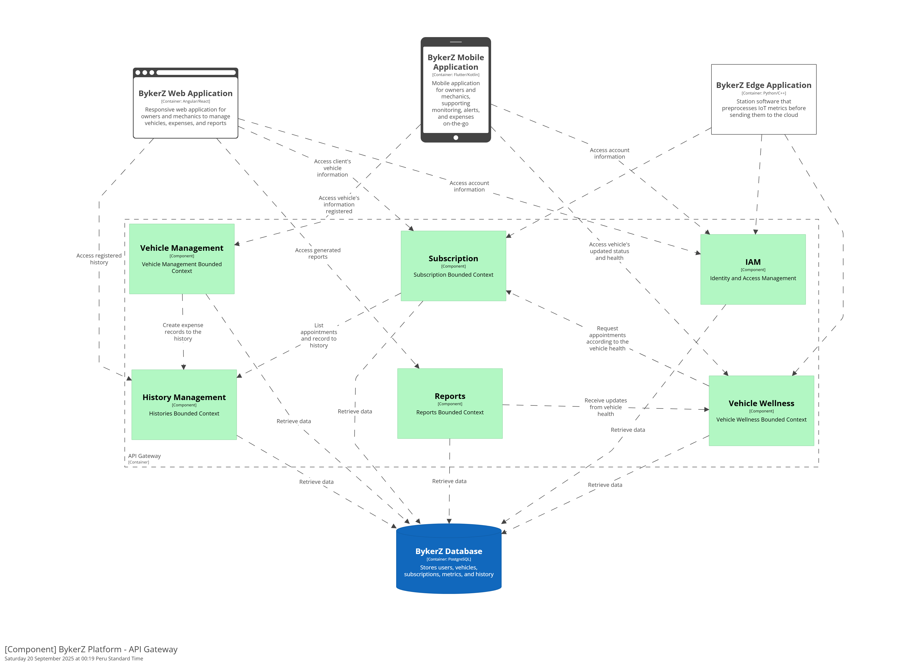

##### 4.2.1.6 Bounded Context Software Architecture Code Level Diagrams

###### 4.2.1.6.1 Bounded Context Domain Layer Class Diagrams


###### 4.2.1.6.2 Bounded Context Database Design Diagram


#### 4.2.2 Bounded Context: Maintenance

##### 4.2.2.1 Domain Layer

**Aggregates**

`Expense`
**Descripción:** Representa un gasto registrado en el sistema, el cual puede ser de tipo personal o de mantenimiento. Agrupa los ítems del gasto y su clasificación.

| Atributos    | Tipo de dato      | Visibilidad | Descripción                                  |
|--------------|-------------------|-------------|----------------------------------------------|
| id           | Long              | Private     | Identificador único del gasto.               |
| name         | String            | Private     | Nombre o concepto del gasto.                 |
| finalPrice   | Double            | Private     | Precio final acumulado del gasto.            |
| userId       | Long              | Private     | Identificador del usuario creador del gasto. |
| expenseItems | List<ExpenseItem> | Private     | Lista de ítems detallados del gasto.         |
| expenseType  | ExpenseType       | Private     | Clasificación del tipo de gasto.             |

`Maintenance`
**Descripción:** Representa una actividad de mantenimiento (preventivo o correctivo) realizada sobre un vehículo. Gestiona el estado, la asignación de gastos y el mecánico responsable.

| Atributos          | Tipo de dato     | Visibilidad | Descripción                                        |
|--------------------|------------------|-------------|----------------------------------------------------|
| id                 | Long             | Private     | Identificador único del mantenimiento.             |
| details            | String           | Private     | Detalles breves del servicio.                      |
| vehicleId          | Long             | Private     | Identificador del vehículo asociado.               |
| dateOfService      | Date             | Private     | Fecha en la que se realiza el servicio.            |
| location           | String           | Private     | Ubicación o taller donde se realiza el servicio.   |
| description        | String           | Private     | Descripción detallada del trabajo.                 |
| maintenanceExpense | Expense          | Private     | Gasto asociado al mantenimiento (opcional).        |
| state              | MaintenanceState | Private     | Estado actual del proceso de mantenimiento.        |
| mechanicId         | Long             | Private     | Identificador del mecánico asignado al servicio.   |

**Entities**

`ExpenseItem`
**Descripción:** Representa un ítem individual dentro de un registro de gasto, detallando costos unitarios y totales.

| Atributos  | Tipo de dato | Visibilidad | Descripción                             |
|------------|--------------|-------------|-----------------------------------------|
| id         | Long         | Private     | Identificador único del ítem.           |
| name       | String       | Private     | Nombre del ítem.                        |
| amount     | Integer      | Private     | Cantidad de unidades.                   |
| unitPrice  | Double       | Private     | Precio por unidad.                      |
| totalPrice | Double       | Private     | Precio total (cantidad * unitario).     |
| expense    | Expense      | Private     | Gasto al que pertenece este ítem.       |
| itemType   | ItemType     | Private     | Categoría del ítem (Multa, herramientas, etc.). |

`ExpenseType`, `ItemType`, `MaintenanceState` (Entidades de catálogo)

**Value Objects**

`ExpenseTypes` (Enum: PERSONAL, MAINTENANCE)
`ItemTypes` (Enum: FINE, PARKING, PAYMENT, SUPPLIES, TAX, TOOLS)
`MaintenanceStates` (Enum: PENDING, IN_PROGRESS, COMPLETED, CANCELLED)

**Commands**
* AddExpenseItemCommand <<record>>
* AssignExpenseToMaintenanceCommand <<record>>
* CreateExpenseByOwnerIdCommand <<record>>
* CreateExpenseCommand <<record>>
* CreateMaintenanceCommand <<record>>
* DeleteExpenseCommand <<record>>
* DeleteExpenseItemsByExpenseIdCommand <<record>>
* DeleteMaintenanceCommand <<record>>
* SeedExpenseTypesCommand <<record>>
* SeedItemTypesCommand <<record>>
* SeedMaintenanceStatesCommand <<record>>
* UpdateStateOfMaintenanceByIdCommand <<record>>

**Queries**
* GetAllExpenseItemsByExpenseIdQuery <<record>>
* GetAllExpensesByUserIdQuery <<record>>
* GetAllMaintenancesByMechanicIdQuery <<record>>
* GetAllMaintenancesByVehicleIdQuery <<record>>
* GetExpenseByIdQuery <<record>>
* GetMaintenanceByIdQuery <<record>>
* GetMaintenancesByOwnerIdQuery <<record>>

**Services**

`ExpenseCommandService`
* handle(CreateExpenseCommand)
* handle(CreateExpenseByOwnerIdCommand)
* handle(DeleteExpenseCommand)

`ExpenseItemCommandService`
* handle(AddExpenseItemCommand)
* handle(DeleteExpenseItemsByExpenseIdCommand)

`ExpenseQueryService`
* handle(GetAllExpensesByUserIdQuery)
* handle(GetExpenseByIdQuery)

`MaintenanceCommandService`
* handle(CreateMaintenanceCommand)
* handle(DeleteMaintenanceCommand)
* handle(AssignExpenseToMaintenanceCommand)
* handle(UpdateStateOfMaintenanceByIdCommand)

`MaintenanceQueryService`
* handle(GetAllMaintenancesByVehicleIdQuery)
* handle(GetMaintenanceByIdQuery)
* handle(GetAllMaintenancesByMechanicIdQuery)
* handle(GetMaintenancesByOwnerIdQuery)

`SeedServices` (Agrupación lógica)
* ExpenseTypeCommandService.handle(SeedExpenseTypesCommand)
* ItemTypeCommandService.handle(SeedItemTypesCommand)
* MaintenanceStateCommandService.handle(SeedMaintenanceStatesCommand)

##### 4.2.2.2 Interface Layer

**Rest Controllers**

`ExpenseController`
**Descripción:** Controlador REST que maneja las operaciones relacionadas con la gestión de gastos y sus ítems.

| Método                 | Ruta                                  | Descripción                                            |
|------------------------|---------------------------------------|--------------------------------------------------------|
| getAllExpenses()       | GET /api/v1/expense                   | Obtiene todos los gastos del usuario autenticado.      |
| createExpenseByOwnerId()| POST /api/v1/expense/owner/{ownerId} | Crea un gasto asociado a un dueño específico.          |
| createExpense()        | POST /api/v1/expense/{userId}         | Crea un nuevo gasto para un usuario.                   |
| getExpense()           | GET /api/v1/expense/{expenseId}       | Obtiene el detalle de un gasto por su ID.              |
| deleteExpense()        | DELETE /api/v1/expense/{expenseId}    | Elimina un gasto existente.                            |

`MaintenanceController`
**Descripción:** Controlador REST que maneja las operaciones del ciclo de vida de los mantenimientos.

| Método                      | Ruta                                                       | Descripción                                                       |
|-----------------------------|------------------------------------------------------------|-------------------------------------------------------------------|
| getMaintenanceById()        | GET /api/v1/maintenance/{maintenanceId}                    | Obtiene un mantenimiento por su identificador.                    |
| getMaintenancesByUserId()   | GET /api/v1/maintenance/vehicle/{vehicleId}                | Obtiene los mantenimientos asociados a un vehículo.               |
| getMaintenancesByOwnerId()  | GET /api/v1/maintenance/owner/{ownerId}                    | Obtiene los mantenimientos de todos los vehículos de un dueño.    |
| deleteMaintenanceById()     | DELETE /api/v1/maintenance/{maintenanceId}                 | Elimina un registro de mantenimiento.                             |
| createMaintenance()         | POST /api/v1/maintenance                                   | Registra un nuevo mantenimiento.                                  |
| updateMaintenanceStatusById()| PUT /api/v1/maintenance/{maintenanceId}                   | Actualiza el estado de un mantenimiento.                          |
| assignExpenseToMaintenance()| PUT /api/v1/maintenance/{maintenanceId}/expense/assign/{id}| Asigna un gasto existente a un mantenimiento.                     |
| getMaintenancesByMechanicId()| GET /api/v1/maintenance/mechanic/{mechanicId}             | Obtiene los mantenimientos asignados a un mecánico.               |

**Resources**
* CreateExpenseResource <<record>>
* ExpenseResource <<record>>
* CreateMaintenanceResource <<record>>
* MaintenanceResource <<record>>
* UpdateStatusOfMaintenanceResource <<record>>

**Assemblers**
* ExpenseResourceFromEntityAssembler
* MaintenanceResourceFromEntityAssembler
* CreateMaintenanceCommandFromResourceAssembler

##### 4.2.2.3 Application Layer

`ExpenseCommandServiceImpl`
**Descripción:** Implementación del servicio de comandos para la gestión de gastos.

| Método                               | Descripción                                                  |
|--------------------------------------|--------------------------------------------------------------|
| handle(CreateExpenseCommand)         | Crea un gasto validando la existencia del usuario.           |
| handle(CreateExpenseByOwnerIdCommand)| Crea un gasto a partir del ID de un dueño, resolviendo su usuario.|
| handle(DeleteExpenseCommand)         | Elimina un gasto por su ID.                                  |

`ExpenseQueryServiceImpl`
**Descripción:** Implementación del servicio de consultas para gastos.

| Método                              | Descripción                                      |
|-------------------------------------|--------------------------------------------------|
| handle(GetAllExpensesByUserIdQuery) | Recupera todos los gastos de un usuario.         |
| handle(GetExpenseByIdQuery)         | Recupera un gasto específico por su ID.          |

`ExpenseItemCommandServiceImpl`
**Descripción:** Implementación para la gestión de ítems dentro de los gastos.

| Método                                      | Descripción                                      |
|---------------------------------------------|--------------------------------------------------|
| handle(AddExpenseItemCommand)               | Agrega un nuevo ítem a un gasto existente.       |
| handle(DeleteExpenseItemsByExpenseIdCommand)| Elimina todos los ítems asociados a un gasto.    |

`MaintenanceCommandServiceImpl`
**Descripción:** Implementación del servicio de comandos para el ciclo de vida del mantenimiento.

| Método                                     | Descripción                                                           |
|--------------------------------------------|-----------------------------------------------------------------------|
| handle(CreateMaintenanceCommand)           | Crea un mantenimiento validando el vehículo y estado inicial PENDING. |
| handle(DeleteMaintenanceCommand)           | Elimina un mantenimiento y su gasto asociado si existe.               |
| handle(AssignExpenseToMaintenanceCommand)  | Asocia un registro de gasto a un mantenimiento.                       |
| handle(UpdateStateOfMaintenanceByIdCommand)| Actualiza el estado (e.j. IN_PROGRESS, COMPLETED) del mantenimiento.  |

`MaintenanceQueryServiceImpl`
**Descripción:** Implementación del servicio de consultas para mantenimientos.

| Método                                      | Descripción                                                      |
|---------------------------------------------|------------------------------------------------------------------|
| handle(GetAllMaintenancesByVehicleIdQuery)  | Obtiene el historial de mantenimientos de un vehículo.           |
| handle(GetMaintenanceByIdQuery)             | Obtiene el detalle de un mantenimiento específico.               |
| handle(GetAllMaintenancesByMechanicIdQuery) | Lista los mantenimientos asignados a un mecánico.                |
| handle(GetMaintenancesByOwnerIdQuery)       | Lista los mantenimientos de todos los vehículos de un dueño.     |

`MaintenanceApplicationReadyEventHandler`
**Descripción:** Manejador de eventos de inicio de aplicación para la carga de datos semilla (Seeders).

| Método             | Descripción                                                                 |
|--------------------|-----------------------------------------------------------------------------|
| onApplicationReady | Ejecuta los comandos de Seed para Tipos de Gasto, Items y Estados de Mant.  |

##### 4.2.2.4 Infrastructure Layer

`ExpenseRepository`
**Descripción:** Interfaz de persistencia para la entidad Expense.

| Método       | Tipo de Retorno | Descripción                                    |
|--------------|-----------------|------------------------------------------------|
| findByUserId | List<Expense>   | Encuentra todos los gastos de un usuario.      |

`ExpenseItemRepository`
**Descripción:** Interfaz de persistencia para los ítems de gasto.

| Método                         | Tipo de Retorno | Descripción                                      |
|--------------------------------|-----------------|--------------------------------------------------|
| deleteExpenseItemsByExpense_Id | void            | Elimina todos los ítems de un ID de gasto dado.  |

`MaintenanceRepository`
**Descripción:** Interfaz de persistencia para la entidad Maintenance.

| Método            | Tipo de Retorno   | Descripción                                                |
|-------------------|-------------------|------------------------------------------------------------|
| findByVehicleId   | List<Maintenance> | Encuentra mantenimientos por ID de vehículo.               |
| findByMechanicId  | List<Maintenance> | Encuentra mantenimientos asignados a un mecánico.          |
| findByVehicleIdIn | List<Maintenance> | Encuentra mantenimientos para una lista de IDs de vehículo.|

`MaintenanceStateRepository`, `ExpenseTypeRepository`, `ItemTypeRepository`
**Descripción:** Repositorios de catálogo para validar existencia de tipos y estados.

| Método       | Tipo de Retorno | Descripción                                  |
|--------------|-----------------|----------------------------------------------|
| existsByName | boolean         | Valida si ya existe el tipo o estado en BD.  |

##### 4.2.2.5 Bounded Context Software Architecture Component Level Diagrams


##### 4.2.2.6 Bounded Context Software Architecture Code Level Diagrams

###### 4.2.2.6.1 Bounded Context Domain Layer Class Diagrams


###### 4.2.2.6.2 Bounded Context Database Design Diagram


#### 4.2.3 Bounded Context: Assignments

##### 4.2.3.1 Domain Layer

**Aggregates**

`Assignment`
**Descripción:** Representa una asignación (relación) entre un mecánico y un dueño de motocicleta

| Atributos      | Tipo de dato     | Visibilidad | Descripción                            |
|----------------|------------------|-------------|----------------------------------------|
| ownerId        | Long             | Private     | Identificador único del dueño asignado |
| mechanic       | Mechanic         | Private     | Mecanico asignado                      |
| status         | AssignmentStatus | Private     | Estado de la asignación                |
| type           | AssignmentType   | Private     | Tipo de asignación                     |
| assignmentCode | AssignmentCode   | Private     | Código único de la asignación          |

`Mechanic`
**Descripción:** Representa al mecánico en el sistema

| Atributos   | Tipo de dato     | Visibilidad | Descripción           |
|-------------|------------------|-------------|-----------------------|
| profile     | Profile          | Private     | Perfil del mecánico   |
| assignments | List<Assignment> | Private     | Lista de asignaciones |

**Value Objects**

`AssignmentStatus`(Enum)
* ACTIVE
* PENDING
* CANCELLED

`AssignmentType`(Enum)
* UNCATEGORIZED
* REGULAR
* FREQUENT
* BUSINESS

`AssignmentCode`(Record)

**Commands**
* AssignOwnerToAssignmentCommand <<record>>
* CreateAssignmentCommand <<record>>
* CreateMechanicCommand <<record>>
* DeleteAssignmentCommand <<record>>
* UpdateAssignmentStatusCommand <<record>>
* UpdateAssignmentTypeCommand <<record>>

**Queries**
* GetAssigmentByCodeQuery <<record>>
* GetAssignmentByIdQuery <<record>>
* GetAssignmentByOwnerIdQuery <<record>>
* GetAssignmentsByMechanicIdAndStatusQuery <<record>>
* GetMechanicByIdQuery <<record>>

**Services**

`AssignmentCommandService`(Interface)
* handle(CreateAssignmentCommand)
* handle(UpdateAssignmentStatusCommand)
* handle(UpdateAssignmentTypeCommand)
* handle(AssignOwnerToAssignmentCommand)
* handle(DeleteAssignmentCommand)

`AssignmentQueryService`(Interface)
* handle(GetAssignmentByOwnerIdQuery)
* handle(GetAssignmentsByMechanicIdAndStatusQuery)
* handle(GetAssignmentByIdQuery)
* handle(GetAssigmentByCodeQuery)

`MechanicCommandService`(Interface)
* handle(CreateMechanicCommand)

`MechanicQueryService`(Interface)
* handle(GetMechanicByIdQuery)

##### 4.2.3.2 Interface Layer

**Rest Controllers**

`AssignmentController`

| Método                  | Ruta                                                             | Descripción                                                                         |
|-------------------------|------------------------------------------------------------------|-------------------------------------------------------------------------------------|
| updateAssignmentStatus  | /api/v1/assignments/{assignmentId}/status                        | Actualiza el estado de una asignación por su id                                     |
| updateAssignmentType    | /api/v1/assignments/{assignmentId}/type                          | Actualiza el tipo de una asignación por su id                                       |
| getAssignmentById       | /api/v1/assignments/{assignmentId}                               | Devuelve una asignación por su id                                                   |
| assignOwnerToAssignment | /api/v1/assignments/code/{assignmentCode}/assign-owner/{ownerId} | Vincula un dueño con una asignación mediante un codigo de asignación y id del dueño |
| deleteAssignment        | /api/v1/assignments/{assignmentId}                               | Elimina una asignación por su id                                                    |
| getAssignmentByCode     | /api/v1/assignments/code/{assignmentCode}                        | Devuelve una asignación por su código                                               |

`MechanicAssigmentController`

| Método           | Ruta                                               | Descripción                                                      |
|------------------|----------------------------------------------------|------------------------------------------------------------------|
| getAssignments   | /api/v1/mechanic/{mechanicId}/assignments/{status} | Obtiene todas las asignaciones asociadas a un mecánico por su id |
| createAssignment | /api/v1/mechanic/{mechanicId}/assignments          | Crea una asignacion y la asocia a un mecánico por su id          |

`MechanicController`

| Método               | Ruta             | Descripción                                                             |
|----------------------|------------------|-------------------------------------------------------------------------|
| getOwnersForMechanic | /api/v1/mechanic | Obtiene todos los dueños vinculados a un mecánico por alguna asignación |

`OwnerAssigmentController`

| Método        | Ruta                               | Descripción                                           |
|---------------|------------------------------------|-------------------------------------------------------|
| getAssignment | /api/v1/owner/{ownerId}/assignment | Obtiene la asignación asociada con un dueño por su id |

**Resources**
* AssignmentResource <<record>>
* MechanicResource <<record>>
* UpdateAssignmentStatusResource <<record>>
* UpdateAssignmentTypeResource <<record>>

**Assemblers**
* AssignmentResourceFromEntityAssembler
* CreateAssigmentCommandAssembler
* MechanicResourceFromEntityAssembler
* UpdateAssignmentStatusCommandFromResourceAssembler
* UpdateAssignmentTypeCommandFromResourceAssembler

##### 4.2.3.3 Application Layer

`AssignmentCommandServiceImpl`

| Método                                 | Descripción                           |
|----------------------------------------|---------------------------------------|
| handle(CreateAssignmentCommand)        | Crea una asignación                   |
| handle(UpdateAssignmentStatusCommand)  | Actualiza el estado de una asignación |
| handle(UpdateAssignmentTypeCommand)    | Actualiza el tipo de una asignación   |
| handle(AssignOwnerToAssignmentCommand) | Asigna un dueño a una asignación      |
| handle(DeleteAssignmentCommand)        | Elimina un asignación                 |

`AssignmentQueryServiceImpl`

| Método                                           | Descripción                                                           |
|--------------------------------------------------|-----------------------------------------------------------------------|
| handle(GetAssignmentByOwnerIdQuery)              | Obtiene una asignación por el id del dueño                            |
| handle(GetAssignmentsByMechanicIdAndStatusQuery) | Obtiene las asignaciones por id de mecánico y estado de la asignación |
| handle(GetAssignmentByIdQuery)                   | Obtiene una asignación por su id                                      |
| handle(GetAssigmentByCodeQuery)                  | Obtiene una asignación por su código de asignación                    |

`MechanicCommandServiceImpl`

| Método                        | Descripción      |
|-------------------------------|------------------|
| handle(CreateMechanicCommand) | Crea un mecánico |

`MechanicQueryServiceImpl`

| Método                       | Descripción                   |
|------------------------------|-------------------------------|
| handle(GetMechanicByIdQuery) | Obtiene un mecánico por su id |

##### 4.2.3.4 Infrastructure Layer

`AssignmentRepository`(interface)

| Método                                         | Tipo de Retorno      | Descripción                                                                                                                |
|------------------------------------------------|----------------------|----------------------------------------------------------------------------------------------------------------------------|
| findByOwnerIdAndStatus                         | Optional<Assignment> | Encuentra una asignación por el id del dueño y el estado                                                                   |
| findByMechanic_IdAndStatusOrderByCreatedAtDesc | List<Assignment>     | Encuentra las asignaciones por el id del mecánico, el estado y las ordena de manera descendente según la fecha de creación |
| existsByAssignmentCode                         | boolean              | Valida la existencia una asignación por código                                                                             |
| existsByOwnerIdAndIdNotAndStatusNot            | boolean              | Valida la no existencia de una asignación por id de dueño y estado de asignación                                           |
| findByAssignmentCode                           | Optional<Assignment> | Encuentra una asignación por su código                                                                                     |

`MechanicRepository`(interface)

| Método                  | Tipo de Retorno    | Descripción                               |
|-------------------------|--------------------|-------------------------------------------|
| getMechanicByProfile_Id | Optional<Mechanic> | Encuentra un mecánico por id de su perfil |

##### 4.2.3.5 Bounded Context Software Architecture Component Level Diagrams


##### 4.2.3.6 Bounded Context Software Architecture Code Level Diagrams

###### 4.2.3.6.1 Bounded Context Domain Layer Class Diagrams


###### 4.2.3.6.2 Bounded Context Database Design Diagram


#### 4.2.4 Bounded Context: Vehicle Wellness

##### 4.2.4.1 Domain Layer

<h3>Aggregates</h3>
<h4><code>WellnessMetric</code></h4>
<p><strong>Descripción:</strong>Representa una métrica completa de bienestar registrada por un vehículo.</p>
<table>
  <thead>
    <tr><th>Atributo</th><th>Tipo</th><th>Descripción</th></tr>
  </thead>
  <tbody>
    <tr><td>vehicleId</td><td>Long</td><td>Identificador único del vehículo que registra la métrica</td></tr>
    <tr><td>coordinates</td><td>Coordinates (Enum)</td><td>Ubicación geográfica donde se tomó la medición</td></tr>
    <tr><td>airQuality</td><td>AirQuality (Enum)</td><td>Medición de la calidad del aire en el entorno</td></tr>
    <tr><td>environmentalConditions</td><td>EnvironmentalConditions (Enum)</td><td>Condiciones ambientales generales registradas</td></tr>
    <tr><td>atmosphericPressure</td><td>AtmosphericPressure (Enum)</td><td>Nivel de presión atmosférica medido</td></tr>
    <tr><td>statusImpact</td><td>StatusImpact (Enum)</td><td>Indicador del impacto en el estado del sistema</td></tr>
    <tr><td>registeredAt</td><td>LocalDateTime</td><td>Fecha y hora en que se registró la métrica</td></tr>
  </tbody>
</table>

<h3>Value Objects</h3>
<h4><code>AirQuality</code></h4>
<table>
  <thead>
    <tr><th>Atributo</th><th>Tipo</th><th>Descripción</th></tr>
  </thead>
  <tbody>
    <tr><td>CO2Ppm</td><td>Double</td><td>Concentración de dióxido de carbono en partes por millón</td></tr>
    <tr><td>NH3Ppm</td><td>Double</td><td>Concentración de amoníaco en partes por millón</td></tr>
    <tr><td>BenzenePpm</td><td>Double</td><td>Concentración de benceno en partes por millón</td></tr>
  </tbody>
</table>

<h4><code>AtmosphericPressure</code></h4>
<table>
  <thead>
    <tr><th>Atributo</th><th>Tipo</th><th>Descripción</th></tr>
  </thead>
  <tbody>
    <tr><td>pressureHpa</td><td>Float</td><td>Valor de presión atmosférica en hectopascales</td></tr>
  </tbody>
</table>

<h4><code>Coordinates</code></h4>
<table>
  <thead>
    <tr><th>Atributo</th><th>Tipo</th><th>Descripción</th></tr>
  </thead>
  <tbody>
    <tr><td>latitude</td><td>Float</td><td>Coordenada de latitud de la ubicación</td></tr>
    <tr><td>longitude</td><td>Float</td><td>Coordenada de longitud de la ubicación</td></tr>
  </tbody>
</table>

<h4><code>EnvironmentalConditions</code></h4>
<table>
  <thead>
    <tr><th>Atributo</th><th>Tipo</th><th>Descripción</th></tr>
  </thead>
  <tbody>
    <tr><td>temperatureCelsius</td><td>Float</td><td>Temperatura ambiental en grados Celsius</td></tr>
    <tr><td>humidityPercentage</td><td>Float</td><td>Porcentaje de humedad relativa en el ambiente</td></tr>
  </tbody>
</table>

<h4><code>StatusImpact</code></h4>
<table>
  <thead>
    <tr><th>Atributo</th><th>Tipo</th><th>Descripción</th></tr>
  </thead>
  <tbody>
    <tr><td>impactDetected</td><td>Boolean</td><td>	Indicador de si se detectó algún impacto en el sistema</td></tr>
  </tbody>
</table>

<h3>Entities</h3>
<h4><code>Notification</code></h4>
<table>
  <thead>
    <tr><th>Atributo</th><th>Tipo</th><th>Descripción</th></tr>
  </thead>
  <tbody>
    <tr><td>vehicleId</td><td>Long</td><td>Identificador del vehículo relacionado con la notificación</td></tr>
    <tr><td>title</td><td>String</td><td>Título descriptivo de la notificación</td></tr>
    <tr><td>message</td><td>String</td><td>Contenido detallado del mensaje de notificación</td></tr>
    <tr><td>type</td><td>String</td><td>Categoría o clasificación de la notificación</td></tr>
    <tr><td>severity</td><td>String</td><td>Nivel de gravedad o importancia de la notificación</td></tr>
    <tr><td>read</td><td>boolean</td><td>Estado que indica si la notificación ha sido leída</td></tr>
    <tr><td>occurredAt</td><td>LocalDateTime</td><td>Fecha y hora en que ocurrió el evento notificado</td></tr>
  </tbody>
</table>

<h3>Commands</h3>
<ul>
  <li><code>CreateNotificationCommand(Long vehicleId,String title,String message,String type,String severity,LocalDateTime occurredAt)</code> (Record)</li>
  <li><code>CreateWellnessMetricCommand(Long vehicleId,Float latitude,Float longitude,Double CO2Ppm,Double NH3Ppm,Double BenzenePpm,Float temperatureCelsius,Float humidityPercentage,Float pressureHpa,Boolean impactDetected)</code> (Record)</li>
  <li><code>DeleteWellnessMetricCommand(Long wellnessMetricId)</code> (Record)</li>
  <li><code>MarkNotificationAsReadCommand(Long notificationId)</code> (Record)</li>
  <li><code>UpdateWellnessMetricCommand(Long wellnessMetricId,Float latitude,Float longitude,Double CO2Ppm,Double NH3Ppm,Double BenzenePpm,Float temperatureCelsius,Float humidityPercentage,Float pressureHpa,Boolean impactDetected)</code> (Record)</li>
</ul>

<h3>Queries</h3>
<ul>
  <li><code>GetAllNotificationsQuery()</code> (Record)</li>
  <li><code>GetAllWellnessMetricsQuery()</code> (Record)</li>
  <li><code>GetNotificationByIdQuery(Long notificationId)</code> (Record)</li>
  <li><code>GetNotificationsByVehicleIdQuery(Long vehicleId)</code> (Record)</li>
  <li><code>GetWellnessMetricByIdQuery(Long wellnessMetricId)</code> (Record)</li>
  <li><code>GetWellnessMetricsByVehicleIdQuery(Long vehicleId)</code> (Record)</li>
</ul>

<h3>Events</h3>
<ul>
  <li><code>AirQualityAlertEvent</code></li>
  <li><code>AtmosphericPressureAlertEvent</code></li>
  <li><code>EnvironmentalConditionAlertEvent</code></li>
  <li><code>StatusImpactAlertEvent</code></li>
</ul>

<h3>Services</h3>
<h4><code>NotificationCommandService</code> (Interface)</h4>
<ul>
  <li>handle(CreateNotificationCommand)</li>
  <li>handle(MarkNotificationAsReadCommand)</li>
</ul>
<h4><code>NotificationQueryService</code> (Interface)</h4>
<ul>
  <li>handle(GetNotificationByIdQuery)</li>
  <li>handle(GetAllNotificationsQuery)</li>
  <li>handle(GetNotificationsByVehicleIdQuery)</li>
</ul>
<h4><code>WellnessMetricCommandService</code> (Interface)</h4>
<ul>
  <li>handle(CreateWellnessMetricCommand)</li>
  <li>handle(UpdateWellnessMetricCommand)</li>
  <li>handle(DeleteWellnessMetricCommand)</li>
</ul>
<h4><code>WellnessMetricQueryService</code> (Interface)</h4>
<ul>
  <li>handle(GetWellnessMetricByIdQuery)</li>
  <li>handle(GetAllWellnessMetricsQuery)</li>
  <li>handle(GetWellnessMetricsByVehicleIdQuery)</li>
</ul>

##### 4.2.4.2 Interface Layer
<h3>Controllers:</h3>
<h4>Controlador: <code>WellnessMetricsController</code></h4>
<table>
  <tr>
    <th>Título</th>
    <td>Wellness Metrics Controller</td>
  </tr>
  <tr>
    <th>Descripción</th>
    <td>Controlador REST que gestiona las operaciones de creación, consulta y recuperación de métricas de bienestar de los vehículos.</td>
  </tr>
</table>
<table>
  <thead>
    <tr>
      <th>Método</th>
      <th>Ruta</th>
      <th>Descripción</th>
    </tr>
  </thead>
  <tbody>
    <tr>
      <td>createWellnessMetric</td>
      <td>POST /api/v1/metrics</td>
      <td>Crea una nueva métrica de bienestar para un vehículo</td>
    </tr>
    <tr>
      <td>updateWellnessMetric</td>
      <td>PUT /api/v1/metrics/{id}</td>
      <td>Actualiza una métrica de bienestar existente</td>
    </tr>
    <tr>
      <td>deleteWellnessMetric</td>
      <td>DELETE /api/v1/metrics/{id}</td>
      <td>Elimina una métrica de bienestar por su ID</td>
    </tr>
    <tr>
      <td>getWellnessMetricById</td>
      <td>GET /api/v1/metrics/{id}</td>
      <td>Recupera una métrica de bienestar específica por su ID</td>
    </tr>
    <tr>
      <td>getAllWellnessMetrics</td>
      <td>GET /api/v1/metrics</td>
      <td>Recupera todas las métricas de bienestar disponibles</td>
    </tr>
    <tr>
      <td>getWellnessMetricsByVehicleId</td>
      <td>GET /api/v1/metrics/vehicle/{vehicleId}</td>
      <td>Recupera todas las métricas de bienestar para un vehículo específico</td>
    </tr>
  </tbody>
</table>

<h4>Controlador: <code>Notifications Controller</code></h4>
<table>
  <tr>
    <th>Título</th>
    <td>Notifications Controller</td>
  </tr>
  <tr>
    <th>Descripción</th>
    <td>Controlador REST que gestiona las operaciones de creación, consulta y recuperación de las notificaciones de los vehículos.</td>
  </tr>
</table>
<table>
  <thead>
    <tr>
      <th>Método</th>
      <th>Ruta</th>
      <th>Descripción</th>
    </tr>
  </thead>
  <tbody>
    <tr>
      <td>createNotification</td>
      <td>POST /api/v1/notifications</td>
      <td>Crea una nueva notificación en el sistema</td>
    </tr>
    <tr>
      <td>getNotificationById</td>
      <td>GET /api/v1/notifications/{id}</td>
      <td>Recupera una notificación específica por su ID</td>
    </tr>
    <tr>
      <td>getAllNotifications</td>
      <td>GET /api/v1/notifications</td>
      <td>Recupera todas las notificaciones del sistema</td>
    </tr>
    <tr>
      <td>getNotificationsByVehicleId</td>
      <td>GET /api/v1/notifications/vehicle/{vehicleId}</td>
      <td>Recupera todas las notificaciones para un vehículo específico</td>
    </tr>
    <tr>
      <td>markNotificationAsRead</td>
      <td>GET /api/v1/notifications/{id}/read</td>
      <td>Marca una notificación como leída</td>
    </tr>
  </tbody>
</table>


<h3>Transforms:</h3>
<table>
  <thead>
    <tr>
      <th>Transform</th>
      <th>Descripción</th>
    </tr>
  </thead>
  <tbody>
    <tr>
      <td>CreateNotificationCommandFromResourceAssembler</td>
      <td>Convierte los recursos de entrada en comandos para crear notificaciones</td>
    </tr>
    <tr>
      <td>CreateWellnessMetricCommandFromResourceAssembler</td>
      <td>Transforma los recursos de entrada en comandos para crear métricas de bienestar</td>
    </tr>
    <tr>
      <td>NotificationResourceFromEntityAssembler</td>
      <td>Convierte entidades de notificación en recursos de respuesta para la API</td>
    </tr>
    <tr>
      <td>UpdateWellnessMetricCommandFromResourceAssembler</td>
      <td>Transforma los recursos de actualización en comandos para modificar métricas</td>
    </tr>
    <tr>
      <td>WellnessMetricResourceFromEntityAssembler</td>
      <td>Convierte entidades de métricas de bienestar en recursos de respuesta para la API</td>
    </tr>
  </tbody>
</table>

<h3>Resources:</h3>
<table>
  <thead>
    <tr>
      <th>Resource</th>
      <th>Descripción</th>
    </tr>
  </thead>
  <tbody>
    <tr>
      <td>CreateMetricResource</td>
      <td>Estructura de datos para la creación de nuevas métricas en el sistema</td>
    </tr>
    <tr>
      <td>CreateWellnessMetricResource</td>
      <td>Modelo de datos para solicitudes de creación de métricas de bienestar</td>
    </tr>
    <tr>
      <td>NotificationResource</td>
      <td>Representación de notificaciones en las respuestas de la API</td>
    </tr>
    <tr>
      <td>UpdateWellnessMetricResource</td>
      <td>Estructura de datos para actualizar métricas de bienestar existentes</td>
    </tr>
    <tr>
      <td>WellnessMetricResource</td>
      <td>Representación de métricas de bienestar en las respuestas de la API</td>
    </tr>
  </tbody>
</table>

<h3>ACL:</h3>
<h4><code>WellnessMetricContextFacade</code> (Interface)</h4>
<ul>
  <li>fetchWellnessMetricById(Long wellnessMetricId)</li>
</ul>

##### 4.2.4.3 Application Layer

<h3>Command Services</h3>
<h4>Clase: <code>NotificationCommandServiceImpl</code></h4>
<table>
  <tr>
    <th>Título</th>
    <td>NotificationCommandServiceImpl</td>
  </tr>
  <tr>
    <th>Descripción</th>
    <td>Servicio que gestiona las operaciones de escritura y modificación de notificaciones en el sistema</td>
  </tr>
</table>
<table>
  <thead>
    <tr>
      <th>Método</th>
      <th>Descripción</th>
    </tr>
  </thead>
  <tbody>
    <tr>
      <td>handle(CreateNotificationCommand createNotificationCommand)</td>
      <td>Procesa la creación de una nueva notificación en el sistema</td>
    </tr>
    <tr>
      <td>handle(MarkNotificationAsReadCommand command)</td>
      <td>Maneja la marcación de una notificación como leída</td>
    </tr>
  </tbody>
</table>
<h4>Dependencias:</h4>
<table>
  <thead>
    <tr>
      <th>Dependencia</th>
      <th>Descripción</th>
    </tr>
  </thead>
  <tbody>
    <tr>
      <td>NotificationRepository</td>
      <td>Repositorio para acceder y gestionar los datos de notificaciones</td>
    </tr>
    <tr>
      <td>ExternalVehiclesService</td>
      <td>Servicio externo para obtener información de vehículos</td>
    </tr>
  </tbody>
</table>


<h4>Clase: <code>WellnessMetricCommandServiceImpl</code></h4>
<table>
  <tr>
    <th>Título</th>
    <td>WellnessMetricCommandServiceImpl</td>
  </tr>
  <tr>
    <th>Descripción</th>
    <td>Servicio que maneja las operaciones de modificación de métricas de bienestar</td>
  </tr>
</table>
<table>
  <thead>
    <tr>
      <th>Método</th>
      <th>Descripción</th>
    </tr>
  </thead>
  <tbody>
    <tr>
      <td>handle(CreateWellnessMetricCommand createWellnessMetricCommand)</td>
      <td>Procesa la creación de nuevas métricas de bienestar</td>
    </tr>
    <tr>
      <td>handle(UpdateWellnessMetricCommand updateWellnessMetricCommand)</td>
      <td>Maneja la actualización de métricas de bienestar existentes</td>
    </tr>
    <tr>
      <td>handle(DeleteWellnessMetricCommand deleteWellnessMetricCommand)</td>
      <td>Gestiona la eliminación de métricas de bienestar</td>
    </tr>
  </tbody>
</table>
<h4>Dependencias:</h4>
<table>
  <thead>
    <tr>
      <th>Dependencia</th>
      <th>Descripción</th>
    </tr>
  </thead>
  <tbody>
    <tr>
      <td>WellnessMetricRepository</td>
      <td>Repositorio para almacenar y recuperar métricas de bienestar</td>
    </tr>
    <tr>
      <td>WellnessMonitoringService</td>
      <td>Servicio para monitorear y analizar las métricas de bienestar</td>
    </tr>
    <tr>
      <td>ExternalVehiclesService</td>
      <td>Servicio externo para validar y obtener datos de vehículos</td>
    </tr>
  </tbody>
</table>

<hr>

<h3>Query Services</h3>
<h4>Clase: <code>NotificationQueryServiceImpl</code></h4>
<table>
  <tr>
    <th>Título</th>
    <td>NotificationQueryServiceImpl</td>
  </tr>
  <tr>
    <th>Descripción</th>
    <td>Servicio especializado en consultas y recuperación de notificaciones</td>
  </tr>
</table>
<table>
  <thead>
    <tr>
      <th>Método</th>
      <th>Descripción</th>
    </tr>
  </thead>
  <tbody>
    <tr>
      <td>handle(GetNotificationByIdQuery getNotificationByIdQuery)</td>
      <td>Recupera una notificación específica por su identificador</td>
    </tr>
    <tr>
      <td>handle(GetAllNotificationsQuery getAllNotificationsQuery)</td>
      <td>Obtiene todas las notificaciones del sistema</td>
    </tr>
    <tr>
      <td>handle(GetNotificationsByVehicleIdQuery getNotificationsByVehicleIdQuery)</td>
      <td>Consulta las notificaciones asociadas a un vehículo específico</td>
    </tr>
  </tbody>
</table>
<h4>Dependencias:</h4>
<table>
  <thead>
    <tr>
      <th>Dependencia</th>
      <th>Descripción</th>
    </tr>
  </thead>
  <tbody>
    <tr>
      <td>NotificationRepository</td>
      <td>Repositorio para acceder a los datos de notificaciones</td>
    </tr>
  </tbody>
</table>

<h4>Clase: <code>WellnessMetricQueryServiceImpl</code></h4>
<table>
  <tr>
    <th>Título</th>
    <td>WellnessMetricQueryServiceImpl</td>
  </tr>
  <tr>
    <th>Descripción</th>
    <td>Servicio que maneja las consultas de métricas de bienestar</td>
  </tr>
</table>
<table>
  <thead>
    <tr>
      <th>Método</th>
      <th>Descripción</th>
    </tr>
  </thead>
  <tbody>
    <tr>
      <td>handle(GetWellnessMetricByIdQuery getWellnessMetricByIdQuery)</td>
      <td>Obtiene una métrica de bienestar específica por su ID</td>
    </tr>
    <tr>
      <td>handle(GetAllWellnessMetricsQuery getAllWellnessMetricsQuery)</td>
      <td>Recupera todas las métricas de bienestar disponibles</td>
    </tr>
    <tr>
      <td>handle(GetWellnessMetricsByVehicleIdQuery getWellnessMetricsByVehicleIdQuery)</td>
      <td>Consulta las métricas de bienestar de un vehículo específico</td>
    </tr>
  </tbody>
</table>
<h4>Dependencias:</h4>
<table>
  <thead>
    <tr>
      <th>Dependencia</th>
      <th>Descripción</th>
    </tr>
  </thead>
  <tbody>
    <tr>
      <td>WellnessMetricRepository</td>
      <td>Repositorio para acceder a los datos de métricas de bienestar</td>
    </tr>
  </tbody>
</table>

<hr>

<h3>Event Handlers</h3>
<h4>Clase: <code>WellnessAlertEventHandler</code></h4>
<table>
  <tr>
    <th>Título</th>
    <td>WellnessAlertEventHandler</td>
  </tr>
  <tr>
    <th>Descripción</th>
    <td>Manejador de eventos relacionados con alertas del sistema de bienestar</td>
  </tr>
</table>
<table>
  <thead>
    <tr>
      <th>Método</th>
      <th>Descripción</th>
    </tr>
  </thead>
  <tbody>
    <tr>
      <td>on(AirQualityAlertEvent event)</td>
      <td>Procesa eventos de alerta relacionados con la calidad del aire</td>
    </tr>
    <tr>
      <td>on(AtmosphericPressureAlertEvent event)</td>
      <td>Maneja eventos de alerta por presión atmosférica</td>
    </tr>
    <tr>
      <td>on(EnvironmentalConditionAlertEvent event)</td>
      <td>Gestiona eventos de alerta por condiciones ambientales</td>
    </tr>
    <tr>
      <td>on(StatusImpactAlertEvent event)</td>
      <td>Procesa eventos de alerta por impacto en el estado del sistema</td>
    </tr>
  </tbody>
</table>
<h4>Dependencias:</h4>
<table>
  <thead>
    <tr>
      <th>Dependencia</th>
      <th>Descripción</th>
    </tr>
  </thead>
  <tbody>
    <tr>
      <td>NotificationCommandService</td>
      <td>Servicio para crear notificaciones de alerta</td>
    </tr>
    <tr>
      <td>NotificationQueryService</td>
      <td>Servicio para consultar notificaciones existentes</td>
    </tr>
    <tr>
      <td>WellnessWebSocketController</td>
      <td>Controlador para enviar alertas en tiempo real</td>
    </tr>
  </tbody>
</table>

<hr>

<h3>ACL</h3>
<h4>Clase: <code>WellnessMetricContextFacadeImpl</code></h4>
<table>
  <tr>
    <th>Título</th>
    <td>WellnessMetricContextFacadeImpl</td>
  </tr>
  <tr>
    <th>Descripción</th>
    <td>Fachada que actúa como puente entre el contexto de bienestar y otros sistemas</td>
  </tr>
</table>
<table>
  <thead>
    <tr>
      <th>Método</th>
      <th>Descripción</th>
    </tr>
  </thead>
  <tbody>
    <tr>
      <td>fetchWellnessMetricById(Long wellnessMetricId)</td>
      <td>Recupera métricas de bienestar para su uso en otros contextos del sistema
</td>
    </tr>
  </tbody>
</table>
<h4>Dependencias:</h4>
<table>
  <thead>
    <tr>
      <th>Dependencia</th>
      <th>Descripción</th>
    </tr>
  </thead>
  <tbody>
    <tr>
      <td>WellnessMetricQueryService</td>
      <td>Servicio para consultar métricas de bienestar</td>
    </tr>
  </tbody>
</table>

##### 4.2.4.4 Infrastructure Layer

<h3>Repositories</h3>
<h4>Clase: <code>NotificationRepository</code> <code>&lt;&lt;Interface&gt;&gt;</code></h4>
<table>
  <tr>
    <th>Título</th>
    <td>NotificationRepository</td>
  </tr>
  <tr>
    <th>Descripción</th>
    <td>Interfaz que define las operaciones de acceso a datos para las notificaciones</td>
  </tr>
</table>
<table>
  <thead>
    <tr>
      <th>Método</th>
      <th>Descripción</th>
    </tr>
  </thead>
  <tbody>
    <tr><td>findByVehicleId(Long vehicleId)</td><td>Busca y recupera las notificaciones asociadas a un vehículo específico</td></tr>
  </tbody>
</table>

<hr>

<h4>Clase: <code>WellnessMetricRepository</code> <code>&lt;&lt;Interface&gt;&gt;</code></h4>
<table>
  <tr>
    <th>Título</th>
    <td>NotificationRepository</td>
  </tr>
  <tr>
    <th>Descripción</th>
    <td>Interfaz que define las operaciones de acceso a datos para las métricas de bienestar</td>
  </tr>
</table>
<table>
  <thead>
    <tr>
      <th>Método</th>
      <th>Descripción</th>
    </tr>
  </thead>
  <tbody>
    <tr><td>findByVehicleId(Long vehicleId)</td><td>Busca y recupera las métricas de bienestar asociadas a un vehículo específico</td></tr>
  </tbody>
</table>

##### 4.2.4.5 Bounded Context Software Architecture Component Level Diagrams


##### 4.2.4.6 Bounded Context Software Architecture Code Level Diagrams

###### 4.2.4.6.1 Bounded Context Domain Layer Class Diagrams


###### 4.2.4.6.2 Bounded Context Database Design Diagram


#### 4.2.5 Bounded Context: Reportes

##### 4.2.5.1 Domain Layer


<!-- Aggregates -->
<h3>Aggregates</h3>

<h4><code>Report</code></h4>
<p><strong>Descripción:</strong> Representa un reporte consolidado asociado a un vehículo. Contiene información generada mediante métricas, la fecha del reporte y la relación con el vehículo correspondiente.</p>

<table>
  <thead>
    <tr>
      <th>Atributos</th>
      <th>Tipo de dato</th>
      <th>Visibilidad</th>
      <th>Descripción</th>
    </tr>
  </thead>
  <tbody>
    <tr>
      <td>reportId</td>
      <td>Long</td>
      <td>Private</td>
      <td>Identificador único del reporte</td>
    </tr>
    <tr>
      <td>vehicleId</td>
      <td>Long</td>
      <td>Private</td>
      <td>Identificador del vehículo asociado al reporte</td>
    </tr>
    <tr>
      <td>metrics</td>
      <td>List&lt;Metric&gt;</td>
      <td>Private</td>
      <td>Lista de métricas asociadas al reporte</td>
    </tr>
    <tr>
      <td>reportDate</td>
      <td>Date</td>
      <td>Private</td>
      <td>Fecha de generación del reporte</td>
    </tr>
  </tbody>
</table>

<hr>

<!-- Entities -->
<h3>Entities</h3>

<h4><code>Metric</code></h4>
<p><strong>Descripción:</strong> Representa una métrica incluida dentro de un reporte. Puede ser cualquier tipo de información numérica o descriptiva relacionada con el estado del vehículo.</p>

<table>
  <thead>
    <tr>
      <th>Atributos</th>
      <th>Tipo de dato</th>
      <th>Visibilidad</th>
      <th>Descripción</th>
    </tr>
  </thead>
  <tbody>
    <tr>
      <td>metricId</td>
      <td>Long</td>
      <td>Private</td>
      <td>Identificador único de la métrica</td>
    </tr>
    <tr>
      <td>type</td>
      <td>MetricType</td>
      <td>Private</td>
      <td>Tipo de métrica asociada</td>
    </tr>
    <tr>
      <td>metricValue</td>
      <td>String</td>
      <td>Private</td>
      <td>Valor registrado para esta métrica</td>
    </tr>
  </tbody>
</table>

<h4><code>MetricType</code></h4>
<p><strong>Descripción:</strong> Define el tipo de una métrica (por ejemplo: kilometraje, estado del aceite, temperatura, etc.).</p>

<table>
  <thead>
    <tr>
      <th>Atributos</th>
      <th>Tipo de dato</th>
      <th>Visibilidad</th>
      <th>Descripción</th>
    </tr>
  </thead>
  <tbody>
    <tr>
      <td>metricTypeId</td>
      <td>Long</td>
      <td>Private</td>
      <td>Identificador único del tipo de métrica</td>
    </tr>
    <tr>
      <td>metricName</td>
      <td>String</td>
      <td>Private</td>
      <td>Nombre del tipo de métrica</td>
    </tr>
    <tr>
      <td>metricDescription</td>
      <td>String</td>
      <td>Private</td>
      <td>Descripción del tipo de métrica</td>
    </tr>
  </tbody>
</table>

<hr>

<!-- Value Objects -->
<h3>Value Objects</h3>
<p>(No se identifican value objects adicionales en este bounded context.)</p>

<hr>

<!-- Queries -->
<h3>Queries</h3>

<h4><code>GetReportByIdQuery</code> &lt;&lt;record&gt;&gt;</h4>
<p>Obtiene un reporte específico mediante su identificador único.</p>
<table>
  <thead>
    <tr>
      <th>Atributo</th>
      <th>Tipo de dato</th>
      <th>Descripción</th>
    </tr>
  </thead>
  <tbody>
    <tr>
      <td>reportId</td>
      <td>Long</td>
      <td>Identificador del reporte a consultar</td>
    </tr>
  </tbody>
</table>

<h4><code>GetReportByVehicleIdQuery</code> &lt;&lt;record&gt;&gt;</h4>
<p>Obtiene todos los reportes asociados a un vehículo específico.</p>
<table>
  <thead>
    <tr>
      <th>Atributo</th>
      <th>Tipo de dato</th>
      <th>Descripción</th>
    </tr>
  </thead>
  <tbody>
    <tr>
      <td>vehicleId</td>
      <td>Long</td>
      <td>Identificador del vehículo cuyos reportes se desean obtener</td>
    </tr>
  </tbody>
</table>

<h4><code>GetMetricsByReportIdQuery</code> &lt;&lt;record&gt;&gt;</h4>
<p>Obtiene todas las métricas pertenecientes a un reporte.</p>
<table>
  <thead>
    <tr>
      <th>Atributo</th>
      <th>Tipo de dato</th>
      <th>Descripción</th>
    </tr>
  </thead>
  <tbody>
    <tr>
      <td>reportId</td>
      <td>Long</td>
      <td>Identificador del reporte cuyas métricas serán recuperadas</td>
    </tr>
  </tbody>
</table>

<hr>

<!-- Services -->
<h3>Services</h3>

<h4><code>ReportQueryService</code> (Interface)</h4>
<p>Interfaz de servicios de consultas para la recuperación de reportes y sus métricas.</p>

<table>
  <thead>
    <tr>
      <th>Método</th>
      <th>Visibilidad</th>
      <th>Descripción</th>
    </tr>
  </thead>
  <tbody>
    <tr>
      <td>handle(GetReportByIdQuery)</td>
      <td>Público</td>
      <td>Recupera un reporte mediante su identificador único</td>
    </tr>
    <tr>
      <td>handle(GetReportByVehicleIdQuery)</td>
      <td>Público</td>
      <td>Recupera todos los reportes generados para un vehículo específico</td>
    </tr>
    <tr>
      <td>handle(GetMetricsByReportIdQuery)</td>
      <td>Público</td>
      <td>Recupera todas las métricas asociadas a un reporte específico</td>
    </tr>
  </tbody>
</table>

##### 4.2.5.2 Interface Layer

<h3>Rest Controllers</h3>

<h4><code>ReportController</code></h4>

<p><strong>Descripción:</strong> Controlador REST encargado de manejar las peticiones asociadas a la obtención de reportes y sus métricas.</p>

<table>
  <thead>
    <tr>
      <th>Método</th>
      <th>Ruta</th>
      <th>Descripción</th>
    </tr>
  </thead>
  <tbody>
    <tr>
      <td>getReportById</td>
      <td>GET /api/v1/reports/{reportId}</td>
      <td>Obtiene un reporte por su identificador único.</td>
    </tr>
    <tr>
      <td>getAllReportsForVehicle</td>
      <td>GET /api/v1/reports/vehicle/{vehicleId}</td>
      <td>Obtiene todos los reportes asociados a un vehículo por su id.</td>
    </tr>
    <tr>
      <td>getAllMetricsFromReport</td>
      <td>GET /api/v1/reports/{reportId}/metrics</td>
      <td>Obtiene todas las métricas asociadas a un reporte dado.</td>
    </tr>
  </tbody>
</table>

<hr>

<h3>Resources</h3>

<ul>
  <li><code>ReportResource</code> &lt;&lt;class&gt;&gt;</li>
</ul>

<h4><code>ReportResource</code></h4>
<p><strong>Descripción:</strong> Representa la estructura de datos expuesta a través de la API para describir un reporte consolidado.</p>

<table>
  <thead>
    <tr>
      <th>Atributo</th>
      <th>Tipo de dato</th>
      <th>Descripción</th>
    </tr>
  </thead>
  <tbody>
    <tr>
      <td>reportId</td>
      <td>Long</td>
      <td>Identificador único del reporte</td>
    </tr>
    <tr>
      <td>vehicleId</td>
      <td>Long</td>
      <td>Identificador del vehículo asociado al reporte</td>
    </tr>
    <tr>
      <td>reportDate</td>
      <td>Date</td>
      <td>Fecha de generación del reporte</td>
    </tr>
    <tr>
      <td>metrics</td>
      <td>List&lt;Metric&gt;</td>
      <td>Lista de métricas asociadas al reporte</td>
    </tr>
  </tbody>
</table>

<hr>

<h3>Assemblers</h3>

<ul>
  <li><code>ReportResourceFromEntityAssembler</code></li>
</ul>

<h4><code>ReportResourceFromEntityAssembler</code></h4>
<p><strong>Descripción:</strong> Ensamblador encargado de transformar una entidad <code>Report</code> del dominio en un recurso REST <code>ReportResource</code>.</p>

<table>
  <thead>
    <tr>
      <th>Método</th>
      <th>Descripción</th>
    </tr>
  </thead>
  <tbody>
    <tr>
      <td>fromEntity(Report report)</td>
      <td>Transforma una entidad del agregado Report en un recurso REST.</td>
    </tr>
  </tbody>
</table>

<hr>

<h3>Dependencias</h3>

<table>
  <thead>
    <tr>
      <th>Dependencia</th>
      <th>Descripción</th>
    </tr>
  </thead>
  <tbody>
    <tr>
      <td>ReportQueryService</td>
      <td>Servicio de consultas del dominio utilizado para recuperar reportes y métricas.</td>
    </tr>
    <tr>
      <td>ReportResourceFromEntityAssembler</td>
      <td>Componente encargado de transformar entidades del dominio en recursos REST.</td>
    </tr>
    <tr>
      <td>ReportResource</td>
      <td>Recurso REST que representa la vista serializada del reporte consolidado.</td>
    </tr>
  </tbody>
</table>


##### 4.2.5.3 Application Layer

<h3><code>ReportQueryServiceImpl</code></h3>

<p><strong>Descripción:</strong> Implementación del servicio de consultas <code>ReportQueryService</code>, responsable de recuperar reportes y métricas desde la capa de persistencia mediante el uso de consultas especializadas.</p>

<table>
  <thead>
    <tr>
      <th>Método</th>
      <th>Descripción</th>
    </tr>
  </thead>
  <tbody>
    <tr>
      <td>handle(GetReportByIdQuery)</td>
      <td>Obtiene un reporte por su identificador único.</td>
    </tr>
    <tr>
      <td>handle(GetReportByVehicleIdQuery)</td>
      <td>Obtiene todos los reportes asociados a un vehículo por su id.</td>
    </tr>
    <tr>
      <td>handle(GetMetricsByReportIdQuery)</td>
      <td>Obtiene todas las métricas relacionadas con un reporte específico.</td>
    </tr>
  </tbody>
</table>

<h4>Dependencias:</h4>

<table>
  <thead>
    <tr>
      <th>Dependencia</th>
      <th>Descripción</th>
    </tr>
  </thead>
  <tbody>
    <tr>
      <td>ReportRepository</td>
      <td>Repositorio JPA encargado de la recuperación persistente de reportes.</td>
    </tr>
  </tbody>
</table>

<hr>

<h3><code>ApplicationReadyEventHandler</code></h3>

<p><strong>Descripción:</strong> Componente ejecutado automáticamente al iniciar la aplicación. Se encarga de inicializar el sistema con valores por defecto para los tipos de métricas, en caso de que no existan registros previos.</p>

<table>
  <thead>
    <tr>
      <th>Método</th>
      <th>Descripción</th>
    </tr>
  </thead>
  <tbody>
    <tr>
      <td>onApplicationEvent(ApplicationReadyEvent)</td>
      <td>Se ejecuta al iniciar la aplicación; registra valores iniciales para los tipos de métricas si la base de datos está vacía.</td>
    </tr>
    <tr>
      <td>currentTimestamp()</td>
      <td>Devuelve el timestamp actual para propósitos de registro en logs.</td>
    </tr>
  </tbody>
</table>

<h4>Dependencias:</h4>

<table>
  <thead>
    <tr>
      <th>Dependencia</th>
      <th>Descripción</th>
    </tr>
  </thead>
  <tbody>
    <tr>
      <td>MetricTypeRepository</td>
      <td>Repositorio encargado de gestionar tipos de métricas en la base de datos.</td>
    </tr>
    <tr>
      <td>Logger (SLF4J)</td>
      <td>Utilizado para registrar información, advertencias y errores durante la inicialización.</td>
    </tr>
  </tbody>
</table>


##### 4.2.5.4 Infrastructure Layer


<h3><code>ReportRepository</code> (interface)</h3>

<p><strong>Descripción:</strong> Repositorio JPA encargado de las operaciones de persistencia del agregado <code>Report</code>. Provee métodos para obtener reportes por su identificador o por el identificador del vehículo asociado.</p>

<table>
  <thead>
    <tr>
      <th>Método</th>
      <th>Tipo de Retorno</th>
      <th>Descripción</th>
    </tr>
  </thead>
  <tbody>
    <tr>
      <td>findByVehicleId(Long vehicleId)</td>
      <td>List&lt;Report&gt;</td>
      <td>Recupera todos los reportes asociados a un vehículo por su id.</td>
    </tr>
  </tbody>
</table>

<hr>

<h3><code>MetricTypeRepository</code> (interface)</h3>

<p><strong>Descripción:</strong> Repositorio JPA utilizado para gestionar la persistencia de los tipos de métricas (<code>MetricType</code>). Este repositorio permite realizar operaciones CRUD completas sobre los tipos de métricas del sistema.</p>

<table>
  <thead>
    <tr>
      <th>Método</th>
      <th>Tipo de Retorno</th>
      <th>Descripción</th>
    </tr>
  </thead>
  <tbody>
    <tr>
      <td>Hereda métodos de JpaRepository</td>
      <td>Varía</td>
      <td>Permite realizar operaciones CRUD sobre los tipos de métricas.</td>
    </tr>
  </tbody>
</table>


##### 4.2.5.5 Bounded Context Software Architecture Component Level Diagrams


##### 4.2.5.6 Bounded Context Software Architecture Code Level Diagrams

###### 4.2.5.6.1 Bounded Context Domain Layer Class Diagrams


###### 4.2.5.6.2 Bounded Context Database Design Diagram


#### 4.2.6. Bounded Context: IAM

##### 4.2.6.1 Domain Layer

**Aggregates**

`User`

**Descripción:** Agregado raíz que representa a un usuario en la plataforma BykerZ. Centraliza identidad, credenciales y rol.</p>

| Atributo  | Tipo      | Descripción                             |
|-----------|-----------|-----------------------------------------|
| id        | Long      | Identificador único del rol.            |
| username  | String    | Nombre de usuario único.                |
| password  | String    | Contraseña del usuario (hashed).        |
| userRoles | Set<Role> | Conjunto de roles asignados al usuario. |

**Entities**

`Role`

**Descripción:** Entidad que representa un rol (conjunto de permisos) que puede asignarse a usuarios.</p>

| Atributo | Tipo  | Descripción                      |
|----------|-------|----------------------------------|
| id       | Long  | Identificador único del rol.     |
| name     | Roles | Nombre del rol (ej. ROLE_ADMIN). |

**Value Objects**

`Roles` (Enum)

**Descripción:** Representa un rol (conjunto de permisos) que puede asignarse a usuarios.</p>

- ROLE_ADMIN
- ROLE_MECHANIC
- ROLE_OWNER

**Commands**

- `CreateUserCommand` (Record)
- `DeleteUserCommand` (Record)
- `SeedRolesCommand` (Record)
- `SignInCommand` (Record)
- `SignUpCommand` (Record)
- `UpdateUserCommand` (Record)

**Queries**

- `GetAllRolesQuery` (Record)
- `GetAllUsersQuery` (Record)
- `GetUserByIdQuery` (Record)
- `GetUserByUsernameQuery` (Record)

**Services**

`RoleCommandService`

- handle(SeedRolesCommand)

`RoleQueryService`

- handle(GetAllRolesQuery)

`UserCommandService`

- handle(DeleteUserCommand)
- handle(UpdateUserCommand)
- handle(SignInCommand)
- handle(SignUpCommand)

`UserQueryService`

- handle(GetAllUsersQuery)
- handle(GetUserByIdQuery)
- handle(GetUserByUsernameQuery)

##### 4.2.6.2 Interface Layer

**Controlador:** `AuthenticationController`

| Titulo                   | Descripción                                                                                                            |
|--------------------------|------------------------------------------------------------------------------------------------------------------------|
| AuthenticationController | Controlador REST encargado de exponer los endpoints para autenticación y registro de usuarios en la plataforma BykerZ. |

| Método                 | Ruta                                | Descripción                                                                                   |
|------------------------|-------------------------------------|-----------------------------------------------------------------------------------------------|
| signIn(SignInResource) | POST /api/v1/authentication/sign-in | Autentica a un usuario en el sistema y devuelve un token JWT junto con su información básica. |
| signUp(SignUpResource) | POST /api/v1/authentication/sign-up | Registra un nuevo usuario en la plataforma con credenciales y rol inicial.                    |

**Controlador:** `RolesController`

| Título          | Descripción                                                                               |
|-----------------|-------------------------------------------------------------------------------------------|
| RolesController | Controlador REST encargado de exponer operaciones relacionadas con los roles del sistema. |

| Método                     | Ruta              | Descripción                                               |
|----------------------------|-------------------|-----------------------------------------------------------|
| getAllRoles()              | GET /api/v1/roles | Lista todos los roles disponibles en el sistema.          |

**Controlador:** `UsersController`

| Título          | Descripción                                                                          |
|-----------------|--------------------------------------------------------------------------------------|
| UsersController | Controlador REST encargado de operaciones CRUD y consultas sobre usuarios en BykerZ. |

| Método                         | Ruta                                  | Descripción                                                  |
|--------------------------------|---------------------------------------|--------------------------------------------------------------|
| updateUser(UpdateUserResource) | PUT /api/v1/users                     | Actualiza la información de un usuario existente.            |
| deleteUser(Long)               | DELETE /api/v1/users/{userId}         | Elimina un usuario del sistema.                              |
| getUserById(Long)              | GET /api/v1/users/{userId}            | Obtiene los detalles de un usuario por su ID.                |
| getAllUsers()                  | GET /api/v1/users                     | Lista todos los usuarios registrados en el sistema.          |
| getUserByUsername(String)      | GET /api/v1/users/username/{username} | Obtiene los detalles de un usuario por su nombre de usuario. |

**Fachada:** `IamContextFacade`

| Título             | Descripción                                                        |
|--------------------|--------------------------------------------------------------------|
| IamContextFacade   | Fachada que expone operaciones simplificadas del contexto IAM.     |

| Método                      | Descripción                                   |
|-----------------------------|-----------------------------------------------|
| fetchUserById(Long)         | Recupera un usuario por su ID.                |
| fetchUserByUsername(String) | Recupera un usuario por su nombre de usuario. |

##### 4.2.6.3 Application Layer

**Clase:** `UserCommandServiceImpl`

| Título                 | Descripción                                                                         |
|------------------------|-------------------------------------------------------------------------------------|
| UserCommandServiceImpl | Implementación del servicio de comandos para operaciones relacionadas con usuarios. |

| Método                    | Descripción                                                                                   |
|---------------------------|-----------------------------------------------------------------------------------------------|
| handle(UpdateUserCommand) | Actualiza la información de un usuario existente.                                             |
| handle(DeleteUserCommand) | Elimina un usuario del sistema.                                                               |
| handle(SignUpCommand)     | Registra un nuevo usuario en la plataforma con credenciales y rol inicial.                    |
| handle(SignInCommand)     | Autentica a un usuario en el sistema y devuelve un token JWT junto con su información básica. |

**Dependencias:**

| Dependencia            | Descripción                                           |
|------------------------|-------------------------------------------------------|
| UserRepository         | Repositorio encargado de la persistencia de usuarios. |
| RoleRepository         | Repositorio encargado de la gestión de roles.         |
| HashingService         | Servicio de encriptación de contraseñas.              |
| TokenService           | Servicio encargado de la generación de tokens JWT.    |
| ExternalProfileService | Servicio para gestionar perfiles externos.            |

**Clase:** `RoleCommandServiceImpl`

| Título                 | Descripción                                                       |
|------------------------|-------------------------------------------------------------------|
| RoleCommandServiceImpl | Implementación del servicio de comandos para la gestión de roles. |

| Método                   | Descripción                                                                        |
|--------------------------|------------------------------------------------------------------------------------|
| handle(SeedRolesCommand) | Inicializa los roles básicos de la aplicación (ej. Admin, Mecánico, Motociclista). |

**Dependencias:**

| Dependencia    | Descripción                                                  |
|----------------|--------------------------------------------------------------|
| RoleRepository | Repositorio encargado de la persistencia y gestión de roles. |

**Clase:** `UserQueryServiceImpl`

| Título               | Descripción                                                                    |
|----------------------|--------------------------------------------------------------------------------|
| UserQueryServiceImpl | Implementación del servicio de consultas para obtener información de usuarios. |

| Método                         | Descripción                                        |
|--------------------------------|----------------------------------------------------|
| handle(GetAllUsersQuery)       | Obtiene la lista completa de usuarios registrados. |
| handle(GetUserByIdQuery)       | Recupera los detalles de un usuario por su ID.     |
| handle(GetUserByUsernameQuery) | Busca un usuario por su nombre de usuario.         |

**Dependencias:**

| Dependencia    | Descripción                                           |
|----------------|-------------------------------------------------------|
| UserRepository | Repositorio encargado de consultas de usuarios.       |

**Clase:** `RoleQueryServiceImpl`

| Título               | Descripción                                          |
|----------------------|------------------------------------------------------|
| RoleQueryServiceImpl | Implementación del servicio de consultas para roles. |

| Método                   | Descripción                                        |
|--------------------------|----------------------------------------------------|
| handle(GetAllRolesQuery) | Obtiene todos los roles disponibles en el sistema. |

**Dependencias:**

| Dependencia    | Descripción                                  |
|----------------|----------------------------------------------|
| RoleRepository | Repositorio encargado de consultas de roles. |

**Clase:** `ApplicationReadyEventHandler`

| Título                       | Descripción                                                                  |
|------------------------------|------------------------------------------------------------------------------|
| ApplicationReadyEventHandler | Manejador de eventos que inicializa los roles base al iniciar la aplicación. |

| Evento                                    | Acción                                                     |
|-------------------------------------------|------------------------------------------------------------|
| onApplicationReady(ApplicationReadyEvent) | Ejecuta el `SeedRolesCommand` para poblar roles iniciales. |

**Dependencias:**

| Dependencia        | Descripción                                                    |
|--------------------|----------------------------------------------------------------|
| RoleCommandService | Servicio de comandos encargado de sembrar los roles iniciales. |

**Clase:** `HashingService`

| Título         | Descripción                                              |
|----------------|----------------------------------------------------------|
| HashingService | Servicio encargado de encriptar y verificar contraseñas. |

| Método                        | Descripción                                                              |
|-------------------------------|--------------------------------------------------------------------------|
| encode(CharSequence)          | Genera un hash seguro de una contraseña en texto plano.                  |
| matches(CharSequence, String) | Valida si una contraseña en texto plano coincide con su hash almacenado. |

**Clase:** `HashingService`

| Título         | Descripción                                              |
|----------------|----------------------------------------------------------|
| HashingService | Servicio encargado de encriptar y verificar contraseñas. |

| Método                       | Descripción                                                 |
|------------------------------|-------------------------------------------------------------|
| generateToken(String)        | Genera un token JWT a partir de la información del usuario. |
| getUserNameFromToken(String) | Extrae el nombre de usuario contenido en un token JWT.      |
| validateToken(String)        | Valida la autenticidad y vigencia de un token JWT.          |

**Clase:** `IamContextFacadeImpl`

| Título               | Descripción                                                    |
|----------------------|----------------------------------------------------------------|
| IamContextFacadeImpl | Fachada que expone operaciones simplificadas del contexto IAM. |

| Método                      | Descripción                                   |
|-----------------------------|-----------------------------------------------|
| fetchUserById(Long)         | Recupera un usuario por su ID.                |
| fetchUserByUsername(String) | Recupera un usuario por su nombre de usuario. |

**Dependencias:**

| Dependencia        | Descripción                                   |
|--------------------|-----------------------------------------------|
| UserQueryService   | Servicio de consultas para obtener usuarios.  |

###### 4.2.6.4 Infrastructure Layer

**Clase:** `UserRepository`

| Título         | Descripción                                                             |
|----------------|-------------------------------------------------------------------------|
| UserRepository | Interfaz de persistencia para operaciones CRUD y consultas de usuarios. |

| Método                   | Descripción                                             |
|--------------------------|---------------------------------------------------------|
| findByUsername(String)   | Busca un usuario por su nombre de usuario.              |
| existsByUsername(String) | Verifica si un usuario existe por su nombre de usuario. |

**Clase:** `RoleRepository`

| Título         | Descripción                                                            |
|----------------|------------------------------------------------------------------------|
| RoleRepository | Interfaz de persistencia para operaciones CRUD y consultas de roles.   |

| Método              | Descripción                              |
|---------------------|------------------------------------------|
| findByName(Roles)   | Busca un rol por su nombre.              |
| existsByName(Roles) | Verifica si un rol existe por su nombre. |

**Clase:** `HashingServiceImpl`

| Título             | Descripción                                                                        |
|--------------------|------------------------------------------------------------------------------------|
| HashingServiceImpl | Implementación de `HashingService` que utiliza BCrypt para el hash de contraseñas. |

| Método                        | Descripción                                                              |
|-------------------------------|--------------------------------------------------------------------------|
| encode(CharSequence)          | Genera un hash seguro de una contraseña en texto plano.                  |
| matches(CharSequence, String) | Valida si una contraseña en texto plano coincide con su hash almacenado. |

**Clase:** `TokenServiceImpl`

| Título           | Descripción                                                                 |
|------------------|-----------------------------------------------------------------------------|
| TokenServiceImpl | Implementación de `TokenService` que utiliza JWT para la gestión de tokens. |

| Método                                            | Descripción                                                       |
|---------------------------------------------------|-------------------------------------------------------------------|
| buildTokenWithDefaultParameters(String)           | Genera un token JWT a partir de la información del usuario.       |
| getSigningKey()                                   | Obtiene la clave secreta utilizada para firmar los tokens.        |
| extractClaim(String, Function<Claims, T>)         | Extrae un reclamo específico de un token JWT.                     |
| extractAllClaims(String)                          | Extrae todos los reclamos contenidos en un token JWT.             |
| isTokenPresentIn(String)                          | Verifica si un token JWT está presente en la base de datos.       |
| isBearerTokenIn(String)                           | Verifica si un token JWT es un token Bearer válido.               |
| extractTokenFrom(String)                          | Extrae el token JWT del encabezado de autorización.               |
| getAuthorizationParameterFrom(HttpServletRequest) | Obtiene el parámetro de autorización del request HTTP.            |
| getBearerTokenFrom(HttpServletRequest)            | Obtiene el token Bearer del request HTTP.                         |
| generateToken(Authentication)                     | Genera un token JWT basado en la autenticación proporcionada.     |
| generateToken(String)                             | Genera un token JWT basado en el nombre de usuario proporcionado. |
| getUserNameFromToken(String)                      | Extrae el nombre de usuario contenido en un token JWT.            |
| validateToken(String)                             | Valida un token JWT asegurando su integridad y vigencia.          |

##### 4.2.6.5 Bounded Context Software Architecture Component Level Diagrams


##### 4.2.6.6 Bounded Context Software Architecture Code Level Diagrams

###### 4.2.6.6.1 Bounded Context Domain Layer Class Diagrams


###### 4.2.6.6.2 Bounded Context Database Design Diagram


## Capítulo V: Solution UI/UX Design

### 5.1. Style Guidelines

La sección de Style Guidelines establece los lineamientos visuales y de diseño que garantizan una experiencia de usuario coherente, clara y alineada con la identidad de marca de BykerZ. Este repositorio central reúne todos los elementos gráficos y normativos necesarios para que el equipo de diseño y desarrollo trabaje de manera consistente en los distintos canales digitales (web, móvil).

Su objetivo principal es mantener una presentación uniforme y profesional, fortaleciendo la identidad visual de la startup y asegurando que cada interacción con el usuario transmita confianza, innovación y accesibilidad.

Para lograr este objetivo esta sección se dividirá en dos sub-secciones:

* General Style Guidelines: Se definiran los principios básicos de diseño incluyendo branding, tipografía, paleta de colores, espaciado y tono comunicacional.
* Web Mobile and IoT Style Guidelines: Aquí se definen los estándares visuales especificos para cada plataforna.

Estos lineamientos permiten mantener organizados y accesibles todos los artefactos de diseño, reduciendo inconsistencias y mejorando la eficiencia del equipo.

#### 5.1.1. General Style Guidelines

Los lineamientos generales de estilo definen los principios transversales de diseño que guiarán la identidad visual de BykerZ en todas sus plataformas digitales. Incluyen decisiones clave en torno al branding, paleta de colores, tipografía, tono comunicacional y principios de diseño.

**Branding:** 

El logotipo se empleará principalmente en su versión negra sobre fondos claros y en su versión blanca sobre fondos oscuros. Se debe mantener un área de seguridad alrededor del logotipo equivalente a la altura de la letra “B” de BykerZ para garantizar su visibilidad.

* El logo completo se utilizará en la barra de navegación superior y en aplicaciones móviles.
* El isotipo se aplicará únicamente en espacios reducidos, como íconos de aplicaciones móviles o pestañas del navegador.

_Logos:_


_Isotipo:_


**Paleta de colores:** 

La identidad visual se basa en tonos naranjas y marrones, diseñados para transmitir energía, confianza y dinamismo.

* Colores principales: tonos cálidos que refuerzan la personalidad de la marca.
* Fondos y textos: blanco (#FFFFFF) para fondos y #130100 para tipografía principal, asegurando alta legibilidad.
* Colores secundarios: tonos como #C84E00 y #380800 se reservan para acentos, componentes interactivos y llamadas a la acción.


**Tipografía:** 

La tipografía principal será Roboto, elegida por su legibilidad, modernidad y versatilidad.

* Se aplicarán jerarquías tipográficas claras, diferenciando títulos, subtítulos y cuerpo de texto.
* Se hará uso de negritas para destacar información clave.


**Tono y lenguaje:** 

La comunicación seguirá un tono profesional pero accesible, evitando tecnicismos innecesarios.

* Se priorizará la claridad y la brevedad en los textos.
* El estilo de comunicación debe transmitir confianza, innovación y cercanía.

**Principios de diseño:** 

El diseño se regirá por los siguientes principios:

* Consistencia: mantener coherencia visual en todos los elementos.
* Simplicidad: evitar la saturación visual y priorizar lo esencial.
* Accesibilidad: garantizar la legibilidad y usabilidad para todos los usuarios.
* Espaciado adecuado: entre elementos para mejorar la experiencia visual.
* Iconografía clara: símbolos simples y reconocibles que complementen el texto.
* Uso de contrastes: para resaltar información y facilitar la navegación.

#### 5.1.2. Web, Mobile and IoT Style Guidelines

Esta sección establece los estándares visuales e interactivos para los distintos canales digitales de BykerZ: interfaces web, aplicaciones móviles y aplicaciones de IoT. Cada uno presenta particularidades de interacción y diseño, pero todos comparten la misma identidad visual definida en los lineamientos generales.

**Web style Guide:**

Componentes:

* Botones: se definen estilos primario, secundario y deshabilitado, con diferencias claras en color y contraste.
* Formularios: incluyen campos de texto, validaciones visuales y selectores uniformes.
* Cards: tarjetas utilizadas para mostrar información resumida, con variantes internas para resaltar datos clave.
* Tablas: estilo simple con uso de bordes internos y jerarquía tipográfica para cabeceras.

Comportamiento de componentes:

* Estados de interacción (hover, active, focus) se encuentran deshabilitados, priorizando la simplicidad y evitando distracciones visuales.

Responsive design:

* Interfaces diseñadas principalmente para desktop, con adaptación proporcional según el tamaño de la ventana.
* Se prioriza la legibilidad y la correcta distribución del contenido en resoluciones variables.

Íconos e ilustraciones: 

* No se utilizarán ilustraciones a color.
* Los íconos serán siluetas simples y su presencia se limitará a indicadores funcionales.

**Mobile Style guide:**

Componentes:

* Botones: variantes primary y secondary deshabilitadas, con áreas táctiles amplias.
* Formularios: campos de texto optimizados para teclado móvil, validaciones claras y selectores de fácil interacción.
* Cards: diseño compacto para mostrar información de manera jerárquica y accesible.

Gestos:

* Tap: gesto principal para interacción con botones y elementos táctiles.
* Swipe vertical: navegación entre pantallas o listas.
* Swipe horizontal: apertura del menú lateral (sidebar) o carruseles de contenido.

Responsive Design

* Adaptación automática a resoluciones de smartphones y tablets.
* Se prioriza la usabilidad en pantallas pequeñas, con tipografía legible y espacios amplios para interacción táctil.

### 5.2. Information Architecture

La arquitectura de la información establece la estructura, organización y jerarquía de los contenidos y funcionalidades dentro de la plataforma BykerZ. Su propósito es garantizar que los usuarios encuentren la información de manera clara, intuitiva y eficiente, optimizando la experiencia de navegación y reduciendo fricciones en el uso.

A través de esta sección, se definen los flujos de interacción, los esquemas de navegación y la disposición lógica de los elementos, lo que permite mantener consistencia en la experiencia digital tanto en web como en dispositivos móviles. Una arquitectura de la información bien diseñada no solo facilita la usabilidad, sino que también refuerza la identidad y los objetivos estratégicos del producto.

#### 5.2.1. Organization Systems

Esquemas de organización aplicados:

* Jerárquico: Al interactuar con cada card del sistema, el usuario accede a una vista detallada del elemento seleccionado. Esto refleja un esquema jerárquico donde se pasa de información general (card) a información específica (detalle).
* Secuencial: Los procesos de registro siguen un flujo lineal. Para confirmar la información, el usuario debe completar y validar cada paso en orden, sin poder avanzar si falta uno.
* Matricial: Algunos registros utilizan filtros dependientes, como en el caso del registro de una moto: los modelos se muestran en función de la marca seleccionada, permitiendo combinar criterios.

Esquemas de categorización aplicados:

* Cronológico: La información se organiza mostrando los registros más recientes primero, facilitando el acceso a la información actualizada.
* Alfabético: Los listados se ordena por nombre, permitiendo búsquedas rápidas.
* Tópicos: En cada vista, la información se divide en secciones cada una correspondiendo al nombre asignado en las barras de navegación.
* Audiencia: Para la aplicación web, las secciones y funcionalidades se adaptan según el rol del usuario (dueño de moto o mecánico), mostrando solo lo relevante para cada perfil.

#### 5.2.2. Labeling Systems

El sistema de etiquetado se diseñó con enfoque en simplicidad y consistencia, utilizando palabras cortas y familiares para los usuarios. Se priorizó la claridad en la asociación entre etiqueta y contenido, evitando tecnicismos innecesarios.

* **Menú principal (navbar superior – Dueños de moto):** Vehículos, Comparativas, Gastos, Mantenimientos, Dashboard.
* **Menú principal (navbar superior – Mecánicos):** Suscripciones, Membresía, Comparativas, Mantenimientos, Dashboard.
* **Menú principal (sidebar lateral – Dueños de moto):** Vehículos, Comparativas, Gastos, Mantenimientos, Dashboard, Monitoreo.

Las etiquetas funcionan como puntos de entrada semánticos, permitiendo que los usuarios identifiquen rápidamente la funcionalidad:

* **Vehículos:** Gestión de motos registradas.
* **Comparativas:** Análisis y comparación de modelos.
* **Gastos:** Registro y seguimiento de gastos asociados.
* **Mantenimientos:** Historial y programación de servicios.
* **Dashboard:** Vista general con métricas clave.
* **Suscripciones:** Gestión vinculos entre mecánico y dueño.
* **Membresía:** Información sobre planes y beneficios.

#### 5.2.3. SEO Tags and Meta Tags
Con el objetivo de optimizar la visibilidad y posicionamiento de BykerZ en motores de búsqueda, se definieron etiquetas SEO y metaetiquetas específicas para las principales páginas del ecosistema digital: Landing Page, Web Application y Mobile App.
Estas etiquetas mejoran la accesibilidad, la comprensión del contenido por parte de los buscadores y la coherencia de la identidad de marca en todos los canales digitales.

**Landing Page**

* _Title:_ BykerZ | Plataforma inteligente para monitoreo y mantenimiento de motocicletas
* _Meta Description:_ BykerZ conecta propietarios y mecánicos en un ecosistema digital de mantenimiento preventivo y monitoreo vehicular. Optimiza tus servicios, controla gastos y cuida tu moto desde un solo lugar.
* _Keywords:_ mantenimiento de motos, monitoreo vehicular, app para motociclistas, talleres mecánicos, control de gastos, alertas de mantenimiento
* _Author:_ NRG6

**Web Application**

* _Title:_ BykerZ Control inteligente de vehículos y mantenimientos
* _Meta Description:_ Accede al panel de control BykerZ para gestionar vehículos, registrar mantenimientos, visualizar métricas y recibir alertas en tiempo real.
* _Keywords:_ dashboard de mantenimiento, métricas de vehículos, alertas de mantenimiento, gestión de motos, control vehicular
* _Author:_ NRG6

**Mobile App**

* _App Title:_ BykerZ – Control y Mantenimiento de Motos
* _App Subtitle:_ Tu moto, siempre bajo control
* _App Description:_ BykerZ te permite registrar tus vehículos, controlar mantenimientos, recibir alertas y conectar con mecánicos verificados. Diseñada para simplificar la gestión y aumentar la seguridad en el mantenimiento de motocicletas.
* _App Keywords:_ mantenimiento moto, mecánicos, control vehículo, alertas moto, app motociclistas

#### 5.2.4. Searching Systems

El sistema de búsqueda de BykerZ está diseñado para ofrecer una experiencia rápida, intuitiva y adaptada al perfil del usuario, permitiendo encontrar información relevante sin necesidad de recorrer múltiples secciones.

Búsqueda local: En los selectores de formularios, se implementó una función de búsqueda local que filtra las opciones a medida que el usuario ecoge, facilitando la selección rápida de marcas, modelos y otros datos.

#### 5.2.5. Navigation Systems

El sistema de navegación de BykerZ se diseñó con el propósito de garantizar una experiencia fluida, predecible y centrada en las necesidades de cada tipo de usuario. Su estructura combina navegación jerárquica y contextual, adaptándose tanto al rol del usuario (Dueño o Mecánico) como al dispositivo (web o móvil).

Estructura general de navegación

La arquitectura de navegación se apoya en tres componentes principales:

**1. Barra de navegación superior (navbar, desktop):**
Visible en la versión web, permite acceder rápidamente a las secciones principales del sistema según el rol del usuario.
* Dueños: Vehículos, Comparativas, Gastos, Mantenimientos, Dashboard.
* Mecánicos: Suscripciones, Membresía, Comparativas, Mantenimientos, Dashboard.

Estas opciones se mantienen siempre visibles para reforzar la orientación del usuario y evitar pérdida de contexto.

**2. Barra lateral (sidebar, movil):**
Presente en la vista de los dueños, proporciona un acceso complementario a módulos adicionales como Monitoreo, así como accesos rápidos a configuraciones o reportes.
* Su función es profundizar la navegación sin abandonar la vista principal.
* La jerarquía visual está marcada por íconos simples, etiquetas cortas y un sistema de resaltado para la sección activa.

**3. Navegación interna (cards y botones de acción):**
Dentro de cada módulo, la navegación se realiza mediante cards interactivas que enlazan con vistas detalladas.
* Ejemplo: desde “Vehículos” se puede acceder a “Detalles del vehículo” → “Historial de mantenimientos” → “Comparativas”.
* Esto permite mantener un flujo jerárquico descendente, donde cada nivel muestra más información específica.

### 5.3. Landing Page UI Design

En esta sección se presenta la propuesta visual de la Landing Page, donde se traduce la arquitectura de información y las decisiones de diseño en una interfaz clara, atractiva y funcional que refleje la identidad visual y los objetivos de la startup.

#### 5.3.1. Landing Page Wireframe

Esta sección muestra la estructura base de la Landing Page mediante wireframes para desktop y mobile, destacando la jerarquía visual, la usabilidad y la coherencia con los principios de diseño inclusivo y la arquitectura de información.


#### 5.3.2. Landing Page Mock-up

Aquí se presentan los mock-ups finales de la Landing Page en versiones desktop y mobile, evidenciando la aplicación del Design System, los principios de diseño visual y la alineación con la experiencia de usuario definida en etapas previas.


### 5.4. Applications UX/UI Design

En esta sección se desarrolla la propuesta de diseño visual e interactivo de las aplicaciones, mostrando cómo se materializan los principios de usabilidad, accesibilidad y consistencia visual para ofrecer una experiencia de usuario fluida y coherente con la identidad de la startup.

#### 5.4.1. Applications Wireframes

**Web Application**

Esta sección presenta los wireframes de las aplicacion web, donde se define la estructura, jerarquía y navegación de la interfaz. Se evidencia la aplicación de los principios de diseño inclusivo, la arquitectura de información y las buenas prácticas de diseño centrado en el usuario.


**Mobile Application**

Esta sección presenta los wireframes de las aplicacion movil, donde se define la estructura, jerarquía y navegación de la interfaz. Se evidencia la aplicación de los principios de diseño inclusivo, la arquitectura de información y las buenas prácticas de diseño centrado en el usuario.


#### 5.4.2. Applications Wireflow Diagram
En esta sección se presentan los wireflows que ilustran los flujos de interacción y navegación dentro de las aplicaciones web y móvil de BykerZ, considerando los User goals propuestos.

**Web Application**
La aplicación web está diseñada para ambos User Persona, siendo dueños de motocicletas o mecánicos, con funcionalidades adaptadas a sus necesidades específicas y con una navegación intuitiva.

**User Goal: Como dueño de moto, quiero visualizar los gastos que tengo registrados.**


El wireflow inicia cuando el usuario presiona en la barra de navegación superior desde el panel principal y selecciona la sección Gastos. Al acceder, la interfaz muestra la lista de registros existentes, permitiendo al usuario visualizar la información general de cada gasto de manera clara y organizada.

**User Goal: Como dueño de moto, quiero visualizar la comparativa que hay entre mis vehículos.**


El wireflow inicia cuando el usuario presiona en la barra de navegación superior desde el panel principal y selecciona la sección Comparativas. Al acceder, la interfaz muestra las cards de los vehículos registrados, donde el usuario presiona en la card de su preferencia para ver los detalles. Finalmente, el sistema despliega una vista con la comparativa entre los vehículos seleccionados, permitiendo al usuario observar de forma clara las diferencias y similitudes en aspectos clave como rendimiento, costos y mantenimientos.

**User Goal: Como dueño de moto, quiero revisar los matenimientos de mis vehículos.**


El wireflow inicia cuando el usuario presiona en la barra de navegación superior desde el panel principal y selecciona la sección Mantenimientos. Al acceder, la interfaz muestra los recuadros de las motos registradas, donde el usuario presiona el recuadro de su moto para ver los detalles. Finalmente, el sistema despliega una vista con los mantenimientos programados, permitiendo al usuario observar de forma clara las fechas, tipos de servicio y estado de cada mantenimiento.

**User Goal: Como dueño de moto, quiero visualizar mis motocicletas registradas.**


El wireflow inicia cuando el usuario presiona en la barra de navegación superior desde el panel principal y selecciona la opción Vehículos. Al acceder a la página, el sistema muestra la lista de vehículos registrados del usuario, permitiéndole visualizar la información general de cada uno de manera clara y organizada.

**User Goal: Como dueño de moto, quiero vincular un nuevo mecánico a mi motocicleta.**


El wireflow inicia cuando el usuario presiona en la barra de navegación superior desde el panel principal y selecciona la sección Vehículos. Luego, el usuario presiona en la moto de su preferencia para acceder a los detalles del vehículo. Dentro de esta vista, el usuario presiona el botón Vincular, ingresa el código del mecánico y confirma la acción al presionar Solicitar. Finalmente, el sistema actualiza la interfaz y el usuario observa su moto vinculada correctamente al mecánico correspondiente.

**User Goal: Como dueño de moto, quiero editar los detalles de una motocicleta que me pertenece.**


El wireflow inicia cuando el usuario presiona en la barra de navegación superior desde el panel principal y selecciona la sección Vehículos. En la lista de motos registradas, el usuario presiona en su vehículo para acceder a los detalles del mismo. Dentro de esta vista, el usuario presiona el botón Editar, realiza los cambios necesarios en el formulario y confirma la acción al presionar Guardar. Finalmente, el sistema actualiza la interfaz y el usuario observa los detalles modificados reflejados en la pantalla.

**User Goal: Como mecánico de motos, quiero visualizar las suscripciones activas.**


El wireflow inicia cuando el usuario presiona en la barra de navegación superior desde el panel principal y selecciona la sección Suscripciones. Al acceder, la interfaz muestra la lista de suscripciones activas, permitiendo al mecánico visualizar la información general de cada una de manera clara y organizada.

**User Goal: Como mecánico de motos, quiero visualizar la comparativa que hay entre mis vehículos.**


El wireflow inicia cuando el usuario presiona en la barra de navegación superior desde el panel principal y selecciona la sección Comparativas. Al acceder, la interfaz muestra las cards de los vehículos registrados, donde el usuario presiona en la card de su preferencia para ver los detalles. Finalmente, el sistema despliega una vista con la comparativa entre los vehículos seleccionados, permitiendo al usuario observar de forma clara las diferencias y similitudes en aspectos clave como rendimiento, costos y mantenimientos.

**User Goal: Como mecánico de motos, quiero progamar un mantenimiento.**


El wireflow inicia cuando el usuario presiona en la barra de navegación superior desde el panel principal y selecciona la sección Mantenimientos. Al acceder, la interfaz muestra los recuadros de las motos registradas, donde el usuario presiona el recuadro de su moto para ver los detalles. Dentro de esta vista, el usuario presiona el botón Programar, completa el formulario con los detalles del mantenimiento y confirma la acción al presionar Guardar. Finalmente, el sistema actualiza la interfaz y el usuario observa el nuevo mantenimiento programado reflejado en la pantalla.

**User Goal: Como mecanico de motos, quiero adquirir las membresias.**


El wireflow inicia cuando el usuario presiona en la barra de navegación superior desde el panel principal y selecciona la sección Membresía. Al acceder, la interfaz muestra las opciones de planes disponibles, donde el usuario presiona en el plan de su preferencia para ver los detalles. Dentro de esta vista, el usuario presiona el botón Adquirir, completa el formulario con los datos de pago y confirma la acción al presionar Confirmar. Finalmente, el sistema actualiza la interfaz y el usuario observa la confirmación de su membresía reflejada en la pantalla.

**Mobile Application**
La aplicación web está diseñada con las funcionalidades para los dueños de motocicletas, adaptadas a sus necesidades específicas y con una navegación intuitiva.

**User Goal: Como Motociclista, quiero ver  un resumen de mis vehiculos, gastos y mantenimientos.**

El wireflow inicia cuando el usuario despliega la barra lateral desde el panel principal y presiona en la sección Dashboard. Al hacerlo, la interfaz cambia para mostrar la vista del Dashboard, donde el usuario observa el resumen general que incluye sus vehículos, los gastos recientes y los próximos mantenimientos, representados mediante tarjetas o gráficos que resumen la información de forma visual y accesible.

**User Goal: Como Motociclista, quiero ver todos los mantenimientos programados de mi moto.**

El wireflow inicia cuando el usuario presiona en la barra lateral desde el panel principal y selecciona la sección Mantenimientos. Al acceder, la interfaz muestra los recuadros de las motos registradas, donde el usuario presiona el recuadro de su moto para ver los detalles. Finalmente, el sistema despliega una vista con los mantenimientos programados, permitiendo al usuario observar de forma clara las fechas, tipos de servicio y estado de cada mantenimiento.

**User Goal: Como Motociclista, quiero eliminar un gasto pasado de mi registro de gastos.**

El wireflow inicia cuando el usuario presiona en la barra lateral desde el panel principal y selecciona la sección Gastos. Una vez en la vista de gastos, el sistema muestra la lista de registros existentes, donde el usuario presiona el ícono de borrar gasto correspondiente al que desea eliminar. Finalmente, la interfaz se actualiza y el usuario observa que el gasto fue eliminado, confirmando la acción mediante la desaparición del registro o un mensaje de confirmación visual.

**User Goal: Como Motociclista, quiero monitorear las metricas de mi moto.**

El wireflow inicia cuando el usuario presiona en la barra lateral desde el panel principal y selecciona el botón Vehículos. En la lista mostrada, el usuario presiona en su vehículo para acceder a los detalles del mismo. Dentro de esta vista, el usuario presiona el botón Monitorear, tras lo cual la interfaz cambia para mostrar las métricas de la moto, permitiéndole observar información en tiempo real sobre su estado y rendimiento.

**User Goal: Como Motociclista, quiero desvincular mi moto de un mecanico.**

El wireflow inicia cuando el usuario presiona en la barra lateral desde el panel principal y selecciona la sección Vehículos. En la lista de motos registradas, el usuario presiona en su vehículo para acceder a los detalles del mismo. Dentro de esta vista, el usuario presiona el botón Desvincular, tras lo cual el sistema ejecuta la acción y actualiza la interfaz. Finalmente, el usuario observa su moto desvinculada del mecánico, reflejado mediante un cambio visual o mensaje de confirmación.

**User Goal: Como Motociclista, quiero vincular mi moto a un mecanico por su codigo.**

El wireflow inicia cuando el usuario presiona en la barra lateral desde el panel principal y selecciona la sección Vehículos. Luego, el usuario presiona en la moto de su preferencia para acceder a los detalles del vehículo. Dentro de esta vista, el usuario presiona el botón Vincular, ingresa el código del mecánico y confirma la acción al presionar Solicitar. Finalmente, el sistema actualiza la interfaz y el usuario observa su moto vinculada correctamente al mecánico correspondiente.

**User Goal: Como Motociclista, quiero registrar un vehículo en mi cuenta.**

El wireflow inicia cuando el usuario abre la barra lateral de navegación y selecciona la opción Vehículos. Una vez en la página, el usuario presiona el botón “+” para añadir un nuevo vehículo. Luego, la interfaz muestra un formulario donde el usuario ingresa los datos de su vehículo y presiona el botón Registrar. Finalmente, el sistema confirma la acción mostrando la moto registrada en la pantalla, reflejada en la lista de vehículos disponibles.

**User Goal: Como Motociclista, quiero ver mis vehículos registrados.**

El wireflow inicia cuando el usuario presiona el botón de la barra lateral desde el panel principal y selecciona la opción Vehículos. Al acceder a la página, el sistema muestra la lista de vehículos registrados del usuario, permitiéndole visualizar la información general de cada uno de manera clara y organizada.

**User Goal: Como Motociclista, registrar mis gastos.**

El wireflow inicia cuando el usuario presiona el botón de la barra lateral desde el panel principal y selecciona la opción Gastos. Una vez en la página, el usuario presiona el botón “+” para añadir un nuevo gasto. La interfaz muestra un formulario donde el usuario ingresa los datos correspondientes y presiona el botón “Registrar”. Finalmente, el sistema actualiza la vista y el usuario observa el nuevo gasto añadido en la pantalla de gastos.

**User Goal: Como Motociclista, quiero ver mis gastos registrados**

El wireflow inicia cuando el usuario presiona el botón de la barra lateral desde el panel principal y selecciona la opción Gastos. Al acceder a la página, el sistema muestra en pantalla los gastos registrados del usuario, permitiéndole observar y revisar la información correspondiente de manera clara y ordenada.

#### 5.4.3. Applications Mock-ups

**Web Application**

En esta sección se presentan los mock-ups finales de la aplicacion web, donde se refleja la apariencia visual definitiva y la interacción esperada por el usuario. La propuesta integra los principios de diseño, accesibilidad y coherencia visual, aplicando el Design System establecido para garantizar una experiencia uniforme, atractiva y funcional en todos los entornos digitales.


**Mobile Application**

En esta sección se presentan los mock-ups finales de la aplicacion movil, donde se refleja la apariencia visual definitiva y la interacción esperada por el usuario. La propuesta integra los principios de diseño, accesibilidad y coherencia visual, aplicando el Design System establecido para garantizar una experiencia uniforme, atractiva y funcional en todos los entornos digitales.


#### 5.4.4. Applications User Flow Diagrams

En esta sección se presentan los user flows que ilustran los flujos de interacción y navegación dentro de las aplicaciones web y móvil de BykerZ, considerando los User goals propuestos.

**Web Application**

**User Goal: Como dueño de moto, quiero visualizar los gastos que tengo registrados.**


El user flow inicia cuando el usuario presiona en la barra de navegación superior desde el panel principal y selecciona la sección Gastos. Al acceder, la interfaz muestra la lista de registros existentes, permitiendo al usuario visualizar la información general de cada gasto de manera clara y organizada.

**User Goal: Como dueño de moto, quiero visualizar la comparativa que hay entre mis vehículos.**


El user flow inicia cuando el usuario presiona en la barra de navegación superior desde el panel principal y selecciona la sección Comparativas. Al acceder, la interfaz muestra las cards de los vehículos registrados, donde el usuario presiona en la card de su preferencia para ver los detalles. Finalmente, el sistema despliega una vista con la comparativa entre los vehículos seleccionados, permitiendo al usuario observar de forma clara las diferencias y similitudes en aspectos clave como rendimiento, costos y mantenimientos.

**User Goal: Como dueño de moto, quiero revisar los matenimientos de mis vehículos.**


El user flow inicia cuando el usuario presiona en la barra de navegación superior desde el panel principal y selecciona la sección Mantenimientos. Al acceder, la interfaz muestra los recuadros de las motos registradas, donde el usuario presiona el recuadro de su moto para ver los detalles. Finalmente, el sistema despliega una vista con los mantenimientos programados, permitiendo al usuario observar de forma clara las fechas, tipos de servicio y estado de cada mantenimiento.

**User Goal: Como dueño de moto, quiero visualizar mis motocicletas registradas.**


El user flow inicia cuando el usuario presiona en la barra de navegación superior desde el panel principal y selecciona la opción Vehículos. Al acceder a la página, el sistema muestra la lista de vehículos registrados del usuario, permitiéndole visualizar la información general de cada uno de manera clara y organizada.

**User Goal: Como dueño de moto, quiero vincular un nuevo mecánico a mi motocicleta.**


El user flow inicia cuando el usuario presiona en la barra de navegación superior desde el panel principal y selecciona la sección Vehículos. Luego, el usuario presiona en la moto de su preferencia para acceder a los detalles del vehículo. Dentro de esta vista, el usuario presiona el botón Vincular, ingresa el código del mecánico y confirma la acción al presionar Solicitar. Finalmente, el sistema actualiza la interfaz y el usuario observa su moto vinculada correctamente al mecánico correspondiente.

**User Goal: Como dueño de moto, quiero editar los detalles de una motocicleta que me pertenece.**


El user flow inicia cuando el usuario presiona en la barra de navegación superior desde el panel principal y selecciona la sección Vehículos. En la lista de motos registradas, el usuario presiona en su vehículo para acceder a los detalles del mismo. Dentro de esta vista, el usuario presiona el botón Editar, realiza los cambios necesarios en el formulario y confirma la acción al presionar Guardar. Finalmente, el sistema actualiza la interfaz y el usuario observa los detalles modificados reflejados en la pantalla.

**User Goal: Como mecánico de motos, quiero visualizar las suscripciones activas.**


El user flow inicia cuando el usuario presiona en la barra de navegación superior desde el panel principal y selecciona la sección Suscripciones. Al acceder, la interfaz muestra la lista de suscripciones activas, permitiendo al mecánico visualizar la información general de cada una de manera clara y organizada.

**User Goal: Como mecánico de motos, quiero visualizar la comparativa que hay entre mis vehículos.**


El user flow inicia cuando el usuario presiona en la barra de navegación superior desde el panel principal y selecciona la sección Comparativas. Al acceder, la interfaz muestra las cards de los vehículos registrados, donde el usuario presiona en la card de su preferencia para ver los detalles. Finalmente, el sistema despliega una vista con la comparativa entre los vehículos seleccionados, permitiendo al usuario observar de forma clara las diferencias y similitudes en aspectos clave como rendimiento, costos y mantenimientos.

**User Goal: Como mecánico de motos, quiero progamar un mantenimiento.**


El user flow inicia cuando el usuario presiona en la barra de navegación superior desde el panel principal y selecciona la sección Mantenimientos. Al acceder, la interfaz muestra los recuadros de las motos registradas, donde el usuario presiona el recuadro de su moto para ver los detalles. Dentro de esta vista, el usuario presiona el botón Programar, completa el formulario con los detalles del mantenimiento y confirma la acción al presionar Guardar. Finalmente, el sistema actualiza la interfaz y el usuario observa el nuevo mantenimiento programado reflejado en la pantalla.

**User Goal: Como mecanico de motos, quiero adquirir las membresias.**


El user flow inicia cuando el usuario presiona en la barra de navegación superior desde el panel principal y selecciona la sección Membresía. Al acceder, la interfaz muestra las opciones de planes disponibles, donde el usuario presiona en el plan de su preferencia para ver los detalles. Dentro de esta vista, el usuario presiona el botón Adquirir, completa el formulario con los datos de pago y confirma la acción al presionar Confirmar. Finalmente, el sistema actualiza la interfaz y el usuario observa la confirmación de su membresía reflejada en la pantalla.


**Mobile Application**

**User Goal: Como Motociclista, quiero ver  un resumen de mis vehiculos, gastos y mantenimientos.**

El flujo inicia cuando el usuario se encuentra en el panel, luego presiona la sección Dashboard, accediendo así a dicha vista. Una vez dentro, el usuario puede observar un resumen que muestra sus vehículos, los gastos recientes y los próximos mantenimientos, cumpliendo con el objetivo de visualizar de forma general la información más relevante relacionada con su actividad como motociclista.


**User Goal: Como Motociclista, quiero ver todos los mantenimientos programados de mi moto.**
El flujo inicia cuando el usuario se encuentra en el panel, luego presiona la sección Mantenimientos, accediendo a dicha vista. Una vez dentro, el usuario selecciona el recuadro de su moto, tras lo cual el sistema muestra una lista con los mantenimientos programados, permitiéndole visualizar de manera clara las próximas tareas de servicio correspondientes a su vehículo.

**User Goal: Como Motociclista, quiero eliminar un gasto pasado de mi registro de gastos.**

El flujo inicia cuando el usuario se encuentra en el panel, luego presiona la sección Gastos, accediendo a dicha vista. Una vez dentro, el usuario selecciona el icono para borrar el gasto deseado y, tras la acción, el sistema elimina el registro correspondiente, mostrando que el gasto fue eliminado correctamente de su historial.

**User Goal: Como Motociclista, quiero monitorear las metricas de mi moto.**

El flujo inicia cuando el usuario se encuentra en el panel, luego presiona la sección Vehículos y selecciona su moto. Una vez en los detalles del vehículo, el usuario presiona el botón Monitorear, tras lo cual el sistema muestra las métricas de la moto, permitiéndole visualizar información relevante sobre su rendimiento y estado actual.

**User Goal: Como Motociclista, quiero desvincular mi moto de un mecanico.**

El flujo inicia cuando el usuario se encuentra en el panel, luego presiona la sección Vehículos y selecciona su moto. Una vez en los detalles del vehículo, el usuario presiona el botón Desvincular, tras lo cual el sistema ejecuta la acción y muestra que la moto ha sido desvinculada correctamente del mecánico asociado.

**User Goal: Como Motociclista, quiero vincular mi moto a un mecanico por su codigo.**

El flujo inicia cuando el usuario accede a la página de Vehículos, luego selecciona su vehículo y entra en los detalles del mismo. Una vez allí, el usuario presiona el botón Vincular, ingresa el código del mecánico y presiona el botón Solicitar. Finalmente, el sistema confirma la acción mostrando que la moto ha sido vinculada correctamente al mecánico correspondiente.

**User Goal: Como Motociclista, quiero registrar un vehículo en mi cuenta.**

El flujo inicia cuando el usuario accede a la página de Vehículos, luego presiona el botón “Añadir Vehículo”. A continuación, el usuario ingresa los datos de su moto y presiona el botón “Registrar”. Finalmente, el sistema confirma la acción mostrando que la moto ha sido registrada correctamente y aparece visible en la pantalla.

**User Goal: Como Motociclista, quiero ver mis vehículos registrados.**

El flujo inicia cuando el usuario se encuentra en el Panel, luego accede a la página de Vehículos, donde el sistema muestra los vehículos registrados en su cuenta, permitiéndole visualizar la información general de cada uno.

**User Goal: Como Motociclista, registrar mis gastos.**

El flujo inicia cuando el usuario se encuentra en el Panel, luego accede a la página de Gastos y presiona el botón “Añadir Gasto”. A continuación, el usuario ingresa los datos del gasto en el formulario y presiona el botón “Registrar”. Finalmente, el sistema muestra el nuevo gasto añadido en la pantalla de gastos, confirmando que el registro se realizó correctamente.

**User Goal: Como Motociclista, quiero ver mis gastos registrados**

El flujo inicia cuando el usuario se encuentra en el Panel, luego accede a la página de Gastos, donde el sistema muestra en pantalla los gastos registrados, permitiéndole visualizar la información correspondiente de forma clara y organizada.

### 5.5. Applications Prototyping

En esta sección se presentan los prototipos interactivos de las aplicaciones móvil y web de BykerZ, los cuales permiten simular la experiencia de usuario final, facilitando la evaluación y validación del diseño antes de la implementación definitiva.

**Aplicación Móvil:**
- https://tinyurl.com/234dfsfgsg

**Aplicación Web:**
- https://tinyurl.com/3vvdswr2
  
## Capítulo VI: Product Implementation, Validation & Deployment

### 6.1. Software Configuration Management.
En este ítem se definirán todas las reglas y procesos que hemos seguido en el proyecto al momento de crear y desplegar BykerZ. El objetivo de estas reglas y procesos es garantizar la integridad y consistencia del software, desde el inicio hasta el despliegue y mantenimiento.

#### 6.1.1. Software Development Environment Configuration.

**Project Management**

Para la organización del proyecto requerimos de un sistema de asignación de tareas, plataformas y puntos de reunión y un repositorio dónde trabajaremos en conjunto cada avance del proyecto.

**Herramientas:**
- **Centro de organización de trabajo:** Github
- **Planificación de tareas:** Trello
- **Reuniones con el equipo:** Discord
- **Coordinación grupal:** WhatsApp

**Requirements Management**  
Utilizamos Trello para designar las tareas y actividades de cada integrante del grupo en caso de revisión o cambios.

| Herramienta | Descripción                                                                                        | Enlace                                     |
|-------------|----------------------------------------------------------------------------------------------------|--------------------------------------------|
| **Trello**  | Para designar las tareas y actividades de cada integrante del grupo en caso de revisión o cambios. | [https://trello.com/](https://trello.com/) |

**Product UX/UI Design**  
Para el diseño de los wireframes y mockups, además de la realización del prototipo de la mobile application y web application, utilizamos Figma.

| Herramienta | Descripción                                                                                    | Enlace                                           |
|-------------|------------------------------------------------------------------------------------------------|--------------------------------------------------|
| **Figma**   | Para el diseño de los wireframes y mockups, además de la realización del prototipo de Web App. | [https://www.figma.com/](https://www.figma.com/) |

**Software Development**  
Empleamos Android y Jetpack Compose para la creación de la mobile application, Spring Boot para la creación de la API REST y Angular para la web application. Para el desarrollo de la landing page utilizamos html, js y css.

| Herramienta         | Descripción                                                                  | Enlace                                                                           |
|---------------------|------------------------------------------------------------------------------|----------------------------------------------------------------------------------|
| **Android**         | Lenguaje de programación utilizado para la creación de la mobile application | [https://developer.android.com/](https://developer.android.com/)                 |
| **Jetpack Compose** | Framework utilizado para la creación de la mobile application                | [https://developer.android.com/compose](https://developer.android.com/compose)   |
| **Spring Boot**     | Framework utilizado para la creación de la API REST                          | [https://spring.io/projects/spring-boot](https://spring.io/projects/spring-boot) |
| **Tailwind CSS**    | Framework utilizado para la creación de la landing page                      | [https://tailwindcss.com/](https://tailwindcss.com/)                             |
| **Angular**         | Framework de desarrollo web open source                                      | [https://angular.dev/](https://angular.dev/)                                     |
| **Python**          | Lenguaje de programación utilizado para el desarrollo de scripts             | [https://www.python.org/](https://www.python.org/)                               |

**Software Testing**
Para las pruebas unitarias y de integración utilizamos JUnit y Mockito para la API REST.

| Herramienta | Descripción                                            | Enlace                                                 |
|-------------|--------------------------------------------------------|--------------------------------------------------------|
| **JUnit**   | Framework de pruebas unitarias para Java               | [https://junit.org/](https://junit.org/)               |
| **Mockito** | Framework de simulación para pruebas unitarias en Java | [https://site.mockito.org/](https://site.mockito.org/) |

**Software Deployment**
Para el despliegue de la API REST y la web application utilizamos Render. Para la distribución de la versión mobile application utilizamos Firebase App Distribution.

| Herramienta                   | Descripción                                                            | Enlace                                                                                                         |
|-------------------------------|------------------------------------------------------------------------|----------------------------------------------------------------------------------------------------------------|
| **Render**                    | Plataforma de despliegue en la nube                                    | [https://render.com/](https://render.com/)                                                                     |
| **Firebase App Distribution** | Plataforma para distribuir versiones de prueba de aplicaciones móviles | [https://firebase.google.com/products/app-distribution](https://firebase.google.com/products/app-distribution) |

**Software Documentation**  
Para la documentación del software utilizamos Markdown, y para el trabajo colaborativo Github.

| Herramienta  | Descripción                                                      | Enlace                                                             |
|--------------|------------------------------------------------------------------|--------------------------------------------------------------------|
| **Markdown** | Lenguaje de marcado utilizado para la documentación del proyecto | [https://www.markdownguide.org/](https://www.markdownguide.org/)   |
| **Github**   | Para gestionar la documentación del proyecto                     | [https://github.com/NRG-4/report](https://github.com/NRG-4/report) |

#### 6.1.2. Source Code Management.

Para la gestión del código fuente, utilizamos los siguientes repositorios:

| Herramienta              | Descripción                 | Enlace                                                                                                                   |
|--------------------------|-----------------------------|--------------------------------------------------------------------------------------------------------------------------|
| **Mobile Application**   | BykerZ-Mobile-Application   | [https://github.com/NRG-6-IOT/BykerZ-Mobile-Application.git](https://github.com/NRG-6-IOT/BykerZ-Mobile-Application.git) |
| **Backend**              | BykerZ-Backend              | [https://github.com/NRG-6-IOT/BykerZ-Backend.git](https://github.com/NRG-6-IOT/BykerZ-Backend.git)                       |
| **Landing Page**         | BykerZ-Landing-Page         | [https://github.com/NRG-6-IOT/BykerZ-Landing-Page.git](https://github.com/NRG-6-IOT/BykerZ-Landing-Page.git)             |
| **Web Application**      | BykerZ-Web-Application      | [https://github.com/NRG-6-IOT/BykerZ-Web-Application.git](https://github.com/NRG-6-IOT/BykerZ-Web-Application.git)       |
| **Edge Service**         | BykerZ-Edge-Service         | [https://github.com/NRG-6-IOT/BykerZ-Edge-Service](https://github.com/NRG-6-IOT/BykerZ-Edge-Service)                     |
| **Embedded Application** | BykerZ-Embedded-Application | [https://github.com/NRG-6-IOT/BykerZ-Embedded-Application](https://github.com/NRG-6-IOT/BykerZ-Embedded-Application)     |

**Flujo de trabajo GitFlow**  
Usaremos el flujo de trabajo planteado por Vincent Driessen en *"A successful Git branching model"* con los siguientes parámetros:

- Una rama de producción.
- Una rama de pruebas.
- Una rama en la que se solucionen los bugs rápidamente y vuelvan a producción.
- Ramas de features a implementar.
- Cada cambio en producción debe establecerse como una nueva versión.

**Ramas definidas:**
- **Main branch:** Rama de producción, cada cambio requiere autorización de un compañero de equipo.
- **Hotfix branch:** Para errores identificados que deben solucionarse y desplegarse nuevamente en producción.
- **Develop branch:** Implementaciones constantes de features.
- **Features branch:** Cada feature tendrá su propia rama, luego se fusiona en *develop*.

**Nomenclatura de versiones:**
- **Major changes:** Cambios significativos incompatibles (ej. `1.0.0 -> 2.0.0`).
- **Minor changes:** Cambios que añaden o modifican características (ej. `1.1.0 -> 1.2.0`).
- **Patch:** Correcciones menores (ej. `1.1.3 -> 1.1.4`).

**Sufijos asignados:**
- `alpha`: Versión no estable.
- `beta`: Versión funcional pero no lista para publicación.
- `rc`: Versión candidata para publicación.

#### 6.1.3. Source Code Style Guide & Conventions.

El equipo adopta convenciones estandarizadas de codificación para asegurar la coherencia, legibilidad y mantenibilidad del código en todos los componentes del sistema. Todas las nomenclaturas, identificadores y comentarios se escribirán en inglés, siguiendo las guías oficiales de estilo recomendadas para cada tecnología empleada en la solución.

**Mobile Application – Android (Kotlin/Java)**

* **Classes:** PascalCase (e.g., UserProfileActivity).
* **Functions & Variables:** camelCase (e.g., getUserData(), userName).
* **Constants:** UPPER_SNAKE_CASE (e.g., MAX_ATTEMPTS).
* **Architecture:** Separación por capas (MVVM – Model, ViewModel, View).
* **Good Practices:**
  * Mantener lógica fuera de la UI (ViewModel o UseCase).
  * Evitar operaciones costosas en @Composable.
  * Documentar funciones con KDoc.

**Web Application – Angular (TypeScript, HTML, CSS)**

* **Components & Services:** PascalCase (e.g., UserDashboardComponent, AuthService).
* **Variables & Methods:** camelCase (e.g., userProfile, loadData()).
* **Interfaces:** Prefijo I (e.g., IUser, IServiceResponse).
* **File Naming:** kebab-case (e.g., user-profile.component.ts).
* **HTML Structure:**
  * Uso semántico de etiquetas.
  * Identificadores claros (id, class) en kebab-case.
* **CSS / Tailwind CSS:**
  * Ordenar clases en el siguiente orden: Layout → Flex/Grid → Spacing → Typography → Colors → Effects.
  * Uso de prefijos sm:, md:, lg: para diseño responsive.
  * Evitar uso excesivo de @apply en archivos CSS.

**Backend – Spring Boot (Java)**

* **Package Structure:** controller, service, repository, model, config.
* **Naming Conventions:**
  * Classes: PascalCase (e.g., UserController).
  * Methods & Variables: camelCase (e.g., findUserById()).
  * Constants: UPPER_SNAKE_CASE.
* **Good Practices:**
  * Inyección de dependencias con @Autowired o constructor.
  * Validaciones mediante @Valid.
  * Manejo de excepciones centralizado con @ControllerAdvice. 
  * Documentación con JavaDoc.

**Database – PostgreSQL**

* **Table Names:** snake_case plural (e.g., user_profiles).
* **Column Names:** snake_case (e.g., created_at).
* **Primary Keys:** id o table_name_id (e.g., user_id).
* **Foreign Keys:** referenced_table_id.
* **Views & Indexes:** prefijo v_ y idx_ respectivamente.
* **Scripts:** comentarios en inglés y consistencia en sangría.

**Landing Page – HTML & CSS**

* **HTML:**
  * Estructura semántica (< header >, < main >, < footer >).
  * Atributos y etiquetas en minúsculas.
  * Sangría de 2 espacios.
* **CSS:**
  * Nombres de clases en kebab-case (e.g., main-banner).
  * Uso de variables CSS para colores y tipografía.
  * Evitar el uso de IDs para estilos.

**General Guidelines**

* **Comments:** Siempre en inglés, explicando el por qué y no solo el qué.
* **Commits:** Convención semántica (feat:, fix:, docs:, refactor:, test:).
* **Version Control:** Ramas en formato kebab-case (feature/add-login-page).
* **Performance:** Uso de lazy loading para imágenes, módulos y componentes.
* **Accessibility:** Cumplimiento de WCAG 2.1 en interfaces web y móviles.

#### 6.1.4. Software Deployment Configuration.

**Landing Page**
1. Ejecutar `npm run build` localmente.
2. Subir repositorio a GitHub (público).
3. Crear servicio en Render → Web Service.
4. Seleccionar repositorio y configurar.
5. Deploy y verificación en la URL pública.

**Mobile Application**
1. Activar modo desarrollador y depuración USB en dispositivo.
2. Conectar a la PC.
3. Abrir proyecto en Android Studio.
4. Seleccionar dispositivo y ejecutar.
5. Verificar funcionamiento.

**Web Application**
1. Subir repositorio a GitHub (público).
2. Crear Web Service en Render.
3. Seleccionar repositorio y configurar.
4. Deploy y verificación en la URL pública.

**Backend**
1. Configurar base de datos en Neontech.
2. Crear `Dockerfile` para despliegue.
3. Crear Web Service en Render.
4. Importar repositorio backend.
5. Deploy de la API.

Deployment diagram C4 model:


### 6.2. Landing Page, Services & Applications Implementation.

En esta sección se detalla el proceso de implementación, pruebas, documentación y despliegue de los distintos componentes del ecosistema digital: Landing Page, Web Services, Web Applications, Mobile Applications y Embedded Applications. El propósito es evidenciar cómo las decisiones de diseño, arquitectura y desarrollo se materializan en soluciones funcionales y coherentes. Además, se presentan los avances organizados por Sprints, reflejando la evolución iterativa del producto conforme al Product Backlog y las metas definidas en cada ciclo de desarrollo ágil.

#### 6.2.1. Sprint 1

En este primer sprint se enfocó el esfuerzo del equipo en construir la versión inicial de los componentes principales del ecosistema digital, incluyendo la Landing Page, la Web Application y el Backend. El objetivo fue establecer la base funcional del proyecto, validando la integración entre las capas de presentación, lógica de negocio y datos, mientras se promovía un flujo de trabajo colaborativo y ágil entre los distintos roles del equipo.

##### 6.2.1.1. Sprint Planning 1.

Esta sección describe el proceso de planificación del Sprint 1, donde el equipo definió los objetivos y entregables a desarrollar. Durante la reunión de Sprint Planning, se establecieron las prioridades del Product Backlog, los responsables de cada tarea y el alcance de las historias de usuario relacionadas con la implementación inicial del Frontend (Landing Page y Web App) y del Backend (servicios base y endpoints principales).

| Sprint #                         | Sprint 1                                                                                                                                                                                                                                                                                                                                                                                                                                                                                                                                                                                                                                                                                                                                                                                                                                                                  |
|----------------------------------|---------------------------------------------------------------------------------------------------------------------------------------------------------------------------------------------------------------------------------------------------------------------------------------------------------------------------------------------------------------------------------------------------------------------------------------------------------------------------------------------------------------------------------------------------------------------------------------------------------------------------------------------------------------------------------------------------------------------------------------------------------------------------------------------------------------------------------------------------------------------------|
| Date                             | 2025-10-05                                                                                                                                                                                                                                                                                                                                                                                                                                                                                                                                                                                                                                                                                                                                                                                                                                                                |
| Time                             | 10:00 PM                                                                                                                                                                                                                                                                                                                                                                                                                                                                                                                                                                                                                                                                                                                                                                                                                                                                  |
| Location                         | Discord                                                                                                                                                                                                                                                                                                                                                                                                                                                                                                                                                                                                                                                                                                                                                                                                                                                                   |
| Prepared by                      | Gabriel Alexander Casas Sanchez                                                                                                                                                                                                                                                                                                                                                                                                                                                                                                                                                                                                                                                                                                                                                                                                                                           |
| Attendees                        | All team members ( Alejo Cardenas Jose Antonio, Astonitas Díaz Juan Diego, Casas Sanchez Gabriel Alexander, Pacheco Astiguetta Sebastian, Pasquale Barrenechea Gianluca Santino, Real Calderon Sebatian Omar                                                                                                                                                                                                                                                                                                                                                                                                                                                                                                                                                                                                                                                              |
| Sprint 1 - Review Summary        | Este es el primer sprint                                                                                                                                                                                                                                                                                                                                                                                                                                                                                                                                                                                                                                                                                                                                                                                                                                                  | 
| Sprint 1 - Retrospective Summary | Este es el primer sprint                                                                                                                                                                                                                                                                                                                                                                                                                                                                                                                                                                                                                                                                                                                                                                                                                                                  |
| Sprint 1 Goal                    | Nuestro enfoque está en entregar la primera versión funcional del ecosistema BykerZ incluyendo la Landing Page para visitantes, la Aplicación Web para dueños de motocicletas y mecánicos, y el Backend para los desarrolladores.<br>Creemos que esto proporcionará un punto de entrada unificado y accesible para los usuarios potenciales, una herramienta operativa para la gestión de vehículos y el seguimiento de mantenimientos, y una capa de servicios sólida para futuras integraciones y escalabilidad.<br>Esto se confirmará cuando los visitantes puedan navegar por la Landing Page y comprender la propuesta de valor de BykerZ, los dueños y mecánicos puedan acceder a la aplicación web para gestionar sus vehículos y mantenimientos, y los desarrolladores puedan conectarse exitosamente a los endpoints del backend obteniendo respuestas estables. |
| Sprint 1 Velocity                |                                                                                                                                                                                                                                                                                                                                                                                                                                                                                                                                                                                                                                                                                                                                                                                                                                                                           |
| Sum of Story Points              |                                                                                                                                                                                                                                                                                                                                                                                                                                                                                                                                                                                                                                                                                                                                                                                                                                                                           |

##### 6.2.1.2. Aspect Leaders and Collaborators.

La sección Aspect Leaders and Collaborators presenta la asignación de roles y responsabilidades dentro del Sprint, identificando los líderes y colaboradores por cada aspecto clave del desarrollo. Su propósito es optimizar la comunicación, fomentar la coordinación efectiva y asegurar que cada área del proyecto cuente con un referente claro para la toma de decisiones y el seguimiento del progreso.

| Team Mmeber                           | Github Username       | Aspect Name 1                | Aspect Name 2            |
|---------------------------------------|-----------------------|------------------------------|--------------------------|
| Alejo Cardenas Jose Antonio           | Firtness              | Backend Development (C)      |                          |
| Astonitas Díaz Juan Diego             | NeoRise456            | Landing Page Development (L) | Frontend Development (C) |
| Casas Sanchez Gabriel Alexander       | Al3xiel               | Backend Development (L)      |                          |
| Pacheco Astiguetta Sebastian          | Pachieeee             | Frontend Development (C)     |                          |
| Pasquale Barrenechea Gianluca Santino | cwassointt            | Frontend Development (C)     |                          |
| Real Calderon Sebatian Omar           | sebastianrealcalderon | Frontend Development (C)     |                          |

##### 6.2.1.3. Sprint Backlog 1.

La sección Sprint Backlog presenta la planificación detallada del trabajo a realizar durante el Sprint, alineada con el objetivo principal establecido. Aquí se muestra el tablero de gestión en Trello que refleja el estado de las tareas y su distribución entre los miembros del equipo. Además, se incluye una tabla con las User Stories seleccionadas y los Work-items o Tasks derivados, facilitando la trazabilidad y el control del avance del Sprint.


Enlace al tablero: https://trello.com/b/0evNh75H

<table>
  <tr>
    <td colspan="1"><strong>Sprint #</strong></td>
    <td colspan="7"><strong>Sprint 1</strong></td>
  </tr>
  <tr>
    <td colspan="2"><strong>User Story</strong></td>
    <td colspan="6"><strong>Work-Item/task</strong></td>
  </tr>
  <tr>
    <td colspan="1"><strong>Id</strong></td>
    <td colspan="1"><strong>Title</strong></td>
    <td colspan="1"><strong>Id</strong></td>
    <td colspan="1"><strong>Title</strong></td>
    <td colspan="1"><strong>Description</strong></td>
    <td colspan="1"><strong>Estimation(Hrs)</strong></td>
    <td colspan="1"><strong>Assigned To</strong></td>
    <td colspan="1"><strong>Status</strong></td>
  </tr>
  <tr>
    <td colspan="1">US-002</td>
    <td colspan="1">Registro de gastos de mantenimiento y repuestos.</td>
    <td colspan="1">T001</td>
    <td colspan="1">Crear la vista de visualización de gastos</td>
    <td colspan="1">Como motociclista, quiero registrar los gastos de mantenimiento y repuestos que realizo, para llevar un control acumulado mensual o por kilometraje.</td>
    <td colspan="1">8</td>
    <td colspan="1">Gabriel Casas</td>
    <td colspan="1">Done</td>
  </tr>
  <tr>
    <td colspan="1">US-003</td>
    <td colspan="1">Acceso al historial de servicios realizados.</td>
    <td colspan="1">T001</td>
    <td colspan="1">Crear la vista de visualización de mantenimientos.</td>
    <td colspan="1">Como motociclista, quiero acceder fácilmente al historial de servicios realizados en mi moto, para saber cuándo fue la última vez que hice mantenimiento y qué se reparó.</td>
    <td colspan="1">8</td>
    <td colspan="1">Gianluca Pasquale</td>
    <td colspan="1">Done</td>
  </tr>
  <tr>
    <td colspan="1">US-011</td>
    <td colspan="1">Consulta del historial de servicios por parte del mecánico.</td>
    <td colspan="1">T001</td>
    <td colspan="1">Programar la vista de mantenimientos de desde la vista de mecánicos.</td>
    <td colspan="1">Como mecánico, quiero consultar el historial de servicios realizados en una moto específica, para tomar decisiones informadas al momento del diagnóstico.</td>
    <td colspan="1">5</td>
    <td colspan="1">Sebastián Pacheco</td>
    <td colspan="1">Done</td>
  </tr>
  <tr>
    <td colspan="1">US-014</td>
    <td colspan="1">Visualización de subscripciones activas con clientes.</td>
    <td colspan="1">T001</td>
    <td colspan="1">Crear la vista de suscripciones activas desde la vista de mecánicos.</td>
    <td colspan="1">Como mecánico, quiero poder visualizar las subscripciones activas de todos mis clientes, para tener claridad sobre qué motociclistas me han otorgado acceso a sus datos y poder gestionar mejor la relación.</td>
    <td colspan="1">5</td>
    <td colspan="1">Gabriel Casas</td>
    <td colspan="1">Done</td>
  </tr>
  <tr>
    <td colspan="1">US-023</td>
    <td colspan="1">Visualización de Misión y Visión de la startup.</td>
    <td colspan="1">T001</td>
    <td colspan="1">Crear la sección de Misión y Visón de la landing page.</td>
    <td colspan="1">Como visitante, quiero ver una sección en la landing page con la Misión y Visión de la startup para conocer más a detalle los objetivos del proyecto.</td>
    <td colspan="1">3</td>
    <td colspan="1">Juan Astonitas</td>
    <td colspan="1">Done</td>
  </tr>
  <tr>
    <td colspan="1">US-026</td>
    <td colspan="1">Registro inicial de moto.</td>
    <td colspan="1">T001</td>
    <td colspan="1">Crear el formulario para agregar una moto al sistema.</td>
    <td colspan="1">Como motociclista, quiero registrar mi moto con sus datos básicos (placa, marca, modelo, año), para tener mi vehículo identificado dentro del sistema.</td>
    <td colspan="1">8</td>
    <td colspan="1">Sebastián Real</td>
    <td colspan="1">Done</td>
  </tr>
  <tr>
    <td colspan="1">US-027</td>
    <td colspan="1">Consulta de motos.</td>
    <td colspan="1">T001</td>
    <td colspan="1">Crear la vista para mostrar las motos pertenecientes a un usuario.</td>
    <td colspan="1">Como motociclista, quiero consultar las motos que tengo registradas, para acceder rápidamente a la información de cada una.</td>
    <td colspan="1">5</td>
    <td colspan="1">Sebastián Real</td>
    <td colspan="1">Done</td>
  </tr>
  <tr>
    <td colspan="1">US-027</td>
    <td colspan="1">Consulta de motos.</td>
    <td colspan="1">T002</td>
    <td colspan="1">Crear el un endpoint para la consulta de motos.</td>
    <td colspan="1">Como motociclista, quiero consultar las motos que tengo registradas, para acceder rápidamente a la información de cada una.</td>
    <td colspan="1">8</td>
    <td colspan="1">José Alejo</td>
    <td colspan="1">Done</td>
  </tr>
  <tr>
    <td colspan="1">US-030</td>
    <td colspan="1">Visualización de las características del producto.</td>
    <td colspan="1">T001</td>
    <td colspan="1">Crear la sección de características de la landing page.</td>
    <td colspan="1">Como visitante, quiero poder ver las caracteristicas que brinda la solución</td>
    <td colspan="1">3</td>
    <td colspan="1">Juan Astonitas</td>
    <td colspan="1">Done</td>
  </tr>
  <tr>
    <td colspan="1">US-031</td>
    <td colspan="1">Visualización del equipo de trabajo.</td>
    <td colspan="1">T001</td>
    <td colspan="1">Crear la sección de Conoce al Equipo de la landing page.</td>
    <td colspan="1">Como visitante quiero poder ver al equipo de desarollo para así poder conocer a las personas detras del proyecto.</td>
    <td colspan="1">3</td>
    <td colspan="1">Juan Astonitas</td>
    <td colspan="1">Done</td>
  </tr>
</table>


##### 6.2.1.4. Development Evidence for Sprint Review.

En esta sección se presentan los avances alcanzados durante el Sprint en la implementación de los productos del proyecto, incluyendo la Landing Page, las Web Applications y los Web Services. Se resumen los progresos técnicos más relevantes y se evidencia la evolución del desarrollo mediante una tabla que detalla los commits realizados en cada repositorio, asegurando la trazabilidad y el seguimiento del trabajo ejecutado por el equipo.

**Landing Page**

| Repository          | Branch  | Commit Id | Commit Message                                                                       | Commit Message Body                                                                   | Date       |
|---------------------|---------|-----------|--------------------------------------------------------------------------------------|---------------------------------------------------------------------------------------|------------|
| BykerZ-Landing-Page | develop | 09b7216b  | Initial commit                                                                       | Initial commit                                                                        | 08/10/2025 |
| BykerZ-Landing-Page | develop | cf789b69  | feat: add multilingual support script                                                | feat: add multilingual support script                                                 | 08/10/2025 |
| BykerZ-Landing-Page | develop | c9d3b907  | feat: add styles for language selector                                               | feat: add styles for language selector                                                | 08/10/2025 |
| BykerZ-Landing-Page | develop | 8ff55ac0  | feat: add i18n support                                                               | feat: add i18n support                                                                | 08/10/2025 |
| BykerZ-Landing-Page | develop | 6ac895e0  | feat: update index.html to include external script file                              | feat: update index.html to include external script file                               | 08/10/2025 |
| BykerZ-Landing-Page | develop | ad7f3b71  | feat: update button labels for web and mobile app navigation                         | feat: update button labels for web and mobile app navigation                          | 08/10/2025 |
| BykerZ-Landing-Page | develop | c5bc2abd  | feat: add team roles and copyright information in i18n config                        | feat: add team roles and copyright information in i18n config                         | 08/10/2025 |
| BykerZ-Landing-Page | develop | 4e087961  | feat: add unique IDs to team roles and copyright information                         | feat: add unique IDs to team roles and copyright information                          | 08/10/2025 |
| BykerZ-Landing-Page | develop | e5ba6d37  | feat: add plans section with pricing details and navigation links                    | feat: add plans section with pricing details and navigation links                     | 08/10/2025 |
| BykerZ-Landing-Page | develop | 59dab675  | feat: add video embeds to project placeholders and update styles for responsiveness  | feat: add video embeds to project placeholders and update styles for responsiveness   | 08/10/2025 |


**Web Application**

| Repository             | Branch            | Commit Id | Commit Message                                                      | Commit Message Body                                                 | Date       |
|------------------------|-------------------|-----------|---------------------------------------------------------------------|---------------------------------------------------------------------|------------|
| BykerZ-Web-Application | develop           | a0be106          | feat: initial routes set                                            | feat: initial routes set                                            | 08/10/2025 |
| BykerZ-Web-Application | develop           | 89fa421          | feat: navbar implemented                                            | feat: navbar implemented                                            | 08/10/2025 |
| BykerZ-Web-Application | develop           | 7c1d8ea          | feat: vehicle entity                                                | feat: vehicle entity                                                | 08/10/2025 |
| BykerZ-Web-Application | develop           | 6d49a52          | feat: incomplete create dialog                                      | feat: incomplete create dialog                                      | 08/10/2025 |
| BykerZ-Web-Application | develop           | 41d38a4          | feat: add vehicle form                                              | feat: add vehicle form                                              | 08/10/2025 |
| BykerZ-Web-Application | develop           | e44a98e          | feat: vehicle details screen                                        | feat: vehicle details screen                                        | 08/10/2025 |
| BykerZ-Web-Application | suscription       | 6d49a52          | feat(subscription): subscription page.                              | feat(subscription): subscription page.                              | 08/10/2025 |
| BykerZ-Web-Application | vehicle-wellness  | 376f4a7          | feat: implement maintenance management features and update routing  | feat: implement maintenance management features and update routing  | 08/10/2025 |


**Backend**

| Repository     | Branch | Commit Id | Commit Message                               | Commit Message Body                          | Date       |
|----------------|--------|-----------|----------------------------------------------|----------------------------------------------|------------|
| BykerZ-Backend | main   | d0ff2f2   | Initial commit                               | Initial commit                               | 08/10/2025 |
| BykerZ-Backend | main   | a690332   | fix(apiConfiguration): fix api configuration | fix(apiConfiguration): fix api configuration | 08/10/2025 |
| BykerZ-Backend | main   | 475861b   | feat(iam-vehicle-shared): initial commit     | feat(iam-vehicle-shared): initial commit     | 08/10/2025 |


##### 6.2.1.5. Testing Suite Evidence for Sprint Review.

Para este sprint no se desarrollaron pruebas unitarias ni de integración, ya que el enfoque principal estuvo en la implementación inicial de los componentes del ecosistema digital. Sin embargo, se reconoce la importancia de incorporar una suite de pruebas en futuros sprints para garantizar la calidad y estabilidad del software a medida que se avanza en el desarrollo.

##### 6.2.1.6. Execution Evidence for Sprint Review.

En esta sección se documentan los resultados obtenidos durante el Sprint, mostrando evidencias visuales del progreso alcanzado. Se incluyen capturas de pantalla de las principales vistas implementadas y un video demostrativo que ilustra la funcionalidad, navegación e interacción logradas, destacando los avances respecto a los objetivos planteados para esta iteración.

Video: https://tinyurl.com/mb7yfv2d

**Landing Page**


**Backend**


**Web Application**


##### 6.2.1.7. Services Documentation Evidence for Sprint Review.

En esta sección se presentan los avances logrados en la documentación de los Web Services desarrollados durante el Sprint, evidenciando la correcta implementación y estandarización de los endpoints mediante OpenAPI. Se detallan las acciones disponibles (GET, POST, PUT, DELETE, PATCH), sus parámetros, ejemplos de respuesta y enlaces a la documentación correspondiente, garantizando la trazabilidad, comprensión y correcta integración entre los distintos componentes del sistema.

Backend repository: []()

| endpoint | verbo http | descripción | parámetros | request body | response body | explicación |
|-----------|-------------|-------------|-------------|---------------|----------------|-------------|
| /api/v1/users | GET | Obtiene la lista completa de usuarios. | — | — | Lista de usuarios con sus datos principales. | Permite visualizar todos los usuarios registrados en el sistema. |
| /api/v1/users | PUT | Actualiza la información de un usuario existente. | — | Objeto JSON con los datos actualizados del usuario. | Usuario actualizado con sus nuevos valores. | Modifica los datos de un usuario en la base de datos. |
| /api/v1/users/{userId} | GET | Obtiene la información de un usuario específico. | `userId` (path) | — | Datos detallados del usuario. | Retorna la información del usuario identificado por su ID. |
| /api/v1/users/{userId} | DELETE | Elimina un usuario del sistema. | `userId` (path) | — | Mensaje de confirmación de eliminación. | Permite eliminar usuarios registrados. |
| /api/v1/users/me | GET | Obtiene la información del usuario autenticado. | Token de autenticación (header) | — | Datos del usuario autenticado. | Permite conocer los datos del usuario actualmente logueado. |
| /api/v1/users/email/{username} | GET | Busca un usuario por su nombre de usuario o correo electrónico. | `username` (path) | — | Datos del usuario encontrado. | Permite consultar usuarios mediante su nombre de usuario o email. |
| /api/v1/vehicles | GET | Lista todos los vehículos registrados. | — | — | Lista de vehículos registrados. | Permite visualizar los vehículos disponibles en el sistema. |
| /api/v1/vehicles | POST | Registra un nuevo vehículo. | — | Objeto JSON con los datos del vehículo. | Vehículo creado con su ID asignado. | Permite añadir nuevos vehículos a la base de datos. |
| /api/v1/vehicles/{vehicleId} | GET | Obtiene la información de un vehículo específico. | `vehicleId` (path) | — | Datos detallados del vehículo. | Retorna los datos de un vehículo registrado. |
| /api/v1/brands | GET | Lista todas las marcas de vehículos. | — | — | Lista de marcas registradas. | Permite visualizar las marcas disponibles en el sistema. |
| /api/v1/brands | POST | Crea una nueva marca. | — | Objeto JSON con los datos de la marca. | Marca creada con su identificador. | Permite registrar nuevas marcas de vehículos. |
| /api/v1/brands/{brandId} | GET | Obtiene los detalles de una marca específica. | `brandId` (path) | — | Datos de la marca solicitada. | Retorna la información detallada de una marca registrada. |
| /api/v1/models | GET | Lista todos los modelos de vehículos. | — | — | Lista de modelos registrados. | Permite consultar todos los modelos disponibles. |
| /api/v1/models | POST | Crea un nuevo modelo de vehículo. | — | Objeto JSON con nombre, marca y año del modelo. | Modelo creado con su identificador. | Permite añadir nuevos modelos de vehículos. |
| /api/v1/models/{modelId} | GET | Obtiene los detalles de un modelo específico. | `modelId` (path) | — | Datos detallados del modelo. | Retorna la información de un modelo de vehículo. |
| /api/v1/authentication/sign-up | POST | Registra un nuevo usuario. | — | Objeto JSON con datos de registro (nombre, correo, contraseña, etc.). | Usuario creado con token de autenticación. | Permite crear nuevas cuentas de usuario en el sistema. |
| /api/v1/authentication/sign-in | POST | Autentica a un usuario. | — | Objeto JSON con `username` y `password`. | Token JWT y datos del usuario autenticado. | Permite iniciar sesión y obtener credenciales para acceder a recursos protegidos. |
| /api/v1/authentication/** | OPTIONS | Verifica los métodos HTTP soportados. | — | — | Cabeceras con métodos permitidos. | Usado para CORS y exploración de la API. |
| /api/v1/roles | GET | Lista todos los roles disponibles. | — | — | Lista de roles registrados en el sistema. | Permite consultar los distintos roles de usuario disponibles. |

##### 6.2.1.8. Software Deployment Evidence for Sprint Review.

En esta sección se presentan las evidencias relacionadas con el proceso de despliegue (Deployment) llevado a cabo durante el Sprint. Se detallan las actividades realizadas para la preparación, configuración e implementación de los diferentes productos digitales, incluyendo la Landing Page, los Web Services y Web Application. Asimismo, se describen las acciones de creación de cuentas, configuración de recursos en la nube, y automatización de procesos de despliegue, acompañadas de capturas de pantalla y explicaciones que sustentan el trabajo realizado por el equipo durante este Sprint.

**Landing Page**
1. Crear el repositorio en GitHub
2. Crea el archivo de workflow: En la ruta .github/workflows/static.yml agrega el workflow que ya tienes configurado.
3. Configura el branch de despliegue: El workflow está configurado para ejecutarse en el branch master. Asegúrate de que tu rama principal se llame así.
4. Permisos del token: El workflow otorga permisos necesarios al GITHUB_TOKEN para leer el contenido y desplegar en GitHub Pages.
5. Checkout del código: Usa la acción actions/checkout@v4 para obtener el código fuente del repositorio.
6. Configura GitHub Pages: Usa la acción actions/configure-pages@v5 para preparar el entorno de Pages.
7. Sube los archivos como artefacto: Usa actions/upload-pages-artifact@v3 para subir el contenido del repositorio como artefacto.
8. Despliega a GitHub Pages: Usa actions/deploy-pages@v4 para desplegar el artefacto a GitHub Pages.
9. Verifica el despliegue: Una vez completado el workflow, la landing page estará disponible en la URL de GitHub Pages configurada en el repositorio.

Enlace a github pages: [https://nrg-6-iot.github.io/BykerZ-Landing-Page/](https://nrg-6-iot.github.io/BykerZ-Landing-Page/)

**Web Application**

**Backend**

Enlace al backend en Render: [https://bykerz-backend.onrender.com/swagger-ui/index.html#/](https://bykerz-backend.onrender.com/swagger-ui/index.html#/)

##### 6.2.1.9. Team Collaboration Insights during Sprint.

En esta sección se presentan los insights de colaboración del equipo durante el Sprint, destacando cómo se desarrollaron las actividades de implementación y el nivel de participación de cada integrante en los diferentes productos: Landing Page, Backend y Web Application. Se incluyen capturas de los analíticos de colaboración y registros de commits en GitHub, acompañadas de una interpretación conjunta elaborada por el equipo. Este análisis permite evidenciar el grado de involucramiento, coordinación y contribución de los miembros en las tareas de desarrollo, reflejando el trabajo colaborativo y la dinámica del equipo a lo largo del Sprint.

**Landing Page**


Distribución de commits:

* Juan Astonitas: 10 commits
* Gabriel Casas: 2 commit 

**Web Application**


Distribución de commits:

* Sebastián Real: 13 commits 
* Juan Astonitas: 5 commit 
* Gabriel Casas: 9 commit 

**Backend**


Distribución de commits:

* José Alejo: 4 commits
* Juan Astonitas: 1 commit

#### 6.2.2. Sprint 2

Durante el segundo sprint, el equipo orientó sus esfuerzos al fortalecimiento y evolución de los principales productos del ecosistema digital: la Web Application, el Backend, la Mobile Application y el prototipo IoT. En esta iteración se priorizó la implementación de funcionalidades clave vinculadas a la gestión de motocicletas, mantenimientos, alertas y reportes. Asimismo, se llevó a cabo la reestructuración de los bounded context, con el objetivo de optimizar la arquitectura del dominio, mejorar la coherencia entre los módulos y asegurar una integración más eficiente entre los distintos componentes del sistema.

##### 6.2.2.1. Sprint Planning 2.

Esta sección describe el proceso de planificación del Sprint 2, donde el equipo definió los objetivos y entregables a desarrollar. Durante la reunión de Sprint Planning, se establecieron las prioridades del Product Backlog, los responsables de cada tarea y el alcance de las historias de usuario relacionadas con la implementación del Frontend (Mobile App y Web App) y del Backend.

| Sprint #                         | Sprint 2                                                                                                                                                                                                                                                                                                                                                                                                                                                                                                                                                                                                                                                                                                 |
|----------------------------------|----------------------------------------------------------------------------------------------------------------------------------------------------------------------------------------------------------------------------------------------------------------------------------------------------------------------------------------------------------------------------------------------------------------------------------------------------------------------------------------------------------------------------------------------------------------------------------------------------------------------------------------------------------------------------------------------------------|
| Date                             | 2025-10-13                                                                                                                                                                                                                                                                                                                                                                                                                                                                                                                                                                                                                                                                                               |
| Time                             | 10:00 PM                                                                                                                                                                                                                                                                                                                                                                                                                                                                                                                                                                                                                                                                                                 |
| Location                         | Discord                                                                                                                                                                                                                                                                                                                                                                                                                                                                                                                                                                                                                                                                                                  |
| Prepared by                      | Gabriel Alexander Casas Sanchez                                                                                                                                                                                                                                                                                                                                                                                                                                                                                                                                                                                                                                                                          |
| Attendees                        | All team members ( Alejo Cardenas Jose Antonio, Astonitas Díaz Juan Diego, Casas Sanchez Gabriel Alexander, Pacheco Astiguetta Sebastian, Pasquale Barrenechea Gianluca Santino, Real Calderon Sebatian Omar                                                                                                                                                                                                                                                                                                                                                                                                                                                                                             |
| Sprint 2 - Review Summary        | No se alcanzaron desarrollar todos los entregables planteados como objetivo                                                                                                                                                                                                                                                                                                                                                                                                                                                                                                                                                                                                                              | 
| Sprint 2 - Retrospective Summary | Se realizó autocritica sobre las deficiencias de cada uno y se plantearon oportunidades de mejora, mejorando el compromiso entre los miembros del equipo                                                                                                                                                                                                                                                                                                                                                                                                                                                                                                                                                 |
| Sprint 2 Goal                    | Nuestro enfoque está en que los motociclistas y mecánicos puedan monitorear el estado de su vehículo y recibir alertas preventivas desde cualquier lugar. Creemos que esto proporciona mayor tranquilidad y control sobre el mantenimiento a los motociclistas, y diagnósticos más rápidos y basados en datos a los mecánicos. Esto se confirmará cuando los motociclistas consulten el estado de su vehículo desde la app móvil y actúen programando un mantenimiento basado en una alerta y los mecánicos reciban en el panel web datos de telemetría para preparar un diagnóstico antes de que el cliente llegue al taller. |
| Sprint 2 Velocity                |                                                                                                                                                                                                                                                                                                                                                                                                                                                                                                                                                                                                                                                                                                          |
| Sum of Story Points              |                                                                                                                                                                                                                                                                                                                                                                                                                                                                                                                                                                                                                                                                                                          |

##### 6.2.2.2. Aspect Leaders and Collaborators.

La sección Aspect Leaders and Collaborators presenta la asignación de roles y responsabilidades dentro del Sprint, identificando los líderes y colaboradores por cada aspecto clave del desarrollo. Su propósito es optimizar la comunicación, fomentar la coordinación efectiva y asegurar que cada área del proyecto cuente con un referente claro para la toma de decisiones y el seguimiento del progreso.

| Team Member                           | Github Username       | Bounded Context                   |  Simulated Prototype  |  Embedded App  |  Physical Prototype  |  Edge Services  |
|---------------------------------------|-----------------------|-----------------------------------|:---------------------:|:--------------:|:--------------------:|:---------------:|  
| Alejo Cardenas Jose Antonio           | Firtness              | Vehicle Wellness BC (L)           |          (C)          |      (C)       |         (C)          |       (C)       |
| Astonitas Díaz Juan Diego             | NeoRise456            | Maintenance and Operations BC (L) |          (L)          |      (C)       |         (C)          |       (C)       |
| Casas Sanchez Gabriel Alexander       | Al3xiel               | Assignments BC (L)                |          (C)          |      (C)       |         (L)          |       (L)       |
| Pacheco Astiguetta Sebastian          | Pachieeee             | IAM BC (L)                        |          (C)          |      (L)       |         (L)          |       (C)       |
| Pasquale Barrenechea Gianluca Santino | cwassointt            | Reports BC (L)                    |          (C)          |      (C)       |         (C)          |       (C)       |
| Real Calderon Sebatian Omar           | sebastianrealcalderon | Vehicle Management (L)            |          (C)          |      (C)       |         (C)          |       (C)       |

##### 6.2.2.3. Sprint Backlog 2.

La sección Sprint Backlog presenta la planificación detallada del trabajo a realizar durante el Sprint, alineada con el objetivo principal establecido. Aquí se muestra el tablero de gestión en Trello que refleja el estado de las tareas y su distribución entre los miembros del equipo. Además, se incluye una tabla con las User Stories seleccionadas y los Work-items o Tasks derivados, facilitando la trazabilidad y el control del avance del Sprint.

Enlace al tablero:

<table>
  <tr>
    <td colspan="1"><strong>Sprint #</strong></td>
    <td colspan="7"><strong>Sprint 1</strong></td>
  </tr>
  <tr>
    <td colspan="2"><strong>User Story</strong></td>
    <td colspan="6"><strong>Work-Item/task</strong></td>
  </tr>
  <tr>
    <td colspan="1"><strong>Id</strong></td>
    <td colspan="1"><strong>Title</strong></td>
    <td colspan="1"><strong>Id</strong></td>
    <td colspan="1"><strong>Title</strong></td>
    <td colspan="1"><strong>Description</strong></td>
    <td colspan="1"><strong>Estimation(Hrs)</strong></td>
    <td colspan="1"><strong>Assigned To</strong></td>
    <td colspan="1"><strong>Status</strong></td>
  </tr>
  <tr>
    <td rowspan="3">US-037</td>
    <td rowspan="3">Manejo de asignaciones</td>
    <td>T-001</td>
    <td>Crear el botón de generación de asignaciones</td>
    <td>Crear el botón de generación de asignaciones</td>
    <td>3</td>
    <td>Gabriel Alexander Casas Sanchez</td>
    <td>Done</td>
  </tr>
  <tr>
    <td>T-002</td>
    <td>Mostrar el panel de asignaciones pendientes</td>
    <td>Mostrar el panel de asignaciones pendientes</td>
    <td>3</td>
    <td>Gabriel Alexander Casas Sanchez</td>
    <td>Done</td>
  </tr>
  <tr>
    <td>T-003</td>
    <td>Añadir la vista de detalles de asignación</td>
    <td>Añadir la vista de detalles de asignación</td>
    <td>3</td>
    <td>Gabriel Alexander Casas Sanchez</td>
    <td>Done</td>
  </tr>
  <tr>
    <td rowspan="2">US-038</td>
    <td rowspan="2">Vinculación de asignación</td>
    <td>T-004</td>
    <td>Crear el formulario de ingreso de código de asignación</td>
    <td>Crear el formulario de ingreso de código de asignación</td>
    <td>3</td>
    <td>Gabriel Alexander Casas Sanchez</td>
    <td>Done</td>
  </tr>
  <tr>
    <td>T-005</td>
    <td>Visualizar la información del mecánico desde la vista de dahsboard para o dueños</td>
    <td>Visualizar la información del mecánico desde la vista de dahsboard para o dueños</td>
    <td>3</td>
    <td>Gabriel Alexander Casas Sanchez</td>
    <td>Done</td>
  </tr>
  <tr>
    <td rowspan="2">US-039</td>
    <td rowspan="2">Creación de perfil para motociclistas</td>
    <td>T-006</td>
    <td>Validar código en registro</td>
    <td>Validar código en registro</td>
    <td>5</td>
    <td>Sebastian Pacheco</td>
    <td>Done</td>
  </tr>
  <tr>
    <td>T-007</td>
    <td>Crear perfil con el rol de motociclista</td>
    <td>Crear perfil con el rol de motociclista</td>
    <td>3</td>
    <td>Sebastian Pacheco</td>
    <td>Done</td>
  </tr>
  <tr>
    <td rowspan="2">US-040</td>
    <td rowspan="2">Creación de perfil para mecánicos</td>
    <td>T-008</td>
    <td>Listar las membresías disponibles</td>
    <td>Listar las membresías disponibles</td>
    <td>5</td>
    <td>Sebastian Pacheco</td>
    <td>Done</td>
  </tr>
  <tr>
    <td>T-009</td>
    <td>Crear perfil con el rol de mecánico</td>
    <td>Crear perfil con el rol de mecánico</td>
    <td>3</td>
    <td>Sebastian Pacheco</td>
    <td>Done</td>
  </tr>
  <tr>
    <td rowspan="3">US-041</td>
    <td rowspan="3">Autenticación en la aplicación web</td>
    <td>T-010</td>
    <td>Validar credenciales del usuario</td>
    <td>Validar credenciales del usuario</td>
    <td>3</td>
    <td>Sebastian Pacheco</td>
    <td>Done</td>
  </tr>
  <tr>
    <td>T-011</td>
    <td>Reservar localmente el rol del usuario</td>
    <td>Reservar localmente el rol del usuario</td>
    <td>3</td>
    <td>Sebastian Pacheco</td>
    <td>Done</td>
  </tr>
  <tr>
    <td>T-012</td>
    <td>Dar acceso a las funciones relacionadas al rol del usuario en el sistema</td>
    <td>Dar acceso a las funciones relacionadas al rol del usuario en el sistema</td>
    <td>5</td>
    <td>Sebastian Pacheco</td>
    <td>Done</td>
  </tr>
  <tr>
    <td rowspan="3">US-042</td>
    <td rowspan="3">Sección de métricas por cada vehículo</td>
    <td>T-021</td>
    <td>Implementar una card para mostrar los datos registrado de la métrica</td>
    <td>Implementar una card para mostrar los datos registrado de la métrica</td>
    <td>5</td>
    <td>Jose Alejo</td>
    <td>Done</td>
  </tr>
  <tr>
    <td>T-022</td>
    <td>Implementar una lista para mostrar cada una de las cards de métricas de un vehículo</td>
    <td>Implementar una lista para mostrar cada una de las cards de métricas de un vehículo</td>
    <td>5</td>
    <td>Jose Alejo</td>
    <td>Done</td>
  </tr>
  <tr>
    <td>T-023</td>
    <td>Implementar una vista para mostrar la lista de las distintas métricas registradas para un vehículo</td>
    <td>Implementar una vista para mostrar la lista de las distintas métricas registradas para un vehículo</td>
    <td>5</td>
    <td>Jose Alejo</td>
    <td>Done</td>
  </tr>
  <tr>
    <td rowspan="2">US-043</td>
    <td rowspan="2">Sistema de notificaciones interno</td>
    <td>T-024</td>
    <td>Implementar el WebSocket en el frontend para recibir alertas</td>
    <td>Implementar el WebSocket en el frontend para recibir alertas</td>
    <td>5</td>
    <td>Jose Alejo</td>
    <td>Done</td>
  </tr>
  <tr>
    <td>T-025</td>
    <td>Implementar WebSocket en el backend para enviar alertas</td>
    <td>Implementar WebSocket en el backend para enviar alertas</td>
    <td>5</td>
    <td>Jose Alejo</td>
    <td>Done</td>
  </tr>
  <tr>
    <td rowspan="2">US-044</td>
    <td rowspan="2">Alerta de Temperatura Alta</td>
    <td>T-026</td>
    <td>Evento backend para anunciar temperatura alta</td>
    <td>Evento backend para anunciar temperatura alta</td>
    <td>5</td>
    <td>Jose Alejo</td>
    <td>Done</td>
  </tr>
  <tr>
    <td>T-027</td>
    <td>Enviar alerta de temperatura alta mediante WebSocket</td>
    <td>Enviar alerta de temperatura alta mediante WebSocket</td>
    <td>5</td>
    <td>Jose Alejo</td>
    <td>Done</td>
  </tr>
  <tr>
    <td rowspan="2">US-045</td>
    <td rowspan="2">Alerta de Temperatura Baja</td>
    <td>T-028</td>
    <td>Evento backend para anunciar temperatura baja</td>
    <td>Evento backend para anunciar temperatura baja</td>
    <td>5</td>
    <td>Jose Alejo</td>
    <td>Done</td>
  </tr>
  <tr>
    <td>T-029</td>
    <td>Enviar alerta de temperatura baja mediante WebSocket</td>
    <td>Enviar alerta de temperatura baja mediante WebSocket</td>
    <td>5</td>
    <td>Jose Alejo</td>
    <td>Done</td>
  </tr>
  <tr>
    <td rowspan="2">US-046</td>
    <td rowspan="2">Alerta de Humedad Alta</td>
    <td>T-030</td>
    <td>Evento backend para anunciar humedad alta</td>
    <td>Evento backend para anunciar humedad alta</td>
    <td>5</td>
    <td>Jose Alejo</td>
    <td>Done</td>
  </tr>
  <tr>
    <td>T-031</td>
    <td>Enviar alerta de humedad alta mediante WebSocket</td>
    <td>Enviar alerta de humedad alta mediante WebSocket</td>
    <td>5</td>
    <td>Jose Alejo</td>
    <td>Done</td>
  </tr>
  <tr>
    <td rowspan="2">US-047</td>
    <td rowspan="2">Alerta de CO2 Alto</td>
    <td>T-032</td>
    <td>Evento backend para anunciar CO2 alto</td>
    <td>Evento backend para anunciar CO2 alto</td>
    <td>5</td>
    <td>Jose Alejo</td>
    <td>Done</td>
  </tr>
  <tr>
    <td>T-033</td>
    <td>Enviar alerta de CO2 alto mediante WebSocket</td>
    <td>Enviar alerta de CO2 alto mediante WebSocket</td>
    <td>5</td>
    <td>Jose Alejo</td>
    <td>Done</td>
  </tr>
  <tr>
    <td rowspan="2">US-048</td>
    <td rowspan="2">Alerta de NH3 Alto</td>
    <td>T-034</td>
    <td>Evento backend para anunciar NH3 alto</td>
    <td>Evento backend para anunciar NH3 alto</td>
    <td>5</td>
    <td>Jose Alejo</td>
    <td>Done</td>
  </tr>
  <tr>
    <td>T-035</td>
    <td>Enviar alerta de NH3 alto mediante WebSocket</td>
    <td>Enviar alerta de NH3 alto mediante WebSocket</td>
    <td>5</td>
    <td>Jose Alejo</td>
    <td>Done</td>
  </tr>
  <tr>
    <td rowspan="2">US-049</td>
    <td rowspan="2">Alerta de Benceno Alto</td>
    <td>T-036</td>
    <td>Evento backend para anunciar Benceno alto</td>
    <td>Evento backend para anunciar Benceno alto</td>
    <td>5</td>
    <td>Jose Alejo</td>
    <td>Done</td>
  </tr>
  <tr>
    <td>T-037</td>
    <td>Enviar alerta de Benceno alto mediante WebSocket</td>
    <td>Enviar alerta de Benceno alto mediante WebSocket</td>
    <td>5</td>
    <td>Jose Alejo</td>
    <td>Done</td>
  </tr>
  <tr>
    <td rowspan="2">US-050</td>
    <td rowspan="2">Alerta de Presión Baja</td>
    <td>T-038</td>
    <td>Evento backend para anunciar presión baja</td>
    <td>Evento backend para anunciar presión baja</td>
    <td>5</td>
    <td>Jose Alejo</td>
    <td>Done</td>
  </tr>
  <tr>
    <td>T-039</td>
    <td>Enviar alerta de presión baja mediante WebSocket</td>
    <td>Enviar alerta de presión baja mediante WebSocket</td>
    <td>5</td>
    <td>Jose Alejo</td>
    <td>Done</td>
  </tr>
  <tr>
    <td rowspan="2">US-051</td>
    <td rowspan="2">Alerta de Presión Alta</td>
    <td>T-040</td>
    <td>Evento backend para anunciar presión alta</td>
    <td>Evento backend para anunciar presión alta</td>
    <td>5</td>
    <td>Jose Alejo</td>
    <td>Done</td>
  </tr>
  <tr>
    <td>T-041</td>
    <td>Enviar alerta de presión alta mediante WebSocket</td>
    <td>Enviar alerta de presión alta mediante WebSocket</td>
    <td>5</td>
    <td>Jose Alejo</td>
    <td>Done</td>
  </tr>
  <tr>
    <td rowspan="2">US-056</td>
    <td rowspan="2">Alerta de Impacto Detectado</td>
    <td>T-042</td>
    <td>Evento backend para anunciar impacto detectado</td>
    <td>Evento backend para anunciar impacto detectado</td>
    <td>5</td>
    <td>Jose Alejo</td>
    <td>Done</td>
  </tr>
  <tr>
    <td>T-043</td>
    <td>Enviar alerta de impacto detectado mediante WebSocket</td>
    <td>Enviar alerta de impacto detectado mediante WebSocket</td>
    <td>5</td>
    <td>Jose Alejo</td>
    <td>Done</td>
  </tr>
  <tr>
    <td rowspan="2">US-057</td>
    <td rowspan="2">Gestion de Gastos</td>
    <td>T-49</td>
    <td>Implementar el almacenamiento local(store) para Gastos</td>
    <td>Implementar el almacenamiento local(store) para Gastos</td>
    <td>5</td>
    <td>Juan Astonitas</td>
    <td>Done</td>
  </tr>
  <tr>
    <td>T-52</td>
    <td>Implementar las llamadas al API para las funcionalidades de Gastos</td>
    <td>Implementar las llamadas al API para las funcionalidades de Gastos</td>
    <td>5</td>
    <td>Juan Astonitas</td>
    <td>Done</td>
  </tr>
  <tr>
    <td rowspan="4">US-058</td>
    <td rowspan="4">Gestión de mantenimientos del dueño</td>
    <td>T-047</td>
    <td>Implementar la vista de creacion de gastos</td>
    <td>Implementar la vista de creacion de gastos</td>
    <td>5</td>
    <td>Juan Astonitas</td>
    <td>Done</td>
  </tr>
  <tr>
    <td>T-051</td>
    <td>Abstraer las entidades del dominio (Mantenimiento , Gasto e Item de Gasto)</td>
    <td>Abstraer las entidades del dominio (Mantenimiento , Gasto e Item de Gasto)</td>
    <td>3</td>
    <td>Juan Astonitas</td>
    <td>Done</td>
  </tr>
  <tr>
    <td>T-046</td>
    <td>Implementar la vista de Gastos</td>
    <td>Implementar la vista de Gastos</td>
    <td>5</td>
    <td>Juan Astonitas</td>
    <td>Done</td>
  </tr>
  <tr>
    <td>T-053</td>
    <td>Implementar las llamadas al API para las funcionalidades de Mantenimiento</td>
    <td>Implementar las llamadas al API para las funcionalidades de Mantenimiento</td>
    <td>5</td>
    <td>Juan Astonitas</td>
    <td>Done</td>
  </tr>
  <tr>
    <td rowspan="4">US-059</td>
    <td rowspan="4">Gestión del progreso del mantenimiento</td>
    <td>T-044</td>
    <td>Implementar la vista de Mantenimiento para Owner</td>
    <td>Implementar la vista de Mantenimiento para Owner</td>
    <td>5</td>
    <td>Juan Astonitas</td>
    <td>Done</td>
  </tr>
  <tr>
    <td>T-045</td>
    <td>Implementar la vista de Mantenimiento para Mecánico</td>
    <td>Implementar la vista de Mantenimiento para Mecánico</td>
    <td>5</td>
    <td>Juan Astonitas</td>
    <td>Done</td>
  </tr>
  <tr>
    <td>T-048</td>
    <td>Implementar el almacenamiento local(store) para mantenimientos</td>
    <td>Implementar el almacenamiento local(store) para mantenimientos</td>
    <td>3</td>
    <td>Juan Astonitas</td>
    <td>Done</td>
  </tr>
  <tr>
    <td>T-050</td>
    <td>Implementar Vista de crear mantenimiento</td>
    <td>Implementar Vista de crear mantenimiento</td>
    <td>5</td>
    <td>Juan Astonitas</td>
    <td>Done</td>
  </tr>
  <tr>
    <td rowspan="2">US-060</td>
    <td rowspan="2">Comparación de vehículos por motociclista</td>
    <td>T-013</td>
    <td>Crear el componente de página de comparación para motociclistas</td>
    <td>Crear el componente de página de comparación para motociclistas</td>
    <td>5</td>
    <td>Gianluca Pasquale</td>
    <td>Done</td>
  </tr>
  <tr>
    <td>T-015</td>
    <td>Implementar el componente de tarjeta de vehículo con selector</td>
    <td>Implementar el componente de tarjeta de vehículo con selector</td>
    <td>5</td>
    <td>Gianluca Pasquale</td>
    <td>Done</td>
  </tr>
  <tr>
    <td rowspan="2">US-061</td>
    <td rowspan="2">Comparación de modelos por mecánico</td>
    <td>T-014</td>
    <td>Crear el componente de página de comparación para mecánicos</td>
    <td>Crear el componente de página de comparación para mecánicos</td>
    <td>5</td>
    <td>Gianluca Pasquale</td>
    <td>Done</td>
  </tr>
  <tr>
    <td>T-016</td>
    <td>Desarrollar el componente de comparación de especificaciones técnicas</td>
    <td>Desarrollar el componente de comparación de especificaciones técnicas</td>
    <td>5</td>
    <td>SGianluca Pasquale</td>
    <td>Done</td>
  </tr>
  <tr>
    <td rowspan="2">US-062</td>
    <td rowspan="2">Evaluación por escenarios de uso</td>
    <td>T-017</td>
    <td>Desarrollar el componente de comparación de escenarios de uso</td>
    <td>Desarrollar el componente de comparación de escenarios de uso</td>
    <td>3</td>
    <td>Gianluca Pasquale</td>
    <td>Done</td>
  </tr>
  <tr>
    <td>T-018</td>
    <td>Implementar el componente de calificación por estrellas</td>
    <td>Implementar el componente de calificación por estrellas</td>
    <td>3</td>
    <td>Gianluca Pasquale</td>
    <td>Done</td>
  </tr>
  
  <tr>
    <td rowspan="1">US-063</td>
    <td rowspan="1">Visualización de especificaciones detalladas</td>
    <td>T-020</td>
    <td>Desarrollar la lógica de detección de ganador en especificaciones</td>
    <td>Desarrollar la lógica de detección de ganador en especificaciones</td>
    <td>5</td>
    <td>Gianluca Pasquale</td>
    <td>Done</td>
  </tr>
  <tr>
    <td rowspan="4">US-064</td>
    <td rowspan="4">Visualización de vehículos</td>
    <td>T-054</td>
    <td>Diseñar cards de Vehículo</td>
    <td>Diseñar cards de Vehículo</td>
    <td>3</td>
    <td>Sebastian Real</td>
    <td>Done</td>
  </tr>
  <tr>
    <td>T-055</td>
    <td>Implementar iteración de cards de Vehículo en la pantalla de Vehículos</td>
    <td>Implementar iteración de cards de Vehículo en la pantalla de Vehículos</td>
    <td>5</td>
    <td>Sebastian Real</td>
    <td>Done</td>
  </tr>
  <tr>
    <td>T-056</td>
    <td>Programar servicio de vehículos</td>
    <td>Programar servicio de vehículos</td>
    <td>3</td>
    <td>Sebastian Real</td>
    <td>Done</td>
  </tr>
  <tr>
    <td>T-057</td>
    <td>Implementar llamada a vehículos del dueño</td>
    <td>Implementar llamada a vehículos del dueño</td>
    <td>5</td>
    <td>Sebastian Real</td>
    <td>Done</td>
  </tr>
  <tr>
    <td rowspan="5">US-065</td>
    <td rowspan="5">Visualización de detalles de un vehículo</td>
    <td>T-058</td>
    <td>Implementar llamada a la API de vehículo por ID</td>
    <td>Implementar llamada a la API de vehículo por ID</td>
    <td>5</td>
    <td>Sebastian Real</td>
    <td>Done</td>
  </tr>
  <tr>
    <td>T-059</td>
    <td>Crear pantallas de detalles de vehículos</td>
    <td>Crear pantallas de detalles de vehículos</td>
    <td>5</td>
    <td>Sebastian Real</td>
    <td>Done</td>
  </tr>
  <tr>
    <td>T-060</td>
    <td>Crear botón de redirección a pantalla de detalles en la card de vehículo.</td>
    <td>Crear botón de redirección a pantalla de detalles en la card de vehículo.</td>
    <td>3</td>
    <td>Sebastian Real</td>
    <td>Done</td>
  </tr>
  <tr>
    <td>T-061</td>
    <td>Implementar llamada de la API al servicio de la aplicación web</td>
    <td>Implementar llamada de la API al servicio de la aplicación web</td>
    <td>5</td>
    <td>Sebastian Real</td>
    <td>Done</td>
  </tr>
  <tr>
    <td>T-062</td>
    <td>Implementar llamada a la API al servicio de la aplicación móvil</td>
    <td>Implementar llamada a la API al servicio de la aplicación móvil</td>
    <td>5</td>
    <td>Sebastian Real</td>
    <td>Done</td>
  </tr>
  <tr>
    <td rowspan="6">US-066</td>
    <td rowspan="6">Registro de Vehículo</td>
    <td>T-063</td>
    <td>Implementar endpoint de POST en la API para la creación de un Vehículo</td>
    <td>Implementar endpoint de POST en la API para la creación de un Vehículo</td>
    <td>5</td>
    <td>Sebastian Real</td>
    <td>Done</td>
  </tr>
  <tr>
    <td>T-064</td>
    <td>Programar validaciones para el formulario de creación</td>
    <td>Programar validaciones para el formulario de creación</td>
    <td>3</td>
    <td>Sebastian Real</td>
    <td>Done</td>
  </tr>
  <tr>
    <td>T-065</td>
    <td>Implementar servicio en el formulario</td>
    <td>Implementar servicio en el formulario</td>
    <td>5</td>
    <td>Sebastian Real</td>
    <td>Done</td>
  </tr>
  <tr>
    <td>T-066</td>
    <td>Crear un formulario para la creación de un vehículo</td>
    <td>Crear un formulario para la creación de un vehículo</td>
    <td>3</td>
    <td>Sebastian Real</td>
    <td>Done</td>
  </tr>
  <tr>
    <td>T-067</td>
    <td>Implementar llamada de API en el servicio de la aplicación web</td>
    <td>Implementar llamada de API en el servicio de la aplicación web</td>
    <td>5</td>
    <td>Sebastian Real</td>
    <td>Done</td>
  </tr>
  <tr>
    <td>T-068</td>
    <td>Implementar llamada de API en el servicio de la aplicación móvil</td>
    <td>Implementar llamada de API en el servicio de la aplicación móvil</td>
    <td>5</td>
    <td>Sebastian Real</td>
    <td>Done</td>
  </tr>
  <tr>
    <td rowspan="1">US-067</td>
    <td rowspan="1">Exportación de reporte técnico del vehículo</td>
    <td>T-019</td>
    <td>Implementar el componente de exportar como CSV los reportes de un vehículo</td>
    <td>Implementar el componente de exportar como CSV los reportes de un vehículo</td>
    <td>3</td>
    <td>Gianluca Pasquale</td>
    <td>Done</td>
  </tr>
</table>

##### 6.2.2.4. Development Evidence for Sprint Review.

En esta sección se presentan los avances alcanzados durante el Sprint en la implementación de los productos del proyecto, incluyendo la Landing Page, las Web Applications y los Web Services. Se resumen los progresos técnicos más relevantes y se evidencia la evolución del desarrollo mediante una tabla que detalla los commits realizados en cada repositorio, asegurando la trazabilidad y el seguimiento del trabajo ejecutado por el equipo.

**Web Application**

<table>
  <thead>
    <tr>
      <th>Repository</th>
      <th>Branch</th>
      <th>Commit Id</th>
      <th>Commit Message</th>
      <th>Commit Message Body</th>
      <th>Date</th>
    </tr>
  </thead>
  <tbody>
    <tr>
      <td>BykerZ-Web-Application</td>
      <td>develop</td>
      <td>c66e985e</td>
      <td>feat(iam): add ProfileStore service to manage user profile state and loading</td>
      <td>feat(iam): add ProfileStore service to manage user profile state and loading</td>
      <td>10/11/2025</td>
    </tr>
    <tr>
      <td>BykerZ-Web-Application</td>
      <td>develop</td>
      <td>2348fb53</td>
      <td>feat: add authentication guard and enhance vehicle comparison pages</td>
      <td>feat: add authentication guard and enhance vehicle comparison pages</td>
      <td>10/11/2025</td>
    </tr>
    <tr>
      <td>BykerZ-Web-Application</td>
      <td>develop</td>
      <td>c57824c6</td>
      <td>feat(expenses-and-maintenance): add routes and entities for expenses and maintenance management</td>
      <td>feat(expenses-and-maintenance): add routes and entities for expenses and maintenance management</td>
      <td>11/11/2025</td>
    </tr>
    <tr>
      <td>BykerZ-Web-Application</td>
      <td>develop</td>
      <td>9fa8793e</td>
      <td>feat(verify-owner): implement owner verification and assignment logic</td>
      <td>feat(verify-owner): implement owner verification and assignment logic</td>
      <td>11/11/2025</td>
    </tr>
    <tr>
      <td>BykerZ-Web-Application</td>
      <td>develop</td>
      <td>48b35a3e</td>
      <td>feat(sign-up): improve sign-up process with enhanced error handling and auto sign-in flow</td>
      <td>feat(sign-up): improve sign-up process with enhanced error handling and auto sign-in flow</td>
      <td>11/11/2025</td>
    </tr>
    <tr>
      <td>BykerZ-Web-Application</td>
      <td>develop</td>
      <td>ff0de08b</td>
      <td>feat(authentication): enhance sign-in method to support redirect option</td>
      <td>feat(authentication): enhance sign-in method to support redirect option</td>
      <td>11/11/2025</td>
    </tr>
    <tr>
      <td>BykerZ-Web-Application</td>
      <td>develop</td>
      <td>e5487d99</td>
      <td>feat(notifications): added notifications by websocket</td>
      <td>feat(notifications): added notifications by websocket</td>
      <td>11/11/2025</td>
    </tr>
    <tr>
      <td>BykerZ-Web-Application</td>
      <td>develop</td>
      <td>b2022fd3</td>
      <td>feat(wellnessMetric): added wellnessMetric</td>
      <td>feat(wellnessMetric): added wellnessMetric</td>
      <td>11/11/2025</td>
    </tr>
    <tr>
      <td>BykerZ-Web-Application</td>
      <td>develop</td>
      <td>d969d0d3</td>
      <td>feat: vehicle registration</td>
      <td>feat: vehicle registration</td>
      <td>11/11/2025</td>
    </tr>
    <tr>
      <td>BykerZ-Web-Application</td>
      <td>develop</td>
      <td>cf404ade</td>
      <td>feat(role-selection): implement registration functionality for Owner and Mechanic roles</td>
      <td>feat(role-selection): implement registration functionality for Owner and Mechanic roles</td>
      <td>11/11/2025</td>
    </tr>
    <tr>
      <td>BykerZ-Web-Application</td>
      <td>develop</td>
      <td>91dbefaa</td>
      <td>feat: add Dockerfile and Nginx configuration for production build and routing</td>
      <td>feat: add Dockerfile and Nginx configuration for production build and routing</td>
      <td>11/11/2025</td>
    </tr>
    <tr>
      <td>BykerZ-Web-Application</td>
      <td>develop</td>
      <td>51047a05</td>
      <td>feat(maintenance): implement maintenance management features including creation, retrieval, updates</td>
      <td>feat(maintenance): implement maintenance management features including creation, retrieval, updates</td>
      <td>12/11/2025</td>
    </tr>
    <tr>
      <td>BykerZ-Web-Application</td>
      <td>develop</td>
      <td>e5dda545</td>
      <td>feat: implement expense management features including creation, retrieval, and deletion</td>
      <td>feat: implement expense management features including creation, retrieval, and deletion</td>
      <td>12/11/2025</td>
    </tr>
    <tr>
      <td>BykerZ-Web-Application</td>
      <td>develop</td>
      <td>7dcc9468</td>
      <td>feat: assignment vehicle list</td>
      <td>feat: assignment vehicle list</td>
      <td>12/11/2025</td>
    </tr>
    <tr>
      <td>BykerZ-Web-Application</td>
      <td>develop</td>
      <td>67f01c9a</td>
      <td>feat(routes): add back authentication guard to protected routes</td>
      <td>feat(routes): add back authentication guard to protected routes</td>
      <td>13/11/2025</td>
    </tr>
    <tr>
      <td>BykerZ-Web-Application</td>
      <td>develop</td>
      <td>1704fa02</td>
      <td>feat(comparatives): enhance user ID management and improve vehicle selection logic</td>
      <td>feat(comparatives): enhance user ID management and improve vehicle selection logic</td>
      <td>13/11/2025</td>
    </tr>
    <tr>
      <td>BykerZ-Web-Application</td>
      <td>develop</td>
      <td>1704fa02</td>
      <td>featc and enhance loading logic</td>
      <td>feat(comparatives): add vehicle comparison navigation and enhance loading logic</td>
      <td>13/11/2025</td>
    </tr>
    <tr>
      <td>BykerZ-Web-Application</td>
      <td>develop</td>
      <td>755c7aae</td>
      <td>feat(comparatives): enhance vehicle details page with export functionality and responsive design</td>
      <td>feat(comparatives): enhance vehicle details page with export functionality and responsive design</td>
      <td>13/11/2025</td>
    </tr>
    <tr>
      <td>BykerZ-Web-Application</td>
      <td>develop</td>
      <td>18738665</td>
      <td>feat(comparatives): implement vehicle comparison pages and components</td>
      <td>feat(comparatives): implement vehicle comparison pages and components</td>
      <td>13/11/2025</td>
    </tr>
    <tr>
      <td>BykerZ-Web-Application</td>
      <td>develop</td>
      <td>821841ec</td>
      <td>feat(comparatives): add vehicle comparison components and model</td>
      <td>feat(comparatives): add vehicle comparison components and model</td>
      <td>13/11/2025</td>
    </tr>
    <tr>
      <td>BykerZ-Web-Application</td>
      <td>develop</td>
      <td>c752c3f4</td>
      <td>feat(register-vehicle): enhance vehicle registration dialog with form validation and improved UI</td>
      <td>feat(register-vehicle): enhance vehicle registration dialog with form validation and improved UI</td>
      <td>13/11/2025</td>
    </tr>
    <tr>
      <td>BykerZ-Web-Application</td>
      <td>develop</td>
      <td>6683057f</td>
      <td>feat(metrics-notifications): added new field</td>
      <td>feat(metrics-notifications): added new field</td>
      <td>14/11/2025</td>
    </tr>
    <tr>
      <td>BykerZ-Web-Application</td>
      <td>develop</td>
      <td>22d07502</td>
      <td>fix(vehicle-wellness): fix vehicle-wellness</td>
      <td>fix(vehicle-wellness): fix vehicle-wellness</td>
      <td>14/11/2025</td>
    </tr>
    <tr>
      <td>BykerZ-Web-Application</td>
      <td>develop</td>
      <td>09ec9d5a</td>
      <td>fix(notifications): fix notifications list</td>
      <td>fix(notifications): fix notifications list</td>
      <td>14/11/2025</td>
    </tr>
  </tbody>
</table>


**Backend**

| Repository     | Branch  | Commit Id | Commit Message                                                                                                          | Commit Message Body                                                                                                     | Date       |
|----------------|---------|-----------|-------------------------------------------------------------------------------------------------------------------------|-------------------------------------------------------------------------------------------------------------------------|------------|
| BykerZ-Backend | develop | d39df11e  | feat(maintenance): add expense management domain models and update datasource configuration                             | feat(maintenance): add expense management domain models and update datasource configuration                             | 26/10/2025 |
| BykerZ-Backend | develop | c006ef98  | feat(assigment): add assigment aggregate and value objects.                                                             | feat(assigment): add assigment aggregate and value objects.                                                             | 26/10/2025 |
| BykerZ-Backend | develop | e9ac7518  | feat(assigment): add queries.                                                                                           | feat(assigment): add queries.                                                                                           | 26/10/2025 |
| BykerZ-Backend | develop | 0c7ca386  | feat(assigment): add commands.                                                                                          | feat(assigment): add commands.                                                                                          | 26/10/2025 |
| BykerZ-Backend | develop | 0e70d211  | feat(assigment): add assignment repository.                                                                             | feat(assigment): add assignment repository.                                                                             | 26/10/2025 |
| BykerZ-Backend | develop | 12e75b4a  | feat(assigment): add query and command service.                                                                         | feat(assigment): add query and command service.                                                                         | 26/10/2025 |
| BykerZ-Backend | develop | 3ae6be8f  | feat(assigment): add query and command service implementation.                                                          | feat(assigment): add query and command service implementation.                                                          | 26/10/2025 |
| BykerZ-Backend | develop | e3dfdb71  | feat(assigment): add resources.                                                                                         | feat(assigment): add resources.                                                                                         | 26/10/2025 |
| BykerZ-Backend | develop | db7aefc7  | feat(assigment): add command and resource assemblers for assignment.                                                    | feat(assigment): add command and resource assemblers for assignment.                                                    | 26/10/2025 |
| BykerZ-Backend | develop | 0f9310ad  | feat(assignments): add controllers for assignment management                                                            | feat(assignments): add controllers for assignment management                                                            | 26/10/2025 |
| BykerZ-Backend | develop | bb7c5f97  | feat(maintenance): implement expense and service domain models with command and repository layers                       | feat(maintenance): implement expense and service domain models with command and repository layers                       | 28/10/2025 |
| BykerZ-Backend | develop | aa87faef  | feat(maintenance): refactor service-related commands and queries to maintenance domain                                  | feat(maintenance): refactor service-related commands and queries to maintenance domain                                  | 30/10/2025 |
| BykerZ-Backend | develop | 31e252e7  | feat(maintenance): rename package structure for command services and event handlers                                     | feat(maintenance): rename package structure for command services and event handlers                                     | 30/10/2025 |
| BykerZ-Backend | develop | 4698f461  | feat(maintenance): add expense item command handling and repository methods                                             | feat(maintenance): add expense item command handling and repository methods                                             | 30/10/2025 |
| BykerZ-Backend | develop | a22c8994  | feat: start development model seeding                                                                                   | feat: start development model seeding                                                                                   | 30/10/2025 |
| BykerZ-Backend | develop | 4d4cae68  | feat(iam): add assemblers for creating profile commands and transforming profile resources.                             | feat(iam): add assemblers for creating profile commands and transforming profile resources.                             | 31/10/2025 |
| BykerZ-Backend | develop | 0290750d  | feat(iam): add CreateProfileCommand record for profile creation.                                                        | feat(iam): add CreateProfileCommand record for profile creation.                                                        | 31/10/2025 |
| BykerZ-Backend | develop | 33019c0e  | feat(iam): add Profile entity with firstName, lastName, and emailAddress fields.                                        | feat(iam): add Profile entity with firstName, lastName, and emailAddress fields.                                        | 31/10/2025 |
| BykerZ-Backend | develop | a731f50e  | feat(iam): add ProfileCommandService interface for profile command operations.                                          | feat(iam): add ProfileCommandService interface for profile command operations.                                          | 31/10/2025 |
| BykerZ-Backend | develop | 85f53542  | feat(iam): add ProfileQueryService interface for profile query operations.                                              | feat(iam): add ProfileQueryService interface for profile query operations.                                              | 31/10/2025 |
| BykerZ-Backend | develop | 8974d5ba  | feat(iam): add ProfileRepository interface for profile data access.                                                     | feat(iam): add ProfileRepository interface for profile data access.                                                     | 31/10/2025 |
| BykerZ-Backend | develop | 586ede91  | feat(iam): add ProfileCommandServiceImpl and ProfileQueryServiceImpl classes.                                           | feat(iam): add ProfileCommandServiceImpl and ProfileQueryServiceImpl classes.                                           | 31/10/2025 |
| BykerZ-Backend | develop | 7eb56478  | feat(iam): add create and retrieve profile endpoints for ProfilesController.                                            | feat(iam): add create and retrieve profile endpoints for ProfilesController.                                            | 31/10/2025 |
| BykerZ-Backend | develop | 2d26ff94  | feat(assignments): add Mechanic and MechanicCode classes for assignment management                                      | feat(assignments): add Mechanic and MechanicCode classes for assignment management                                      | 03/11/2025 |
| BykerZ-Backend | develop | e2aad9da  | feat(assignments): add MechanicRepository for database interactions                                                     | feat(assignments): add MechanicRepository for database interactions                                                     | 03/11/2025 |
| BykerZ-Backend | develop | 555d3d37  | feat(assignments): implement MechanicCommandService and its implementation for creating mechanics                       | feat(assignments): implement MechanicCommandService and its implementation for creating mechanics                       | 03/11/2025 |
| BykerZ-Backend | develop | 5c58f8f4  | feat(assignments): add MechanicQueryService and its implementation for querying mechanics                               | feat(assignments): add MechanicQueryService and its implementation for querying mechanics                               | 03/11/2025 |
| BykerZ-Backend | develop | b95e689d  | feat(assignments): add MechanicResource and assembler for converting Mechanic entities to resources                     | feat(assignments): add MechanicResource and assembler for converting Mechanic entities to resources                     | 03/11/2025 |
| BykerZ-Backend | develop | 784d66ee  | refactor(auth): remove unused OPTIONS handler from authentication controller.                                           | refactor(auth): remove unused OPTIONS handler from authentication controller.                                           | 07/11/2025 |
| BykerZ-Backend | develop | e497d25a  | refactor(profiles): remove profile creation method and command from resource assembler.                                 | refactor(profiles): remove profile creation method and command from resource assembler.                                 | 08/11/2025 |
| BykerZ-Backend | develop | 47347cc4  | refactor(iam): move external profile service to the internal package.                                                   | refactor(iam): move external profile service to the internal package.                                                   | 08/11/2025 |
| BykerZ-Backend | develop | 7b783ba6  | refactor(profiles): simplify profile creation method by streamlining result handling.                                   | refactor(profiles): simplify profile creation method by streamlining result handling.                                   | 08/11/2025 |
| BykerZ-Backend | develop | 48370846  | refactor(iam): remove user command service from context facade constructor.                                             | refactor(iam): remove user command service from context facade constructor.                                             | 08/11/2025 |
| BykerZ-Backend | develop | fd804c9e  | refactor(assignments): rename and relocate external vehicle service to shared package for multiple service interaction. | refactor(assignments): rename and relocate external vehicle service to shared package for multiple service interaction. | 08/11/2025 |
| BykerZ-Backend | develop | 8020ebe5  | refactor(iam): import code clean up.                                                                                    | refactor(iam): import code clean up.                                                                                    | 08/11/2025 |
| BykerZ-Backend | develop | 93dcee99  | feat(reports): add CORS configuration and implement CSV export for aggregated reports by vehicle ID                     | feat(reports): add CORS configuration and implement CSV export for aggregated reports by vehicle ID                     | 10/11/2025 |
| BykerZ-Backend | develop | 061d4c3e  | fix(report): update report endpoints to use owner ID and improve CSV export formatting                                  | fix(report): update report endpoints to use owner ID and improve CSV export formatting                                  | 13/11/2025 |
| BykerZ-Backend | develop | ddc5d916  | fix(report): rename endpoints to use vehicle ID and enhance CSV export details                                          | fix(report): rename endpoints to use vehicle ID and enhance CSV export details                                          | 13/11/2025 |
| BykerZ-Backend | develop | f8a4f5db  | fix(user): handle profile creation failure by rolling back user creation.                                               | fix(user): handle profile creation failure by rolling back user creation.                                               | 14/11/2025 |

**Mobile Application**

| Repository                | Branch  | Commit Id | Commit Message                                                                                          | Commit Message Body                                                                                        | Date       |
|---------------------------|---------|--|---------------------------------------------------------------------------------------------------------|------------------------------------------------------------------------------------------------------------|------------|
| BykerZ-Mobile-Application | develop | af7ce170 | fix(metrics-notifications): fix corrected fields                                                        | fix(metrics-notifications): fix corrected fields                                                           | 14/11/2025 |
| BykerZ-Mobile-Application | develop | f896d2ff | fix(metrics and notificaions): fix corrected fields                                                     | fix(metrics and notificaions): fix corrected fields                                                        | 14/11/2025 |
| BykerZ-Mobile-Application | develop | 2c0eadd1 | feat(notifications+websocket): added websocket implementation and notifications bc                      | feat(notifications+websocket): added websocket implementation and notifications bc                         | 14/11/2025 |
| BykerZ-Mobile-Application | develop | e46b85aa | fix(vehicle_wellness): fix vehicle\_wellness's metrics                                                  | fix(vehicle\_wellness): fix vehicle\_wellness's metrics                                                    | 14/11/2025 |
| BykerZ-Mobile-Application | develop | da9349df | fix(vehicle_management): fix colors,new button                                                          | fix(vehicle\_management): fix colors,new button                                                            | 14/11/2025 |
| BykerZ-Mobile-Application | develop | cb7c3c24 | feat: vehicle bloc creation and details                                                                 | feat: vehicle bloc creation and details                                                                    | 13/11/2025 |
| BykerZ-Mobile-Application | develop | 2cf1e18b | feat: vehicles from owner page                                                                          | feat: vehicles from owner page                                                                             | 13/11/2025 |
| BykerZ-Mobile-Application | develop | 0d9ddb87 | feat: model service                                                                                     | feat: model service                                                                                        | 13/11/2025 |
| BykerZ-Mobile-Application | develop | 4ff35555 | feat: vehicle and model entities redefined                                                              | feat: vehicle and model entities redefined                                                                 | 13/11/2025 |
| BykerZ-Mobile-Application | develop | 37aa3669 | fix(vehicle_wellness): added vehicle_wellness                                                           | fix(vehicle\_wellness): added vehicle\_wellness                                                            | 14/11/2025 |
| BykerZ-Mobile-Application | develop | 8287760c | fix(metrics): fix datasources                                                                           | fix(metrics): fix datasources                                                                              | 14/11/2025 |
| BykerZ-Mobile-Application | develop | a01aa02a | feat(iam): update image asset references in pubspec.yaml                                                | feat(iam): update image asset references in pubspec.yaml                                                   | 14/11/2025 |
| BykerZ-Mobile-Application | develop | ebc4075b | feat(expense): enhance ExpenseDetail and Expenses screens with improved UI, animations, and error handling | feat(expense): enhance ExpenseDetail and Expenses screens with improved UI, animations, and error handling | 13/11/2025 |
| BykerZ-Mobile-Application | develop | f48e639e | feat(maintenance): enhance Maintenance screen with improved UI, animations, and error handling          | feat(maintenance): enhance Maintenance screen with improved UI, animations, and error handling             | 13/11/2025 |
| BykerZ-Mobile-Application | develop | 5b055910 | feat(maintenance): enhance MaintenanceCardWidget with animations and improved data display              | feat(maintenance): enhance MaintenanceCardWidget with animations and improved data display                 | 13/11/2025 |
| BykerZ-Mobile-Application | develop | 1ec74f2e | feat(bloc): added bloc                                                                                  | feat(bloc): added bloc                                                                                     | 13/11/2025 |
| BykerZ-Mobile-Application | develop | e38bc96f | feat(metrics-data-layer): added data layer                                                              | feat(metrics-data-layer): added data layer                                                                 | 13/11/2025 |
| BykerZ-Mobile-Application | develop | c4011a2 | feat(metrics): added metrics                                                                            | feat(metrics): added metrics                                                                               | 13/11/2025 |
| BykerZ-Mobile-Application | develop | e46c2fe8 | feat(expense): implement CreateExpense feature with BLoC for expense creation                           | feat(expense): implement CreateExpense feature with BLoC for expense creation                              | 13/11/2025 |
| BykerZ-Mobile-Application | develop | 9b1edcd9 | feat(navigation): implement MaintenanceNavigationHelper for expense detail navigation                   | feat(navigation): implement MaintenanceNavigationHelper for expense detail navigation                      | 13/11/2025 |
| BykerZ-Mobile-Application | develop | 1f6d26fa | feat(expense): add ExpenseDetail page with BLoC for expense details management                          | feat(expense): add ExpenseDetail page with BLoC for expense details management                             | 13/11/2025 |
| BykerZ-Mobile-Application | develop | 5c46dbb9 | feat(maintenance): implement maintenance management with BLoC and API integration                       | feat(maintenance): implement maintenance management with BLoC and API integration                          | 13/11/2025 |
| BykerZ-Mobile-Application | develop | a14aad9c | feat(assignment): add Assignment, Owner, and Mechanic models with JSON serialization and BLoC           | feat(assignment): add Assignment, Owner, and Mechanic models with JSON serialization and BLoC              | 13/11/2025 |
| BykerZ-Mobile-Application | develop | 2d9ee343 | feat(expense, maintenance): add ExpenseService and MaintenanceService for API interactions              | feat(expense, maintenance): add ExpenseService and MaintenanceService for API interactions                 | 13/11/2025 |

**Edge Services**

| Repository         | Branch  | Commit Id | Commit Message                                                                                           | Commit Message Body                                                                                      | Date       |
|--------------------|---------|-----------|----------------------------------------------------------------------------------------------------------|----------------------------------------------------------------------------------------------------------|------------|
| BykerZ-Edge-Device | develop | 96fc25ec  | chore: create project.                                                                                   | chore: create project.                                                                                   | 14/11/2025 |
| BykerZ-Edge-Device | develop | 7245990d  | chore: add wellness layers.                                                                              | chore: add wellness layers.                                                                              | 14/11/2025 |
| BykerZ-Edge-Device | develop | 00c66929  | chore: add iam.                                                                                          | chore: add iam.                                                                                          | 14/11/2025 |
| BykerZ-Edge-Device | develop | 0d7260a0  | feat(wellness): add VehicleMetricRecord entity                                                           | feat(wellness): add VehicleMetricRecord entity                                                           | 14/11/2025 |
| BykerZ-Edge-Device | develop | f71d625d  | feat(wellness): implement VehicleMetricRecord service for creating vehicle metrics                       | feat(wellness): implement VehicleMetricRecord service for creating vehicle metrics                       | 14/11/2025 |
| BykerZ-Edge-Device | develop | dc888518  | feat(wellness): add VehicleMetricRecord model for vehicle metrics storage                                | feat(wellness): add VehicleMetricRecord model for vehicle metrics storage                                | 14/11/2025 |
| BykerZ-Edge-Device | develop | 306d87dd  | feat(wellness): add VehicleMetricRepository for saving vehicle metrics                                   | feat(wellness): add VehicleMetricRepository for saving vehicle metrics                                   | 14/11/2025 |
| BykerZ-Edge-Device | develop | 6ac50725  | feat(wellness): implement VehicleMetricRecordApplicationService for creating vehicle metric records      | feat(wellness): implement VehicleMetricRecordApplicationService for creating vehicle metric records      | 14/11/2025 |
| BykerZ-Edge-Device | develop | aa337873  | feat(wellness): add endpoint for creating vehicle metric records                                         | feat(wellness): add endpoint for creating vehicle metric records                                         | 14/11/2025 |
| BykerZ-Edge-Device | develop | 5a943ee8  | feat(app): initialize Flask app and set up database on first request                                     | feat(app): initialize Flask app and set up database on first request                                     | 14/11/2025 |
| BykerZ-Edge-Device | develop | c35a3de3  | fix: fixed missed record and function                                                                    | fix: fixed missed record and function                                                                    | 14/11/2025 |
| BykerZ-Edge-Device | develop | 0a4615f2  | refactor: refactor API-Key attribute for jwt.                                                            | refactor: refactor API-Key attribute for jwt.                                                            | 14/11/2025 |
| BykerZ-Edge-Device | develop | 2c6e61b1  | feat(wellness): add device retrieval and authentication methods                                          | feat(wellness): add device retrieval and authentication methods                                          | 14/11/2025 |
| BykerZ-Edge-Device | develop | 53d65868  | refactor: simplify create_vehicle_metric_record method by removing api_key parameter validation          | refactor: simplify create_vehicle_metric_record method by removing api_key parameter validation          | 14/11/2025 |
| BykerZ-Edge-Device | develop | 391edda3  | feat(requirements): add requests library to requirements                                                 | feat(requirements): add requests library to requirements                                                 | 14/11/2025 |
| BykerZ-Edge-Device | develop | 62380e76  | feat(wellness): update create_vehicle_metric_record to use Bearer token and forward data to external API | feat(wellness): update create_vehicle_metric_record to use Bearer token and forward data to external API | 14/11/2025 |
| BykerZ-Edge-Device | develop | d745c034  | feat(tests): add IoT metrics simulator for sending mock data to Edge API                                 | feat(tests): add IoT metrics simulator for sending mock data to Edge API                                 | 14/11/2025 |
| BykerZ-Edge-Device | develop | 9e38c38d  | feat(app): update Flask app to run on all interfaces.                                                    | feat(app): update Flask app to run on all interfaces.                                                    | 14/11/2025 |

**Embedded Application**

| Repository          | Branch  | Commit Id | Commit Message                                         | Commit Message Body                                    | Date       |
|---------------------|---------|-----------|--------------------------------------------------------|--------------------------------------------------------|------------|
| BykerZ-Embedded-App | develop | 0b4edc1   | feat(embedded): add embedded application initial code. | feat(embedded): add embedded application initial code. | 14/11/2025 |

##### 6.2.2.5. Testing Suite Evidence for Sprint Review.

Para este sprint no se contemplaron pruebas unitarias.

##### 6.2.2.6. Execution Evidence for Sprint Review.

En esta sección se documentan los resultados obtenidos durante el Sprint, mostrando evidencias visuales del progreso alcanzado. Se incluyen capturas de pantalla de las principales vistas implementadas y un video demostrativo que ilustra la funcionalidad, navegación e interacción logradas, destacando los avances respecto a los objetivos planteados para esta iteración.

Video web app: [Video web app](https://upcedupe-my.sharepoint.com/:v:/g/personal/u202110291_upc_edu_pe/IQDkwPji9gCJS6_0pte59RNmATRFdzQBFImemvlHx-mmUOE?nav=eyJyZWZlcnJhbEluZm8iOnsicmVmZXJyYWxBcHAiOiJTdHJlYW1XZWJBcHAiLCJyZWZlcnJhbFZpZXciOiJTaGFyZURpYWxvZy1MaW5rIiwicmVmZXJyYWxBcHBQbGF0Zm9ybSI6IldlYiIsInJlZmVycmFsTW9kZSI6InZpZXcifX0%3D&e=m4cGXR)

Video mobile app: [Video mobile app](https://upcedupe-my.sharepoint.com/:v:/g/personal/u202110291_upc_edu_pe/IQAuqGCPc3xdQagg5-9f5hhBARtj92TX1dsHVHDxyxqgbgc?nav=eyJyZWZlcnJhbEluZm8iOnsicmVmZXJyYWxBcHAiOiJTdHJlYW1XZWJBcHAiLCJyZWZlcnJhbFZpZXciOiJTaGFyZURpYWxvZy1MaW5rIiwicmVmZXJyYWxBcHBQbGF0Zm9ybSI6IldlYiIsInJlZmVycmFsTW9kZSI6InZpZXcifX0%3D&e=uAszDK)

Video IoT embedded application + edge services: [Video IoT embedded application + edge services](https://upcedupe-my.sharepoint.com/:v:/g/personal/u202110291_upc_edu_pe/IQCiMM0dxygLSKkUAm_PaAAjAeRHES_aTNVMWgSPiR2iRNc?nav=eyJyZWZlcnJhbEluZm8iOnsicmVmZXJyYWxBcHAiOiJTdHJlYW1XZWJBcHAiLCJyZWZlcnJhbFZpZXciOiJTaGFyZURpYWxvZy1MaW5rIiwicmVmZXJyYWxBcHBQbGF0Zm9ybSI6IldlYiIsInJlZmVycmFsTW9kZSI6InZpZXcifX0%3D&e=GOujFx)

**Landing Page**


Enlace: [https://nrg-6-iot.github.io/BykerZ-Landing-Page/](https://nrg-6-iot.github.io/BykerZ-Landing-Page/)

**Backend**


Enlace: [https://bykerz-backend.onrender.com/swagger-ui/index.html#](https://bykerz-backend.onrender.com/swagger-ui/index.html#)

**Web Application**


Enlace: [https://bykerz-web-application.onrender.com/sign-in](https://bykerz-web-application.onrender.com/sign-in)

**Mobile Application**


**Edge Services**


**Dispositivo IoT + Embedded Application + Edge Service**


**Simulated Prototype**


##### 6.2.2.7. Services Documentation Evidence for Sprint Review.

En esta sección se presentan los avances logrados en la documentación de los Web Services desarrollados durante el Sprint, evidenciando la correcta implementación y estandarización de los endpoints mediante OpenAPI. Se detallan las acciones disponibles (GET, POST, PUT, DELETE, PATCH), sus parámetros, ejemplos de respuesta y enlaces a la documentación correspondiente, garantizando la trazabilidad, comprensión y correcta integración entre los distintos componentes del sistema.

Backend repository: [https://github.com/NRG-6-IOT/BykerZ-Backend](https://github.com/NRG-6-IOT/BykerZ-Backend)

<table>
  <thead>
    <tr>
      <th>Endpoint</th>
      <th>Method</th>
      <th>Description</th>
      <th>Parameters</th>
      <th>Request body</th>
      <th>Response</th>
      <th>Notes</th>
    </tr>
  </thead>
  <tbody>
    <tr>
      <td>/api/v1/users/{userId}</td>
      <td>GET</td>
      <td>Get a user by ID</td>
      <td>path: <code>userId</code></td>
      <td>none</td>
      <td><code>UserResource</code></td>
      <td>Retrieves user by its ID.</td>
    </tr>
    <tr>
      <td>/api/v1/users</td>
      <td>GET</td>
      <td>Get all users</td>
      <td>none</td>
      <td>none</td>
      <td><code>List&lt;UserResource&gt;</code></td>
      <td>Returns list of all users.</td>
    </tr>
    <tr>
      <td>/api/v1/users/email/{username}</td>
      <td>GET</td>
      <td>Get a user by username</td>
      <td>path: <code>username</code></td>
      <td>none</td>
      <td><code>UserResource</code></td>
      <td>Retrieves a user by username/email.</td>
    </tr>
    <tr>
      <td>/api/v1/users/me</td>
      <td>GET</td>
      <td>Get current authenticated user</td>
      <td>auth context</td>
      <td>none</td>
      <td><code>UserResource</code></td>
      <td>Returns the currently authenticated user.</td>
    </tr>
    <tr>
      <td>/api/v1/users/owner</td>
      <td>GET</td>
      <td>Get Owner ID of an user</td>
      <td>auth principal</td>
      <td>none</td>
      <td><code>OwnerIdResource</code></td>
      <td>Finds Owner ID linked to authenticated user via profile service.</td>
    </tr>
    <tr>
      <td>/api/v1/users/mechanic</td>
      <td>GET</td>
      <td>Get Mechanic ID of an user</td>
      <td>auth principal</td>
      <td>none</td>
      <td><code>MechanicIdResource</code></td>
      <td>Finds Mechanic ID linked to authenticated user via profile service.</td>
    </tr>
    <tr>
      <td>/api/v1/expense</td>
      <td>GET</td>
      <td>Get all expenses of an owner</td>
      <td>auth principal → username → userId</td>
      <td>none</td>
      <td><code>List&lt;ExpenseResource&gt;</code></td>
      <td>Returns expenses for owner associated with authenticated user.</td>
    </tr>
    <tr>
      <td>/api/v1/expense/owner/{ownerId}</td>
      <td>POST</td>
      <td>Create new expense by owner ID</td>
      <td>path: <code>ownerId</code>, auth principal</td>
      <td><code>CreateExpenseResource</code></td>
      <td><code>ExpenseResource</code></td>
      <td>Creates expense for given owner; also creates items.</td>
    </tr>
    <tr>
      <td>/api/v1/expense/{userId}</td>
      <td>POST</td>
      <td>Create a new expense for a user</td>
      <td>path: <code>userId</code>, auth principal</td>
      <td><code>CreateExpenseResource</code></td>
      <td><code>ExpenseResource</code></td>
      <td>Creates expense scoped to provided user ID and items.</td>
    </tr>
    <tr>
      <td>/api/v1/expense/{expenseId}</td>
      <td>GET</td>
      <td>Get an expense by ID</td>
      <td>path: <code>expenseId</code></td>
      <td>none</td>
      <td><code>ExpenseResource</code></td>
      <td>Retrieves a specific expense.</td>
    </tr>
    <tr>
      <td>/api/v1/expense/{expenseId}</td>
      <td>DELETE</td>
      <td>Delete an expense</td>
      <td>path: <code>expenseId</code></td>
      <td>none</td>
      <td>none (204)</td>
      <td>Deletes the expense by ID.</td>
    </tr>
    <tr>
      <td>/api/v1/maintenance/{maintenanceId}</td>
      <td>GET</td>
      <td>Get maintenance by ID</td>
      <td>path: <code>maintenanceId</code></td>
      <td>none</td>
      <td><code>MaintenanceResource</code></td>
      <td>Retrieves maintenance details.</td>
    </tr>
    <tr>
      <td>/api/v1/maintenance/vehicle/{vehicleId}</td>
      <td>GET</td>
      <td>Get maintenances by vehicle ID</td>
      <td>path: <code>vehicleId</code></td>
      <td>none</td>
      <td><code>List&lt;MaintenanceResource&gt;</code></td>
      <td>Returns all maintenances for given vehicle.</td>
    </tr>
    <tr>
      <td>/api/v1/maintenance/{maintenanceId}</td>
      <td>DELETE</td>
      <td>Delete a maintenance by ID</td>
      <td>path: <code>maintenanceId</code></td>
      <td>none</td>
      <td>none (204)</td>
      <td>Deletes maintenance.</td>
    </tr>
    <tr>
      <td>/api/v1/maintenance</td>
      <td>POST</td>
      <td>Create a new maintenance</td>
      <td>none</td>
      <td><code>CreateMaintenanceResource</code></td>
      <td><code>MaintenanceResource</code></td>
      <td>Creates maintenance record.</td>
    </tr>
    <tr>
      <td>/api/v1/maintenance/{maintenanceId}</td>
      <td>PUT</td>
      <td>Update maintenance status by ID</td>
      <td>path: <code>maintenanceId</code></td>
      <td><code>UpdateStatusOfMaintenanceResource</code></td>
      <td><code>MaintenanceResource</code></td>
      <td>Updates state/status of maintenance.</td>
    </tr>
    <tr>
      <td>/api/v1/maintenance/{maintenanceId}/expense/assign/{expenseId}</td>
      <td>PUT</td>
      <td>Assign expense to maintenance</td>
      <td>path: <code>maintenanceId</code>, <code>expenseId</code></td>
      <td>none</td>
      <td><code>MaintenanceResource</code></td>
      <td>Links an expense to a maintenance.</td>
    </tr>
    <tr>
      <td>/api/v1/maintenance/mechanic/{mechanicId}</td>
      <td>GET</td>
      <td>Get maintenances by mechanic ID</td>
      <td>path: <code>mechanicId</code></td>
      <td>none</td>
      <td><code>List&lt;MaintenanceResource&gt;</code></td>
      <td>Returns maintenances assigned to mechanic.</td>
    </tr>
    <tr>
      <td>/api/v1/profiles/{profileId}</td>
      <td>GET</td>
      <td>Get a profile by ID</td>
      <td>path: <code>profileId</code></td>
      <td>none</td>
      <td><code>ProfileResource</code></td>
      <td>Retrieves profile by its ID.</td>
    </tr>
    <tr>
      <td>/api/v1/profiles/email/{email}</td>
      <td>GET</td>
      <td>Get a profile by email</td>
      <td>path: <code>email</code></td>
      <td>none</td>
      <td><code>ProfileResource</code></td>
      <td>Retrieves profile by email address.</td>
    </tr>
    <tr>
      <td>/api/v1/profiles/user/{userId}</td>
      <td>GET</td>
      <td>Get a profile by user ID</td>
      <td>path: <code>userId</code></td>
      <td>none</td>
      <td><code>ProfileResource</code></td>
      <td>Retrieves profile linked to given userId.</td>
    </tr>
    <tr>
      <td>/api/v1/profiles/user</td>
      <td>GET</td>
      <td>Get profile of authenticated user</td>
      <td>auth principal</td>
      <td>none</td>
      <td><code>ProfileResource</code></td>
      <td>Retrieves profile for authenticated user.</td>
    </tr>
    <tr>
      <td>/api/v1/reports/vehicle/{vehicleId}</td>
      <td>GET</td>
      <td>Get aggregated report by vehicle ID</td>
      <td>path: <code>vehicleId</code></td>
      <td>none</td>
      <td><code>ReportResource</code></td>
      <td>Aggregates vehicle, maintenances and assignment data.</td>
    </tr>
    <tr>
      <td>/api/v1/reports/vehicle/{vehicleId}/export</td>
      <td>GET</td>
      <td>Export aggregated report as CSV</td>
      <td>path: <code>vehicleId</code></td>
      <td>none</td>
      <td><code>text/csv</code> (CSV string)</td>
      <td>Returns CSV export of aggregated report.</td>
    </tr>
    <tr>
      <td>/api/v1/models</td>
      <td>GET</td>
      <td>Get all models</td>
      <td>none</td>
      <td>none</td>
      <td><code>List&lt;ModelResource&gt;</code></td>
      <td>Returns all vehicle models.</td>
    </tr>
    <tr>
      <td>/api/v1/models/{modelId}</td>
      <td>GET</td>
      <td>Get model by ID</td>
      <td>path: <code>modelId</code></td>
      <td>none</td>
      <td><code>ModelResource</code></td>
      <td>Retrieves model by ID.</td>
    </tr>
    <tr>
      <td>/api/v1/models/brand/{brand}</td>
      <td>GET</td>
      <td>Get models by brand</td>
      <td>path: <code>brand</code></td>
      <td>none</td>
      <td><code>List&lt;ModelResource&gt;</code></td>
      <td>Returns models filtered by brand.</td>
    </tr>
    <tr>
      <td>/api/v1/models/brands</td>
      <td>GET</td>
      <td>Get all distinct brands</td>
      <td>none</td>
      <td>none</td>
      <td><code>List&lt;String&gt;</code></td>
      <td>Returns distinct model brands.</td>
    </tr>
    <tr>
      <td>/api/v1/owners</td>
      <td>GET</td>
      <td>Get all vehicle owners</td>
      <td>none</td>
      <td>none</td>
      <td><code>List&lt;OwnerResource&gt;</code></td>
      <td>Returns all owners.</td>
    </tr>
    <tr>
      <td>/api/v1/owners/vehicle/{vehicleId}</td>
      <td>GET</td>
      <td>Get owner by vehicle ID</td>
      <td>path: <code>vehicleId</code></td>
      <td>none</td>
      <td><code>OwnerResource</code></td>
      <td>Returns owner who owns given vehicle.</td>
    </tr>
    <tr>
      <td>/api/v1/owners</td>
      <td>POST</td>
      <td>Create a new vehicle owner</td>
      <td>none</td>
      <td><code>CreateOwnerResource</code></td>
      <td><code>OwnerResource</code></td>
      <td>Creates owner with provided profile ID.</td>
    </tr>
    <tr>
      <td>/api/v1/vehicles/owner/{ownerId}</td>
      <td>GET</td>
      <td>Get vehicles by owner ID</td>
      <td>path: <code>ownerId</code></td>
      <td>none</td>
      <td><code>List&lt;VehicleResource&gt;</code></td>
      <td>Returns vehicles associated to owner.</td>
    </tr>
    <tr>
      <td>/api/v1/vehicles/{vehicleId}</td>
      <td>GET</td>
      <td>Get vehicle by ID</td>
      <td>path: <code>vehicleId</code></td>
      <td>none</td>
      <td><code>VehicleResource</code></td>
      <td>Retrieves vehicle details.</td>
    </tr>
    <tr>
      <td>/api/v1/vehicles/{ownerId}</td>
      <td>POST</td>
      <td>Add a new vehicle to an owner</td>
      <td>path: <code>ownerId</code></td>
      <td><code>AddVehicleResource</code></td>
      <td><code>VehicleResource</code></td>
      <td>Creates and associates vehicle to owner.</td>
    </tr>
    <tr>
      <td>/api/v1/vehicles/{vehicleId}</td>
      <td>DELETE</td>
      <td>Delete a vehicle by ID</td>
      <td>path: <code>vehicleId</code></td>
      <td>none</td>
      <td>none (204)</td>
      <td>Removes vehicle from system and owner.</td>
    </tr>
    <tr>
      <td>/api/v1/notifications</td>
      <td>POST</td>
      <td>Create a new notification</td>
      <td>none</td>
      <td><code>CreateNotificationResource</code></td>
      <td><code>NotificationResource</code> (201)</td>
      <td>Creates a notification and returns it.</td>
    </tr>
    <tr>
      <td>/api/v1/notifications/{id}</td>
      <td>GET</td>
      <td>Get notification by ID</td>
      <td>path: <code>id</code></td>
      <td>none</td>
      <td><code>NotificationResource</code></td>
      <td>Retrieves a notification.</td>
    </tr>
    <tr>
      <td>/api/v1/notifications</td>
      <td>GET</td>
      <td>Get all notifications</td>
      <td>none</td>
      <td>none</td>
      <td><code>List&lt;NotificationResource&gt;</code></td>
      <td>Returns all notifications.</td>
    </tr>
    <tr>
      <td>/api/v1/notifications/vehicle/{vehicleId}</td>
      <td>GET</td>
      <td>Get notifications by vehicle ID</td>
      <td>path: <code>vehicleId</code></td>
      <td>none</td>
      <td><code>List&lt;NotificationResource&gt;</code></td>
      <td>Returns notifications for a vehicle.</td>
    </tr>
    <tr>
      <td>/api/v1/notifications/{id}/read</td>
      <td>PUT</td>
      <td>Mark notification as read</td>
      <td>path: <code>id</code></td>
      <td>none</td>
      <td><code>NotificationResource</code></td>
      <td>Marks notification as read and returns updated resource.</td>
    </tr>
    <tr>
      <td>/api/v1/metrics</td>
      <td>POST</td>
      <td>Create a new wellness metric</td>
      <td>none</td>
      <td><code>CreateWellnessMetricResource</code></td>
      <td><code>WellnessMetricResource</code> (201)</td>
      <td>Creates metric for a vehicle.</td>
    </tr>
    <tr>
      <td>/api/v1/metrics/{id}</td>
      <td>PUT</td>
      <td>Update a wellness metric</td>
      <td>path: <code>id</code></td>
      <td><code>UpdateWellnessMetricResource</code></td>
      <td><code>WellnessMetricResource</code></td>
      <td>Updates metric by ID.</td>
    </tr>
    <tr>
      <td>/api/v1/metrics/{id}</td>
      <td>DELETE</td>
      <td>Delete a wellness metric</td>
      <td>path: <code>id</code></td>
      <td>none</td>
      <td>none (204)</td>
      <td>Deletes metric by ID.</td>
    </tr>
    <tr>
      <td>/api/v1/metrics/{id}</td>
      <td>GET</td>
      <td>Get wellness metric by ID</td>
      <td>path: <code>id</code></td>
      <td>none</td>
      <td><code>WellnessMetricResource</code></td>
      <td>Retrieves a metric.</td>
    </tr>
    <tr>
      <td>/api/v1/metrics</td>
      <td>GET</td>
      <td>Get all wellness metrics</td>
      <td>none</td>
      <td>none</td>
      <td><code>List&lt;WellnessMetricResource&gt;</code></td>
      <td>Returns all wellness metrics.</td>
    </tr>
    <tr>
      <td>/api/v1/metrics/vehicle/{vehicleId}</td>
      <td>GET</td>
      <td>Get wellness metrics by vehicle ID</td>
      <td>path: <code>vehicleId</code></td>
      <td>none</td>
      <td><code>List&lt;WellnessMetricResource&gt;</code></td>
      <td>Returns metrics for specific vehicle.</td>
    </tr>
  </tbody>
</table>


##### 6.2.2.8. Software Deployment Evidence for Sprint Review.

En esta sección se presentan las evidencias relacionadas con el proceso de despliegue (Deployment) llevado a cabo durante el Sprint. Se detallan las actividades realizadas para la preparación, configuración e implementación de los diferentes productos digitales, incluyendo la Landing Page, los Web Services y Web Application. Asimismo, se describen las acciones de creación de cuentas, configuración de recursos en la nube, y automatización de procesos de despliegue, acompañadas de capturas de pantalla y explicaciones que sustentan el trabajo realizado por el equipo durante este Sprint.

**Landing Page**
1. Crear el repositorio en GitHub
2. Crea el archivo de workflow: En la ruta .github/workflows/static.yml agrega el workflow que ya tienes configurado.
3. Configura el branch de despliegue: El workflow está configurado para ejecutarse en el branch master. Asegúrate de que tu rama principal se llame así.
4. Permisos del token: El workflow otorga permisos necesarios al GITHUB_TOKEN para leer el contenido y desplegar en GitHub Pages.
5. Checkout del código: Usa la acción actions/checkout@v4 para obtener el código fuente del repositorio.
6. Configura GitHub Pages: Usa la acción actions/configure-pages@v5 para preparar el entorno de Pages.
7. Sube los archivos como artefacto: Usa actions/upload-pages-artifact@v3 para subir el contenido del repositorio como artefacto.
8. Despliega a GitHub Pages: Usa actions/deploy-pages@v4 para desplegar el artefacto a GitHub Pages.
9. Verifica el despliegue: Una vez completado el workflow, la landing page estará disponible en la URL de GitHub Pages configurada en el repositorio.

Enlace a github pages: [https://nrg-6-iot.github.io/BykerZ-Landing-Page/](https://nrg-6-iot.github.io/BykerZ-Landing-Page/)

**Web Application**

Para desplegar la web application se necesita crear una cuenta en Render y crear un servicio web enlazado con el repositorio de GitHub:


Enlace a la web application en Render: [https://bykerz-web-application.onrender.com/sign-in](https://bykerz-web-application.onrender.com/sign-in)

**Mobile Application**

Para desplegar la aplicación de android primero se debe crear un proyecto en la plataforma de firebase:


Luego se debe debe registrar una nueva aplicación de tipo flutter:


Ahora se siguen los siguientes pasos:


Además de esto en el proyecto flutter dentro del pubspec.yaml se debe agregar el plugin de firebase distribution:

```yaml
dev_dependencies:
  firebase_core: ^2.0.0
```

Ahora debemos inicializar firebase en el proyecto de flutter:


Después de ejecutar el app ya esta presente en el dashboard de firebase:


Luego se deben subir el/los archivo apk a firebase distribution, agregar verificadores y algún comentario. El apk se crear a partir del comando:

```yaml
flutter build apk --release
```


Una vez enviada la invitación desde la aplicación apptester se debe probar la aplicación en un dispositivo móvil:


**Backend**

Antes de desplegar el backend se necesita crear una cuenta en Render y crear una base de datos en PostgreSQL:


Una vez creada la base de datos, se procede a crear el servicio web en Render y enlazarlo con el repositorio de GitHub:


Enlace al backend en Render: [https://bykerz-backend.onrender.com/swagger-ui/index.html#](https://bykerz-backend.onrender.com/swagger-ui/index.html#)

##### 6.2.2.9. Team Collaboration Insights during Sprint.

En esta sección se presentan los insights de colaboración del equipo durante el Sprint, destacando cómo se desarrollaron las actividades de implementación y el nivel de participación de cada integrante en los diferentes productos: Landing Page, Backend y Web Application. Se incluyen capturas de los analíticos de colaboración y registros de commits en GitHub, acompañadas de una interpretación conjunta elaborada por el equipo. Este análisis permite evidenciar el grado de involucramiento, coordinación y contribución de los miembros en las tareas de desarrollo, reflejando el trabajo colaborativo y la dinámica del equipo a lo largo del Sprint.

**Landing Page**


Distribución de commits:

* Alejo Cardenas Jose Antonio: 0 commits
* Astonitas Díaz Juan Diego: 2 commits
* Casas Sanchez Gabriel Alexander: 0 commits
* Pacheco Astiguetta Sebastian: 0 commits
* Pasquale Barrenechea Gianluca Santino: 0 commits
* Real Calderon Sebatian Omar: 0 commits

**Backend**


Distribución de commits:

* Alejo Cardenas Jose Antonio: 4 commits
* Astonitas Díaz Juan Diego: 6 commits
* Casas Sanchez Gabriel Alexander: 17 commits
* Pacheco Astiguetta Sebastian: 28 commits
* Pasquale Barrenechea Gianluca Santino: 3 commits
* Real Calderon Sebatian Omar: 4 commits

**Web Application**


Distribución de commits:

* Alejo Cardenas Jose Antonio: 12 commits
* Astonitas Díaz Juan Diego: 6 commits
* Casas Sanchez Gabriel Alexander: 29 commits
* Pacheco Astiguetta Sebastian: 96 commits
* Pasquale Barrenechea Gianluca Santino: 18 commits
* Real Calderon Sebatian Omar: 14 commits

**Mobile Application**


Distribución de commits:

* Alejo Cardenas Jose Antonio: 11 commits
* Astonitas Díaz Juan Diego: 7 commits
* Casas Sanchez Gabriel Alexander: 13 commits
* Pacheco Astiguetta Sebastian: 38 commits
* Pasquale Barrenechea Gianluca Santino: 3 commits
* Real Calderon Sebatian Omar: 8 commits

**Edge Services**


Distribución de commits:

* Alejo Cardenas Jose Antonio: 1 commits
* Astonitas Díaz Juan Diego: 1 commits
* Casas Sanchez Gabriel Alexander: 11 commits
* Pacheco Astiguetta Sebastian: 2 commits
* Pasquale Barrenechea Gianluca Santino: 1 commits
* Real Calderon Sebatian Omar: 2 commits

#### 6.2.3. Sprint 3
##### 6.2.3.1. Sprint Planning 3
##### 6.2.3.2. Aspect Leaders and Collaborators
##### 6.2.3.3. Sprint Backlog 3
##### 6.2.3.4. Development Evidence for Sprint Review
##### 6.2.3.5. Testing Suite Evidence for Sprint Review
##### 6.2.3.6. Execution Evidence for Sprint Review
##### 6.2.3.7. Services Documentation Evidence for Sprint Review
##### 6.2.3.8. Software Deployment Evidence for Sprint Review
##### 6.2.3.9. Team Collaboration Insights during Sprint

### 6.3. Validation Interviews.

En esta sección se documenta el proceso de validación realizado mediante entrevistas con usuarios pertenecientes a los segmentos objetivo. El propósito de estas actividades fue obtener retroalimentación directa sobre la usabilidad, funcionalidad y percepción general de la Landing Page, la Web Application y la Mobile Application, con el fin de identificar oportunidades de mejora y fortalecer la experiencia de usuario antes de las siguientes iteraciones del proyecto.

#### 6.3.1. Diseño de Entrevistas.

En esta sección se registran las preguntas orientadas a evaluar la usabilidad y experiencia de usuario de los productos digitales desarrollados, incluyendo la Landing Page, la Web Application y la Mobile Application. Las preguntas están diseñadas para obtener insights sobre la facilidad de navegación, comprensión de funcionalidades, satisfacción general y posibles áreas de mejora, permitiendo así una evaluación integral desde la perspectiva del usuario final.

**Preguntas Generales:**

* ¿Qué tan fácil le resultó entender el propósito general de la aplicación al ingresar por primera vez?
* ¿Cómo calificaría la claridad de la información mostrada en el dashboard?
* ¿Le resultó intuitiva la navegación entre las diferentes secciones de la aplicación?
* ¿Encontró algún momento en el que no supiera qué acción debía realizar?
* ¿Considera que los tiempos de respuesta y carga son adecuados para una experiencia fluida?
* ¿Qué aspecto visual o funcional le resultó más atractivo o útil dentro de la aplicación?

**Preguntas de Mecánicos:**

* ¿Fue claro el proceso para visualizar y gestionar sus asignaciones activas y pendientes?
* ¿Considera fácil identificar la información relevante de cada asignación (dueño, vehículo, estado, fecha)?
* ¿Qué tan útil le resultó poder ver los detalles de un mantenimiento programado o pasado?
* ¿Le pareció sencillo programar un nuevo mantenimiento desde la interfaz?
* ¿La sección de Comparativas entre motos le ayudó a analizar las características de los vehículos de forma efectiva?
* ¿Encontró algún elemento confuso o que requiriera mayor explicación dentro de las pantallas de mantenimiento o asignaciones?
* Si pudiera mejorar una funcionalidad de su vista como mecánico, ¿cuál sería y por qué?

**Preguntas para Dueños:**

* ¿Qué tan claro le resultó el proceso para registrar un nuevo vehículo en la aplicación?
* ¿La información mostrada en los detalles del vehículo es suficiente para sus necesidades?
* ¿Pudo comprender fácilmente el estado de sus mantenimientos (pendientes o pasados)?
* ¿Le pareció sencillo registrar o eliminar un gasto relacionado con su vehículo?
* ¿Qué tan útil le resultó la funcionalidad de Comparativas para evaluar sus motos frente a otras?
* ¿El dashboard le proporcionó una visión clara del estado general de sus vehículos y gastos?
* ¿Qué mejoras sugeriría para facilitar la gestión de sus vehículos o mantenimientos dentro de la aplicación?


#### 6.3.2. Registro de Entrevistas.

Aquí se presenta el registro sistemático de las entrevistas realizadas, incluyendo la información de los participantes, los enlaces a los videos de las sesiones y un resumen descriptivo de las percepciones, comentarios y dificultades expresadas por los usuarios durante el proceso de validación. Este registro permite documentar evidencias concretas que sustentan el análisis de la experiencia de usuario.

<table>
  <tbody>
    <tr>
      <td><strong>Entrevista 1</strong></td>
      <td>
        
      </td>
    </tr>
    <tr>
      <td><strong>Enlace a la entrevista</strong></td>
      <td>-</td>
    </tr>
    <tr>
      <td><strong>Nombre Entrevistado</strong></td>
      <td>Flavio Gallardo</td>
    </tr>
    <tr>
      <td><strong>Edad</strong></td>
      <td>24</td>
    </tr>
    <tr>
      <td><strong>Distrito</strong></td>
      <td>San Miguel</td>
    </tr>
    <tr>
      <td><strong>Ocupación</strong></td>
      <td>Mecánico independiente</td>
    </tr>
    <tr>
      <td><strong>Duración Entrevista</strong></td>
      <td> 03:22 </td>
    </tr>
    <tr>
      <td><strong>Minuto de Inicio</strong></td>
      <td>00:00</td>
    </tr>
    <tr>
      <td><strong>Análisis</strong></td>
      <td>
        El entrevistado percibe la aplicación como profesional y de propósito claro desde el inicio, destacando la organización del panel de mecánico con las secciones de asignaciones y mantenimientos. El entrevistado tiene preferencia por el sistema iOS en móvil y laptop para web. Califica con 8/10 la claridad del panel principal, aunque sugiere incluir un contador de mantenimientos pendientes para mejor planificación. La navegación le resulta intuitiva y los tiempos de carga adecuados para su trabajo. Identifica como funcionalidad más útil la sección de comparativas entre motos, que facilita las explicaciones a clientes. Señala oportunidades de mejora como: añadir texto explicativo para el código de asignación, permitir eliminar asignaciones desde la vista principal, mostrar fecha de creación en las asignaciones, incorporar fotos del trabajo realizado, programar mantenimientos recurrentes, mejorar el título del diálogo de creación de gastos, e implementar notificaciones push, calendario mensual y carga de fotos del antes/después. En general, valora positivamente la aplicación por su utilidad en la organización del trabajo diario.
      </td>
    </tr>
  </tbody>
</table>

<table>
  <tbody>
    <tr>
      <td>Entrevista 2</td>
      <td>
        
      </td>
    </tr>
    <tr>
      <td>Enlace a la entrevista</td>
      <td>-</td>
    </tr>
    <tr>
      <td>Nombre Entrevistado</td>
      <td>Daniela Kin</td>
    </tr>
    <tr>
      <td>Edad</td>
      <td>23</td>
    </tr>
    <tr>
      <td>Distrito</td>
      <td>San Borja</td>
    </tr>
    <tr>
      <td>Ocupación</td>
      <td>Recepcionista de Taller Mecánico</td>
    </tr>
    <tr>
      <td>Duración Entrevista</td>
      <td>02:27</td>
    </tr>
    <tr>
      <td>Minuto de Inicio</td>
      <td>00:00</td>
    </tr>
    <tr>
      <td>Análisis</td>
      <td>
        La entrevistada encontró la aplicación intuitiva desde el inicio, destacando positivamente la pantalla de selección de roles y la sencillez del registro, aunque menciona que hubiera preferido ver información sobre planes de pago anticipadamente. El entrevistado tiene preferencia por el sistema Android en móvil y laptop para web. Considera que el panel principal necesita más información, sugiriendo la inclusión de resúmenes de ingresos, mantenimientos completados y gráficos de desempeño. La navegación le resultó generalmente intuitiva, pero tuvo dificultad inicial para encontrar dónde crear asignaciones. Señala como punto de confusión la falta de explicación sobre el uso del código de asignación generado. Valora especialmente la sección de detalles de mantenimiento con gastos asociados y los colores profesionales de la interfaz. Entre sus principales sugerencias de mejora se encuentran: implementar filtros por nombre de cliente, mostrar cantidad de motos vinculadas por cliente, exportar historial en PDF, crear plantillas de servicios comunes, añadir gráficos visuales en comparativas, incluir guías durante la creación de mantenimientos, y agregar reportes financieros, recordatorios automáticos y chat interno con clientes. Los tiempos de respuesta de la aplicación fueron calificados como adecuados para la atención inmediata a clientes.
      </td>
    </tr>
  </tbody>
</table>

<table>
  <tbody>
    <tr>
      <td>Entrevista 3</td>
      <td>
        
      </td>
    </tr>
    <tr>
      <td>Enlace a la entrevista</td>
      <td>-</td>
    </tr>
    <tr>
      <td>Nombre Entrevistado</td>
      <td>Juan Esteban</td>
    </tr>
    <tr>
      <td>Edad</td>
      <td>21</td>
    </tr>
    <tr>
      <td>Distrito</td>
      <td>La Molina</td>
    </tr>
    <tr>
      <td>Ocupación</td>
      <td>Ayudante mecánico</td>
    </tr>
    <tr>
      <td>Duración Entrevista</td>
      <td>04:15</td>
    </tr>
    <tr>
      <td>Minuto de Inicio</td>
      <td>00:00</td>
    </tr>
    <tr>
      <td>Análisis</td>
      <td>
        El entrevistado comprendió rápidamente el propósito de la aplicación, valorando la concreción de los textos y la navegación intuitiva, a la cual comparó con una red social. El entrevistado tiene preferencia por el sistema Android en móvil y laptop para web mencionado durante la entrevista. Calificó el dashboard con un 9/10, destacando la utilidad de los gráficos de productividad, aunque señaló como punto de mejora el tamaño de la fuente en la versión móvil. Resaltó positivamente el diseño de alto contraste, considerándolo ideal para las condiciones de iluminación y trabajo dentro de un taller. En cuanto a funcionalidad, valoró la clasificación de asignaciones en "Activas" y "Pendientes" y la fluidez de la aplicación incluso con mala conexión a internet. No reportó áreas de confusión, indicando que la interfaz es muy amigable. Entre sus sugerencias de mejora destacan: añadir un indicador visual de "Urgencia" en las listas, implementar autocompletado para servicios comunes en los formularios de mantenimiento y, como funcionalidad clave a futuro, integrar el control de inventario para gestionar el stock de repuestos directamente desde la programación del servicio.
      </td>
    </tr>
  </tbody>
</table>

#### 6.3.3. Evaluaciones según heurísticas.

En esta subsección se expone el análisis de las entrevistas basado en la aplicación de heurísticas de usabilidad, arquitectura de información y diseño inclusivo, siguiendo el formato de evaluación establecido para el proyecto. El objetivo fue identificar fortalezas y debilidades en la experiencia de usuario, priorizando aquellas oportunidades de mejora que contribuyan a la optimización de la interacción y accesibilidad de las aplicaciones.

**Aplicación para evaluar:** BykerZ

**Tareas que evaluar:**

- Navegación inicial y comprensión del propósito de la aplicación
- Claridad y completitud del panel principal para mecánicos
- Gestión de asignaciones activas y pendientes
- Programación y seguimiento de mantenimientos
- Uso de la sección de comparativas entre motos
- Procesos de creación y gestión de gastos asociados a servicios
- Búsqueda y filtrado de información de clientes y asignaciones

**Escala de severidad**

| Valor | Descripción |
|-------|-------------|
| 1     | Cosmético   |
| 2     | Leve        |
| 3     | Moderado    |
| 4     | Grave       |
| 5     | Crítico     |

**Tabla de resumen**

| #Orden | Problema                                                                   | Escala de Severidad | Heurística / Principio violado(a)                                |
|--------|----------------------------------------------------------------------------|---------------------|------------------------------------------------------------------|
| 1      | Falta de información contextual sobre códigos de asignación y su propósito | 3                   | Visibilidad del estado del sistema / Ayuda y documentación       |
| 2      | Panel principal incompleto sin resúmenes clave para la toma de decisiones  | 3                   | Flexibilidad y eficiencia de uso / Diseño estético y minimalista |
| 3      | Flujos de acción críticos sin confirmaciones claras o títulos descriptivos | 2                   | Prevención de errores / Consistencia y estándares                |

**Problema #1: Falta de información contextual sobre códigos de asignación y su propósito**

**Heurística violada:** Visibilidad del estado del sistema y Ayuda y documentación

**Descripción del problema:**  
Ambos entrevistados reportaron confusión con los códigos de asignación. Flavio mencionó: "Al ver el código de asignación no entendí para qué servía. Luego comprendí que es para que el dueño me vincule. Un texto explicativo o ícono de ayuda sería útil". Daniela también señaló: "Al generar un código de asignación no supe qué hacer con él. Hubiera sido útil un mensaje explicativo". Esta falta de contexto obliga a los usuarios a descubrir por sí mismos el propósito de elementos clave, generando incertidumbre en procesos importantes.

**Recomendación:**  
Implementar tooltips informativos y etiquetas descriptivas junto a los códigos de asignación que expliquen claramente su función: "Comparte este código con el cliente para que te asigne su moto". Incluir un ícono de información (i) que al hacer hover muestre instrucciones completas sobre el proceso de vinculación. Adicionalmente, añadir un breve tutorial inicial que explique el flujo completo de asignación de clientes.

**Problema #2: Panel principal incompleto sin resúmenes clave para la toma de decisiones**

**Heurística violada:** Flexibilidad y eficiencia de uso y Diseño estético y minimalista

**Descripción del problema:**  
Ambos usuarios identificaron carencias en el panel principal. Flavio comentó: "Me gustaría ver un resumen rápido del número de mantenimientos pendientes para hoy o la semana, como un contador". Daniela fue más específica: "Falta información. Quisiera ver un resumen de ingresos, mantenimientos completados y gráficos de desempeño". La ausencia de métricas clave obliga a los usuarios a navegar por diferentes secciones para obtener información que debería estar disponible de inmediato.

**Recomendación:**  
Rediseñar el panel principal para incluir widgets con métricas esenciales: contador de mantenimientos pendientes para hoy/semana, resumen de ingresos mensuales, gráfico de mantenimientos completados vs pendientes, e indicadores de desempeño. Implementar un sistema de tarjetas modulares que permita a los usuarios personalizar qué información ver en su dashboard principal según sus necesidades específicas.

**Problema #3: Flujos de acción críticos sin confirmaciones claras o títulos descriptivos**

**Heurística violada:** Prevención de errores y Consistencia y estándares

**Descripción del problema:**  
Flavio reportó confusión en procesos importantes: "Al completar un mantenimiento apareció un diálogo para crear un gasto. No entendí al inicio. Un título más claro como 'Registrar costos del servicio' sería mejor". Daniela también experimentó confusión en flujos: "Al crear mantenimiento no entendí por qué debía elegir primero al dueño. Un texto o guía ayudaría". La falta de claridad en transiciones críticas puede llevar a errores en el registro de información importante.

**Recomendación:**  
Establecer títulos descriptivos en todos los diálogos y modales de acción crítica. Implementar mensajes de guía contextual que expliquen el propósito de cada paso en flujos complejos. Incluir indicadores de progreso en procesos multi-paso y añadir confirmaciones visuales claras después de completar acciones importantes. Para flujos recurrentes como creación de mantenimientos, desarrollar plantillas predefinidas que simplifiquen el proceso.


### 6.4. Video About-the-Product.

| Sección                         | Web Application                                                                                                                                                                                                                                                                                                                                                                                                                                                                                                                                                     |
|---------------------------------|---------------------------------------------------------------------------------------------------------------------------------------------------------------------------------------------------------------------------------------------------------------------------------------------------------------------------------------------------------------------------------------------------------------------------------------------------------------------------------------------------------------------------------------------------------------------|
| Resumen del video               | En este video se presenta una demostración completa de la Web Application de BykerZ, destacando sus principales funcionalidades y características. Se muestra cómo los usuarios pueden registrarse, iniciar sesión y navegar por el panel principal, donde pueden gestionar asignaciones, programar mantenimientos y acceder a comparativas entre motos. Además, se ilustran los flujos de trabajo para mecánicos y dueños de vehículos, enfatizando la facilidad de uso y la eficiencia que la aplicación ofrece para optimizar la gestión de servicios mecánicos. | 
| Cuadro del video representativo |                                                                                                                                                                                                                                                                                                                                                                                                                                                                   |
| URL del video                   | [About the product web](https://upcedupe-my.sharepoint.com/:v:/g/personal/u202110291_upc_edu_pe/IQDkwPji9gCJS6_0pte59RNmATRFdzQBFImemvlHx-mmUOE?nav=eyJyZWZlcnJhbEluZm8iOnsicmVmZXJyYWxBcHAiOiJTdHJlYW1XZWJBcHAiLCJyZWZlcnJhbFZpZXciOiJTaGFyZURpYWxvZy1MaW5rIiwicmVmZXJyYWxBcHBQbGF0Zm9ybSI6IldlYiIsInJlZmVycmFsTW9kZSI6InZpZXcifX0%3D&e=m4cGXR)                                                                                                                                                                                                                                           |

| Sección                         | Mobile Application                                                                                                                                                                                                                                                                                                        |
|---------------------------------|---------------------------------------------------------------------------------------------------------------------------------------------------------------------------------------------------------------------------------------------------------------------------------------------------------------------------|
| Resumen del video               | En este video se presenta una demostración completa de la Mobile Application de BykerZ, destacando sus principales funcionalidades y características. Se muestra cómo los motociclistas pueden iniciar sesión, registrar sus vehículos y gestionar mantenimientos desde la comodidad de su dispositivo móvil.             |
| Cuadro del video representativo |                                                                                                                                                                                                                   |
| URL del video                   | [About the product mobile](https://upcedupe-my.sharepoint.com/:v:/g/personal/u202110291_upc_edu_pe/IQAuqGCPc3xdQagg5-9f5hhBARtj92TX1dsHVHDxyxqgbgc?nav=eyJyZWZlcnJhbEluZm8iOnsicmVmZXJyYWxBcHAiOiJTdHJlYW1XZWJBcHAiLCJyZWZlcnJhbFZpZXciOiJTaGFyZURpYWxvZy1MaW5rIiwicmVmZXJyYWxBcHBQbGF0Zm9ybSI6IldlYiIsInJlZmVycmFsTW9kZSI6InZpZXcifX0%3D&e=uAszDK) |

| Sección                         | Embedded Application                                                                                                                                                                                                                                                                                                                                                                                                                                                                                                                         |
|---------------------------------|----------------------------------------------------------------------------------------------------------------------------------------------------------------------------------------------------------------------------------------------------------------------------------------------------------------------------------------------------------------------------------------------------------------------------------------------------------------------------------------------------------------------------------------------|
| Resumen del video               | En este video se presenta una demostración completa de la Embedded Application de BykerZ, destacando sus principales funcionalidades y características. Se muestra cómo el dispositivo IoT se integra con la plataforma, permitiendo la recolección de datos en tiempo real sobre el estado del vehículo y su mantenimiento. Además, se ilustra el proceso de configuración y monitoreo a través de la aplicación móvil y web, enfatizando la eficiencia y precisión que el sistema ofrece para optimizar la gestión de servicios mecánicos. | 
| Cuadro del video representativo |                                                                                                                                                                                                                                                                                                                                                                                                                                  |
| URL del video                   | [About the product embedded](https://upcedupe-my.sharepoint.com/:v:/g/personal/u202110291_upc_edu_pe/IQCiMM0dxygLSKkUAm_PaAAjAeRHES_aTNVMWgSPiR2iRNc?nav=eyJyZWZlcnJhbEluZm8iOnsicmVmZXJyYWxBcHAiOiJTdHJlYW1XZWJBcHAiLCJyZWZlcnJhbFZpZXciOiJTaGFyZURpYWxvZy1MaW5rIiwicmVmZXJyYWxBcHBQbGF0Zm9ybSI6IldlYiIsInJlZmVycmFsTW9kZSI6InZpZXcifX0%3D&e=GOujFx)                                                                                                                                                                                                                    |

<div style="page-break-after: always;"></div>

## Conclusiones

**TB1**: Durante el desarrollo del TB1, el equipo de trabajo logró definir claramente el problema a resolver y los objetivos del proyecto, estableciendo una base sólida para las siguientes fases del desarrollo. Usando metodologías ágiles, modelado estratégico y diseño centrado en el usuario, además del Lean UX, event storming, mapping y desarrollo de user stories, se sentaron las bases para un desarrollo iterativo y centrado en las necesidades del usuario final. Además, el proceso promovió la colaboración efectiva entre los miembros del equipo, facilitando la comunicación y la toma de decisiones informadas.

**TP**: Durante el desarrollo del Trabajo Parcial, el equipo consolidó el avance técnico del proyecto mediante la implementación del Sprint 1, que incluyó el progreso en la web application, el backend y el despliegue completo de la landing page. Asimismo, se desarrollaron los user flows, wireflows y la arquitectura UX, fortaleciendo la coherencia entre el diseño y la funcionalidad del sistema. Este proceso permitió integrar los resultados del modelado previo con el desarrollo técnico, garantizando una base sólida y escalable para los siguientes sprints. Además, se mantuvo una comunicación constante y un enfoque colaborativo, lo que favoreció la coordinación eficiente y el cumplimiento de los objetivos del sprint.

**TB2**: Durante el desarrollo del TB2, el equipo de trabajo logró implementar y desplegar con éxito los componentes clave del proyecto, incluyendo la web application, la mobile application y el backend. Se llevaron a cabo validaciones mediante entrevistas con usuarios objetivo, lo que permitió obtener retroalimentación valiosa para mejorar la usabilidad y funcionalidad de las aplicaciones. Además, se aplicaron heurísticas de usabilidad para identificar áreas de mejora, asegurando una experiencia de usuario óptima. El proceso de despliegue en plataformas como Render y Firebase demostró la capacidad del equipo para llevar el proyecto desde la fase de desarrollo hasta la implementación efectiva. En conjunto, estas actividades fortalecieron la calidad del producto final y prepararon el camino para futuras iteraciones y mejoras.

**TF**: Durante el desarrollo del Trabajo Final, el equipo validó las hipótesis centrales del producto a través de entrevistas con usuarios objetivo (motociclistas y mecánicos), confirmando que la mayoría de las funcionalidades propuestas fueron apreciadas y aceptadas como soluciones a sus necesidades principales. Las hipótesis sobre alertas preventivas y telemetría, historial de mantenimiento centralizado, paneles comparativos para mecánicos, integración móvil-web, interfaz simple y confiable, y notificaciones automáticas fueron respaldadas explícitamente por los entrevistados. Esta validación demuestra que el desarrollo se ha alineado con un entendimiento profundo del usuario, y que el producto resuelve problemas reales de manera intuitiva y valiosa, estableciendo una base sólida para su adopción.
<div style="page-break-after: always;"></div>

## Bibliografía

Freitas, M. C. (2025). Lima registra 1.668 muertes por accidentes de tránsito en lo que va del 2025: motociclistas lideran víctimas, según el MTC. Infobae. https://tinyurl.com/2s33z4je

Gothelf, J., & Seiden, J. (2021). Lean UX: Creating Great Products with Agile Teams. O’Reilly Media.

Harrold, C. (2020). Practical smart device design and construction: Understanding Smart Technologies and How to Build Them Yourself. Apress.

Tamboli, A. (2022). Build your own IoT platform: Develop a Flexible and Scalable Internet of Things Platform.

Naylamp Mechatronics. (s.f.). Cable Jumper Dupont Macho a Macho 10cm 20und. https://naylampmechatronics.com/cables/449-cable-jumper-dupont-macho-a-macho-10cm-20und.html

Naylamp Mechatronics. (s.f.). Cable Jumper Dupont Hembra a Macho 10cm 20und. https://naylampmechatronics.com/cables/447-cable-jumper-dupont-hembra-a-macho-10cm-20und.html

Naylamp Mechatronics. (s.f.). Cable Jumper Dupont Hembra a Hembra 10cm 20und. https://naylampmechatronics.com/cables/448-cable-jumper-dupont-hembra-a-hembra-10cm-20und.html

Naylamp Mechatronics. (s.f.). Protoboard 830. https://naylampmechatronics.com/protoboard/222-protoboard-830.html

Rincón Ingenieril. (2017, 10 de octubre). Cómo usar una protoboard. https://www.rinconingenieril.es/usar-una-protoboard/

Naylamp Mechatronics. (s.f.). ESP32 DevKitC V4. https://naylampmechatronics.com/espressif-esp/1011-esp32-devkitc-v4-esp32-wifi-micro-usb.html

Espressif Systems. (2024). ESP32 Datasheet . Naylamp Mechatronics. https://naylampmechatronics.com/img/cms/000384/000384_esp32_datasheet_en.pdf

Components101. (2021,16 de Julio). DHT11 Temperature Sensor. https://components101.com/sensors/dht11-temperature-sensor

DFRobot. (s.f.). DFR0067 DHT11 Datasheet . Components101. https://components101.com/sites/default/files/component_datasheet/DFR0067%20DHT11%20Datasheet.pdf

Uelectronics. (s.f.). MQ-135 Módulo Detector de Calidad de Aire. https://uelectronics.com/producto/mq-135-modulo-detector-de-calidad-de-aire/

Hanwei Electronics. (s.f.). SNS-MQ135 Datasheet . Uelectronics. https://uelectronics.com/wp-content/uploads/2018/01/SNS-MQ135.pdf

Uelectronics. (s.f.). Sensor de Impacto KY-031. https://uelectronics.com/producto/sensor-de-impacto-ky-031/

Uelectronics.(2020, 21 de Abril). KY-031 Datasheet .  https://uelectronics.com/wp-content/uploads/2017/06/KY-031.pdf

Altronics. (s.f.). *Sensor de Presión BMP280 HW-611*. https://altronics.cl/sensor-presion-bmp280-hw-611

Bosch Sensortec. (2015,Mayo). BST-BMP280-DS001-11 Datasheet . Adafruit. https://cdn-shop.adafruit.com/datasheets/BST-BMP280-DS001-11.pdf

u-blox. (s.f.). NEO-6 Series. https://www.u-blox.com/en/product/neo-6-series?legacy=Current#Documentation-&-resources

u-blox. (2011). NEO-6 DataSheet (GPS.G6-HW-09005) . https://content.u-blox.com/sites/default/files/products/documents/NEO-6_DataSheet_%28GPS.G6-HW-09005%29.pdf

<div style="page-break-after: always;"></div>

## Anexos

User Persona Dueño: [User Persona Dueño]()

User Persona Mecanico: [User Persona Mecanico]()

User Journey Dueño: [User Journey Dueño](https://upcedupe-my.sharepoint.com/:i:/g/personal/u202122484_upc_edu_pe/IQAzI7esgMsDTKLvXk9JjUSLAYrx578y28FgBuLJdLRvsDE?e=jRl9qh)

User Journey Mecanico: [User Journey Mecanico](https://upcedupe-my.sharepoint.com/:i:/g/personal/u202122484_upc_edu_pe/IQChepqIpuy6SKFqfIhKuUMiAcuHJcJU_DMS-GHk4GbsVcQ?e=oWMNTQ)

Empathy Map Dueño: [Empathy Map Dueño](https://upcedupe-my.sharepoint.com/:i:/g/personal/u202122484_upc_edu_pe/IQDZZVJwqb42Qb14ss0n912yAUnyTUpyfemSy_M-vPkUv9k?e=BC9Ly7)

Empathy Map Mecanico: [Empathy Map Mecanico](https://upcedupe-my.sharepoint.com/:i:/g/personal/u202122484_upc_edu_pe/IQAF_C22fzsOQ4Nciu_vETjCAdtjwNjfklvbB_8WzHGGef4?e=2NrCdv)

Impact Mapping: 

[Impact Mapping Parte 1](https://upcedupe-my.sharepoint.com/:i:/g/personal/u202122484_upc_edu_pe/IQBAg2Pki564RZz_hIKK7gbNAe5RXB2qoqcEGXvqdf1LCUg?e=bX68bx)

[Impact Mapping Parte 2](https://upcedupe-my.sharepoint.com/:i:/g/personal/u202122484_upc_edu_pe/IQCw6NyaykUIRoz72bVodRjaAXSIyefKGFFQ6kyzbdmiw-o?e=7VbeGx)

[Impact Mapping Parte 3](https://upcedupe-my.sharepoint.com/:i:/g/personal/u202122484_upc_edu_pe/IQC_hJALzDZORaejScpJDnK4Af_LF3vbHbsI54-c8ardmUc?e=GeqatX)

[Impact Mapping Parte 4](https://upcedupe-my.sharepoint.com/:i:/g/personal/u202122484_upc_edu_pe/IQBlsidQ5cFZS4gzaLe64pVxASV5mfggIsoGOrDENbCrs-w?e=QdlWhB)


Event Storming:
 [Event Storming Parte 1](https://upcedupe-my.sharepoint.com/:i:/g/personal/u202122484_upc_edu_pe/IQBhdfYlMBr3QJBcOvthWIhCAYuekTnLV0aLVkKd4lcyKRY?e=eyL3fq)

 [Event Storming Parte 2](https://upcedupe-my.sharepoint.com/:i:/g/personal/u202122484_upc_edu_pe/IQA2zuc3xJxWToOxPKSajscKAdh7fZSWcgynneosREjNxeM?e=9F4GEd)

 [Event Storming Parte 3](https://upcedupe-my.sharepoint.com/:i:/g/personal/u202122484_upc_edu_pe/IQBsz9yuzThCSJSIlPAjQl_WAXsodkDQjgIPJB-MVElMTHg?e=CqY8xX)

Story Telling Caso 1: [Story Telling Caso 1](https://upcedupe-my.sharepoint.com/:i:/g/personal/u202122484_upc_edu_pe/IQATdC3Ju8ZZQ7po2S4rCb16AWzI_rorVat_usNFIpx_PB4?e=9oB8i5)

Story Telling Caso 2: [Story Telling Caso 2](https://upcedupe-my.sharepoint.com/:i:/g/personal/u202122484_upc_edu_pe/IQA2a1TirxbjS7h86E3AqQQBASuGSu2BqsUMyOohDAcTDm8?e=arKNSi)

Story Telling Caso 3: [Story Telling Caso 3](https://upcedupe-my.sharepoint.com/:i:/g/personal/u202122484_upc_edu_pe/IQCxzINTD2_mR5_-bxNEkZ0EASyyN2-ySf44l0g5t7Q4Vmw?e=O5ACbj)

Story Telling Caso 4: [Story Telling Caso 4](https://upcedupe-my.sharepoint.com/:i:/g/personal/u202122484_upc_edu_pe/IQDF_rpYBcomS7cyyWF0skZwAdTxod-qruLXBO_52Ccrw60?e=6SiIBU)

Story Telling Caso 5: [Story Telling Caso 5](https://upcedupe-my.sharepoint.com/:i:/g/personal/u202122484_upc_edu_pe/IQCBL9r2G2VATqjJXVdVkqHAAW_q5WcVfev8z7CByuS3-Fc?e=V6SkKW)

Story Telling Caso 6: [Story Telling Caso 6](https://upcedupe-my.sharepoint.com/:i:/g/personal/u202122484_upc_edu_pe/IQD2arbbTb7yQYTc27gBwq-TAWjqCN9yRbUbRs_N0nPvAVE?e=DNKba9)

Story Telling Caso 7: [Story Telling Caso 7](https://upcedupe-my.sharepoint.com/:i:/g/personal/u202122484_upc_edu_pe/IQBA8onoLsvgSoARS96dQVXrAVXxWMMpRwD5Ba8G5Dua7xk?e=crLdjV)

Bounded Context Iam: [Bounded Context Iam](https://upcedupe-my.sharepoint.com/:i:/g/personal/u202122484_upc_edu_pe/IQBOYZyjoXFdS6dj4AxZ-iXQATgjNkZfK6qJt2yny5MgsIk?e=SU69jz)

Bounded Context Maintenance and Operations: [Bounded Context Maintenance and Operations](https://upcedupe-my.sharepoint.com/:i:/g/personal/u202122484_upc_edu_pe/IQDcJLPgTGh5TbMcJpeCfyExAV6BwtLg02vwm6lOvtWbwEA?e=QUrvsZ)

Bounded Context Reports: [Bounded Context Reports](https://upcedupe-my.sharepoint.com/:i:/g/personal/u202122484_upc_edu_pe/IQCgAuOnpGxYQJ2vAvY687cwAexwYT7YvydESosyKAapnO4?e=a6I6v1)

Bounded Context Subscriptions: [Bounded Context Subscriptions](https://upcedupe-my.sharepoint.com/:i:/g/personal/u202122484_upc_edu_pe/IQDgMjZHspzwR6bwASbBRnsSAUxXaZlop95RwXiEKKlvqY0?e=fXT2n3)

Bounded Context Management: [Bounded Context Management](https://upcedupe-my.sharepoint.com/:i:/g/personal/u202122484_upc_edu_pe/IQDVEL2x35BtSLWm03Uqq6Q5Aa-E7OBwrA7iZtvw97Juk8Q?e=8F5ZuS)

Bounded Context Vehicle Wellness: [Bounded Context Vehicle Wellness](https://upcedupe-my.sharepoint.com/:i:/g/personal/u202122484_upc_edu_pe/IQAw3CdNtDRORbEyOfeuh3XTAaA5EIjZirJtZNl8QAwnec0?e=n0OLvK)

Context Mapping: [Context Mapping](https://upcedupe-my.sharepoint.com/:i:/g/personal/u202122484_upc_edu_pe/IQA0SKESoRybQLAxaL1DWZytAZPqEI8FlQ6IW74RzGARk2k?e=Z0quhE)

System Landscape: [System Landscape](https://upcedupe-my.sharepoint.com/:i:/g/personal/u202122484_upc_edu_pe/IQCbQJ4UKfWQSZBizy7VCsaUAYhKk4VYnUxD6Uy64mUfIoA?e=vuD73t)

System Context Diagram: [System Context Diagram](https://upcedupe-my.sharepoint.com/:i:/g/personal/u202122484_upc_edu_pe/IQCvKG_fCG26Trt6E07eJBjpAQoHsQwzGTcRc2SSCEbdddM?e=bQ6Hko)

System Container Diagram: [System Container Diagram](https://upcedupe-my.sharepoint.com/:i:/g/personal/u202122484_upc_edu_pe/IQDMXfwgbidRQZJN6iWRtiBtAdVlEkKD44ZfniYj4Hyo8UU?e=CIfkCc)

System Deployment Model: [System Deployment Model](https://upcedupe-my.sharepoint.com/:i:/g/personal/u202122484_upc_edu_pe/IQCGWpxMMaKpRJD34_Ej1rwMActWNkeEt9bUp22i2qVy-gk?e=afDxY9)

Video exposición tp: https://tinyurl.com/mrxd5ne5

Backend	BykerZ-Backend : [https://github.com/NRG-6-IOT/BykerZ-Backend.git](https://github.com/NRG-6-IOT/BykerZ-Backend.git)

BykerZ-Landing-Page: [https://github.com/NRG-6-IOT/BykerZ-Landing-Page.git](https://github.com/NRG-6-IOT/BykerZ-Landing-Page.git)

BykerZ-Web-Application: [https://github.com/NRG-6-IOT/BykerZ-Web-Application.git](https://github.com/NRG-6-IOT/BykerZ-Web-Application.git)

Entrevistas del needfinding: https://tinyurl.com/26tdu3s4

