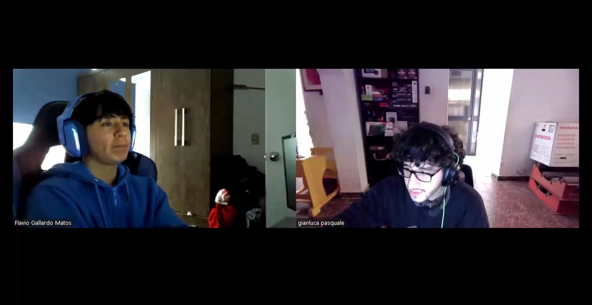
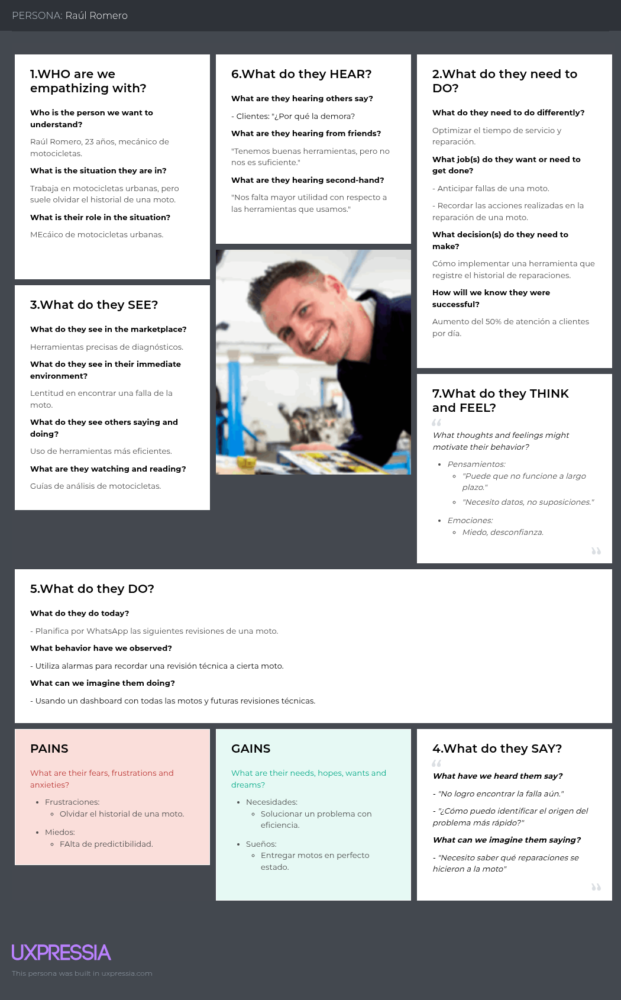

# Universidad Peruana de Ciencias Aplicadas

### **CURSO:** Desarrollo de Soluciones IoT

### **NRC**: 3443

### **Profesor:** Ángel Augusto Velásquez Núñez

### **Ingeniería de software**

## Informe del trabajo Final

### **Nombre del startup:** NRG8

### **Nombre del producto:** BykerZ

## **Integrantes**

| **Nombre**                                | **Codigo** |
|-------------------------------------------|------------|
| **Alejo Cardenas Jose Antonio**           | U202122484 |
| **Astonitas Díaz Juan Diego**             | U202110237 |
| **Casas Sanchez Gabriel Alexander**       | U202220033 |
| **Pacheco Astiguetta Sebastian**          | U202110291 |
| **Paitan Pumachuca Max Anthony**          | U201314454 |
| **Pasquale Barrenechea Gianluca Santino** | U202112078 |
| **Real Calderon Sebatian Omar**           | U20221D964 |

**Septiembre 2025**

## Registro de Versiones del Informe

<table>
  <thead>
    <tr>
      <th>Versión</th>
      <th>Fecha</th>
      <th>Autor</th>
      <th>Descripción de modificación</th>
    </tr>
  </thead>
  <tbody>
    <tr>
      <td>0.1</td>
      <td>01/09/2025</td>
      <td>Alejo Cardenas Jose Antonio Astonitas Díaz Juan Diego Casas Sanchez Gabriel Alexander Pasquale Barrenechea Gianluca Santino Pacheco Astiguetta Sebastian Paitan Pumachuca Max Anthony Real Calderon Sebastian Omar</td>
      <td>Desarrollo del solution profile, lean ux process, segmentos objetivos y análisis de competidores</td>
    </tr>
    <tr>
      <td>0.2</td>
      <td>08/09/2025</td>
      <td>Alejo Cardenas Jose Antonio Astonitas Díaz Juan Diego Casas Sanchez Gabriel Alexander Pasquale Barrenechea Gianluca Santino Pacheco Astiguetta Sebastian Paitan Pumachuca Max Anthony Real Calderon Sebastian Omar</td>
      <td>Diseño, registro y análisis de entrevistas y needfinding</td>
    </tr>
    <tr>
      <td>0.3</td>
      <td>13/09/2025</td>
      <td>Alejo Cardenas Jose Antonio Astonitas Díaz Juan Diego Casas Sanchez Gabriel Alexander Pasquale Barrenechea Gianluca Santino Pacheco Astiguetta Sebastian Real Calderon Sebastian Omar</td>
      <td>User stories, impact mapping, product backlog</td>
    </tr>
    <tr>
      <td>0.4</td>
      <td>14/09/2025</td>
      <td>Alejo Cardenas Jose Antonio Astonitas Díaz Juan Diego Casas Sanchez Gabriel Alexander Pasquale Barrenechea Gianluca Santino Pacheco Astiguetta Sebastian Real Calderon Sebastian Omar</td>
      <td>Big Pictures Eventstorming</td>
    </tr>
    <tr>
      <td>0.5</td>
      <td>15/09/2025</td>
      <td>Casas Sanchez Gabriel Alexander</td>
      <td>Domain message flows modeling, bounded context canvases, context mapping, software architecture</td>
    </tr>
    <tr>
      <td>1.0</td>
      <td>20/09/2025</td>
      <td>Alejo Cardenas Jose Antonio Astonitas Díaz Juan Diego Casas Sanchez Gabriel Alexander Pasquale Barrenechea Gianluca Santino Pacheco Astiguetta Sebastian Real Calderon Sebastian Omar</td>
      <td>Tactical-level Domain-Driven Design</td>
    </tr>
  </tbody>
</table>

## Project Report Collaboration Insights

El enlace a github del reporte del proyecto es el siguiente: [https://github.com/NRG-8-IOT/report](https://github.com/NRG-8-IOT/report).

Distribución de commits:
* Alejo Cardenas Jose Antonio (Firtness): commits.
* Astonitas Díaz Juan Diego (NeorRise456): commits.
* Casas Sanchez Gabriel Alexander (Al3xiel): commits.
* Pasquale Barrenechea Gianluca Santino (cwassointt): commits.
* Pacheco Astiguetta Sebastian (Pachieeee): commits.
* Paitan Pumachuca Max Anthony (MaxPaitanP): commits.
* Real Calderon Sebastian Omar (sebastianrealcalderon): commits.

## Contenido

- [Universidad Peruana de Ciencias Aplicadas](#universidad-peruana-de-ciencias-aplicadas)
    - [**CURSO:** Desarrollo de Soluciones IoT](#curso-desarrollo-de-soluciones-iot)
    - [**NRC**: 3443](#nrc-3443)
    - [**Profesor:** Ángel Augusto Velásquez Núñez](#profesor-ángel-augusto-velásquez-núñez)
    - [**Ingeniería de software**](#ingeniería-de-software)
  - [Informe del trabajo Final](#informe-del-trabajo-final)
    - [**Nombre del startup:** NRG8](#nombre-del-startup-nrg8)
    - [**Nombre del producto:** BykerZ](#nombre-del-producto-bykerz)
  - [**Integrantes**](#integrantes)
  - [Registro de Versiones del Informe](#registro-de-versiones-del-informe)
  - [Project Report Collaboration Insights](#project-report-collaboration-insights)
  - [Contenido](#contenido)
  - [Student Outcome](#student-outcome)
  - [Capítulo I: Introducción](#capítulo-i-introducción)
    - [1.1 Startup Profile](#11-startup-profile)
      - [1.1.1 Descripción de la Startup](#111-descripción-de-la-startup)
      - [1.1.2 Perfiles de integrantes del equipo](#112-perfiles-de-integrantes-del-equipo)
    - [1.2 Solution Profile](#12-solution-profile)
      - [Problema identificado](#problema-identificado)
      - [Solución propuesta](#solución-propuesta)
      - [1.2.1 Antecedentes y problemática](#121-antecedentes-y-problemática)
        - [What](#what)
        - [When](#when)
        - [Where](#where)
        - [Who](#who)
        - [Why](#why)
        - [How](#how)
      - [1.2.2 Lean UX Process](#122-lean-ux-process)
        - [1.2.2.1 Lean UX Problem Statements](#1221-lean-ux-problem-statements)
        - [1.2.2.2 Lean UX Assumptions](#1222-lean-ux-assumptions)
          - [User Assumptions:](#user-assumptions)
          - [Business Assumptions:](#business-assumptions)
          - [Technical Assumptions (Suposiciones Técnicas)](#technical-assumptions-suposiciones-técnicas)
          - [Market Assumptions (Suposiciones de Mercado)](#market-assumptions-suposiciones-de-mercado)
          - [Design Assumptions](#design-assumptions)
        - [1.2.2.3 Lean UX Hypothesis Statements](#1223-lean-ux-hypothesis-statements)
        - [1.2.2.4 Lean UX Canvas](#1224-lean-ux-canvas)
    - [1.3 Segmentos objetivo](#13-segmentos-objetivo)
      - [Segmento Objetivo #1: Usuarios de motos urbanas](#segmento-objetivo-1-usuarios-de-motos-urbanas)
      - [Segmento Objetivo #2: Mecánicos y talleres de servicio](#segmento-objetivo-2-mecánicos-y-talleres-de-servicio)
  - [Capítulo II: Requirements Elicitation \& Analysis](#capítulo-ii-requirements-elicitation--analysis)
    - [2.1 Competidores](#21-competidores)
      - [2.1.1 Análisis competitivo](#211-análisis-competitivo)
      - [2.1.2 Estrategias y tácticas frente a competidores](#212-estrategias-y-tácticas-frente-a-competidores)
    - [2.2 Entrevistas](#22-entrevistas)
      - [2.2.1 Diseño de entrevistas](#221-diseño-de-entrevistas)
      - [2.2.2 Registro de entrevistas](#222-registro-de-entrevistas)
      - [2.2.3 Análisis de entrevistas](#223-análisis-de-entrevistas)
    - [2.3 Needfinding](#23-needfinding)
      - [2.3.1 User Personas](#231-user-personas)
      - [2.3.2 User Task Matrix](#232-user-task-matrix)
      - [2.3.3 User Journey Mapping](#233-user-journey-mapping)
      - [2.3.4 Empathy Mapping](#234-empathy-mapping)
    - [2.4 Big Picture EventStorming](#24-big-picture-eventstorming)
    - [2.5 Ubiquitous Language](#25-ubiquitous-language)
  - [Capítulo III: Requirements Specification](#capítulo-iii-requirements-specification)
    - [3.1 User Stories](#31-user-stories)
- [Épicas](#épicas)
    - [3.2 Impact Mapping](#32-impact-mapping)
    - [3.3 Product Backlog](#33-product-backlog)
  - [Capítulo IV: Solution Software Design](#capítulo-iv-solution-software-design)
    - [4.1 Strategic-Level Attribute-Driven Design](#41-strategic-level-attribute-driven-design)
      - [4.1.1 Design-Level EventStorming](#411-design-level-eventstorming)
        - [4.1.1.1 Candidate Context Discovery](#4111-candidate-context-discovery)
        - [4.1.1.2 Domain Message Flows Modeling](#4112-domain-message-flows-modeling)
        - [4.1.1.3 Bounded Context Canvases](#4113-bounded-context-canvases)
      - [4.1.2 Context Mapping](#412-context-mapping)
      - [4.1.3 Software Architecture](#413-software-architecture)
        - [4.1.3.1 Software Architecture System Landscape Diagram](#4131-software-architecture-system-landscape-diagram)
        - [4.1.3.2 Software Architecture Context Level Diagrams](#4132-software-architecture-context-level-diagrams)
        - [4.1.3.3 Software Architecture Container Level Diagrams](#4133-software-architecture-container-level-diagrams)
        - [4.1.3.4 Software Architecture Deployment Diagrams](#4134-software-architecture-deployment-diagrams)
    - [4.2 Tactical-Level Domain-Driven Design](#42-tactical-level-domain-driven-design)
      - [4.2.1 Bounded Context: unnamed](#421-bounded-context-unnamed)
        - [4.2.1.1 Domain Layer](#4211-domain-layer)
        - [4.2.1.2 Interface Layer](#4212-interface-layer)
        - [4.2.1.3 Application Layer](#4213-application-layer)
        - [4.2.1.4 Infrastructure Layer](#4214-infrastructure-layer)
        - [4.2.1.5 Bounded Context Software Architecture Component Level Diagrams](#4215-bounded-context-software-architecture-component-level-diagrams)
        - [4.2.1.6 Bounded Context Software Architecture Code Level Diagrams](#4216-bounded-context-software-architecture-code-level-diagrams)
          - [4.2.1.6.1 Bounded Context Domain Layer Class Diagrams](#42161-bounded-context-domain-layer-class-diagrams)
          - [4.2.1.6.2 Bounded Context Database Design Diagram](#42162-bounded-context-database-design-diagram)
  - [Conclusiones](#conclusiones)
  - [Bibliografía](#bibliografía)
  - [Anexos](#anexos)

## Student Outcome

El curso contribuye al cumplimiento del Student Outcome ABET:

**ABET – EAC - Student Outcome 5**

Criterio: *La capacidad de funcionar efectivamente en un equipo cuyos miembros juntos proporcionan liderazgo, crean un entorno de colaboración e inclusivo, establecen objetivos, planifican tareas y cumplen objetivos.*
En el siguiente cuadro se describe las acciones realizadas y enunciados de
conclusiones por parte del grupo, que permiten sustentar el haber alcanzado el logro
del ABET – EAC - Student Outcome 5.

<table>
  <thead>
    <tr>
      <th style="text-align: left;">Criterio específico</th>
      <th style="text-align: left;">Acciones realizadas</th>
      <th style="text-align: left;">Conclusiones</th>
    </tr>
  </thead>
  <tbody>
    <tr>
      <td><strong>Trabaja en equipo para proporcionar liderazgo en forma conjunta</strong></td>
      <td>
          TB1:  Astonitas Díaz Juan Diego: Mediatnte fomentar la ayuda mutua, se logro que todos los integrantes implementaran correctamente los diagramas de sus bounded context
         Alejo Cardenas, Jose Antonio: Asumí un liderazgo compartido junto a mis compañeros en la elaboración de User Stories, Impact Mapping y Bounded Contexts, valorando cada aporte y llegando a consensos que guiaron nuestro trabajo.
          Pasquale Barrenechea, Gianluca Santino: A través de la investigación y análisis colaborativo, contribuí en el diseño detallado de los bounded context Suscripciones, Bienestar del Vehículo e IAM, asegurando la coherencia entre capas de dominio y aplicación, además de mantener la alineación con las relaciones entre mecánicos y usuarios.
         Pacheco Astiguetta, Sebastian: Al analizar la información recopilada, se logró definir claramente los límites y responsabilidades de cada bounded context, facilitando la integración y comunicación entre ellos.
      </td>
      <td>
        Como grupo ejercimos un liderazgo compartido en el desarrollo de las distintas actividades (User Stories, Impact Mapping, Domain Storytelling, Eventstorming, Context Mapping y definición de Bounded Contexts), donde cada integrante asumió responsabilidades específicas y se promovió la toma de decisiones consensuada que permitió avanzar de manera organizada en cada etapa del trabajo.
      </td>
    </tr>
    <tr>
      <td><strong>Crea un entorno colaborativo e inclusivo, establece metas, planifica tareas y cumple objetivos.</strong></td>
      <td>
          TB1:  Astonitas Díaz Juan Diego: Dirigi la construccion y la organizacion del grupo para la correcta ejecucion y documentacion de los bounded context
         Alejo Cardenas, Jose Antonio: Fomenté un entorno inclusivo de colaboración durante el event storming, establecí metas claras con el equipo, planificamos tareas de forma organizada y logramos cumplir con los objetivos propuestos.
          Pasquale Barrenchea, Gianluca Santino: Organicé las tareas del equipo para garantizar la correcta integración de los bounded contexts, promoví la comunicación constante y aseguré que cada entregable estuviera alineado con los objetivos definidos en el proyecto.
         Pacheco Astiguetta, Sebastian: Fomenté un ambiente de trabajo inclusivo y colaborativo, estableciendo metas claras y planificando tareas de manera efectiva para asegurar el cumplimiento de los objetivos del proyecto.
      </td>
      <td>
        Generamos un entorno inclusivo que facilitó la participación activa de todos los miembros, definiendo metas comunes y planificando tareas como el diseño de la arquitectura, elaboración de presentaciones, mapeos de contexto, análisis competitivo y construcción del lenguaje ubicuo. Gracias a esta coordinación, logramos cumplir con los objetivos planteados en cada entrega de manera eficiente y colaborativa.
      </td>
    </tr>
  </tbody>
</table>

## Capítulo I: Introducción

### 1.1 Startup Profile

#### 1.1.1 Descripción de la Startup

NRG6 es una startup tecnológica enfocada en la innovación para el sector de movilidad inteligente. Su misión es transformar la manera en que propietarios, mecánicos y empresas gestionan el estado, uso y bienestar de motocicletas y vehículos, combinando IoT, análisis de datos y experiencia digital en una sola plataforma integral.

BykerZ Platform, conecta sensores IoT instalados en los vehículos con aplicaciones web y móviles para brindar a los usuarios una visión completa de su moto: métricas en tiempo real, historial de mantenimientos, alertas preventivas, reportes personalizados y beneficios a través de planes de suscripción.

#### 1.1.2 Perfiles de integrantes del equipo

<table>
  <tr>
    <th colspan="2"> Juan Diego Astonitas </th>
  </tr>
  <tr>
    <td>  </td>
    <td> Mi nombre es Juan Diego Astonitas Diaz, mi código de estudiante es u202110237 ,tengo 21 años, actualmente curso el 6to ciclo de la carrera de Ingeniería de Software, en la UPC en la sede San Miguel. Mis principales cualidades son el liderazgo y el dominio de NextJS. Haré todo lo que esté a mi alcance para respaldar al equipo en la finalización oportuna y efectiva de las tareas asignadas. </td>
  </tr>
  <tr>
    <th colspan="2"> Casas Sanchez Gabriel Alexander </th>
  </tr>
  <tr>
    <td>  </td>
    <td> Soy estudiante de Ingeniería de Software en séptimo ciclo, con habilidades para dirigir y trabajar bien bajo presión. Aunque no disfruto mucho de los trabajos grupales, siempre asumo un rol destacado y sobresaliente en ellos, aprovechando mi capacidad académica y versatilidad. </td>
  </tr>
  <tr>
    <th colspan="2"> Gianluca Santino Pasquale Barrenechea </th>
  </tr>
  <tr>
    <td>  </td>
    <td> Me llamo Gianluca Santino Pasquale Barrenechea, estudiante de Ingeniería de Software (código u202112078). En nuestra Startup, me enfoco en el desarrollo frontend y backend, utilizando C++, C#, Python, Java, HTML y JavaScript. Mi objetivo es crear soluciones escalables y eficientes, mejorando la experiencia del usuario y optimizando la operación de la plataforma, siempre aplicando metodologías ágiles como Scrum. </td>
  </tr>
  <tr>
    <th colspan="2">Jose Antonio Alejo Cardenas</th>
  </tr>
  <tr>
    <td>  </td>
    <td> Soy José Alejo Cárdenas, estudiante de la carrera de Ingeniería de Software del séptimo ciclo. Desde pequeño he sentido fascinación por la tecnología en general sobretodo por el funcionamiento, desarrollo y proteccion del software en el ambito de ciberseguridad. He estudiado lenguajes de programacion (javascript, python y C++), bases de datos (Microsoft SQL Server y Mongo DB) y Sistemas Operativos (Kali Linux y Windows). Asi mismo, tengo experiencia con hardware a nivel de esamblamiento de equipos y funcionamiento del mismo con sus especificaciones tecnicas. Además, mi constante comunicacion y organizacion durante cualquier trabajo grupal aportara mucho dinamismo al proyecto. Mis principales hobbies son entrenar en el gimnasio, jugar videojuegos con mis amigos y salir a conversar con estos ultimos durante algun almuerzo o cena. Para el proyecto aportare organizacion, comunicacion e inspiracion durante todo el transcurso del mismo. </td>
  </tr>
  <tr>
    <th colspan="2">Sebastian Pacheco Astiguetta</th>
  </tr>
  <tr>
    <td>  </td>
    <td> Soy Sebastian Pacheco, tengo 22 años y soy alumno de Ingeniería de Software en la UPC. Me considero una persona trabajadora y activa, priorizando las responsabilidades ante todo, pero también destaco en trabajo en equipo, permitiendo a todos que participen. Tengo conocimiento de C++ y Python, los cuales pongo en práctica mediante proyectos personales. </td>
  </tr>
  <tr>
    <th colspan="2">Sebatian Omar Real Calderon</th>
  </tr>
  <tr>
    <td>  </td>
    <td> Soy Sebastián Real Calderón, estudiante de Ingeniería de Software. Tengo conocimiento de diferentes lenguajes de programación, como C#, C++ y Java. Mi mayor objetivo al desarrollar software es crear una experiencia de usuario con la que los consumidores puedan sentirse satisfechos al trabajar con nuestras aplicaciones. Asimismo, aspiro a ser un buen participante al mantener una comunicación constante con mis compañeros, resolviendo problemas y apoyando a quién lo necesite para crear un ambiente cómodo para todos.  </td>
  </tr>
    <tr>
    <th colspan="2">Max Anthony Paitan Pumachuca</th>
  </tr>
  <tr>
    <td>  </td>
    <td>  </td>
  </tr>
</table>

### 1.2 Solution Profile
#### Problema identificado  
En el contexto urbano, los dueños de motos suelen carecer de herramientas digitales que les permitan monitorear el estado de sus vehículos y llevar un control de sus costos de uso y mantenimiento. Esto ocasiona un uso ineficiente del combustible (monetario y rendimiento), fallas mecánicas inesperadas, gastos imprevistos y dificultades para planificar el cuidado preventivo de la moto.  
Por otro lado, los mecánicos y talleres enfrentan la falta de información confiable y actualizada sobre el historial junto a la condición de las motos de sus clientes, lo que en ocasiones limita la precisión de los diagnósticos y la capacidad de generar relaciones de confianza y fidelización.
#### Solución propuesta  
La plataforma IoT para motos urbanas BykerZ ofrece un ecosistema digital compuesto por aplicaciones móviles, web y un dispositivo embebido que recolecta datos de telemetría en tiempo real (kilometraje, consumo de gasolina, estado de batería, vibración y temperatura del motor).  
- Desde el rol de usuario de moto urbana:
    - Consultar métricas de eficiencia de combustible
    - Recibir alertas preventivas
    - Visualizar y registrar costos acumulados de mantenimiento y uso
    - Acceder al historial de servicios realizados.
    - Sugerencias para próximos mantenimientos.
- Desde el rol de mecánico o taller: 
    - Comparación de métricas entre motos similares  
    - Generación de reportes de salud del vehículo  
    - La consulta del historial de servicios  
    - La emisión de recordatorios para próximos mantenimientos.  

Gracias a sus funcionalidades, la plataforma impulsa un uso más seguro, económico y sostenible de las motos, al mismo tiempo que fortalece la relación entre usuarios y mecánicos mediante datos objetivos y accesibles en tiempo real.
#### 1.2.1 Antecedentes y problemática

##### What

- ¿Cuál es el problema?

El problema principal recae en la dificultad de realizar revisiones proactivas, ya que los propietarios carecen por completo de visibilidad en tiempo real sobre la salud de sus vehículos. Esta ceguera operativa conduce inevitablemente a fallas inesperadas y costosas. Por su parte, los talleres mecánicos se ven forzados a operar de manera reactiva; aunque realizan una revisión general al recibir la moto, el proceso de diagnóstico es lento e ineficiente, ya que deben revisar manualmente múltiples partes del vehículo hasta atinar con la fuente del problema, en lugar de poder ofrecer un mantenimiento predictivo y proactivo basado en datos precisos.

- ¿Cuál es la relación con la persona en cuestión?

La relación con el mecánico se transforma gracias a nuestra plataforma. Ya no se limita a interacciones esporádicas y reactivas cuando algo se rompe, sino que se convierte en una relación constante y proactiva. El mecánico utiliza la herramienta para ofrecer un servicio de monitoreo continuo, lo que le permite actuar como un aliado tecnológico y generar un vínculo de confianza mediante un valor añadido constante. Para el usuario, esta relación se traduce en acceso a datos transparentes sobre su vehículo y la recepción de alertas y recomendaciones directas de su mecánico de confianza.

En esencia, la plataforma está enfocada en proporcionar a ambos actores una herramienta integral que satisface sus necesidades específicas: facilita un monitoreo y registro sencillo de las métricas del vehículo para el usuario y, al mismo tiempo, empodera al mecánico con datos precisos para realizar revisiones más efectivas, optimizando significativamente su trabajo y elevando la calidad del servicio.

##### When

- ¿Cuándo sucede el problema?

El problema ocurre durante el uso diario de la motocicleta, cuando el propietario carece de visibilidad sobre el estado interno de su vehículo. Las fallas y el desgaste suceden de manera imprevista, sin alertas tempranas, llevando a averías inesperadas que interrumpen la movilidad y generan costosas reparaciones de emergencia.

- ¿Cuándo utiliza el cliente el producto?

El cliente utiliza la aplicación de BykerZ de forma continua durante sus trayectos para monitorizar en tiempo real el estado de su moto y conocer en qué momento necesita llevar a cabo mantenimiento. Además, accede a ella de manera proactiva al recibir notificaciones del taller, lo que le permite gestionar alertas específicas y agendar citas de mantenimiento con facilidad. Este uso constante no solo le ofrece tranquilidad y control sobre su vehículo, sino que también favorece directamente al mecánico, quien recibe métricas precisas y premeditadas que agilizan y optimizan el proceso de diagnóstico y reparación.

##### Where

- ¿Dónde está el cliente cuando usa el producto?

El cliente utiliza la aplicación de BykerZ principalmente desde su smartphone, accediendo a ella en cualquier lugar y momento. Este acceso ubicuo le permite monitorizar el estado de su moto en tiempo real durante sus desplazamientos, así como revisar de forma remota el historial técnico y las notificaciones proactivas que recibe. Si bien la plataforma se utiliza en talleres durante las interacciones con el mecánico para facilitar el diagnóstico colaborativo, su verdadero poder radica en que todas las métricas y el historial detallado del vehículo pueden visualizarse y compartirse desde cualquier lugar con acceso a internet, garantizando una supervisión continua y una comunicación fluida entre el usuario y su taller de confianza.

- ¿Dónde surge el problema?

El problema surge en la propia motocicleta durante su operación diaria, donde ocurren los eventos críticos. Además, se manifiesta en el taller mecánico, donde la falta de datos en tiempo real impide al mecánico anticiparse a las fallas y ofrece un servicio reactivo.

##### Who

- ¿Quienes se ven involucrados en el problema?

El problema involucra directamente a dos actores clave: los propietarios de motocicletas y los talleres mecánicos. Por un lado, los usuarios enfrentan la dificultad constante de no tener conocimiento preciso del estado interno de sus vehículos, lo que los expone a sufrir fallas imprevistas y reparaciones costosas. Por otro lado, los mecánicos y talleres se ven igualmente afectados, ya que esta falta de información les impide evolucionar hacia un modelo de servicio preventivo y proactivo, lo que no solo genera ineficiencias en sus procesos de diagnóstico, sino que también representa una pérdida de oportunidades de negocio para fidelizar y agregar valor a su cartera de clientes existente.

##### Why

- ¿Por qué sucede el problema?

Las causas del problema se deben en mayor parte a la falta de datos actualizados sobre el estado del vehículo y/o poco conocimiento de algunos usuarios con respecto a identificar señales de una falla en el vehículo. Por otro lado, el diagnóstico se complica ya que carece de un historial del vehículo, dependiendo de lo que el cliente recuerde en base a reparaciones previas y/o incidentes recientes.

##### How 

- ¿En qué condiciones los clientes usan nuestro producto?

Los clientes utilizan nuestro producto en condiciones de movilidad, accediendo a los datos de su moto en tiempo real durante sus trayectos o de manera remota para planificar mantenimientos. La plataforma es utilizada principalmente a través de dispositivos móviles con conectividad a internet, permitiendo interacciones tanto preventivas como reactivas ante alertas generadas por el sistema.

#### 1.2.2 Lean UX Process

##### 1.2.2.1 Lean UX Problem Statements

En el panorama actual de la movilidad urbana, los propietarios de motocicletas operan con una constante incertidumbre respecto al estado de sus vehículos al carecer de visibilidad sobre su condición interna, lo que los expone al riesgo de fallas sorpresivas, reparaciones costosas o incluso accidentes fatales. Paralelamente, los talleres mecánicos se ven limitados por un modelo de servicio reactivo; solo pueden intervenir cuando el problema ya ha ocurrido, lo que se agrava al recibir descripciones vagas e incompletas de los usuarios. Esta falta de datos técnicos específicos complica el diagnóstico, prolonga los tiempos de reparación, reduce la eficiencia del servicio y finalmente erosiona la confianza del cliente.

Para cubrir esta necesidad crítica, surge BykerZ como una herramienta integral que transforma este ecosistema. Se trata de una plataforma digital que monitorea el vehículo en tiempo real y recopila datos históricos de su desempeño de forma automática. Al analizar esta información, BykerZ genera métricas precisas y alertas oportunas sobre anomalías o patrones de desgaste, notificando tanto al motociclista como al mecánico. Esto permite a los usuarios actuar de manera preventiva y empodera a los talleres con información técnica precisa, optimizando sus diagnósticos, permitiendo un mantenimiento proactivo y restaurando así la confianza en los resultados del servicio.

##### 1.2.2.2 Lean UX Assumptions
###### User Assumptions:  
- **¿Quién es el usuario?:** El usuario es un motociclista que busca una manera confiable de conocer el estado actual de su vehículo, así como un mecánico que necesito mayor precisión en la información técnica de la motocicleta para realizar diagnósticos y reparaciones eficientes.  
- **¿Dónde encaja nuestro producto en su trabajo o vida?:** Nuestro producto encaja en el uso cotidiano de la motocicleta para los conductores, así como en el diagnóstico y reparación dentro del taller para los mecánicos.  
- **¿Qué problemas resuelve nuestro producto?:** Nuestro producto resuelve la falta de información confiable sobre el estado de la moto para los conductores. Mientras que, para los mecánicos, resuelve el problema con diagnósticos lentos y/o imprecisos, así como la naturaleza reactiva de su negocio.  
- **¿Cuándo y cómo se usa nuestro producto?:** Se utiliza de forma pasiva durante la conducción del usuario, y de forma activa al recibir las alertas para revisar el estado de su moto. El mecánico lo utiliza diariamente para revisar el estado de las motos de sus clientes suscritos.  
- **¿Qué características son importantes?:** Para el usuario, son importantes las alertas, las métricas sencillas y fáciles de entender, un historial de mantenimiento y una forma de integrar su relación con un taller de confianza. Para el mecánico, es importante tener un dashboard con el estado de las motos de los clientes suscritos, una función de alertas prioritarias, una herramienta de comunicación integrada, y gestión de citas.  
- **¿Cómo debe verse y comportarse nuestro producto?:** Debe tener una interfaz clara y minimalista para el usuario final, priorizando la visualización de datos de salud del vehículo de una manera sencilla (Colores de Semáforo: Verde/Amarillo/Rojo). Para el mecánico, la interfaz debe ser más compleja, pero igualmente intuitiva, priorizando la visualización de problemas críticos y la gestión de clientes.  
###### Business Assumptions:
- **Necesidades y problemas:** Creemos que los motociclistas necesitan una forma confiable de conocer el estado de sus vehículos y así poder anticipar fallas, mientras que los mecánicos requieren datos más técnicos y claros que les faciliten diagnósticos más rápidos y precisos.  
- **Plataforma:** Estas necesidades se pueden resolver a través de un ecosistema que combine un hardware IoT, una aplicación móvil para el usuario y una plataforma web SaaS para los talleres.  
- **Segmentación:** Los usuarios principales serán motociclistas que buscan seguridad y control sobre el estado de su vehículo, y nuestros clientes directos son los talleres o mecánicos interesados en contar con información detallada y quieren adoptar la tecnología necesaria para mejorar su servicio.  
- **Comportamientos:** El valor que los usuarios esperan obtener de nuestro servicio es la tranquilidad de anticipar problemas, evitar gastos inesperados y acceder a reportes confiables que respalden decisiones de mantenimiento.  
- **Beneficios:** Los usuarios obtendrán seguridad y un ahorro en costos de reparación a largo plazo. Los mecánicos se beneficiarán con diagnósticos más eficientes, mayor confianza del cliente y la optimización de su trabajo.
- **Captación de clientes:** Adquiriremos talleres socios a través de ventas directas y referencias del sector, además de realizar campañas digitales enfocadas en las comunidades de motociclistas, atrayendo más clientes potenciales.  
- **Modelo de ingresos:** Generaremos ingresos mediante la venta de los dispositivos IoT, planes de suscripción para el acceso de los mecánicos a los reportes avanzados y acuerdos comerciales con talleres para el uso de la plataforma.
- **Competencia:** Nuestra competencia directa son los scanners OBD2 genéricos y apps como "Bike Scanner". La competencia indirecta son los servicios de mantenimiento tradicionales.  
- **Ventaja competitiva:** Superaremos a la competencia gracias a la integración perfecta taller-cliente, la interpretación automatizada de datos y el enfoque en el mantenimiento predictivo y la experiencia completa, no solo en la lectura de datos.  
###### Technical Assumptions (Suposiciones Técnicas)  
- **Tecnología utilizada:** Podemos desarrollar un dispositivo IoT confiable, de bajo consumo y conectividad estable para instalarse en la moto. La app móvil se puede desarrollar con un framework cross-platform, como Flutter y el backend con tecnologías escalables como Spring Boot o Node.js.  
- **Integraciones:** La plataforma del taller debería integrarse potencialmente con software de gestión de talleres existente y con pasarelas de pago para manejar las suscripciones.  
- **Escalabilidad:** La arquitectura en la nube podrá escalar para soportar el procesamiento de datos en tiempo real de miles de dispositivos y usuarios simultáneos.  
###### Market Assumptions (Suposiciones de Mercado)  
- **Tamaño del mercado:** Existe un mercado significativo y en crecimiento de motociclistas que priorizan la seguridad y el cuidado de su vehículo, y talleres que buscan digitalizarse. Este también es poco explorado, por lo que existe la oportunidad de llenar un nicho con nuestro producto.  
- **Competencia:** El mercado no está saturado con soluciones integrales que conecten directamente al usuario con el taller; la mayoría son herramientas genéricas o desconectadas del servicio profesional.  
- **Tendencias:** Las tendencias de IoT, la movilidad inteligente y la economía de suscripción están en crecimiento, lo que crea un terreno fértil para nuestra solución.  
###### Design Assumptions  
- **Interacción del usuario:** Los usuarios tendrán una mejor interacción con las aplicaciones web y móvil si es que pueden consultar de forma inmediata los indicadores esenciales de su moto y recibir notificaciones oportunas sobre posibles fallas. Mientras que los mecánicos, además de una fácil interacción con las aplicaciones, podrán tener acceso a una mayor cantidad de información técnica y así poder realizar diagnósticos más precisos.  
- **Experiencia del usuario:** Los usuarios tendrán una interfaz intuitiva y confiable que entregue información práctica y transmita tranquilidad, con datos presentados de forma simple y no con términos técnicos crudos, lo que mejorará la percepción de seguridad y control sobre el vehículo.  
- **Colores y la tipografía:** Utilizaremos una paleta de colores que transmita seguridad (azules, verdes) y alerta (rojos, naranjas) cuando sea necesario. La tipografía debe ser marcada y muy legible incluso en movimiento.  
- **Preferencias visuales:** Los usuarios considerarán atractivo un diseño que se asemeje a otros dashboards de vehículos modernos: limpio, con gráficos simples e íconos universalmente reconocibles, y resúmenes visuales fáciles de interpretar.  
- **Prototipos y pruebas:** Las pruebas con motociclistas y mecánicos son necesarias para verificar la facilidad de uso del producto, así como del diseño; todo ello será a través de pruebas de usabilidad. 

##### 1.2.2.3 Lean UX Hypothesis Statements

**Hypothesis Statement 01:**

- Creemos que los motociclistas necesitan una forma sencilla y confiable de monitorear el estado de su moto en tiempo real.
- Sabremos que estamos en lo correcto cuando observemos que los clientes consultan frecuentemente la aplicación para revisar métricas de su vehículo.

**Hypothesis Statement 02:**

- Creemos que los mecánicos requieren información temprana sobre fallos potenciales para brindar un servicio más proactivo.
- Sabremos que estamos en lo correcto cuando los mecánicos reporten menor número de reparaciones de emergencia y mayor número de mantenimientos preventivos.

**Hypothesis Statement 03:**

- Creemos que centralizar la comunicación entre cliente y taller dentro de la plataforma reducirá la fricción y mejorará la coordinación.
- Sabremos que estamos en lo correcto cuando los clientes usen la mensajería o notificaciones de la app en lugar de llamadas o visitas imprevistas.

**Hypothesis Statement 04:**

- Creemos que la creación de un historial de servicios será clave para que los motociclistas planifiquen mantenimientos futuros.
- Sabremos que estamos en lo correcto cuando los usuarios registren y consulten con frecuencia los mantenimientos realizados en su moto.

**Hypothesis Statement 05:**

- Creemos que ofrecer una suscripción con acceso a datos en tiempo real dará valor suficiente para retener clientes.
- Sabremos que estamos en lo correcto cuando observemos baja tasa de cancelación y renovaciones recurrentes de la suscripción.

**Hypothesis Statement 06:**

- Creemos que los usuarios percibirán a BykerZ como una forma de manejar con mayor seguridad y confianza.
- Sabremos que estamos en lo correcto cuando recibamos comentarios positivos en encuestas y reseñas sobre la sensación de seguridad brindada por el uso de la aplicación.

**Hypothesis Statement 07:**

- Creemos que las notificaciones deben ser escuetas y fáciles de entender para que los motociclistas no las ignoren.
- Sabremos que estamos en lo correcto cuando las pruebas de usabilidad muestren que los usuarios entienden y siguen las alertas que reciban.

**Hypothesis Statement 08:**

- Creemos que una interfaz simple con información precisa facilitará la adopción de la aplicación por los motociclistas.
- Sabremos que estamos en lo correcto cuando veamos comentarios positivos sobre la usabilidad de la aplicación.

**Hypothesis Statement 09:**

- Creemos que los talleres que adopten esta plataforma tendrán mayor fidelización de clientes frente a los que no lo hagan.
- Sabremos que estamos en lo correcto cuando los talleres suscritos muestren un aumento en clientes recurrentes.

**Hypothesis Statement 10:**

- Creemos que los usuarios valorarán la posibilidad de acceder al historial de mantenimiento de su motocicleta en un solo lugar.
- Sabremos que estamos en lo correcto cuando los clientes consulten repetidamente el historial en la aplicación.

**Hypothesis Statement 11:**

- Creemos que la plataforma ayudará a los talleres a gestionar de manera más eficiente varias motos de distintos clientes al mismo tiempo.
- Sabremos que estamos en lo correcto cuando los mecánicos reporten menor tiempo de organización y mayor control de su cartera de clientes.

**Hypothesis Statement 12:**

- Creemos que integrar recordatorios automáticos de mantenimientos programados reducirá los olvidos de los clientes.
- Sabremos que estamos en lo correcto cuando los clientes acudan puntualmente a las citas de mantenimiento.

**Hypothesis Statement 13:**

- Creemos que la interfaz intuitiva de la aplicación facilitará la adopción por parte de clientes que no son expertos en tecnología.
- Sabremos que estamos en lo correcto cuando los usuarios aprendan a manejar la app en menos de una semana y la usen sin asistencia.

**Hypothesis Statement 14:**

- Creemos que mostrar gráficas y estadísticas en tiempo real aumentará la percepción de valor tecnológico en la plataforma.
- Sabremos que estamos en lo correcto cuando los usuarios interactúen frecuentemente con los paneles de datos visuales.

**Hypothesis Statement 15:**

- Creemos que el envío de reportes semanales sobre el estado de la moto fortalecerá la relación de confianza entre cliente y taller.
- Sabremos que estamos en lo correcto cuando los clientes valoren positivamente los reportes y continúen la suscripción.

**Hypothesis Statement 16:**

- Creemos que el sistema reducirá costos inesperados al detectar anomalías antes de que se conviertan en averías graves.
- Sabremos que estamos en lo correcto cuando los clientes reporten menos gastos de emergencia y mayor previsión.

**Hypothesis Statement 17:**

- Creemos que ofrecer soporte rápido en caso de fallos críticos en la moto motivará a los usuarios a depender de la aplicación.
- Sabremos que estamos en lo correcto cuando los usuarios utilicen la función de soporte y lo califiquen positivamente.

**Hypothesis Statement 18:**

- Creemos que incluir un sistema de alertas personalizadas para cada cliente aumentará la efectividad del mantenimiento preventivo.
- Sabremos que estamos en lo correcto cuando los talleres reporten mayor precisión en la programación de servicios.

**Hypothesis Statement 19:**

- Creemos que la transparencia en el estado real de la moto mejorará la percepción de honestidad hacia los mecánicos.
- Sabremos que estamos en lo correcto cuando los clientes expresen confianza en las recomendaciones de mantenimiento recibidas a través de la app.

**Hypothesis Statement 20:**

- Creemos que los motociclistas estarán más motivados a usar BykerZ si reciben consejos prácticos de cuidado básico de sus motocicletas.
- Sabremos que estamos en lo correcto cuando identifiquemos que los usuarios revisan de forma constante las secciones de recomendaciones en la aplicación.

##### 1.2.2.4 Lean UX Canvas

### 1.3 Segmentos objetivo

#### Segmento Objetivo #1: Usuarios de motos urbanas

Este grupo incluye a personas que utilizan motocicletas como su principal medio de transporte en entornos urbanos, ya sea para movilizarse hacia sus trabajos, estudios, actividades sociales o incluso para labores de reparto. Son usuarios interesados en mantener la eficiencia de su moto, reducir costos imprevistos y contar con mayor seguridad mediante el monitoreo del estado de su vehículo.

- Características clave:
  - Edad: 18 a 45 años
  - Género: Ambos
  - Contexto: Desplazamiento urbano frecuente (trabajo, estudio, servicios de entrega, actividades sociales).
  - Ocupación: Estudiantes universitarios, trabajadores formales/informales, repartidores, jóvenes profesionales.
  - Uso de tecnología: Usuarios activos de smartphones, acostumbrados a apps móviles (redes sociales, movilidad, delivery, fintech).
- Necesidades:
  - Monitorear el consumo de gasolina y la eficiencia del vehículo.
  - Prevenir fallas con alertas de mantenimiento.
  - Conocer costos acumulados de uso y reparaciones.
  - Tener a mano el historial de mantenimiento.

#### Segmento Objetivo #2: Mecánicos y talleres de servicio

Este grupo está conformado por profesionales independientes o pequeños talleres que ofrecen servicios de reparación y mantenimiento de motocicletas. Requieren herramientas que les permitan ofrecer diagnósticos más precisos y gestionar mejor la relación con sus clientes, a fin de mejorar la confianza y fidelización.

- Características clave:
  - Edad: 25 a 55 años
  - Género: Ambos
  - Contexto: Trabajo en talleres de servicio mecánico, tanto formales como independientes.
  - Ocupación: Mecánicos, técnicos de motos, dueños de talleres pequeños o medianos.
  - Uso de tecnología: Nivel intermedio; utilizan smartphones y en algunos casos software de gestión básica. Suelen apoyarse en WhatsApp y redes sociales para coordinar con clientes.
- Necesidades:
  - Acceder a métricas objetivas del estado de la moto.
  - Emitir reportes de salud y diagnósticos comparativos.
  - Consultar el historial de servicios de cada cliente.
  - Recordar y planificar mantenimientos preventivos.

## Capítulo II: Requirements Elicitation & Analysis

### 2.1 Competidores

- Wialon (Gurtam)
  
  
  
  Wialon es la plataforma de software insignia de Gurtam, una empresa bielorrusa con más de 20 años en el mercado de telemática e IoT. Está considerada una de las soluciones más versátiles para la gestión de flotas y activos móviles, con más de 4 millones de unidades conectadas en más de 160 países. Wialon funciona bajo un modelo SaaS altamente escalable y soporta más de 3.000 modelos de dispositivos GPS e IoT, lo que permite adaptarse a diferentes necesidades: desde camiones y buses hasta maquinaria pesada o transporte ligero. Entre sus funcionalidades principales destacan el rastreo en tiempo real, generación de informes personalizados, alertas de eventos, gestión de combustible, mantenimiento predictivo y herramientas de integración por API. Su principal fortaleza radica en la gran flexibilidad y ecosistema de partners, lo que lo convierte en una solución preferida para empresas de logística, transporte y operadores de flotas internacionales.

- Fuelio
  
  
  
  Fuelio es una aplicación móvil enfocada en la gestión del consumo de combustible y el mantenimiento vehicular. Permite a los usuarios registrar de manera sencilla el kilometraje, repostajes, costos asociados y servicios realizados al vehículo, generando estadísticas detalladas sobre rendimiento y gastos. La app ofrece funcionalidades adicionales como localización de estaciones de servicio cercanas, cálculo de consumo por trayecto, y respaldo automático en la nube para mantener los datos seguros y accesibles en múltiples dispositivos. Su propuesta de valor radica en brindar control y transparencia sobre los gastos de movilidad, ayudando tanto a conductores individuales como a pequeños administradores de vehículos a optimizar su presupuesto y hábitos de conducción.
  
- GeoTab

  
  
  Geotab, fundada en 2000 en Canadá, es uno de los líderes globales en telemática comercial y gestión de flotas, con más de 3,7 millones de vehículos conectados en más de 150 países. Su propuesta combina el dispositivo IoT Geotab GO9 con la plataforma en la nube MyGeotab, lo que permite a empresas de cualquier tamaño acceder a datos avanzados de sus vehículos. Entre sus principales funcionalidades se incluyen análisis de comportamiento de conducción, diagnóstico de motor, consumo de combustible, planificación de rutas, alertas de mantenimiento, cumplimiento normativo (como ELD en EE.UU.) y reportes personalizados. Además, Geotab cuenta con el Geotab Marketplace, un ecosistema de más de 200 aplicaciones complementarias que amplían las capacidades de la plataforma. Su diferenciador está en la precisión de sus análisis, confiabilidad y enfoque en big data e inteligencia artificial, que permiten a empresas grandes y gobiernos tomar decisiones estratégicas basadas en datos de movilidad.

#### 2.1.1 Análisis competitivo

| **Categoría** | **Byker Z** | **Wialon (Gurtam)** | **Fuelio** | **Geotab** |
|---------------|----------------|----------------------|------------|------------|
| **Perfil - Overview** | Plataforma IoT para motocicletas que conecta mecánicos con clientes, con métricas en tiempo real y alertas preventivas. | SaaS de telemática IoT para gestión de vehículos y activos móviles, con GPS y reportes avanzados. | App para rastrear consumo de combustible, costos, kilometraje y servicios, con búsqueda de estaciones y respaldo en la nube. | Líder global en telemática, con dispositivos IoT y software para análisis de datos vehiculares. |
| **Ventaja competitiva** | Enfoque de nicho: motos + talleres mecánicos. Conexión directa cliente-mecánico mediante suscripción. | Amplia cobertura global y flexibilidad de personalización para distintos tipos de flotas. | Interfaz sencilla, soporte crowdsourced de precios, recordatorios, sincronización y reportes visuales potentes. | Precisión en datos y analítica avanzada, gran reputación en confiabilidad. |
| **Perfil de Marketing - Mercado Objetivo** | Motociclistas individuales y talleres mecánicos pequeños/medianos. | Empresas de logística, transporte y flotas heterogéneas. | Usuarios que buscan ahorro en combustible y seguimiento básico de gastos vehiculares, incluidos conductores particulares y usuarios multi-vehículo. | Flotas comerciales, gobiernos, corporativos globales. |
| **Estrategias de Marketing** | Enfoque B2B2C: atraer talleres como socios y motociclistas vía suscripción. | Estrategia B2B, alianzas con distribuidores y partners locales. | Se promociona como simple y potente; cuenta con integración de precios crowdsourced, historias de usuarios satisfechos y respaldo de Sygic. | Estrategia B2B global, certificaciones y partnerships institucionales. |
| **Perfil de Producto - Productos & Servicios** | Sensores IoT para motos, app móvil/web para clientes, dashboard para mecánicos, alertas proactivas. | Plataforma SaaS con GPS, sensores IoT, informes personalizados. | Fill-ups, gastos, recordatorios, estación de gasolina cercana, gráficos, estadísticas, sincronización.   Pro: planificación de ruta, estimación de costo, filtro estaciones, reporte de ruta. | Dispositivos IoT + plataforma de análisis con diagnósticos y mantenimiento predictivo. |
| **Precios & Costos** | Modelo de suscripción mensual accesible (B2C) + paquetes premium para talleres. | Licencias SaaS escalables, costos variables por flota. | Gratuito, Fuelio Pro en Android es suscripción (€7 - €9) sin afectar funciones gratuitas. | Suscripción SaaS + costo de dispositivos IoT (moderado/alto). |
| **Canales de Distribución** | App móvil (Android), web, talleres como canales de adquisición. | Red de partners y distribuidores en más de 150 países. | Android & iOS. | Red global de resellers y partners certificados. |
| **SWOT - Fortalezas** | Nicho diferenciado, cercanía con usuarios finales, foco en motos. | Escalabilidad, robustez y experiencia global. | Interfaz amigable, precios crowdsourced, reportes detallados, muchos features gratuitos. | Precisión en analítica, confiabilidad, amplia red global. |
| **SWOT - Debilidades** | Proyecto nuevo, sin marca consolidada, recursos limitados. | No especializado en motos, alto costo para pequeños talleres. | Entrada manual laboriosa, problemas ocasionales de sincronización. | Altos costos, pensado para grandes flotas, no para usuarios individuales. |
| **SWOT - Oportunidades** | Mercado creciente de motocicletas en LATAM/Asia, tendencia a IoT y mantenimiento predictivo. | Expansión en verticales nuevos como motos y microflotas. | Expandir trip logging, entradas automáticas, soporte ampliado en iOS. | Penetración en mercados emergentes y nuevas integraciones IoT. |
| **SWOT - Amenazas** | Ingreso de grandes players al nicho, barreras de hardware. | Competencia creciente y commoditización de la telemática. | Cambios en licenciamiento por Sygic; apps emergentes con mejor UX o IA predictiva. | Alta competencia y presión por diferenciación. |

#### 2.1.2 Estrategias y tácticas frente a competidores

1. Estrategia de Diferenciación Tecnológica (IoT + Diagnósticos Predictivos)
   
Objetivo: Posicionar a BykerZ como la primera solución que integra hardware IoT y software para ofrecer métricas automáticas en tiempo real y diagnósticos predictivos, superando la limitación de registros manuales en Drivvo, aCar y Fuelio.

Tácticas:

Desarrollar un dispositivo IoT plug & play que se instale fácilmente en motos urbanas.

Integrar algoritmos de mantenimiento predictivo basados en telemetría.

Generar reportes personalizados descargables para usuarios y mecánicos.

Comunicar en marketing el diferencial clave: “No registres datos, deja que tu moto hable por ti”.

2. Estrategia de Enfoque en Nichos Desatendidos (Motos Urbanas + Mecánicos)
   
Objetivo: Atacar un mercado poco atendido: motociclistas urbanos y talleres mecánicos, en contraste con las apps competidoras que se enfocan en autos y flotas.

Tácticas:

Ofrecer funcionalidades específicas para motos (ej. control de gasolina por cilindrada, alertas de aceite, historial de mantenimientos por kilometraje).

Crear una app web exclusiva para mecánicos, con comparativos por modelo y gestión de clientes.

Establecer alianzas con talleres locales y concesionarios de motos para distribución del IoT.

Campañas de marketing dirigidas a delivery riders, mototaxistas y jóvenes motociclistas urbanos.

3. Estrategia de Marca Cercana y Comunitaria
   
Objetivo: Construir confianza mostrando a BykerZ como una solución hecha por y para motociclistas y mecánicos, en lugar de una app genérica de gastos.

Tácticas:

Crear una comunidad digital de motociclistas, con foros y tips de mecánica preventiva.

Usar un lenguaje simple y cercano, evitando tecnicismos innecesarios.

Brindar soporte personalizado (ej. chat directo, FAQs en video, tutoriales cortos en redes).

Generar contenido educativo sobre seguridad, ahorro de combustible y mantenimiento inteligente.

4. Estrategia de Precio Accesible y Transparente
   
Objetivo: Superar la percepción negativa de Drivvo (suscripción costosa) y Fuelio Pro (costo adicional), ofreciendo planes claros y económicos.

Tácticas:

Modelo freemium real: funcionalidades básicas siempre gratuitas (seguimiento de consumo y alertas).

Plan Premium accesible (<$2/mes) con reportes predictivos, diagnósticos avanzados y sincronización completa.

Precio del dispositivo IoT asequible (ej. $30–40) con facilidades de pago en talleres.

Descuentos especiales para mecánicos que adquieran múltiples dispositivos para sus clientes.

5. Estrategia de Diferenciación por Especialización en Motocicletas

Objetivo: Posicionar la solución como un producto diseñado específicamente para motocicletas y talleres mecánicos, en contraste con los competidores que se orientan a flotas grandes y heterogéneas (Wialon, Geotab).

Tácticas:

Desarrollar una interfaz amigable y personalizada para mecánicos y motociclistas.

Ofrecer funcionalidades exclusivas para motos (ej. alertas de mantenimiento de cadena, aceite, frenos).

Construir una narrativa de marca clara: “la telemática de las motos”.

6. Estrategia de Accesibilidad y Flexibilidad en el Modelo de Negocio

Objetivo: Competir contra grandes competidores (Wialon, Samsara, Geotab) ofreciendo un producto más accesible, económico y fácil de implementar, enfocado en usuarios individuales y talleres pequeños.

Tácticas:

Diseñar planes de suscripción escalonados (desde básicos hasta avanzados) que permitan crecer al ritmo del usuario.

Incluir un modelo freemium o demo para captar usuarios rápidamente sin barreras de entrada.

Resaltar la facilidad de instalación de sensores IoT en motos, evitando hardware costoso o complejo.

7. Estrategia de Cercanía y Comunidad con el Usuario Final

Objetivo: Diferenciarse por la relación directa y de confianza entre motociclistas y mecánicos, creando una comunidad alrededor del producto que los competidores globales no priorizan.

Tácticas:

Lanzar campañas de marketing en comunidades locales (Facebook, Instagram, clubes de motociclistas, foros especializados).

Promover talleres mecánicos como socios estratégicos para captar clientes y distribuir el IoT.

Desarrollar integraciones futuras con aseguradoras o talleres certificados, ofreciendo beneficios adicionales (ej. descuentos en seguros, paquetes de mantenimiento).

### 2.2 Entrevistas

#### 2.2.1 Diseño de entrevistas

- Diseño de entrevistas para Motociclistas

Preguntas principales:

1. ¿Podrías contarme un poco sobre ti? (edad, ocupación, lugar de residencia, estado civil)

2. ¿Cómo sueles llevar el control del gasto de combustible y mantenimiento de tu moto?

3. ¿Con qué frecuencia realizas mantenimientos preventivos a tu moto?

4. ¿Has tenido problemas con fallas inesperadas o gastos imprevistos relacionados con tu moto?

5. ¿Cómo te comunicas actualmente con tu mecánico cuando necesitas una revisión o reparación?

Preguntas complementarias:

1. ¿Utilizas actualmente alguna aplicación o herramienta digital para registrar tus gastos o consumo de gasolina?

2. ¿Qué tan cómodo te sentirías si tu moto enviara automáticamente datos de su estado a una aplicación?

3. ¿Qué indicadores del estado de tu moto te gustaría conocer en tiempo real? (ejemplo: presión de neumáticos, combustible, temperatura del motor)

4. ¿Qué tan útil te parecería recibir alertas en tu celular sobre posibles fallas antes de que ocurran?

5. ¿Qué tipo de alertas te serían más útiles? (ejemplo: cambio de aceite, nivel de gasolina, revisión de frenos)

6. ¿Qué dispositivos usas más frecuentemente para organizarte o monitorear cosas? (móvil, laptop, tablet)

7. ¿Qué valoras más en una app para motos? (ejemplo: simplicidad, visualización clara de métricas, recordatorios)

8. ¿Cuánto estarías dispuesto a pagar por un servicio que prevenga fallos y prolongue la vida útil de tu moto?

- Diseño de entrevistas para Mecanicos

Preguntas principales:

1. ¿Podrías contarme un poco sobre ti? (edad, ocupación, experiencia laboral, ubicación del taller)

2. ¿Qué tipo de servicios brindas con mayor frecuencia en tu taller?

3. ¿Cómo registras actualmente el historial de mantenimiento de tus clientes?

4. ¿Cómo realizas actualmente el diagnóstico del estado de una moto cuando llega a tu taller?

5. ¿Te resultaría útil poder monitorear de forma remota el estado de las motos de tus clientes? ¿Por qué?

Preguntas complementarias:

1. ¿Qué tan común es que tus clientes lleguen con problemas que pudieron haberse evitado con un mantenimiento preventivo?

2. ¿Sueles recomendar a tus clientes llevar un control de gastos y mantenimientos? ¿Cómo lo haces?

3. ¿Usas alguna herramienta digital para organizar los diagnósticos o el historial de las motos?

4. ¿Qué tan útil te parecería contar con datos de telemetría en tiempo real (ejemplo: kilometraje, consumo, estado de batería) antes de recibir una moto en tu taller?

5.  ¿Qué métricas (ej. presión de neumáticos, consumo, temperatura) serían más valiosas para tu trabajo?

6.  ¿Qué tipo de reportes serían más valiosos para ti y para tus clientes?

7.  ¿Estarías dispuesto a ofrecer este servicio como un valor agregado a tus clientes? ¿Cómo lo integrarías a tu negocio?

8.  ¿Qué tan dispuesto estarías a recomendar a tus clientes una app vinculada con tu servicio?

9.  ¿Qué modelo de ingresos preferirías: una comisión por cada suscripción de tus clientes, o un plan que te permita supervisar toda tu cartera de clientes a un costo fijo?

10. ¿Qué valoras más en una herramienta digital para tu trabajo? (ejemplo: precisión, facilidad de uso, integración con otros sistemas)

#### 2.2.2 Registro de entrevistas
En esta sección se registran los puntos más relevantes de las entrevistas realizadas a los mecánicos y dueños de motos. Las entrevistas, en formato de video, se encuentran en el siguiente enlace: [Needfinding Interviews - NRG6](https://upcedupe-my.sharepoint.com/:v:/g/personal/u202110291_upc_edu_pe/EUX6HJSrkWFLsupKCjibccgBqipXedXcpryQbgwV-mpKdQ?e=fp4EZr&nav=eyJyZWZlcnJhbEluZm8iOnsicmVmZXJyYWxBcHAiOiJTdHJlYW1XZWJBcHAiLCJyZWZlcnJhbFZpZXciOiJTaGFyZURpYWxvZy1MaW5rIiwicmVmZXJyYWxBcHBQbGF0Zm9ybSI6IldlYiIsInJlZmVycmFsTW9kZSI6InZpZXcifX0%3D)

A continuación, se presentan detalles de las entrevistas realizadas a los mecánicos:

| Entrevista 1              |  |
|---------------------------|------------------------------------------------------------|
| Nombre del entrevistado   | Flavio Gallardo                                            |
| Edad                      | 21                                                         |
| Distrito                  | San Miguel                                                 |
| Ocupación                 | Ayudante de mecánico                                       |
| Duración de la Entrevista | 4:20                                                       |
| Minuto de Inicio          | 0:00                                                       |

| Entrevista 2              |  |
|---------------------------|--------------------------------------------------------|
| Nombre del entrevistado   | Juan Cuellar                                           |
| Edad                      | 25                                                     |
| Distrito                  | Pueblo Libre                                           |
| Ocupación                 | Mecánico                                               |
| Duración de la Entrevista | 4:15                                                   |
| Minuto de Inicio          | 4:20                                                   |

| Entrevista 3              |  |
|---------------------------|--------------------------------------------------------|
| Nombre del entrevistado   | Aldo Vasquez                                           |
| Edad                      | 23                                                     |
| Distrito                  | Breña                                                  |
| Ocupación                 | Ayudante de mecánico                                   |
| Duración de la Entrevista | 3:58                                                   |
| Minuto de Inicio          | 8:18                                                   |

A continuación, se presentan detalles de las entrevistas realizadas a los dueños de motos:

| Entrevista 4              |  |
|---------------------------|--------------------------------------------------------------|
| Nombre del entrevistado   | Josue Paiva                                                  |
| Edad                      | 22                                                           |
| Distrito                  | San Miguel                                                   |
| Ocupación                 | Estudiante                                                   |
| Duración de la Entrevista | 5:40                                                         |
| Minuto de Inicio          | 12:10                                                        |

| Entrevista 5              |  |
|---------------------------|------------------------------------------------------------------|
| Nombre del entrevistado   | Mathias Diaz                                                     |
| Edad                      | 23                                                               |
| Distrito                  | Pueblo Libre                                                     |
| Ocupación                 | Profesor                                                         |
| Duración de la Entrevista | 7:34                                                             |
| Minuto de Inicio          | 17:49                                                            |

| Entrevista 6              |  |
|---------------------------|--------------------------------------------------------------------|
| Nombre del entrevistado   | Jair Huamani                                                       |
| Edad                      | 32                                                                 |
| Distrito                  | Huancavelica                                                       |
| Ocupación                 | Abogado                                                            |
| Duración de la Entrevista | 8:28                                                               |
| Minuto de Inicio          | 25:18                                                              |

#### 2.2.3 Análisis de entrevistas

**Segmento Objetivo: Mecánicos y talleres de servicio**

**Demografía:**  
La edad de los mecánicos entrevistados varía entre 21 y 25 años, con una experiencia laboral de 1 a 3 años. Todos trabajan en talleres urbanos de Lima y atienden principalmente motos de uso diario y delivery, lo que refleja un perfil joven, técnico y cercano a un público que depende de sus vehículos para generar ingresos. El 100 % tiene menos de 3 años de experiencia y el 67 % atiende mayoritariamente a repartidores y transporte urbano.*

**Servicios frecuentes:**  
Los servicios más comunes son cambios de aceite, ajustes de frenos, mantenimiento eléctrico básico, reparación de cadenas y revisión de neumáticos. Esto evidencia un enfoque en mantenimientos preventivos y correctivos rápidos, adaptados a clientes que necesitan volver a la pista en poco tiempo. El 100 % realiza cambios de aceite y revisión de frenos; el 67 % ofrece trabajos eléctricos y de neumáticos.*

**Gestión y diagnóstico:**  
El historial de clientes se maneja con libretas, memoria personal o Excel poco usado. El diagnóstico es manual y basado en experiencia, usando herramientas básicas como multímetro y revisión visual. Esto revela una falta de digitalización en procesos clave del taller. El 67 % gestiona historial en cuadernos/memoria y solo el 33 % usa Excel de manera básica.*

**Necesidades y oportunidades:**  
Los mecánicos ven valor en contar con telemetría remota (kilometraje, batería, combustible, temperatura, neumáticos) y reportes simples como historial, alertas de servicio y resúmenes mensuales. Prefieren un plan fijo para el taller en lugar de comisiones individuales, y valoran herramientas precisas, fáciles de usar y compatibles con WhatsApp, lo que abre una oportunidad para soluciones digitales simples, accesibles y prácticas. El 100 % considera útil la telemetría, el 100 % prefiere un plan fijo y el 100 % valora la facilidad de uso por encima de funciones complejas.*

### 2.3 Needfinding

#### 2.3.1 User Personas

**Segmento Objetivo: Mecánicos y talleres de servicio**

A continuación, se presenta el User Persona de Carlos Quispe. Él representa al mecánico joven y pragmático de Lima, enfocado en el mantenimiento rápido de motos de uso diario y delivery. Este perfil sintetiza las necesidades, frustraciones y motivaciones identificadas en el análisis, sirviendo como arquetipo del usuario objetivo para una solución digital que busca optimizar la gestión y el diagnóstico en talleres de servicio.

**Segmento Objetivo: Motociclistas**

A continuación, se presenta el perfil de Daniel Castro, un User Persona desarrollado para representar al segmento clave de motociclistas jóvenes y urbanos en Lima que han adoptado las motocicletas eléctricas como su principal medio de transporte. Este arquetipo sintetiza los hallazgos de la investigación de usuarios, encapsulando sus comportamientos, necesidades y metas.

#### 2.3.2 User Task Matrix

**1. Segmento 1: Mecánico de Motocicletas**

| Tarea                                               | Frecuencia | Severidad |
|-----------------------------------------------------|------------|-----------|
| Realizar diagnósticos precisos de fallas            | Alta       | Alta      |
| Optimizar tiempos de servicio                       | Alta       | Alta      |
| Recordar historial de mantenimientos de clientes    | Media      | Alta      |
| Fidelizar clientela mediante recordatorios de citas | Media      | Media     |
| Usar herramientas de diagnóstico manual             | Alta       | Media     |
| Implementar nuevas herramientas tecnológicas        | Baja       | Alta      |
| Anticipar fallas comunes de motos                   | Media      | Alta      |

**2. Segmento 2: Usuario Final de Motocicleta**

| Tarea                                               | Frecuencia | Severidad |
|-----------------------------------------------------|------------|-----------|
| Realizar mantenimientos preventivos                 | Baja       | Alta      |
| Confiar en su mecánico de confianza                 | Alta       | Media     |
| Recordar fechas de último mantenimiento             | Media      | Alta      |
| Detectar fallas solo cuando se presentan            | Alta       | Alta      |
| Buscar información en internet sobre problemas      | Media      | Media     |
| Administrar presupuesto de reparaciones             | Alta       | Alta      |
| Verificar el estado básico de la moto antes de usarla | Alta     | Media     |

#### 2.3.3 User Journey Mapping

En esta sección se presentan los User Journey Maps para los dos segmentos objetivo: mecánicos de motocicletas y usuarios finales de motocicletas. Estos mapas ilustran las etapas clave del viaje del usuario, sus acciones, pensamientos y emociones en cada fase, así como los puntos de contacto con la solución propuesta.

**1. User Journey Map - Mecánico de Motocicletas**

**2. User Journey Map - Usuario Final de Motocicleta**

#### 2.3.4 Empathy Mapping

En esta sección se presentan los Empathy Mapping por cada segmento objetivo definido.

**1. Empathy Map - Mecánico de Motocicletas**

**2. Empathy Map - Usuario de Motocicleta**

### 2.4 Big Picture EventStorming

**1. Definir eventos:**

**2. Definir comandos y agentes**

**3. Definir políticas**

**4. Definir vistas**

**6. Agregados**

**7. Bounded context**

### 2.5 Ubiquitous Language

| Término(inglés)      | Término(español)     | Definición(español)                                                                       |
|----------------------|----------------------|-------------------------------------------------------------------------------------------|
| Metric               | Métrica              | Dato cuantitativo sobre el estado o desempeño de la moto.                                 |
| Report               | Report               | Conjunto estructurado de métricas procesadas y visualizadas.                              |
| Comparison           | Comparación          | Análisis de diferencias entre métricas en distintos períodos o vehículos.                 |
| Alert                | Alerta               | Notificación preventiva generada a partir de una métrica crítica o fuera de rango.        |
| Historial            | Historial            | Registro acumulativo de eventos pasados relacionados con vehículos, servicios y clientes. |
| Service              | Servicio             | Intervención realizada por un mecánico.                                                   |
| Repair               | Reparación           | Acción específica para corregir un problema en la moto.                                   |
| Spent                | Gasto                | Desembolso económico relacionado con el vehículo.                                         |
| Client               | Cliente              | Dueño de moto asociado al historial.                                                      |
| Subscription         | Suscripción          | Vínculo activo entre mecánico y dueño de moto.                                            |
| Plan                 | Plan                 | Conjunto de beneficios y limitaciones (ejemplo: básico, premium).                         |
| State                | Estado               | Condición de la suscripción (activa, suspendida, cancelada).                              |
| Renewal              | Renovación           | Acción de extender la suscripción al vencer.                                              |
| Preventive alert     | Alerta preventiva    | Notificación emitida al detectar un valor fuera de rango normal.                          |
| Vehicle status       | Estado del vehículo  | Resumen general del bienestar (óptimo, regular, crítico).                                 |
| Diagnosis            | Diagnóstico          | Interpretación de métricas para indicar posibles fallas o recomendaciones.                |
| Vehicle              | Vehículo             | Moto registrada en la plataforma.                                                         |
| Owner                | Dueño                | Usuario principal que gestiona el vehículo.                                               |
| Authorized Mechanic  | Mecánico autorizado  | Usuario con acceso limitado al vehículo para servicios o diagnósticos.                    |
| Vehicle registration | Registro de vehículo | Proceso de alta inicial en el sistema.                                                    |

## Capítulo III: Requirements Specification

### 3.1 User Stories

Epicas:

# Épicas

| Código  | Título                                              | Descripción                                                                                                                                                                                                 |
|---------|------------------------------------------------------|-------------------------------------------------------------------------------------------------------------------------------------------------------------------------------------------------------------|
| EP-001  | Monitoreo inteligente del estado de la moto          | Desarrollar una aplicación móvil que permita a los motociclistas visualizar en tiempo real métricas clave de su motocicleta (batería, kilometraje, consumo de combustible, temperatura, presión de neumáticos y vibraciones), facilitando decisiones informadas y la prevención de fallas. |
| EP-002  | Sistema de alertas preventivas y recordatorios       | Implementar un sistema que notifique a motociclistas y talleres sobre mantenimientos, condiciones críticas o fallas recurrentes mediante alertas en la app, para anticipar problemas, reducir riesgos y mantener una agenda organizada. |
| EP-003  | Gestión del historial de mantenimiento y gastos      | Desarrollar funcionalidades que permitan a motociclistas y talleres registrar el historial de mantenimientos y los costos de reparaciones, repuestos y servicios. La información debe visualizarse en reportes claros (mensuales o por evento) y estar disponible para ambos, fomentando transparencia, planificación y fidelización, reemplazando métodos manuales por una solución digital confiable. |
| EP-004  | Desarrollo e integración del dispositivo embebido de telemetría | Diseñar e integrar un dispositivo IoT que recolecte en tiempo real datos críticos de la moto y los transmita de forma segura a la plataforma. Incluye desarrollo de firmware, pruebas de sensores, compatibilidad con distintos modelos y validación de la conexión con la app mediante protocolos eficientes. |
| EP-005  | Gestión de relación entre motociclista y mecánico    | Funcionalidades para crear y administrar la relación entre un motociclista y su mecánico de confianza, permitiendo compartir métricas de la moto en tiempo real y recibir notificaciones. Estas relaciones podrán modificarse o terminarse según las necesidades de ambas partes. |
| EP-006  | Diseño de la landing page                           | Como equipo de desarrollo, queremos diseñar y construir una landing page atractiva, informativa y fácil de navegar, que comunique claramente el valor de la plataforma tanto para motociclistas como para mecánicos, con el objetivo de captar nuevos usuarios, generar confianza y facilitar el registro en el sistema. |
| EP-007  | Gestión de Motos                                    | Administra toda la información relacionada con el ciclo de vida de las motocicletas dentro del sistema. Define los procesos de registro, consulta, actualización y baja de las motos, garantizando la integridad y consistencia de los datos. |

User Stories:

| User Story ID | Título | Descripción | Criterios de Aceptación | Relacionado con (Epic ID) |
| :--- | :--- | :--- | :--- | :--- |
| US-001 | Visualización del consumo de combustible en tiempo real | Como motociclista, quiero visualizar en tiempo real el consumo de combustible de mi moto, para poder optimizar mi forma de conducir y ahorrar gastos. | Escenario 1:  Dado que el motociclista está conduciendo la motocicleta con la aplicación conectada, cuando accede al panel de métricas en tiempo real, entonces el sistema debe mostrar el consumo actual de combustible en L/100km y el valor debe actualizarse continuamente durante la conducción    Escenario 2: Dado que el motociclista ha finalizado un recorrido con la aplicación activa, cuando solicita ver el resumen del viaje completado, entonces el sistema debe mostrar el consumo promedio de combustible del trayecto en km/L y debe incluir la distancia total recorrida y el tiempo de viaje. | EP-001 |
| US-002 | Registro de gastos de mantenimiento y repuestos | Como motociclista, quiero registrar los gastos de mantenimiento y repuestos que realizo, para llevar un control acumulado mensual o por kilometraje. | Escenario 1:  Dado que el motociclista ha accedido a la sección de registro de gastos, cuando ingresa el monto, la descripción, la fecha y el tipo de gasto, y confirma el registro, entonces el sistema guarda la información y actualiza automáticamente los acumulados mensuales y por kilometraje correspondientes.    Escenario 2:  Dado que el motociclista está en la sección de métricas de gastos, cuando selecciona filtrar por mes, tipo de gasto o rango de kilometraje, y solicita ver el historial, entonces el sistema muestra el total invertido y el listado de gastos según los filtros aplicados. | EP-001 |
| US-003 | Acceso al historial de servicios realizados | Como motociclista, quiero acceder fácilmente al historial de servicios realizados en mi moto, para saber cuándo fue la última vez que hice mantenimiento y qué se reparó. | Escenario 1:  Dado que existe un historial de servicios de mantenimiento registrados para la motocicleta del usuario, cuando el motociclista accede a la sección de historial y selecciona un servicio específico de la lista, entonces el sistema muestra un detalle completo que incluye fecha exacta del servicio, tipo de mantenimiento realizado, nombre del taller o mecánico, repuestos utilizados con sus respectivas referencias, costo del servicio y kilometraje en el momento del mantenimiento.    Escenario 2:  Dado que el historial de servicios contiene múltiples registros de mantenimiento de diferentes fechas y tipos, cuando el motociclista ingresa criterios de búsqueda específicos (rango de fechas, tipo de servicio, taller o repuesto utilizado) y ejecuta la consulta, entonces el sistema filtra la base de datos y presenta solamente los registros que coinciden exactamente con todos los criterios aplicados, ordenados cronológicamente. | EP-001 |
| US-004 | Comparación de métricas entre motos similares | Como mecánico, quiero comparar las métricas de dos motos similares, para detectar posibles problemas o desviaciones en el rendimiento que requieran revisión. | Escenario 1:  Dado que existen en el sistema two motocicletas del mismo modelo y año con métricas registradas, cuando el mecánico selecciona ambas motos y solicita comparar sus métricas, entonces el sistema muestra una vista lado a lado con el consumo de combustible, temperatura de operación, kilometraje y alertas de mantenimiento.    Escenario 2:  Dado que la comparación entre dos motocicletas similares muestra variaciones significativas en sus métricas de rendimiento, cuando el mecánico revisa el reporte de comparación, entonces el sistema destaca las diferencias críticas y proporciona sugerencias de posibles problemas mecánicos que podrían causar dichas discrepancias. | EP-001 |
| US-005 | Notificación de alerta por consumo excesivo. | Como motociclista, quiero que el aplicativo móvil me notifique en caso de que el sistema detecte un consumo anormalmente alto de combustible por kilómetro. | Escenario 1:  Dado que el consumo de combustible durante un trayecto supera los parámetros establecidos como normales para el modelo de la motocicleta, cuando este consumo anormalmente alto se mantiene durante al menos 15 minutos de conducción continua, entonces el sistema emite una notificación push en el aplicativo móvil alertando al usuario sobre el alto consumo de combustible.    Escenario 2:  Dado que el consumo de combustible había superado los parámetros normales y se había emitido una alerta previa, cuando el consumo se mantiene dentro de los rangos normales establecidos durante los últimos 10 minutos de conducción, entonces el sistema envía una notificación push al usuario informando que el consumo de combustible se ha normalizado y la alerta previa ha sido desactivada. | EP-02 |
| US-006 | Notificación de alerta por presión de llantas. | Como motociclista,  quiero que el aplicativo móvil me notifique cuando la presión de las llantas sea anormal,  para poder tomar acciones preventivas que garanticen mi seguridad y el buen estado de la motocicleta. | Escenario 1:  Dado que la presión de una o más llantas de la motocicleta está por debajo del rango recomendado por el fabricante, cuando esta condición de baja presión se mantiene durante más de 5 minutos de conducción continua, entonces el sistema envía una notificación push al usuario especificando qué llanta(s) requiere(n) revisión inmediata y mostrando los valores de presión actuales.    Escenario 2:  Dado que la presión de las llantas que habían estado por debajo del rango recomendado ahora se encuentra dentro de los parámetros normales, cuando esta condición estable se mantiene durante al menos 5 minutos de conducción continua, entonces el sistema envía una notificación push al usuario informando que la presión de las llantas se ha normalizado e indicando los valores actuales dentro del rango seguro. | EP-002 |
| US-007 | Recomendación de mantenimiento. | Como mecánico, quiero poder agendar citas con mis clientes en caso de detectar alguna medida anómala en sus motocicletas desde mi interfaz, para brindar un servicio oportuno y mantener la seguridad de sus vehículos. | Escenario 1:  Dado que el sistema ha detectado una medida anómala en los datos de rendimiento de la motocicleta de un cliente registrado, cuando el mecánico accede a la interfaz de gestión de clientes y selecciona al cliente afectado, entonces el sistema muestra las métricas anómalas y permite generar una recomendación de mantenimiento con la posibilidad de proponer una cita en el calendario disponible.    Escenario 2:  Dado que existe una cita de mantenimiento propuesta por el mecánico para un cliente específico, cuando el cliente confirma la cita a través de la aplicación móvil, entonces el sistema registra automáticamente la cita en la agenda del mecánico, marca el horario como ocupado y envía notificaciones de confirmación tanto al mecánico como al cliente con los detalles de la cita.    Escenario 3:  Dado que existe una cita de mantenimiento propuesta por el mecánico pendiente de confirmación, cuando el cliente rechaza la cita o solicita reprogramación a través de la aplicación móvil, entonces el sistema notifica inmediatamente al mecánico sobre la respuesta del cliente, libera el horario previamente reservado y habilita la opción para que el mecánico pueda proponer una nueva fecha y hora disponible. | EP-002 |
| US-008 | Notificación de sobrecalentamiento del motor | Como motociclista,  quiero que el aplicativo móvil me notifique cuando el motor de mi motocicleta esté presentando un sobrecalentamiento,  para poder detenerme a tiempo y evitar daños mayores al vehículo o accidentes. | Escenario 1:  Dado que la temperatura del motor de la motocicleta ha superado el límite máximo seguro establecido por el fabricante, cuando esta condición de sobrecalentamiento se mantiene durante más de 60 segundos consecutivos, entonces el sistema emite una notificación de alerta urgente al usuario indicando el riesgo de sobrecalentamiento y recomendando detener la marcha de manera segura.    Escenario 2:  Dado que la temperatura del motor había superado los límites seguros y se había emitido una alerta de sobrecalentamiento, cuando la temperatura regresa y se mantiene dentro del rango normal durante al menos 5 minutos consecutivos, entonces el sistema envía una notificación al usuario informando que la temperatura del motor se ha normalizado y la alerta ha sido desactivada.    Escenario 3:  Dado que se han registrado tres o más episodios de sobrecalentamiento del motor en un período de 7 días, cuando el sistema detecta este patrón recurrente anómalo, entonces el sistema notifica al usuario recomendando agendar una revisión de mantenimiento urgente y ofrece la opción de contactar directamente con un taller especializado. | EP-002 |
| US-009 | Sugerencias personalizadas para próximos mantenimientos | Como motociclista, quiero recibir sugerencias personalizadas sobre el próximo mantenimiento que debo hacer, basadas en el historial y uso de mi moto. | Escenario 1:  Dado que se ha alcanzado el kilometraje o tiempo máximo recomendado para el mantenimiento de un componente específico según los intervalos establecidos por el fabricante, cuando el sistema analice el historial de servicios y el uso actual de la motocicleta, entonces generará una sugerencia personalizada indicando la necesidad de revisión o cambio del componente y mostrará el motivo basado en los criterios técnicos.    Escenario 2:  Dado que existen recomendaciones de mantenimiento pendientes generadas por el sistema para la motocicleta del usuario, cuando el motociclista acceda a la sección de sugerencias de mantenimiento en el aplicativo, entonces el sistema mostrará una lista priorizada de recomendaciones específicas con detalles sobre el componente, la razón de la sugerencia y el nivel de urgencia para cada mantenimiento requerido. | EP-003 |
| US-010 | Generación de reporte de salud del vehículo | Como mecánico, quiero generar un reporte de salud del vehículo que incluya estado de batería, temperatura, consumo y alertas recientes, para entregarlo al cliente al final del servicio. | Escenario 1:  Dado que el mecánico ha completado un servicio de mantenimiento en una motocicleta y todos los datos del vehículo están actualizados en el sistema, cuando el mecánico selecciona la opción "Generar Reporte de Salud" desde la interfaz de finalización de servicio, entonces el sistema produce un documento detallado que incluye el estado de la batería, historial de temperatura, consumo de combustible, alertas recientes y las intervenciones realizadas durante el servicio.    Escenario 2:  Dado que se ha generado exitosamente el reporte de salud del vehículo para el cliente, cuando el mecánico selecciona la opción de compartir reporte, entonces el sistema ofrece las opciones de imprimir el documento directamente o enviarlo por correo electrónico al cliente desde la misma interfaz, con un formato profesional y fácil de entender. | EP-003 |
| US-011 | Consulta del historial de servicios por parte del mecánico | Como mecánico, quiero consultar el historial de servicios realizados en una moto específica, para tomar decisiones informadas al momento del diagnóstico. | Escenario 1:  Dado que existe una motocicleta registrada en el sistema con historial de servicios previos, cuando el mecánico ingresa la placa o el nombre del cliente en el módulo de búsqueda y selecciona la motocicleta, entonces el sistema muestra el historial completo ordenado cronológicamente con detalles de fechas, tipos de servicio realizados, repuestos utilizados y talleres donde se ejecutaron los mantenimientos.    Escenario 2:  Dado que el mecánico se encuentra en el historial de servicios de una motocicleta con múltiples intervenciones registradas, cuando aplica filtros por tipo de servicio, rango de fechas o repuestos específicos, entonces el sistema muestra solamente los registros que coinciden con los criterios de filtrado, permitiendo un análisis más focused del historial de mantenimiento. | EP-003 |
| US-012 | Resumen mensual de servicios, alertas y gastos | Como motociclista, quiero ver un resumen mensual de los servicios, alertas y gastos de mi moto, para tener una visión clara de su estado y del dinero invertido. | Escenario 1:  Dado que existen registros de servicios, alertas y gastos de mantenimiento para la motocicleta durante el mes actual, cuando el motociclista accede a la sección de reportes mensuales y selecciona un mes específico, entonces el sistema genera un resumen consolidado que incluye el total de gastos, cantidad de alertas, servicios realizados, kilometraje recorrido y una calificación del estado general del vehículo.    Escenario 2:  Dado que el motociclista se encuentra en el reporte mensual de su motocicleta, cuando solicita exportar o compartir el reporte, entonces el sistema genera un documento descargable en formato PDF con gráficos de tendencias, tablas comparativas con meses anteriores y un desglose detallado de categorías de gastos para su análisis financiero. | EP-003 |
| US-013 | Subscripción con mecánico. | Como motociclista, quiero poder establecer una relación con mi mecánico de confianza dentro de la aplicación para darle acceso a los datos recopilados, así como permitirle enviarme mensajes o agendar citas. | Escenario 1:  Dado que el motociclista se encuentre en la seccion de mecanicos,  cuando seleccione al mecánico desde la lista de disponibles o ingrese un código de invitación,  entonces el sistema deberá enviar una solicitud de relación al mecánico elegido.    Escenario 2:  Dado que un motociclista ha enviado una solicitud de relación a un mecánico,  cuando el mecánico acepte la solicitud,  entonces el sistema deberá confirmar la relación establecida y otorgar al mecánico acceso autorizado a los datos del motociclista. | EP-005 |
| US-014 | Visualización de subscripciones activas con clientes. | Como mecánico, quiero poder visualizar las subscripciones activas de todos mis clientes, para tener claridad sobre qué motociclistas me han otorgado acceso a sus datos y poder gestionar mejor la relación. | Escenario 1:  Dado que existen clientes que han aceptado compartir sus datos de motocicleta con el mecánico a través de suscripciones activas, cuando el mecánico accede a la sección de gestión de suscripciones en su interfaz, entonces el sistema muestra una lista completa de todos los motociclistas con suscripciones vigentes, incluyendo nombre, modelo de moto, fecha de suscripción y nivel de acceso granted.    Escenario 2:  Dado que un cliente ha revocado recientemente his suscripción de compartir datos con el mecánico, cuando el mecánico consulta la lista de suscripciones activas o actualiza la vista, entonces el sistema excluye automáticamente a dicho cliente de la lista y lo mueve al historial de suscripciones anteriores, manteniendo un registro de la relación previa pero sin mostrar acceso actual. | EP-005 |
| US-015 | Terminación de la subscripcion con el mecanico | Como motociclista , quiero poder terminar o cambiar la relación de vinculación en cualquier momento, para asegurar mi privacidad y poder elegir un nuevo mecánico si lo deseo. | Escenario 1:  Dado que existe una suscripción activa entre el motociclista y un taller mecánico, cuando el motociclista accede a la configuración de privacidad en su aplicación y confirma la acción de "Revocar acceso", entonces el sistema elimina inmediatamente los permisos de acceso a los datos y notifica al taller sobre la terminación de la relación.    Escenario 2:  Dado que la suscripción entre el motociclista y el taller mecánico ha sido cancelada recientemente, cuando el mecánico intenta acceder a los datos históricos del vehículo o el motociclista busca información del taller en la aplicación, entonces el sistema muestra un mensaje indicando que no hay relación activa y bloquea el acceso a toda información compartida previamente hasta que se establezca una nueva vinculación explícita. | EP-005 |
| US-016 | Terminación de la subscripción con el cliente. | Como mecánico,  quiero poder terminar la relación de vinculación con un motociclista en cualquier momento,  para asegurar que no tenga acceso a mis servicios si ya no deseo mantener la relación. | Escenario 1:  Dado que existe una relación de vinculación activa entre el mecánico y un motociclista cliente, cuando el mecánico accede al perfil del cliente en su sistema y selecciona la opción "Terminar relación de vinculación", entonces el sistema revoca inmediatamente todos los permisos de acceso a los datos del cliente, elimina la motocicleta de su lista de vehículos gestionados y envía una notificación automática al motociclista informando sobre la finalización del servicio.    Escenario 2:  Dado que el mecánico ha cancelado la suscripción de vinculación con un motociclista específico, cuando el mecánico intenta acceder al historial de servicios o datos de la motocicleta del cliente, o cuando el motociclista busca información del taller en su aplicación, entonces el sistema muestra un mensaje de "Relación no activa" y restringe completamente el acceso a toda información compartida previamente, requiriendo una nueva solicitud de vinculación mutua para restaurar el acceso. | EP-005 |
| US-017 | Gestión de múltiples suscripciones con diferentes mecánicos | Como motociclista, quiero poder tener y administrar suscripciones con más de un mecánico a la vez, para consultar métricas y recibir soporte especializado en diferentes áreas o ubicaciones. | Escenario 1: Dado que el motociclista mantiene suscripciones activas con múltiples talleres mecánicos, cuando el usuario accede a la sección de gestión de suscripciones en su aplicación, entonces el sistema muestra una lista completa con todos los mecánicos suscritos, permitiendo habilitar/deshabilitar notificaciones, revocar acceso individualmente y ver el nivel de permisos granted para cada taller.    Escenario 2:  Dado que el motociclista tiene relaciones activas con varios talleres mecánicos simultáneamente, cuando recibe notificaciones o alertas relacionadas con el estado de su motocicleta, entonces el sistema identifica claramente el taller de origen en cada mensaje y permite filtrar las comunicaciones por mecánico específico para una mejor organización. | EP-005 |
| US-018 | Notificación de nuevas suscripciones | Como mecánico, quiero recibir una notificación cuando un motociclista me otorgue acceso, para poder darle seguimiento inmediato y contactarlo si es necesario. | Escenario 1:  Dado que un motociclista ha enviado una solicitud de vinculación a un mecánico,  cuando el motociclista confirme la suscripción,  entonces el sistema debe enviar una notificación push al mecánico informando sobre la nueva relación    Escenario 2:  Dado que el mecánico ha recibido una notificación de nueva suscripción,  cuando accede a la sección de suscripciones en la aplicación,  entonces el sistema debe mostrar al nuevo cliente en la lista con sus datos básicos (nombre, modelo de moto, fecha de suscripción). | EP-005 |
| US-019 | Historial de suscripciones pasadas | Como mecánico, quiero ver el historial de clientes con los que tuve suscripción, para mantener un registro de relaciones previas aunque ya no estén activas. | Escenario 1:  Dado que un cliente ha revocado o terminado su suscripción con un mecánico,  cuando el mecánico consulte la sección de historial de suscripciones,  entonces el sistema debe mostrar al cliente en un listado de relaciones pasadas con fecha de inicio y de finalización.    Escenario 2:  Dado que existen múltiples suscripciones pasadas,  cuando el mecánico aplique filtros por fecha o por cliente,  entonces el sistema debe mostrar únicamente las suscripciones que coincidan con los criterios de búsqueda. | EP-003 |
| US-020 | Notificación diferenciada de alertas críticas | Como motociclista, quiero que las alertas en la app se clasifiquen por nivel de severidad (informativa, preventiva, crítica), para poder priorizar mi respuesta según la urgencia. | Escenario 1:  Dado que el sistema detecta una condición anómala en la motocicleta,  cuando la anomalía se clasifica como informativa, preventiva o crítica,  entonces el sistema debe enviar una notificación diferenciada con un color, ícono o etiqueta que refleje el nivel de severidad.    Escenario 2:  Dado que el motociclista recibe varias alertas en la aplicación,  cuando accede a la bandeja de notificaciones,  entonces el sistema debe mostrar las alertas agrupadas y ordenadas por nivel de severidad, priorizando las críticas en la parte superior. | EP-002 |
| US-021 | Redirección al aplicativo web. | Como usuario, quiero que exista un botón en la landing page que me redirija al dashboard del aplicativo web del sistema, para acceder a este sin tener que buscar otro enlace. | Escenario 1:  Dado un usuario en la landing page de la startup, cuando hace clic en el botón "Acceder al Dashboard" ubicado en el header de la página, entonces el sistema redirige automáticamente a la URL del aplicativo web, abriendo la página de Inicio de Sesión.    Escenario 2:  Dado un usuario que ya ha iniciado sesión previamente en el aplicativo web, cuando accede a la landing page y hace clic en el botón "Dashboard", entonces el sistema verifica las credenciales almacenadas y redirige directamente al dashboard principal sin requerir un nuevo inicio de sesión. | EP-006 |
| US-022 | Redirección a la descarga del aplicativo. | Como usuario, quiero que exista un botón en la landing page que me redirija a la descarga del aplicativo móvil, para poder acceder al mismo sin tener que buscar otro enlace. | Escenario 1:  Dado que un usuario se encuentra en la landing page del aplicativo, cuando hace clic en el botón principal de "Descargar App" ubicado prominente en la página, entonces el sistema redirige automáticamente a la store correspondiente (Google Play Store o Apple App Store) según el sistema operativo de su dispositivo.    Escenario 2:  Dado que un usuario está navegando en la landing page desde un dispositivo móvil, cuando selecciona el botón de "Descargar Ahora" en la sección de llamada a la acción, entonces el sistema detecta automáticamente el tipo de dispositivo y lo redirige directamente al enlace de descarga específico para su sistema operativo sin pasos intermedios. | EP-006 |
| US-023 | Visualización de Misión y Visión de la startup. | Como usuario, quiero ver una sección en la landing page con la Misión y Visión de la startup para conocer más a detalle los objetivos del proyecto. | Escenario 1:  Dado un usuario en la landing page de la startup, cuando hace clic en la sección "Nuestra Propuesta" en el menú principal, entonces el sistema muestra la Misión y Visión de la empresa en un diseño claro y conciso, con iconos representativos y texto destacado que comunica el propósito y los objetivos a largo plazo.    Escenario 2:  Dado un visitante interesado en los valores de la startup, cuando se desplaza hasta el pie de página de la landing page, entonces el sistema presenta un resumen de la Misión y Visión junto con los principios fundamentales de la empresa, permitiendo al usuario comprender la esencia del proyecto de forma rápida. | EP-006 |
| US-024 | Testimonios de usuarios previos. | Como usuario interesado en el producto, quiero ver testimonios reales de clientes en la landing page, para poder confiar en la efectividad de la solución antes de probar el sistema. | Escenario 1:  Dado un usuario en la landing page, cuando se desplaza hasta la sección "Experiencias de Usuarios", entonces el sistema muestra al menos tres testimonios verificados con foto, nombre, ubicación y calificación por estrellas, junto con una descripción breve de su experiencia usando el sistema.    Escenario 2:  Dado un usuario interesado en conocer opiniones específicas, cuando hace clic en el botón "Ver más testimonios" en la sección designada, entonces el sistema redirige a una página dedicada con filtros por tipo de motocicleta, tiempo de uso del sistema y tipo de servicio evaluado. | EP-006 |
| US-025 | Sección de ¿Cómo Funciona?. | Como usuario, quiero ver una sección de en la landing page que explique el funcionamiento general del sistema, para entender el valor agregado y la tecnología detrás del producto. | Escenario 1:  Dado un usuario en la landing page, cuando se desplaza hasta la sección "¿Cómo Funciona?", entonces el sistema muestra una línea de tiempo visual con 4 pasos claros (ej: "Conecta los sensores", "Monitorea en tiempo real", "Recibe alertas inteligentes", "Optimiza tu rendimiento"), cada uno con un ícono representativo y una breve descripción.    Escenario 2:  Dado un usuario interesado en detalles técnicos, cuando hace clic en cualquier paso de la sección "¿Cómo Funciona?", entonces el sistema expande ese paso mostrando una explicación más detallada, un gráfico ilustrativo y opcionalmente un video corto demostrativo de esa funcionalidad específica. | EP-006 |
| US-026 | Registro inicial de moto | Como motociclista, quiero registrar mi moto con sus datos básicos (placa, marca, modelo, año, número de serie), para tener mi vehículo identificado dentro del sistema. | Escenario 1: Registro exitoso    Dado que el motociclista accede a la opción “Registrar nueva moto”, cuando ingresa correctamente los datos básicos de la moto (placa, marca, modelo, año, número de serie), entonces el sistema guarda la moto y muestra un mensaje de confirmación: “Moto registrada con éxito”.    Escenario 2:    Dado que el motociclista intenta registrar una moto, cuando ingresa una placa que ya existe en su cuenta, entonces el sistema rechaza el registro y muestra un mensaje de error: “La placa ya está registrada en tu perfil”. | EP-007 |
| US-027 | Consulta de motos | Como motociclista, quiero consultar las motos que tengo registradas, para acceder rápidamente a la información de cada una. | Escenario 1:    Dado que el motociclista tiene varias motos registradas, cuando accede a la sección “Mis Motos”, entonces el sistema muestra una lista con cada moto y sus datos básicos (placa, marca, modelo, año).    Escenario 2:    Dado que el motociclista no tiene motos registradas, cuando accede a la sección “Mis Motos”, entonces el sistema muestra un mensaje: “Aún no tienes motos registradas. Registra tu primera moto aquí”. | EP-007 |
| US-028 | Actualización de información de moto | Como motociclista, quiero actualizar los datos de mi moto registrada (ej. cambio de color, actualización de seguro, accesorios relevantes), para mantener la información de mi vehículo al día. | Escenario 1:    Dado que el motociclista selecciona una moto registrada, cuando actualiza su información (ej. cambio de color o seguro) y guarda los cambios, entonces el sistema actualiza los datos y muestra un mensaje de confirmación: “La información de tu moto ha sido actualizada”.    Escenario 2:    Dado que el motociclista intenta actualizar una moto, cuando deja campos obligatorios vacíos o ingresa datos inválidos (ej. un año inexistente), entonces el sistema rechaza la actualización y muestra mensajes de validación indicando los errores. | EP-007 |
| US-029 | Eliminación de moto | Como motociclista, quiero dar de baja una moto de mi cuenta, para mantener en el sistema solo mis vehículos vigentes. | Escenario 1:    Dado que el motociclista desea dar de baja una moto, cuando selecciona la opción “Eliminar moto” y confirma la acción, entonces el sistema elimina el registro de la moto y la quita de la lista de vehículos.    Escenario 2:    Dado que el motociclista selecciona la opción “Eliminar moto”, cuando aparece el cuadro de confirmación y decide cancelar la acción, entonces el sistema no elimina la moto y la mantiene en la lista de vehículos registrados. | EP-007 |
| TS-001 | Uso de polling para detección. | Como desarrollador, quiero implementar un mecanismo de sondeo periódico (polling) para leer los valores de los sensores de la motocicleta (ej. presión de llantas, temperatura del motor, consumo de combustible),  para garantizar que la aplicación obtenga datos actualizados constantemente, y estos se vean registrados a lo largo del tiempo. | Escenario 1:  Dado que la aplicación está conectada a los sensores de la motocicleta y el sistema de polling está configurado con un intervalo específico, cuando se ejecuta el ciclo periódico de lectura de sensores, entonces el sistema obtiene los valores actualizados de presión de llantas, temperatura del motor y consumo de combustible, y los almacena con timestamp en la base de datos local para su posterior análisis.    Escenario 2:  Dado que el último ciclo de polling detectó un valor de sensor que supera los umbrales predefinidos de seguridad, cuando el sistema procesa y valida esta lectura anómala, entonces genera inmediatamente un evento de alerta prioritario que activa las notificaciones al usuario y registra el incidente en el historial de anomalías del vehículo.    Escenario 3:  Dado que todos los valores de sensores leídos durante el ciclo de polling se encuentran dentro de los rangos normales establecidos, cuando el sistema completa la lectura y verificación de datos, entonces actualiza los registros históricos con los nuevos valores sin generar alertas ni notificaciones al usuario, manteniendo el funcionamiento silencioso del monitoreo. | EP-004 |
| TS-002 | Monitoreo del estado de las métricas. | Como desarrollador, quiero que las métricas recopiladas actuales del vehículo aparezcan en el monitor serial del dispositivo, para comprobar que estas coincidan con los valores reales. | Escenario 1:  Dado que el sistema de sensores de la motocicleta está operativo y enviando datos en tiempo real, cuando se ejecuta la rutina de monitoreo y adquisición de datos, entonces los valores actuales de presión de llantas, temperatura del motor y consumo de combustible se imprimen en el monitor serial cada 2 segundos con el formato: "[TIMESTAMP] Sensor: [VALOR] [UNIDAD]".    Escenario 2:  Dado que un sensor específico reporta un valor que excede los umbrales normales predefinidos, cuando el sistema procesa y muestra este dato en el monitor serial, entonces la métrica aparece destacada con el formato "[ALERTA] Sensor: [VALOR] [UNIDAD] - FUERA DE RANGO" para facilitar su identificación inmediata durante las pruebas.    Escenario 3:  Dado que los sensores están reportando valores dentro de los rangos normales sin fluctuaciones significativas, cuando el sistema muestra las lecturas en el monitor serial, entonces los datos aparecen con valores estables y consistentes, manteniendo una variación máxima del 5% entre lecturas consecutivas y reflejando fielmente el comportamiento real de los sensores sin distorsiones. | EP-004 |
| TS-003 | Lectura de sensor de presión de llantas | Como desarrollador, quiero implementar la lectura periódica de los sensores de presión de llantas, para disponer de datos confiables en el sistema. | Escenario 1:  Dado que los sensores de presión de llantas están correctamente conectados y calibrados, cuando el sistema ejecuta la rutina periódica de lectura de sensores, entonces obtiene y registra el valor actual en PSI de cada llanta (delantera y trasera) con una precisión de ±1 PSI and timestamp of the measurement.    Escenario 2:  Dado que se ha realizado una lectura de presión de llantas con valores fuera del rango seguro establecido (menor a 28 PSI o mayor a 40 PSI para motocicletas estándar), cuando el sistema procesa estos datos, entonces marca automáticamente la lectura como anómala en la base de datos y activa el protocolo de notificación de alerta temprana. | EP-04 |
| TS-004 | Lectura de sensor de temperatura del motor | Como desarrollador, quiero integrar la lectura del sensor de temperatura del motor, para detectar condiciones de sobrecalentamiento. | Escenario 1:  Dado que el sensor de temperatura del motor está instalado y funcionando correctamente, cuando el sistema ejecuta la rutina de monitoreo periódico, entonces el valor actual de temperatura en grados Celsius se registra en la memoria del dispositivo con una precisión de más o menos 2°C y se almacena con su timestamp correspondiente.    Escenario 2:  Dado que la lectura de temperatura del motor supera los 95°C (umbral de sobrecalentamiento para la mayoría de motocicletas), cuando el sistema procesa este dato, entonces marca la lectura como alerta crítica interna, activa el flag de sobrecalentamiento en el sistema y prepara el protocolo de notificación de emergencia.    Escenario 3:  Dado que la temperatura del motor se mantiene entre 70°C y 80°C (rango operativo normal), cuando el sistema registra la lectura en el log de datos, entonces almacena el valor sin activar alertas ni banderas de advertencia, manteniendo el estado operativo normal del sistema de monitoreo. | EP-04 |
| TS-005 | Lectura de sensor de consumo de combustible | Como desarrollador, quiero implementar la medición de flujo de combustible en tiempo real, para calcular consumo instantáneo y promedio. | Escenario 1:  Dado que el motor de la motocicleta está en marcha y el sensor de flujo de combustible detecta circulación de combustible, cuando el sistema realiza la lectura periódica del sensor, entonces calcula el consumo instantáneo en L/100km basado en el flujo actual y la velocidad de la motocicleta, actualizando el valor cada 5 segundos.    Escenario 2:  Dado que el motociclista ha finalizado un trayecto y el motor se apaga, cuando el sistema procesa todos los datos acumulados del viaje, entonces calcula el consumo promedio de combustible dividiendo el total de combustible consumido entre la distancia recorrida, mostrando el resultado en km/L con dos decimales de precisión.    Escenario 3:  Dado que el motor de la motocicleta está apagado y no hay circulación de combustible, cuando el sistema ejecuta la rutina de lectura del sensor de flujo, entonces reporta un valor de 0.0 L/h para el consumo instantáneo y mantiene inactivo el cálculo de consumo hasta que se detecte nuevo flujo. | EP-04 |
| TS-006 | Registro de métricas en memoria local | Como desarrollador, quiero que todas las métricas capturadas se almacenen en memoria local del dispositivo, para permitir la persistencia de datos incluso sin conexión a la app. | Escenario 1:  Dado que se completa exitosamente una lectura de cualquier sensor del sistema (presión, temperatura, combustible), cuando se obtiene el valor medido, entonces los datos se almacenan inmediatamente en la memoria local con un timestamp preciso y se etiquetan con el tipo de sensor correspondiente para su posterior recuperación.    Escenario 2:  Dado que la memoria local alcanza su capacidad máxima de almacenamiento (ej. 10,000 registros), cuando se intenta guardar un nuevo dato y el espacio está lleno, entonces el sistema elimina automáticamente el 10% de los registros más antiguos para liberar espacio y continúa almacenando los nuevos datos sin interrupción.    Escenario 3:  Dado que la aplicación recupera la conexión a internet después de un período sin conexión, cuando se ejecuta el proceso de sincronización con el servidor, entonces la memoria local envía todos los registros almacenados durante el período offline y los marca como sincronizados una vez confirmada su recepción exitosa. | EP-04 |
| TS-007 | Sincronización de datos con la aplicación móvil | Como desarrollador, quiero sincronizar los datos de métricas almacenados en el dispositivo con la app móvil, para asegurar que el usuario siempre tenga la información más reciente. | Escenario 1:  Dado que el dispositivo tiene registros locales de métricas sin sincronizar almacenados en su memoria, cuando la aplicación móvil establece conexión estable con el dispositivo, entonces se inicia la transferencia de todos los datos pendientes en lotes organizados por timestamp y tipo de métrica.    Escenario 2:  Dado que la transmisión de datos desde el dispositivo hacia la aplicación móvil se ha completado exitosamente, cuando la aplicación confirma la recepción íntegra de todos los registros, entonces el dispositivo marca los datos como sincronizados en su base de datos local y los mantiene como respaldo histórico por un período determinado.    Escenario 3:  Dado que ocurre una falla durante el proceso de sincronización de datos, cuando el sistema reintenta la conexión y transferencia, entonces identifica los registros pendientes de sincronización mediante timestamps y envía solamente el diferencial de datos que no había sido transferido previamente. | EP-04 |
| TS-008 | Integración con framework de comunicación IoT | Como desarrollador, quiero integrar el framework IoT del proyecto para enviar los datos recopilados a la nube, para habilitar reportes remotos y análisis avanzados. | Escenario 1:  Dado que el dispositivo tiene conexión a internet activa y estable, cuando se completa un ciclo de lectura de sensores y procesamiento de datos, entonces el sistema envía automáticamente el paquete de métricas a la nube utilizando el framework IoT configurado, aplicando el protocolo de seguridad correspondiente.    Escenario 2:  Dado que la conexión a internet no está disponible o la transmisión a la nube falla, cuando el sistema intenta enviar los datos, entonces almacena la información en una cola local persistente con timestamp y reintenta el envío cada 5 minutos hasta que se restablezca la conectividad.    Escenario 3:  Dado que el envío de datos a la nube se completa exitosamente, cuando el servidor cloud confirma la recepción mediante acknowledge, entonces el sistema registra la confirmación en el log serial con el mensaje "[OK] Datos sincronizados - [TIMESTAMP]" y elimina los datos correspondientes de la cola local. | EP-04 |

### 3.2 Impact Mapping

### 3.3 Product Backlog

| Prioridad | Story ID | Título                                                      | Descripción                                                                                                                                                                                                                                                                                                                                        | SP |
|:----------|:---------|:------------------------------------------------------------|:---------------------------------------------------------------------------------------------------------------------------------------------------------------------------------------------------------------------------------------------------------------------------------------------------------------------------------------------------|:---|
| 1         | US-001   | Visualización del consumo de combustible en tiempo real     | Como motociclista, quiero visualizar en tiempo real el consumo de combustible de mi moto, para poder optimizar mi forma de conducir y ahorrar gastos.                                                                                                                                                                                              | 2  |
| 1         | US-005   | Notificación de alerta por consumo excesivo.                | Como motociclista, quiero que el aplicativo móvil me notifique en caso de que el sistema detecte un consumo anormalmente alto de combustible por kilómetro.                                                                                                                                                                                        | 3  |
| 1         | US-006   | Notificación de alerta por presión de llantas.              | Como motociclista, quiero que el aplicativo móvil me notifique cuando la presión de las llantas sea anormal, para poder tomar acciones preventivas que garanticen mi seguridad y el buen estado de la motocicleta.                                                                                                                                 | 3  |
| 1         | US-008   | Notificación de sobrecalentamiento del motor                | Como motociclista, quiero que el aplicativo móvil me notifique cuando el motor de mi motocicleta esté presentando un sobrecalentamiento, para poder detenerme a tiempo y evitar daños mayores al vehículo o accidentes.                                                                                                                            | 3  |
| 1         | US-013   | Subscripción con mecánico.                                  | Como motociclista, quiero poder establecer una relación con mi mecánico de confianza dentro de la aplicación para darle acceso a los datos recopilados, así como permitirle enviarme mensajes o agendar citas.                                                                                                                                     | 3  |
| 1         | US-020   | Notificación diferenciada de alertas críticas               | Como motociclista, quiero que las alertas en la app se clasifiquen por nivel de severidad (informativa, preventiva, crítica), para poder priorizar mi respuesta según la urgencia.                                                                                                                                                                 | 3  |
| 1         | US-026   | Registro inicial de moto                                    | Como motociclista, quiero registrar mi moto con sus datos básicos (placa, marca, modelo, año, número de serie), para tener mi vehículo identificado dentro del sistema.                                                                                                                                                                            | 2  |
| 1         | TS-003   | Lectura de sensor de presión de llantas                     | Como desarrollador, quiero implementar la lectura periódica de los sensores de presión de llantas, para disponer de datos confiables en el sistema.                                                                                                                                                                                                | 2  |
| 2         | TS-001   | Uso de polling para detección.                              | Como desarrollador, quiero implementar un mecanismo de sondeo periódico (polling) para leer los valores de los sensores de la motocicleta (ej. presión de llantas, temperatura del motor, consumo de combustible), para garantizar que la aplicación obtenga datos actualizados constantemente, y estos se vean registrados a lo largo del tiempo. | 5  |
| 1         | TS-004   | Lectura de sensor de temperatura del motor                  | Como desarrollador, quiero integrar la lectura del sensor de temperatura del motor, para detectar condiciones de sobrecalentamiento.                                                                                                                                                                                                               | 2  |
| 1         | TS-005   | Lectura de sensor de consumo de combustible                 | Como desarrollador, quiero implementar la medición de flujo de combustible en tiempo real, para calcular consumo instantáneo y promedio.                                                                                                                                                                                                           | 3  |
| 1         | US-002   | Registro de gastos de mantenimiento y repuestos             | Como motociclista, quiero registrar los gastos de mantenimiento y repuestos que realizo, para llevar un control acumulado mensual o por kilometraje.                                                                                                                                                                                               | 3  |
| 1         | US-003   | Acceso al historial de servicios realizados                 | Como motociclista, quiero acceder fácilmente al historial de servicios realizados en mi moto, para saber cuándo fue la última vez que hice mantenimiento y qué se reparó.                                                                                                                                                                          | 3  |
| 1         | US-007   | Recomendación de mantenimiento.                             | Como mecánico, quiero poder agendar citas con mis clientes en caso de detectar alguna medida anómala en sus motocicletas desde mi interfaz, para brindar un servicio oportuno y mantener la seguridad de sus vehículos.                                                                                                                            | 5  |
| 1         | US-009   | Sugerencias personalizadas para próximos mantenimientos     | Como motociclista, quiero recibir sugerencias personalizadas sobre el próximo mantenimiento que debo hacer, basadas en el historial y uso de mi moto.                                                                                                                                                                                              | 5  |
| 1         | US-010   | Generación de reporte de salud del vehículo                 | Como mecánico, quiero generar un reporte de salud del vehículo que incluya estado de batería, temperatura, consumo y alertas recientes, para entregarlo al cliente al final del servicio.                                                                                                                                                          | 5  |
| 1         | US-011   | Consulta del historial de servicios por parte del mecánico  | Como mecánico, quiero consultar el historial de servicios realizados en una moto específica, para tomar decisiones informadas al momento del diagnóstico.                                                                                                                                                                                          | 3  |
| 1         | US-012   | Resumen mensual de servicios, alertas y gastos              | Como motociclista, quiero ver un resumen mensual de los servicios, alertas y gastos de mi moto, para tener una visión clara de su estado y del dinero invertido.                                                                                                                                                                                   | 3  |
| 1         | US-014   | Visualización de subscripciones activas con clientes.       | Como mecánico, quiero poder visualizar las subscripciones activas de todos mis clientes, para tener claridad sobre qué motociclistas me han otorgado acceso a sus datos y poder gestionar mejor la relación.                                                                                                                                       | 2  |
| 1         | US-015   | Terminación de la subscripcion con el mecanico              | Como motociclista, quiero poder terminar o cambiar la relación de vinculación en cualquier momento, para asegurar mi privacidad y poder elegir un nuevo mecánico si lo deseo.                                                                                                                                                                      | 1  |
| 1         | US-016   | Terminación de la subscripción con el cliente.              | Como mecánico, quiero poder terminar la relación de vinculación con un motociclista en cualquier momento, para asegurar que no tenga acceso a mis servicios si ya no deseo mantener la relación.                                                                                                                                                   | 1  |
| 2         | US-018   | Notificación de nuevas suscripciones                        | Como mecánico, quiero recibir una notificación cuando un motociclista me otorgue acceso, para poder darle seguimiento inmediato y contactarlo si es necesario.                                                                                                                                                                                     | 1  |
| 2         | US-027   | Consulta de motos                                           | Como motociclista, quiero consultar las motos que tengo registradas, para acceder rápidamente a la información de cada una.                                                                                                                                                                                                                        | 2  |
| 2         | TS-002   | Monitoreo del estado de las métricas.                       | Como desarrollador, quiero que las métricas recopiladas actuales del vehículo aparezcan en el monitor serial del dispositivo, para comprobar que estas coincidan con los valores reales.                                                                                                                                                           | 3  |
| 2         | TS-006   | Registro de métricas en memoria local                       | Como desarrollador, quiero que todas las métricas capturadas se almacenen en memoria local del dispositivo, para permitir la persistencia de datos incluso sin conexión a la app.                                                                                                                                                                  | 3  |
| 2         | TS-007   | Sincronización de datos con la aplicación móvil             | Como desarrollador, quiero sincronizar los datos de métricas almacenados en el dispositivo con la app móvil, para asegurar que el usuario siempre tenga la información más reciente.                                                                                                                                                               | 2  |
| 3         | US-004   | Comparación de métricas entre motos similares               | Como mecánico, quiero comparar las métricas de dos motos similares, para detectar posibles problemas o desviaciones en el rendimiento que requieran revisión.                                                                                                                                                                                      | 3  |
| 3         | US-017   | Gestión de múltiples suscripciones con diferentes mecánicos | Como motociclista, quiero poder tener y administrar suscripciones con más de un mecánico a la vez, para consultar métricas y recibir soporte especializado en diferentes áreas o ubicaciones.                                                                                                                                                      | 3  |
| 3         | US-019   | Historial de suscripciones pasadas                          | Como mecánico, quiero ver el historial de clientes con los que tuve suscripción, para mantener un registro de relaciones previas aunque ya no estén activas.                                                                                                                                                                                       | 2  |
| 3         | US-021   | Redirección al aplicativo web.                              | Como usuario, quiero que exista un botón en la landing page que me redirija al dashboard del aplicativo web del sistema, para acceder a este sin tener que buscar otro enlace.                                                                                                                                                                     | 1  |
| 3         | US-022   | Redirección a la descarga del aplicativo.                   | Como usuario, quiero que exista un botón en la landing page que me redirija a la descarga del aplicativo móvil, para poder acceder al mismo sin tener que buscar otro enlace.                                                                                                                                                                      | 1  |
| 3         | US-023   | Visualización de Misión y Visión de la startup.             | Como usuario, quiero ver una sección en la landing page con la Misión y Visión de la startup para conocer más a detalle los objetivos del proyecto.                                                                                                                                                                                                | 1  |
| 3         | US-024   | Testimonios de usuarios previos.                            | Como usuario interesado en el producto, quiero ver testimonios reales de clientes en la landing page, para poder confiar en la efectividad de la solución antes de probar el sistema.                                                                                                                                                              | 1  |
| 3         | US-025   | Sección de ¿Cómo Funciona?.                                 | Como usuario, quiero ver una sección de en la landing page que explique el funcionamiento general del sistema, para entender el valor agregado y la tecnología detrás del producto.                                                                                                                                                                | 2  |
| 3         | US-028   | Actualización de información de moto                        | Como motociclista, quiero actualizar los datos de mi moto registrada (ej. cambio de color, actualización de seguro, accesorios relevantes), para mantener la información de mi vehículo al día.                                                                                                                                                    | 2  |
| 3         | US-029   | Eliminación de moto                                         | Como motociclista, quiero dar de baja una moto de mi cuenta, para mantener en el sistema solo mis vehículos vigentes.                                                                                                                                                                                                                              | 2  |
| 3         | TS-008   | Integración con framework de comunicación IoT               | Como desarrollador, quiero integrar el framework IoT del proyecto para enviar los datos recopilados a la nube, para habilitar reportes remotos y análisis avanzados.                                                                                                                                                                               | 3  |

## Capítulo IV: Solution Software Design

### 4.1 Strategic-Level Attribute-Driven Design

#### 4.1.1 Design-Level EventStorming

##### 4.1.1.1 Candidate Context Discovery

##### 4.1.1.2 Domain Message Flows Modeling

##### 4.1.1.3 Bounded Context Canvases

#### 4.1.2 Context Mapping

#### 4.1.3 Software Architecture

##### 4.1.3.1 Software Architecture System Landscape Diagram

##### 4.1.3.2 Software Architecture Context Level Diagrams

##### 4.1.3.3 Software Architecture Container Level Diagrams

##### 4.1.3.4 Software Architecture Deployment Diagrams

### 4.2 Tactical-Level Domain-Driven Design

#### 4.2.1 Bounded Context: unnamed

##### 4.2.1.1 Domain Layer

##### 4.2.1.2 Interface Layer

##### 4.2.1.3 Application Layer

##### 4.2.1.4 Infrastructure Layer

##### 4.2.1.5 Bounded Context Software Architecture Component Level Diagrams

##### 4.2.1.6 Bounded Context Software Architecture Code Level Diagrams

###### 4.2.1.6.1 Bounded Context Domain Layer Class Diagrams

###### 4.2.1.6.2 Bounded Context Database Design Diagram

## Conclusiones

**TB1**: Durante el desarrollo del TB1, el equipo de trabajo logró definir claramente el problema a resolver y los objetivos del proyecto, estableciendo una base sólida para las siguientes fases del desarrollo. Usando metodologías ágiles, modelado estratégico y diseño centrado en el usuario, además del Lean UX, event storming, mapping y desarrollo de user stories, se sentaron las bases para un desarrollo iterativo y centrado en las necesidades del usuario final. Además, el proceso promovió la colaboración efectiva entre los miembros del equipo, facilitando la comunicación y la toma de decisiones informadas.

## Bibliografía

## Anexos
