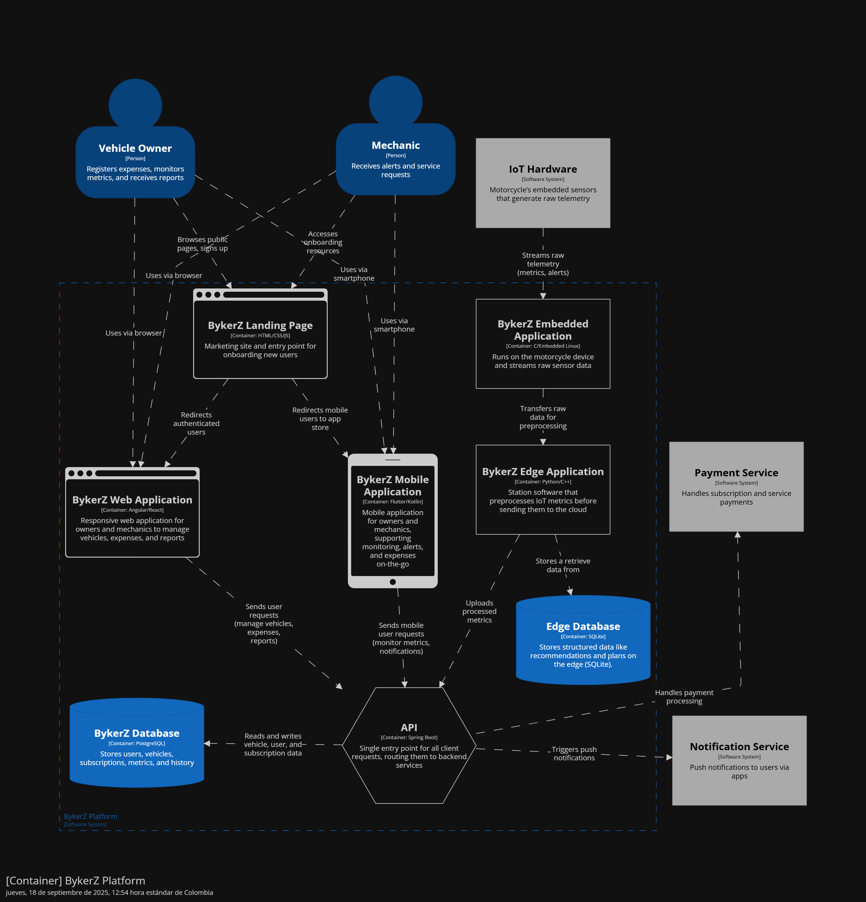

# Universidad Peruana de Ciencias Aplicadas

### **CURSO:** Desarrollo de Soluciones IoT

### **NRC**: 3443

### **Profesor:** Ángel Augusto Velásquez Núñez

### **Ingeniería de software**

## Informe de -

### **Nombre del startup:** NRG8

### **Nombre del producto:** -

## **Integrantes**

| **Nombre**                                | **Codigo** |
|-------------------------------------------|------------|
| **Alejo Cardenas Jose Antonio**           | U202122484 |
| **Astonitas Díaz Juan Diego**             | U202110237 |
| **Casas Sanchez Gabriel Alexander**       | U202220033 |
| **Pacheco Astiguetta Sebastian**          | U202110291 |
| **Paitan Pumachuca Max Anthony**          | U201314454 |
| **Pasquale Barrenechea Gianluca Santino** | U202112078 |
| **Real Calderon Sebatian Omar**           | U20221D964 |

**Agosto 2025**

## Registro de Versiones del Informe

<table>
  <thead>
    <tr>
      <th>Versión</th>
      <th>Fecha</th>
      <th>Autor</th>
      <th>Descripción de modificación</th>
    </tr>
  </thead>
  <tbody>
    <tr>
      <td></td>
      <td></td>
      <td></td>
      <td></td>
    </tr>
  </tbody>
</table>

## Project Report Collaboration Insights

El enlace a github del reporte del proyecto es el siguiente: [https://github.com/NRG-8-IOT/report](https://github.com/NRG-8-IOT/report).

## Contenido

- [Universidad Peruana de Ciencias Aplicadas](#universidad-peruana-de-ciencias-aplicadas)
    - [**CURSO:** Desarrollo de Soluciones IoT](#curso-desarrollo-de-soluciones-iot)
    - [**NRC**: 3443](#nrc-3443)
    - [**Profesor:** Ángel Augusto Velásquez Núñez](#profesor-ángel-augusto-velásquez-núñez)
    - [**Ingeniería de software**](#ingeniería-de-software)
  - [Informe de -](#informe-de--)
    - [**Nombre del startup:** NRG8](#nombre-del-startup-nrg8)
    - [**Nombre del producto:** -](#nombre-del-producto--)
  - [**Integrantes**](#integrantes)
  - [Registro de Versiones del Informe](#registro-de-versiones-del-informe)
  - [Project Report Collaboration Insights](#project-report-collaboration-insights)
  - [Contenido](#contenido)
  - [Student Outcome](#student-outcome)
  - [Capítulo I: Introducción](#capítulo-i-introducción)
    - [1.1 Startup Profile](#11-startup-profile)
      - [1.1.1 Descripción de la Startup](#111-descripción-de-la-startup)
      - [1.1.2 Perfiles de integrantes del equipo](#112-perfiles-de-integrantes-del-equipo)
    - [1.2 Solution Profile](#12-solution-profile)
      - [1.2.1 Antecedentes y problemática](#121-antecedentes-y-problemática)
      - [1.2.2 Lean UX Process](#122-lean-ux-process)
        - [1.2.2.1 Lean UX Problem Statements](#1221-lean-ux-problem-statements)
        - [1.2.2.2 Lean UX Assumptions](#1222-lean-ux-assumptions)
        - [1.2.2.3 Lean UX Hypothesis Statements](#1223-lean-ux-hypothesis-statements)
        - [1.2.2.4 Lean UX Canvas](#1224-lean-ux-canvas)
    - [1.3 Segmentos objetivo](#13-segmentos-objetivo)
  - [Capítulo II: Requirements Elicitation \& Analysis](#capítulo-ii-requirements-elicitation--analysis)
    - [2.1 Competidores](#21-competidores)
      - [2.1.1 Análisis competitivo](#211-análisis-competitivo)
      - [2.1.2 Estrategias y tácticas frente a competidores](#212-estrategias-y-tácticas-frente-a-competidores)
    - [2.2 Entrevistas](#22-entrevistas)
      - [2.2.1 Diseño de entrevistas](#221-diseño-de-entrevistas)
      - [2.2.2 Registro de entrevistas](#222-registro-de-entrevistas)
      - [2.2.3 Análisis de entrevistas](#223-análisis-de-entrevistas)
    - [2.3 Needfinding](#23-needfinding)
      - [2.3.1 User Personas](#231-user-personas)
      - [2.3.2 User Task Matrix](#232-user-task-matrix)
      - [2.3.3 User Journey Mapping](#233-user-journey-mapping)
      - [2.3.4 Empathy Mapping](#234-empathy-mapping)
    - [2.4 Big Picture EventStorming](#24-big-picture-eventstorming)
    - [2.5 Ubiquitous Language](#25-ubiquitous-language)
  - [Capítulo III: Requirements Specification](#capítulo-iii-requirements-specification)
    - [3.1 User Stories](#31-user-stories)
    - [3.2 Impact Mapping](#32-impact-mapping)
    - [3.3 Product Backlog](#33-product-backlog)
  - [Capítulo IV: Solution Software Design](#capítulo-iv-solution-software-design)
    - [4.1 Strategic-Level Attribute-Driven Design](#41-strategic-level-attribute-driven-design)
      - [4.1.1 Design-Level EventStorming](#411-design-level-eventstorming)
        - [4.1.1.1 Candidate Context Discovery](#4111-candidate-context-discovery)
        - [4.1.1.2 Domain Message Flows Modeling](#4112-domain-message-flows-modeling)
        - [4.1.1.3 Bounded Context Canvases](#4113-bounded-context-canvases)
      - [4.1.2 Context Mapping](#412-context-mapping)
      - [4.1.3 Software Architecture](#413-software-architecture)
        - [4.1.3.1 Software Architecture System Landscape Diagram](#4131-software-architecture-system-landscape-diagram)
        - [4.1.3.2 Software Architecture Context Level Diagrams](#4132-software-architecture-context-level-diagrams)
        - [4.1.3.3 Software Architecture Container Level Diagrams](#4133-software-architecture-container-level-diagrams)
        - [4.1.3.4 Software Architecture Deployment Diagrams](#4134-software-architecture-deployment-diagrams)
    - [4.2 Tactical-Level Domain-Driven Design](#42-tactical-level-domain-driven-design)
      - [4.2.1 Bounded Context: Gestión de Vehículos](#421-bounded-context-gestión-de-vehículos)
        - [4.2.1.1 Domain Layer](#4211-domain-layer)
        - [4.2.1.2 Interface Layer](#4212-interface-layer)
        - [4.2.1.3 Application Layer](#4213-application-layer)
        - [4.2.1.4 Infrastructure Layer](#4214-infrastructure-layer)
        - [4.2.1.5 Bounded Context Software Architecture Component Level Diagrams](#4215-bounded-context-software-architecture-component-level-diagrams)
        - [4.2.1.6 Bounded Context Software Architecture Code Level Diagrams](#4216-bounded-context-software-architecture-code-level-diagrams)
          - [4.2.1.6.1 Bounded Context Domain Layer Class Diagrams](#42161-bounded-context-domain-layer-class-diagrams)
          - [4.2.1.6.2 Bounded Context Database Design Diagram](#42162-bounded-context-database-design-diagram)
      - [4.2.2 Bounded Context: Historiales](#422-bounded-context-historiales)
        - [4.2.2.1 Domain Layer](#4221-domain-layer)
        - [4.2.2.2 Interface Layer](#4222-interface-layer)
        - [4.2.2.3 Application Layer](#4223-application-layer)
        - [4.2.2.4 Infrastructure Layer](#4224-infrastructure-layer)
        - [4.2.2.5 Bounded Context Software Architecture Component Level Diagrams](#4225-bounded-context-software-architecture-component-level-diagrams)
        - [4.2.2.6 Bounded Context Software Architecture Code Level Diagrams](#4226-bounded-context-software-architecture-code-level-diagrams)
          - [4.2.2.6.1 Bounded Context Domain Layer Class Diagrams](#42261-bounded-context-domain-layer-class-diagrams)
          - [4.2.2.6.2 Bounded Context Database Design Diagram](#42262-bounded-context-database-design-diagram)
      - [4.2.3 Bounded Context: Suscripción](#423-bounded-context-suscripción)
        - [4.2.3.1 Domain Layer](#4231-domain-layer)
        - [4.2.3.2 Interface Layer](#4232-interface-layer)
        - [4.2.3.3 Application Layer](#4233-application-layer)
        - [4.2.3.4 Infrastructure Layer](#4234-infrastructure-layer)
        - [4.2.3.5 Bounded Context Software Architecture Component Level Diagrams](#4235-bounded-context-software-architecture-component-level-diagrams)
        - [4.2.3.6 Bounded Context Software Architecture Code Level Diagrams](#4236-bounded-context-software-architecture-code-level-diagrams)
          - [4.2.3.6.1 Bounded Context Domain Layer Class Diagrams](#42361-bounded-context-domain-layer-class-diagrams)
          - [4.2.3.6.2 Bounded Context Database Design Diagram](#42362-bounded-context-database-design-diagram)
      - [4.2.4 Bounded Context: Bienestar de Vehículos](#424-bounded-context-bienestar-de-vehículos)
        - [4.2.4.1 Domain Layer](#4241-domain-layer)
        - [4.2.4.2 Interface Layer](#4242-interface-layer)
        - [4.2.4.3 Application Layer](#4243-application-layer)
        - [4.2.4.4 Infrastructure Layer](#4244-infrastructure-layer)
        - [4.2.4.5 Bounded Context Software Architecture Component Level Diagrams](#4245-bounded-context-software-architecture-component-level-diagrams)
        - [4.2.4.6 Bounded Context Software Architecture Code Level Diagrams](#4246-bounded-context-software-architecture-code-level-diagrams)
          - [4.2.4.6.1 Bounded Context Domain Layer Class Diagrams](#42461-bounded-context-domain-layer-class-diagrams)
          - [4.2.4.6.2 Bounded Context Database Design Diagram](#42462-bounded-context-database-design-diagram)
      - [4.2.5 Bounded Context: Reportes](#425-bounded-context-reportes)
        - [4.2.5.1 Domain Layer](#4251-domain-layer)
        - [4.2.5.2 Interface Layer](#4252-interface-layer)
        - [4.2.5.3 Application Layer](#4253-application-layer)
        - [4.2.5.4 Infrastructure Layer](#4254-infrastructure-layer)
        - [4.2.5.5 Bounded Context Software Architecture Component Level Diagrams](#4255-bounded-context-software-architecture-component-level-diagrams)
        - [4.2.5.6 Bounded Context Software Architecture Code Level Diagrams](#4256-bounded-context-software-architecture-code-level-diagrams)
          - [4.2.5.6.1 Bounded Context Domain Layer Class Diagrams](#42561-bounded-context-domain-layer-class-diagrams)
          - [4.2.5.6.2 Bounded Context Database Design Diagram](#42562-bounded-context-database-design-diagram)
  - [Conclusiones](#conclusiones)
  - [Bibliografía](#bibliografía)
  - [Anexos](#anexos)

## Student Outcome

El curso contribuye al cumplimiento del Student Outcome ABET:

**ABET – EAC - Student Outcome 5**

Criterio: *La capacidad de funcionar efectivamente en un equipo cuyos miembros juntos proporcionan liderazgo, crean un entorno de colaboración e inclusivo, establecen objetivos, planifican tareas y cumplen objetivos.*
En el siguiente cuadro se describe las acciones realizadas y enunciados de
conclusiones por parte del grupo, que permiten sustentar el haber alcanzado el logro
del ABET – EAC - Student Outcome 5.

<table>
  <thead>
    <tr>
      <th style="text-align: left;">Criterio específico</th>
      <th style="text-align: left;">Acciones realizadas</th>
      <th style="text-align: left;">Conclusiones</th>
    </tr>
  </thead>
  <tbody>
    <tr>
      <td><strong>Trabaja en equipo para proporcionar liderazgo en forma conjunta</strong></td>
      <td>
        -
      </td>
      <td>
        -
      </td>
    </tr>
    <tr>
      <td><strong>Crea un entorno colaborativo e inclusivo, establece metas, planifica tareas y cumple objetivos.</strong></td>
      <td>
        -
      </td>
      <td>
        -
      </td>
    </tr>
  </tbody>
</table>

## Capítulo I: Introducción

### 1.1 Startup Profile

#### 1.1.1 Descripción de la Startup

#### 1.1.2 Perfiles de integrantes del equipo

### 1.2 Solution Profile

#### 1.2.1 Antecedentes y problemática

#### 1.2.2 Lean UX Process

##### 1.2.2.1 Lean UX Problem Statements

##### 1.2.2.2 Lean UX Assumptions

##### 1.2.2.3 Lean UX Hypothesis Statements

##### 1.2.2.4 Lean UX Canvas

### 1.3 Segmentos objetivo

## Capítulo II: Requirements Elicitation & Analysis

### 2.1 Competidores

#### 2.1.1 Análisis competitivo

#### 2.1.2 Estrategias y tácticas frente a competidores

### 2.2 Entrevistas

#### 2.2.1 Diseño de entrevistas

#### 2.2.2 Registro de entrevistas

#### 2.2.3 Análisis de entrevistas

### 2.3 Needfinding

#### 2.3.1 User Personas

#### 2.3.2 User Task Matrix

#### 2.3.3 User Journey Mapping

#### 2.3.4 Empathy Mapping

### 2.4 Big Picture EventStorming

### 2.5 Ubiquitous Language

## Capítulo III: Requirements Specification

### 3.1 User Stories

### 3.2 Impact Mapping

### 3.3 Product Backlog

## Capítulo IV: Solution Software Design

### 4.1 Strategic-Level Attribute-Driven Design

En esta sección se aborda el diseño de la arquitectura desde una perspectiva estratégica, aplicando el enfoque Attribute-Driven Design (ADD). Este método permite vincular los objetivos de negocio con las decisiones arquitectónicas, asegurando que la solución no solo responda a los requerimientos funcionales, sino también a atributos de calidad como escalabilidad, mantenibilidad y desempeño. El propósito es establecer una base conceptual sólida que guíe la definición de contextos, interacciones y responsabilidades dentro del dominio del sistema.

#### 4.1.1 Design-Level EventStorming

Para trasladar la estrategia al plano operativo, se utiliza EventStorming como técnica colaborativa de modelado. Esta metodología, centrada en la identificación de eventos de dominio, facilita la exploración profunda del negocio y la detección de flujos críticos de información. A través de dinámicas visuales y participativas, se descubren los límites naturales del dominio y se modelan las interacciones entre actores, comandos y proyecciones. El objetivo es traducir la visión estratégica en un diseño claro, alineado con el lenguaje ubicuo y la realidad operativa del sistema.

##### 4.1.1.1 Candidate Context Discovery

Tras la sesión de EventStorming, aplicando las técnicas de start-with-value y look-for-pivotal-events, el equipo identificó y agrupó los principales eventos del dominio en bounded contexts candidatos. A continuación, se describen los bounded contexts definidos:

**1. Reportes**

* **Propósito:** Elaboración de reportes de métricas de las motos y análisis comparativo de su desempeño.
* **Responsabilidades:**
  * Generar reportes periódicos de métricas.
  * Comparar métricas históricas y actuales.
  * Producir reportes de métricas actualizadas en tiempo real.
* **Eventos clave:** MetricasGeneradas, ReporteSolicitado, ReporteComparado.
* **Valor para el negocio:** Provee visibilidad y soporte a la toma de decisiones del dueño de la moto y de los talleres.

**2. Historiales**

* **Propósito:** Mantener un registro consolidado de todas las actividades y gastos relacionados con la moto.
* **Responsabilidades:**
  * Historial de servicios de los mecánicos.
  * Historial de gastos asociados.
  * Historial de reparaciones realizadas.
  * Historial de clientes atendidos (para mecánicos).
* **Eventos clave:** ServicioRegistrado, GastoRegistrado, ReparacionFinalizada.
* **Valor para el negocio:** Ofrece trazabilidad y respaldo de la información para usuarios y mecánicos.

**3. Suscripción**

* **Propósito:** Gestionar la relación contractual y de conexión entre dueños de motos y mecánicos.
* **Responsabilidades:**
  * Manejar las suscripciones activas.
  * Administrar vínculos de servicio (mecánico ↔ dueño de moto).
  * Controlar renovaciones o cancelaciones de suscripciones.
* **Eventos clave:** SuscripcionCreada, SuscripcionCancelada, MecanicoAsignado.
* **Valor para el negocio:** Garantiza un flujo de ingresos estable y facilita la conexión entre oferta (mecánicos) y demanda (dueños).

**4. Bienestar de Vehículos**

* **Propósito:** Monitorear y gestionar el estado general de la moto a partir de métricas técnicas.
* **Responsabilidades:**
  * Registrar y controlar métricas en tiempo real.
  * Generar alertas preventivas de mantenimiento.
  * Calcular el estado de salud general del vehículo.
* **Eventos clave:** MetricaRegistrada, AlertaGenerada, EstadoActualizado.
* **Valor para el negocio:** Permite anticipar fallas y garantizar mayor seguridad y durabilidad del vehículo.

**5. Gestión de Vehículos**

* **Propósito:** Administrar la información básica y de registro de cada moto en el sistema.
* **Responsabilidades:**
  * Registro de nuevas motos.
  * Acceso a datos técnicos y de propiedad.
  * Actualización de datos generales del vehículo.
* **Eventos clave:** VehiculoRegistrado, DatosVehiculoActualizados.
* **Valor para el negocio:** Provee la base de datos central sobre la cual interactúan los demás contextos.

##### 4.1.1.2 Domain Message Flows Modeling

**Caso 1: Registro de gastos**
1. El dueño de la moto registra un gasto en la aplicación.
2. El contexto de Gestión de Vehículos recibe el evento GastoRegistrado.
3. El contexto de Historiales actualiza el historial del vehículo con el nuevo gasto.
4. El contexto de Reportes genera un reporte actualizado con el nuevo gasto.

**Caso 2: Conexión entre dueño y mecánico**
1. El dueño de la moto solicita una suscripción a un mecánico.
2. El contexto de Suscripción crea una nueva suscripción y emite el evento SuscripcionCreada.
3. El contexto de Gestión de Vehículos actualiza el estado del vehículo con el nuevo mecánico asignado.
4. El contexto de Bienestar de Vehículos comienza a monitorear el vehículo bajo la nueva suscripción.
5. El Historial registra al nuevo mecánico en la cuenta del dueño.

**Caso 3: Alerta preventiva de mantenimiento**
1. El contexto de Bienestar de Vehículos detecta una métrica crítica y genera el evento AlertaGenerada.
2. El contexto de Gestión de Vehículos recibe la alerta y notifica al dueño de la moto.
3. El contexto de Historiales registra la alerta en el historial del vehículo.
4. El contexto de Reportes actualiza los reportes con la nueva alerta.

**Caso 4: Generar reporte de métricas**
1. El dueño de la moto solicita un reporte de métricas.
2. El contexto de Reportes recibe la solicitud y genera el reporte basado en las métricas actuales.
3. El contexto de Bienestar de Vehículos proporciona las métricas necesarias para el reporte.
4. El reporte es entregado al dueño de la moto.

**Caso 5: Agendar servicio con mecánico**
1. El dueño de la moto agenda un servicio con su mecánico a través de la aplicación.
2. El contexto de Suscripción verifica la suscripción activa y emite el evento ServicioAgendado.
3. El contexto de Historiales registra el servicio agendado en el historial del vehículo.
4. El contexto de Gestión de Vehículos actualiza el estado del vehículo con la información del servicio.
5. El mecánico recibe la notificación del servicio agendado.

**Caso 6: Recomendación de cita**
1. El contexto de Bienestar de Vehículos detecta que una métrica ha alcanzado un umbral crítico y genera el evento RecomendacionCitaGenerada.
2. El contexto de Gestión de Vehículos recibe la recomendación y notifica al dueño de la moto.
3. El contexto de Suscripción sugiere al dueño agendar una cita con su mecánico.
4. El Historial registra la recomendación en el historial del vehículo.
5. El dueño de la moto agenda la cita a través de la aplicación.

**Caso 7: Actualización de datos del vehículo**
1. El dueño de la moto actualiza los datos técnicos o de propiedad del vehículo en la aplicación.
2. El contexto de Gestión de Vehículos recibe la actualización y emite el evento DatosVehiculoActualizados.
3. El contexto de Historiales actualiza el historial del vehículo con los nuevos datos.
4. El contexto de Reportes genera un reporte actualizado con la nueva información del vehículo.
5. El contexto de Bienestar de Vehículos ajusta sus parámetros de monitoreo según los nuevos datos.

##### 4.1.1.3 Bounded Context Canvases

En esta sección se desarrollan los Bounded Context Canvases correspondientes a los contextos delimitados previamente durante el proceso de Candidate Context Discovery. El objetivo principal de este apartado es detallar, para cada contexto, los criterios de diseño que permitan comprender su propósito, límites de responsabilidad, capacidades clave, dependencias y reglas de negocio asociadas.

**Reportes**

**Historiales**

**Suscripción**

**Bienestar de Vehículos**

**Gestión de Vehículos**

#### 4.1.2 Context Mapping

En esta sección se presenta el proceso de Context Mapping, cuyo propósito es identificar, analizar y documentar las relaciones estructurales entre los bounded contexts previamente definidos. El objetivo es comprender cómo interactúan, cuáles son sus dependencias y qué patrones de integración de Domain-Driven Design son más adecuados.

| **Contexto A**       | **Contexto B**         | **Relación (DDD)**          | **Justificación**                                                                                                  |
|----------------------|------------------------|-----------------------------|--------------------------------------------------------------------------------------------------------------------|
| Gestión de Vehículos | Bienestar de Vehículos | Customer/Supplier           | El estado de bienestar depende de la información estructural de los vehículos, como mantenimientos o revisiones.   |
| Gestión de Vehículos | Suscripción            | Customer/Supplier           | Las suscripciones requieren la información base de los vehículos para activar planes y beneficios asociados.       |
| Historiales          | Bienestar de Vehículos | Conformist                  | Historiales se adapta al modelo de Bienestar de Vehículos, siguiendo su esquema para registrar datos consistentes. |
| Historiales          | Gestión de Vehículos   | Customer/Supplier           | Los historiales se construyen a partir de la información de los vehículos, consumiendo sus datos.                  |
| Reportes             | Historiales            | Shared Kernel               | Ambos comparten datos e interpretación de eventos históricos para garantizar consistencia en los reportes.         |
| Reportes             | Suscripción            | Anti-Corruption Layer (ACL) | Se aísla el modelo de Reportes de la complejidad de Suscripción mediante una capa de traducción.                   |

#### 4.1.3 Software Architecture

La arquitectura de software de la solución se ha representado utilizando el modelo C4, el cual permite visualizar la estructura en diferentes niveles de abstracción. Se incluyen los diagramas de System Landscape, System Context y Container Level, con el fin de mostrar desde la visión global del ecosistema hasta la organización interna de la aplicación. Para su elaboración se empleó la herramienta Structurizr, que sigue los lineamientos de C4 Model.

##### 4.1.3.1 Software Architecture System Landscape Diagram

##### 4.1.3.2 Software Architecture Context Level Diagrams

##### 4.1.3.3 Software Architecture Container Level Diagrams

##### 4.1.3.4 Software Architecture Deployment Diagrams

### 4.2 Tactical-Level Domain-Driven Design

#### 4.2.1 Bounded Context: Gestión de Vehículos

##### 4.2.1.1 Domain Layer
### Aggregate: `Vehicle`
**Descripción**: Representa la moto registrada por el dueño en el sistema. Contiene los detalles para identificar el vehículo así como su estado actual.

| Atributos           | Tipo de dato  | Visibilidad | Descripción                                  |
|---------------------|---------------|-------------|----------------------------------------------|
| id                  | Long          | Private     | Identificador único del vehículo.            |
| ownerId             | Long          | Private     | ID del dueño de la moto.                     |
| vin                 | String        | Private     | Número de identificación del vehículo (VIN). |
| plateNumber         | String        | Private     | Número de placa del vehículo.                |
| model               | String        | Private     | Modelo del vehículo.                         |
| brand               | String        | Private     | Marca del vehículo.                          |
| status              | VehicleStatus | Private     | Estado actual del vehículo.                  |
| year                | Integer       | Private     | Año de fabricación del vehículo.             |
| color               | String        | Private     | Color del vehículo.                          |
| authorizedMecanicId | Long          | Private     | ID del mecánico autorizado para el vehículo. |

| Métodos                    | Tipo de retorno | Visibilidad | Descripción                                 |
|----------------------------|-----------------|-------------|---------------------------------------------|
| registerVehicle()          | void            | Public      | Registra un nuevo vehículo en el sistema.   |
| updateVehicleDetails()     | void            | Public      | Actualiza los detalles del vehículo.        |
| getVehicleStatus()         | VehicleStatus   | Public      | Obtiene el estado actual del vehículo.      |
| assignAuthorizedMechanic() | void            | Public      | Asigna un mecánico autorizado al vehículo.  |
| assignNewOwner()           | void            | Public      | Cambia el dueño del vehículo.               |
| revokeAuthorizedMechanic() | void            | Public      | Revoca el mecánico autorizado del vehículo. |

##### 4.2.1.2 Interface Layer

### Controlador: `VehicleController`
**Descripción:** Controlador REST que maneja las operaciones relacionadas con la gestión de vehículos.

| Método               | Ruta                                                      | Descripción                                 |
|----------------------|-----------------------------------------------------------|---------------------------------------------|
| addVehicle()         | POST /api/v1/vehicles/                                    | Registra un nuevo vehículo.                 |
| updateVehicle()      | PUT /api/v1/vehicles/{vehicleId}                          | Actualiza los detalles de un vehículo.      |
| updateVehicleOwner() | PATCH /api/v1/vehicles/{vehicleId}/owner                  | Cambia el dueño del vehículo.               |
| authorizeMechanic()  | POST /api/v1/vehicles/{vehicleId}/mechanic                | Asigna un mecánico autorizado al vehículo.  |
| revokeMechanic()     | DELETE /api/v1/vehicles/{vehicleId}/mechanic/{mechanicId} | Revoca el mecánico autorizado del vehículo. |
| getVehicle()         | GET /api/v1/vehicles/{vehicleId}                          | Consulta los detalles de un vehículo.       |
| getMechanic()        | GET /api/v1/mechanics/{mechanicId}                        | Consulta los detalles de un mecánico.       |

**Dependencias:**

| Dependencia                                    | Descripción                                                                          |
|------------------------------------------------|--------------------------------------------------------------------------------------|
| VehicleCommandService                          | Servicio para manejar comandos relacionados con vehículos.                           |
| VehicleQueryService                            | Servicio para manejar consultas relacionadas con vehículos.                          |
| CreateVehicleCommandFromResourceAssembler      | Ensamblador para convertir recursos REST a comandos para creación de vehículos.      |
| UpdateVehicleCommandFromResourceAssembler      | Ensamblador para convertir recursos REST a comandos para actualización de vehículos. |
| UpdateVehicleOwnerCommandFromResourceAssembler | Ensamblador para convertir recursos REST a comandos para actualización de dueños.    |
| VehicleResourceFromEntityAssembler             | Ensamblador para convertir entidades de vehículos a recursos REST.                   |

##### 4.2.1.3 Application Layer

### Clase: `VehicleCommandServiceImpl`
**Descripción:** Implementación del servicio de comandos para la gestión de vehículos.

| Método                                   | Descripción                                 |
|------------------------------------------|---------------------------------------------|
| handle(CreateVehicleCommand)             | Crea un nuevo vehículo.                     |
| handle(UpdateVehicleCommand)             | Actualiza los detalles de un vehículo.      |
| handle(UpdateVehicleOwnerCommand)        | Cambia el dueño del vehículo.               |
| handle(AddMechanicToVehicleCommand)      | Asigna un mecánico autorizado al vehículo.  |
| handle(RemoveMechanicFromVehicleCommand) | Revoca el mecánico autorizado del vehículo. |

**Dependencias:**

| Dependencia                      | Descripción                                      |
|----------------------------------|--------------------------------------------------|
| VehicleRepository                | Repositorio para consultar datos de vehículos.   |
| CreateVehicleCommand             | Comando para crear un vehículo.                  |
| UpdateVehicleCommand             | Comando para actualizar un vehículo.             |
| UpdateVehicleOwnerCommand        | Comando para actualizar el dueño de un vehículo. |
| AddMechanicToVehicleCommand      | Comando para asignar un mecánico a un vehículo.  |
| RemoveMechanicFromVehicleCommand | Comando para revocar un mecánico de un vehículo. |

### Clase: `VehicleQueryServiceImpl`
**Descripción:** Implementación del servicio de consultas para la gestión de vehículos.

| Método                               | Descripción                                           |
|--------------------------------------|-------------------------------------------------------|
| handle(GetVehicleByIdQuery)          | Obtiene un vehículo por su ID.                        |
| handle(GetOwnerByIdQuery)            | Obtiene un dueño por su ID.                           |
| handle(GetMechanicByIdQuery)         | Obtiene un mecánico por su ID.                        |
| handle(GetVehiclesByOwnerIdQuery)    | Obtiene todos los vehículos de un dueño               |
| handle(GetVehiclesByMechanicIdQuery) | Obtiene todos los vehículos vinculados a un mecánico. |
| handle(GetVehicleByVinQuery)         | Obtiene un vehículo por su VIN.                       |

**Dependencias:**

| Dependencia                  | Descripción                                           |
|------------------------------|-------------------------------------------------------|
| VehicleRepository            | Repositorio para acceder a datos de vehículos.        |
| GetVehicleByIdQuery          | Obtiene un vehículo por su ID.                        |
| GetOwnerByIdQuery            | Obtiene un dueño por su ID.                           |
| GetMechanicByIdQuery         | Obtiene un mecánico por su ID.                        |
| GetVehiclesByOwnerIdQuery    | Obtiene todos los vehículos de un dueño.              |
| GetVehiclesByMechanicIdQuery | Obtiene todos los vehículos vinculados a un mecánico. |
| GetVehicleByVinQuery         | Obtiene un vehículo por su VIN.                       |

##### 4.2.1.4 Infrastructure Layer

### Clase: `VehicleRepository`
**Descripción:** Interfaz de persistencia para operaciones CRUD y consultas de datos de vehículos.

| Método                            | Descripción                                |
|-----------------------------------|--------------------------------------------|
| save(Vehicle vehicle)             | Guarda o actualiza un vehículo.            |
| findById(Long id)                 | Busca un vehículo por su ID.               |
| findByVin(String vin)             | Busca un vehículo por su VIN.              |
| findByOwnerId(Long ownerId)       | Busca vehículos por ID de dueño.           |
| findByMechanicId(Long mechanicId) | Busca vehículos por ID de mecánico.        |
| existsByVin(String vin)           | Verifica si un vehículo existe por su VIN. |
| deleteById(Long id)               | Elimina un vehículo por su ID.             |

##### 4.2.1.5 Bounded Context Software Architecture Component Level Diagrams

##### 4.2.1.6 Bounded Context Software Architecture Code Level Diagrams

###### 4.2.1.6.1 Bounded Context Domain Layer Class Diagrams

###### 4.2.1.6.2 Bounded Context Database Design Diagram

#### 4.2.2 Bounded Context: Historiales

##### 4.2.2.1 Domain Layer

<h3>Aggregate: <code>ServiceHistory</code></h3>

<strong>Descripción:</strong> Representa el registro histórico de servicios de mantenimiento y reparaciones realizadas a un vehículo, incluyendo detalles de gastos, repuestos utilizados y mecánicos involucrados.

<table>
  <thead>
    <tr>
      <th>Atributos</th>
      <th>Tipo de dato</th>
      <th>Visibilidad</th>
      <th>Descripción</th>
    </tr>
  </thead>
  <tbody>
    <tr>
      <td>id</td>
      <td>Long</td>
      <td>Private</td>
      <td>Identificador único del registro de servicio.</td>
    </tr>
    <tr>
      <td>vehicleId</td>
      <td>Long</td>
      <td>Private</td>
      <td>ID del vehículo al que se le realizó el servicio.</td>
    </tr>
    <tr>
      <td>ownerId</td>
      <td>Long</td>
      <td>Private</td>
      <td>ID del dueño de la moto.</td>
    </tr>
    <tr>
      <td>mechanicId</td>
      <td>Long</td>
      <td>Private</td>
      <td>ID del mecánico que realizó el servicio.</td>
    </tr>
    <tr>
      <td>serviceType</td>
      <td>ServiceType</td>
      <td>Private</td>
      <td>Tipo de servicio realizado (mantenimiento, reparación, revisión).</td>
    </tr>
    <tr>
      <td>serviceDate</td>
      <td>Timestamp</td>
      <td>Private</td>
      <td>Fecha en que se realizó el servicio.</td>
    </tr>
    <tr>
      <td>mileage</td>
      <td>Integer</td>
      <td>Private</td>
      <td>Kilometraje del vehículo al momento del servicio.</td>
    </tr>
    <tr>
      <td>description</td>
      <td>String</td>
      <td>Private</td>
      <td>Descripción detallada del servicio realizado.</td>
    </tr>
    <tr>
      <td>totalCost</td>
      <td>BigDecimal</td>
      <td>Private</td>
      <td>Costo total del servicio.</td>
    </tr>
    <tr>
      <td>createdAt</td>
      <td>Timestamp</td>
      <td>Private</td>
      <td>Fecha de creación del registro.</td>
    </tr>
    <tr>
      <td>updatedAt</td>
      <td>Timestamp</td>
      <td>Private</td>
      <td>Última fecha de actualización.</td>
    </tr>
  </tbody>
</table>

<table>
  <thead>
    <tr>
      <th>Métodos</th>
      <th>Tipo de retorno</th>
      <th>Visibilidad</th>
      <th>Descripción</th>
    </tr>
  </thead>
  <tbody>
    <tr>
      <td>addServiceItem(ServiceItem)</td>
      <td>void</td>
      <td>Public</td>
      <td>Agrega un ítem de servicio al historial.</td>
    </tr>
    <tr>
      <td>calculateTotalCost()</td>
      <td>BigDecimal</td>
      <td>Public</td>
      <td>Calcula el costo total sumando todos los ítems.</td>
    </tr>
  </tbody>
</table>

<h3>Entidad: <code>ServiceItem</code></h3>

<strong>Descripción:</strong> Representa un ítem específico dentro de un servicio, que puede ser un repuesto, mano de obra u otro concepto facturable.

<table>
  <thead>
    <tr>
      <th>Atributos</th>
      <th>Tipo de dato</th>
      <th>Visibilidad</th>
      <th>Descripción</th>
    </tr>
  </thead>
  <tbody>
    <tr>
      <td>id</td>
      <td>Long</td>
      <td>Private</td>
      <td>Identificador único del ítem.</td>
    </tr>
    <tr>
      <td>serviceHistoryId</td>
      <td>Long</td>
      <td>Private</td>
      <td>ID del historial de servicio al que pertenece.</td>
    </tr>
    <tr>
      <td>itemType</td>
      <td>ItemType</td>
      <td>Private</td>
      <td>Tipo de ítem (repuesto, mano de obra, otros).</td>
    </tr>
    <tr>
      <td>description</td>
      <td>String</td>
      <td>Private</td>
      <td>Descripción del ítem.</td>
    </tr>
    <tr>
      <td>quantity</td>
      <td>Integer</td>
      <td>Private</td>
      <td>Cantidad del ítem.</td>
    </tr>
    <tr>
      <td>unitPrice</td>
      <td>BigDecimal</td>
      <td>Private</td>
      <td>Precio unitario del ítem.</td>
    </tr>
  </tbody>
</table>

<table>
  <thead>
    <tr>
      <th>Métodos</th>
      <th>Tipo de retorno</th>
      <th>Visibilidad</th>
      <th>Descripción</th>
    </tr>
  </thead>
  <tbody>
    <tr>
      <td>calculateTotal()</td>
      <td>BigDecimal</td>
      <td>Public</td>
      <td>Calcula el precio total del ítem.</td>
    </tr>
  </tbody>
</table>

<h3>Entidad: <code>ExpenseHistory</code></h3>

<strong>Descripción:</strong>Registra todos los gastos asociados a un vehículo, no necesariamente relacionados con servicios de mantenimiento.

<table>
  <thead>
    <tr>
      <th>Atributos</th>
      <th>Tipo de dato</th>
      <th>Visibilidad</th>
      <th>Descripción</th>
    </tr>
  </thead>
  <tbody>
    <tr>
      <td>id</td>
      <td>Long</td>
      <td>Private</td>
      <td>Identificador único del gasto.</td>
    </tr>
    <tr>
      <td>vehicleId</td>
      <td>Long</td>
      <td>Private</td>
      <td>ID del vehículo asociado.</td>
    </tr>
    <tr>
      <td>ownerId</td>
      <td>Long</td>
      <td>Private</td>
      <td>ID del dueño de la moto.</td>
    </tr>
    <tr>
      <td>expenseType</td>
      <td>ExpenseType</td>
      <td>Private</td>
      <td>Tipo de gasto (combustible, seguro, impuestos, otros).</td>
    </tr>
    <tr>
      <td>expenseDate</td>
      <td>Timestamp</td>
      <td>Private</td>
      <td>Fecha del gasto.</td>
    </tr>
    <tr>
      <td>description</td>
      <td>String</td>
      <td>Private</td>
      <td>Descripción del gasto.</td>
    </tr>
    <tr>
      <td>amount</td>
      <td>BigDecimal</td>
      <td>Private</td>
      <td>Monto del gasto.</td>
    </tr>
    <tr>
      <td>mileage</td>
      <td>Integer</td>
      <td>Private</td>
      <td>Kilometraje al momento del gasto.</td>
    </tr>
  </tbody>
</table>

##### 4.2.2.2 Interface Layer

<h3>Controlador:<code>HistoryController</code></h3>
<table>
  <tr>
    <th>Título</th>
    <td>HistoryController</td>
  </tr>
  <tr>
    <th>Descripción</th>
    <td>Controlador REST que maneja las operaciones relacionadas con el historial de servicios, gastos y reparaciones de vehículos.</td>
  </tr>
</table>

<table>
  <thead>
    <tr>
      <th>Método</th>
      <th>Ruta</th>
      <th>Descripción</th>
    </tr>
  </thead>
  <tbody>
    <tr>
      <td>getServiceHistory(Long vehicleId)</td>
      <td>GET /api/v1/history/service/{vehicleId}</td>
      <td>Obtiene el historial completo de servicios de un vehículo.</td>
    </tr>
    <tr>
      <td>getServiceHistoryById(Long id)</td>
      <td>GET /api/v1/history/service/{id}</td>
      <td>Obtiene un servicio específico por su ID.</td>
    </tr>
    <tr>
      <td>addServiceHistory(ServiceHistory history)</td>
      <td>POST /api/v1/history/service</td>
      <td>Agrega un nuevo registro de servicio al historial.</td>
    </tr>
    <tr>
      <td>updateServiceHistory(Long id, ServiceHistory history)</td>
      <td>PUT /api/v1/history/service/{id}</td>
      <td>Actualiza un registro de servicio existente.</td>
    </tr>
    <tr>
      <td>deleteServiceHistory(Long id)</td>
      <td>DELETE /api/v1/history/service/{id}</td>
      <td>Elimina un registro de servicio.</td>
    </tr>
    <tr>
      <td>getExpenseHistory(Long vehicleId)</td>
      <td>GET /api/v1/history/expense/{vehicleId}</td>
      <td>Obtiene el historial completo de gastos de un vehículo.</td>
    </tr>
    <tr>
      <td>addExpenseHistory(ExpenseHistory history)</td>
      <td>POST /api/v1/history/expense</td>
      <td>Agrega un nuevo registro de gasto al historial.</td>
    </tr>
    <tr>
      <td>getMonthlySummary(Long vehicleId, int year, string month)</td>
      <td>GET /api/v1/history/summary/{vehicleId}/{year}/{month}</td>
      <td>Obtiene un resumen mensual de servicios y gastos.</td>
    </tr>
    <tr>
      <td>getMaintenanceTimeline(Long vehicleId)</td>
      <td>GET /api/v1/history/timeline/{vehicleId}</td>
      <td>Obtiene una línea de tiempo de todos los mantenimientos.</td>
    </tr>
    <tr>
      <td>exportHistoryReport(Long vehicleId)</td>
      <td>GET /api/v1/history/export/{vehicleId}</td>
      <td>Exporta el historial completo a formato PDF/Excel.</td>
    </tr>
  </tbody>
</table>

<h4>Dependencias:</h4>
<table>
  <thead>
    <tr>
      <th>Dependencia</th>
      <th>Descripción</th>
    </tr>
  </thead>
  <tbody>
    <tr>
      <td>HistoryQueryService</td>
      <td>Servicio para consultas y recuperación de datos de historiales.</td>
    </tr>
    <tr>
      <td>HistoryCommandService</td>
      <td>Servicio para ejecutar comandos de creación, actualización y eliminación de registros históricos.</td>
    </tr>
    <tr>
      <td>CreateServiceHistoryCommandFromResourceAssembler</td>
      <td>Convierte recursos REST en comandos de creación de historiales de servicio.</td>
    </tr>
    <tr>
      <td>CreateExpenseHistoryCommandFromResourceAssembler</td>
      <td>Convierte recursos REST en comandos de creación de historiales de gastos.</td>
    </tr>
    <tr>
      <td>HistoryResourceFromEntityAssembler</td>
      <td>Convierte entidades de historial en recursos REST para la respuesta.</td>
    </tr>
  </tbody>
</table>

##### 4.2.2.3 Application Layer

<h3>Clase: <code>HistoryQueryServiceImpl</code></h3>
<table>
  <tr>
    <th>Título</th>
    <td>HistoryQueryServiceImpl</td>
  </tr>
  <tr>
    <th>Descripción</th>
    <td>Implementación del servicio de consultas para operaciones de lectura relacionadas con historiales de servicios y gastos.</td>
  </tr>
</table>

<table>
  <thead>
    <tr>
      <th>Método</th>
      <th>Descripción</th>
    </tr>
  </thead>
  <tbody>
    <tr>
      <td>handle(GetServiceHistoryByVehicleQuery)</td>
      <td>Obtiene el historial completo de servicios de un vehículo.</td>
    </tr>
    <tr>
      <td>handle(GetServiceHistoryByIdQuery)</td>
      <td>Obtiene un servicio específico por su ID.</td>
    </tr>
    <tr>
      <td>handle(GetExpenseHistoryByVehicleQuery)</td>
      <td>Obtiene el historial completo de gastos de un vehículo.</td>
    </tr>
    <tr>
      <td>handle(GetMonthlySummaryQuery)</td>
      <td>Obtiene un resumen mensual de servicios y gastos.</td>
    </tr>
    <tr>
      <td>handle(GetMaintenanceTimelineQuery)</td>
      <td>Obtiene una línea de tiempo de todos los mantenimientos.</td>
    </tr>
    <tr>
      <td>handle(GetServicesByTypeQuery)</td>
      <td>Filtra servicios por tipo.</td>
    </tr>
    <tr>
      <td>handle(GetServicesByDateRangeQuery)</td>
      <td>Obtiene servicios dentro de un rango de fechas.</td>
    </tr>
    <tr>
      <td>handle(GetExpensesByTypeQuery)</td>
      <td>Filtra gastos por tipo.</td>
    </tr>
    <tr>
      <td>handle(GetExpensesByDateRangeQuery)</td>
      <td>Obtiene gastos dentro de un rango de fechas.</td>
    </tr>
    <tr>
      <td>handle(GetTotalInvestmentQuery)</td>
      <td>Calcula la inversión total en un vehículo.</td>
    </tr>
  </tbody>
</table>

<h4>Dependencias:</h4>
<table>
  <thead>
    <tr>
      <th>Dependencia</th>
      <th>Descripción</th>
    </tr>
  </thead>
  <tbody>
    <tr>
      <td>ServiceHistoryRepository</td>
      <td>Repositorio para acceso a datos de historiales de servicio.</td>
    </tr>
    <tr>
      <td>ExpenseHistoryRepository</td>
      <td>Repositorio para acceso a datos de historiales de gastos.</td>
    </tr>
    <tr>
      <td>ServiceItemRepository</td>
      <td>Repositorio para acceso a datos de ítems de servicio.</td>
    </tr>
    <tr>
      <td>GetServiceHistoryByVehicleQuery</td>
      <td>Query para obtener historial de servicios por vehículo.</td>
    </tr>
    <tr>
      <td>GetServiceHistoryByIdQuery</td>
      <td>Query para obtener servicio por ID.</td>
    </tr>
    <tr>
      <td>GetExpenseHistoryByVehicleQuery</td>
      <td>Query para obtener historial de gastos por vehículo.</td>
    </tr>
    <tr>
      <td>GetMonthlySummaryQuery</td>
      <td>Query para obtener resumen mensual.</td>
    </tr>
    <tr>
      <td>GetMaintenanceTimelineQuery</td>
      <td>Query para obtener línea de tiempo de mantenimientos.</td>
    </tr>
    <tr>
      <td>GetServicesByTypeQuery</td>
      <td>Query para filtrar servicios por tipo.</td>
    </tr>
    <tr>
      <td>GetServicesByDateRangeQuery</td>
      <td>Query para obtener servicios por rango de fechas.</td>
    </tr>
    <tr>
      <td>GetExpensesByTypeQuery</td>
      <td>Query para filtrar gastos por tipo.</td>
    </tr>
    <tr>
      <td>GetExpensesByDateRangeQuery</td>
      <td>Query para obtener gastos por rango de fechas.</td>
    </tr>
    <tr>
      <td>GetTotalInvestmentQuery</td>
      <td>Query para calcular inversión total.</td>
    </tr>
  </tbody>
</table>

<h3>Clase: <code>HistoryCommandServiceImpl</code></h3>
<table>
  <tr>
    <th>Título</th>
    <td>HistoryCommandServiceImpl</td>
  </tr>
  <tr>
    <th>Descripción</th>
    <td>Implementación del servicio de comandos para operaciones de escritura relacionadas con historiales de servicios y gastos.</td>
  </tr>
</table>

<table>
  <thead>
    <tr>
      <th>Método</th>
      <th>Descripción</th>
    </tr>
  </thead>
  <tbody>
    <tr><td>handle(CreateServiceHistoryCommand)</td><td>Crea un nuevo registro de servicio en el historial.</td></tr>
    <tr><td>handle(UpdateServiceHistoryCommand)</td><td>Actualiza un registro de servicio existente.</td></tr>
    <tr><td>handle(DeleteServiceHistoryCommand)</td><td>Elimina un registro de servicio.</td></tr>
    <tr><td>handle(CreateExpenseHistoryCommand)</td><td>Crea un nuevo registro de gasto en el historial.</td></tr>
    <tr><td>handle(UpdateExpenseHistoryCommand)</td><td>Actualiza un registro de gasto existente.</td></tr>
    <tr><td>handle(DeleteExpenseHistoryCommand)</td><td>Elimina un registro de gasto.</td></tr>
    <tr><td>handle(AddServiceItemCommand)</td><td>Agrega un ítem de servicio a un registro existente.</td></tr>
    <tr><td>handle(RemoveServiceItemCommand)</td><td>Elimina un ítem de servicio de un registro existente.</td></tr>
  </tbody>
</table>

<h4>Dependencias:</h4>
<table>
  <thead>
    <tr>
      <th>Dependencia</th>
      <th>Descripción</th>
    </tr>
  </thead>
  <tbody>
    <tr><td>ServiceHistoryRepository</td><td>Repositorio para persistencia de historiales de servicio.</td></tr>
    <tr><td>ExpenseHistoryRepository</td><td>Repositorio para persistencia de historiales de gastos.</td></tr>
    <tr><td>ServiceItemRepository</td><td>Repositorio para persistencia de ítems de servicio.</td></tr>
    <tr><td>CreateServiceHistoryCommand</td><td>Comando para crear historiales de servicio.</td></tr>
    <tr><td>UpdateServiceHistoryCommand</td><td>Comando para actualizar historiales de servicio.</td></tr>
    <tr><td>DeleteServiceHistoryCommand</td><td>Comando para eliminar historiales de servicio.</td></tr>
    <tr><td>CreateExpenseHistoryCommand</td><td>Comando para crear historiales de gastos.</td></tr>
    <tr><td>UpdateExpenseHistoryCommand</td><td>Comando para actualizar historiales de gastos.</td></tr>
    <tr><td>DeleteExpenseHistoryCommand</td><td>Comando para eliminar historiales de gastos.</td></tr>
    <tr><td>AddServiceItemCommand</td><td>Comando para agregar ítems de servicio.</td></tr>
    <tr><td>RemoveServiceItemCommand</td><td>Comando para eliminar ítems de servicio.</td></tr>
  </tbody>
</table>

##### 4.2.2.4 Infrastructure Layer

<h3>Clase:<code>ServiceHistoryRepository</code></h3>
<table>
  <tr>
    <th>Título</th>
    <td>ServiceHistoryRepository</td>
  </tr>
  <tr>
    <th>Descripción</th>
    <td>Interfaz de persistencia para operaciones CRUD y consultas específicas de historiales de servicio.</td>
  </tr>
</table>

<table>
  <thead>
    <tr>
      <th>Método</th>
      <th>Descripción</th>
    </tr>
  </thead>
  <tbody>
    <tr><td>save(ServiceHistory history)</td><td>Persiste un nuevo historial de servicio o actualiza uno existente.</td></tr>
    <tr><td>deleteById(Long id)</td><td>Elimina un historial de servicio por su ID.</td></tr>
    <tr><td>findById(Long id)</td><td>Recupera los detalles de un historial de servicio por su ID.</td></tr>
    <tr><td>existsById(Long id)</td><td>Verifica si existe un historial de servicio por su ID.</td></tr>
    <tr><td>findByVehicleId(Long vehicleId)</td><td>Obtiene todos los historiales de servicio asociados a un vehículo.</td></tr>
    <tr><td>findByMechanicId(Long mechanicId)</td><td>Obtiene todos los historiales de servicio realizados por un mecánico.</td></tr>
    <tr><td>findByServiceTypeAndVehicleId(ServiceType type, Long vehicleId)</td><td>Filtra historiales por tipo de servicio y vehículo.</td></tr>
    <tr><td>findByDateRangeAndVehicleId(Timestamp start, Timestamp end, Long vehicleId)</td><td>Obtiene historiales dentro de un rango de fechas para un vehículo.</td></tr>
    <tr><td>findLatestServiceByVehicleId(Long vehicleId)</td><td>Obtiene el servicio más reciente de un vehículo.</td></tr>
    <tr><td>calculateTotalSpentByVehicleId(Long vehicleId)</td><td>Calcula el total gastado en servicios para un vehículo.</td></tr>
  </tbody>
</table>

<h3>Clase:<code>ExpenseHistoryRepository</code></h3>
<table>
  <tr>
    <th>Título</th>
    <td>ExpenseHistoryRepository</td>
  </tr>
  <tr>
    <th>Descripción</th>
    <td>Interfaz de persistencia para operaciones CRUD y consultas relacionadas con historiales de gastos.</td>
  </tr>
</table>

<table>
  <thead>
    <tr>
      <th>Método</th>
      <th>Descripción</th>
    </tr>
  </thead>
  <tbody>
    <tr><td>save(ExpenseHistory history)</td><td>Persiste un nuevo historial de gasto o actualiza uno existente.</td></tr>
    <tr><td>deleteById(Long id)</td><td>Elimina un historial de gasto por su ID.</td></tr>
    <tr><td>findById(Long id)</td><td>Obtiene los detalles de un historial de gasto por su ID.</td></tr>
    <tr><td>existsById(Long id)</td><td>Verifica si existe un historial de gasto por su ID.</td></tr>
    <tr><td>findByVehicleId(Long vehicleId)</td><td>Obtiene todos los historiales de gasto asociados a un vehículo.</td></tr>
    <tr><td>findByExpenseTypeAndVehicleId(ExpenseType type, Long vehicleId)</td><td>Filtra gastos por tipo y vehículo.</td></tr>
    <tr><td>findByDateRangeAndVehicleId(Timestamp start, Timestamp end, Long vehicleId)</td><td>Obtiene gastos dentro de un rango de fechas para un vehículo.</td></tr>
    <tr><td>calculateTotalExpensesByVehicleId(Long vehicleId)</td><td>Calcula el total gastado para un vehículo.</td></tr>
    <tr><td>calculateExpensesByTypeAndVehicleId(ExpenseType type, Long vehicleId)</td><td>Calcula el gasto por tipo para un vehículo.</td></tr>
  </tbody>
</table>

<h3>Clase:<code>ServiceItemRepository</code></h3>
<table>
  <tr>
    <th>Título</th>
    <td>ServiceItemRepository</td>
  </tr>
  <tr>
    <th>Descripción</th>
    <td>Interfaz de persistencia para gestionar ítems de servicio dentro de los historiales.</td>
  </tr>
</table>

<table>
  <thead>
    <tr>
      <th>Método</th>
      <th>Descripción</th>
    </tr>
  </thead>
  <tbody>
    <tr><td>save(ServiceItem item)</td><td>Persiste un nuevo ítem de servicio o actualiza uno existente.</td></tr>
    <tr><td>deleteById(Long id)</td><td>Elimina un ítem de servicio por su ID.</td></tr>
    <tr><td>findById(Long id)</td><td>Obtiene los detalles de un ítem de servicio por su ID.</td></tr>
    <tr><td>existsById(Long id)</td><td>Verifica si existe un ítem de servicio por su ID.</td></tr>
    <tr><td>findByServiceHistoryId(Long, historyId)</td><td>Obtiene todos los ítems asociados a un historial de servicio.</td></tr>
    <tr><td>findByItemTypeAndServiceHistoryId(ItemType type, Long historyId)</td><td>Filtra ítems por tipo dentro de un historial de servicio.</td></tr>
    <tr><td>calculateTotalByServiceHistoryId(Long historyId)</td><td>Calcula el total de todos los ítems de un historial de servicio.</td></tr>
  </tbody>
</table>

##### 4.2.2.5 Bounded Context Software Architecture Component Level Diagrams

##### 4.2.2.6 Bounded Context Software Architecture Code Level Diagrams

###### 4.2.2.6.1 Bounded Context Domain Layer Class Diagrams

###### 4.2.2.6.2 Bounded Context Database Design Diagram

#### 4.2.3 Bounded Context: Suscripción

##### 4.2.3.1 Domain Layer
<h3>Aggregate: <code>Subscription</code></h3>

<strong>Descripción:</strong> Representa la relación formal entre un <code>Owner</code> (dueño de moto) y un <code>Mechanic</code> mediante un <code>Plan</code>, vinculada a un vehículo y con un ciclo de vida definido (activa, suspendida, cancelada, expirada).

<table>
  <thead>
    <tr>
      <th>Atributos</th>
      <th>Tipo de dato</th>
      <th>Visibilidad</th>
      <th>Descripción</th>
    </tr>
  </thead>
  <tbody>
    <tr><td>id</td><td>Long</td><td>Private</td><td>Identificador único de la suscripción.</td></tr>
    <tr><td>owner</td><td>Owner</td><td>Private</td><td>Dueño de la moto vinculado a la suscripción.</td></tr>
    <tr><td>mechanic</td><td>Mechanic</td><td>Private</td><td>Mecánico vinculado a la suscripción.</td></tr>
    <tr><td>vehicleId</td><td>Long</td><td>Private</td><td>ID del vehículo registrado en la suscripción.</td></tr>
    <tr><td>plan</td><td>Plan</td><td>Private</td><td>Plan asociado a la suscripción (básico, premium, prueba).</td></tr>
    <tr><td>status</td><td>SubscriptionStatus</td><td>Private</td><td>Estado actual de la suscripción (activa, suspendida, cancelada, expirada).</td></tr>
    <tr><td>startDate</td><td>Timestamp</td><td>Private</td><td>Fecha de inicio de la suscripción.</td></tr>
    <tr><td>endDate</td><td>Timestamp</td><td>Private</td><td>Fecha de finalización de la suscripción.</td></tr>
    <tr><td>renewalDate</td><td>Timestamp</td><td>Private</td><td>Fecha programada para renovación (si aplica).</td></tr>
    <tr><td>createdAt</td><td>Timestamp</td><td>Private</td><td>Fecha de creación del registro.</td></tr>
    <tr><td>updatedAt</td><td>Timestamp</td><td>Private</td><td>Última fecha de actualización.</td></tr>
  </tbody>
</table>
<table>
  <thead>
    <tr>
      <th>Métodos</th>
      <th>Tipo de retorno</th>
      <th>Visibilidad</th>
      <th>Descripción</th>
    </tr>
  </thead>
  <tbody>
    <tr><td>activate()</td><td>void</td><td>Public</td><td>Activa la suscripción si cumple con las reglas de negocio.</td></tr>
    <tr><td>suspend()</td><td>void</td><td>Public</td><td>Suspende temporalmente la suscripción.</td></tr>
    <tr><td>cancel()</td><td>void</td><td>Public</td><td>Cancela definitivamente la suscripción.</td></tr>
    <tr><td>renew()</td><td>void</td><td>Public</td><td>Renueva la suscripción al alcanzar la fecha de expiración.</td></tr>
    <tr><td>isActive()</td><td>boolean</td><td>Public</td><td>Verifica si la suscripción está activa.</td></tr>
  </tbody>
</table>

##### 4.2.3.2 Interface Layer
<h3>Controlador: <code>SubscriptionController</code></h3>
<table>
  <tr>
    <th>Título</th>
    <td>SubscriptionController</td>
  </tr>
  <tr>
    <th>Descripción</th>
    <td>Controlador REST que maneja las operaciones CRUD de suscripciones, incluyendo su activación, renovación, suspensión y cancelación. Expone endpoints que vinculan explícitamente a dueños (<code>Owner</code>) y mecánicos (<code>Mechanic</code>), garantizando integridad en el ciclo de vida de la suscripción.</td>
  </tr>
</table>
<table>
  <thead>
    <tr>
      <th>Método</th>
      <th>Ruta</th>
      <th>Descripción</th>
    </tr>
  </thead>
  <tbody>
    <tr><td>getSubscriptionById</td><td>GET /api/v1/subscriptions/{id}</td><td>Obtiene los detalles de una suscripción específica por su ID.</td></tr>
    <tr><td>getOwnerSubscriptions</td><td>GET /api/v1/subscriptions/owners/{ownerId}</td><td>Obtiene todas las suscripciones activas e inactivas de un dueño de moto (<code>Owner</code>).</td></tr>
    <tr><td>getMechanicSubscriptions</td><td>GET /api/v1/subscriptions/mechanics/{mechanicId}</td><td>Lista todas las suscripciones en las que un mecánico (<code>Mechanic</code>) está involucrado.</td></tr>
    <tr><td>createSubscription</td><td>POST /api/v1/subscriptions</td><td>Crea una nueva suscripción asociando un <code>Owner</code>, un <code>Mechanic</code>, un vehículo y un <code>Plan</code>.</td></tr>
    <tr><td>updateSubscription</td><td>PUT /api/v1/subscriptions/{id}</td><td>Actualiza información de una suscripción existente (ejemplo: cambio de plan o reasignación de mecánico).</td></tr>
    <tr><td>activateSubscription</td><td>POST /api/v1/subscriptions/{id}/activate</td><td>Activa una suscripción si cumple con las reglas de negocio.</td></tr>
    <tr><td>renewSubscription</td><td>POST /api/v1/subscriptions/{id}/renew</td><td>Renueva una suscripción al alcanzar la fecha de expiración.</td></tr>
    <tr><td>suspendSubscription</td><td>POST /api/v1/subscriptions/{id}/suspend</td><td>Suspende temporalmente una suscripción.</td></tr>
    <tr><td>cancelSubscription</td><td>POST /api/v1/subscriptions/{id}/cancel</td><td>Cancela definitivamente una suscripción.</td></tr>
    <tr><td>deleteSubscription</td><td>DELETE /api/v1/subscriptions/{id}</td><td>Elimina una suscripción del sistema (soft delete o hard delete según reglas).</td></tr>
  </tbody>
</table>
<h4>Dependencias:</h4>
<table>
  <thead>
    <tr>
      <th>Dependencia</th>
      <th>Descripción</th>
    </tr>
  </thead>
  <tbody>
    <tr><td>SubscriptionQueryService</td><td>Servicio para consultas y recuperación de datos de suscripciones (por ID, dueño, mecánico).</td></tr>
    <tr><td>SubscriptionCommandService</td><td>Servicio para ejecutar comandos de creación, actualización, renovación, suspensión y cancelación de suscripciones.</td></tr>
    <tr><td>CreateSubscriptionCommandFromResourceAssembler</td><td>Convierte recursos REST en comandos de creación de suscripciones (incluye validación de <code>Owner</code>, <code>Mechanic</code> y <code>Plan</code>).</td></tr>
    <tr><td>UpdateSubscriptionCommandFromResourceAssembler</td><td>Convierte recursos REST en comandos de actualización de suscripciones.</td></tr>
    <tr><td>DeleteSubscriptionCommandFromResourceAssembler</td><td>Convierte recursos REST en comandos de eliminación de suscripciones.</td></tr>
    <tr><td>SubscriptionResourceFromEntityAssembler</td><td>Convierte entidades de suscripción (con <code>Owner</code>, <code>Mechanic</code>, <code>Plan</code>) en recursos REST para la respuesta.</td></tr>
  </tbody>
</table>

##### 4.2.3.3 Application Layer

<h3>Clase: <code>SubscriptionQueryServiceImpl</code></h3>
<table>
  <tr>
    <th>Título</th>
    <td>SubscriptionQueryServiceImpl</td>
  </tr>
  <tr>
    <th>Descripción</th>
    <td>Implementación del servicio de consultas para operaciones de lectura relacionadas con suscripciones, dueños, mecánicos, vehículos y planes.</td>
  </tr>
</table>
<table>
  <thead>
    <tr>
      <th>Método</th>
      <th>Descripción</th>
    </tr>
  </thead>
  <tbody>
    <tr><td>handle(GetSubscriptionByIdQuery)</td><td>Obtiene los detalles completos de una suscripción por su ID.</td></tr>
    <tr><td>handle(GetOwnerSubscriptionsQuery)</td><td>Lista todas las suscripciones activas e inactivas de un <code>Owner</code>.</td></tr>
    <tr><td>handle(GetMechanicSubscriptionsQuery)</td><td>Lista todas las suscripciones en las que participa un <code>Mechanic</code>.</td></tr>
    <tr><td>handle(GetVehicleSubscriptionQuery)</td><td>Obtiene la suscripción asociada a un vehículo específico (<code>Vehicle</code>).</td></tr>
    <tr><td>handle(CheckSubscriptionStatusQuery)</td><td>Verifica el estado actual de una suscripción (activa, suspendida, cancelada, expirada).</td></tr>
    <tr><td>handle(ListExpiringSubscriptionsQuery)</td><td>Lista las suscripciones próximas a expirar dentro de un rango de fechas.</td></tr>
    <tr><td>handle(GetPlanBySubscriptionQuery)</td><td>Obtiene los detalles del <code>Plan</code> asociado a una suscripción.</td></tr>
  </tbody>
</table>
<h4>Dependencias:</h4>
<table>
  <thead>
    <tr>
      <th>Dependencia</th>
      <th>Descripción</th>
    </tr>
  </thead>
  <tbody>
    <tr><td>SubscriptionRepository</td><td>Repositorio para acceso a datos de suscripciones.</td></tr>
    <tr><td>PlanRepository</td><td>Repositorio para acceso a datos de planes.</td></tr>
    <tr><td>OwnerRepository</td><td>Repositorio para acceso a datos de dueños (<code>Owner</code>).</td></tr>
    <tr><td>MechanicRepository</td><td>Repositorio para acceso a datos de mecánicos (<code>Mechanic</code>).</td></tr>
    <tr><td>VehicleRepository</td><td>Repositorio para acceso a datos de vehículos (<code>Vehicle</code>).</td></tr>
  </tbody>
</table>

##### 4.2.3.4 Infrastructure Layer

<h3>Clase: <code>SubscriptionRepository</code></h3>
<table>
  <tr>
    <th>Título</th>
    <td>SubscriptionRepository</td>
  </tr>
  <tr>
    <th>Descripción</th>
    <td>Interfaz de persistencia para operaciones de acceso y gestión de <code>Subscription</code> en la base de datos. Extiende de un repositorio genérico para CRUD y define consultas específicas.</td>
  </tr>
</table>
<table>
  <thead>
    <tr>
      <th>Método</th>
      <th>Descripción</th>
    </tr>
  </thead>
  <tbody>
    <tr><td>save(Subscription)</td><td>Guarda o actualiza una suscripción en la base de datos.</td></tr>
    <tr><td>deleteById(Long)</td><td>Elimina (soft delete o hard delete) una suscripción por su ID.</td></tr>
    <tr><td>findById(Long)</td><td>Recupera una suscripción por su ID.</td></tr>
    <tr><td>existsById(Long)</td><td>Verifica si existe una suscripción por su ID.</td></tr>
    <tr><td>findByOwnerId(Long, Pageable)</td><td>Obtiene todas las suscripciones de un dueño de vehículo, paginadas.</td></tr>
    <tr><td>findByMechanicIdAndStatus(Long, SubscriptionStatus)</td><td>Lista suscripciones filtradas por mecánico y estado.</td></tr>
    <tr><td>findByVehicleId(Long)</td><td>Obtiene la suscripción vinculada a un vehículo.</td></tr>
    <tr><td>findExpiringBetween(LocalDateTime start, LocalDateTime end)</td><td>Lista suscripciones que expiran en un rango de fechas.</td></tr>
  </tbody>
</table>

<h3>Clase: <code>PlanRepository</code></h3>
<table>
  <tr>
    <th>Título</th>
    <td>PlanRepository</td>
  </tr>
  <tr>
    <th>Descripción</th>
    <td>Interfaz de persistencia para la entidad <code>Plan</code>, que representa los planes de suscripción disponibles.</td>
  </tr>
</table>
<table>
  <thead>
    <tr>
      <th>Método</th>
      <th>Descripción</th>
    </tr>
  </thead>
  <tbody>
    <tr><td>save(Plan)</td><td>Persiste un nuevo plan o actualiza uno existente.</td></tr>
    <tr><td>deleteById(Long)</td><td>Elimina un plan por su ID.</td></tr>
    <tr><td>findById(Long)</td><td>Obtiene los detalles de un plan por su ID.</td></tr>
    <tr><td>existsById(Long)</td><td>Verifica si existe un plan por su ID.</td></tr>
    <tr><td>findByName(String)</td><td>Busca un plan por su nombre.</td></tr>
    <tr><td>findAll(Pageable)</td><td>Lista todos los planes con paginación.</td></tr>
  </tbody>
</table>

<h3>Clase: <code>PromotionRepository</code></h3>
<table>
  <tr>
    <th>Título</th>
    <td>PromotionRepository</td>
  </tr>
  <tr>
    <th>Descripción</th>
    <td>Interfaz de persistencia para la entidad <code>Promotion</code>, usada en la aplicación de descuentos y campañas de suscripciones.</td>
  </tr>
</table>
<table>
  <thead>
    <tr>
      <th>Método</th>
      <th>Descripción</th>
    </tr>
  </thead>
  <tbody>
    <tr><td>save(Promotion)</td><td>Guarda o actualiza una promoción.</td></tr>
    <tr><td>deleteById(Long)</td><td>Elimina una promoción por su ID.</td></tr>
    <tr><td>findById(Long)</td><td>Obtiene los detalles de una promoción por su ID.</td></tr>
    <tr><td>existsByCode(String)</td><td>Verifica si existe una promoción con un código específico.</td></tr>
    <tr><td>findByCode(String)</td><td>Recupera una promoción por su código.</td></tr>
    <tr><td>findValidPromotions(LocalDateTime now)</td><td>Lista las promociones vigentes en un momento dado.</td></tr>
  </tbody>
</table>

##### 4.2.3.5 Bounded Context Software Architecture Component Level Diagrams

##### 4.2.3.6 Bounded Context Software Architecture Code Level Diagrams

###### 4.2.3.6.1 Bounded Context Domain Layer Class Diagrams

###### 4.2.3.6.2 Bounded Context Database Design Diagram

#### 4.2.4 Bounded Context: Bienestar de Vehículos

##### 4.2.4.1 Domain Layer

<h3>Aggregate: <code>VehicleWellness</code></h3>

<strong>Descripción:</strong> Agregado raíz que representa el bienestar general de una motocicleta. Centraliza métricas capturadas por el dispositivo IoT, genera alertas preventivas y diagnósticos asociados al estado del vehículo.

<table>
  <thead>
    <tr><th>Atributos</th><th>Tipo de dato</th><th>Visibilidad</th><th>Descripción</th></tr>
  </thead>
  <tbody>
    <tr><td>id</td><td>Long</td><td>Private</td><td>Identificador único del registro de bienestar.</td></tr>
    <tr><td>vehicleId</td><td>Long</td><td>Private</td><td>Identificador único de la moto asociada.</td></tr>
    <tr><td>metrics</td><td>List&lt;Metric&gt;</td><td>Private</td><td>Lista de métricas recopiladas por el dispositivo IoT.</td></tr>
    <tr><td>alerts</td><td>List&lt;PreventiveAlert&gt;</td><td>Private</td><td>Alertas generadas automáticamente a partir de anomalías.</td></tr>
    <tr><td>diagnostics</td><td>List&lt;Diagnostic&gt;</td><td>Private</td><td>Diagnósticos obtenidos a partir de la interpretación de métricas.</td></tr>
    <tr><td>status</td><td>VehicleStatus (Enum)</td><td>Private</td><td>Estado general del vehículo (Óptimo, Regular, Crítico).</td></tr>
    <tr><td>createdAt</td><td>LocalDateTime</td><td>Private</td><td>Fecha de creación del registro.</td></tr>
    <tr><td>updatedAt</td><td>LocalDateTime</td><td>Private</td><td>Fecha de última actualización.</td></tr>
  </tbody>
</table>

<table>
  <thead>
    <tr><th>Método</th><th>Retorno</th><th>Visibilidad</th><th>Descripción</th></tr>
  </thead>
  <tbody>
    <tr><td>getId()</td><td>Long</td><td>Public</td><td>Devuelve el identificador único del registro.</td></tr>
    <tr><td>getVehicleId()</td><td>Long</td><td>Public</td><td>Devuelve el identificador de la moto asociada.</td></tr>
    <tr><td>getMetrics()</td><td>List&lt;Metric&gt;</td><td>Public</td><td>Devuelve las métricas registradas.</td></tr>
    <tr><td>getAlerts()</td><td>List&lt;PreventiveAlert&gt;</td><td>Public</td><td>Devuelve las alertas generadas.</td></tr>
    <tr><td>getDiagnostics()</td><td>List&lt;Diagnostic&gt;</td><td>Public</td><td>Devuelve los diagnósticos calculados.</td></tr>
    <tr><td>getStatus()</td><td>VehicleStatus</td><td>Public</td><td>Devuelve el estado actual del vehículo.</td></tr>
    <tr><td>updateMetrics(Metric metric)</td><td>void</td><td>Public</td><td>Agrega una métrica y recalcula el estado.</td></tr>
    <tr><td>evaluateAlerts(Metric metric)</td><td>PreventiveAlert</td><td>Private</td><td>Genera alerta si la métrica supera un umbral.</td></tr>
    <tr><td>generateDiagnostic()</td><td>Diagnostic</td><td>Private</td><td>Genera diagnóstico a partir de las métricas.</td></tr>
    <tr><td>refreshStatus()</td><td>void</td><td>Private</td><td>Actualiza el estado del vehículo según métricas recientes.</td></tr>
  </tbody>
</table>

---

<h3>Entity: <code>Metric</code></h3>

<strong>Descripción:</strong> Representa un dato capturado por el dispositivo IoT asociado al estado de la moto (ejemplo: temperatura, kilometraje, velocidad, nivel de combustible).

<table>
  <thead>
    <tr><th>Atributo</th><th>Tipo</th><th>Visibilidad</th><th>Descripción</th></tr>
  </thead>
  <tbody>
    <tr><td>id</td><td>Long</td><td>Private</td><td>Identificador único de la métrica.</td></tr>
    <tr><td>vehicleId</td><td>Long</td><td>Private</td><td>Identificador de la moto asociada.</td></tr>
    <tr><td>type</td><td>String</td><td>Private</td><td>Tipo de métrica (ej. temperatura, velocidad, etc.).</td></tr>
    <tr><td>value</td><td>Double</td><td>Private</td><td>Valor de la métrica.</td></tr>
    <tr><td>unit</td><td>String</td><td>Private</td><td>Unidad de medida (°C, km/h, L, %).</td></tr>
    <tr><td>capturedAt</td><td>LocalDateTime</td><td>Private</td><td>Fecha y hora de captura.</td></tr>
  </tbody>
</table>

---

<h3>Entity: <code>PreventiveAlert</code></h3>

<strong>Descripción:</strong> Representa una alerta emitida automáticamente cuando una métrica supera valores críticos establecidos.

<table>
  <thead>
    <tr><th>Atributo</th><th>Tipo</th><th>Visibilidad</th><th>Descripción</th></tr>
  </thead>
  <tbody>
    <tr><td>id</td><td>Long</td><td>Private</td><td>Identificador único de la alerta.</td></tr>
    <tr><td>vehicleId</td><td>Long</td><td>Private</td><td>Identificador de la moto asociada.</td></tr>
    <tr><td>metricType</td><td>String</td><td>Private</td><td>Tipo de métrica que generó la alerta.</td></tr>
    <tr><td>message</td><td>String</td><td>Private</td><td>Mensaje descriptivo de la alerta.</td></tr>
    <tr><td>severity</td><td>SeverityLevel (Enum)</td><td>Private</td><td>Nivel de severidad (ALTO, MEDIO, BAJO).</td></tr>
    <tr><td>createdAt</td><td>LocalDateTime</td><td>Private</td><td>Fecha y hora de creación de la alerta.</td></tr>
  </tbody>
</table>

---

<h3>Entity: <code>Diagnostic</code></h3>

<strong>Descripción:</strong> Representa la interpretación de un conjunto de métricas para indicar posibles fallas, recomendaciones o el estado general de la moto.

<table>
  <thead>
    <tr><th>Atributo</th><th>Tipo</th><th>Visibilidad</th><th>Descripción</th></tr>
  </thead>
  <tbody>
    <tr><td>id</td><td>Long</td><td>Private</td><td>Identificador único del diagnóstico.</td></tr>
    <tr><td>vehicleId</td><td>Long</td><td>Private</td><td>Identificador de la moto asociada.</td></tr>
    <tr><td>summary</td><td>String</td><td>Private</td><td>Resumen breve del diagnóstico.</td></tr>
    <tr><td>recommendations</td><td>String</td><td>Private</td><td>Recomendaciones para el usuario o mecánico.</td></tr>
    <tr><td>createdAt</td><td>LocalDateTime</td><td>Private</td><td>Fecha y hora de generación.</td></tr>
  </tbody>
</table>

##### 4.2.4.2 Interface Layer

<h3>Controlador: <code>VehicleWellnessController</code></h3>
<table>
  <tr>
    <th>Título</th>
    <td>VehicleWellnessController</td>
  </tr>
  <tr>
    <th>Descripción</th>
    <td>Controlador REST que gestiona las operaciones relacionadas con el bienestar de los vehículos, incluyendo la consulta de métricas, alertas preventivas, generación de diagnósticos y administración de datos históricos.</td>
  </tr>
</table>
<table>
  <thead>
    <tr>
      <th>Método</th>
      <th>Ruta</th>
      <th>Descripción</th>
    </tr>
  </thead>
  <tbody>
    <tr>
      <td>getVehicleWellnessById</td>
      <td>GET /api/v1/wellness/{vehicleId}</td>
      <td>Obtiene el estado general de bienestar de un vehículo específico por su ID.</td>
    </tr>
    <tr>
      <td>getVehicleMetrics</td>
      <td>GET /api/v1/wellness/{vehicleId}/metrics</td>
      <td>Recupera las métricas en tiempo real y/o históricas de un vehículo.</td>
    </tr>
    <tr>
      <td>getVehicleAlerts</td>
      <td>GET /api/v1/wellness/{vehicleId}/alerts</td>
      <td>Obtiene todas las alertas preventivas y activas de un vehículo.</td>
    </tr>
    <tr>
      <td>generateDiagnosis</td>
      <td>POST /api/v1/wellness/{vehicleId}/diagnosis</td>
      <td>Genera un diagnóstico automático basado en las métricas actuales del vehículo.</td>
    </tr>
    <tr>
      <td>updateMetrics</td>
      <td>PUT /api/v1/wellness/{vehicleId}/metrics</td>
      <td>Actualiza las métricas de un vehículo recibidas desde el dispositivo IoT.</td>
    </tr>
    <tr>
      <td>deleteWellnessData</td>
      <td>DELETE /api/v1/wellness/{vehicleId}</td>
      <td>Elimina los datos históricos de bienestar asociados a un vehículo.</td>
    </tr>
  </tbody>
</table>
<h4>Dependencias:</h4>
<table>
  <thead>
    <tr>
      <th>Dependencia</th>
      <th>Descripción</th>
    </tr>
  </thead>
  <tbody>
    <tr>
      <td>VehicleWellnessQueryService</td>
      <td>Servicio para consultas de estado general, métricas y alertas de los vehículos.</td>
    </tr>
    <tr>
      <td>VehicleWellnessCommandService</td>
      <td>Servicio para ejecutar comandos relacionados con la actualización de métricas, generación de diagnósticos y eliminación de datos.</td>
    </tr>
    <tr>
      <td>CreateDiagnosisCommandFromResourceAssembler</td>
      <td>Convierte recursos REST en comandos de generación de diagnósticos de vehículos.</td>
    </tr>
    <tr>
      <td>UpdateMetricsCommandFromResourceAssembler</td>
      <td>Convierte recursos REST en comandos de actualización de métricas.</td>
    </tr>
    <tr>
      <td>DeleteWellnessDataCommandFromResourceAssembler</td>
      <td>Convierte recursos REST en comandos de eliminación de datos históricos de bienestar.</td>
    </tr>
    <tr>
      <td>VehicleWellnessResourceFromEntityAssembler</td>
      <td>Convierte entidades de bienestar del vehículo en recursos REST para la respuesta de la API.</td>
    </tr>
  </tbody>
</table>

##### 4.2.4.3 Application Layer

<h3>Clase: <code>VehicleWellnessQueryServiceImpl</code></h3>
<table>
  <tr>
    <th>Título</th>
    <td>VehicleWellnessQueryServiceImpl</td>
  </tr>
  <tr>
    <th>Descripción</th>
    <td>Implementación del servicio de consultas para operaciones de lectura relacionadas con el bienestar de los vehículos, incluyendo métricas, alertas y diagnósticos históricos.</td>
  </tr>
</table>
<table>
  <thead>
    <tr>
      <th>Método</th>
      <th>Descripción</th>
    </tr>
  </thead>
  <tbody>
    <tr>
      <td>handle(GetVehicleWellnessByIdQuery)</td>
      <td>Obtiene el estado general de bienestar de un vehículo por su ID.</td>
    </tr>
    <tr>
      <td>handle(GetVehicleMetricsQuery)</td>
      <td>Devuelve las métricas en tiempo real e históricas asociadas a un vehículo.</td>
    </tr>
    <tr>
      <td>handle(GetVehicleAlertsQuery)</td>
      <td>Recupera todas las alertas preventivas activas de un vehículo.</td>
    </tr>
    <tr>
      <td>handle(GetVehicleDiagnosticsQuery)</td>
      <td>Devuelve los diagnósticos históricos generados para un vehículo.</td>
    </tr>
  </tbody>
</table>
<h4>Dependencias:</h4>
<table>
  <thead>
    <tr>
      <th>Dependencia</th>
      <th>Descripción</th>
    </tr>
  </thead>
  <tbody>
    <tr>
      <td>VehicleWellnessRepository</td>
      <td>Repositorio para acceso y consulta de datos de bienestar de vehículos.</td>
    </tr>
    <tr>
      <td>GetVehicleWellnessByIdQuery</td>
      <td>Query para obtener el estado general del vehículo.</td>
    </tr>
    <tr>
      <td>GetVehicleMetricsQuery</td>
      <td>Query para recuperar métricas asociadas a un vehículo.</td>
    </tr>
    <tr>
      <td>GetVehicleAlertsQuery</td>
      <td>Query para recuperar alertas preventivas activas.</td>
    </tr>
    <tr>
      <td>GetVehicleDiagnosticsQuery</td>
      <td>Query para recuperar diagnósticos históricos del vehículo.</td>
    </tr>
  </tbody>
</table>

<h3>Clase: <code>VehicleWellnessCommandServiceImpl</code></h3>
<table>
  <tr>
    <th>Título</th>
    <td>VehicleWellnessCommandServiceImpl</td>
  </tr>
  <tr>
    <th>Descripción</th>
    <td>Implementación del servicio de comandos para operaciones de escritura relacionadas con el bienestar del vehículo, como actualización de métricas, generación de diagnósticos y gestión de alertas.</td>
  </tr>
</table>
<table>
  <thead>
    <tr>
      <th>Método</th>
      <th>Descripción</th>
    </tr>
  </thead>
  <tbody>
    <tr>
      <td>handle(UpdateMetricsCommand)</td>
      <td>Agrega o actualiza métricas en el registro de bienestar del vehículo.</td>
    </tr>
    <tr>
      <td>handle(GenerateDiagnosisCommand)</td>
      <td>Genera un diagnóstico automático basado en las métricas actuales del vehículo.</td>
    </tr>
    <tr>
      <td>handle(CreateAlertCommand)</td>
      <td>Crea una alerta preventiva si se detecta una anomalía en las métricas.</td>
    </tr>
    <tr>
      <td>handle(DeleteWellnessDataCommand)</td>
      <td>Elimina los datos históricos de bienestar asociados a un vehículo.</td>
    </tr>
  </tbody>
</table>
<h4>Dependencias:</h4>
<table>
  <thead>
    <tr>
      <th>Dependencia</th>
      <th>Descripción</th>
    </tr>
  </thead>
  <tbody>
    <tr>
      <td>VehicleWellnessRepository</td>
      <td>Repositorio para acceso y persistencia de datos de bienestar de vehículos.</td>
    </tr>
    <tr>
      <td>NotificationService</td>
      <td>Servicio para enviar notificaciones cuando se generan alertas preventivas.</td>
    </tr>
    <tr>
      <td>UpdateMetricsCommand</td>
      <td>Comando para actualizar o agregar métricas de un vehículo.</td>
    </tr>
    <tr>
      <td>GenerateDiagnosisCommand</td>
      <td>Comando para generar diagnósticos automáticos.</td>
    </tr>
    <tr>
      <td>CreateAlertCommand</td>
      <td>Comando para generar alertas preventivas.</td>
    </tr>
    <tr>
      <td>DeleteWellnessDataCommand</td>
      <td>Comando para eliminar registros históricos de bienestar.</td>
    </tr>
  </tbody>
</table>

##### 4.2.4.4 Infrastructure Layer

<h3>Clase: <code>VehicleWellnessRepository</code></h3>
<table>
  <tr>
    <th>Título</th>
    <td>VehicleWellnessRepository</td>
  </tr>
  <tr>
    <th>Descripción</th>
    <td>Interfaz de persistencia principal para operaciones CRUD y consultas especializadas relacionadas con el bienestar de los vehículos</td>
  </tr>
</table>
<table>
  <thead>
    <tr>
      <th>Método</th>
      <th>Descripción</th>
    </tr>
  </thead>
  <tbody>
    <tr><td>save(VehicleWellness wellness)</td><td>Persiste o actualiza el estado de bienestar de un vehículo</td></tr>
    <tr><td>deleteByVehicleId(Long vehicleId)</td><td>Elimina los registros de bienestar asociados a un vehículo</td></tr>
    <tr><td>findByVehicleId(Long vehicleId)</td><td>Obtiene el estado general de bienestar de un vehículo</td></tr>
    <tr><td>existsByVehicleId(Long vehicleId)</td><td>Verifica si existe un registro de bienestar para un vehículo</td></tr>
    <tr><td>findMetricsByVehicleId(Long vehicleId)</td><td>Obtiene todas las métricas registradas asociadas a un vehículo</td></tr>
    <tr><td>findAlertsByVehicleId(Long vehicleId)</td><td>Obtiene todas las alertas activas e históricas de un vehículo</td></tr>
    <tr><td>findDiagnosticsByVehicleId(Long vehicleId)</td><td>Obtiene todos los diagnósticos históricos de un vehículo</td></tr>
  </tbody>
</table>

<h3>Clase: <code>MetricRepository</code></h3>
<table>
  <tr>
    <th>Título</th>
    <td>MetricRepository</td>
  </tr>
  <tr>
    <th>Descripción</th>
    <td>Interfaz de persistencia para métricas IoT que registran datos en tiempo real del estado del vehículo</td>
  </tr>
</table>
<table>
  <thead>
    <tr>
      <th>Método</th>
      <th>Descripción</th>
    </tr>
  </thead>
  <tbody>
    <tr><td>save(Metric metric)</td><td>Persiste una nueva métrica o actualiza una existente</td></tr>
    <tr><td>findById(Long id)</td><td>Recupera una métrica específica por identificador</td></tr>
    <tr><td>findByVehicleId(Long vehicleId)</td><td>Obtiene todas las métricas asociadas a un vehículo</td></tr>
    <tr><td>findLatestByVehicleId(Long vehicleId)</td><td>Obtiene la última métrica registrada de un vehículo</td></tr>
    <tr><td>deleteByVehicleId(Long vehicleId)</td><td>Elimina todas las métricas históricas de un vehículo</td></tr>
  </tbody>
</table>

<h3>Clase: <code>PreventiveAlertRepository</code></h3>
<table>
  <tr>
    <th>Título</th>
    <td>PreventiveAlertRepository</td>
  </tr>
  <tr>
    <th>Descripción</th>
    <td>Interfaz de persistencia para gestionar alertas preventivas derivadas del análisis de métricas y reglas de negocio</td>
  </tr>
</table>
<table>
  <thead>
    <tr>
      <th>Método</th>
      <th>Descripción</th>
    </tr>
  </thead>
  <tbody>
    <tr><td>save(PreventiveAlert alert)</td><td>Persiste una nueva alerta preventiva</td></tr>
    <tr><td>findByVehicleId(Long vehicleId)</td><td>Obtiene todas las alertas asociadas a un vehículo</td></tr>
    <tr><td>findActiveByVehicleId(Long vehicleId)</td><td>Obtiene únicamente las alertas activas de un vehículo</td></tr>
    <tr><td>deleteByVehicleId(Long vehicleId)</td><td>Elimina todas las alertas asociadas a un vehículo</td></tr>
  </tbody>
</table>

<h3>Clase: <code>DiagnosticRepository</code></h3>
<table>
  <tr>
    <th>Título</th>
    <td>DiagnosticRepository</td>
  </tr>
  <tr>
    <th>Descripción</th>
    <td>Interfaz de persistencia para diagnósticos generados a partir de métricas y reglas de diagnóstico automático</td>
  </tr>
</table>
<table>
  <thead>
    <tr>
      <th>Método</th>
      <th>Descripción</th>
    </tr>
  </thead>
  <tbody>
    <tr><td>save(Diagnostic diagnostic)</td><td>Persiste un nuevo diagnóstico</td></tr>
    <tr><td>findById(Long id)</td><td>Recupera un diagnóstico específico</td></tr>
    <tr><td>findByVehicleId(Long vehicleId)</td><td>Obtiene todos los diagnósticos asociados a un vehículo</td></tr>
    <tr><td>findLatestByVehicleId(Long vehicleId)</td><td>Obtiene el diagnóstico más reciente de un vehículo</td></tr>
    <tr><td>deleteByVehicleId(Long vehicleId)</td><td>Elimina todos los diagnósticos asociados a un vehículo</td></tr>
  </tbody>
</table>

##### 4.2.4.5 Bounded Context Software Architecture Component Level Diagrams

##### 4.2.4.6 Bounded Context Software Architecture Code Level Diagrams

###### 4.2.4.6.1 Bounded Context Domain Layer Class Diagrams

###### 4.2.4.6.2 Bounded Context Database Design Diagram

#### 4.2.5 Bounded Context: Reportes

##### 4.2.5.1 Domain Layer

<h3>Aggregate: <code>Report</code></h3>

<strong>Descripción:</strong>Representa la generación de reportes analíticos basados en métricas históricas y actuales de los vehículos, permitiendo comparativas y análisis de tendencias.

<table>
  <thead>
    <tr>
      <th>Atributos</th>
      <th>Tipo de dato</th>
      <th>Visibilidad</th>
      <th>Descripción</th>
    </tr>
  </thead>
  <tbody>
    <tr><td>id</td><td>Long</td><td>Private</td><td>Identificador único del reporte.</td></tr>
    <tr><td>vehicleId</td><td>Long</td><td>Private</td><td>ID del vehículo asociado al reporte.</td></tr>
    <tr><td>ownerId</td><td>Long</td><td>Private</td><td>ID del dueño de la moto.</td></tr>
    <tr><td>reportType</td><td>ReportType</td><td>Private</td><td>Tipo de reporte (mensual, comparativo, de salud, de gastos).</td></tr>
    <tr><td>periodStart</td><td>Timestamp</td><td>Private</td><td>Fecha de inicio del período del reporte.</td></tr>
    <tr><td>periodEnd</td><td>Timestamp</td><td>Private</td><td>Fecha de fin del período del reporte.</td></tr>
    <tr><td>generatedAt</td><td>Timestamp</td><td>Private</td><td>Fecha y hora de generación del reporte.</td></tr>
    <tr><td>metricsData</td><td>Map&lt;String, Object&gt;</td><td>Private</td><td>Datos de métricas calculadas para el reporte.</td></tr>
    <tr><td>comparisonData</td><td>Map&lt;String, Object&gt;</td><td>Private</td><td>Datos comparativos con períodos anteriores.</td></tr>
    <tr><td>status</td><td>ReportStatus</td><td>Private</td><td>Estado del reporte (generando, completado, error).</td></tr>
    <tr><td>format</td><td>ReportFormat</td><td>Private</td><td>Formato del reporte (PDF, Excel, HTML).</td></tr>
  </tbody>
</table>

<table>
  <thead>
    <tr>
      <th>Métodos</th>
      <th>Tipo de retorno</th>
      <th>Visibilidad</th>
      <th>Descripción</th>
    </tr>
  </thead>
  <tbody>
    <tr><td>generateReport()</td><td>void</td><td>Public</td><td>Genera el reporte con los datos actuales.</td></tr>
    <tr><td>addMetric(String key, Object value)</td><td>void</td><td>Public</td><td>Agrega una métrica al reporte.</td></tr>
    <tr><td>addComparison(String key, Object current, Object previous)</td><td>void</td><td>Public</td><td>Agrega datos comparativos al reporte.</td></tr>
    <tr><td>calculateTrends()</td><td>Map&lt;String, Double&gt;</td><td>Public</td><td>Calcula tendencias basadas en datos históricos.</td></tr>
    <tr><td>exportToFormat(ReportFormat format)</td><td>byte[]</td><td>Public</td><td>Exporta el reporte al formato especificado.</td></tr>
  </tbody>
</table>

<h3>Entidad: <code>MetricDefinition</code></h3>

<strong>Descripción:</strong>Define las métricas y cálculos que pueden ser incluidos en los reportes, con sus fórmulas y parámetros.

<table>
  <thead>
    <tr>
      <th>Atributos</th>
      <th>Tipo de dato</th>
      <th>Visibilidad</th>
      <th>Descripción</th>
    </tr>
  </thead>
  <tbody>
    <tr>
      <td>id</td>
      <td>Long</td>
      <td>Private</td>
      <td>Identificador único de la definición de métrica.</td>
    </tr>
    <tr>
      <td>name</td>
      <td>String</td>
      <td>Private</td>
      <td>Nombre de la métrica.</td>
    </tr>
    <tr>
      <td>description</td>
      <td>String</td>
      <td>Private</td>
      <td>Descripción de lo que mide la métrica.</td>
    </tr>
    <tr>
      <td>formula</td>
      <td>String</td>
      <td>Private</td>
      <td>Fórmula para calcular la métrica.</td>
    </tr>
    <tr>
      <td>parameters</td>
      <td>List&lt;String&gt;</td>
      <td>Private</td>
      <td>Parámetros requeridos para el cálculo.</td>
    </tr>
    <tr>
      <td>unit</td>
      <td>String</td>
      <td>Private</td>
      <td>Unidad de medida de la métrica.</td>
    </tr>
    <tr>
      <td>category</td>
      <td>MetricCategory</td>
      <td>Private</td>
      <td>Categoría de la métrica (rendimiento, costo, mantenimiento).</td>
    </tr>
  </tbody>
</table>

<table>
  <thead>
    <tr>
      <th>Métodos</th>
      <th>Tipo de retorno</th>
      <th>Visibilidad</th>
      <th>Descripción</th>
    </tr>
  </thead>
  <tbody>
    <tr>
      <td>calculate(Map&lt;String, Object&gt; parameters)</td>
      <td>Object</td>
      <td>Public</td>
      <td>Calcula el valor de la métrica con los parámetros dados.</td>
    </tr>
    <tr>
      <td>validateParameters(Map&lt;String, Object&gt; parameters)</td>
      <td>boolean</td>
      <td>Public</td>
      <td>Valida que los parámetros sean correctos.</td>
    </tr>
  </tbody>
</table>

<h3>Entidad: <code>ReportTemplate</code></h3>

<strong>Descripción:</strong>Plantilla predefinida para la generación de reportes, que define la estructura y métricas a incluir.

<table>
  <thead>
    <tr>
      <th>Atributos</th>
      <th>Tipo de dato</th>
      <th>Visibilidad</th>
      <th>Descripción</th>
    </tr>
  </thead>
  <tbody>
    <tr>
      <td>id</td>
      <td>Long</td>
      <td>Private</td>
      <td>Identificador único de la plantilla.</td>
    </tr>
    <tr>
      <td>name</td>
      <td>String</td>
      <td>Private</td>
      <td>Nombre de la plantilla.</td>
    </tr>
    <tr>
      <td>description</td>
      <td>String</td>
      <td>Private</td>
      <td>Descripción del propósito de la plantilla.</td>
    </tr>
    <tr>
      <td>includedMetrics</td>
      <td>List&lt;MetricDefinition&gt;</td>
      <td>Private</td>
      <td>Métricas incluidas en la plantilla.</td>
    </tr>
    <tr>
      <td>defaultFormat</td>
      <td>ReportFormat</td>
      <td>Private</td>
      <td>Formato por defecto para esta plantilla.</td>
    </tr>
    <tr>
      <td>layoutConfig</td>
      <td>String</td>
      <td>Private</td>
      <td>Configuración de diseño del reporte (JSON).</td>
    </tr>
    <tr>
      <td>isDefault</td>
      <td>boolean</td>
      <td>Private</td>
      <td>Indica si es la plantilla por defecto.</td>
    </tr>
  </tbody>
</table>

<table>
  <thead>
    <tr>
      <th>Métodos</th>
      <th>Tipo de retorno</th>
      <th>Visibilidad</th>
      <th>Descripción</th>
    </tr>
  </thead>
  <tbody>
    <tr>
      <td>addMetric(MetricDefinition metric)</td>
      <td>void</td>
      <td>Public</td>
      <td>Agrega una métrica a la plantilla.</td>
    </tr>
    <tr>
      <td>removeMetric(MetricDefinition metric)</td>
      <td>void</td>
      <td>Public</td>
      <td>Remueve una métrica de la plantilla.</td>
    </tr>
    <tr>
      <td>generateReport(Map&lt;String, Object&gt; data)</td>
      <td>Report</td>
      <td>Public</td>
      <td>Genera un reporte basado en esta plantilla.</td>
    </tr>
  </tbody>
</table>

##### 4.2.5.2 Interface Layer

<h3>Controlador:<code>ReportController</code></h3>
<table>
  <tr>
    <th>Título</th>
    <td>ReportController</td>
  </tr>
  <tr>
    <th>Descripción</th>
    <td>Controlador REST que maneja la generación, consulta y descarga de reportes analíticos.</td>
  </tr>
</table>

<table>
  <thead>
    <tr>
      <th>Método</th>
      <th>Ruta</th>
      <th>Descripción</th>
    </tr>
  </thead>
  <tbody>
    <tr>
      <td>generateReport(Report report)</td>
      <td>POST /api/v1/reports/generate</td>
      <td>Genera un nuevo reporte basado en los parámetros especificados.</td>
    </tr>
    <tr>
      <td>getReportStatus(Long id)</td>
      <td>GET /api/v1/reports/{id}/status</td>
      <td>Obtiene el estado de un reporte en generación.</td>
    </tr>
    <tr>
      <td>downloadReport(Long id)</td>
      <td>GET /api/v1/reports/{id}/download</td>
      <td>Descarga un reporte generado en el formato especificado.</td>
    </tr>
    <tr>
      <td>getReportHistory(Long vehicleId)</td>
      <td>GET /api/v1/reports/history/{vehicleId}</td>
      <td>Obtiene el historial de reportes generados para un vehículo.</td>
    </tr>
    <tr>
      <td>getMonthlyReport(Long vehicleId)</td>
      <td>GET /api/v1/reports/monthly/{vehicleId}/{year}/{month}</td>
      <td>Genera o obtiene el reporte mensual de un vehículo.</td>
    </tr>
    <tr>
      <td>getComparativeReport(Long vehicleId)</td>
      <td>GET /api/v1/reports/comparative/{vehicleId}</td>
      <td>Genera un reporte comparativo con períodos anteriores.</td>
    </tr>
    <tr>
      <td>getVehicleHealthReport(Long vehicleId)</td>
      <td>GET /api/v1/reports/health/{vehicleId}</td>
      <td>Genera un reporte de salud del vehículo.</td>
    </tr>
    <tr>
      <td>getExpenseReport(Long vehicleId)</td>
      <td>GET /api/v1/reports/expenses/{vehicleId}</td>
      <td>Genera un reporte detallado de gastos.</td>
    </tr>
    <tr>
      <td>getReportTemplates</td>
      <td>GET /api/v1/reports/templates</td>
      <td>Obtiene las plantillas de reporte disponibles.</td>
    </tr>
    <tr>
      <td>createCustomReport(Report report)</td>
      <td>POST /api/v1/reports/custom</td>
      <td>Crea un reporte personalizado con métricas específicas.</td>
    </tr>
  </tbody>
</table>

<h4>Dependencias:</h4>
<table>
  <thead>
    <tr>
      <th>Dependencia</th>
      <th>Descripción</th>
    </tr>
  </thead>
  <tbody>
    <tr>
      <td>ReportQueryService</td>
      <td>Servicio para consultas y recuperación de reportes.</td>
    </tr>
    <tr>
      <td>ReportCommandService</td>
      <td>Servicio para ejecutar comandos de generación de reportes.</td>
    </tr>
    <tr>
      <td>GenerateReportCommandFromResourceAssembler</td>
      <td>Convierte recursos REST en comandos de generación de reportes.</td>
    </tr>
    <tr>
      <td>ReportResourceFromEntityAssembler</td>
      <td>Convierte entidades de reporte en recursos REST para la respuesta.</td>
    </tr>
    <tr>
      <td>ReportDownloadAssembler</td>
      <td>Prepara reportes para descarga en diferentes formatos.</td>
    </tr>
  </tbody>
</table>

##### 4.2.5.3 Application Layer

<h3>Clase:<code>ReportQueryServiceImpl</code></h3>
<table>
  <tr>
    <th>Título</th>
    <td>ReportQueryServiceImpl</td>
  </tr>
  <tr>
    <th>Descripción</th>
    <td>Implementación del servicio de consultas para operaciones de lectura relacionadas con reportes.</td>
  </tr>
</table>

<table>
  <thead>
    <tr>
      <th>Método</th>
      <th>Descripción</th>
    </tr>
  </thead>
  <tbody>
    <tr>
      <td>handle(GetReportByIdQuery)</td>
      <td>Obtiene un reporte específico por su ID.</td>
    </tr>
    <tr>
      <td>handle(GetReportStatusQuery)</td>
      <td>Obtiene el estado de un reporte en generación.</td>
    </tr>
    <tr>
      <td>handle(GetReportHistoryQuery)</td>
      <td>Obtiene el historial de reportes de un vehículo.</td>
    </tr>
    <tr>
      <td>handle(GetMonthlyReportQuery)</td>
      <td>Genera o obtiene el reporte mensual de un vehículo.</td>
    </tr>
    <tr>
      <td>handle(GetComparativeReportQuery)</td>
      <td>Genera un reporte comparativo con datos históricos.</td>
    </tr>
    <tr>
      <td>handle(GetVehicleHealthReportQuery)</td>
      <td>Genera un reporte de salud del vehículo.</td>
    </tr>
    <tr>
      <td>handle(GetExpenseReportQuery)</td>
      <td>Genera un reporte detallado de gastos.</td>
    </tr>
    <tr>
      <td>handle(GetReportTemplatesQuery)</td>
      <td>Obtiene las plantillas de reporte disponibles.</td>
    </tr>
    <tr>
      <td>handle(GetMetricDefinitionsQuery)</td>
      <td>Obtiene las definiciones de métricas disponibles.</td>
    </tr>
    <tr>
      <td>handle(GetReportTrendsQuery)</td>
      <td>Calcula tendencias basadas en reportes históricos.</td>
    </tr>
  </tbody>
</table>

<h4>Dependencias:</h4>
<table>
  <thead>
    <tr>
      <th>Dependencia</th>
      <th>Descripción</th>
    </tr>
  </thead>
  <tbody>
    <tr>
      <td>ReportRepository</td>
      <td>Repositorio para acceso a datos de reportes.</td>
    </tr>
    <tr>
      <td>MetricDefinitionRepository</td>
      <td>Repositorio para acceso a definiciones de métricas.</td>
    </tr>
    <tr>
      <td>ReportTemplateRepository</td>
      <td>Repositorio para acceso a plantillas de reporte.</td>
    </tr>
    <tr>
      <td>HistoryQueryService</td>
      <td>Servicio para consultar datos históricos.</td>
    </tr>
    <tr>
      <td>VehicleQueryService</td>
      <td>Servicio para consultar datos de vehículos.</td>
    </tr>
    <tr>
      <td>GetReportByIdQuery</td>
      <td>Query para obtener reporte por ID.</td>
    </tr>
    <tr>
      <td>GetReportStatusQuery</td>
      <td>Query para obtener estado de reporte.</td>
    </tr>
    <tr>
      <td>GetReportHistoryQuery</td>
      <td>Query para obtener historial de reportes.</td>
    </tr>
    <tr>
      <td>GetMonthlyReportQuery</td>
      <td>Query para obtener reporte mensual.</td>
    </tr>
    <tr>
      <td>GetComparativeReportQuery</td>
      <td>Query para obtener reporte comparativo.</td>
    </tr>
    <tr>
      <td>GetVehicleHealthReportQuery</td>
      <td>Query para obtener reporte de salud.</td>
    </tr>
    <tr>
      <td>GetExpenseReportQuery</td>
      <td>Query para obtener reporte de gastos.</td>
    </tr>
    <tr>
      <td>GetReportTemplatesQuery</td>
      <td>Query para obtener plantillas.</td>
    </tr>
    <tr>
      <td>GetMetricDefinitionsQuery</td>
      <td>Query para obtener definiciones de métricas.</td>
    </tr>
    <tr>
      <td>GetReportTrendsQuery</td>
      <td>Query para obtener tendencias.</td>
    </tr>
  </tbody>
</table>

<h3>Clase:<code>ReportCommandServiceImpl</code></h3>
<table>
  <tr>
    <th>Título</th>
    <td>ReportCommandServiceImpl</td>
  </tr>
  <tr>
    <th>Descripción</th>
    <td>Implementación del servicio de comandos para operaciones de generación y gestión de reportes.</td>
  </tr>
</table>

<table>
  <thead>
    <tr>
      <th>Método</th>
      <th>Descripción</th>
    </tr>
  </thead>
  <tbody>
    <tr>
      <td>handle(GenerateReportCommand)</td>
      <td>Genera un nuevo reporte basado en los parámetros especificados.</td>
    </tr>
    <tr>
      <td>handle(GenerateMonthlyReportCommand)</td>
      <td>Genera el reporte mensual automático para un vehículo.</td>
    </tr>
    <tr>
      <td>handle(GenerateComparativeReportCommand)</td>
      <td>Genera un reporte comparativo con períodos anteriores.</td>
    </tr>
    <tr>
      <td>handle(GenerateVehicleHealthReportCommand)</td>
      <td>Genera un reporte de salud del vehículo.</td>
    </tr>
    <tr>
      <td>handle(GenerateExpenseReportCommand)</td>
      <td>Genera un reporte detallado de gastos.</td>
    </tr>
    <tr>
      <td>handle(CreateCustomReportCommand)</td>
      <td>Crea un reporte personalizado con métricas específicas.</td>
    </tr>
    <tr>
      <td>handle(DeleteReportCommand)</td>
      <td>Elimina un reporte existente.</td>
    </tr>
    <tr>
      <td>handle(ExportReportCommand)</td>
      <td>Exporta un reporte a un formato específico.</td>
    </tr>
    <tr>
      <td>handle(ScheduleReportCommand)</td>
      <td>Programa la generación automática de reportes.</td>
    </tr>
  </tbody>
</table>

<h4>Dependencias:</h4>
<table>
  <thead>
    <tr>
      <th>Dependencia</th>
      <th>Descripción</th>
    </tr>
  </thead>
  <tbody>
    <tr>
      <td>ReportRepository</td>
      <td>Repositorio para persistencia de reportes.</td>
    </tr>
    <tr>
      <td>MetricDefinitionRepository</td>
      <td>Repositorio para gestión de definiciones de métricas.</td>
    </tr>
    <tr>
      <td>ReportTemplateRepository</td>
      <td>Repositorio para gestión de plantillas.</td>
    </tr>
    <tr>
      <td>ReportGeneratorService</td>
      <td>Servicio para la generación de reportes.</td>
    </tr>
    <tr>
      <td>ReportExportService</td>
      <td>Servicio para exportación de reportes.</td>
    </tr>
    <tr>
      <td>SchedulingService</td>
      <td>Servicio para programación de tareas.</td>
    </tr>
    <tr>
      <td>GenerateReportCommand</td>
      <td>Comando para generar reportes.</td>
    </tr>
    <tr>
      <td>GenerateMonthlyReportCommand</td>
      <td>Comando para generar reportes mensuales.</td>
    </tr>
    <tr>
      <td>GenerateComparativeReportCommand</td>
      <td>Comando para generar reportes comparativos.</td>
    </tr>
    <tr>
      <td>GenerateVehicleHealthReportCommand</td>
      <td>Comando para generar reportes de salud.</td>
    </tr>
    <tr>
      <td>GenerateExpenseReportCommand</td>
      <td>Comando para generar reportes de gastos.</td>
    </tr>
    <tr>
      <td>CreateCustomReportCommand</td>
      <td>Comando para crear reportes personalizados.</td>
    </tr>
    <tr>
      <td>DeleteReportCommand</td>
      <td>Comando para eliminar reportes.</td>
    </tr>
    <tr>
      <td>ExportReportCommand</td>
      <td>Comando para exportar reportes.</td>
    </tr>
    <tr>
      <td>ScheduleReportCommand</td>
      <td>Comando para programar reportes.</td>
    </tr>
  </tbody>
</table>

##### 4.2.5.4 Infrastructure Layer

<h3>Clase:<code>ReportRepository</code></h3>
<table>
  <tr>
    <th>Título</th>
    <td>ReportRepository</td>
  </tr>
  <tr>
    <th>Descripción</th>
    <td>Interfaz de persistencia para operaciones CRUD y consultas específicas de reportes.</td>
  </tr>
</table>

<table>
  <thead>
    <tr>
      <th>Método</th>
      <th>Descripción</th>
    </tr>
  </thead>
  <tbody>
    <tr>
      <td>save(Report report)</td>
      <td>Persiste un nuevo reporte o actualiza uno existente.</td>
    </tr>
    <tr>
      <td>deleteById(Long id)</td>
      <td>Elimina un reporte por su ID.</td>
    </tr>
    <tr>
      <td>findById(Long id)</td>
      <td>Recupera los detalles de un reporte por su ID.</td>
    </tr>
    <tr>
      <td>existsById(Long id)</td>
      <td>Verifica si existe un reporte por su ID.</td>
    </tr>
    <tr>
      <td>findByVehicleId(Long vehicleId)</td>
      <td>Obtiene todos los reportes asociados a un vehículo.</td>
    </tr>
    <tr>
      <td>findByOwnerId(Long ownerId)</td>
      <td>Obtiene todos los reportes asociados a un dueño.</td>
    </tr>
    <tr>
      <td>findByReportTypeAndVehicleId(ReportType type, Long vehicleId)</td>
      <td>Filtra reportes por tipo y vehículo.</td>
    </tr>
    <tr>
      <td>findByDateRangeAndVehicleId(Timestamp start, Timestamp end, Long vehicleId)</td>
      <td>Obtiene reportes dentro de un rango de fechas para un vehículo.</td>
    </tr>
    <tr>
      <td>findLatestReportByVehicleId(Long vehicleId)</td>
      <td>Obtiene el reporte más reciente para un vehículo.</td>
    </tr>
    <tr>
      <td>updateReportStatus(Long id, ReportStatus status)</td>
      <td>Actualiza el estado de un reporte.</td>
    </tr>
  </tbody>
</table>

<h3>Clase:<code>MetricDefinitionRepository</code></h3>
<table>
  <tr>
    <th>Título</th>
    <td>MetricDefinitionRepository</td>
  </tr>
  <tr>
    <th>Descripción</th>
    <td>Interfaz de persistencia para operaciones CRUD y consultas relacionadas con definiciones de métricas.</td>
  </tr>
</table>

<table>
  <thead>
    <tr>
      <th>Método</th>
      <th>Descripción</th>
    </tr>
  </thead>
  <tbody>
    <tr>
      <td>save(MetricDefinition metric)</td>
      <td>Persiste una nueva definición de métrica o actualiza una existente.</td>
    </tr>
    <tr>
      <td>deleteById(Long id)</td>
      <td>Elimina una definición de métrica por su ID.</td>
    </tr>
    <tr>
      <td>findById(Long id)</td>
      <td>Obtiene los detalles de una definición de métrica por su ID.</td>
    </tr>
    <tr>
      <td>existsById(Long id)</td>
      <td>Verifica si existe una definición de métrica por su ID.</td>
    </tr>
    <tr>
      <td>findByName(String name)</td>
      <td>Busca una definición de métrica por su nombre.</td>
    </tr>
    <tr>
      <td>findByCategory(MetricCategory category)</td>
      <td>Filtra definiciones de métricas por categoría.</td>
    </tr>
    <tr>
      <td>findAll</td>
      <td>Lista todas las definiciones de métricas disponibles.</td>
    </tr>
  </tbody>
</table>

<h3>Clase:<code>ReportTemplateRepository</code></h3>
<table>
  <tr>
    <th>Título</th>
    <td>ReportTemplateRepository</td>
  </tr>
  <tr>
    <th>Descripción</th>
    <td>Interfaz de persistencia para gestionar plantillas de reportes.</td>
  </tr>
</table>

<table>
  <thead>
    <tr>
      <th>Método</th>
      <th>Descripción</th>
    </tr>
  </thead>
  <tbody>
    <tr>
      <td>save(ReportTemplate template)</td>
      <td>Persiste una nueva plantilla de reporte o actualiza una existente.</td>
    </tr>
    <tr>
      <td>deleteById(Long id)</td>
      <td>Elimina una plantilla de reporte por su ID.</td>
    </tr>
    <tr>
      <td>findById(Long id)</td>
      <td>Obtiene los detalles de una plantilla de reporte por su ID.</td>
    </tr>
    <tr>
      <td>existsById(Long id)</td>
      <td>Verifica si existe una plantilla de reporte por su ID.</td>
    </tr>
    <tr>
      <td>findByName(String name)</td>
      <td>Busca una plantilla de reporte por su nombre.</td>
    </tr>
    <tr>
      <td>findDefaultTemplates</td>
      <td>Obtiene las plantillas de reporte marcadas como predeterminadas.</td>
    </tr>
    <tr>
      <td>findAll</td>
      <td>Lista todas las plantillas de reporte disponibles.</td>
    </tr>
    <tr>
      <td>updateDefaultStatus(Long id, ReportStatus status)</td>
      <td>Actualiza el estado predeterminado de una plantilla.</td>
    </tr>
  </tbody>
</table>

##### 4.2.5.5 Bounded Context Software Architecture Component Level Diagrams

##### 4.2.5.6 Bounded Context Software Architecture Code Level Diagrams

###### 4.2.5.6.1 Bounded Context Domain Layer Class Diagrams

###### 4.2.5.6.2 Bounded Context Database Design Diagram

## Conclusiones

## Bibliografía

## Anexos
